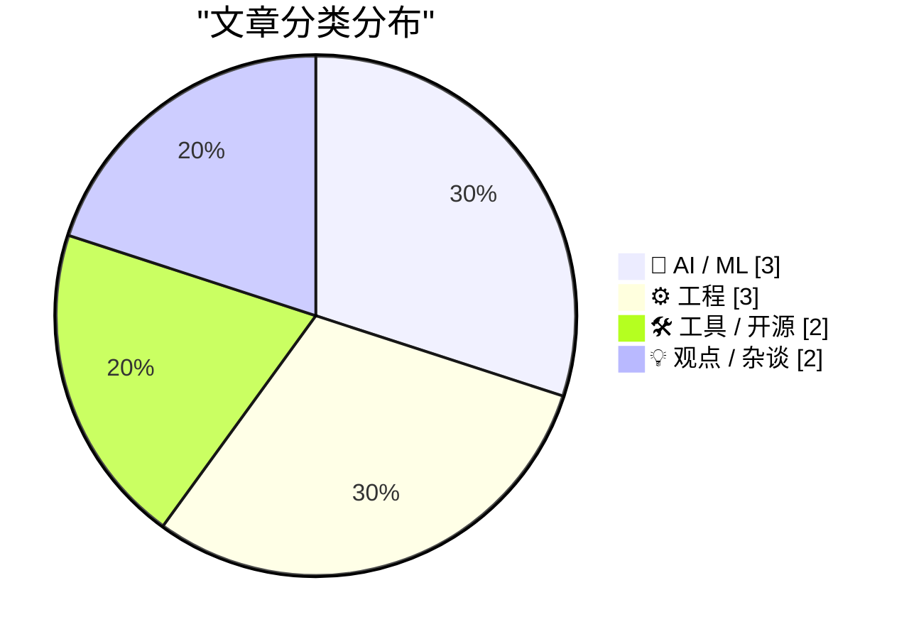
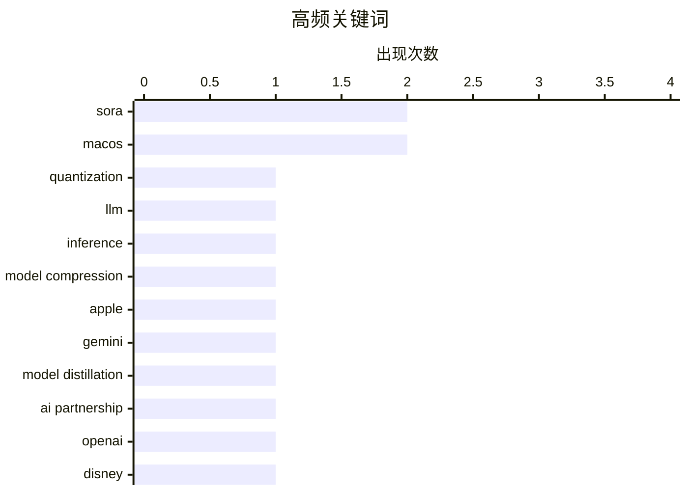

# 📰 AI 博客每日精选 — 2026-03-27

> 来自 Karpathy 推荐的 92 个顶级技术博客，AI 精选 Top 10

## 📝 今日看点

今天技术圈的主线之一是大模型进入“效率优先”阶段：量化、蒸馏等技术被持续推到前台，核心矛盾从“能不能做”转向“如何在成本、性能与精度之间做工程化取舍”。与此同时，AI 商业叙事明显降温，围绕 Sora 与 OpenAI 的合作起伏、内容产业态度转向，释放出资本和生态正从激进押注走向谨慎重估的信号。另一条并行趋势是平台与工程基本功回归焦点——从浏览器跑分争议、系统更新与充电体验，到“写简单代码更有价值”的讨论，行业正在重新强调可验证指标、真实用户体验和可维护性。

---

## 🏆 今日必读

🥇 **从零开始理解量化**

[Quantization from the ground up](https://simonwillison.net/2026/Mar/26/quantization-from-the-ground-up/#atom-everything) — simonwillison.net · 6 小时前 · 🤖 AI / ML

> 核心主题是解释大语言模型（LLM）量化的底层机制，以及为什么量化既能省资源又会带来精度风险。文章通过交互式可视化拆解了浮点数的二进制表示方式，把权重从 FP32/高精度映射到低比特表示（如更低位宽整数）的过程讲清楚了。重点指出量化中的“离群值（outlier values）”问题：少量超出常见小数值分布的权重会显著拉低量化效果，需要用更精细的策略处理。内容还强调了量化并非单一步骤，而是精度、模型体积、推理速度与硬件约束之间的工程权衡。结论是，真正理解量化要从数值表示和分布特性出发，而不是只把它当成“压缩模型”的黑盒技巧。

💡 **为什么值得读**: 值得读在于它把常被一笔带过的量化细节（尤其是浮点表示与离群值影响）讲成了可直观看懂的工程知识，能直接提升你做模型部署与优化的判断力。

🏷️ quantization, LLM, inference, model compression

🥈 **The Information: ‘Apple Can “Distill” Google’s Big Gemini Model’**

[The Information: ‘Apple Can “Distill” Google’s Big Gemini Model’](https://www.theinformation.com/newsletters/ai-agenda/apple-can-distill-googles-big-gemini-model?rc=jfy0lk) — daringfireball.net · 5 小时前 · 🤖 AI / ML

> Jessica E. Lessin, Amir Efrati, and Erin Woo, reporting for the paywalled-without-gift-links The Information: While we have reported that Apple can tweak, or fine-tune, a version of Google’s Gemini AI

🏷️ Apple, Gemini, model distillation, AI partnership

🥉 **Disney Drops Vaporware $1B Investment in OpenAI After Sora Got Axed**

[Disney Drops Vaporware $1B Investment in OpenAI After Sora Got Axed](https://variety.com/2026/digital/news/openai-shutting-down-sora-video-disney-1236698277/) — daringfireball.net · 3 小时前 · 🤖 AI / ML

> Todd Spangler, reporting for Variety: Disney has now ended its partnership with OpenAI, which included plans for the media conglomerate to take a $1 billion stake in the artificial-intelligence compan

🏷️ OpenAI, Disney, Sora, partnership

---

## 📊 数据概览

| 扫描源 | 抓取文章 | 时间范围 | 精选 |
|:---:|:---:|:---:|:---:|
| 89/92 | 2528 篇 → 22 篇 | 24h | **10 篇** |

### 分类分布



### 高频关键词



<details>
<summary>📈 纯文本关键词图（终端友好）</summary>

```
sora               │ ████████████████████ 2
macos              │ ████████████████████ 2
quantization       │ ██████████░░░░░░░░░░ 1
llm                │ ██████████░░░░░░░░░░ 1
inference          │ ██████████░░░░░░░░░░ 1
model compression  │ ██████████░░░░░░░░░░ 1
apple              │ ██████████░░░░░░░░░░ 1
gemini             │ ██████████░░░░░░░░░░ 1
model distillation │ ██████████░░░░░░░░░░ 1
ai partnership     │ ██████████░░░░░░░░░░ 1
```

</details>

### 🏷️ 话题标签

**sora**(2) · **macos**(2) · **quantization**(1) · llm(1) · inference(1) · model compression(1) · apple(1) · gemini(1) · model distillation(1) · ai partnership(1) · openai(1) · disney(1) · partnership(1) · android(1) · web performance(1) · benchmark(1) · chromium(1) · software updates(1) · device management(1) · mr. macintosh(1)

---

## 🤖 AI / ML

### 1. 从零开始理解量化

[Quantization from the ground up](https://simonwillison.net/2026/Mar/26/quantization-from-the-ground-up/#atom-everything) — **simonwillison.net** · 6 小时前 · ⭐ 26/30

> 核心主题是解释大语言模型（LLM）量化的底层机制，以及为什么量化既能省资源又会带来精度风险。文章通过交互式可视化拆解了浮点数的二进制表示方式，把权重从 FP32/高精度映射到低比特表示（如更低位宽整数）的过程讲清楚了。重点指出量化中的“离群值（outlier values）”问题：少量超出常见小数值分布的权重会显著拉低量化效果，需要用更精细的策略处理。内容还强调了量化并非单一步骤，而是精度、模型体积、推理速度与硬件约束之间的工程权衡。结论是，真正理解量化要从数值表示和分布特性出发，而不是只把它当成“压缩模型”的黑盒技巧。

🏷️ quantization, LLM, inference, model compression

---

### 2. The Information: ‘Apple Can “Distill” Google’s Big Gemini Model’

[The Information: ‘Apple Can “Distill” Google’s Big Gemini Model’](https://www.theinformation.com/newsletters/ai-agenda/apple-can-distill-googles-big-gemini-model?rc=jfy0lk) — **daringfireball.net** · 5 小时前 · ⭐ 26/30

> Jessica E. Lessin, Amir Efrati, and Erin Woo, reporting for the paywalled-without-gift-links The Information: While we have reported that Apple can tweak, or fine-tune, a version of Google’s Gemini AI

🏷️ Apple, Gemini, model distillation, AI partnership

---

### 3. Disney Drops Vaporware $1B Investment in OpenAI After Sora Got Axed

[Disney Drops Vaporware $1B Investment in OpenAI After Sora Got Axed](https://variety.com/2026/digital/news/openai-shutting-down-sora-video-disney-1236698277/) — **daringfireball.net** · 3 小时前 · ⭐ 24/30

> Todd Spangler, reporting for Variety: Disney has now ended its partnership with OpenAI, which included plans for the media conglomerate to take a $1 billion stake in the artificial-intelligence compan

🏷️ OpenAI, Disney, Sora, partnership

---

## ⚙️ 工程

### 4. Google Brags About Android Web Browser Benchmark Scores on Unnamed Devices; Gullible Reporters Fall for It

[Google Brags About Android Web Browser Benchmark Scores on Unnamed Devices; Gullible Reporters Fall for It](https://blog.chromium.org/2026/03/android-sets-new-record-for-mobile-web.html) — **daringfireball.net** · 3 小时前 · ⭐ 22/30

> Chrome engineer Eric Seckler, on Google’s Chromium Blog, under the bold headline “ Android Sets New Record for Mobile Web Performance ”: Today, we are proud to celebrate a major milestone: Android is 

🏷️ Android, web performance, benchmark, Chromium

---

### 5. SQLAlchemy 2 In Practice - Chapter 2 - Database Tables

[SQLAlchemy 2 In Practice - Chapter 2 - Database Tables](https://blog.miguelgrinberg.com/post/sqlalchemy-2-in-practice---chapter-1---database-tables) — **miguelgrinberg.com** · 10 小时前 · ⭐ 19/30

> This is the second chapter of my SQLAlchemy 2 in Practice book. If you'd like to support my work, I encourage you to buy this book, either directly from my store or on Amazon . Thank you! This chapter

🏷️ SQLAlchemy, Python, database tables, ORM

---

### 6. Why doesn’t WM_ENTER­IDLE work if the dialog box is a Message­Box?

[Why doesn’t WM_ENTER­IDLE work if the dialog box is a Message­Box?](https://devblogs.microsoft.com/oldnewthing/20260326-00/?p=112167) — **devblogs.microsoft.com/oldnewthing** · 9 小时前 · ⭐ 18/30

> Because it opted out. The post Why doesn’t WM_ ENTER&shy;IDLE work if the dialog box is a Message&shy;Box ? appeared first on The Old New Thing .

🏷️ Win32, WM_ENTERIDLE, MessageBox, Windows API

---

## 🛠 工具 / 开源

### 7. Mr. Macintosh Explains Another Way to Block the Software Update Prompts for MacOS 26 Tahoe

[Mr. Macintosh Explains Another Way to Block the Software Update Prompts for MacOS 26 Tahoe](https://www.youtube.com/watch?v=uRg1pW8TSYk) — **daringfireball.net** · 8 小时前 · ⭐ 22/30

> Last month I posted an item (linking to a post from Rob Griffiths ) explaining how to hide the prompts in System Settings to upgrade to MacOS 26 Tahoe. The technique I posted involved hand-editing a d

🏷️ macOS, software updates, device management, Mr. Macintosh

---

### 8. MacOS 26.4 Adds ‘Slow Charger’ Indicator for MacBooks

[MacOS 26.4 Adds ‘Slow Charger’ Indicator for MacBooks](https://www.macrumors.com/2026/03/25/macos-tahoe-26-4-slow-charger-macbooks/) — **daringfireball.net** · 5 小时前 · ⭐ 19/30

> Tim Hardwick at MacRumors: macOS Tahoe 26.4 includes a new slow charger indicator that tells MacBook users when their charging setup isn’t delivering full power. As described in an updated Apple suppo

🏷️ macOS, MacBook, charging, battery status

---

## 💡 观点 / 杂谈

### 9. Katie Notopoulos Bids Farewell to Sora: ‘You Were Too Beautiful and Stupid for This World’

[Katie Notopoulos Bids Farewell to Sora: ‘You Were Too Beautiful and Stupid for This World’](https://www.businessinsider.com/sora-openai-chatgpt-sam-altman-ai-shutting-down-farewell-why-2026-3) — **daringfireball.net** · 5 小时前 · ⭐ 21/30

> Katie Notopoulos, my favorite Sora user, at Business Insider (paywalled, alas, but available via News+ ): Eventually, my friends all seemed to get bored with the app . As I do at most parties, I stuck

🏷️ Sora, generative video, user adoption, product hype

---

### 10. Engineers do get promoted for writing simple code

[Engineers do get promoted for writing simple code](https://seangoedecke.com/simple-work-gets-rewarded/) — **seangoedecke.com** · 23 小时前 · ⭐ 20/30

> It’s a popular joke among software engineers that writing overcomplicated, unmaintainable code is a pathway to job security. After all, if you’re the only person who can work on a system, they can’t f

🏷️ code simplicity, career growth, maintainability, engineering culture

---

*生成于 2026-03-27 07:03 | 扫描 89 源 → 获取 2528 篇 → 精选 10 篇*
*基于 [Hacker News Popularity Contest 2025](https://refactoringenglish.com/tools/hn-popularity/) RSS 源列表*
