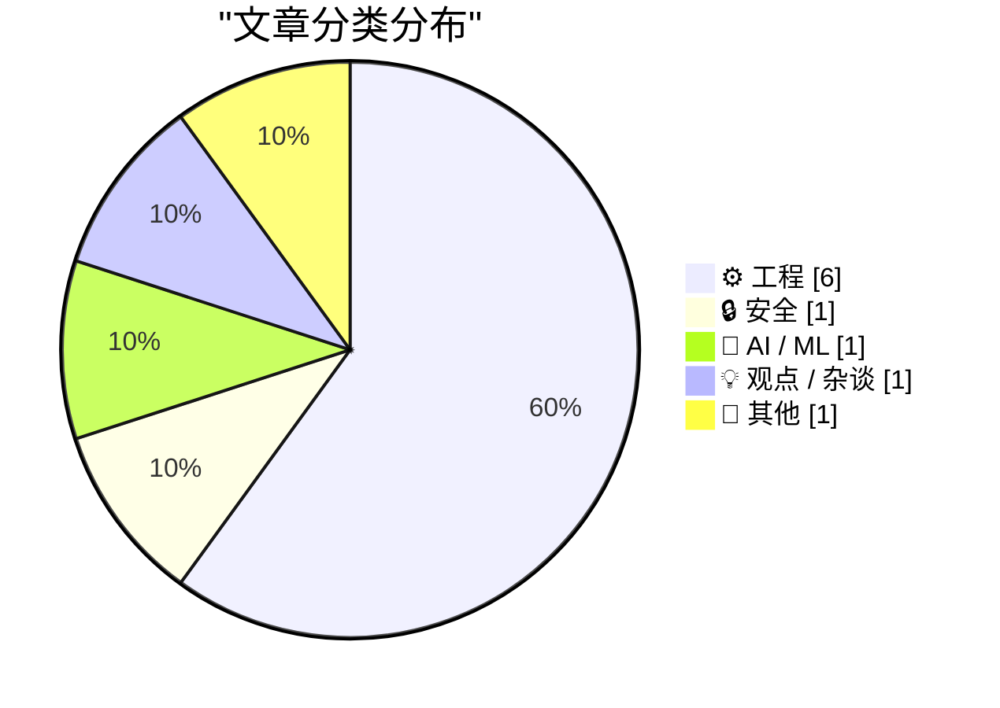
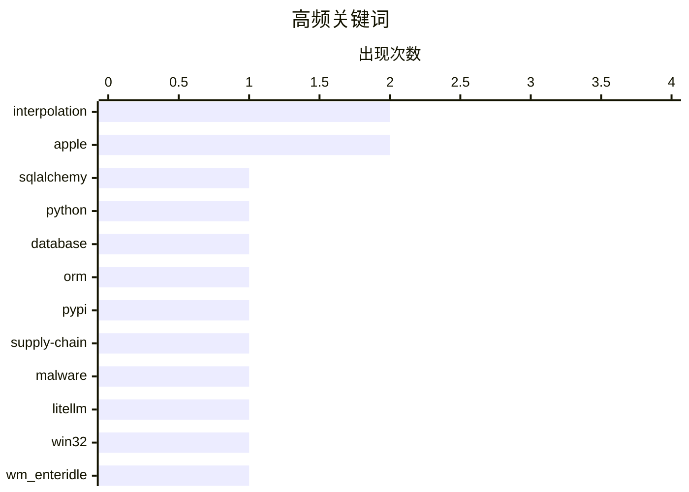

# 📰 AI 博客每日精选 — 2026-03-27

> 来自 Karpathy 推荐的 92 个顶级技术博客，AI 精选 Top 10

## 📝 今日看点

今天的技术话题集中在三条主线：一是开发效率进入“AI重构期”，从一天内重写核心组件并显著降本，到数据库与系统底层实践内容升温，工程团队正同时追求速度与可维护性。二是安全风险与供应链信任被再次拉到台前，针对恶意攻击的实时应急复盘说明，AI基础设施越普及，安全响应能力越成为硬指标。三是科技产业叙事出现分化：一边是大模型投资与商业预期的摇摆，另一边是苹果硬件路线引发的产品战略争议，显示“技术能做什么”正让位于“公司到底要去哪”。

---

## 🏆 今日必读

🥇 **SQLAlchemy 2 实战——第 2 章：数据库表**

[SQLAlchemy 2 In Practice - Chapter 2 - Database Tables](https://blog.miguelgrinberg.com/post/sqlalchemy-2-in-practice---chapter-1---database-tables) — miguelgrinberg.com · 20 小时前 · ⚙️ 工程

> 根据摘录可见，这一章聚焦 SQLAlchemy 2 中“数据库表”的基础用法，覆盖创建、更新与查询表。内容首先区分了 SQLAlchemy Core 与 ORM：Core 提供数据库方言集成、表结构描述与 SQL 生成能力，ORM 通过对象关系映射让很多数据库操作可由 Python 对象行为自动推导。作者给出“混合使用 Core 与 ORM”的学习路径，而非只用单一模块。摘录还展示了通过 `create_engine()` 和 `DATABASE_URL` 环境变量创建 engine 的 `db.py` 示例，并列出 `echo=True`、`pool_size`（默认最多 5）、`max_overflow`（默认 10）、`future=True`（用于 SQLAlchemy 1.4 启用 2.0 API）等关键配置项。结论上，这章定位为后续关系建模章节之前的基础铺垫，核心是先掌握 engine 与模型定义的最小必备能力。

💡 **为什么值得读**: 值得读在于它把 SQLAlchemy Core/ORM 分工与 `create_engine()` 的高频实战参数放在同一入门路径里，便于快速搭起可调试、可扩展的数据库层。

🏷️ SQLAlchemy, Python, database, ORM

🥈 **My minute-by-minute response to the LiteLLM malware attack**

[My minute-by-minute response to the LiteLLM malware attack](https://simonwillison.net/2026/Mar/26/response-to-the-litellm-malware-attack/#atom-everything) — simonwillison.net · 9 小时前 · 🔒 安全

> Simon Willison’s Weblog Subscribe Sponsored by: WorkOS &mdash; Ready to sell to Enterprise clients? Build and ship securely with WorkOS. 26th March 2026 - Link Blog My minute-by-minute response to the

🏷️ PyPI, supply-chain, malware, LiteLLM

🥉 **Why doesn’t WM_ENTER­IDLE work if the dialog box is a Message­Box?**

[Why doesn’t WM_ENTER­IDLE work if the dialog box is a Message­Box?](https://devblogs.microsoft.com/oldnewthing/20260326-00/?p=112167) — devblogs.microsoft.com/oldnewthing · 18 小时前 · ⚙️ 工程

> Dev Blogs The Old New Thing Why doesn’t WM_ENTER&shy;IDLE work if the dialog box is a Message&shy;Box? March 26th, 2026 2 reactions Why doesn’t WM_ ENTER&shy;IDLE work if the dialog box is a Message&s

🏷️ Win32, WM_ENTERIDLE, MessageBox, dialog loop

---

## 📊 数据概览

| 扫描源 | 抓取文章 | 时间范围 | 精选 |
|:---:|:---:|:---:|:---:|
| 88/92 | 2503 篇 → 25 篇 | 24h | **10 篇** |

### 分类分布



### 高频关键词



<details>
<summary>📈 纯文本关键词图（终端友好）</summary>

```
interpolation │ ████████████████████ 2
apple         │ ████████████████████ 2
sqlalchemy    │ ██████████░░░░░░░░░░ 1
python        │ ██████████░░░░░░░░░░ 1
database      │ ██████████░░░░░░░░░░ 1
orm           │ ██████████░░░░░░░░░░ 1
pypi          │ ██████████░░░░░░░░░░ 1
supply-chain  │ ██████████░░░░░░░░░░ 1
malware       │ ██████████░░░░░░░░░░ 1
litellm       │ ██████████░░░░░░░░░░ 1
```

</details>

### 🏷️ 话题标签

**interpolation**(2) · **apple**(2) · **sqlalchemy**(1) · python(1) · database(1) · orm(1) · pypi(1) · supply-chain(1) · malware(1) · litellm(1) · win32(1) · wm_enteridle(1) · messagebox(1) · dialog loop(1) · human.json(1) · wordpress(1) · identity(1) · web trust(1) · jsonata(1) · go(1)

---

## ⚙️ 工程

### 1. SQLAlchemy 2 实战——第 2 章：数据库表

[SQLAlchemy 2 In Practice - Chapter 2 - Database Tables](https://blog.miguelgrinberg.com/post/sqlalchemy-2-in-practice---chapter-1---database-tables) — **miguelgrinberg.com** · 20 小时前 · ⭐ 24/30

> 根据摘录可见，这一章聚焦 SQLAlchemy 2 中“数据库表”的基础用法，覆盖创建、更新与查询表。内容首先区分了 SQLAlchemy Core 与 ORM：Core 提供数据库方言集成、表结构描述与 SQL 生成能力，ORM 通过对象关系映射让很多数据库操作可由 Python 对象行为自动推导。作者给出“混合使用 Core 与 ORM”的学习路径，而非只用单一模块。摘录还展示了通过 `create_engine()` 和 `DATABASE_URL` 环境变量创建 engine 的 `db.py` 示例，并列出 `echo=True`、`pool_size`（默认最多 5）、`max_overflow`（默认 10）、`future=True`（用于 SQLAlchemy 1.4 启用 2.0 API）等关键配置项。结论上，这章定位为后续关系建模章节之前的基础铺垫，核心是先掌握 engine 与模型定义的最小必备能力。

🏷️ SQLAlchemy, Python, database, ORM

---

### 2. Why doesn’t WM_ENTER­IDLE work if the dialog box is a Message­Box?

[Why doesn’t WM_ENTER­IDLE work if the dialog box is a Message­Box?](https://devblogs.microsoft.com/oldnewthing/20260326-00/?p=112167) — **devblogs.microsoft.com/oldnewthing** · 18 小时前 · ⭐ 22/30

> Dev Blogs The Old New Thing Why doesn’t WM_ENTER&shy;IDLE work if the dialog box is a Message&shy;Box? March 26th, 2026 2 reactions Why doesn’t WM_ ENTER&shy;IDLE work if the dialog box is a Message&s

🏷️ Win32, WM_ENTERIDLE, MessageBox, dialog loop

---

### 3. Adding human.json to WordPress

[Adding human.json to WordPress](https://shkspr.mobi/blog/2026/03/adding-human-json-to-wordpress/) — **shkspr.mobi** · 20 小时前 · ⭐ 21/30

> Terence Eden’s Blog Theme Switcher: 🌒 Dark 🌞 Light 📰 eInk 💻 xterm 🥴 Drunk 👻 Nude ♻️ Reset Adding human.json to WordPress AI humans WordPress · 3 comments · 800 words · Viewed ~281 times Every fe

🏷️ human.json, WordPress, identity, web trust

---

### 4. We Rewrote JSONata with AI in a Day, Saved $500K/Year

[We Rewrote JSONata with AI in a Day, Saved $500K/Year](https://simonwillison.net/2026/Mar/27/vine-porting-jsonata/#atom-everything) — **simonwillison.net** · 8 小时前 · ⭐ 20/30

> Simon Willison’s Weblog Subscribe Sponsored by: WorkOS &mdash; Ready to sell to Enterprise clients? Build and ship securely with WorkOS. 27th March 2026 - Link Blog We Rewrote JSONata with AI in a Day

🏷️ JSONata, Go, LLM, test-suite

---

### 5. Lebesgue constants

[Lebesgue constants](https://www.johndcook.com/blog/2026/03/26/lebesgue-constants/) — **johndcook.com** · 12 小时前 · ⭐ 18/30

> class="entry-content"> I alluded to Lebesgue constants in the previous post without giving them a name. There I said that the bound on order n interpolation error has the form where h is the spacing b

🏷️ Lebesgue constant, interpolation, Chebyshev nodes, numerical analysis

---

### 6. How much precision can you squeeze out of a table?

[How much precision can you squeeze out of a table?](https://www.johndcook.com/blog/2026/03/26/table-precision/) — **johndcook.com** · 18 小时前 · ⭐ 18/30

> class="entry-content"> Richard Feynman said that almost everything becomes interesting if you look into it deeply enough. Looking up numbers in a table is certainly not interesting, but it becomes mor

🏷️ interpolation, numerical-analysis, precision, error-bounds

---

## 🔒 安全

### 7. My minute-by-minute response to the LiteLLM malware attack

[My minute-by-minute response to the LiteLLM malware attack](https://simonwillison.net/2026/Mar/26/response-to-the-litellm-malware-attack/#atom-everything) — **simonwillison.net** · 9 小时前 · ⭐ 23/30

> Simon Willison’s Weblog Subscribe Sponsored by: WorkOS &mdash; Ready to sell to Enterprise clients? Build and ship securely with WorkOS. 26th March 2026 - Link Blog My minute-by-minute response to the

🏷️ PyPI, supply-chain, malware, LiteLLM

---

## 🤖 AI / ML

### 8. Disney Drops Vaporware $1B Investment in OpenAI After Sora Got Axed

[Disney Drops Vaporware $1B Investment in OpenAI After Sora Got Axed](https://variety.com/2026/digital/news/openai-shutting-down-sora-video-disney-1236698277/) — **daringfireball.net** · 13 小时前 · ⭐ 22/30

> Plus Icon Film Plus Icon TV Plus Icon What To Watch Plus Icon Music Plus Icon Docs Plus Icon Digital & Gaming Plus Icon Global Plus Icon Awards Circuit Plus Icon Video Plus Icon What To Hear Plus Icon

🏷️ OpenAI, Sora, Disney, investment

---

## 💡 观点 / 杂谈

### 9. I Can't See Apple's Vision

[I Can't See Apple's Vision](https://matduggan.com/i-cant-see-apples-vision/) — **matduggan.com** · 21 小时前 · ⭐ 18/30

> class="post-content"> Companies, as they grow to become multi-billion-dollar entities, somehow lose their vision. They insert lots of layers of middle management between the people running the company

🏷️ Apple, product-design, management, UX

---

## 📝 其他

### 10. Apple Discontinues the Mac Pro With No Plans to Bring It Back

[Apple Discontinues the Mac Pro With No Plans to Bring It Back](https://9to5mac.com/2026/03/26/apple-discontinues-the-mac-pro/) — **daringfireball.net** · 8 小时前 · ⭐ 20/30

> Mac Mac Pro Apple discontinues the Mac Pro with no plans for future hardware Chance Miller | Mar 26 2026 - 2:00 pm PT 42 Comments It’s the end of an era: Apple has confirmed to 9to5Mac that the Mac Pr

🏷️ Apple, Mac Pro, Mac Studio, hardware

---

*生成于 2026-03-27 16:58 | 扫描 88 源 → 获取 2503 篇 → 精选 10 篇*
*基于 [Hacker News Popularity Contest 2025](https://refactoringenglish.com/tools/hn-popularity/) RSS 源列表*
