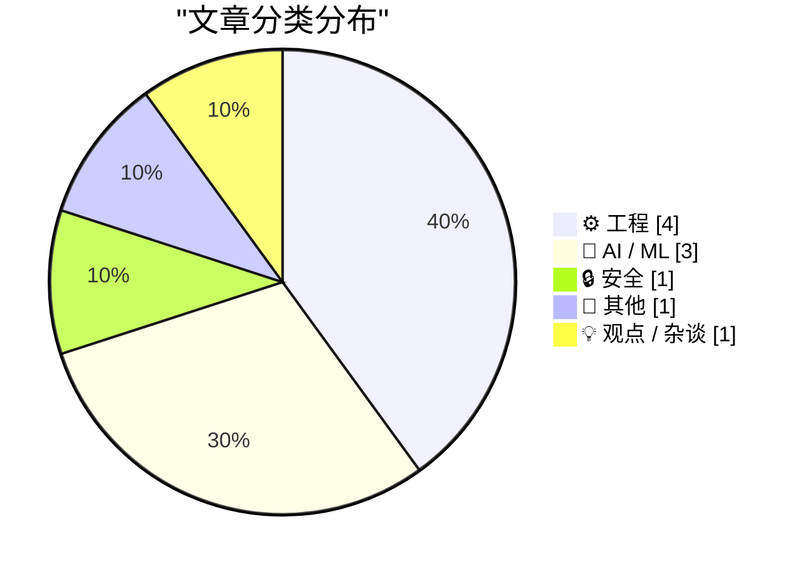
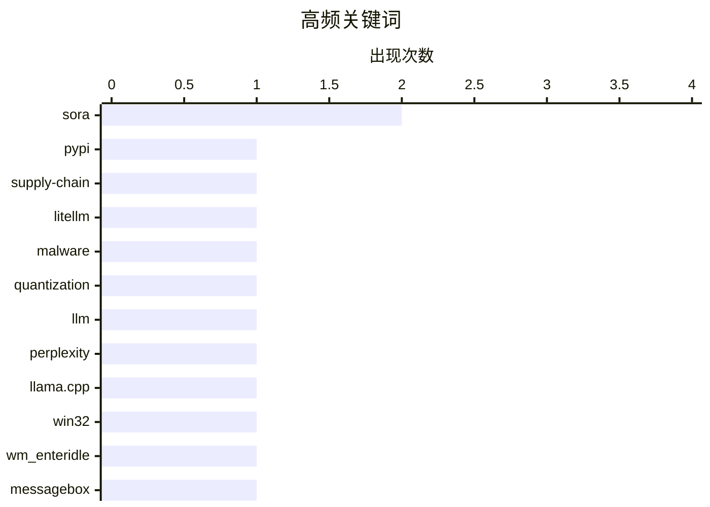

# 📰 AI 博客每日精选 — 2026-03-27

> 来自 Karpathy 推荐的 92 个顶级技术博客，AI 精选 Top 10

## 📝 今日看点

今天技术圈的主线很清晰：一边是供应链与平台风险在加速暴露，另一边是AI商业化进入“降温与重估”阶段。LiteLLM 恶意包事件再次提醒开发者，开源依赖与包管理生态的安全响应速度，已经成为工程体系的生命线。与此同时，Sora 的关闭与合作撤资表明，生成式AI正从“炫技产品期”转向“成本、稳定性与可持续回报”主导的现实考核。与之呼应，关于模型量化、底层计算与经典硬件/数学问题的讨论升温，说明行业注意力正在回到“基础能力优化”而非单纯追逐新概念。

---

## 🏆 今日必读

🥇 **我对 LiteLLM 恶意软件攻击的逐分钟响应**

[My minute-by-minute response to the LiteLLM malware attack](https://simonwillison.net/2026/Mar/26/response-to-the-litellm-malware-attack/#atom-everything) — simonwillison.net · 12 小时前 · 🔒 安全

> 根据摘录可见，核心事件是 LiteLLM 1.82.8 版本在 PyPI 上被发现包含恶意代码，并且当时仍可被安装与升级。Callum McMahon 向 PyPI 报告了该安全事件，并公开了用于确认漏洞与决定处置方式的 Claude 对话记录。记录显示在隔离 Docker 容器中检查到 `litellm_init.pth`，并出现通过 `base64` 解码后执行代码的可疑载荷，且 Claude 建议立即联系 `security@pypi.org`。作者还提到这次案例使用了他提供的 `claude-code-transcripts` 工具来发布完整对话证据。作者立场明显支持这种“AI 辅助验证 + 透明披露”的应急响应方式，以加快供应链安全事件上报。

💡 **为什么值得读**: 它把一次真实的 PyPI 供应链攻击处置过程压缩成可复用的实战样例，尤其适合关注开源依赖安全与 AI 辅助应急流程的人快速借鉴。

🏷️ PyPI, supply-chain, LiteLLM, malware

🥈 **从零开始理解量化**

[Quantization from the ground up](https://simonwillison.net/2026/Mar/26/quantization-from-the-ground-up/#atom-everything) — simonwillison.net · 20 小时前 · 🤖 AI / ML

> 根据摘录可见，这是一篇链接解读，核心聚焦于大语言模型量化的工作机制及其对模型质量的影响。文中强调了一个关键细节：量化中的离群值（outlier values）虽然数量很少，却可能对模型表现至关重要；摘录提到即使移除单个 Apple 所称的“super weight”，也可能让模型输出变成乱码。实际量化方案因此会专门保护这些离群值，例如不对其量化，或将其位置与数值单独存表后再处理其所在块。文章还通过 perplexity、KL divergence、llama.cpp 的 perplexity 工具与 GPQA 基准测试，展示不同量化级别对 Qwen 3.5 9B 的影响。给出的结论是：16-bit 到 8-bit 几乎没有质量损失，16-bit 到 4-bit 会更明显，但整体仍接近原始效果的约 90%（取决于衡量方式）。

💡 **为什么值得读**: 它把“量化为何可行、何处会失真、失真有多大”这三个工程上最关键的问题用可操作的指标和实测结论串在一起，能直接指导模型压缩选型。

🏷️ quantization, LLM, perplexity, llama.cpp

🥉 **为什么当对话框是 MessageBox 时，WM_ENTERIDLE 不起作用？**

[Why doesn’t WM_ENTERIDLE work if the dialog box is a MessageBox?](https://devblogs.microsoft.com/oldnewthing/20260326-00/?p=112167) — devblogs.microsoft.com/oldnewthing · 22 小时前 · ⚙️ 工程

> 核心问题是：把示例中的 GetOpenFileName 换成 MessageBox 后，为什么收不到 WM_ENTERIDLE。文中给出的关键原因是，对话框模板可通过 DS_NOIDLEMSG 样式抑制 WM_ENTERIDLE，而 MessageBox 使用的模板正是如此。由此可见，依赖 WM_ENTERIDLE 的“空闲前接管”技巧并非对所有对话框都通用，它需要对话框配合，不要禁用该消息。作者还指出了一个延伸方向：如果对话框本身希望获知其消息循环将要空闲，以便自定义循环逻辑，将在后续继续讨论。结论是，WM_ENTERIDLE 失效并非调用方式错误，而是 MessageBox 模板主动关闭了该通知机制。

💡 **为什么值得读**: 值得读在于它精准解释了 Windows 对话框消息行为里一个常见“看起来异常”的细节，并直接给出可操作的判断条件（DS_NOIDLEMSG）。

🏷️ Win32, WM_ENTERIDLE, MessageBox, dialog loop

---

## 📊 数据概览

| 扫描源 | 抓取文章 | 时间范围 | 精选 |
|:---:|:---:|:---:|:---:|
| 89/92 | 2528 篇 → 25 篇 | 24h | **10 篇** |

### 分类分布



### 高频关键词



<details>
<summary>📈 纯文本关键词图（终端友好）</summary>

```
sora         │ ████████████████████ 2
pypi         │ ██████████░░░░░░░░░░ 1
supply-chain │ ██████████░░░░░░░░░░ 1
litellm      │ ██████████░░░░░░░░░░ 1
malware      │ ██████████░░░░░░░░░░ 1
quantization │ ██████████░░░░░░░░░░ 1
llm          │ ██████████░░░░░░░░░░ 1
perplexity   │ ██████████░░░░░░░░░░ 1
llama.cpp    │ ██████████░░░░░░░░░░ 1
win32        │ ██████████░░░░░░░░░░ 1
```

</details>

### 🏷️ 话题标签

**sora**(2) · **pypi**(1) · **supply-chain**(1) · litellm(1) · malware(1) · quantization(1) · llm(1) · perplexity(1) · llama.cpp(1) · win32(1) · wm_enteridle(1) · messagebox(1) · dialog loop(1) · bell labs(1) · transistor(1) · amplifier(1) · technology history(1) · complex numbers(1) · sine(1) · cosine(1)

---

## ⚙️ 工程

### 1. 为什么当对话框是 MessageBox 时，WM_ENTERIDLE 不起作用？

[Why doesn’t WM_ENTERIDLE work if the dialog box is a MessageBox?](https://devblogs.microsoft.com/oldnewthing/20260326-00/?p=112167) — **devblogs.microsoft.com/oldnewthing** · 22 小时前 · ⭐ 22/30

> 核心问题是：把示例中的 GetOpenFileName 换成 MessageBox 后，为什么收不到 WM_ENTERIDLE。文中给出的关键原因是，对话框模板可通过 DS_NOIDLEMSG 样式抑制 WM_ENTERIDLE，而 MessageBox 使用的模板正是如此。由此可见，依赖 WM_ENTERIDLE 的“空闲前接管”技巧并非对所有对话框都通用，它需要对话框配合，不要禁用该消息。作者还指出了一个延伸方向：如果对话框本身希望获知其消息循环将要空闲，以便自定义循环逻辑，将在后续继续讨论。结论是，WM_ENTERIDLE 失效并非调用方式错误，而是 MessageBox 模板主动关闭了该通知机制。

🏷️ Win32, WM_ENTERIDLE, MessageBox, dialog loop

---

### 2. 仅用实函数计算复数自变量的正弦与余弦

[Computing sine and cosine of complex arguments with only real functions](https://www.johndcook.com/blog/2026/03/27/complex-argument/) — **johndcook.com** · 1 小时前 · ⭐ 19/30

> 核心问题是在只支持实数输入的计算器或数学库中，如何计算 σin(3+4i) 这类复数自变量三角函数。文中给出基于加法公式的恒等式，把复数正弦和余弦分解为实函数 sin、cos、sinh、cosh 的组合：sin(x+iy)=sin(x)cosh(y)+i cos(x)sinh(y)，cos(x+iy)=cos(x)cosh(y)-i sin(x)sinh(y)。示例使用 Python 内置 math（不接受复数）手写 complex_sin 与 complex_cos，并以 z=3+4j 演示计算流程。随后将结果与 NumPy 的 np.sin/np.cos（支持复数输入）对比，并通过断言验证两者一致。结论是即使没有 NumPy，也可以仅依赖实函数可靠地完成复数三角函数计算。

🏷️ complex numbers, sine, cosine, Python

---

### 3. Lebesgue constants

[Lebesgue constants](https://www.johndcook.com/blog/2026/03/26/lebesgue-constants/) — **johndcook.com** · 16 小时前 · ⭐ 18/30

> I alluded to Lebesgue constants in the previous post without giving them a name. There I said that the bound on order n interpolation error has the form where h is the spacing between interpolation po

🏷️ interpolation, Lebesgue constant, Chebyshev nodes, numerical analysis

---

### 4. AMD K5 处理器：并未达到 AMD 的预期

[AMD K5 CPU: Not quite what AMD hoped](https://dfarq.homeip.net/amd-k5-cpu-not-quite-what-amd-hoped/?utm_source=rss&#038;utm_medium=rss&#038;utm_campaign=amd-k5-cpu-not-quite-what-amd-hoped) — **dfarq.homeip.net** · 1 小时前 · ⭐ 14/30

> K5 是 AMD 首款完全自主研发的 x86 处理器，目标直指 Intel Pentium，并承载了 AMD 在 486 之后必须走独立设计路线的战略转向。其架构采用“x86 解码前端 + 高并行 RISC 内核”，包含 430 万晶体管、5 个可乱序执行的整数单元、1 个浮点单元、寄存器重命名、推测执行，以及 16KB 指令缓存和 8KB 数据缓存，内部设计思路更接近 Pentium Pro。发布时间上，K5 于 1996 年 3 月 27 日上市，较首代 Pentium 晚约 4 年，且初期频率仅到 90MHz，而同期 Intel 已到 200MHz，Cyrix 与 NexGen 也分别达到等效 166MHz 和 133MHz。性能上，早期 75/90MHz 型号大致与 Pentium 持平，后期型号单位频率性能明显更强，并采用类似 Cyrix 的 PR 标注；例如 K5-PR200 实际为 133MHz/66MHz 总线，而文中提到 Cyrix 6x86 需以 150MHz 运行。作者观点是，K5 在纸面规格和架构理念上很有竞争力，但工程落地未完全兑现其技术潜力，最终“雄心大于结果”。

🏷️ AMD K5, x86, CPU history, microarchitecture

---

## 🤖 AI / ML

### 5. 从零开始理解量化

[Quantization from the ground up](https://simonwillison.net/2026/Mar/26/quantization-from-the-ground-up/#atom-everything) — **simonwillison.net** · 20 小时前 · ⭐ 22/30

> 根据摘录可见，这是一篇链接解读，核心聚焦于大语言模型量化的工作机制及其对模型质量的影响。文中强调了一个关键细节：量化中的离群值（outlier values）虽然数量很少，却可能对模型表现至关重要；摘录提到即使移除单个 Apple 所称的“super weight”，也可能让模型输出变成乱码。实际量化方案因此会专门保护这些离群值，例如不对其量化，或将其位置与数值单独存表后再处理其所在块。文章还通过 perplexity、KL divergence、llama.cpp 的 perplexity 工具与 GPQA 基准测试，展示不同量化级别对 Qwen 3.5 9B 的影响。给出的结论是：16-bit 到 8-bit 几乎没有质量损失，16-bit 到 4-bit 会更明显，但整体仍接近原始效果的约 90%（取决于衡量方式）。

🏷️ quantization, LLM, perplexity, llama.cpp

---

### 6. OpenAI 将关闭 Sora 视频应用；迪士尼取消 10 亿美元投资计划

[Disney Drops Vaporware $1B Investment in OpenAI After Sora Got Axed](https://variety.com/2026/digital/news/openai-shutting-down-sora-video-disney-1236698277/) — **daringfireball.net** · 17 小时前 · ⭐ 20/30

> 核心事件是 OpenAI 宣布停止其生成式 AI 视频应用 Sora，而迪士尼随即终止与其相关的合作与投资安排。OpenAI 仅发布告别声明并表示后续会公布应用与 API 时间线及作品保存细节，未说明关停原因。根据文中信息，双方在三个月前刚签署为期三年的授权协议，原计划让 Sora 使用 200 多个迪士尼、漫威、皮克斯和《星球大战》角色素材生成“粉丝灵感”视频，并在 Disney+ 做精选分发。该合作还包含迪士尼拟对 OpenAI 进行 10 亿美元持股投资，但现已一并取消。迪士尼表态称尊重 OpenAI 退出视频生成业务的决定，并将继续与其他 AI 平台合作探索触达粉丝的新方式。

🏷️ OpenAI, Sora, Disney, investment

---

### 7. 凯蒂·诺托普洛斯向 Sora 告别：‘你太美，也太蠢，不适合这个世界’

[Katie Notopoulos Bids Farewell to Sora: ‘You Were Too Beautiful and Stupid for This World’](https://www.businessinsider.com/sora-openai-chatgpt-sam-altman-ai-shutting-down-farewell-why-2026-3) — **daringfireball.net** · 19 小时前 · ⭐ 21/30

> 根据摘录可见，文章围绕 OpenAI 关闭独立视频生成应用 Sora 的原因与用户体验落差展开。作者回顾了 Sora 初期的高热度使用体验：可快速生成恶搞短视频，但也因大量渲染消耗算力，平台一度设置每小时限制。随后用户增长与留存出现问题，作者称其非科技圈朋友兴趣很低，社交流中“看陌生人生成视频”缺乏吸引力，新鲜感在两周内明显衰退。内容生态还暴露出治理与安全困境，包括女性使用意愿偏低，以及虽禁裸露仍出现利用他人形象制作非裸露恋物内容等“pervert problem”。摘录同时提到 OpenAI 发言人称公司将资源转向其他业务，Sora 被视为分散注意力且消耗算力的“side quest”，并提及其与 Disney 的合作已终止。

🏷️ Sora, AI video, content moderation, compute cost

---

## 🔒 安全

### 8. 我对 LiteLLM 恶意软件攻击的逐分钟响应

[My minute-by-minute response to the LiteLLM malware attack](https://simonwillison.net/2026/Mar/26/response-to-the-litellm-malware-attack/#atom-everything) — **simonwillison.net** · 12 小时前 · ⭐ 24/30

> 根据摘录可见，核心事件是 LiteLLM 1.82.8 版本在 PyPI 上被发现包含恶意代码，并且当时仍可被安装与升级。Callum McMahon 向 PyPI 报告了该安全事件，并公开了用于确认漏洞与决定处置方式的 Claude 对话记录。记录显示在隔离 Docker 容器中检查到 `litellm_init.pth`，并出现通过 `base64` 解码后执行代码的可疑载荷，且 Claude 建议立即联系 `security@pypi.org`。作者还提到这次案例使用了他提供的 `claude-code-transcripts` 工具来发布完整对话证据。作者立场明显支持这种“AI 辅助验证 + 透明披露”的应急响应方式，以加快供应链安全事件上报。

🏷️ PyPI, supply-chain, LiteLLM, malware

---

## 📝 其他

### 9. 放大器时代

[The Age of the Amplifier](https://www.construction-physics.com/p/the-age-of-the-amplifier) — **construction-physics.com** · 37 分钟前 · ⭐ 21/30

> 根据摘录可见，文章围绕 AT&T 贝尔实验室为何长期投入“更好的信号放大器”研发，以及这一路径如何催生跨行业的基础性技术。文中指出，真空管、负反馈放大器、晶体管和激光器都与放大电磁信号的需求密切相关，其中不少成果最初服务于电话系统，却最终外溢到更广泛领域。摘录明确给出这些技术的扩散影响：真空管成为20世纪上半叶电子技术核心器件，负反馈放大器推动控制理论发展，晶体管奠定现代数字计算基础，激光器进入光纤通信、工业切割、条码扫描和打印等场景。文章还把这一技术演进放回“普遍服务”目标下的电话网络扩张背景，提到 1881 年 10 万用户、世纪之交 1300 个交换局、80 万用户与 200 万英里线路，以及早期长距离传输面临的技术瓶颈。核心观点是：围绕单一系统需求持续攻关放大器，能够产生远超原始应用边界的通用型技术突破。

🏷️ Bell Labs, transistor, amplifier, technology history

---

## 💡 观点 / 杂谈

### 10. 我们在美国是如何被激进化的

[How we get radicalized in America](https://idiallo.com/byte-size/how-to-get-radicalized-in-america?src=feed) — **idiallo.com** · 13 小时前 · ⭐ 14/30

> 根据摘录可见，核心观点是美国医疗保险机制会在个人最脆弱、最需要治疗时推动人走向“激进化”。作者指出，投保人持续按月缴费，但保险公司在理赔时有动力减少支出，因此在患者患病时倾向于拒赔。文中将保险公司的盈利逻辑归纳为两种情况：要么用户一直缴费却不生病，要么生病后被拒绝保障，并强调后者是可被主动执行的策略。摘录还批评美国医疗与保险体系一边抬高医疗费用、一边压缩赔付，导致患者为获得基本治疗不得不反复抗争。结论上，作者认为这种制度性体验解释了“年轻人为何会被激进化”，并将其视为美国社会中的一种常态化现实。

🏷️ health insurance, radicalization, US healthcare, social commentary

---

*生成于 2026-03-27 20:37 | 扫描 89 源 → 获取 2528 篇 → 精选 10 篇*
*基于 [Hacker News Popularity Contest 2025](https://refactoringenglish.com/tools/hn-popularity/) RSS 源列表*
