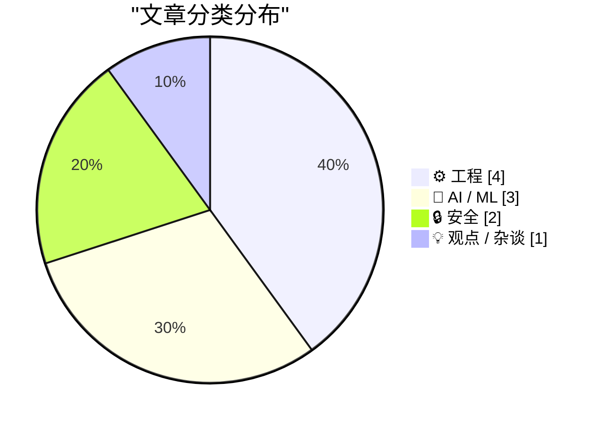
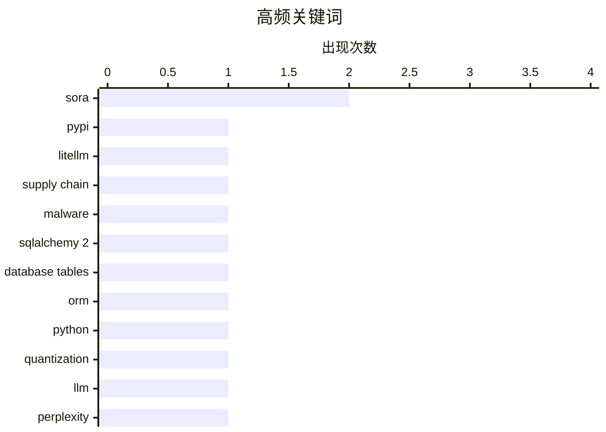

# 📰 AI 博客每日精选 — 2026-03-27

> 来自 Karpathy 推荐的 92 个顶级技术博客，AI 精选 Top 10

## 📝 今日看点

今天技术圈的主线之一，是“开源供应链安全”再度拉响警报：从 LiteLLM 恶意包事件到对经典 Melissa 病毒的回望，都在提醒开发者依赖生态仍是最脆弱入口。另一条主线是“AI 从狂热走向务实”，一边是量化等底层技术继续推进模型落地与效率优化，另一边则是围绕 Sora 的资本与舆论降温，折射出市场对 AI 叙事开始重估。与此同时，工程社区明显回归基本功，数据库建模、系统消息机制、数值精度与数学常数等内容受关注，说明“把基础打牢”正在重新成为主流共识。

---

## 🏆 今日必读

🥇 **我对 LiteLLM 恶意软件攻击的逐分钟响应**

[My minute-by-minute response to the LiteLLM malware attack](https://simonwillison.net/2026/Mar/26/response-to-the-litellm-malware-attack/#atom-everything) — simonwillison.net · 9 小时前 · 🔒 安全

> 根据摘录可见，核心事件是 LiteLLM 的恶意版本（litellm==1.82.8）在 PyPI 上线，安装或升级用户会被感染。Callum McMahon 使用 Claude 对隔离 Docker 容器中的 PyPI 新下载包进行检查，定位到 `litellm_init.pth`（34628 bytes），并在前 200 字符中发现通过 `base64` 解码执行代码的可疑载荷。Claude 在确认恶意代码后给出“需立即上报 security@pypi.org”的处置建议，并明确这是正在发生的供应链风险。Simon Willison 还提到，Callum 使用了他的 `claude-code-transcripts` 工具公开对话记录。作者传达的重点是：AI 辅助分析可用于快速验证漏洞并推动及时、可审计的安全上报流程。

💡 **为什么值得读**: 值得读在于它给出了从“发现可疑包”到“隔离复现、确认恶意、立即上报”的完整实战链路，能直接借鉴到开源供应链应急中。

🏷️ PyPI, LiteLLM, supply chain, malware

🥈 **SQLAlchemy 2 In Practice - Chapter 2 - Database Tables**

[SQLAlchemy 2 In Practice - Chapter 2 - Database Tables](https://blog.miguelgrinberg.com/post/sqlalchemy-2-in-practice---chapter-1---database-tables) — miguelgrinberg.com · 20 小时前 · ⚙️ 工程

> miguelgrinberg.com Home My Courses and Books Consulting About Me Light Mode Dark Mode System Default --> SQLAlchemy 2 In Practice - Chapter 2 - Database Tables Posted by on 2026-03-26T12:30:03Z under 

🏷️ SQLAlchemy 2, database tables, ORM, Python

🥉 **Quantization from the ground up**

[Quantization from the ground up](https://simonwillison.net/2026/Mar/26/quantization-from-the-ground-up/#atom-everything) — simonwillison.net · 16 小时前 · 🤖 AI / ML

> Simon Willison’s Weblog Subscribe Sponsored by: WorkOS &mdash; Ready to sell to Enterprise clients? Build and ship securely with WorkOS. 26th March 2026 - Link Blog Quantization from the ground up . S

🏷️ quantization, LLM, perplexity, llama.cpp

---

## 📊 数据概览

| 扫描源 | 抓取文章 | 时间范围 | 精选 |
|:---:|:---:|:---:|:---:|
| 82/92 | 2372 篇 → 24 篇 | 24h | **10 篇** |

### 分类分布



### 高频关键词



<details>
<summary>📈 纯文本关键词图（终端友好）</summary>

```
sora            │ ████████████████████ 2
pypi            │ ██████████░░░░░░░░░░ 1
litellm         │ ██████████░░░░░░░░░░ 1
supply chain    │ ██████████░░░░░░░░░░ 1
malware         │ ██████████░░░░░░░░░░ 1
sqlalchemy 2    │ ██████████░░░░░░░░░░ 1
database tables │ ██████████░░░░░░░░░░ 1
orm             │ ██████████░░░░░░░░░░ 1
python          │ ██████████░░░░░░░░░░ 1
quantization    │ ██████████░░░░░░░░░░ 1
```

</details>

### 🏷️ 话题标签

**sora**(2) · **pypi**(1) · **litellm**(1) · supply chain(1) · malware(1) · sqlalchemy 2(1) · database tables(1) · orm(1) · python(1) · quantization(1) · llm(1) · perplexity(1) · llama.cpp(1) · win32(1) · wm_enteridle(1) · messagebox(1) · dialog loop(1) · apple(1) · product design(1) · vision(1)

---

## ⚙️ 工程

### 1. SQLAlchemy 2 In Practice - Chapter 2 - Database Tables

[SQLAlchemy 2 In Practice - Chapter 2 - Database Tables](https://blog.miguelgrinberg.com/post/sqlalchemy-2-in-practice---chapter-1---database-tables) — **miguelgrinberg.com** · 20 小时前 · ⭐ 24/30

> miguelgrinberg.com Home My Courses and Books Consulting About Me Light Mode Dark Mode System Default --> SQLAlchemy 2 In Practice - Chapter 2 - Database Tables Posted by on 2026-03-26T12:30:03Z under 

🏷️ SQLAlchemy 2, database tables, ORM, Python

---

### 2. Why doesn’t WM_ENTER­IDLE work if the dialog box is a Message­Box?

[Why doesn’t WM_ENTER­IDLE work if the dialog box is a Message­Box?](https://devblogs.microsoft.com/oldnewthing/20260326-00/?p=112167) — **devblogs.microsoft.com/oldnewthing** · 19 小时前 · ⭐ 21/30

> Last time, we looked at how the owner of a dialog can take control just before the dialog box message loop goes idle. I said that I pulled a trick. The trick is that I used the common file open dialog

🏷️ Win32, WM_ENTERIDLE, MessageBox, dialog loop

---

### 3. Lebesgue constants

[Lebesgue constants](https://www.johndcook.com/blog/2026/03/26/lebesgue-constants/) — **johndcook.com** · 13 小时前 · ⭐ 18/30

> I alluded to Lebesgue constants in the previous post without giving them a name. There I said that the bound on order n interpolation error has the form where h is the spacing between interpolation po

🏷️ Lebesgue constant, interpolation, Chebyshev nodes, numerical analysis

---

### 4. How much precision can you squeeze out of a table?

[How much precision can you squeeze out of a table?](https://www.johndcook.com/blog/2026/03/26/table-precision/) — **johndcook.com** · 18 小时前 · ⭐ 18/30

> Richard Feynman said that almost everything becomes interesting if you look into it deeply enough. Looking up numbers in a table is certainly not interesting, but it becomes more interesting when you 

🏷️ interpolation error, Lagrange theorem, numerical methods, precision

---

## 🤖 AI / ML

### 5. Quantization from the ground up

[Quantization from the ground up](https://simonwillison.net/2026/Mar/26/quantization-from-the-ground-up/#atom-everything) — **simonwillison.net** · 16 小时前 · ⭐ 21/30

> Simon Willison’s Weblog Subscribe Sponsored by: WorkOS &mdash; Ready to sell to Enterprise clients? Build and ship securely with WorkOS. 26th March 2026 - Link Blog Quantization from the ground up . S

🏷️ quantization, LLM, perplexity, llama.cpp

---

### 6. Disney Drops Vaporware $1B Investment in OpenAI After Sora Got Axed

[Disney Drops Vaporware $1B Investment in OpenAI After Sora Got Axed](https://variety.com/2026/digital/news/openai-shutting-down-sora-video-disney-1236698277/) — **daringfireball.net** · 13 小时前 · ⭐ 23/30

> Plus Icon Film Plus Icon TV Plus Icon What To Watch Plus Icon Music Plus Icon Docs Plus Icon Digital & Gaming Plus Icon Global Plus Icon Awards Circuit Plus Icon Video Plus Icon What To Hear Plus Icon

🏷️ OpenAI, Sora, Disney, generative video

---

### 7. Katie Notopoulos Bids Farewell to Sora: ‘You Were Too Beautiful and Stupid for This World’

[Katie Notopoulos Bids Farewell to Sora: ‘You Were Too Beautiful and Stupid for This World’](https://www.businessinsider.com/sora-openai-chatgpt-sam-altman-ai-shutting-down-farewell-why-2026-3) — **daringfireball.net** · 15 小时前 · ⭐ 21/30

> Goodnight, sweet Sora. You were a wonderful tool for trolling my friends, but you burned too bright (and used too much compute) to stay around in this harsh world. Loading audio narration... For a bri

🏷️ Sora, AI video, content moderation, compute cost

---

## 🔒 安全

### 8. 我对 LiteLLM 恶意软件攻击的逐分钟响应

[My minute-by-minute response to the LiteLLM malware attack](https://simonwillison.net/2026/Mar/26/response-to-the-litellm-malware-attack/#atom-everything) — **simonwillison.net** · 9 小时前 · ⭐ 24/30

> 根据摘录可见，核心事件是 LiteLLM 的恶意版本（litellm==1.82.8）在 PyPI 上线，安装或升级用户会被感染。Callum McMahon 使用 Claude 对隔离 Docker 容器中的 PyPI 新下载包进行检查，定位到 `litellm_init.pth`（34628 bytes），并在前 200 字符中发现通过 `base64` 解码执行代码的可疑载荷。Claude 在确认恶意代码后给出“需立即上报 security@pypi.org”的处置建议，并明确这是正在发生的供应链风险。Simon Willison 还提到，Callum 使用了他的 `claude-code-transcripts` 工具公开对话记录。作者传达的重点是：AI 辅助分析可用于快速验证漏洞并推动及时、可审计的安全上报流程。

🏷️ PyPI, LiteLLM, supply chain, malware

---

### 9. The Melissa virus of 1999

[The Melissa virus of 1999](https://dfarq.homeip.net/the-melissa-virus-of-1999/?utm_source=rss&#038;utm_medium=rss&#038;utm_campaign=the-melissa-virus-of-1999) — **dfarq.homeip.net** · 22 小时前 · ⭐ 13/30

> The Melissa virus was a mass-mailing macro virus from March 1999. It was one of the more notorious computer viruses of the 1990s, and reportedly the author named it for a dancer he met in a Florida ni

🏷️ Melissa virus, macro malware, email worm, social engineering

---

## 💡 观点 / 杂谈

### 10. I Can't See Apple's Vision

[I Can't See Apple's Vision](https://matduggan.com/i-cant-see-apples-vision/) — **matduggan.com** · 21 小时前 · ⭐ 20/30

> Companies, as they grow to become multi-billion-dollar entities, somehow lose their vision. They insert lots of layers of middle management between the people running the company and the people doing 

🏷️ Apple, product design, Vision, UX criticism

---

*生成于 2026-03-27 17:19 | 扫描 82 源 → 获取 2372 篇 → 精选 10 篇*
*基于 [Hacker News Popularity Contest 2025](https://refactoringenglish.com/tools/hn-popularity/) RSS 源列表*
