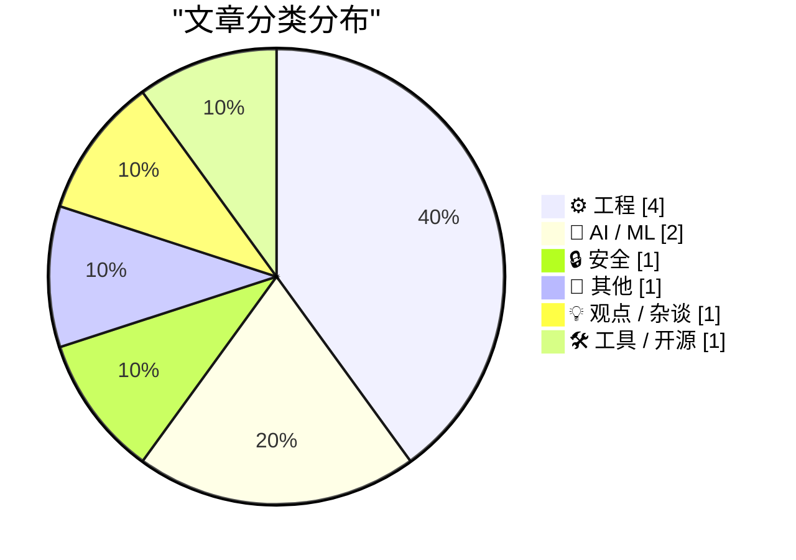
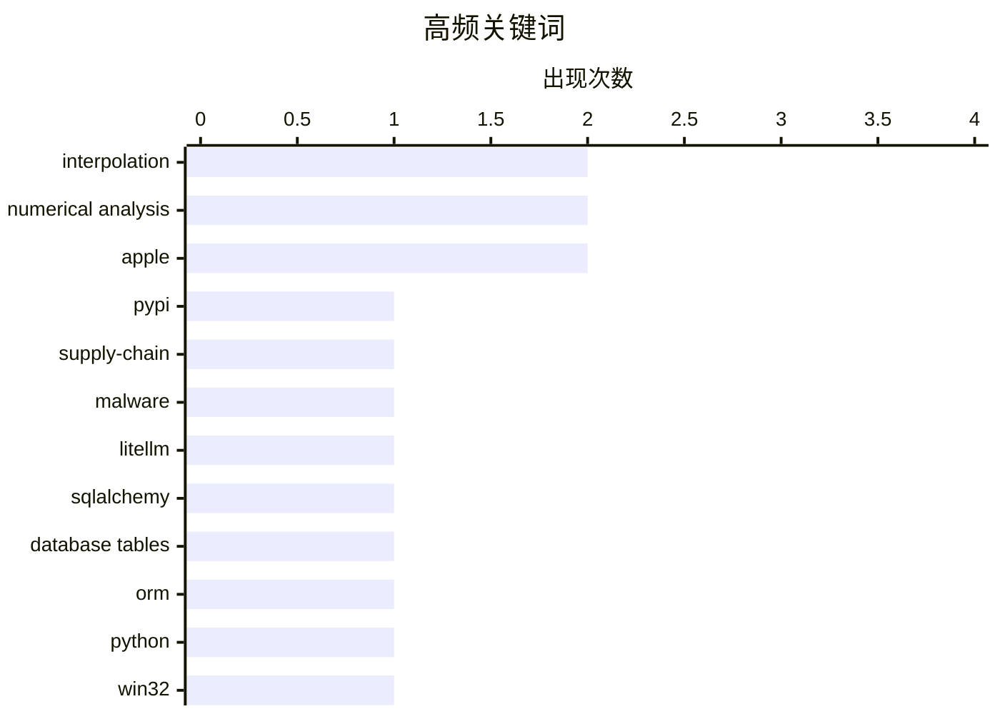

# 📰 AI 博客每日精选 — 2026-03-27

> 来自 Karpathy 推荐的 92 个顶级技术博客，AI 精选 Top 10

## 📝 今日看点

今天技术圈最突出的信号是“安全与供应链风险前置”：从 LiteLLM 恶意版本事件可以看出，开源依赖一旦被投毒，影响面会在安装与升级链路里瞬间放大。与此同时，工程实践继续回归“基础能力深耕”——从数据库建模、系统消息机制到精度与数值方法，开发者关注点正从新概念转向可验证、可维护的底层质量。AI 话题则进入更务实阶段：一边是量化等降本增效技术走向落地，另一边是资本与产品预期降温，行业从“叙事驱动”加速转向“交付驱动”。整体来看，今天的主线是：先守住安全底盘，再用工程硬功夫和务实 AI 提升真实产出。

---

## 🏆 今日必读

🥇 **我对 LiteLLM 恶意软件攻击的逐分钟响应**

[My minute-by-minute response to the LiteLLM malware attack](https://simonwillison.net/2026/Mar/26/response-to-the-litellm-malware-attack/#atom-everything) — simonwillison.net · 8 小时前 · 🔒 安全

> 根据摘录可见，核心事件是 LiteLLM 恶意版本 `litellm==1.82.8` 在 PyPI 上线并会感染安装或升级用户。Callum McMahon 使用 Claude 对隔离 Docker 容器中的 PyPI 最新下载包进行检查，确认 wheel 中存在 `litellm_init.pth`（34628 字节）及可疑 `subprocess.Popen` + `base64` 执行代码。Claude 在确认恶意代码后给出“应立即联系 `security@pypi.org`”的处置建议。Simon Willison 的这篇链接博文同时提到，Callum 使用了其 `claude-code-transcripts` 工具公开对话记录。结论指向供应链安全的紧急响应：该版本处于在线可安装状态时，快速验证与上报是关键。

💡 **为什么值得读**: 值得读在于它给出了一个真实且可复用的 AI 辅助安全应急流程样例：从隔离复现、证据定位到向 PyPI 安全团队上报。

🏷️ PyPI, supply-chain, malware, LiteLLM

🥈 **SQLAlchemy 2 In Practice - Chapter 2 - Database Tables**

[SQLAlchemy 2 In Practice - Chapter 2 - Database Tables](https://blog.miguelgrinberg.com/post/sqlalchemy-2-in-practice---chapter-1---database-tables) — miguelgrinberg.com · 20 小时前 · ⚙️ 工程

> miguelgrinberg.com Home My Courses and Books Consulting About Me Light Mode Dark Mode System Default --> SQLAlchemy 2 In Practice - Chapter 2 - Database Tables Posted by on 2026-03-26T12:30:03Z under 

🏷️ SQLAlchemy, database tables, ORM, Python

🥉 **Why doesn’t WM_ENTER­IDLE work if the dialog box is a Message­Box?**

[Why doesn’t WM_ENTER­IDLE work if the dialog box is a Message­Box?](https://devblogs.microsoft.com/oldnewthing/20260326-00/?p=112167) — devblogs.microsoft.com/oldnewthing · 18 小时前 · ⚙️ 工程

> Skip to main content Microsoft Dev Blogs Dev Blogs Dev Blogs Home Developer Microsoft for Developers Visual Studio Visual Studio Code Develop from the cloud All things Azure Xcode DevOps Windows Devel

🏷️ Win32, WM_ENTERIDLE, MessageBox, dialog style

---

## 📊 数据概览

| 扫描源 | 抓取文章 | 时间范围 | 精选 |
|:---:|:---:|:---:|:---:|
| 88/92 | 2503 篇 → 25 篇 | 24h | **10 篇** |

### 分类分布



### 高频关键词



<details>
<summary>📈 纯文本关键词图（终端友好）</summary>

```
interpolation      │ ████████████████████ 2
numerical analysis │ ████████████████████ 2
apple              │ ████████████████████ 2
pypi               │ ██████████░░░░░░░░░░ 1
supply-chain       │ ██████████░░░░░░░░░░ 1
malware            │ ██████████░░░░░░░░░░ 1
litellm            │ ██████████░░░░░░░░░░ 1
sqlalchemy         │ ██████████░░░░░░░░░░ 1
database tables    │ ██████████░░░░░░░░░░ 1
orm                │ ██████████░░░░░░░░░░ 1
```

</details>

### 🏷️ 话题标签

**interpolation**(2) · **numerical analysis**(2) · **apple**(2) · pypi(1) · supply-chain(1) · malware(1) · litellm(1) · sqlalchemy(1) · database tables(1) · orm(1) · python(1) · win32(1) · wm_enteridle(1) · messagebox(1) · dialog style(1) · human.json(1) · wordpress(1) · identity(1) · foaf(1) · quantization(1)

---

## ⚙️ 工程

### 1. SQLAlchemy 2 In Practice - Chapter 2 - Database Tables

[SQLAlchemy 2 In Practice - Chapter 2 - Database Tables](https://blog.miguelgrinberg.com/post/sqlalchemy-2-in-practice---chapter-1---database-tables) — **miguelgrinberg.com** · 20 小时前 · ⭐ 23/30

> miguelgrinberg.com Home My Courses and Books Consulting About Me Light Mode Dark Mode System Default --> SQLAlchemy 2 In Practice - Chapter 2 - Database Tables Posted by on 2026-03-26T12:30:03Z under 

🏷️ SQLAlchemy, database tables, ORM, Python

---

### 2. Why doesn’t WM_ENTER­IDLE work if the dialog box is a Message­Box?

[Why doesn’t WM_ENTER­IDLE work if the dialog box is a Message­Box?](https://devblogs.microsoft.com/oldnewthing/20260326-00/?p=112167) — **devblogs.microsoft.com/oldnewthing** · 18 小时前 · ⭐ 22/30

> Skip to main content Microsoft Dev Blogs Dev Blogs Dev Blogs Home Developer Microsoft for Developers Visual Studio Visual Studio Code Develop from the cloud All things Azure Xcode DevOps Windows Devel

🏷️ Win32, WM_ENTERIDLE, MessageBox, dialog style

---

### 3. Adding human.json to WordPress

[Adding human.json to WordPress](https://shkspr.mobi/blog/2026/03/adding-human-json-to-wordpress/) — **shkspr.mobi** · 20 小时前 · ⭐ 22/30

> Terence Eden’s Blog Theme Switcher: 🌒 Dark 🌞 Light 📰 eInk 💻 xterm 🥴 Drunk 👻 Nude ♻️ Reset Adding human.json to WordPress AI humans WordPress · 3 comments · 800 words · Viewed ~281 times Every fe

🏷️ human.json, WordPress, identity, FOAF

---

### 4. How much precision can you squeeze out of a table?

[How much precision can you squeeze out of a table?](https://www.johndcook.com/blog/2026/03/26/table-precision/) — **johndcook.com** · 18 小时前 · ⭐ 19/30

> Skip to content MATH SIGNAL PROCESSING DIFFERENTIAL EQUATIONS PROBABILITY SEE ALL … STATS EXPERT TESTIMONY BIOSTATISTICS DATA PRIVACY SEE ALL … PRIVACY HIPAA SAFE HARBOR DIFFERENTIAL PRIVACY CRYPTOGRA

🏷️ interpolation, numerical analysis, precision, error bounds

---

## 🤖 AI / ML

### 5. Quantization from the ground up

[Quantization from the ground up](https://simonwillison.net/2026/Mar/26/quantization-from-the-ground-up/#atom-everything) — **simonwillison.net** · 16 小时前 · ⭐ 21/30

> Simon Willison’s Weblog Subscribe Sponsored by: WorkOS &mdash; Ready to sell to Enterprise clients? Build and ship securely with WorkOS. 26th March 2026 - Link Blog Quantization from the ground up . S

🏷️ quantization, LLM, perplexity, KL-divergence

---

### 6. Disney Drops Vaporware $1B Investment in OpenAI After Sora Got Axed

[Disney Drops Vaporware $1B Investment in OpenAI After Sora Got Axed](https://variety.com/2026/digital/news/openai-shutting-down-sora-video-disney-1236698277/) — **daringfireball.net** · 13 小时前 · ⭐ 20/30

> Plus Icon Film Plus Icon TV Plus Icon What To Watch Plus Icon Music Plus Icon Docs Plus Icon Digital & Gaming Plus Icon Global Plus Icon Awards Circuit Plus Icon Video Plus Icon What To Hear Plus Icon

🏷️ OpenAI, Sora, Disney, investment

---

## 🔒 安全

### 7. 我对 LiteLLM 恶意软件攻击的逐分钟响应

[My minute-by-minute response to the LiteLLM malware attack](https://simonwillison.net/2026/Mar/26/response-to-the-litellm-malware-attack/#atom-everything) — **simonwillison.net** · 8 小时前 · ⭐ 24/30

> 根据摘录可见，核心事件是 LiteLLM 恶意版本 `litellm==1.82.8` 在 PyPI 上线并会感染安装或升级用户。Callum McMahon 使用 Claude 对隔离 Docker 容器中的 PyPI 最新下载包进行检查，确认 wheel 中存在 `litellm_init.pth`（34628 字节）及可疑 `subprocess.Popen` + `base64` 执行代码。Claude 在确认恶意代码后给出“应立即联系 `security@pypi.org`”的处置建议。Simon Willison 的这篇链接博文同时提到，Callum 使用了其 `claude-code-transcripts` 工具公开对话记录。结论指向供应链安全的紧急响应：该版本处于在线可安装状态时，快速验证与上报是关键。

🏷️ PyPI, supply-chain, malware, LiteLLM

---

## 📝 其他

### 8. Lebesgue constants

[Lebesgue constants](https://www.johndcook.com/blog/2026/03/26/lebesgue-constants/) — **johndcook.com** · 12 小时前 · ⭐ 18/30

> Skip to content MATH SIGNAL PROCESSING DIFFERENTIAL EQUATIONS PROBABILITY SEE ALL … STATS EXPERT TESTIMONY BIOSTATISTICS DATA PRIVACY SEE ALL … PRIVACY HIPAA SAFE HARBOR DIFFERENTIAL PRIVACY CRYPTOGRA

🏷️ Lebesgue constant, interpolation, Chebyshev nodes, numerical analysis

---

## 💡 观点 / 杂谈

### 9. I Can't See Apple's Vision

[I Can't See Apple's Vision](https://matduggan.com/i-cant-see-apples-vision/) — **matduggan.com** · 21 小时前 · ⭐ 17/30

> Skip to content matduggan.com It's JSON all the way down RSS Feed I Can't See Apple's Vision March 26, 2026 in Apple Companies, as they grow to become multi-billion-dollar entities, somehow lose their

🏷️ Apple, product design, management, UX critique

---

## 🛠 工具 / 开源

### 10. MacOS 26.4 Adds ‘Slow Charger’ Indicator for MacBooks

[MacOS 26.4 Adds ‘Slow Charger’ Indicator for MacBooks](https://www.macrumors.com/2026/03/25/macos-tahoe-26-4-slow-charger-macbooks/) — **daringfireball.net** · 15 小时前 · ⭐ 19/30

> Skip to Content Got a tip for us? Let us know a. Send us an email b. Anonymous form close Front Page Roundups AirPods 4 AirPods Max 2 AirPods Pro 3 AirTag Apple Deals Apple Pay Apple TV Apple Vision P

🏷️ macOS, MacBook, charging, Apple

---

*生成于 2026-03-27 16:54 | 扫描 88 源 → 获取 2503 篇 → 精选 10 篇*
*基于 [Hacker News Popularity Contest 2025](https://refactoringenglish.com/tools/hn-popularity/) RSS 源列表*
