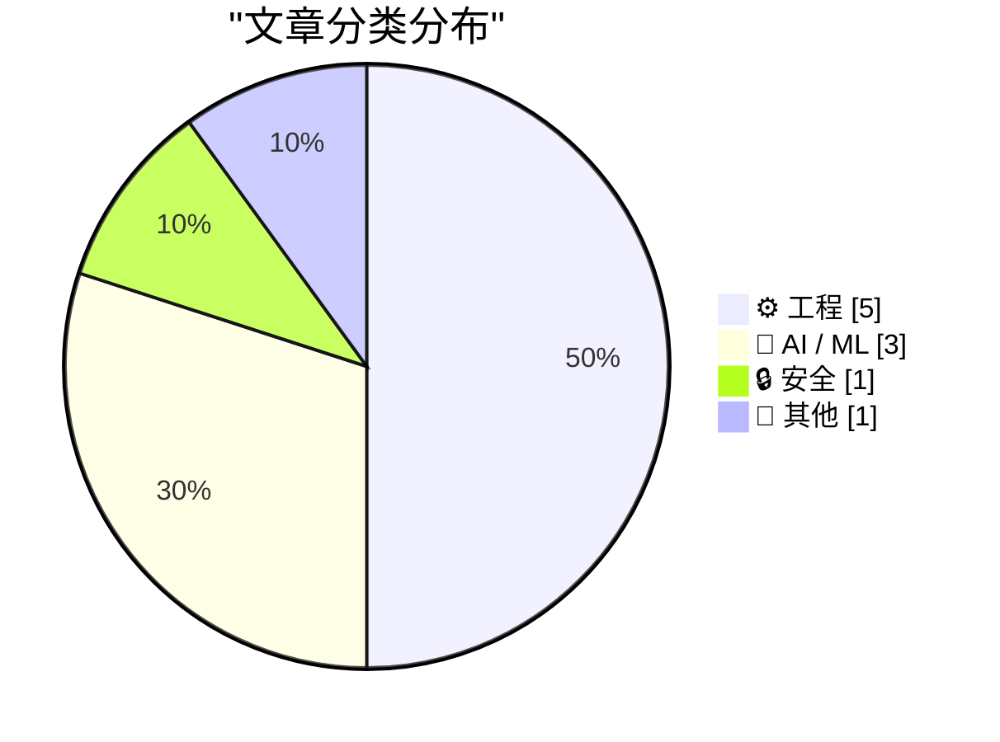
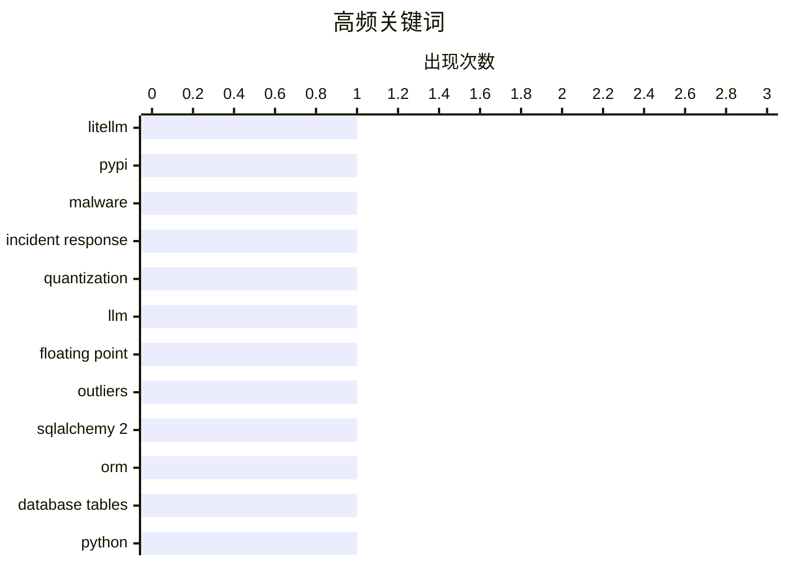

# 📰 AI 博客每日精选 — 2026-03-27

> 来自 Karpathy 推荐的 92 个顶级技术博客，AI 精选 Top 10

## 📝 今日看点

今天技术圈的主线很清晰：一边是AI能力竞赛继续升温，模型蒸馏、量化优化与大厂合作博弈同时推进，行业从“拼参数”转向“拼落地效率与成本控制”。另一边，开源与供应链安全再次被拉响警报，LiteLLM恶意软件事件凸显了分钟级响应、社区协同与AI辅助研判正在成为新的安全常态。与此同时，工程实践内容持续走深，从数据库建模到系统消息机制、再到数值计算基础，开发者关注点正回归“把底层功夫做扎实”。

---

## 🏆 今日必读

🥇 **我对 LiteLLM 恶意软件攻击的分钟级响应记录**

[My minute-by-minute response to the LiteLLM malware attack](https://simonwillison.net/2026/Mar/26/response-to-the-litellm-malware-attack/#atom-everything) — simonwillison.net · 12 小时前 · 🔒 安全

> 核心主题是 LiteLLM 恶意软件事件的上报与确认过程。摘录显示，Callum McMahon 已将该攻击报告给 PyPI，并公开了他借助 Claude 进行核验和决策的对话记录。Claude 在隔离的 Docker 容器中对从 PyPI 新下载的 litellm-1.82.8-py3-none-any.whl 进行检查，并确认发现可疑内容（如 litellm_init.pth）。对话中还提到，Claude 在确认恶意代码后建议了 PyPI 的安全联系地址。根据摘录可见，这是一份强调应急响应时间线与 AI 辅助漏洞确认实践的案例。

💡 **为什么值得读**: 值得读在于它给出了真实的安全事件处置链路，并具体展示了如何把 AI 助手用于恶意包取证与负责任披露。

🏷️ LiteLLM, PyPI, malware, incident response

🥈 **Quantization from the ground up**

[Quantization from the ground up](https://simonwillison.net/2026/Mar/26/quantization-from-the-ground-up/#atom-everything) — simonwillison.net · 19 小时前 · 🤖 AI / ML

> Sam Rose continues his streak of publishing spectacularly informative interactive essays, this time explaining how quantization of Large Language Models works (which he says might be " the best post I

🏷️ quantization, LLM, floating point, outliers

🥉 **SQLAlchemy 2 In Practice - Chapter 2 - Database Tables**

[SQLAlchemy 2 In Practice - Chapter 2 - Database Tables](https://blog.miguelgrinberg.com/post/sqlalchemy-2-in-practice---chapter-1---database-tables) — miguelgrinberg.com · 23 小时前 · ⚙️ 工程

> This is the second chapter of my SQLAlchemy 2 in Practice book. If you'd like to support my work, I encourage you to buy this book, either directly from my store or on Amazon . Thank you! This chapter

🏷️ SQLAlchemy 2, ORM, database tables, Python

---

## 📊 数据概览

| 扫描源 | 抓取文章 | 时间范围 | 精选 |
|:---:|:---:|:---:|:---:|
| 89/92 | 2528 篇 → 25 篇 | 24h | **10 篇** |

### 分类分布



### 高频关键词



<details>
<summary>📈 纯文本关键词图（终端友好）</summary>

```
litellm           │ ████████████████████ 1
pypi              │ ████████████████████ 1
malware           │ ████████████████████ 1
incident response │ ████████████████████ 1
quantization      │ ████████████████████ 1
llm               │ ████████████████████ 1
floating point    │ ████████████████████ 1
outliers          │ ████████████████████ 1
sqlalchemy 2      │ ████████████████████ 1
orm               │ ████████████████████ 1
```

</details>

### 🏷️ 话题标签

**litellm**(1) · **pypi**(1) · **malware**(1) · incident response(1) · quantization(1) · llm(1) · floating point(1) · outliers(1) · sqlalchemy 2(1) · orm(1) · database tables(1) · python(1) · win32(1) · wm_enteridle(1) · messagebox(1) · dialog loop(1) · human.json(1) · wordpress(1) · identity(1) · web of trust(1)

---

## ⚙️ 工程

### 1. SQLAlchemy 2 In Practice - Chapter 2 - Database Tables

[SQLAlchemy 2 In Practice - Chapter 2 - Database Tables](https://blog.miguelgrinberg.com/post/sqlalchemy-2-in-practice---chapter-1---database-tables) — **miguelgrinberg.com** · 23 小时前 · ⭐ 23/30

> This is the second chapter of my SQLAlchemy 2 in Practice book. If you'd like to support my work, I encourage you to buy this book, either directly from my store or on Amazon . Thank you! This chapter

🏷️ SQLAlchemy 2, ORM, database tables, Python

---

### 2. Why doesn’t WM_ENTER­IDLE work if the dialog box is a Message­Box?

[Why doesn’t WM_ENTER­IDLE work if the dialog box is a Message­Box?](https://devblogs.microsoft.com/oldnewthing/20260326-00/?p=112167) — **devblogs.microsoft.com/oldnewthing** · 22 小时前 · ⭐ 22/30

> Last time, we looked at how the owner of a dialog can take control just before the dialog box message loop goes idle. I said that I pulled a trick. The trick is that I used the common file open dialog

🏷️ Win32, WM_ENTERIDLE, MessageBox, dialog loop

---

### 3. Adding human.json to WordPress

[Adding human.json to WordPress](https://shkspr.mobi/blog/2026/03/adding-human-json-to-wordpress/) — **shkspr.mobi** · 23 小时前 · ⭐ 22/30

> Every few years, someone reinvents FOAF . The idea behind Friend-Of-A-Friend is that You can say "I, Alice, know and trust Bob". Bob can say "I know and trust Alice. I also know and trust Carl." That 

🏷️ human.json, WordPress, identity, web of trust

---

### 4. Lebesgue constants

[Lebesgue constants](https://www.johndcook.com/blog/2026/03/26/lebesgue-constants/) — **johndcook.com** · 15 小时前 · ⭐ 20/30

> I alluded to Lebesgue constants in the previous post without giving them a name. There I said that the bound on order n interpolation error has the form where h is the spacing between interpolation po

🏷️ interpolation, Lebesgue constant, Chebyshev nodes, numerical analysis

---

### 5. Computing sine and cosine of complex arguments with only real functions

[Computing sine and cosine of complex arguments with only real functions](https://www.johndcook.com/blog/2026/03/27/complex-argument/) — **johndcook.com** · 28 分钟前 · ⭐ 19/30

> Suppose you have a calculator or math library that only handles real arguments but you need to evaluate sin(3 + 4 i ). What do you do? If you’re using Python, for example, and you don’t have NumPy ins

🏷️ complex numbers, sine, cosine, Python math

---

## 🤖 AI / ML

### 6. Quantization from the ground up

[Quantization from the ground up](https://simonwillison.net/2026/Mar/26/quantization-from-the-ground-up/#atom-everything) — **simonwillison.net** · 19 小时前 · ⭐ 24/30

> Sam Rose continues his streak of publishing spectacularly informative interactive essays, this time explaining how quantization of Large Language Models works (which he says might be " the best post I

🏷️ quantization, LLM, floating point, outliers

---

### 7. Disney Drops Vaporware $1B Investment in OpenAI After Sora Got Axed

[Disney Drops Vaporware $1B Investment in OpenAI After Sora Got Axed](https://variety.com/2026/digital/news/openai-shutting-down-sora-video-disney-1236698277/) — **daringfireball.net** · 16 小时前 · ⭐ 21/30

> Plus Icon Film Plus Icon TV Plus Icon What To Watch Plus Icon Music Plus Icon Docs Plus Icon Digital & Gaming Plus Icon Global Plus Icon Awards Circuit Plus Icon Video Plus Icon What To Hear Plus Icon

🏷️ OpenAI, Sora, Disney, AI video

---

### 8. The Information: ‘Apple Can “Distill” Google’s Big Gemini Model’

[The Information: ‘Apple Can “Distill” Google’s Big Gemini Model’](https://www.theinformation.com/newsletters/ai-agenda/apple-can-distill-googles-big-gemini-model?rc=jfy0lk) — **daringfireball.net** · 18 小时前 · ⭐ 21/30

> Jessica E. Lessin, Amir Efrati, and Erin Woo, reporting for the paywalled-without-gift-links The Information: While we have reported that Apple can tweak, or fine-tune, a version of Google’s Gemini AI

🏷️ Apple, Google Gemini, model distillation, on-premise AI

---

## 🔒 安全

### 9. 我对 LiteLLM 恶意软件攻击的分钟级响应记录

[My minute-by-minute response to the LiteLLM malware attack](https://simonwillison.net/2026/Mar/26/response-to-the-litellm-malware-attack/#atom-everything) — **simonwillison.net** · 12 小时前 · ⭐ 25/30

> 核心主题是 LiteLLM 恶意软件事件的上报与确认过程。摘录显示，Callum McMahon 已将该攻击报告给 PyPI，并公开了他借助 Claude 进行核验和决策的对话记录。Claude 在隔离的 Docker 容器中对从 PyPI 新下载的 litellm-1.82.8-py3-none-any.whl 进行检查，并确认发现可疑内容（如 litellm_init.pth）。对话中还提到，Claude 在确认恶意代码后建议了 PyPI 的安全联系地址。根据摘录可见，这是一份强调应急响应时间线与 AI 辅助漏洞确认实践的案例。

🏷️ LiteLLM, PyPI, malware, incident response

---

## 📝 其他

### 10. AMD K5 CPU: Not quite what AMD hoped

[AMD K5 CPU: Not quite what AMD hoped](https://dfarq.homeip.net/amd-k5-cpu-not-quite-what-amd-hoped/?utm_source=rss&#038;utm_medium=rss&#038;utm_campaign=amd-k5-cpu-not-quite-what-amd-hoped) — **dfarq.homeip.net** · 1 小时前 · ⭐ 15/30

> The K5 is AMD’s first x86 processor to be developed entirely in-house. Introduced March 27, 1996, its primary competition was Intel’s Pentium microprocessor. The K5 was an ambitious design, closer to 

🏷️ AMD K5, x86, CPU history, Intel

---

*生成于 2026-03-27 20:01 | 扫描 89 源 → 获取 2528 篇 → 精选 10 篇*
*基于 [Hacker News Popularity Contest 2025](https://refactoringenglish.com/tools/hn-popularity/) RSS 源列表*
