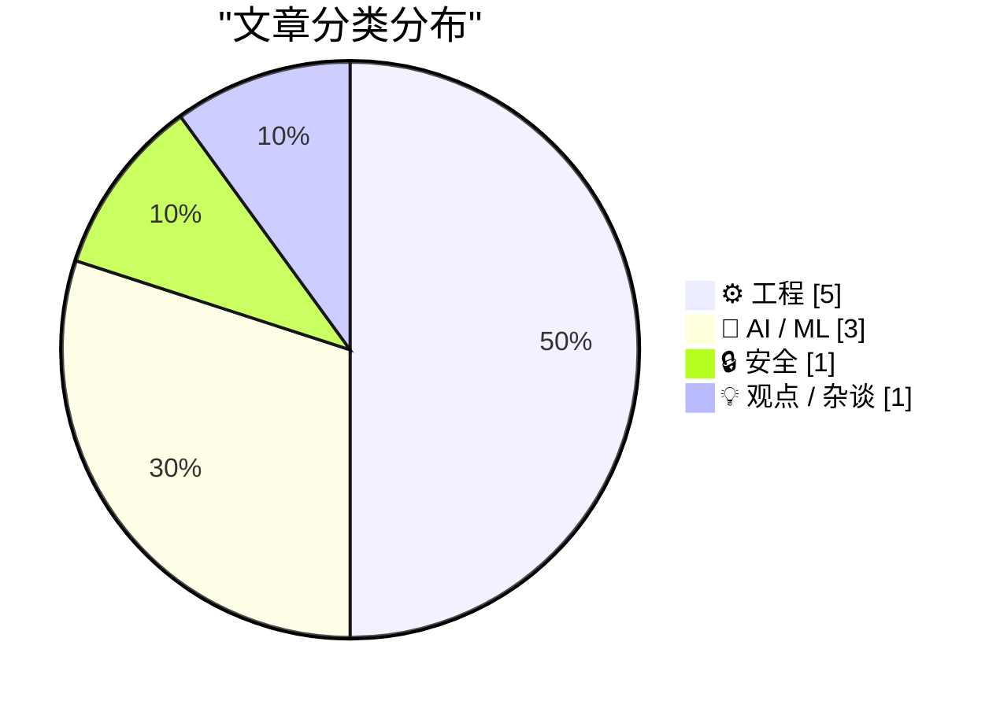
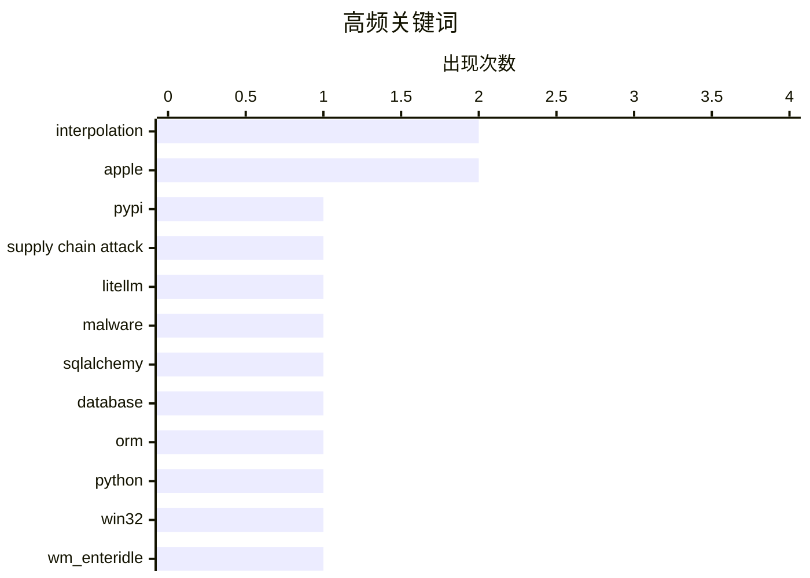

# 📰 AI 博客每日精选 — 2026-03-27

> 来自 Karpathy 推荐的 92 个顶级技术博客，AI 精选 Top 10

## 📝 今日看点

今天技术圈最突出的主线，是“AI落地进入算力与资本双重重估期”：一边是量化、蒸馏等模型压缩技术加速走向实用，另一边是围绕大模型合作与投资的战略摇摆更加频繁。与此同时，软件供应链安全再次拉响警报，PyPI 恶意包事件提醒开发者：开源依赖已是生产系统的高风险入口，响应速度与隔离审计能力正在成为工程基本功。更广泛的工程社区则持续回归基础能力建设，从数据库实践到系统消息机制、数值精度与开放标准，显示出“夯实底层”正成为对冲不确定性的共同选择。

---

## 🏆 今日必读

🥇 **我对 LiteLLM 恶意软件攻击的逐分钟响应**

[My minute-by-minute response to the LiteLLM malware attack](https://simonwillison.net/2026/Mar/26/response-to-the-litellm-malware-attack/#atom-everything) — simonwillison.net · 8 小时前 · 🔒 安全

> 核心事件是 LiteLLM 1.82.8 恶意版本在 PyPI 上线并可能感染安装或升级该包的用户。摘录显示，Callum McMahon 在隔离的 Docker 容器中下载并检查 wheel 文件，发现 `litellm_init.pth`（34628 bytes）包含通过 `base64.b64decode` 执行的可疑代码。对话记录中，Claude 在确认恶意代码后建议立即联系 `security@pypi.org` 进行上报。作者还提到对方使用了自己发布的 `claude-code-transcripts` 工具公开这次排查与决策过程。结论上，这是一例“用 AI 协助安全确认与应急上报”的实战记录，重点在于快速验证与及时披露。

💡 **为什么值得读**: 值得读在于它给出了从容器复现、恶意代码确认到向 PyPI 安全团队上报的完整实操链路，并展示了 Claude 在安全应急中的具体辅助价值。

🏷️ PyPI, supply chain attack, LiteLLM, malware

🥈 **SQLAlchemy 2 In Practice - Chapter 2 - Database Tables**

[SQLAlchemy 2 In Practice - Chapter 2 - Database Tables](https://blog.miguelgrinberg.com/post/sqlalchemy-2-in-practice---chapter-1---database-tables) — miguelgrinberg.com · 20 小时前 · ⚙️ 工程

> This is the second chapter of my SQLAlchemy 2 in Practice book. If you'd like to support my work, I encourage you to buy this book, either directly from my store or on Amazon . Thank you! This chapter

🏷️ SQLAlchemy, database, ORM, Python

🥉 **Why doesn’t WM_ENTER­IDLE work if the dialog box is a Message­Box?**

[Why doesn’t WM_ENTER­IDLE work if the dialog box is a Message­Box?](https://devblogs.microsoft.com/oldnewthing/20260326-00/?p=112167) — devblogs.microsoft.com/oldnewthing · 18 小时前 · ⚙️ 工程

> Dev Blogs The Old New Thing Why doesn’t WM_ENTER&shy;IDLE work if the dialog box is a Message&shy;Box? March 26th, 2026 2 reactions Why doesn’t WM_ ENTER&shy;IDLE work if the dialog box is a Message&s

🏷️ Win32, WM_ENTERIDLE, MessageBox, dialog loop

---

## 📊 数据概览

| 扫描源 | 抓取文章 | 时间范围 | 精选 |
|:---:|:---:|:---:|:---:|
| 89/92 | 2528 篇 → 25 篇 | 24h | **10 篇** |

### 分类分布



### 高频关键词



<details>
<summary>📈 纯文本关键词图（终端友好）</summary>

```
interpolation       │ ████████████████████ 2
apple               │ ████████████████████ 2
pypi                │ ██████████░░░░░░░░░░ 1
supply chain attack │ ██████████░░░░░░░░░░ 1
litellm             │ ██████████░░░░░░░░░░ 1
malware             │ ██████████░░░░░░░░░░ 1
sqlalchemy          │ ██████████░░░░░░░░░░ 1
database            │ ██████████░░░░░░░░░░ 1
orm                 │ ██████████░░░░░░░░░░ 1
python              │ ██████████░░░░░░░░░░ 1
```

</details>

### 🏷️ 话题标签

**interpolation**(2) · **apple**(2) · **pypi**(1) · supply chain attack(1) · litellm(1) · malware(1) · sqlalchemy(1) · database(1) · orm(1) · python(1) · win32(1) · wm_enteridle(1) · messagebox(1) · dialog loop(1) · quantization(1) · llm(1) · perplexity(1) · outlier weights(1) · human.json(1) · wordpress(1)

---

## ⚙️ 工程

### 1. SQLAlchemy 2 In Practice - Chapter 2 - Database Tables

[SQLAlchemy 2 In Practice - Chapter 2 - Database Tables](https://blog.miguelgrinberg.com/post/sqlalchemy-2-in-practice---chapter-1---database-tables) — **miguelgrinberg.com** · 20 小时前 · ⭐ 24/30

> This is the second chapter of my SQLAlchemy 2 in Practice book. If you'd like to support my work, I encourage you to buy this book, either directly from my store or on Amazon . Thank you! This chapter

🏷️ SQLAlchemy, database, ORM, Python

---

### 2. Why doesn’t WM_ENTER­IDLE work if the dialog box is a Message­Box?

[Why doesn’t WM_ENTER­IDLE work if the dialog box is a Message­Box?](https://devblogs.microsoft.com/oldnewthing/20260326-00/?p=112167) — **devblogs.microsoft.com/oldnewthing** · 18 小时前 · ⭐ 23/30

> Dev Blogs The Old New Thing Why doesn’t WM_ENTER&shy;IDLE work if the dialog box is a Message&shy;Box? March 26th, 2026 2 reactions Why doesn’t WM_ ENTER&shy;IDLE work if the dialog box is a Message&s

🏷️ Win32, WM_ENTERIDLE, MessageBox, dialog loop

---

### 3. Adding human.json to WordPress

[Adding human.json to WordPress](https://shkspr.mobi/blog/2026/03/adding-human-json-to-wordpress/) — **shkspr.mobi** · 20 小时前 · ⭐ 22/30

> Adding human.json to WordPress AI humans WordPress · 3 comments · 800 words · Viewed ~281 times Every few years, someone reinvents FOAF . The idea behind Friend-Of-A-Friend is that You can say "I, Ali

🏷️ human.json, WordPress, identity, trust graph

---

### 4. Lebesgue constants

[Lebesgue constants](https://www.johndcook.com/blog/2026/03/26/lebesgue-constants/) — **johndcook.com** · 12 小时前 · ⭐ 18/30

> Lebesgue constants Posted on 26 March 2026 by John I alluded to Lebesgue constants in the previous post without giving them a name. There I said that the bound on order n interpolation error has the f

🏷️ Lebesgue constants, interpolation, Chebyshev nodes, numerical analysis

---

### 5. How much precision can you squeeze out of a table?

[How much precision can you squeeze out of a table?](https://www.johndcook.com/blog/2026/03/26/table-precision/) — **johndcook.com** · 18 小时前 · ⭐ 18/30

> How much precision can you squeeze out of a table? Posted on 26 March 2026 by John Richard Feynman said that almost everything becomes interesting if you look into it deeply enough. Looking up numbers

🏷️ interpolation, numerical-analysis, error-bounds, precision

---

## 🤖 AI / ML

### 6. Quantization from the ground up

[Quantization from the ground up](https://simonwillison.net/2026/Mar/26/quantization-from-the-ground-up/#atom-everything) — **simonwillison.net** · 16 小时前 · ⭐ 22/30

> 26th March 2026 - Link Blog Quantization from the ground up . Sam Rose continues his streak of publishing spectacularly informative interactive essays, this time explaining how quantization of Large L

🏷️ quantization, LLM, perplexity, outlier weights

---

### 7. Disney Drops Vaporware $1B Investment in OpenAI After Sora Got Axed

[Disney Drops Vaporware $1B Investment in OpenAI After Sora Got Axed](https://variety.com/2026/digital/news/openai-shutting-down-sora-video-disney-1236698277/) — **daringfireball.net** · 13 小时前 · ⭐ 22/30

> Plus Icon Film Plus Icon TV Plus Icon What To Watch Plus Icon Music Plus Icon Docs Plus Icon Digital & Gaming Plus Icon Global Plus Icon Awards Circuit Plus Icon Video Plus Icon What To Hear Plus Icon

🏷️ OpenAI, Sora, generative video, Disney

---

### 8. The Information: ‘Apple Can “Distill” Google’s Big Gemini Model’

[The Information: ‘Apple Can “Distill” Google’s Big Gemini Model’](https://www.theinformation.com/newsletters/ai-agenda/apple-can-distill-googles-big-gemini-model?rc=jfy0lk) — **daringfireball.net** · 15 小时前 · ⭐ 22/30

> Jessica E. Lessin, Amir Efrati, and Erin Woo, reporting for the paywalled-without-gift-links The Information: While we have reported that Apple can tweak, or fine-tune, a version of Google’s Gemini AI

🏷️ Apple, Gemini, model distillation, on-premise AI

---

## 🔒 安全

### 9. 我对 LiteLLM 恶意软件攻击的逐分钟响应

[My minute-by-minute response to the LiteLLM malware attack](https://simonwillison.net/2026/Mar/26/response-to-the-litellm-malware-attack/#atom-everything) — **simonwillison.net** · 8 小时前 · ⭐ 24/30

> 核心事件是 LiteLLM 1.82.8 恶意版本在 PyPI 上线并可能感染安装或升级该包的用户。摘录显示，Callum McMahon 在隔离的 Docker 容器中下载并检查 wheel 文件，发现 `litellm_init.pth`（34628 bytes）包含通过 `base64.b64decode` 执行的可疑代码。对话记录中，Claude 在确认恶意代码后建议立即联系 `security@pypi.org` 进行上报。作者还提到对方使用了自己发布的 `claude-code-transcripts` 工具公开这次排查与决策过程。结论上，这是一例“用 AI 协助安全确认与应急上报”的实战记录，重点在于快速验证与及时披露。

🏷️ PyPI, supply chain attack, LiteLLM, malware

---

## 💡 观点 / 杂谈

### 10. I Can't See Apple's Vision

[I Can't See Apple's Vision](https://matduggan.com/i-cant-see-apples-vision/) — **matduggan.com** · 20 小时前 · ⭐ 17/30

> I Can't See Apple's Vision March 26, 2026 in Apple Companies, as they grow to become multi-billion-dollar entities, somehow lose their vision. They insert lots of layers of middle management between t

🏷️ Apple, product-design, management, UX

---

*生成于 2026-03-27 16:43 | 扫描 89 源 → 获取 2528 篇 → 精选 10 篇*
*基于 [Hacker News Popularity Contest 2025](https://refactoringenglish.com/tools/hn-popularity/) RSS 源列表*
