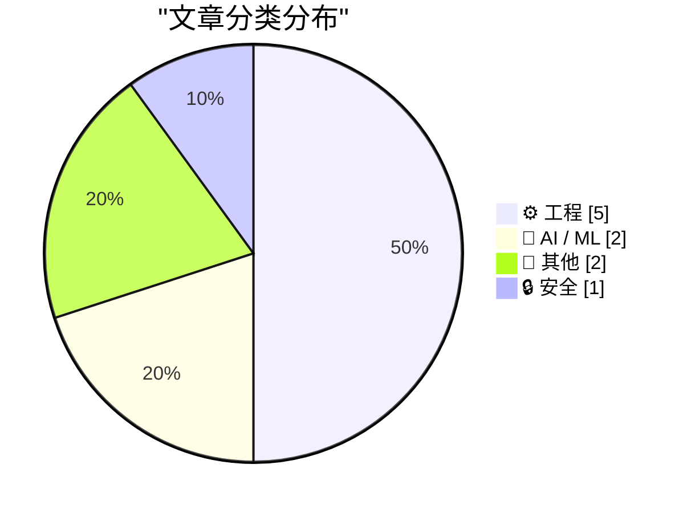
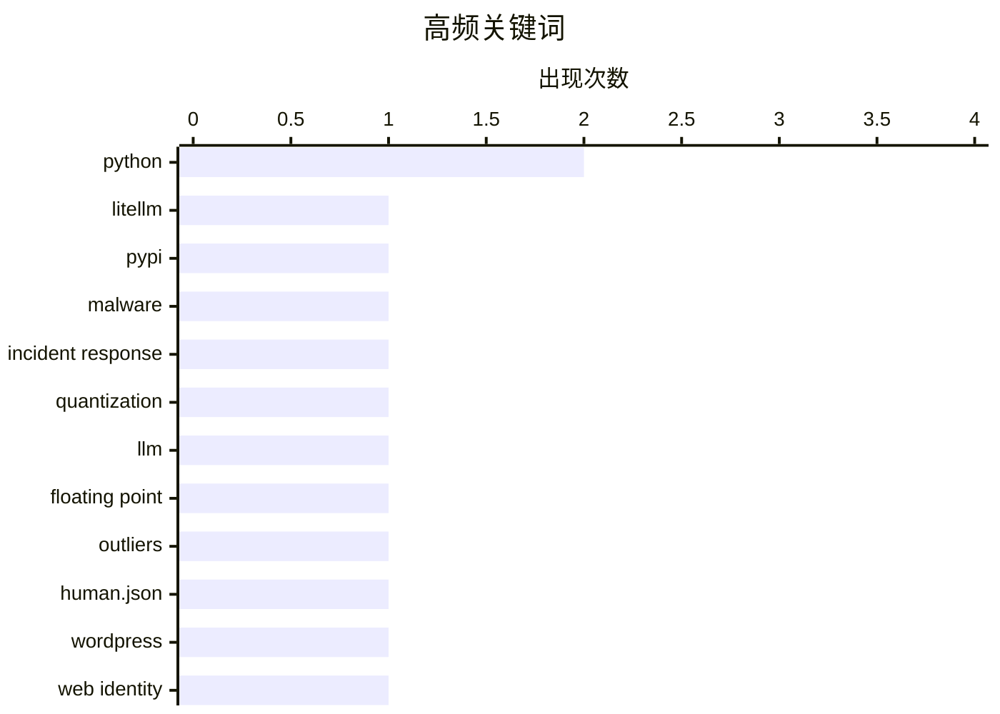

# 📰 AI 博客每日精选 — 2026-03-27

> 来自 Karpathy 推荐的 92 个顶级技术博客，AI 精选 Top 10

## 📝 今日看点

今天技术圈的主线很清晰：一边是生成式 AI 从“狂奔”进入“校准期”，量化等底层效率优化继续升温，而 Sora 停运等事件也在提醒行业重新评估产品落地与投入回报。另一边，安全与软件供应链治理的重要性被再次放大，围绕恶意包应急响应、漏洞上报和协同处置的实战经验成为焦点。与此同时，工程实践回归“基础能力深耕”——从数据库与系统消息机制到数值计算精度，开发者更重视可验证、可维护的底层功夫；叠加 human.json 这类新协议探索，技术社区也在重建“真实人类创作与信任关系”的基础设施。

---

## 🏆 今日必读

🥇 **我对 LiteLLM 恶意软件攻击的逐分钟响应**

[My minute-by-minute response to the LiteLLM malware attack](https://simonwillison.net/2026/Mar/26/response-to-the-litellm-malware-attack/#atom-everything) — simonwillison.net · 12 小时前 · 🔒 安全

> 核心内容聚焦在 LiteLLM 恶意软件事件的应急处置过程，以及向 PyPI 报告漏洞的实际操作。根据摘录可见，Callum McMahon 将该攻击上报给 PyPI，并公开了他借助 Claude 进行漏洞确认与决策的对话记录。对话中包含在隔离的 Docker 容器里进行“从 PyPI 重新下载并检查”的验证步骤，明确提到检查对象为 litellm-1.82.8-py3-none-any.whl。摘录还显示检测中发现了可疑文件 litellm_init.pth，且 Claude 在确认恶意代码后给出了 PyPI 安全联系地址。作者要表达的重点是：这次响应不仅是事件记录，也展示了用 AI 辅助完成安全验证与上报流程的可执行路径。

💡 **为什么值得读**: 值得读在于它提供了从复现、确认到上报的紧凑实战链路，并具体展示了 AI 在安全应急中的可用性。

🏷️ LiteLLM, PyPI, malware, incident response

🥈 **从零开始理解量化**

[Quantization from the ground up](https://simonwillison.net/2026/Mar/26/quantization-from-the-ground-up/#atom-everything) — simonwillison.net · 19 小时前 · 🤖 AI / ML

> 摘录聚焦于大语言模型量化的工作机制，并强调这是一篇交互式、信息密度很高的技术讲解。内容亮点之一是用可视化方式解释浮点数如何用二进制位表示，被评价为非常清晰。摘录还提到量化中的“离群值（outlier values）”问题：少量浮点值会落在常见的小数值分布之外。整体信息显示，文章不仅覆盖量化基础，还补充了实践中容易被忽视的关键细节。核心观点是通过直观交互和图示把抽象的量化与浮点表示讲透，使相关概念更容易真正理解。

💡 **为什么值得读**: 值得读在于它把“LLM 量化 + 浮点二进制表示 + 离群值”这几个常见难点放进同一套直观解释框架里，能显著降低理解门槛。

🏷️ quantization, LLM, floating point, outliers

🥉 **在 WordPress 中添加 human.json**

[Adding human.json to WordPress](https://shkspr.mobi/blog/2026/03/adding-human-json-to-wordpress/) — shkspr.mobi · 23 小时前 · ⚙️ 工程

> 核心主题是用新的 human.json 协议在站点之间表达“由人类创作”和“我为谁背书”的关系，并将其落地到 WordPress。文中先对比了 FOAF、PGP、XML/RDF、XFN 等旧方案未普及的背景，再引出 human.json 的定位：基于 URL 所有权作为身份，通过可爬取的背书关系传播信任。示例 JSON 使用 version 0.1.1，包含站点 url 与 vouches 列表（含被背书 URL 和 vouched_at 日期），并说明这种机制本质是声明与信任，不是可验证的人类性证明。实现部分给出 WordPress 接入步骤：在 head 添加 `link rel="human-json"`，通过 `add_rewrite_rule` 和自定义 `query_vars` 拦截 `/json/{something}`，再在 `template_redirect` 中针对 `human.json` 输出对应 JSON 与响应头。根据摘录可见，作者倾向于可用、轻量的实践方式，同时保留可扩展到其他 JSON 端点的“过度工程”设计。

💡 **为什么值得读**: 值得读在于它把一个“去平台化信任声明”概念直接转成可复制的 WordPress 代码路径，适合想快速试验 human.json 的站长与开发者。

🏷️ human.json, WordPress, web identity, trust graph

---

## 📊 数据概览

| 扫描源 | 抓取文章 | 时间范围 | 精选 |
|:---:|:---:|:---:|:---:|
| 89/92 | 2528 篇 → 27 篇 | 24h | **10 篇** |

### 分类分布



### 高频关键词



<details>
<summary>📈 纯文本关键词图（终端友好）</summary>

```
python            │ ████████████████████ 2
litellm           │ ██████████░░░░░░░░░░ 1
pypi              │ ██████████░░░░░░░░░░ 1
malware           │ ██████████░░░░░░░░░░ 1
incident response │ ██████████░░░░░░░░░░ 1
quantization      │ ██████████░░░░░░░░░░ 1
llm               │ ██████████░░░░░░░░░░ 1
floating point    │ ██████████░░░░░░░░░░ 1
outliers          │ ██████████░░░░░░░░░░ 1
human.json        │ ██████████░░░░░░░░░░ 1
```

</details>

### 🏷️ 话题标签

**python**(2) · **litellm**(1) · **pypi**(1) · malware(1) · incident response(1) · quantization(1) · llm(1) · floating point(1) · outliers(1) · human.json(1) · wordpress(1) · web identity(1) · trust graph(1) · bell labs(1) · transistor(1) · amplifier(1) · technology history(1) · win32(1) · wm_enteridle(1) · messagebox(1)

---

## ⚙️ 工程

### 1. 在 WordPress 中添加 human.json

[Adding human.json to WordPress](https://shkspr.mobi/blog/2026/03/adding-human-json-to-wordpress/) — **shkspr.mobi** · 23 小时前 · ⭐ 21/30

> 核心主题是用新的 human.json 协议在站点之间表达“由人类创作”和“我为谁背书”的关系，并将其落地到 WordPress。文中先对比了 FOAF、PGP、XML/RDF、XFN 等旧方案未普及的背景，再引出 human.json 的定位：基于 URL 所有权作为身份，通过可爬取的背书关系传播信任。示例 JSON 使用 version 0.1.1，包含站点 url 与 vouches 列表（含被背书 URL 和 vouched_at 日期），并说明这种机制本质是声明与信任，不是可验证的人类性证明。实现部分给出 WordPress 接入步骤：在 head 添加 `link rel="human-json"`，通过 `add_rewrite_rule` 和自定义 `query_vars` 拦截 `/json/{something}`，再在 `template_redirect` 中针对 `human.json` 输出对应 JSON 与响应头。根据摘录可见，作者倾向于可用、轻量的实践方式，同时保留可扩展到其他 JSON 端点的“过度工程”设计。

🏷️ human.json, WordPress, web identity, trust graph

---

### 2. 如果对话框是 MessageBox，为什么 WM_ENTERIDLE 不起作用？

[Why doesn’t WM_ENTER­IDLE work if the dialog box is a Message­Box?](https://devblogs.microsoft.com/oldnewthing/20260326-00/?p=112167) — **devblogs.microsoft.com/oldnewthing** · 22 小时前 · ⭐ 20/30

> 核心问题是：把示例中的公共“打开文件”对话框替换为 MessageBox 后，为什么收不到 WM_ENTERIDLE。摘录说明，WM_ENTERIDLE 依赖对话框模板是否允许发送该消息；对话框可通过 DS_NOIDLEMSG 样式抑制它。MessageBox 使用的模板正是带有该样式，因此不会向所有者发送 WM_ENTERIDLE，基于该消息的“空闲前接管”技巧也就失效。结论是，这个技巧需要对话框配合，至少不能禁用 WM_ENTERIDLE；作者并预告下一篇将讨论“对话框自身”如何获知消息循环即将空闲。

🏷️ Win32, WM_ENTERIDLE, MessageBox, dialog loop

---

### 3. SQLAlchemy 2 实战——第 2 章：数据库表

[SQLAlchemy 2 In Practice - Chapter 2 - Database Tables](https://blog.miguelgrinberg.com/post/sqlalchemy-2-in-practice---chapter-1---database-tables) — **miguelgrinberg.com** · 23 小时前 · ⭐ 20/30

> 根据摘录可见，这一章聚焦 SQLAlchemy 的基础表操作，目标是用库的最基本能力完成数据库表的创建、更新与查询。内容先区分 SQLAlchemy Core 与 ORM：Core 提供方言集成、表结构描述和基于 Python 构造 SQL 的机制，ORM 则通过对象关系映射在应用与数据库之间增加抽象层。作者给出的学习路线不是二选一，而是将 Core 与 ORM 组合使用。工程实践部分展示了用 create_engine() 基于 .env 中的 DATABASE_URL 创建 engine，并点出常见配置项：echo=True（调试 SQL 日志）、pool_size（默认最多 5 个并发连接）、max_overflow（默认 10）、future=True（让 SQLAlchemy 1.4 使用 2.0 风格 API）。在 ORM 建模上，摘录说明应先定义 declarative base（常命名为 Model 或 Base），再以其子类描述数据库 schema（原文在此处截断）。

🏷️ SQLAlchemy 2, ORM, database tables, Python

---

### 4. 仅用实函数计算复数自变量的正弦与余弦

[Computing sine and cosine of complex arguments with only real functions](https://www.johndcook.com/blog/2026/03/27/complex-argument/) — **johndcook.com** · 36 分钟前 · ⭐ 17/30

> 核心问题是：当计算器或数学库只支持实数输入时，如何计算 σin(3+4i) 这类复数自变量的三角函数。文中以 Python 为例说明，内置 math 库会对复数输入报错，因此不能直接调用 math.sin(3+4j)。给出的方案是利用三角函数加法公式以及双曲函数恒等式，把复数 z=x+iy 的正弦、余弦分别改写为 sin(x)cosh(y)+i cos(x)sinh(y) 和 cos(x)cosh(y)-i sin(x)sinh(y)，从而仅依赖接受实参的函数实现计算。示例代码用 math 中的 sin/cos/sinh/cosh 封装了 complex_sin 与 complex_cos，并与 NumPy 的复数版 np.sin/np.cos 做结果对比校验。结论是：即使不依赖支持复数的库，也能通过恒等式稳定地得到复数三角函数值。

🏷️ complex numbers, trigonometry, Python, numerical methods

---

### 5. 从查表中能榨出多少精度？

[How much precision can you squeeze out of a table?](https://www.johndcook.com/blog/2026/03/26/table-precision/) — **johndcook.com** · 21 小时前 · ⭐ 17/30

> 核心问题是：在已给定离散函数表的情况下，插值到底能把数值精度提升到什么程度。摘录通过 f(x) 在 3.00 到 4.00 的表格举例，对比了线性、三次以及更高阶（如 29 阶）插值来估算 f(π) 的思路。误差被写成 c·h^(n+1) + λδ：其中 h 是表格步长、δ 是表值误差，且 λ 至少为 1；因此当 c·h^(n+1) 已低于 δ 时继续升阶通常无益，且由于 λ 会随 n 指数增长，过高阶反而会放大问题。对 A&S 的 ln 表（h=10^-3）而言，粗略看 4 阶已接近上限，而文中给出的具体结果是 5 阶时误差约 10^-8 且为最优；对同书的正弦表（23 位小数，h=0.001），7 阶插值可得到约 9 位有效数字。根据摘录可见，作者的结论是插值阶数应由“步长误差项”和“表值精度上限”共同决定，而不是盲目追求更高阶。

🏷️ interpolation error, Lagrange interpolation, numerical precision, rounding error

---

## 🤖 AI / ML

### 6. 从零开始理解量化

[Quantization from the ground up](https://simonwillison.net/2026/Mar/26/quantization-from-the-ground-up/#atom-everything) — **simonwillison.net** · 19 小时前 · ⭐ 25/30

> 摘录聚焦于大语言模型量化的工作机制，并强调这是一篇交互式、信息密度很高的技术讲解。内容亮点之一是用可视化方式解释浮点数如何用二进制位表示，被评价为非常清晰。摘录还提到量化中的“离群值（outlier values）”问题：少量浮点值会落在常见的小数值分布之外。整体信息显示，文章不仅覆盖量化基础，还补充了实践中容易被忽视的关键细节。核心观点是通过直观交互和图示把抽象的量化与浮点表示讲透，使相关概念更容易真正理解。

🏷️ quantization, LLM, floating point, outliers

---

### 7. OpenAI 将关闭 Sora 视频应用；迪士尼取消 10 亿美元投资计划

[Disney Drops Vaporware $1B Investment in OpenAI After Sora Got Axed](https://variety.com/2026/digital/news/openai-shutting-down-sora-video-disney-1236698277/) — **daringfireball.net** · 16 小时前 · ⭐ 23/30

> 核心事件是 OpenAI 宣布停运其去年推出的生成式 AI 视频应用 Sora，且未说明具体原因。Sora 团队表示将后续公布应用与 API 的时间安排，以及用户作品保存方案。根据摘录可见，迪士尼在三个月前刚与 OpenAI 达成三年授权协议，原计划让 Sora 基于迪士尼、漫威、皮克斯和星战等 200 多个角色生成“粉丝灵感”视频，并计划在 Disney+ 上线精选内容。随着 Sora 业务终止，迪士尼结束了与 OpenAI 的合作，也放弃了原定对 OpenAI 的 10 亿美元持股计划。迪士尼的表态是尊重 OpenAI 退出视频生成业务并调整优先级的决定，同时称将继续与其他 AI 平台探索触达粉丝的新方式。

🏷️ OpenAI, Sora, Disney, AI video

---

## 📝 其他

### 8. 放大器时代

[The Age of the Amplifier](https://www.construction-physics.com/p/the-age-of-the-amplifier) — **construction-physics.com** · 8 分钟前 · ⭐ 20/30

> 核心主题是贝尔实验室为何围绕“放大电磁信号”持续投入，并由此催生出一系列超越电信行业的基础技术。摘录指出，AT&T 在推进“普遍电话服务”过程中，为解决长距离通信中的信号问题，相关研发先后孕育了真空管、负反馈放大器、晶体管和激光器。文中将这些成果与更广泛的技术体系相连：真空管成为20世纪上半叶电子技术关键器件，负反馈放大器推动控制理论发展，晶体管奠定现代数字计算基础，激光器进入光纤通信、工业切割、条码扫描和打印等场景。文章还以早期电话网络扩张数据（如1881年10万用户、世纪之交1300个交换局与80万以上用户）说明“全民互联”目标如何不断逼近技术极限并反向驱动创新。作者的核心观点是，面向系统级通信需求的放大器改进，意外成为20世纪多项通用关键技术的源头。

🏷️ Bell Labs, transistor, amplifier, technology history

---

### 9. 苹果停产 Mac Pro，且无计划再推出后续机型

[Apple Discontinues the Mac Pro With No Plans to Bring It Back](https://9to5mac.com/2026/03/26/apple-discontinues-the-mac-pro/) — **daringfireball.net** · 11 小时前 · ⭐ 20/30

> 苹果已向 9to5Mac 确认 Mac Pro 停产，并且官网已下架该产品，购买页面也重定向到 Mac 总览页，同时公司表示暂无未来 Mac Pro 硬件计划。当前这代 Mac Pro 采用 2019 年工业设计，2023 年升级到 M2 Ultra 后一直未再更新，价格仍为 6,999 美元。文章认为产品路线已转向 Mac Studio，后者可选 M3 Ultra、32 核 CPU、80 核 GPU、最高 256GB 统一内存和 16TB SSD，成为苹果未来的专业桌面 Mac 核心。文中还提到 macOS Tahoe 26.2 引入了通过 Thunderbolt 5 实现 RDMA 连接多台 Mac 的低延迟能力，被视为高端性能扩展的替代路径之一。作者结论是继续高价销售停更的 M2 Ultra Mac Pro 对用户不利，停产并聚焦 Mac Studio 是更合理的决定。

🏷️ Apple, Mac Pro, Mac Studio, hardware lineup

---

## 🔒 安全

### 10. 我对 LiteLLM 恶意软件攻击的逐分钟响应

[My minute-by-minute response to the LiteLLM malware attack](https://simonwillison.net/2026/Mar/26/response-to-the-litellm-malware-attack/#atom-everything) — **simonwillison.net** · 12 小时前 · ⭐ 25/30

> 核心内容聚焦在 LiteLLM 恶意软件事件的应急处置过程，以及向 PyPI 报告漏洞的实际操作。根据摘录可见，Callum McMahon 将该攻击上报给 PyPI，并公开了他借助 Claude 进行漏洞确认与决策的对话记录。对话中包含在隔离的 Docker 容器里进行“从 PyPI 重新下载并检查”的验证步骤，明确提到检查对象为 litellm-1.82.8-py3-none-any.whl。摘录还显示检测中发现了可疑文件 litellm_init.pth，且 Claude 在确认恶意代码后给出了 PyPI 安全联系地址。作者要表达的重点是：这次响应不仅是事件记录，也展示了用 AI 辅助完成安全验证与上报流程的可执行路径。

🏷️ LiteLLM, PyPI, malware, incident response

---

*生成于 2026-03-27 20:09 | 扫描 89 源 → 获取 2528 篇 → 精选 10 篇*
*基于 [Hacker News Popularity Contest 2025](https://refactoringenglish.com/tools/hn-popularity/) RSS 源列表*
