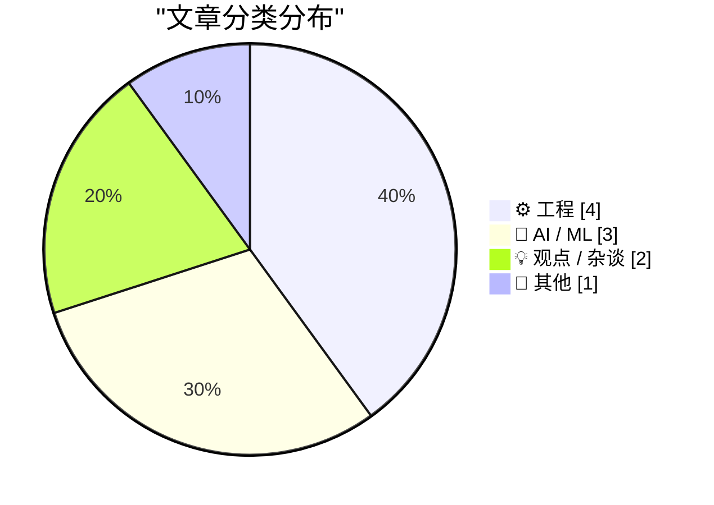
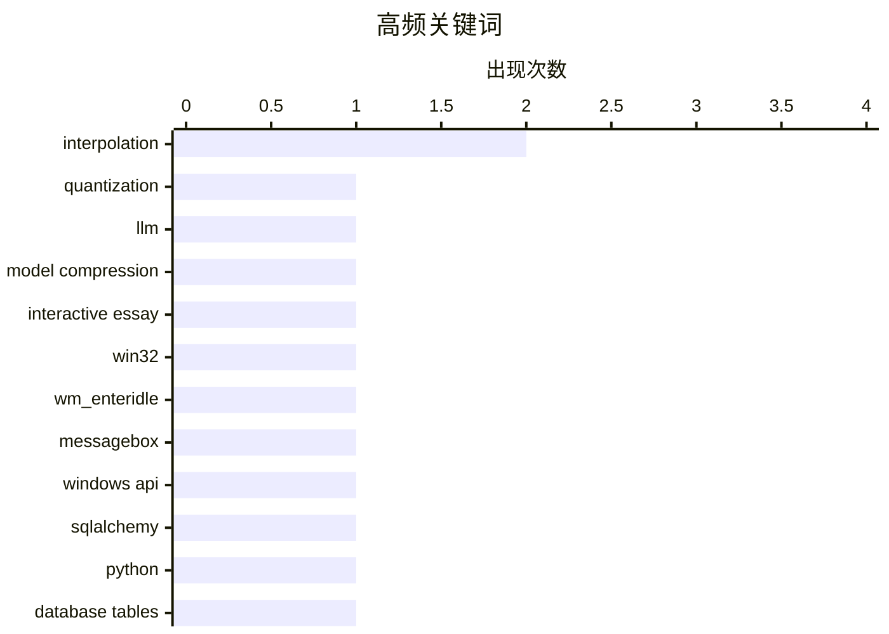

# 📰 AI 博客每日精选 — 2026-03-27

> 来自 Karpathy 推荐的 92 个顶级技术博客，AI 精选 Top 10

## 📝 今日看点

今天技术圈的主线很清晰：AI 正在从“拼参数”转向“拼工程效率与商业落地”，量化、蒸馏等轻量化路径成为焦点，同时大厂合作关系也在快速重组。另一条趋势是工程实践回归基本功——从数据库建模、系统消息机制到数值精度讨论，大家更关注可解释、可维护、可验证的技术细节。与之呼应的是开发文化层面的反思：简单代码、清晰协作和“以人为本”的技术表达，正重新成为专业价值的核心。

---

## 🏆 今日必读

🥇 **从零开始理解量化**

[Quantization from the ground up](https://simonwillison.net/2026/Mar/26/quantization-from-the-ground-up/#atom-everything) — simonwillison.net · 7 小时前 · 🤖 AI / ML

> 核心主题是解释大语言模型（LLM）量化的工作机制。摘录指出，Sam Rose 以交互式文章形式讲解了量化过程，并将其称为自己“可能写过最好的一篇”。内容还包含对浮点数如何用二进制位表示的可视化解释，被转述者评价为“见过最好的版本”。此外还提到量化中的 outlier values：这些罕见浮点值位于常见的小数值分布之外。整体观点是，这篇文章在概念讲解和可视化呈现上信息密度很高，适合系统理解量化基础。

💡 **为什么值得读**: 值得读在于它把“LLM 量化 + 二进制浮点表示 + 异常值（outlier）”三个关键难点放进同一篇强可视化的交互式解释中，学习效率很高。

🏷️ quantization, LLM, model compression, interactive essay

🥈 **Why doesn’t WM_ENTER­IDLE work if the dialog box is a Message­Box?**

[Why doesn’t WM_ENTER­IDLE work if the dialog box is a Message­Box?](https://devblogs.microsoft.com/oldnewthing/20260326-00/?p=112167) — devblogs.microsoft.com/oldnewthing · 9 小时前 · ⚙️ 工程

> Because it opted out. The post Why doesn’t WM_ ENTER&shy;IDLE work if the dialog box is a Message&shy;Box ? appeared first on The Old New Thing .

🏷️ Win32, WM_ENTERIDLE, MessageBox, Windows API

🥉 **SQLAlchemy 2 In Practice - Chapter 2 - Database Tables**

[SQLAlchemy 2 In Practice - Chapter 2 - Database Tables](https://blog.miguelgrinberg.com/post/sqlalchemy-2-in-practice---chapter-1---database-tables) — miguelgrinberg.com · 11 小时前 · ⚙️ 工程

> This is the second chapter of my SQLAlchemy 2 in Practice book. If you'd like to support my work, I encourage you to buy this book, either directly from my store or on Amazon . Thank you! This chapter

🏷️ SQLAlchemy, Python, database tables, ORM

---

## 📊 数据概览

| 扫描源 | 抓取文章 | 时间范围 | 精选 |
|:---:|:---:|:---:|:---:|
| 89/92 | 2528 篇 → 23 篇 | 24h | **10 篇** |

### 分类分布



### 高频关键词



<details>
<summary>📈 纯文本关键词图（终端友好）</summary>

```
interpolation     │ ████████████████████ 2
quantization      │ ██████████░░░░░░░░░░ 1
llm               │ ██████████░░░░░░░░░░ 1
model compression │ ██████████░░░░░░░░░░ 1
interactive essay │ ██████████░░░░░░░░░░ 1
win32             │ ██████████░░░░░░░░░░ 1
wm_enteridle      │ ██████████░░░░░░░░░░ 1
messagebox        │ ██████████░░░░░░░░░░ 1
windows api       │ ██████████░░░░░░░░░░ 1
sqlalchemy        │ ██████████░░░░░░░░░░ 1
```

</details>

### 🏷️ 话题标签

**interpolation**(2) · **quantization**(1) · **llm**(1) · model compression(1) · interactive essay(1) · win32(1) · wm_enteridle(1) · messagebox(1) · windows api(1) · sqlalchemy(1) · python(1) · database tables(1) · orm(1) · career growth(1) · code simplicity(1) · maintainability(1) · engineering culture(1) · numerical methods(1) · precision(1) · lookup tables(1)

---

## ⚙️ 工程

### 1. Why doesn’t WM_ENTER­IDLE work if the dialog box is a Message­Box?

[Why doesn’t WM_ENTER­IDLE work if the dialog box is a Message­Box?](https://devblogs.microsoft.com/oldnewthing/20260326-00/?p=112167) — **devblogs.microsoft.com/oldnewthing** · 9 小时前 · ⭐ 20/30

> Because it opted out. The post Why doesn’t WM_ ENTER&shy;IDLE work if the dialog box is a Message&shy;Box ? appeared first on The Old New Thing .

🏷️ Win32, WM_ENTERIDLE, MessageBox, Windows API

---

### 2. SQLAlchemy 2 In Practice - Chapter 2 - Database Tables

[SQLAlchemy 2 In Practice - Chapter 2 - Database Tables](https://blog.miguelgrinberg.com/post/sqlalchemy-2-in-practice---chapter-1---database-tables) — **miguelgrinberg.com** · 11 小时前 · ⭐ 20/30

> This is the second chapter of my SQLAlchemy 2 in Practice book. If you'd like to support my work, I encourage you to buy this book, either directly from my store or on Amazon . Thank you! This chapter

🏷️ SQLAlchemy, Python, database tables, ORM

---

### 3. How much precision can you squeeze out of a table?

[How much precision can you squeeze out of a table?](https://www.johndcook.com/blog/2026/03/26/table-precision/) — **johndcook.com** · 9 小时前 · ⭐ 16/30

> Richard Feynman said that almost everything becomes interesting if you look into it deeply enough. Looking up numbers in a table is certainly not interesting, but it becomes more interesting when you 

🏷️ numerical methods, interpolation, precision, lookup tables

---

### 4. Adding human.json to WordPress

[Adding human.json to WordPress](https://shkspr.mobi/blog/2026/03/adding-human-json-to-wordpress/) — **shkspr.mobi** · 11 小时前 · ⭐ 16/30

> Every few years, someone reinvents FOAF. The idea behind Friend-Of-A-Friend is that You can say "I, Alice, know and trust Bob". Bob can say "I know and trust Alice. I also know and trust Carl." That s

🏷️ WordPress, human.json, FOAF, identity

---

## 🤖 AI / ML

### 5. 从零开始理解量化

[Quantization from the ground up](https://simonwillison.net/2026/Mar/26/quantization-from-the-ground-up/#atom-everything) — **simonwillison.net** · 7 小时前 · ⭐ 20/30

> 核心主题是解释大语言模型（LLM）量化的工作机制。摘录指出，Sam Rose 以交互式文章形式讲解了量化过程，并将其称为自己“可能写过最好的一篇”。内容还包含对浮点数如何用二进制位表示的可视化解释，被转述者评价为“见过最好的版本”。此外还提到量化中的 outlier values：这些罕见浮点值位于常见的小数值分布之外。整体观点是，这篇文章在概念讲解和可视化呈现上信息密度很高，适合系统理解量化基础。

🏷️ quantization, LLM, model compression, interactive essay

---

### 6. Disney Drops Vaporware $1B Investment in OpenAI After Sora Got Axed

[Disney Drops Vaporware $1B Investment in OpenAI After Sora Got Axed](https://variety.com/2026/digital/news/openai-shutting-down-sora-video-disney-1236698277/) — **daringfireball.net** · 4 小时前 · ⭐ 19/30

> Todd Spangler, reporting for Variety: Disney has now ended its partnership with OpenAI, which included plans for the media conglomerate to take a $1 billion stake in the artificial-intelligence compan

🏷️ OpenAI, Disney, Sora, AI partnership

---

### 7. The Information: ‘Apple Can “Distill” Google’s Big Gemini Model’

[The Information: ‘Apple Can “Distill” Google’s Big Gemini Model’](https://www.theinformation.com/newsletters/ai-agenda/apple-can-distill-googles-big-gemini-model?rc=jfy0lk) — **daringfireball.net** · 6 小时前 · ⭐ 20/30

> Jessica E. Lessin, Amir Efrati, and Erin Woo, reporting for the paywalled-without-gift-links The Information: While we have reported that Apple can tweak, or fine-tune, a version of Google’s Gemini AI

🏷️ Apple, Gemini, model distillation, AI strategy

---

## 💡 观点 / 杂谈

### 8. Engineers do get promoted for writing simple code

[Engineers do get promoted for writing simple code](https://seangoedecke.com/simple-work-gets-rewarded/) — **seangoedecke.com** · 23 小时前 · ⭐ 20/30

> It’s a popular joke among software engineers that writing overcomplicated, unmaintainable code is a pathway to job security. After all, if you’re the only person who can work on a system, they can’t f

🏷️ career growth, code simplicity, maintainability, engineering culture

---

### 9. How we get radicalized in America

[How we get radicalized in America](https://idiallo.com/byte-size/how-to-get-radicalized-in-america?src=feed) — **idiallo.com** · 24 分钟前 · ⭐ 14/30

> Be healthy, be young, fall ill. You have a great job of course, you have insurance. It would be ok if the worst thing about health insurance in America was it is hard to navigate. No! The actual probl

🏷️ health insurance, radicalization, policy, America

---

## 📝 其他

### 10. Lebesgue constants

[Lebesgue constants](https://www.johndcook.com/blog/2026/03/26/lebesgue-constants/) — **johndcook.com** · 3 小时前 · ⭐ 15/30

> I alluded to Lebesgue constants in the previous post without giving them a name. There I said that the bound on order n interpolation error has the form where h is the spacing between interpolation po

🏷️ numerical analysis, Lebesgue constant, interpolation, error bounds

---

*生成于 2026-03-27 07:36 | 扫描 89 源 → 获取 2528 篇 → 精选 10 篇*
*基于 [Hacker News Popularity Contest 2025](https://refactoringenglish.com/tools/hn-popularity/) RSS 源列表*
