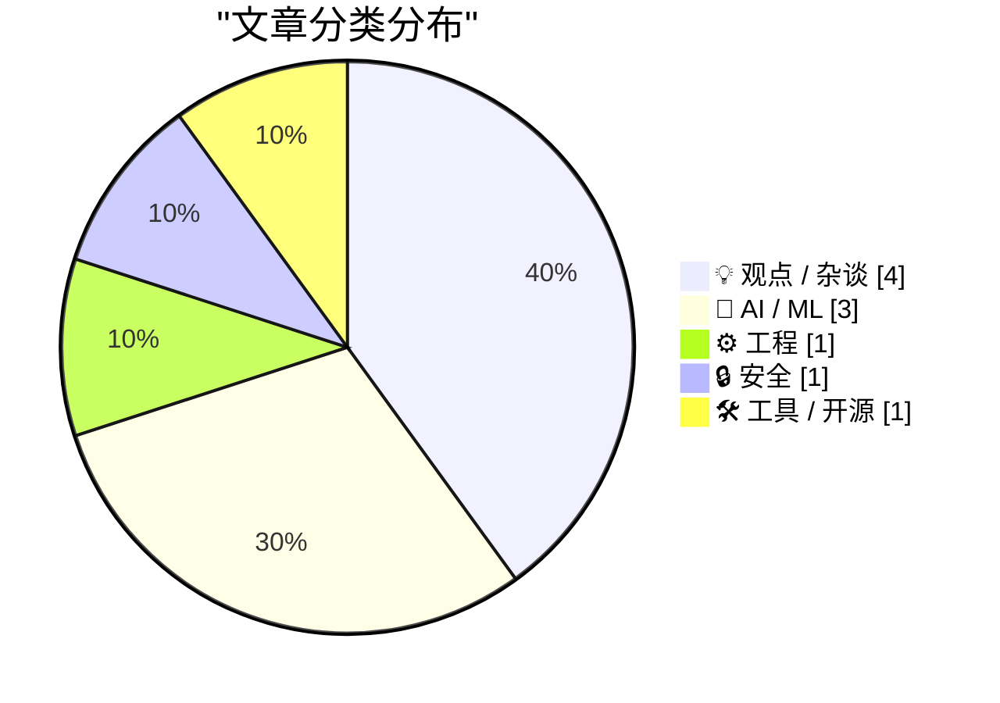
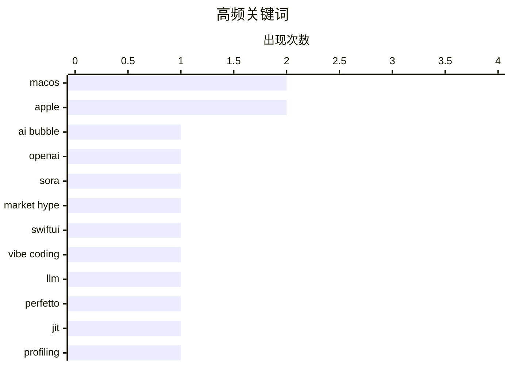

# 📰 AI 博客每日精选 — 2026-03-28

> 来自 Karpathy 推荐的 92 个顶级技术博客，AI 精选 Top 10

## 📝 今日看点

今天的技术话题正在从“AI 会不会改变一切”转向“AI 到底落地了多少”：大叙事被持续拆解，行业更看重可验证的合作与真实效果。与此同时，AI 编程已进入个人化提效阶段，本地大模型与 Vibe Coding 正在压缩从想法到可用工具的距离，也让“好品味神话”让位于可训练的经验能力。另一条主线是工程底盘再被抬到台前——性能可观测性、deopt 分析与分钟级安全响应，成为系统可信与效率竞争的关键。围绕开放 Web 与平台生态控制权的争论也在升温，技术社区对“谁掌握入口、谁定义规则”的警惕明显增强。

---

## 🏆 今日必读

🥇 **付费：AI 泡沫到底有多少是真的？**

[Premium: How Much Of The AI Bubble Is Real?](https://www.wheresyoured.at/premium-how-much-of-the-ai-bubble-is-real/) — wheresyoured.at · 5 小时前 · 🤖 AI / ML

> 文章聚焦于 AI 叙事中“高调宣布”与“实际落地”之间的落差，核心案例是 Disney 与 OpenAI 围绕 Sora 的合作传闻。文中指出，2025 年 12 月曾流传双方达成协议、Disney 成为 OpenAI 大客户并进行 10 亿美元股权投资，但作者称这些事项并未在 Disney 的 FY2025 年报和 2026 财年 Q1 报告中体现。与此同时，OpenAI 被报道将关停 Sora 相关产品线，包括消费者应用、开发者版本以及 ChatGPT 内视频功能，随后也有媒体确认 Disney 合作告吹。作者进一步对比了此前大量媒体将 Sora 描述为“冲击好莱坞”的激烈表述，与其仅约五个月后即被终止的现实反差。结论是，围绕 AI 产品的舆论传播中存在明显的营销放大与验证不足，这种失真会对真实行业从业者造成不必要恐慌。

💡 **为什么值得读**: 值得读在于它用可核对的时间线与公开信息拆解“AI 改变一切”的媒体叙事，帮助读者建立更审慎的信息判断框架。

🏷️ AI bubble, OpenAI, Sora, market hype

🥈 **用 Vibe Coding 开发 SwiftUI 应用非常有趣**

[Vibe coding SwiftUI apps is a lot of fun](https://simonwillison.net/2026/Mar/27/vibe-coding-swiftui/#atom-everything) — simonwillison.net · 2 小时前 · 🤖 AI / ML

> 作者在入手 128GB M5 MacBook Pro 后，尝试用本地大模型快速做出替代 Activity Monitor 的性能监控工具。实践显示，Claude Opus 4.6 和 GPT-5.4 在 SwiftUI 开发上表现很强，完整应用甚至可放在单个文本文件中，不用打开 Xcode 也能迭代。作者先做了 Bandwidther，用于区分互联网与局域网流量，并逐步加入按进程带宽、反向 DNS（同时保留原始 IP）、双栏布局和菜单栏图标面板等功能，代码已开源在 simonw/bandwidther。随后又并行做了 Gpuer，用于观察 GPU 与内存占用，重点补足 Activity Monitor 中不易直接看到的 GPU/RAM 信息，并通过 system_profiler 和 memory_pressure 收集数据。整体结论是，这种以提示驱动的 SwiftUI“vibe coding”流程能非常快地做出实用 macOS 小工具，体验也很愉快。

💡 **为什么值得读**: 值得读在于它给出了可复用的真实开发路径：如何用 Claude/GPT 低提示成本地从零搭建并迭代可用的 SwiftUI 菜单栏监控应用。

🏷️ SwiftUI, vibe coding, LLM, macOS

🥉 **在 ZJIT 中使用 Perfetto**

[Using Perfetto in ZJIT](https://bernsteinbear.com/blog/zjit-perfetto/?utm_source=rss) — bernsteinbear.com · 23 小时前 · ⚙️ 工程

> ZJIT 当前面临的核心性能问题是执行频繁从已编译代码回退到解释器（side-exit/deopt），这会明显拖慢速度。现有的 `--zjit-stats` 能在进程退出时给出汇总计数，示例中 Lobsters 基准出现了 12,549,876 次 side exit，主要原因是 `guard_type_failure`（48.0%）和 `guard_shape_failure`（44.3%）。同一份统计还给出了 `guard_type_exit_ratio` 4.5%、`guard_shape_exit_ratio` 11.3%、`ratio_in_zjit` 82.8%、`compiled_iseq_count` 5,581、`compile_time` 1,443ms，以及代码区和总内存占用等指标。作者认为计数器适合快速、稳定地跟踪优化方向，但仅凭这些数字很难建立“是否真的高/低、慢点到底在哪”的直觉。要定位退出究竟由哪些 Ruby 代码触发，需要引入栈信息和更可视化的慢事件追踪（如 Perfetto），而不只看汇总统计。

💡 **为什么值得读**: 值得读在于它用真实的 ZJIT 指标展示了“统计计数够监控但不够定位”的典型困境，并给出从计数走向可视化追踪的明确分析思路。

🏷️ Perfetto, JIT, profiling, Ruby

---

## 📊 数据概览

| 扫描源 | 抓取文章 | 时间范围 | 精选 |
|:---:|:---:|:---:|:---:|
| 89/92 | 2530 篇 → 21 篇 | 24h | **10 篇** |

### 分类分布



### 高频关键词



<details>
<summary>📈 纯文本关键词图（终端友好）</summary>

```
macos       │ ████████████████████ 2
apple       │ ████████████████████ 2
ai bubble   │ ██████████░░░░░░░░░░ 1
openai      │ ██████████░░░░░░░░░░ 1
sora        │ ██████████░░░░░░░░░░ 1
market hype │ ██████████░░░░░░░░░░ 1
swiftui     │ ██████████░░░░░░░░░░ 1
vibe coding │ ██████████░░░░░░░░░░ 1
llm         │ ██████████░░░░░░░░░░ 1
perfetto    │ ██████████░░░░░░░░░░ 1
```

</details>

### 🏷️ 话题标签

**macos**(2) · **apple**(2) · **ai bubble**(1) · openai(1) · sora(1) · market hype(1) · swiftui(1) · vibe coding(1) · llm(1) · perfetto(1) · jit(1) · profiling(1) · ruby(1) · ai era(1) · taste(1) · experience(1) · career growth(1) · open web(1) · ai platforms(1) · internet culture(1)

---

## 💡 观点 / 杂谈

### 1. “好品味”其实只是经验

[“Good Taste” Is Just Experience](https://terriblesoftware.org/2026/03/27/good-taste-is-just-experience/) — **terriblesoftware.org** · 3 小时前 · ⭐ 23/30

> 文章质疑“AI 时代品味才是唯一差异化能力”的流行说法，指出很多人所说的“品味”本质上是长期实践形成的经验与模式识别。把这种能力称为“品味”会把可习得技能误导成天赋，制造“你有或没有”的二元叙事。作者以工程管理与代码评审为例，说明自己对管理决策和 PR 质量的直觉来自多年 1:1、艰难沟通、绩效反馈与项目成败积累，而非与生俱来。对初级工程师而言，“你需要品味”容易造成挫败感；“你需要练习次数（reps）”才更准确地传达成长路径，即在反复处理模糊问题中逐步形成判断力。结论是所谓“品味”会随着持续交付、评审、踩坑和复盘自然出现，否认这一点的人往往只是忘了自己当年也靠大量练习才走到今天。

🏷️ AI era, taste, experience, career growth

---

### 2. Endgame for the Open Web

[Endgame for the Open Web](https://anildash.com/2026/03/27/endgame-open-web/) — **anildash.com** · 23 小时前 · ⭐ 23/30

> Endgame for the Open Web 27 Mar 2026 2026-03-27 2026-03-27 /images/tunnel.jpg web, internet, ai, culture You must imagine Sam Altman holding a knife to Tim Berners-Lee's throat. It's not a pleasant im

🏷️ open web, AI platforms, internet culture, web standards

---

### 3. An Intention Upgrade

[An Intention Upgrade](https://feed.tedium.co/link/15204/17307620/apple-mac-pro-discontinued-anniversary) — **tedium.co** · 7 小时前 · ⭐ 21/30

> An Intention Upgrade By ditching the Mac Pro so close to its 50th anniversary, Apple is making a statement of intent for its next 50 years. By Ernie Smith • March 27, 2026 https://static.tedium.co/upl

🏷️ Apple, Mac Pro, Apple Silicon, upgradeability

---

### 4. ★ Apple Giveth, Apple Taketh Away

[★ Apple Giveth, Apple Taketh Away](https://daringfireball.net/2026/03/apple_giveth_apple_taketh_away) — **daringfireball.net** · 2 小时前 · ⭐ 19/30

> By John Gruber Archive The Talk Show Dithering Projects Contact Colophon Feeds / Social Twitter --> Sponsorship npx workos : An AI agent that writes auth directly into your codebase. Apple Giveth, App

🏷️ Apple, macOS, Safari, UX

---

## 🤖 AI / ML

### 5. 付费：AI 泡沫到底有多少是真的？

[Premium: How Much Of The AI Bubble Is Real?](https://www.wheresyoured.at/premium-how-much-of-the-ai-bubble-is-real/) — **wheresyoured.at** · 5 小时前 · ⭐ 26/30

> 文章聚焦于 AI 叙事中“高调宣布”与“实际落地”之间的落差，核心案例是 Disney 与 OpenAI 围绕 Sora 的合作传闻。文中指出，2025 年 12 月曾流传双方达成协议、Disney 成为 OpenAI 大客户并进行 10 亿美元股权投资，但作者称这些事项并未在 Disney 的 FY2025 年报和 2026 财年 Q1 报告中体现。与此同时，OpenAI 被报道将关停 Sora 相关产品线，包括消费者应用、开发者版本以及 ChatGPT 内视频功能，随后也有媒体确认 Disney 合作告吹。作者进一步对比了此前大量媒体将 Sora 描述为“冲击好莱坞”的激烈表述，与其仅约五个月后即被终止的现实反差。结论是，围绕 AI 产品的舆论传播中存在明显的营销放大与验证不足，这种失真会对真实行业从业者造成不必要恐慌。

🏷️ AI bubble, OpenAI, Sora, market hype

---

### 6. 用 Vibe Coding 开发 SwiftUI 应用非常有趣

[Vibe coding SwiftUI apps is a lot of fun](https://simonwillison.net/2026/Mar/27/vibe-coding-swiftui/#atom-everything) — **simonwillison.net** · 2 小时前 · ⭐ 24/30

> 作者在入手 128GB M5 MacBook Pro 后，尝试用本地大模型快速做出替代 Activity Monitor 的性能监控工具。实践显示，Claude Opus 4.6 和 GPT-5.4 在 SwiftUI 开发上表现很强，完整应用甚至可放在单个文本文件中，不用打开 Xcode 也能迭代。作者先做了 Bandwidther，用于区分互联网与局域网流量，并逐步加入按进程带宽、反向 DNS（同时保留原始 IP）、双栏布局和菜单栏图标面板等功能，代码已开源在 simonw/bandwidther。随后又并行做了 Gpuer，用于观察 GPU 与内存占用，重点补足 Activity Monitor 中不易直接看到的 GPU/RAM 信息，并通过 system_profiler 和 memory_pressure 收集数据。整体结论是，这种以提示驱动的 SwiftUI“vibe coding”流程能非常快地做出实用 macOS 小工具，体验也很愉快。

🏷️ SwiftUI, vibe coding, LLM, macOS

---

### 7. An AI Odyssey, Part 3: Lost Needle in the Haystack

[An AI Odyssey, Part 3: Lost Needle in the Haystack](https://www.johndcook.com/blog/2026/03/27/an-ai-odyssey-part-3-lost-needle-in-the-haystack/) — **johndcook.com** · 7 小时前 · ⭐ 19/30

> While shopping on a major e-commerce site, I wanted to get an answer to an obscure question about a certain product. Not finding the answer immediately on the product page, I thought I’d try clicking 

🏷️ AI assistant, e-commerce, RAG, search

---

## ⚙️ 工程

### 8. 在 ZJIT 中使用 Perfetto

[Using Perfetto in ZJIT](https://bernsteinbear.com/blog/zjit-perfetto/?utm_source=rss) — **bernsteinbear.com** · 23 小时前 · ⭐ 24/30

> ZJIT 当前面临的核心性能问题是执行频繁从已编译代码回退到解释器（side-exit/deopt），这会明显拖慢速度。现有的 `--zjit-stats` 能在进程退出时给出汇总计数，示例中 Lobsters 基准出现了 12,549,876 次 side exit，主要原因是 `guard_type_failure`（48.0%）和 `guard_shape_failure`（44.3%）。同一份统计还给出了 `guard_type_exit_ratio` 4.5%、`guard_shape_exit_ratio` 11.3%、`ratio_in_zjit` 82.8%、`compiled_iseq_count` 5,581、`compile_time` 1,443ms，以及代码区和总内存占用等指标。作者认为计数器适合快速、稳定地跟踪优化方向，但仅凭这些数字很难建立“是否真的高/低、慢点到底在哪”的直觉。要定位退出究竟由哪些 Ruby 代码触发，需要引入栈信息和更可视化的慢事件追踪（如 Perfetto），而不只看汇总统计。

🏷️ Perfetto, JIT, profiling, Ruby

---

## 🔒 安全

### 9. 我对 LiteLLM 恶意软件攻击的分钟级响应记录

[My minute-by-minute response to the LiteLLM malware attack](https://simonwillison.net/2026/Mar/26/response-to-the-litellm-malware-attack/#atom-everything) — **simonwillison.net** · 23 小时前 · ⭐ 23/30

> 这条内容聚焦于 LiteLLM 在 PyPI 上出现恶意包后的应急响应过程，以及漏洞如何被确认并上报。Callum McMahon 已将该攻击报告给 PyPI，并公开了他借助 Claude 进行确认和决策的对话记录。对话显示，Claude 在隔离 Docker 容器中检查刚从 PyPI 下载的 `litellm-1.82.8-py3-none-any.whl`，发现了 `litellm_init.pth`（34628 字节）并识别出包含 base64 解码执行的可疑代码。记录中明确指出恶意版本 `litellm==1.82.8` 当时仍在 PyPI 可安装状态，安装或升级可能被感染，并建议立即联系 `security@pypi.org`。Simon Willison 还提到，他很高兴看到对方使用自己的 `claude-code-transcripts` 工具发布完整转录。

🏷️ PyPI, supply chain, malware, LiteLLM

---

## 🛠 工具 / 开源

### 10. 用这个 Raspberry Pi FireWire HAT 让 MiniDV 重获新生

[Bring back MiniDV with this Raspberry Pi FireWire HAT](https://www.jeffgeerling.com/blog/2026/minidv-with-raspberry-pi-firewire-hat/) — **jeffgeerling.com** · 9 小时前 · ⭐ 21/30

> 文章聚焦于用 Raspberry Pi 5 + Firehat + PiSugar3 Plus 电池，做一套可携带的 MRU（Memory Recording Unit），替代老式 FireWire/i.Link/DV 摄像机的磁带记录方式。方案可直接连接 MiniDV 摄像机录制，也可用 dvgrab 把 MiniDV 磁带归档到树莓派，并支持其他 FireWire 设备（如音频接口、硬盘）；作者还提到在 macOS Tahoe 取消 FireWire 支持后，这类方案的现实价值更高。硬件包含 Raspberry Pi 5、Firehat（原型版）、5000mAh PiSugar 3 Plus、4-pin 转 6-pin FireWire 线和 Canon GL1，电池续航约 2-4 小时，在 64GB microSD 连续录制实测超过 3 小时。软件侧需要先为 Pi OS 重新编译并启用 Linux FireWire 支持，再安装 Firehat 软件；系统通过按键、蜂鸣器、LED 和 OLED 提供录制控制与状态显示（时间、IP、存储、电量），录制文件默认保存到用户主目录 captures。整体结论是，这套基于树莓派的 FireWire 方案能以现代、便携且可扩展的方式延续 MiniDV/FireWire 工作流，替代昂贵的二手 MRU 设备。

🏷️ Raspberry Pi, FireWire, MiniDV, dvgrab

---

*生成于 2026-03-28 07:08 | 扫描 89 源 → 获取 2530 篇 → 精选 10 篇*
*基于 [Hacker News Popularity Contest 2025](https://refactoringenglish.com/tools/hn-popularity/) RSS 源列表*
