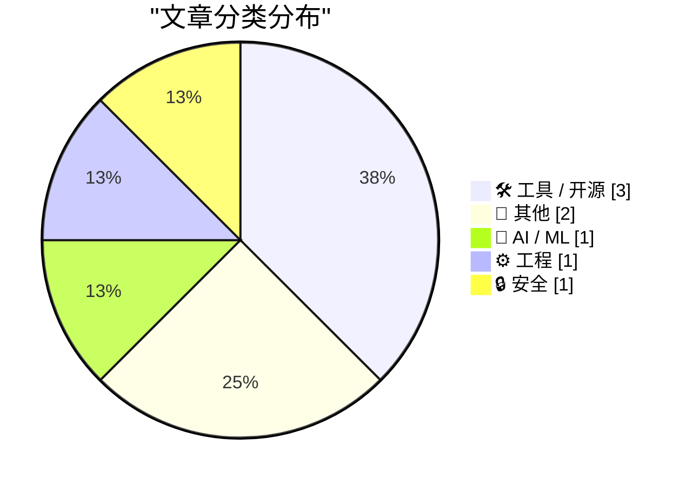
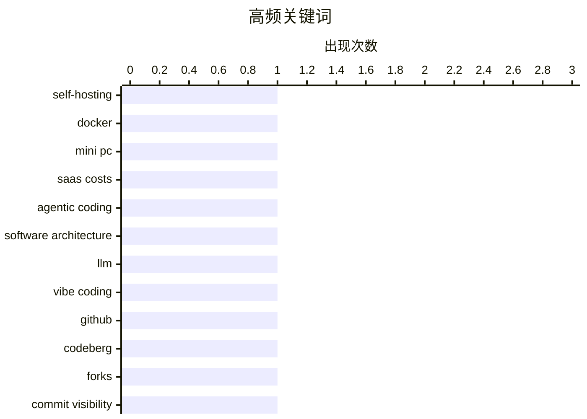

# 📰 AI 博客每日精选 — 2026-03-29

> 来自 Karpathy 推荐的 92 个顶级技术博客，AI 精选 Top 8

## 📝 今日看点

今天技术圈的主线很清晰：一边是“自己掌控”，一边是“平台化托管”，企业与个人都在重新计算成本、效率与控制权。无论是自托管是否还划算，还是 Apple Business 这类一体化管理平台上线，都说明基础设施决策正从“能不能做”转向“长期总成本和治理能力谁更优”。AI 工程实践也进入务实阶段，agentic coding 被强调要在效果与算力开销之间做精细权衡，而不是盲目让代理无限迭代。与此同时，安全与供应链不确定性继续抬升，锁定模式的防护表现和地缘冲击下的能源应对共同提醒行业：韧性正在成为技术系统的核心指标。

---

## 🏆 今日必读

🥇 **自托管：现在还值得吗？**

[Self-Hosting: Still Worth It?](https://feed.tedium.co/link/15204/17308221/self-hosting-platform-tools-guide) — tedium.co · 7 小时前 · 🛠 工具 / 开源

> 焦点问题是：在内存与硬盘价格上涨、SaaS 订阅成本持续累积的 2026 年，把迷你 PC 改造成家庭服务器进行自托管是否仍然划算，且是否适合普通用户。作者以 Kamrui Hyper H1 Mini Gaming PC 为切入点重新审视自托管栈，结合自己长期使用 Ryzen 5600U 迷你主机跑 Docker 容器的经验，认为 Ryzen 系列迷你 PC 在灵活性与性能价格比上依然有吸引力。文中给出这台评测机的关键配置：24GB 焊死不可升级内存、Ryzen 7 7735HS（54W，定位接近 Ryzen 7 6800HS）以及 Linux 下识别为 Radeon 680M 的核显，并提到当前高价内存环境让“焊死内存”呈现出不同于以往的权衡。作者同时指出自身痛点更多在软件层：最初按桌面机搭建的系统逐步堆叠大量容器后，维护与重构需求上升。结论倾向于以一次硬件评测为契机，重新验证“迷你 PC + 容器化”这条反 SaaS 路径在当下的现实可行性，而不是简单沿用过去经验。

💡 **为什么值得读**: 它把“硬件涨价 + SaaS 涨价”这两个现实压力放到同一张账本里，用具体设备与容器实践来检验自托管是否仍是可执行方案。

🏷️ self-hosting, Docker, mini PC, SaaS costs

🥈 **引用 Matt Webb**

[Quoting Matt Webb](https://simonwillison.net/2026/Mar/28/matt-webb/#atom-everything) — simonwillison.net · 11 小时前 · 🤖 AI / ML

> 这则内容聚焦于“agentic coding”在工程实践中的取舍：智能体虽然能靠循环迭代把问题“磨碎”并最终解出，但过程可能极其昂贵。Matt Webb 指出，理想目标不是让 AI 代理不计成本地完成任务，而是要以更快速度产出可维护、可适应、可组合的代码结果。为实现这一点，底层需要高质量库来封装复杂问题，并通过优秀接口把“正确做法”变成开发者最容易采取的路径。对应到开发者工作方式，他强调自己在“vibing”（而非传统“coding”）时，关注具体代码行更少，关注架构更多。整体观点是：在 AI 辅助编程时代，技术架构与库设计是决定长期效率和系统质量的关键。

💡 **为什么值得读**: 它把“AI 代理能做成事”与“如何以可持续方式把事做对”清晰区分开来，对正在使用 AI 写代码的人有直接的方法论价值。

🏷️ agentic coding, software architecture, LLM, vibe coding

🥉 **通过原始仓库访问分叉提交**

[Fork Commits via Original Repository](https://susam.net/fork-commits-via-original-repo.html) — susam.net · 23 小时前 · ⚙️ 工程

> 文章用两个演示仓库做了一个 Git 托管行为实验：原始仓库 cuppa，以及其分叉并含有可疑改动的 muppa。测试的关键提交是 f79ef5a，它只存在于分叉仓库 muppa，不在原始仓库 cuppa。对该提交使用直链访问时，在 muppa 下 Codeberg 和 GitHub 都能正常打开；但在 cuppa 下两者表现不同：Codeberg 返回 404，GitHub 则能显示该提交。GitHub 页面还给出提示，说明该提交不属于此仓库的任何分支，可能来自仓库外部的某个 fork。结论是，在“通过原始仓库直链访问仅存在于 fork 的提交”这一行为上，Codeberg 与 GitHub 的处理方式并不一致。

💡 **为什么值得读**: 它用一个最小可复现实验直接揭示了 Codeberg 与 GitHub 在 commit 可见性上的差异，能帮助你判断跨平台查看 fork 提交时会遇到的实际行为。

🏷️ GitHub, Codeberg, forks, commit visibility

---

## 📊 数据概览

| 扫描源 | 抓取文章 | 时间范围 | 精选 |
|:---:|:---:|:---:|:---:|
| 89/92 | 2530 篇 → 14 篇 | 24h | **8 篇** |

### 分类分布



### 高频关键词



<details>
<summary>📈 纯文本关键词图（终端友好）</summary>

```
self-hosting          │ ████████████████████ 1
docker                │ ████████████████████ 1
mini pc               │ ████████████████████ 1
saas costs            │ ████████████████████ 1
agentic coding        │ ████████████████████ 1
software architecture │ ████████████████████ 1
llm                   │ ████████████████████ 1
vibe coding           │ ████████████████████ 1
github                │ ████████████████████ 1
codeberg              │ ████████████████████ 1
```

</details>

### 🏷️ 话题标签

**self-hosting**(1) · **docker**(1) · **mini pc**(1) · saas costs(1) · agentic coding(1) · software architecture(1) · llm(1) · vibe coding(1) · github(1) · codeberg(1) · forks(1) · commit visibility(1) · datasette(1) · plugin(1) · markdown export(1) · showboat(1) · lockdown mode(1) · spyware(1) · apple(1) · ios security(1)

---

## 🛠 工具 / 开源

### 1. 自托管：现在还值得吗？

[Self-Hosting: Still Worth It?](https://feed.tedium.co/link/15204/17308221/self-hosting-platform-tools-guide) — **tedium.co** · 7 小时前 · ⭐ 23/30

> 焦点问题是：在内存与硬盘价格上涨、SaaS 订阅成本持续累积的 2026 年，把迷你 PC 改造成家庭服务器进行自托管是否仍然划算，且是否适合普通用户。作者以 Kamrui Hyper H1 Mini Gaming PC 为切入点重新审视自托管栈，结合自己长期使用 Ryzen 5600U 迷你主机跑 Docker 容器的经验，认为 Ryzen 系列迷你 PC 在灵活性与性能价格比上依然有吸引力。文中给出这台评测机的关键配置：24GB 焊死不可升级内存、Ryzen 7 7735HS（54W，定位接近 Ryzen 7 6800HS）以及 Linux 下识别为 Radeon 680M 的核显，并提到当前高价内存环境让“焊死内存”呈现出不同于以往的权衡。作者同时指出自身痛点更多在软件层：最初按桌面机搭建的系统逐步堆叠大量容器后，维护与重构需求上升。结论倾向于以一次硬件评测为契机，重新验证“迷你 PC + 容器化”这条反 SaaS 路径在当下的现实可行性，而不是简单沿用过去经验。

🏷️ self-hosting, Docker, mini PC, SaaS costs

---

### 2. datasette-showboat 0.1a2

[datasette-showboat 0.1a2](https://simonwillison.net/2026/Mar/27/datasette-showboat/#atom-everything) — **simonwillison.net** · 23 小时前 · ⭐ 19/30

> 这条发布信息聚焦于 Datasette 插件 datasette-showboat 的 0.1a2 版本更新。该插件与 SHOWBOAT_REMOTE_URL 相关，用于配合 Showboat 将内容发布到远程服务器。新版本新增了从应用导出 Markdown 文件的选项。这个导出能力用于让 Showboat 以增量方式发布更新，而不是一次性全量推送。整体上，这是一次围绕远程发布流程与增量更新能力的功能增强。

🏷️ Datasette, plugin, Markdown export, Showboat

---

### 3. Apple 发布 Apple Business：面向各类规模企业的一体化新平台

[Apple Announces Ads Are Coming to Apple Maps](https://www.apple.com/newsroom/2026/03/introducing-apple-business-a-new-all-in-one-platform-for-businesses-of-all-sizes/) — **daringfireball.net** · 23 小时前 · ⭐ 20/30

> 苹果发布了 Apple Business，一体化整合企业运行与增长所需能力，并将于 4 月 14 日在 200 多个国家和地区上线。平台内置移动设备管理（MDM），可在单一界面管理设备与策略，并通过 Blueprints 预配置设置和应用，实现一致性、安全性及零接触部署，重点降低中小企业 IT 门槛。它还提供企业邮箱、日历和通讯录服务，并支持自定义域名，用于提升团队沟通与协作。Apple Business 同时打通 Apple Maps、Mail、Wallet、Siri 等触点帮助商家触达本地客户，并计划今夏在美国和加拿大开放 Maps 本地广告投放选项。整体方向是把苹果现有企业能力统一到一个更简洁、安全的平台中，覆盖设备管理、协作工具与获客场景。

🏷️ Apple Maps, local ads, Apple Business, MDM

---

## 📝 其他

### 4. 阅读清单 03/28/26

[Reading List 03/28/26](https://www.construction-physics.com/p/reading-list-032826) — **construction-physics.com** · 11 小时前 · ⭐ 15/30

> 这期阅读清单聚焦霍尔木兹海峡关闭后的连锁冲击，以及住房政策与产业技术领域的多条动态。能源供应受扰后，印度、韩国、印尼、泰国、菲律宾和越南等国提高了煤电使用；美国环保署则临时放宽部分乙醇汽油销售限制以缓解油价压力。受石油相关原料影响，陶氏化学在3月每磅上调10美分后，计划4月再上调30美分，塑料价格自2月以来累计上涨近40%；同时，药品原料与液氦（MRI冷却用途）等供应也出现风险信号。中东局势还波及基础设施与航运，包括一处AWS中东数据中心 reportedly 遭无人机袭击，以及伊朗设立每船收费200万美元的“安全航道”。在产业与政策面，战争以来中国电池企业股价显著上涨（CATL +19%、Sungrow +19.4%、BYD +21.9%），美国住房法案中“禁止建造建后出租独栋房”条款则引发“可能抑制供给”的争议。

🏷️ industrial technology, energy markets, data centers, battery manufacturing

---

### 5. OpenBenches 达到 4 万条目

[OpenBenches hits 40k](https://shkspr.mobi/blog/2026/03/openbenches-hits-40k/) — **shkspr.mobi** · 10 小时前 · ⭐ 9/30

> OpenBenches 这个众包纪念长椅网站在 2026 年 3 月达到 40,000 条收录。里程碑由长期贡献者 jrbray1 新增的一条纪念长椅记录触发，文中还提到可进一步了解 Dr Judy John 及其生物多样性工作。文章给出了历史增长节点：2018 年 12 月 10K、2021 年 8 月 20K、2023 年 11 月 30K、2026 年 3 月 40K。作者用一张增长曲线图展示“number go up”，并预测 50K 可能在 2027 年 9 月左右达到。结尾呼吁用户在外出时拍摄带地理标签的纪念长椅照片并上传到 OpenBenches.org，达到 50K 时还计划举办庆祝派对。

🏷️ crowdsourcing, open data, geotagging, community

---

## 🤖 AI / ML

### 6. 引用 Matt Webb

[Quoting Matt Webb](https://simonwillison.net/2026/Mar/28/matt-webb/#atom-everything) — **simonwillison.net** · 11 小时前 · ⭐ 21/30

> 这则内容聚焦于“agentic coding”在工程实践中的取舍：智能体虽然能靠循环迭代把问题“磨碎”并最终解出，但过程可能极其昂贵。Matt Webb 指出，理想目标不是让 AI 代理不计成本地完成任务，而是要以更快速度产出可维护、可适应、可组合的代码结果。为实现这一点，底层需要高质量库来封装复杂问题，并通过优秀接口把“正确做法”变成开发者最容易采取的路径。对应到开发者工作方式，他强调自己在“vibing”（而非传统“coding”）时，关注具体代码行更少，关注架构更多。整体观点是：在 AI 辅助编程时代，技术架构与库设计是决定长期效率和系统质量的关键。

🏷️ agentic coding, software architecture, LLM, vibe coding

---

## ⚙️ 工程

### 7. 通过原始仓库访问分叉提交

[Fork Commits via Original Repository](https://susam.net/fork-commits-via-original-repo.html) — **susam.net** · 23 小时前 · ⭐ 20/30

> 文章用两个演示仓库做了一个 Git 托管行为实验：原始仓库 cuppa，以及其分叉并含有可疑改动的 muppa。测试的关键提交是 f79ef5a，它只存在于分叉仓库 muppa，不在原始仓库 cuppa。对该提交使用直链访问时，在 muppa 下 Codeberg 和 GitHub 都能正常打开；但在 cuppa 下两者表现不同：Codeberg 返回 404，GitHub 则能显示该提交。GitHub 页面还给出提示，说明该提交不属于此仓库的任何分支，可能来自仓库外部的某个 fork。结论是，在“通过原始仓库直链访问仅存在于 fork 的提交”这一行为上，Codeberg 与 GitHub 的处理方式并不一致。

🏷️ GitHub, Codeberg, forks, commit visibility

---

## 🔒 安全

### 8. 苹果称尚未发现锁定模式曾被利用攻破

[Apple Says It’s Not Aware of Lockdown Mode Ever Having Been Exploited](https://techcrunch.com/2026/03/27/apple-says-no-one-using-lockdown-mode-has-been-hacked-with-spyware/) — **daringfireball.net** · 23 小时前 · ⭐ 22/30

> 苹果表示，自 2022 年推出可选安全功能“锁定模式”（Lockdown Mode）近四年来，尚未发现开启该模式的设备遭“雇佣型间谍软件”成功入侵。该模式通过关闭 iPhone 等设备中常被利用的部分功能来缩小攻击面，目标是保护高风险人群应对来自 Intellexa、NSO Group、Paragon Solutions 等相关威胁。苹果称已向 150 多个国家的用户多次发送“可能遭间谍软件攻击”的通知，显示其对这类攻击的可见性在提升。国际特赦组织安全实验室与多伦多大学 Citizen Lab 的公开研究也未报告过绕过锁定模式的成功案例，且至少两起事件中该模式曾直接阻断 Pegasus 和 Predator 攻击；谷歌研究人员还记录到有间谍软件在检测到锁定模式后放弃感染。多位安全研究者据此认为，锁定模式是面向消费者最激进的加固能力之一，显著提高了攻击苹果用户的难度。

🏷️ Lockdown Mode, spyware, Apple, iOS security

---

*生成于 2026-03-29 07:25 | 扫描 89 源 → 获取 2530 篇 → 精选 8 篇*
*基于 [Hacker News Popularity Contest 2025](https://refactoringenglish.com/tools/hn-popularity/) RSS 源列表*
