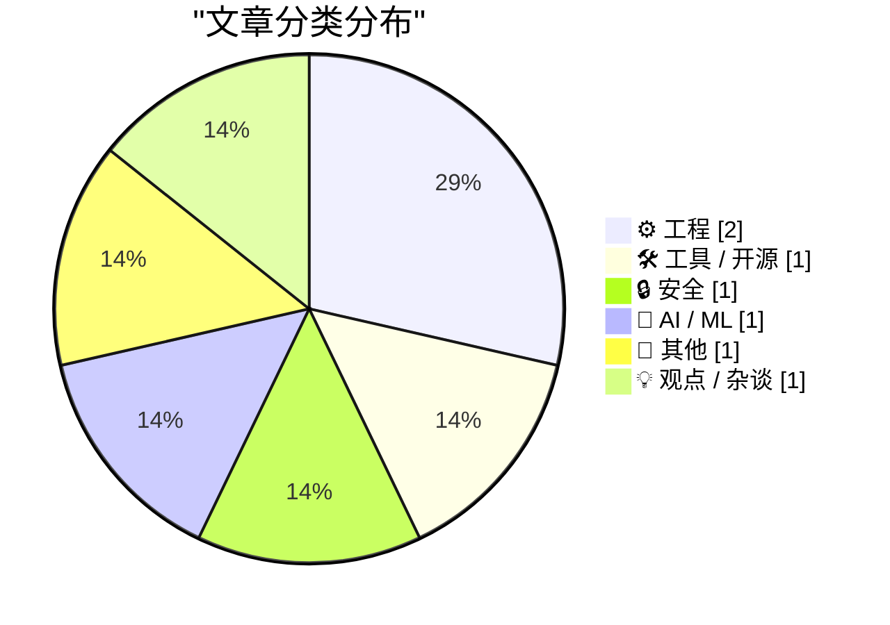
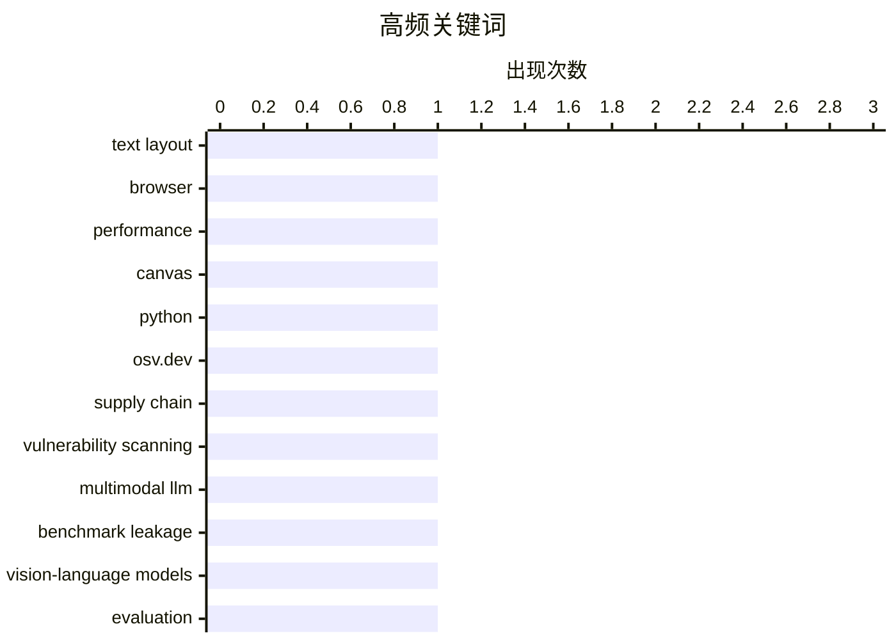

# 📰 AI 博客每日精选 — 2026-03-30

> 来自 Karpathy 推荐的 92 个顶级技术博客，AI 精选 Top 7

## 📝 今日看点

今天技术圈的主线很清晰：一边是工程基础能力在“做实做细”，另一边是对 AI 能力边界的“去神话化”审视。开发工具与工程实践层面，从无需直接操作 DOM 的前端排版能力，到面向 Python 依赖的漏洞快速检索，再到“包角色”这种更本质的软件组织视角，都在强调可维护性、可验证性与效率优先。与此同时，多模态模型“视觉理解”被质疑存在“海市蜃楼”效应，提醒行业从演示效果转向机制与证据。消费科技舆论则继续围绕苹果新品与历史产品评价升温，显示出技术叙事正同时被工程现实、AI反思和品牌生态三股力量驱动。

---

## 🏆 今日必读

🥇 **Pretext**

[Pretext](https://simonwillison.net/2026/Mar/29/pretext/#atom-everything) — simonwillison.net · 12 小时前 · 🛠 工具 / 开源

> Pretext 是 Cheng Lou 推出的浏览器库，核心是无需触碰 DOM 就能计算自动换行段落的高度。它把流程拆成一次性的 prepare() 和可重复调用的 layout()：prepare() 先将文本切分为片段（可处理软连字符、非拉丁字符序列、emoji 等）并通过离屏 canvas 测量并缓存；layout() 再模拟浏览器换行逻辑，在给定宽度下计算行数与整体高度。相比“先渲染再测量”的传统做法，这种方案显著降低了开销，从而支持更多实时文本渲染效果。测试上，项目早期用多浏览器渲染《了不起的盖茨比》全文做基准校验，后续扩展到泰语、中文、韩语、日语、阿拉伯语等长文本语料。作者还强调该引擎体积很小（几 KB）、考虑浏览器差异，并支持复杂多语种与平台特定 emoji 组合。

💡 **为什么值得读**: 它给出了一个可落地的高性能文本布局思路：把昂贵测量前置并缓存，再用轻量布局计算替代 DOM 测量，兼顾速度、精度与多语言支持。

🏷️ text layout, browser, performance, canvas

🥈 **Python 漏洞查询**

[Python Vulnerability Lookup](https://simonwillison.net/2026/Mar/29/python-vulnerability-lookup/#atom-everything) — simonwillison.net · 14 小时前 · 🔒 安全

> 一个用于查询 Python 依赖安全漏洞的在线工具。该工具支持直接粘贴 `pyproject.toml` 或 `requirements.txt`，也可以输入包含这些文件的 GitHub 仓库来加载依赖。它通过查询 OSV.dev 的漏洞数据库，返回已报告漏洞的详细信息，包括严重级别、受影响版本范围以及完整披露报告链接。作者提到自己了解到 OSV.dev 提供开放的 CORS JSON API，并据此用 Claude Code 构建了这个 HTML 工具。整体观点是借助 OSV.dev 的开放接口，可以快速把 Python 依赖清单转化为可操作的漏洞可见性结果。

💡 **为什么值得读**: 值得读在于它给出了一个可直接上手的 Python 供应链安全检查思路：用现成依赖文件和 GitHub 仓库输入，快速对接 OSV.dev 完成漏洞排查。

🏷️ Python, OSV.dev, supply chain, vulnerability scanning

🥉 **当前前沿模型中视觉理解的海市蜃楼**

[The mirage of visual understanding in current frontier models](https://garymarcus.substack.com/p/the-mirage-of-visual-understanding) — garymarcus.substack.com · 18 小时前 · 🤖 AI / ML

> 文章聚焦于当前前沿多模态/视觉语言模型是否真正具备视觉理解能力这一核心问题。文中引用斯坦福新论文指出，模型即使没有接收图像，也能生成细致的图像描述与带有病理倾向的临床推理，这种现象被称为“mirage reasoning（海市蜃楼式推理）”。更关键的是，在无图像输入条件下，模型在通用与医学多模态基准上仍取得很高分，甚至有模型在标准胸部X光问答基准中“无图夺冠”，这直接质疑了相关基准的有效性与系统设计。作者据此认为，这类能力与真正AGI相距甚远，并呼应“视觉语言模型是盲的”这一长期批评。基于这一判断，作者还推断：依赖真实视觉理解的职业与家用人形机器人短期内不太可能被现有技术可靠替代。

💡 **为什么值得读**: 值得读在于它用“无图高分、无图夺冠”的反常证据直击多模态评测盲点，能帮助你快速校准对前沿模型真实能力与应用风险的预期。

🏷️ multimodal LLM, benchmark leakage, vision-language models, evaluation

---

## 📊 数据概览

| 扫描源 | 抓取文章 | 时间范围 | 精选 |
|:---:|:---:|:---:|:---:|
| 87/92 | 2490 篇 → 10 篇 | 24h | **7 篇** |

### 分类分布



### 高频关键词



<details>
<summary>📈 纯文本关键词图（终端友好）</summary>

```
text layout            │ ████████████████████ 1
browser                │ ████████████████████ 1
performance            │ ████████████████████ 1
canvas                 │ ████████████████████ 1
python                 │ ████████████████████ 1
osv.dev                │ ████████████████████ 1
supply chain           │ ████████████████████ 1
vulnerability scanning │ ████████████████████ 1
multimodal llm         │ ████████████████████ 1
benchmark leakage      │ ████████████████████ 1
```

</details>

### 🏷️ 话题标签

**text layout**(1) · **browser**(1) · **performance**(1) · canvas(1) · python(1) · osv.dev(1) · supply chain(1) · vulnerability scanning(1) · multimodal llm(1) · benchmark leakage(1) · vision-language models(1) · evaluation(1) · package management(1) · software architecture(1) · dependency roles(1) · registries(1) · ibm 4 pi(1) · aerospace computing(1) · computer history(1) · apple(1)

---

## ⚙️ 工程

### 1. 包的角色

[The Roles of Packages](https://nesbitt.io/2026/03/29/the-roles-of-packages.html) — **nesbitt.io** · 22 小时前 · ⭐ 20/30

> 文章围绕“包在系统中扮演什么角色”展开，并借用变量角色（roles of variables）的思路来解释为何“角色”比名称或 README 更能说明包的实际用途。文中指出，不同生态与包管理器（如 npm、RubyGems、Homebrew、apt、Helm、Terraform Registry、OpenVSX）中的包都可按行为归类，而且跨领域的包即使技术栈不同，也可能因扮演同一角色而呈现相同使用方式。文段给出四类典型角色：应用（直接执行的程序，如 neovim、ffmpeg、httpie 及部分开发工具）、库（由业务代码主动调用的函数/模块集合）、框架（由框架掌控生命周期并回调你的代码）、插件（依附宿主扩展 API、无法独立运行）。其中还强调开发工具常以 dev dependency 形式出现、通常不会被业务代码 import，而框架因塑造代码结构往往替换成本更高。核心观点是：用“角色”理解包，能更快判断其在系统中的位置与依赖关系，比按管理器或领域分类更有解释力。

🏷️ package management, software architecture, dependency roles, registries

---

### 2. IBM 4 Pi 航空航天计算机的兴衰：一部图解历史

[The rise and fall of IBM's 4 Pi aerospace computers: an illustrated history](http://www.righto.com/feeds/542341856603240438/comments/default) — **righto.com** · 16 小时前 · ⭐ 15/30

> 给出的内容主要是 Ken Shirriff 这篇关于 IBM 4 Pi 航空航天计算机文章下的评论串，而非正文。评论中补充了与航天软件和显示系统相关的细节：航天飞机软件“多数使用 HAL/S（S 代表 Shuttle）”，并提到矢量字体由 DEU 盒生成。针对“IBM/360 字体”的说法，评论指出 System/360 的字体会因所连接外设而不同，同时有人提到 MOCR 可能使用 IBM/360 风格字体并讨论了将其复刻为 TTF 的可能。另有前 IBM 员工回忆称，挑战者号的 AP-101 计算机曾被 NASA 打捞并送回 Owego 读取其磁芯存储器，并附有 1986 年 UPI 报道链接作为旁证。整体信息呈现出读者在历史硬件、软件语言、字体细节与事故后硬件取证方面的补充与考据。

🏷️ IBM 4 Pi, aerospace computing, computer history

---

## 🛠 工具 / 开源

### 3. Pretext

[Pretext](https://simonwillison.net/2026/Mar/29/pretext/#atom-everything) — **simonwillison.net** · 12 小时前 · ⭐ 23/30

> Pretext 是 Cheng Lou 推出的浏览器库，核心是无需触碰 DOM 就能计算自动换行段落的高度。它把流程拆成一次性的 prepare() 和可重复调用的 layout()：prepare() 先将文本切分为片段（可处理软连字符、非拉丁字符序列、emoji 等）并通过离屏 canvas 测量并缓存；layout() 再模拟浏览器换行逻辑，在给定宽度下计算行数与整体高度。相比“先渲染再测量”的传统做法，这种方案显著降低了开销，从而支持更多实时文本渲染效果。测试上，项目早期用多浏览器渲染《了不起的盖茨比》全文做基准校验，后续扩展到泰语、中文、韩语、日语、阿拉伯语等长文本语料。作者还强调该引擎体积很小（几 KB）、考虑浏览器差异，并支持复杂多语种与平台特定 emoji 组合。

🏷️ text layout, browser, performance, canvas

---

## 🔒 安全

### 4. Python 漏洞查询

[Python Vulnerability Lookup](https://simonwillison.net/2026/Mar/29/python-vulnerability-lookup/#atom-everything) — **simonwillison.net** · 14 小时前 · ⭐ 23/30

> 一个用于查询 Python 依赖安全漏洞的在线工具。该工具支持直接粘贴 `pyproject.toml` 或 `requirements.txt`，也可以输入包含这些文件的 GitHub 仓库来加载依赖。它通过查询 OSV.dev 的漏洞数据库，返回已报告漏洞的详细信息，包括严重级别、受影响版本范围以及完整披露报告链接。作者提到自己了解到 OSV.dev 提供开放的 CORS JSON API，并据此用 Claude Code 构建了这个 HTML 工具。整体观点是借助 OSV.dev 的开放接口，可以快速把 Python 依赖清单转化为可操作的漏洞可见性结果。

🏷️ Python, OSV.dev, supply chain, vulnerability scanning

---

## 🤖 AI / ML

### 5. 当前前沿模型中视觉理解的海市蜃楼

[The mirage of visual understanding in current frontier models](https://garymarcus.substack.com/p/the-mirage-of-visual-understanding) — **garymarcus.substack.com** · 18 小时前 · ⭐ 23/30

> 文章聚焦于当前前沿多模态/视觉语言模型是否真正具备视觉理解能力这一核心问题。文中引用斯坦福新论文指出，模型即使没有接收图像，也能生成细致的图像描述与带有病理倾向的临床推理，这种现象被称为“mirage reasoning（海市蜃楼式推理）”。更关键的是，在无图像输入条件下，模型在通用与医学多模态基准上仍取得很高分，甚至有模型在标准胸部X光问答基准中“无图夺冠”，这直接质疑了相关基准的有效性与系统设计。作者据此认为，这类能力与真正AGI相距甚远，并呼应“视觉语言模型是盲的”这一长期批评。基于这一判断，作者还推断：依赖真实视觉理解的职业与家用人形机器人短期内不太可能被现有技术可靠替代。

🏷️ multimodal LLM, benchmark leakage, vision-language models, evaluation

---

## 📝 其他

### 6. The Talk Show：‘你总会遇到些小毛病’

[The Talk Show: ‘You’re Going to Have the Niggles’](https://daringfireball.net/thetalkshow/2026/03/29/ep-444) — **daringfireball.net** · 12 小时前 · ⭐ 13/30

> 这期 The Talk Show 由 John Gruber 与回归嘉宾 Christina Warren 对谈，聚焦苹果在 2026 年 3 月的一系列重磅产品发布。讨论重点包括 iPhone 17e 与 MacBook Neo，并配有相关链接与一篇 MacBook Neo 评测。节目同时提到 Apple 已停产 Mac Pro，且没有让该产品线回归的计划。页面还列出本期相关延伸话题与外部链接，如 MLB 赛季揭幕战在 Netflix 播出及 Nomad 65W Slim 电源适配器。整体信息显示，本期围绕苹果新品取舍与产品线变化展开，尤其强调了 Mac Pro 结束带来的信号。

🏷️ Apple, podcast, product news

---

## 💡 观点 / 杂谈

### 7. The Verge：给过去 50 年最好的苹果产品排个名

[The Verge: ‘Rank the Best Apple Products From the Last 50 Years’](https://www.theverge.com/cs/tech/900477/apple-50-anniversary-rank-products) — **daringfireball.net** · 12 小时前 · ⭐ 16/30

> 这个互动项目围绕“过去 50 年里哪些苹果产品最好”发起社区排名。它不要求用户一次性给 50 个产品完整排序，而是让用户在随机配对的两个选项中二选一。系统使用改造过的 ELO 算法汇总投票：每个产品有初始分，在每次对决后按双方分数变化，击败高分项奖励更高、输给低分项惩罚更大。由于原始 ELO 面向国际象棋这类胜负条件更明确的场景，项目对算法做了调整，以减弱“重大爆冷”对结果的影响。最终，每一次两两选择都会成为社区总榜计算的一部分。

🏷️ ELO, ranking, Apple products, interactive

---

*生成于 2026-03-30 16:55 | 扫描 87 源 → 获取 2490 篇 → 精选 7 篇*
*基于 [Hacker News Popularity Contest 2025](https://refactoringenglish.com/tools/hn-popularity/) RSS 源列表*
