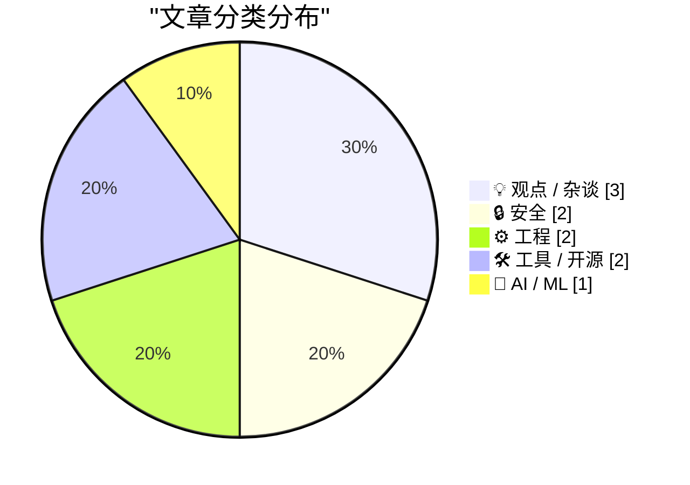
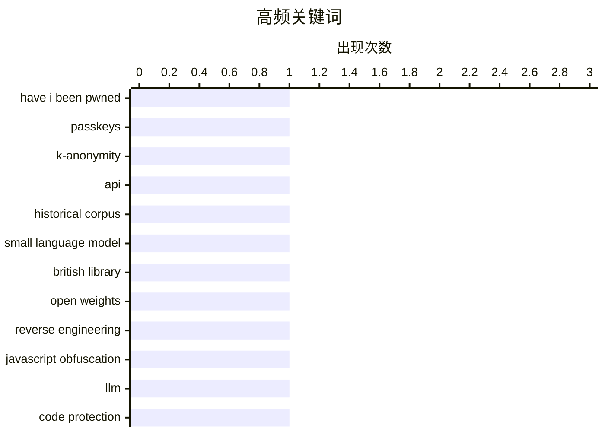

# 📰 AI 博客每日精选 — 2026-03-31

> 来自 Karpathy 推荐的 92 个顶级技术博客，AI 精选 Top 10

## 📝 今日看点

今天的技术焦点正在收敛到三件事：第一，安全领域全面转向“规模化+隐私优先”，从 HIBP 的通行密钥、k-匿名与批量 API，到对 LLM 驱动逆向能力的警惕，攻防门槛都在被重写。第二，AI 正从“炫技模型”走向“嵌入工作流”的实用化，不只是本地小模型探索，也包括用智能体替代重复运营与数据处理。第三，工程实践层面更强调“可持续开发效率”——文档按受众分层、差异对比语义化、摒弃僵化流水线与无意义“世界第一”叙事，价值标准正在回归真实问题与长期迭代。

---

## 🏆 今日必读

🥇 **HIBP 重大更新：通行密钥、k-匿名搜索、大幅性能提升与批量域名验证 API**

[HIBP Mega Update: Passkeys, k-Anonymity Searches, Massive Speed Enhancements and a Bulk Domain Verification API](https://www.troyhunt.com/passkeys-k-anonymity-searches-massive-speed-enhancements-bulk-domain-verification-api/) — troyhunt.com · 15 小时前 · 🔒 安全

> Have I Been Pwned（HIBP）在访问量、API 查询量和密码搜索量持续扩大的背景下，发布了一组面向规模化与隐私需求的新功能。服务当前已覆盖每天数十万网站访客、数千万次 API 查询、数亿次密码搜索，并持续处理每年数十亿条泄露记录。原有 Pwned 1~5 与 Ultra 分层因功能不断叠加而变得复杂，现调整为 Core、Pro、High RPM 和 Enterprise 四类方案，以分别覆盖基础使用、大型组织与代运营场景、高并发请求和定制化需求。更新重点围绕更好支持订阅用户的流量规模与隐私诉求，并包含面向第三方代管监控（如 MSP）场景的能力扩展。整体方向是把泄露数据从“被动记录”转为“可操作的防护工具”，帮助用户在事故发生后更有效地采取行动。

💡 **为什么值得读**: 值得读在于它不仅公布了 HIBP 的新功能清单，还清晰展示了一个安全数据服务在用户规模暴涨后如何重构产品分层、性能与隐私能力。

🏷️ Have I Been Pwned, passkeys, k-anonymity, API

🥈 **Mr. Chatterbox：一个可在本地运行的（较弱的）维多利亚时代伦理训练模型**

[Mr. Chatterbox is a (weak) Victorian-era ethically trained model you can run on your own computer](https://simonwillison.net/2026/Mar/30/mr-chatterbox/#atom-everything) — simonwillison.net · 19 小时前 · 🤖 AI / ML

> Mr. Chatterbox 是一个完全基于英国图书馆版权过期语料训练的语言模型，语料覆盖 1837 到 1899 年的 28,035 本英国维多利亚时期文本。该模型使用约 29.3 亿训练 token、约 3.4 亿参数（规模接近 GPT-2 Medium），且不包含 1899 年之后的数据，模型文件大小为 2.05GB。实际体验上，它的回复带有明显维多利亚风格，但作者认为可用性较差，更像马尔可夫链式生成，难以稳定回答有用问题。文中结合 Chinchilla 的 20:1 token/参数经验比估算，3.4 亿参数模型大约需要 70 亿 token，意味着当前语料可能不足；并提到 Qwen 3.5 家族在更大参数规模时才更“有意思”。作者同时给出本地运行方案：通过自己 LLM 框架发布 llm-mrchatterbox 插件，可用 llm install llm-mrchatterbox、llm chat -m mrchatterbox 或 uvx 命令直接体验。

💡 **为什么值得读**: 它把“仅用版权过期文本训练 LLM 是否可行”这个问题用可运行模型和可复现实操流程具体展示出来，适合关心数据合规与本地部署的人快速判断技术边界。

🏷️ historical corpus, small language model, British Library, open weights

🥉 **Web 的数字锁从未遇到过更强的对手**

[The Webs Digital Locks have Never had a Stronger Opponent](https://blog.pixelmelt.dev/the-webs-digital-locks/) — blog.pixelmelt.dev · 16 小时前 · 🔒 安全

> 文章聚焦于 LLM 对 Web 代码保护与逆向工程格局的冲击，认为当前（至少在 JavaScript 生态）已进入“逆向复兴期”。作者用 Claude 最强模型做基准测试，称其在从零知识破解一个小型受保护样本时耗时约 22 分钟、消耗约 170k tokens，也举例称曾在约 30 分钟内从专有在线阅读器中提取教材内容。文中观点是，LLM 大幅削减了逆向中的前期和重复性脑力成本：过去需要数小时到数天的工作被压缩，普通用户用简单指令也可能推进去混淆与破解流程。作者进一步认为，代码保护本质上只能延缓而无法阻止逆向，而 LLM 让这种“延缓”效果显著变弱，防守方更难长期压制攻击方。最终结论是，随着 LLM 普及，Web 侧数据暴露的安全性比以往更弱，现有数字锁与防护方案的有效性正在被重新质疑。

💡 **为什么值得读**: 值得读在于它用具体测试时间与实操案例说明了一个关键趋势：LLM 正在把逆向门槛系统性拉低，这会直接影响前端保护、反爬与数字内容分发的安全策略。

🏷️ reverse engineering, JavaScript obfuscation, LLM, code protection

---

## 📊 数据概览

| 扫描源 | 抓取文章 | 时间范围 | 精选 |
|:---:|:---:|:---:|:---:|
| 89/92 | 2531 篇 → 20 篇 | 24h | **10 篇** |

### 分类分布



### 高频关键词



<details>
<summary>📈 纯文本关键词图（终端友好）</summary>

```
have i been pwned      │ ████████████████████ 1
passkeys               │ ████████████████████ 1
k-anonymity            │ ████████████████████ 1
api                    │ ████████████████████ 1
historical corpus      │ ████████████████████ 1
small language model   │ ████████████████████ 1
british library        │ ████████████████████ 1
open weights           │ ████████████████████ 1
reverse engineering    │ ████████████████████ 1
javascript obfuscation │ ████████████████████ 1
```

</details>

### 🏷️ 话题标签

**have i been pwned**(1) · **passkeys**(1) · **k-anonymity**(1) · api(1) · historical corpus(1) · small language model(1) · british library(1) · open weights(1) · reverse engineering(1) · javascript obfuscation(1) · llm(1) · code protection(1) · api documentation(1) · developer experience(1) · maintainability(1) · technical writing(1) · git(1) · diff drivers(1) · lockfiles(1) · .gitattributes(1)

---

## 💡 观点 / 杂谈

### 1. 世界上第一个胡扯

[The World's First Bullshit](https://www.joanwestenberg.com/the-worlds-first-bullshit/) — **joanwestenberg.com** · 9 小时前 · ⭐ 19/30

> 文章批评创业公司频繁宣称“世界首个”，认为这类说法在 AI 工具高度同质、分类边界模糊的环境里往往只是通过缩窄标签来制造“第一”。作者指出“先发”本身并不等于价值，Newcomen 的蒸汽机虽早却低效，真正改变工业应用的是后来改进方案的 Watt；类似地，Google、Facebook、iPhone 都不是各自赛道最早出现的产品。文中将这种叙事归因于两点：一是硅谷对“发明者神话”和时间戳的崇拜，二是社交平台算法偏好最夸张、最难即时核验的口号。作者进一步认为，“世界首个”更容易吸引追逐新奇的短期用户，而非真正关心产品可用性与长期价值的人群。核心立场是：比起抢“第一”的名号，真正重要的是把产品做成用户愿意持续使用的东西。

🏷️ startup marketing, AI hype, positioning, product strategy

---

### 2. 每周更新 497

[Weekly Update 497](https://www.troyhunt.com/weekly-update-497/) — **troyhunt.com** · 9 小时前 · ⭐ 17/30

> 更新内容聚焦于 HIBP 团队如何把更多工作从人工转向由 OpenClaw 及相关智能体自动完成。团队三人分别在不同环节落地工具：Troy 使用“PwnedClaw”协助数据泄露目录整理与处理，Troy 和 Stefan 在 Visual Studio 中大量使用 GitHub Copilot，Charlotte 则用接入 OpenClaw 的 Telegram 机器人“Pwny”爬取内容并检查一致性，同时支持新版界面设计。作者表示他们正逐步找到“人类擅长的事”与“智能体可独立执行的事”之间的最佳分工，并且分配机器任务的能力在持续提升。过去几周仅 Claude token 就花费了 854 美元，作者认为这笔成本可视作“替你工作的员工”投入。整体判断是目前还只是起步阶段，后续数周到数月仍有很大扩展空间。

🏷️ OpenClaw, Copilot, agent workflows, automation

---

### 3. 持续、持续、持续

[Continuous, Continuous, Continuous](https://blog.jim-nielsen.com/2026/continuous-continuous-continuous/) — **blog.jim-nielsen.com** · 15 小时前 · ⭐ 15/30

> 软件开发被拆成设计、编码、测试、集成、发布等阶段的传统做法，在快速变化的环境里并不匹配。实际工作中每进入一个环节都会反向推动其他环节调整：写代码会改设计，测试会改代码，集成和发布又会暴露新的修改需求。由此这些阶段更像一个连续循环，边界变得模糊，团队分工也会随之模糊，关键在于循环节奏是按小时还是按周。若目标是“软件随时可发布”，就会倒推出必须有持续集成，而持续集成又依赖持续测试，也意味着不能先把设计和代码一次性做完再测试。更可行的是通过微型反馈回路小步前进、持续迭代，把过程反馈实时纳入演进；软件团队的优势最终取决于能否持续响应客户期望的变化并在任意时刻交付变更。

🏷️ continuous delivery, CI/CD, software process, team workflow

---

## 🔒 安全

### 4. HIBP 重大更新：通行密钥、k-匿名搜索、大幅性能提升与批量域名验证 API

[HIBP Mega Update: Passkeys, k-Anonymity Searches, Massive Speed Enhancements and a Bulk Domain Verification API](https://www.troyhunt.com/passkeys-k-anonymity-searches-massive-speed-enhancements-bulk-domain-verification-api/) — **troyhunt.com** · 15 小时前 · ⭐ 26/30

> Have I Been Pwned（HIBP）在访问量、API 查询量和密码搜索量持续扩大的背景下，发布了一组面向规模化与隐私需求的新功能。服务当前已覆盖每天数十万网站访客、数千万次 API 查询、数亿次密码搜索，并持续处理每年数十亿条泄露记录。原有 Pwned 1~5 与 Ultra 分层因功能不断叠加而变得复杂，现调整为 Core、Pro、High RPM 和 Enterprise 四类方案，以分别覆盖基础使用、大型组织与代运营场景、高并发请求和定制化需求。更新重点围绕更好支持订阅用户的流量规模与隐私诉求，并包含面向第三方代管监控（如 MSP）场景的能力扩展。整体方向是把泄露数据从“被动记录”转为“可操作的防护工具”，帮助用户在事故发生后更有效地采取行动。

🏷️ Have I Been Pwned, passkeys, k-anonymity, API

---

### 5. Web 的数字锁从未遇到过更强的对手

[The Webs Digital Locks have Never had a Stronger Opponent](https://blog.pixelmelt.dev/the-webs-digital-locks/) — **blog.pixelmelt.dev** · 16 小时前 · ⭐ 23/30

> 文章聚焦于 LLM 对 Web 代码保护与逆向工程格局的冲击，认为当前（至少在 JavaScript 生态）已进入“逆向复兴期”。作者用 Claude 最强模型做基准测试，称其在从零知识破解一个小型受保护样本时耗时约 22 分钟、消耗约 170k tokens，也举例称曾在约 30 分钟内从专有在线阅读器中提取教材内容。文中观点是，LLM 大幅削减了逆向中的前期和重复性脑力成本：过去需要数小时到数天的工作被压缩，普通用户用简单指令也可能推进去混淆与破解流程。作者进一步认为，代码保护本质上只能延缓而无法阻止逆向，而 LLM 让这种“延缓”效果显著变弱，防守方更难长期压制攻击方。最终结论是，随着 LLM 普及，Web 侧数据暴露的安全性比以往更弱，现有数字锁与防护方案的有效性正在被重新质疑。

🏷️ reverse engineering, JavaScript obfuscation, LLM, code protection

---

## ⚙️ 工程

### 6. 如何让开发者愿意阅读文档

[How Do We Get Developers to Read the Docs](https://idiallo.com/blog/how-do-we-get-developers-to-read-the-docs?src=feed) — **idiallo.com** · 22 小时前 · ⭐ 23/30

> “开发者不读文档”背后的核心问题，不是文档无用，而是常把不同受众混在同一份文档里。API 文档实际上要服务两类人：消费者只想快速确认 endpoint 能否满足需求、参数怎么传，并复制示例继续开发；维护者则需要理解“为什么这样设计”，例如为什么要两次调用、为什么旧用户行为不同、为什么字段可空。把两类需求平均塞进一份文档，结果往往是对前者太冗长、对后者又不够结构化。面向消费者时，重点应放在可预测的一致 API 设计上（如 `/user/orders` 与 `/user/orders/1234` 这样的模式），并用一句话描述能力边界（如“支持新旧订单”），而不是展开内部实现细节。结论是信息过载和信息缺失都会让文档失效，文档深度应按受众目标取舍。

🏷️ API documentation, developer experience, maintainability, technical writing

---

### 7. 一个关于注册表键中最大值数量的问题，引出了对问题本身的质疑

[A question about the maximimum number of values in a registry key raises questions about the question](https://devblogs.microsoft.com/oldnewthing/20260330-00/?p=112175) — **devblogs.microsoft.com/oldnewthing** · 20 小时前 · ⭐ 21/30

> 一次对“单个注册表键最多能存多少个值”的咨询，暴露出安装程序把超过 25 万个文件条目写入 SharedDLLs 的做法，其中仅键名就超过 30MB。问题根源是将 msidbComponentAttributesSharedDllRefCount 应用于所有文件（包括文本、GIF、XML 等），而不是只用于真正共享的 DLL。SharedDLLs 的本意是为共享 DLL 维护 usage count：安装时递增、卸载时递减，用于判断何时可安全删除文件。该机制起源于 Windows 95，只解决“删除时机”问题，不解决“同名 DLL 多版本共存”问题；后者依赖安装器按版本覆盖，以及新版本对旧版本保持向后兼容。对支持 side-by-side 安装的产品而言，通常并不存在这类共享文件，因此更合理的做法是移除这些文件上的 SharedDllRefCount 标记，而不是继续向 SharedDLLs 堆积条目。

🏷️ Windows Registry, MSI, SharedDLLs, installation

---

## 🛠 工具 / 开源

### 8. Git Diff 驱动器

[Git Diff Drivers](https://nesbitt.io/2026/03/30/git-diff-drivers.html) — **nesbitt.io** · 1 天前 · ⭐ 23/30

> 文章聚焦 Git 的 diff driver 机制，说明它如何把难读的原始差异转换成更有语义的信息。作者以 git-pkgs 为例：依托其已支持解析 29 种 lockfile 格式并提取依赖列表，通过接入 Git 的 textconv，把 lockfile 的 diff 从约 200 行解析器噪音压缩为少量依赖变更。文中梳理了 Git 2.53 内置的 28 个驱动（如 rust、golang、kotlin、ini、r 等），并解释其核心由 xfuncname 与 wordRegex 组成；ini 与 r 分别在 2.50、2.51 新增。文章还指出 .gitattributes 中设置如 *.rs diff=rust 可同时被本地 Git 与 GitHub linguist 识别语言意图，但 GitHub 网页端 diff 并不会实际使用这些驱动。对于自定义驱动，textconv 被强调为最实用方案：可将二进制或结构化文件转为可读文本再比较（如 exiftool 比较图片 EXIF），配合 cachetextconv（存于 refs/notes/textconv/*）可避免在 git log -p 等场景反复转换；但 textconv 是单向的，显示可读 diff 的同时无法反向生成可应用补丁。

🏷️ Git, diff drivers, lockfiles, .gitattributes

---

### 9. datasette-files 0.1a3

[datasette-files 0.1a3](https://simonwillison.net/2026/Mar/30/datasette-files/#atom-everything) — **simonwillison.net** · 10 小时前 · ⭐ 21/30

> 这次更新围绕 datasette-files 与其他 Datasette 插件的集成需求，发布了 0.1a3 版本。为支持更细粒度权限控制，owners_can_edit、owners_can_delete 配置项以及 files-edit、files-delete 操作被调整为作用在新的 FileResource 上，而 FileResource 是 FileSourceResource 的子资源（#18）。文件选择器 UI 现在可作为 Web Component 使用，并致谢 Alex Garcia（#19）。同时新增 `from datasette_files import get_file` Python API，方便其他插件读取文件数据（#20）。整体方向是把 datasette-files 从单一上传能力扩展为更易复用、可集成的基础文件能力插件。

🏷️ Datasette, file upload, plugin, web component

---

## 🤖 AI / ML

### 10. Mr. Chatterbox：一个可在本地运行的（较弱的）维多利亚时代伦理训练模型

[Mr. Chatterbox is a (weak) Victorian-era ethically trained model you can run on your own computer](https://simonwillison.net/2026/Mar/30/mr-chatterbox/#atom-everything) — **simonwillison.net** · 19 小时前 · ⭐ 25/30

> Mr. Chatterbox 是一个完全基于英国图书馆版权过期语料训练的语言模型，语料覆盖 1837 到 1899 年的 28,035 本英国维多利亚时期文本。该模型使用约 29.3 亿训练 token、约 3.4 亿参数（规模接近 GPT-2 Medium），且不包含 1899 年之后的数据，模型文件大小为 2.05GB。实际体验上，它的回复带有明显维多利亚风格，但作者认为可用性较差，更像马尔可夫链式生成，难以稳定回答有用问题。文中结合 Chinchilla 的 20:1 token/参数经验比估算，3.4 亿参数模型大约需要 70 亿 token，意味着当前语料可能不足；并提到 Qwen 3.5 家族在更大参数规模时才更“有意思”。作者同时给出本地运行方案：通过自己 LLM 框架发布 llm-mrchatterbox 插件，可用 llm install llm-mrchatterbox、llm chat -m mrchatterbox 或 uvx 命令直接体验。

🏷️ historical corpus, small language model, British Library, open weights

---

*生成于 2026-03-31 18:06 | 扫描 89 源 → 获取 2531 篇 → 精选 10 篇*
*基于 [Hacker News Popularity Contest 2025](https://refactoringenglish.com/tools/hn-popularity/) RSS 源列表*
