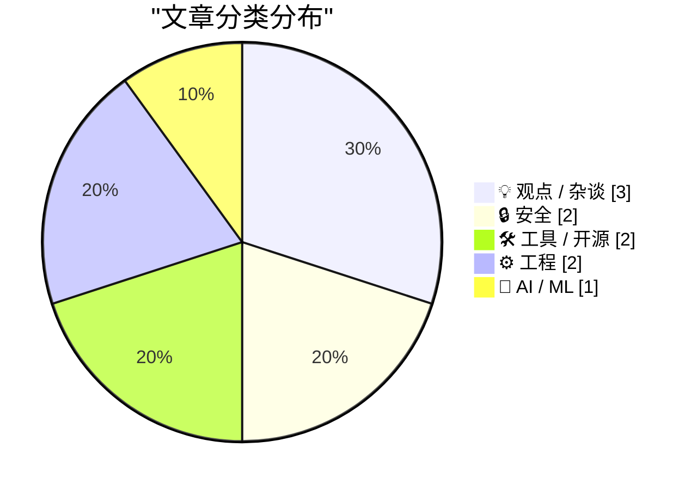
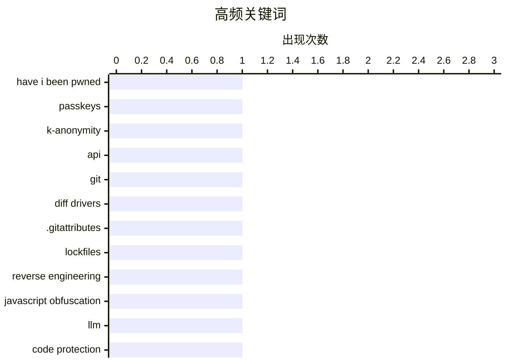

# 📰 AI 博客每日精选 — 2026-03-31

> 来自 Karpathy 推荐的 92 个顶级技术博客，AI 精选 Top 10

## 📝 今日看点

今天技术圈的主线很清晰：安全体系正从“能防”转向“在规模与智能对手下仍可持续”，一边是 HIBP 这类平台用隐私增强与工程化扩容升级基础设施，另一边是 LLM 正在显著抬高 Web 逆向能力、倒逼防护思路重构。与此同时，开发工具与工程实践继续朝“语义化与持续化”演进——从更可读的 Git diff、可组合的数据插件，到围绕“如何让人真正读文档”和持续交付的流程反思，本质都在提升人机协作效率。舆论层面也更务实：相比“世界首创”的营销叙事，行业更关注可验证的产品价值，以及团队与智能体之间可落地的分工边界。

---

## 🏆 今日必读

🥇 **HIBP 重大更新：Passkey、k-匿名搜索、大幅性能提升与批量域名验证 API**

[HIBP Mega Update: Passkeys, k-Anonymity Searches, Massive Speed Enhancements and a Bulk Domain Verification API](https://www.troyhunt.com/passkeys-k-anonymity-searches-massive-speed-enhancements-bulk-domain-verification-api/) — troyhunt.com · 15 小时前 · 🔒 安全

> Have I Been Pwned（HIBP）在用户规模和数据处理量持续增长的背景下，发布了一组面向体量与隐私需求的新能力。服务当前覆盖每天数十万网站访问、数千万 API 查询、数亿密码搜索，并每年处理数十亿条泄露记录。此次更新同时调整了订阅体系：从过去逐步叠加功能的 Pwned 1-5 与 Ultra，重构为 Core、Pro、High RPM、Enterprise 四类，以区分入门、组织级、超高请求量和定制化场景。新版本重点围绕 Passkey、k-匿名搜索、速度优化以及批量域名验证 API，并特别提到对 MSP 代第三方监控的支持方向。整体变化体现出 HIBP 从“业余社区项目”向高并发、隐私敏感、企业化服务持续演进。

💡 **为什么值得读**: 这篇更新把产品能力、性能方向与商业分层一次讲清，适合需要评估 HIBP 在企业场景可用性与升级价值的读者快速判断取舍。

🏷️ Have I Been Pwned, passkeys, k-anonymity, API

🥈 **Git 差异驱动（Diff Drivers）**

[Git Diff Drivers](https://nesbitt.io/2026/03/30/git-diff-drivers.html) — nesbitt.io · 1 天前 · 🛠 工具 / 开源

> 文章围绕 Git 的 diff driver 机制，说明如何让难读的差异输出变成更有语义的信息。作者在 git-pkgs 中接入 lockfile 解析结果到 textconv 后，把锁文件 diff 从大量解析器噪音压缩为少量依赖变更，并由此梳理 Git 2.53 内置的 28 个驱动（如 rust、golang、kotlin、ini、r）及其工作方式。内置驱动通过 xfuncname 和 wordRegex 改善 hunk 上下文与分词效果，例如 Ruby 变更可直接显示方法名而不是无意义的行或 end。文章也给出自定义驱动重点：在 [diff "name"] 下配置 textconv，把二进制或结构化文件转换为可读文本再比较，并可用 cachetextconv 将结果缓存到 refs/notes/textconv/* 以避免重复转换开销。结论是 diff driver 已在 Git 中相当成熟且实用，但在常见代码托管平台或 GUI 客户端里仍未被充分利用，值得在仓库层面通过 .gitattributes 主动启用。

💡 **为什么值得读**: 它把“Git diff 为什么常常难读”转化为可立即落地的配置思路（内置驱动 + textconv + 缓存），对提升日常代码评审与历史排查效率非常直接。

🏷️ Git, diff drivers, .gitattributes, lockfiles

🥉 **Web 的数字锁从未遇到过更强的对手**

[The Webs Digital Locks have Never had a Stronger Opponent](https://blog.pixelmelt.dev/the-webs-digital-locks/) — blog.pixelmelt.dev · 16 小时前 · 🔒 安全

> 文章认为，LLM 正在重塑 Web 端逆向工程，尤其在 JavaScript 生态中，代码保护方已明显处于被动。作者用 Claude（最高思考配置）测试自己做的 JavaScript 保护方案：从零知识出发，模型约 22 分钟、消耗 17 万 token 就能解开一个小样本；另一个案例里，模型仅用约 30 分钟就从专有在线阅读器中提取教材内容。作者强调代码保护本质上只能“延缓”而非“阻止”逆向，而 LLM 大幅削减了逆向所需的前期人力与枯燥分析成本，使普通用户也能发出“反混淆”指令并获得结果。文中还指出，过去高价防护与低价防护的差距更多体现在“谁能攻破”，如今更像是“攻破速度差异”，且防护更新后攻击者可能只需数小时就能重新适配。结论是：在将数据暴露于 Web 的前提下，现有数字锁与代码保护的安全性比以往更脆弱，防守策略需要尽快应对 LLM 带来的新现实。

💡 **为什么值得读**: 它用具体测试时长与 token 消耗展示了 LLM 如何实质性压低逆向门槛，能帮助做 Web 安全、代码混淆和反爬/反盗版的人快速校准当下防护策略的有效性。

🏷️ reverse engineering, JavaScript obfuscation, LLM, code protection

---

## 📊 数据概览

| 扫描源 | 抓取文章 | 时间范围 | 精选 |
|:---:|:---:|:---:|:---:|
| 89/92 | 2531 篇 → 20 篇 | 24h | **10 篇** |

### 分类分布



### 高频关键词



<details>
<summary>📈 纯文本关键词图（终端友好）</summary>

```
have i been pwned      │ ████████████████████ 1
passkeys               │ ████████████████████ 1
k-anonymity            │ ████████████████████ 1
api                    │ ████████████████████ 1
git                    │ ████████████████████ 1
diff drivers           │ ████████████████████ 1
.gitattributes         │ ████████████████████ 1
lockfiles              │ ████████████████████ 1
reverse engineering    │ ████████████████████ 1
javascript obfuscation │ ████████████████████ 1
```

</details>

### 🏷️ 话题标签

**have i been pwned**(1) · **passkeys**(1) · **k-anonymity**(1) · api(1) · git(1) · diff drivers(1) · .gitattributes(1) · lockfiles(1) · reverse engineering(1) · javascript obfuscation(1) · llm(1) · code protection(1) · historical corpus(1) · small language model(1) · victorian texts(1) · open weights(1) · api documentation(1) · developer experience(1) · docs strategy(1) · maintainability(1)

---

## 💡 观点 / 杂谈

### 1. 世界上第一个胡扯

[The World's First Bullshit](https://www.joanwestenberg.com/the-worlds-first-bullshit/) — **joanwestenberg.com** · 9 小时前 · ⭐ 20/30

> 文章批评了创业公司频繁宣称“世界首创”的营销话术，尤其在 AI 工具赛道中，这类说法往往只是把标签切得足够细，从而制造不可证伪的“第一”。作者认为“首创”本身并不是值得追逐的目标，真正重要的是产品是否好用、是否被用户持续采用。文中用 Newcomen 蒸汽机与 Watt 改良、Google 与早期搜索引擎、Facebook 与 Friendster、iPhone 与 Blackberry/Palm Treo 的对比说明：真正留下影响的通常不是最早出现者，而是把产品做到可用、好用的人。作者还指出社交平台算法强化了这种夸张叙事——“world’s first”更容易获得转发和投资人注意，因此成为流量与融资语境下的“作弊码”。结论是，过度强调新奇会吸引一次性尝鲜者，而长期成功依赖的是在意产品效果与体验的真实用户。

🏷️ startup marketing, AI hype, first-mover claims, positioning

---

### 2. 每周更新 497

[Weekly Update 497](https://www.troyhunt.com/weekly-update-497/) — **troyhunt.com** · 9 小时前 · ⭐ 18/30

> 团队正在持续优化 OpenClaw 的使用方式，逐步找到“人工擅长的工作”和“可由智能体自主完成的工作”之间的分工平衡。HIBP 的 3 人团队把越来越多任务交给机器执行，Troy 使用“PwnedClaw”机器人协助数据泄露的编目与处理，Stefan 和 Troy 大量使用 Visual Studio 中的 GitHub Copilot。Charlotte 则使用接入 OpenClaw 的 Telegram 机器人“Pwny”，在设计新版用户界面时爬取全部内容并检查不一致之处。过去几周 Troy 在 Claude tokens 上花费了 854 美元，他将这笔成本视为“雇员替你工作”的投入。整体态度是当前应用仍处于早期阶段，团队预计未来数周到数月会进一步扩大这套人机协作模式的产出。

🏷️ OpenClaw, AI agents, Copilot, workflow automation

---

### 3. 持续、持续、持续

[Continuous, Continuous, Continuous](https://blog.jim-nielsen.com/2026/continuous-continuous-continuous/) — **blog.jim-nielsen.com** · 15 小时前 · ⭐ 15/30

> 软件开发被拆成设计、编码、测试、集成、发布等阶段的传统做法，在高速变化的环境下并不匹配实际。代码一开始编写就会反向影响设计，测试会推动代码修改，集成会暴露协作与实现问题，发布后又会带来新的改进需求，这些环节本质上是持续循环且边界模糊的。关键差别在于循环节奏：是以周为单位串行推进，还是每天多次完成这些环节。以“软件可随时发布”为目标倒推，会导向持续集成，而持续集成又依赖持续测试，也要求不再先把设计和代码一次性做完再测试。作者主张通过微型反馈回路小步迭代，并让过程反馈在当下持续发生，而不是事后集中复盘；软件工程能力可浓缩为“continuous”，竞争优势来自持续响应用户预期变化的能力。

🏷️ continuous integration, software delivery, team workflow

---

## 🔒 安全

### 4. HIBP 重大更新：Passkey、k-匿名搜索、大幅性能提升与批量域名验证 API

[HIBP Mega Update: Passkeys, k-Anonymity Searches, Massive Speed Enhancements and a Bulk Domain Verification API](https://www.troyhunt.com/passkeys-k-anonymity-searches-massive-speed-enhancements-bulk-domain-verification-api/) — **troyhunt.com** · 15 小时前 · ⭐ 26/30

> Have I Been Pwned（HIBP）在用户规模和数据处理量持续增长的背景下，发布了一组面向体量与隐私需求的新能力。服务当前覆盖每天数十万网站访问、数千万 API 查询、数亿密码搜索，并每年处理数十亿条泄露记录。此次更新同时调整了订阅体系：从过去逐步叠加功能的 Pwned 1-5 与 Ultra，重构为 Core、Pro、High RPM、Enterprise 四类，以区分入门、组织级、超高请求量和定制化场景。新版本重点围绕 Passkey、k-匿名搜索、速度优化以及批量域名验证 API，并特别提到对 MSP 代第三方监控的支持方向。整体变化体现出 HIBP 从“业余社区项目”向高并发、隐私敏感、企业化服务持续演进。

🏷️ Have I Been Pwned, passkeys, k-anonymity, API

---

### 5. Web 的数字锁从未遇到过更强的对手

[The Webs Digital Locks have Never had a Stronger Opponent](https://blog.pixelmelt.dev/the-webs-digital-locks/) — **blog.pixelmelt.dev** · 16 小时前 · ⭐ 23/30

> 文章认为，LLM 正在重塑 Web 端逆向工程，尤其在 JavaScript 生态中，代码保护方已明显处于被动。作者用 Claude（最高思考配置）测试自己做的 JavaScript 保护方案：从零知识出发，模型约 22 分钟、消耗 17 万 token 就能解开一个小样本；另一个案例里，模型仅用约 30 分钟就从专有在线阅读器中提取教材内容。作者强调代码保护本质上只能“延缓”而非“阻止”逆向，而 LLM 大幅削减了逆向所需的前期人力与枯燥分析成本，使普通用户也能发出“反混淆”指令并获得结果。文中还指出，过去高价防护与低价防护的差距更多体现在“谁能攻破”，如今更像是“攻破速度差异”，且防护更新后攻击者可能只需数小时就能重新适配。结论是：在将数据暴露于 Web 的前提下，现有数字锁与代码保护的安全性比以往更脆弱，防守策略需要尽快应对 LLM 带来的新现实。

🏷️ reverse engineering, JavaScript obfuscation, LLM, code protection

---

## 🛠 工具 / 开源

### 6. Git 差异驱动（Diff Drivers）

[Git Diff Drivers](https://nesbitt.io/2026/03/30/git-diff-drivers.html) — **nesbitt.io** · 1 天前 · ⭐ 24/30

> 文章围绕 Git 的 diff driver 机制，说明如何让难读的差异输出变成更有语义的信息。作者在 git-pkgs 中接入 lockfile 解析结果到 textconv 后，把锁文件 diff 从大量解析器噪音压缩为少量依赖变更，并由此梳理 Git 2.53 内置的 28 个驱动（如 rust、golang、kotlin、ini、r）及其工作方式。内置驱动通过 xfuncname 和 wordRegex 改善 hunk 上下文与分词效果，例如 Ruby 变更可直接显示方法名而不是无意义的行或 end。文章也给出自定义驱动重点：在 [diff "name"] 下配置 textconv，把二进制或结构化文件转换为可读文本再比较，并可用 cachetextconv 将结果缓存到 refs/notes/textconv/* 以避免重复转换开销。结论是 diff driver 已在 Git 中相当成熟且实用，但在常见代码托管平台或 GUI 客户端里仍未被充分利用，值得在仓库层面通过 .gitattributes 主动启用。

🏷️ Git, diff drivers, .gitattributes, lockfiles

---

### 7. datasette-files 0.1a3 发布

[datasette-files 0.1a3](https://simonwillison.net/2026/Mar/30/datasette-files/#atom-everything) — **simonwillison.net** · 10 小时前 · ⭐ 21/30

> 这次更新围绕将 datasette-files 与其他插件（如 datasette-extract）集成所需的基础能力展开。插件的 owners_can_edit、owners_can_delete 配置项，以及 files-edit、files-delete 操作，被调整为作用于新的 FileResource，并将其设为 FileSourceResource 的子资源（#18）。文件选择器 UI 现在可作为 Web Component 使用，相关改动致谢 Alex Garcia（#19）。同时新增了 `from datasette_files import get_file` 的 Python API，供其他需要访问文件数据的插件调用（#20）。整体上，0.1a3 版本重点是完善资源权限模型、提升 UI 复用性，并为插件生态提供标准化文件访问接口。

🏷️ Datasette, file upload, plugin, web component

---

## ⚙️ 工程

### 8. 如何让开发者阅读文档

[How Do We Get Developers to Read the Docs](https://idiallo.com/blog/how-do-we-get-developers-to-read-the-docs?src=feed) — **idiallo.com** · 22 小时前 · ⭐ 23/30

> 核心问题是：API 文档写得再完整，实际使用 API 的开发者往往并不会真正通读它。文章把受众明确分为两类：API 消费者只关心“能不能满足需求、参数怎么传”，他们的阅读方式是快速扫描并复制示例；API 维护者才需要理解“为什么这样设计”，例如兼容 legacy 用户、字段可空原因和异常行为背景。将两类需求混在一份文档里会两头落空：对前者过深难扫读，对后者又缺乏可定位的结构。面向消费者时，重点不在堆叙述，而在设计可预测、可复用的接口模式（如 /user/orders 与 /user/orders/1234 的一致性），并用一句结果导向信息替代内部实现细节。作者的结论是，文档要按受众分层，尤其不要把“越详尽越好”当成默认正确，因为信息过载与信息缺失都会让文档失效。

🏷️ API documentation, developer experience, docs strategy, maintainability

---

### 9. 关于“注册表键最多能存多少个值”的提问，暴露出提问本身的问题

[A question about the maximimum number of values in a registry key raises questions about the question](https://devblogs.microsoft.com/oldnewthing/20260330-00/?p=112175) — **devblogs.microsoft.com/oldnewthing** · 20 小时前 · ⭐ 21/30

> 问题表面是单个注册表键可容纳多少个值，实际暴露的是安装器对 SharedDLLs 机制的误用。客户把安装包里的每个文件都标记为 msidbComponentAttributesSharedDllRefCount，导致 HKEY_LOCAL_MACHINE\SOFTWARE\Microsoft\Windows\CurrentVersion\SharedDLLs 中累计了超过 25 万个值，仅键名就超过 30MB，而且多版本并行安装会持续堆积。作者指出这理解错了：应当只把“真正共享”的 DLL 标记为共享，即多个产品在同一目录复用同一 DLL；若产品是 side-by-side 安装，通常几乎没有共享文件，相关属性可能应全部移除。文中回顾 SharedDLLs 源于 Windows 95，核心只是通过使用计数辅助“何时可安全删除 DLL”，并不能解决“同名 DLL 多版本共存”问题。后者依赖安装器按版本号替换和 DLL 提供方维持向后兼容，而向后兼容一旦失守，升级共享 DLL 就可能让旧程序失效。

🏷️ Windows Registry, MSI, SharedDLLs, installer

---

## 🤖 AI / ML

### 10. Mr. Chatterbox：一个可在本地运行的（较弱）维多利亚时代“伦理训练”模型

[Mr. Chatterbox is a (weak) Victorian-era ethically trained model you can run on your own computer](https://simonwillison.net/2026/Mar/30/mr-chatterbox/#atom-everything) — **simonwillison.net** · 19 小时前 · ⭐ 23/30

> Trip Venturella 发布了 Mr. Chatterbox，这是一款完全基于英国图书馆公开数据训练的语言模型，训练语料限定为 1837-1899 年的 28,035 本书。该模型过滤后使用约 29.3 亿 token，参数量约 3.4 亿（接近 GPT-2 Medium），且不包含 1899 年之后的任何训练输入，模型文件大小约 2.05GB。作者实测认为它对话表现较弱，风格虽有维多利亚时期特色，但回答问题时更像马尔可夫链而非实用 LLM。文中引用 Chinchilla 的 20:1 token/参数经验比，指出该规模模型理想上约需 70 亿 token，并据 Qwen 3.5（600M 起步、2B 更有可用性）的对照推测可能需要 4 倍以上数据才更像可用对话助手。作者同时给出了本地运行路径：基于 nanochat 权重制作了 llm-mrchatterbox 插件，可通过 llm install 或 uvx 命令直接启动聊天。

🏷️ historical corpus, small language model, Victorian texts, open weights

---

*生成于 2026-03-31 18:03 | 扫描 89 源 → 获取 2531 篇 → 精选 10 篇*
*基于 [Hacker News Popularity Contest 2025](https://refactoringenglish.com/tools/hn-popularity/) RSS 源列表*
