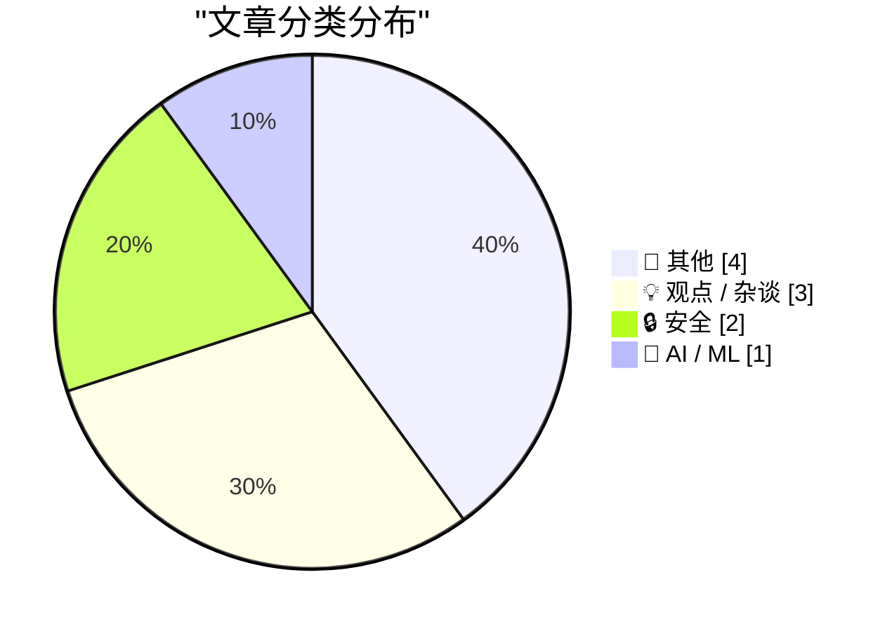
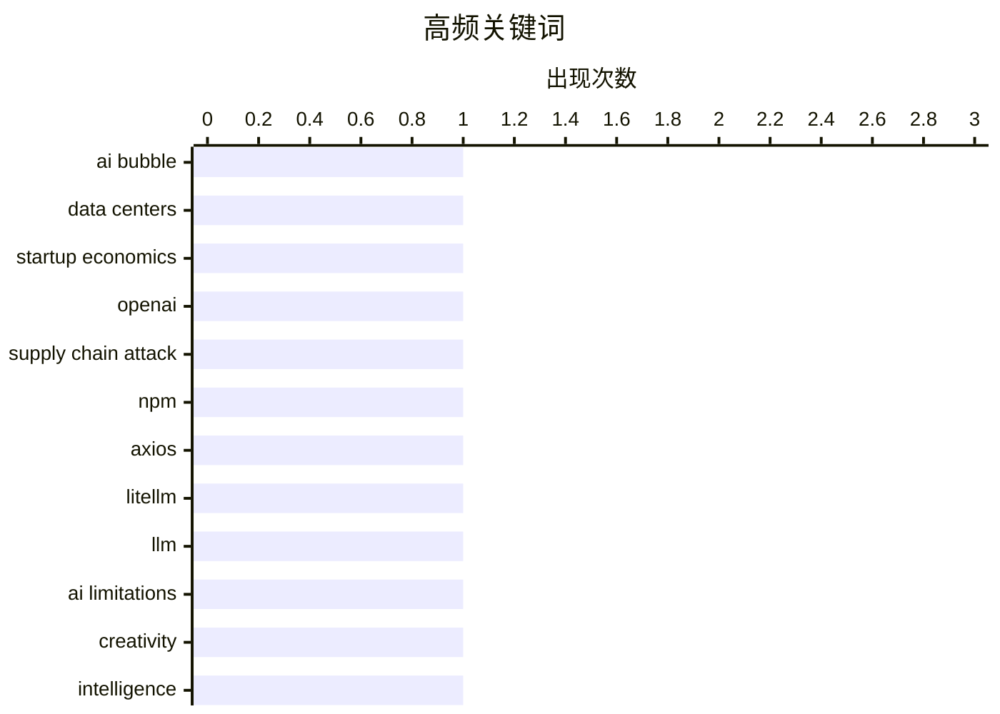

# 📰 AI 博客每日精选 — 2026-04-01

> 来自 Karpathy 推荐的 92 个顶级技术博客，AI 精选 Top 10

## 📝 今日看点

今天技术圈最突出的信号是：AI 正从“能力狂奔”进入“风险定价”阶段，系统性泡沫隐忧与现实落地之间的张力同时升高。另一条主线是安全战线前移——从开源供应链投毒到隐私权公共传播，再到“量子版 Y2K”的前瞻担忧，行业关注点正从功能创新转向韧性与防御。与此同时，开发者实践也更务实：一边把 AI 代理嵌入日常工作流、细化人机分工，一边通过更轻量、可控的基础设施与插件化工具重构技术栈。整体看，技术叙事正在从“颠覆一切”转向“在不确定中建立可持续能力”。

---

## 🏆 今日必读

🥇 **次级贷款式 AI 危机已经到来**

[The Subprime AI Crisis Is Here](https://www.wheresyoured.at/the-subprime-ai-crisis-is-here/) — wheresyoured.at · 6 小时前 · 🤖 AI / ML

> 文章将当下 AI 产业与 2008 年前的次级抵押贷款扩张作类比，强调风险并非只来自所谓“低质量参与者”，而是系统性信用与激励结构共同推动。文中引用了次贷时期的具体机制：可调利率按揭（ARM）在前期低利率后上调会显著抬高月供，例如 20 万美元贷款月供可从 1,013 美元升至 1,254 美元（约涨 24%），且可能继续逐年上调。作者还给出当时的规模数据，包括 2006 年一季度新按揭中 ARM 占比超过 25%、预计超 3300 亿美元按揭将上调、2007 年约 200 万户持有 6000 亿美元 ARM。文章同时反驳“危机仅由低收入借款人造成”的单一叙事，援引研究指出信贷扩张是全市场性的，并在房价上涨最快区域更激进。结论是，理解危机需要关注金融化激励如何在繁荣叙事下放大整体脆弱性，而不是把责任简化为某一类人群。

💡 **为什么值得读**: 值得读在于它用具体历史数据和机制拆解“谁该负责”的常见误解，为理解 AI 泡沫风险提供了更结构化的参照框架。

🏷️ AI bubble, data centers, startup economics, OpenAI

🥈 **Telnyx、LiteLLM 与 Axios：供应链危机**

[Telnyx, LiteLLM and Axios: the supply chain crisis](https://martinalderson.com/posts/telnyx-litellm-axios-supply-chain-crisis/?utm_source=rss&amp;utm_medium=rss&amp;utm_campaign=feed) — martinalderson.com · 23 小时前 · 🔒 安全

> 开源生态中的软件供应链攻击正在快速升级，攻击者通过发布带木马的恶意版本来窃取安装系统中的敏感数据。攻击从较小项目扩散到高下载量包，文中点名了 Telnyx（约 15 万次/周下载）、LiteLLM（约 2200 万次/周）以及 3 月 31 日遭攻击的 axios（至少 1 亿次/周），影响面覆盖大量核心应用。虽然每次恶意版本都被快速下架，但在上线的短时间内仍可能已让成千上万台机器受影响。攻击者还利用前一轮入侵窃取的凭证继续污染更多包，形成持续扩大的连锁感染。文章同时指出这并非新问题，npm 生态在去年的 Shai-Hulud v1/v2 事件中已有超过 1000 个包被植入后门，且据报道造成约 850 万美元损失，现有的短期令牌、延迟安装和分阶段发布等缓解措施仍未彻底阻断风险。

💡 **为什么值得读**: 它把近期 Telnyx、LiteLLM、axios 连续中招与既往 Shai-Hulud 事件放在同一脉络中，能帮助你快速判断当前 npm 供应链防护措施的实际有效性与残余风险。

🏷️ supply chain attack, npm, axios, LiteLLM

🥉 **无限中人**

[Infinite midwit](https://www.experimental-history.com/p/infinite-midwit) — experimental-history.com · 7 小时前 · 💡 观点 / 杂谈

> 作者对 AI 的情绪从早期焦虑转向相对放松，原因是实际使用后感受到的并非“全能机器”，而是一个随叫随到、知识很多但并不真正聪明的“无限中人”。文中指出，尽管模型在一些可验证任务上持续进步（如字符计数、减少明显荒谬建议），其能力中心仍存在一个自 2022 年以来未明显缩小的缺口。这个缺口被界定为两类智能的差异：可训练、可验证的“客观智能”与边界模糊、难以验证的“主观智能”（如“如何过好一生”）。作者批评心理学长期以测验相关性反复“发现”单一 g 因子，本质上只是在测量客观智能，而把主观智能排除在外。基于此，文中认为当下 AI 本质上是“纯客观智能”，而把人工超级智能建立在“智能可互换”前提上的乐观叙事并不稳固。

💡 **为什么值得读**: 值得读在于它用“客观/主观智能”这组清晰框架解释了为何 AI 一边快速进步一边仍让人感到“缺了点什么”，能帮助你更准确判断当前 AI 的真实边界。

🏷️ LLM, AI limitations, creativity, intelligence

---

## 📊 数据概览

| 扫描源 | 抓取文章 | 时间范围 | 精选 |
|:---:|:---:|:---:|:---:|
| 88/92 | 2508 篇 → 27 篇 | 24h | **10 篇** |

### 分类分布



### 高频关键词



<details>
<summary>📈 纯文本关键词图（终端友好）</summary>

```
ai bubble           │ ████████████████████ 1
data centers        │ ████████████████████ 1
startup economics   │ ████████████████████ 1
openai              │ ████████████████████ 1
supply chain attack │ ████████████████████ 1
npm                 │ ████████████████████ 1
axios               │ ████████████████████ 1
litellm             │ ████████████████████ 1
llm                 │ ████████████████████ 1
ai limitations      │ ████████████████████ 1
```

</details>

### 🏷️ 话题标签

**ai bubble**(1) · **data centers**(1) · **startup economics**(1) · openai(1) · supply chain attack(1) · npm(1) · axios(1) · litellm(1) · llm(1) · ai limitations(1) · creativity(1) · intelligence(1) · openclaw(1) · copilot(1) · automation(1) · hibp(1) · privacy(1) · eff(1) · digital rights(1) · activism(1)

---

## 📝 其他

### 1. 我的碎碎念也能通过 Gopher 访问了

[My ramblings are available over gopher](https://maurycyz.com/misc/gopher/) — **maurycyz.com** · 刚刚 · ⭐ 15/30

> 作者认为访问自己网站不该依赖“上千行 C 代码”的复杂客户端，因此在服务器上增加了 Gopher 支持，并演示了通过 telnet 直接读取文本内容。Gopher 返回的是纯文件内容，没有标记、内嵌内容和超链接；导航依靠目录式菜单，每行首字符表示资源类型（如 0 文本、1 目录、9 二进制、I 图片），后面以制表符分隔显示名、路径、主机和端口。文中强调这种把元数据放在链接里的方式虽然不符合现代习惯，但换来了协议极简：客户端只需发送 selector（文件路径），服务器只返回文件，不涉及 URL、header 或 MIME 类型。作者还给出用 ncat 一行命令下载文件、用 Lynx 访问 gopher://maurycyz.com 及 UTF-8 配置的实际用法。站点改造上没有把网页式导航完整照搬成菜单，而是将博客文章转为纯文本并提供目录导航，同时表达了对内联链接阅读体验的长期不满，并对 Gemini 提出“更像是 HTTP 加 Markdown”的看法。

---

### 2. datasette-llm 0.1a4

[datasette-llm 0.1a4](https://simonwillison.net/2026/Mar/31/datasette-llm/#atom-everything) — **simonwillison.net** · 1 小时前 · ⭐ 15/30

> 这次发布聚焦于 datasette-llm 0.1a4 的新能力：为其他插件提供可依赖的 LLM 集成层。版本新增了按用途为模型配置不同 API key 的机制，例如可将 enrichments 固定为使用 gpt-5.4-mini，并绑定该用途专用密钥。该能力对应 issue #4，强调在同一系统中按任务隔离模型与凭证。为支撑这项功能的测试，作者还发布了 llm-echo 0.3，作为 API key 测试工具。整体方向是提升插件化 LLM 集成在配置与密钥管理上的可控性和工程可用性。

---

### 3. llm-all-models-async 0.1

[llm-all-models-async 0.1](https://simonwillison.net/2026/Mar/31/llm-all-models-async/#atom-everything) — **simonwillison.net** · 2 小时前 · ⭐ 15/30

> 这次发布聚焦于把仅提供同步版本的 LLM 插件模型注册为可用的异步模型。LLM 插件原本可同时定义 sync 和 async 两类模型，其中 API 驱动模型更常见为 async，而在插件内本地运行的模型往往是 sync。作者的 llm-mrchatterbox 插件只有 sync 版本，但 Datasette 的相关能力（尤其是 datasette-enrichments-llm）只能使用 async 模型。为解决兼容问题，作者借助 Claude 创建了 llm-all-models-async 0.1，通过线程池把同步模型封装成异步模型。这个方案还促成了 LLM 本体新增一个插件 hook 机制，并已随 LLM 0.30 一并发布。

---

### 4. 量子版 Y2K

[Quantum Y2K](https://www.johndcook.com/blog/2026/03/31/quantum-y2k/) — **johndcook.com** · 8 小时前 · ⭐ 15/30

> 量子计算是否会在可预见未来达到“可破解密码”的实用水平仍不确定，但一旦出现 CRQC（密码学相关量子计算机）而准备不足，金融系统可能面临严重风险。文中指出当前量子计算甚至还难以在不“作弊”的前提下分解 21，但能力跃迁可能并非线性，存在从处理两位数快速跨越到可分解千位数、进而威胁 RSA 的担忧。向后量子密码迁移被类比为 Y2K：问题之所以当年看似“无事发生”，是因为全球投入了约 5000 亿美元提前修复。后量子签名和密钥通常会增大 1 到 2 个数量级，带来带宽与存储开销；同时新算法成熟需要时间，SIKE 曾入围 NIST 竞赛却被人在笔记本上约 1 小时攻破。结论是迁移应尽早规划但不宜盲目“一刀切”立即替换，可采用更有策略的路径（如用零知识证明聚合签名）并在渐进过渡中降低成本与风险。

---

## 💡 观点 / 杂谈

### 5. 无限中人

[Infinite midwit](https://www.experimental-history.com/p/infinite-midwit) — **experimental-history.com** · 7 小时前 · ⭐ 22/30

> 作者对 AI 的情绪从早期焦虑转向相对放松，原因是实际使用后感受到的并非“全能机器”，而是一个随叫随到、知识很多但并不真正聪明的“无限中人”。文中指出，尽管模型在一些可验证任务上持续进步（如字符计数、减少明显荒谬建议），其能力中心仍存在一个自 2022 年以来未明显缩小的缺口。这个缺口被界定为两类智能的差异：可训练、可验证的“客观智能”与边界模糊、难以验证的“主观智能”（如“如何过好一生”）。作者批评心理学长期以测验相关性反复“发现”单一 g 因子，本质上只是在测量客观智能，而把主观智能排除在外。基于此，文中认为当下 AI 本质上是“纯客观智能”，而把人工超级智能建立在“智能可互换”前提上的乐观叙事并不稳固。

🏷️ LLM, AI limitations, creativity, intelligence

---

### 6. 每周更新 497

[Weekly Update 497](https://www.troyhunt.com/weekly-update-497/) — **troyhunt.com** · 22 小时前 · ⭐ 17/30

> 更新聚焦于 HIBP 团队如何把更多工作从人工转移给 AI 代理 OpenClaw，并逐步找到“人类擅长”与“机器可自主执行”之间的分工平衡。团队三人都在扩大 AI 工具使用：作者用“PwnedClaw”协助数据泄露的编目与处理，作者与 Stefan 在 Visual Studio 中大量使用 GitHub Copilot，Charlotte 则用接入 OpenClaw 的 Telegram 机器人“Pwny”爬取内容并检查不一致问题，以支持新版界面设计。作者提到最近几周在 Claude token 上花费了 854 美元，并将这类成本视作“雇员替你工作”的投入。整体判断是当前实践仍只是起步阶段，接下来数周到数月会继续深化并拓展 AI 在流程中的作用。

🏷️ OpenClaw, Copilot, automation, HIBP

---

### 7. 解决昨天的问题会要了你的命

[Solving Yesterday’s Problems Will Kill You](https://steveblank.com/2026/03/31/solving-yesterdays-problems-will-kill-you/) — **steveblank.com** · 10 小时前 · ⭐ 16/30

> 给出的内容只有页面导航、分类、订阅信息、归档和“Recent Posts”列表，未包含这篇文章的正文观点或论证。可确认的信息是该文标题为“Solving Yesterday’s Problems Will Kill You”，发布时间显示为 2026-03-31，发布在 Steve Blank 的个人网站。页面还显示站点长期聚焦 Customer Development、Lean LaunchPad、Corporate/Gov't Innovation、National Security、Venture Capital 等主题，并有 55.8K 订阅者。最近文章列表中同时出现“Your Startup Is Probably Dead On Arrival”“Making the Wrong Things Go Faster at The Department of War”等标题，反映其持续关注创业成败与组织创新效率。基于当前输入，无法提炼该文的具体技术方案、论据细节或结论性主张。

🏷️ innovation, startups, strategy, Steve Blank

---

## 🔒 安全

### 8. Telnyx、LiteLLM 与 Axios：供应链危机

[Telnyx, LiteLLM and Axios: the supply chain crisis](https://martinalderson.com/posts/telnyx-litellm-axios-supply-chain-crisis/?utm_source=rss&amp;utm_medium=rss&amp;utm_campaign=feed) — **martinalderson.com** · 23 小时前 · ⭐ 27/30

> 开源生态中的软件供应链攻击正在快速升级，攻击者通过发布带木马的恶意版本来窃取安装系统中的敏感数据。攻击从较小项目扩散到高下载量包，文中点名了 Telnyx（约 15 万次/周下载）、LiteLLM（约 2200 万次/周）以及 3 月 31 日遭攻击的 axios（至少 1 亿次/周），影响面覆盖大量核心应用。虽然每次恶意版本都被快速下架，但在上线的短时间内仍可能已让成千上万台机器受影响。攻击者还利用前一轮入侵窃取的凭证继续污染更多包，形成持续扩大的连锁感染。文章同时指出这并非新问题，npm 生态在去年的 Shai-Hulud v1/v2 事件中已有超过 1000 个包被植入后门，且据报道造成约 850 万美元损失，现有的短期令牌、延迟安装和分阶段发布等缓解措施仍未彻底阻断风险。

🏷️ supply chain attack, npm, axios, LiteLLM

---

### 9. 每天捍卫隐私

[Defending Privacy, Daily](https://anildash.com/2026/03/31/defending-privacy-daily/) — **anildash.com** · 23 小时前 · ⭐ 17/30

> 文章围绕在公民自由与线上权利愈发关键的当下，如何把隐私与数字权利议题带给更大众的受众展开。作者记录了 EFF 执行董事 Cindy Cohn 登上《The Daily Show》的经历，强调她把技术性和法律性都较强的议题转化为清晰、易懂且不乏趣味的公共讨论。文中同时指出，数字权利正同时受到政府权力过度扩张与大型科技公司缺乏问责的双重压力，因此这类公众传播具有现实紧迫性。作者还提到 Cohn 的新书《Privacy’s Defender: My Thirty-Year Fight Against Digital Surveillance》（MIT Press）总结了其三十年的反监控经验，并将其视为 EFF 由 Nicole Ozer 接任后新阶段的重要铺垫。整体立场是：在危险且艰难的时期，持续、日常地推进隐私权倡导与公众教育不可或缺。

🏷️ privacy, EFF, digital rights, activism

---

## 🤖 AI / ML

### 10. 次级贷款式 AI 危机已经到来

[The Subprime AI Crisis Is Here](https://www.wheresyoured.at/the-subprime-ai-crisis-is-here/) — **wheresyoured.at** · 6 小时前 · ⭐ 27/30

> 文章将当下 AI 产业与 2008 年前的次级抵押贷款扩张作类比，强调风险并非只来自所谓“低质量参与者”，而是系统性信用与激励结构共同推动。文中引用了次贷时期的具体机制：可调利率按揭（ARM）在前期低利率后上调会显著抬高月供，例如 20 万美元贷款月供可从 1,013 美元升至 1,254 美元（约涨 24%），且可能继续逐年上调。作者还给出当时的规模数据，包括 2006 年一季度新按揭中 ARM 占比超过 25%、预计超 3300 亿美元按揭将上调、2007 年约 200 万户持有 6000 亿美元 ARM。文章同时反驳“危机仅由低收入借款人造成”的单一叙事，援引研究指出信贷扩张是全市场性的，并在房价上涨最快区域更激进。结论是，理解危机需要关注金融化激励如何在繁荣叙事下放大整体脆弱性，而不是把责任简化为某一类人群。

🏷️ AI bubble, data centers, startup economics, OpenAI

---

*生成于 2026-04-01 07:15 | 扫描 88 源 → 获取 2508 篇 → 精选 10 篇*
*基于 [Hacker News Popularity Contest 2025](https://refactoringenglish.com/tools/hn-popularity/) RSS 源列表*
