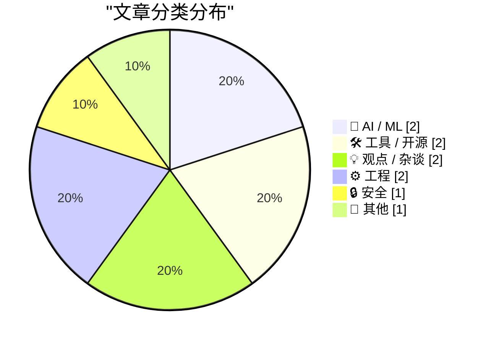
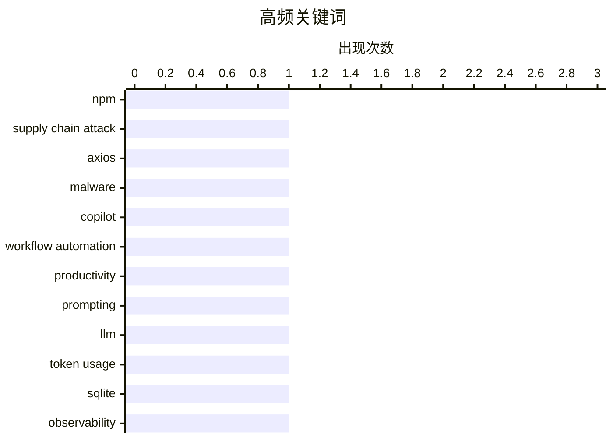

# 📰 AI 博客每日精选 — 2026-04-02

> 来自 Karpathy 推荐的 92 个顶级技术博客，AI 精选 Top 10

## 📝 今日看点

今天技术圈的主线很清晰：一边是“AI 深度落地”，一边是“基础设施与信任成本上升”。从 Copilot 进入团队流程、到工具开始精细记录 LLM token 用量，再到 AI 在冲突中更多服务于执行而非战略，说明行业正从“能不能用”转向“怎么管、用在哪”。与此同时，Axios 供应链事件与 UGC“伪真实感”营销扩张，凸显软件依赖链和信息生态都在面临真实性危机。再加上 DRAM 涨价挤压 SBC 市场、以及对 Gopher 等轻量协议的回望，开发者正在重新审视技术栈的可持续性与复杂度边界。

---

## 🏆 今日必读

🥇 **针对 Axios 的供应链攻击从 npm 拉取恶意依赖**

[Supply Chain Attack on Axios Pulls Malicious Dependency from npm](https://simonwillison.net/2026/Mar/31/supply-chain-attack-on-axios/#atom-everything) — simonwillison.net · 23 小时前 · 🔒 安全

> 一次针对 Axios 的供应链攻击影响了这个每周下载量约 1.01 亿次的 npm HTTP 客户端包。Axios 的 1.14.1 和 0.30.4 版本引入了名为 plain-crypto-js 的新依赖，而该依赖是刚发布的恶意软件，用于窃取凭证并安装远程控制木马（RAT）。文中判断攻击可能源于泄露的长期有效 npm token。Axios 已有公开议题计划采用 trusted publishing，以限制只有其 GitHub Actions 工作流可以向 npm 发布。作者还指出一个可用于预警的迹象：恶意包发布时没有对应 GitHub Release，且 LiteLLM 上周也出现了同类模式。

💡 **为什么值得读**: 它给出了真实供应链攻击案例中的具体受影响版本、入侵路径线索和可操作的检测启发，便于工程团队立即用于发布安全审查。

🏷️ npm, supply chain attack, Axios, malware

🥈 **Copilot 到底是什么？**

[What is Copilot exactly?](https://idiallo.com/blog/what-is-copilot-exactly?src=feed) — idiallo.com · 11 小时前 · 🤖 AI / ML

> 作者因一位高产同事的推荐，尝试把 Copilot 深度纳入一周到一个完整 sprint 的日常工作流。实践中他用它自动化了自己最反感的事务性工作，例如 scrum 仪式、BRD 评审和邮件撰写，并通过模板化提示词汇总日间信息、自动生成周报或指定格式报告。转折点在于他发现自己与同事说的并不是同一个产品：同事指的是 VS Code 里的 GitHub Copilot，而他实际使用的是 Teams 中提供的 Copilot for Microsoft 365。文章进一步梳理了这些“Copilot”名称下的产品边界：GitHub Copilot 与 Microsoft 生态内的 Copilot 并非同一服务，Microsoft 365 版本强调与邮件、文档、OneDrive 等办公数据的联动。核心观点是，“Copilot”并不是单一工具名，而是一组在不同入口和权限体系下能力不同的产品，先分清具体版本再谈体验和价值才有意义。

💡 **为什么值得读**: 它把很多人都会遇到的“Copilot 名称混淆”讲清楚了，能帮你在选型和评估 AI 助手前先对齐产品对象，避免拿错工具得出错误结论。

🏷️ Copilot, workflow automation, productivity, prompting

🥉 **datasette-llm-usage 0.2a0**

[datasette-llm-usage 0.2a0](https://simonwillison.net/2026/Apr/1/datasette-llm-usage/#atom-everything) — simonwillison.net · 19 小时前 · 🛠 工具 / 开源

> datasette-llm-usage 0.2a0 聚焦于将 LLM token 使用情况记录到 SQLite 表中。该版本移除了与额度（allowances）和预估定价相关的功能，并将这部分职责划分给 datasette-llm-accountant。插件现在依赖 datasette-llm 来完成模型配置（#3）。新增了可选的提示词与响应日志能力：启用 datasette-llm-usage.log_prompts 配置后，可将完整 prompts、responses 和 tool calls 写入内部数据库的 llm_usage_prompt_log 表。与此同时，/-/llm-usage-simple-prompt 页面经过重设计，并要求 llm-usage-simple-prompt 权限才能访问。

💡 **为什么值得读**: 这次更新明确了各插件职责边界，并提供了可审计的详细调用日志与更严格的权限控制，对实际部署和治理 LLM 使用非常有参考价值。

🏷️ LLM, token usage, SQLite, observability

---

## 📊 数据概览

| 扫描源 | 抓取文章 | 时间范围 | 精选 |
|:---:|:---:|:---:|:---:|
| 89/92 | 2534 篇 → 34 篇 | 24h | **10 篇** |

### 分类分布



### 高频关键词



<details>
<summary>📈 纯文本关键词图（终端友好）</summary>

```
npm                 │ ████████████████████ 1
supply chain attack │ ████████████████████ 1
axios               │ ████████████████████ 1
malware             │ ████████████████████ 1
copilot             │ ████████████████████ 1
workflow automation │ ████████████████████ 1
productivity        │ ████████████████████ 1
prompting           │ ████████████████████ 1
llm                 │ ████████████████████ 1
token usage         │ ████████████████████ 1
```

</details>

### 🏷️ 话题标签

**npm**(1) · **supply chain attack**(1) · **axios**(1) · malware(1) · copilot(1) · workflow automation(1) · productivity(1) · prompting(1) · llm(1) · token usage(1) · sqlite(1) · observability(1) · sbc(1) · dram pricing(1) · raspberry pi(1) · hardware market(1) · file format(1) · data integrity(1) · python(1) · corruption resistance(1)

---

## 🤖 AI / ML

### 1. Copilot 到底是什么？

[What is Copilot exactly?](https://idiallo.com/blog/what-is-copilot-exactly?src=feed) — **idiallo.com** · 11 小时前 · ⭐ 24/30

> 作者因一位高产同事的推荐，尝试把 Copilot 深度纳入一周到一个完整 sprint 的日常工作流。实践中他用它自动化了自己最反感的事务性工作，例如 scrum 仪式、BRD 评审和邮件撰写，并通过模板化提示词汇总日间信息、自动生成周报或指定格式报告。转折点在于他发现自己与同事说的并不是同一个产品：同事指的是 VS Code 里的 GitHub Copilot，而他实际使用的是 Teams 中提供的 Copilot for Microsoft 365。文章进一步梳理了这些“Copilot”名称下的产品边界：GitHub Copilot 与 Microsoft 生态内的 Copilot 并非同一服务，Microsoft 365 版本强调与邮件、文档、OneDrive 等办公数据的联动。核心观点是，“Copilot”并不是单一工具名，而是一组在不同入口和权限体系下能力不同的产品，先分清具体版本再谈体验和价值才有意义。

🏷️ Copilot, workflow automation, productivity, prompting

---

### 2. 在伊朗战争中，AI 看起来帮助了作战执行，而非战略制定

[In the Iran war, it looks like AI helped with operations, not strategy](https://garymarcus.substack.com/p/in-the-iran-war-it-looks-like-ai) — **garymarcus.substack.com** · 21 小时前 · ⭐ 21/30

> 文章聚焦于美国—伊朗冲突中 AI 的作用边界，判断其更可能在作战执行层面有用，而在战略层面表现不足。文中转述的外交人士观点认为，这场战争伴随多项误判：美国低估伊朗韧性、高估政权更替可能性、且未预判伊朗反制动作。作者给出三点原因：战略需要广泛且深入的世界理解，而生成式 AI 缺乏稳健的世界模型；战略还要求超越既有数据推演新局面，而这正是生成式 AI 的弱项；生成式 AI 的“迎合倾向”可能放大决策层原有判断偏差。结论是 AI 可用于撰写备忘录等操作性工作，但不应被依赖来规划战争或预测战争结果。

🏷️ AI strategy, military operations, LLM limits, decision-making

---

## 🛠 工具 / 开源

### 3. datasette-llm-usage 0.2a0

[datasette-llm-usage 0.2a0](https://simonwillison.net/2026/Apr/1/datasette-llm-usage/#atom-everything) — **simonwillison.net** · 19 小时前 · ⭐ 23/30

> datasette-llm-usage 0.2a0 聚焦于将 LLM token 使用情况记录到 SQLite 表中。该版本移除了与额度（allowances）和预估定价相关的功能，并将这部分职责划分给 datasette-llm-accountant。插件现在依赖 datasette-llm 来完成模型配置（#3）。新增了可选的提示词与响应日志能力：启用 datasette-llm-usage.log_prompts 配置后，可将完整 prompts、responses 和 tool calls 写入内部数据库的 llm_usage_prompt_log 表。与此同时，/-/llm-usage-simple-prompt 页面经过重设计，并要求 llm-usage-simple-prompt 权限才能访问。

🏷️ LLM, token usage, SQLite, observability

---

### 4. GopherTree

[GopherTree](https://maurycyz.com/projects/gopher/) — **maurycyz.com** · 23 小时前 · ⭐ 21/30

> 这篇内容围绕 gopher 客户端应如何呈现协议本质展开，主张把 gopher 当作类似 FTP 的层级文件目录，而不是“受限版网页”。作者批评常见客户端把菜单渲染成网页样式，并大量使用非标准 informational selectors 来模拟超文本；GopherTree 默认隐藏这类条目，以减少伪超链接和 ASCII 艺术横幅对目录浏览的干扰，同时保留快捷键重新启用。该客户端采用终端内的 curses 界面，支持 Unicode（如“Ł”“µA”），内置带分页与自动换行的文本阅读器，支持 UTF-8 和 Latin-1（需手动选择，因为 gopher 协议不提供编码标识）。书签通过本地 gopher 菜单文件实现，并作为类似主页的入口；相关代码偏向 UNIX/Linux，但作者认为可移植。作者强调整个实现约 1000 行 C 代码，并认为这个体量下的 gopher 客户端已足够完整，实际可替代 Lynx 成为其首选客户端。

🏷️ GopherTree, UI design, protocol clients, information architecture

---

## 💡 观点 / 杂谈

### 5. DRAM 定价正在扼杀爱好者单板计算机市场

[DRAM pricing is killing the hobbyist SBC market](https://www.jeffgeerling.com/blog/2026/dram-pricing-is-killing-the-hobbyist-sbc-market/) — **jeffgeerling.com** · 2 小时前 · ⭐ 21/30

> 核心观点是 DRAM（尤其 LPDDR4）价格飙升，正在让爱好者向的中高端 SBC 市场进入“濒危”状态。Raspberry Pi 宣布全线 LPDDR4 机型涨价，并推出 3GB 的 Pi 4（83.75 美元），其中 16GB 的 Pi 5 已涨到 299.99 美元；作者强调这并非愚人节玩笑。作者称从其了解的厂商情况看，LPDDR 芯片已占据主板成本的大头，导致新板发布节奏明显放缓，且 4GB 以上内存机型价格超出多数爱好者承受范围；8GB mini PC 也升至 250 美元以上，二手 PC（尤其大内存）同样更贵。由于作者通常把项目复现成本控制在 100 美元以内，当前价格环境迫使其转向旧款 SBC 和微控制器，并判断不少爱好者也会走这条路。文章结论是：若内存价格不能显著回落，爱好者 SBC 生态将持续萎缩，树莓派或许还能依靠微控制器与工业市场支撑，而更小厂商前景更令人担忧。

🏷️ SBC, DRAM pricing, Raspberry Pi, hardware market

---

### 6. 整个互联网现在都成了 UGC 反应视频

[The Entire Internet Is a UGC Reaction Video Now](https://www.joanwestenberg.com/the-entire-internet-is-a-ugc-reaction-video-now/) — **joanwestenberg.com** · 23 小时前 · ⭐ 21/30

> 文章聚焦于“伪真实感”如何成为互联网内容生产与广告投放的主流机制，尤其是在短视频与 UGC 营销场景中被规模化售卖。文中以 dansugc.com 为例：营销者可从约 2000 条按情绪分类的预录“反应视频”中选片，单条 3 美元、定制 8 美元，用 5-10 秒陌生人的“惊喜/感动”表情拼接进 TikTok 等内容，口号是“100% 真人，零 AI”。作者还给出该类服务的套餐价格（每月 100 条 800 美元、500 条全托管 1 万美元）及“累计 50 亿次播放”的商业叙事，指出其本质是在批量制造“看似随意、实则设计”的社交信任信号。核心判断是，互联网作为社会文化空间已高度表演化，注意力被内容工厂不断碾压并转化为微型转化指标。最终观点是：当“至少是人类拍的造假内容”都被当作高端卖点时，网络生态的真实性底线已经被显著下移。

🏷️ UGC, social media, authenticity, creator economy

---

## ⚙️ 工程

### 7. 随机文件格式

[Random File Format](https://shkspr.mobi/blog/2026/04/random-file-format/) — **shkspr.mobi** · 11 小时前 · ⭐ 21/30

> 文章围绕一种“必须文件完整才能读取”的随机文件格式实验展开，目标是让部分下载或中途损坏的文件几乎无法被成功解析。方案是把数据切成块并打乱存放：文件末尾放一个 32 位指针指向首个信息块，信息块记录后续数据块长度，而每个数据块末尾再放 32 位指针指向下一个信息块，同时文件开头和块间可插入随机填充。这样的链式指针与随机布局使读取过程必须从文件尾部按指针追踪，缺失尾部或中间片段都会破坏解码路径。作者也指出了代价与边界：会增加文件体积，32 位定位把文件大小限制在 4GB 以下，固定块且无随机填充时可能被部分重建，结构化或文本内容也可能被恢复出较多信息，并且畸形文件可能形成指针死循环。文末给出一个 Python 3 的简易编码器示例，按 1024 字节分块读取并打乱写出，最后 4 字节存首块指针以演示该思路。

🏷️ file format, data integrity, Python, corruption resistance

---

### 8. 我的碎碎念现在也能通过 Gopher 访问

[My ramblings are available over gopher](https://maurycyz.com/misc/gopher/) — **maurycyz.com** · 23 小时前 · ⭐ 20/30

> 作者认为读取个人网站不该依赖“上千行 C 代码”的复杂客户端，于是为站点增加了 Gopher 支持，并展示了通过 `telnet maurycyz.com 70` 直接获取文本内容和菜单的方式。Gopher 返回的是纯文本文件，没有标记、内嵌内容和超链接导航，导航依赖目录式菜单；每行首字符表示资源类型（如 `0` 文本、`1` 目录、`9` 二进制、`I` 图片），后面是以制表符分隔的显示名、路径、主机和端口。作者强调该协议只需客户端理解菜单：没有 URL、请求头和 MIME 类型，客户端只发送 selector（文件路径），服务端只返回文件。为契合这种文档检索思路，站点将博客文章转换为纯文本并使用目录导航，而不是复刻 Web 式链接结构。文中还给出用 `ncat` 一行命令下载文件、用 Lynx 访问 `gopher://maurycyz.com` 的实操方式，并表达了对 Gemini 协议“像给 HTTP 加了 Markdown”的保留态度。

🏷️ Gopher, protocol, minimal web, self-hosting

---

## 🔒 安全

### 9. 针对 Axios 的供应链攻击从 npm 拉取恶意依赖

[Supply Chain Attack on Axios Pulls Malicious Dependency from npm](https://simonwillison.net/2026/Mar/31/supply-chain-attack-on-axios/#atom-everything) — **simonwillison.net** · 23 小时前 · ⭐ 25/30

> 一次针对 Axios 的供应链攻击影响了这个每周下载量约 1.01 亿次的 npm HTTP 客户端包。Axios 的 1.14.1 和 0.30.4 版本引入了名为 plain-crypto-js 的新依赖，而该依赖是刚发布的恶意软件，用于窃取凭证并安装远程控制木马（RAT）。文中判断攻击可能源于泄露的长期有效 npm token。Axios 已有公开议题计划采用 trusted publishing，以限制只有其 GitHub Actions 工作流可以向 npm 发布。作者还指出一个可用于预警的迹象：恶意包发布时没有对应 GitHub Release，且 LiteLLM 上周也出现了同类模式。

🏷️ npm, supply chain attack, Axios, malware

---

## 📝 其他

### 10. 韦恩的世界

[Wayne’s World](https://feed.tedium.co/link/15204/17311236/ronald-g-wayne-apple-interview) — **tedium.co** · 21 小时前 · ⭐ 20/30

> 苹果迎来 50 周年之际，文章把焦点放在常被忽略的第三位联合创始人 Ronald G. Wayne 身上，强调他的人生远不止“在两周后放弃苹果 10% 股份”这一标签。内容指出 Wayne 近来对这段“放弃股份”的流行说法提出过异议，并将其塑造成兼具创作与工程能力的多面人物。文中回看他在苹果最醒目的贡献之一——首个苹果 Logo：以牛顿与苹果树构图、带有哥特风格和邮票审美，富有趣味性，但也不符合现代 Logo 可缩放与快速识别的规则。文章还把这一视觉风格与他的个人背景联系起来，包括他在纽约 High School of Art and Design 的制图训练、在 Atari 整理库存的经历，以及离开苹果后在 Lawrence Livermore National Laboratory 的合同工作。整体观点是，苹果在 Wayne 九十余年人生中只是一个片段，他的长期经历与跨领域能力同样值得被看见。

🏷️ Apple history, Ronald Wayne, founders, tech culture

---

*生成于 2026-04-02 07:05 | 扫描 89 源 → 获取 2534 篇 → 精选 10 篇*
*基于 [Hacker News Popularity Contest 2025](https://refactoringenglish.com/tools/hn-popularity/) RSS 源列表*
