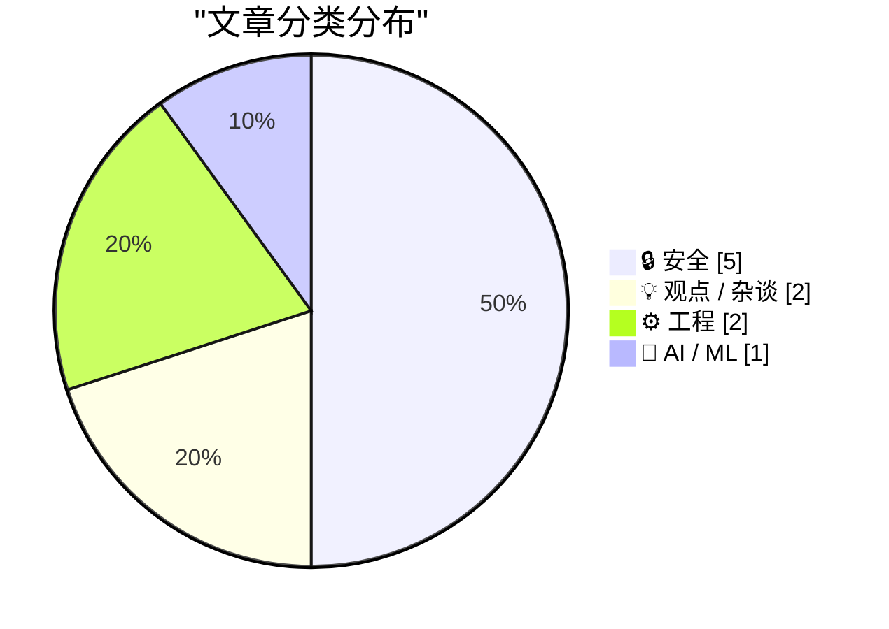
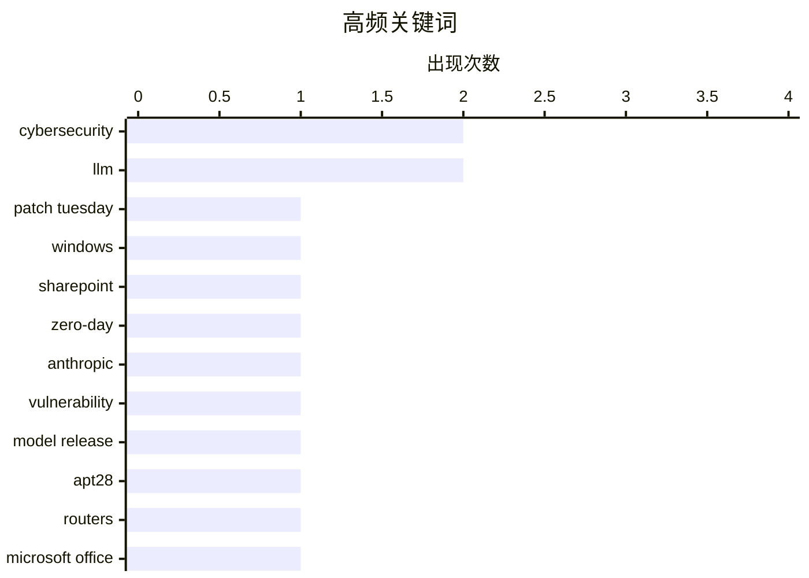

# 📰 AI 博客每日精选 — 2026-04-03

> 来自 Karpathy 推荐的 92 个顶级技术博客，AI 精选 Top 10

## 📝 今日看点

今天技术圈的主线，一是安全形势继续升温：从微软一次性修复大批高危漏洞，到国家级黑客借老旧路由器窃取 Office 令牌，再到应用层防护机制更新，攻防都在向“基础设施与身份”核心地带集中。二是 AI 能力正加速逼近高风险边界，先进模型被开始以“限量、受控”方式释放，行业对 AI 在安全研究和编程中的真实能力与局限也更趋冷静。三是平台与算力版图仍在快速扩张，无论是 OpenAI 的天量资本故事，还是 Arm 模块化电脑、卫星直连设备网络的新动作，都说明下一阶段竞争已从模型本身延伸到硬件、连接与生态控制力。

---

## 🏆 今日必读

🥇 **2026 年 4 月补丁星期二**

[Patch Tuesday, April 2026 Edition](https://krebsonsecurity.com/2026/04/patch-tuesday-april-2026-edition/) — krebsonsecurity.com · 2026-04-15 · 🔒 安全

> 微软在本月补丁星期二一次性修复了 Windows 及相关软件中的 167 个安全漏洞，其中包括 SharePoint Server 的零日漏洞 CVE-2026-32201，以及 Windows Defender 的提权漏洞“BlueHammer”（CVE-2026-33825）。CVE-2026-32201 已被攻击者利用，可在网络中伪装可信内容或界面，带来钓鱼、未授权数据篡改和社会工程攻击风险；BlueHammer 的公开利用代码在安装补丁后已失效。同期，Google Chrome 修复了 2026 年的第 4 个零日漏洞，Adobe Reader 也通过 4 月 11 日的紧急更新修补了可导致远程代码执行的 CVE-2026-34621，且该漏洞至少自 2025 年 11 月起已出现被利用迹象。研究人员称 2026 年 4 月是微软历史上规模第二大的补丁星期二，而仅浏览器相关漏洞就接近 60 个，创下该类别新纪录。Rapid7 的观点认为，漏洞披露数量激增的一个合理解释是 AI 能力持续扩展，未来漏洞报告量还可能继续上升。

💡 **为什么值得读**: 值得读在于它把本月最需要优先处理的在野利用漏洞、跨厂商补丁动态，以及 AI 可能推动漏洞发现加速这三个关键信号放在了一起。

🏷️ Patch Tuesday, Windows, SharePoint, zero-day

🥈 **Anthropic 的 Project Glasswing：将 Claude Mythos 限制给安全研究人员，在我看来是必要的**

[Anthropic's Project Glasswing - restricting Claude Mythos to security researchers - sounds necessary to me](https://simonwillison.net/2026/Apr/7/project-glasswing/#atom-everything) — simonwillison.net · 2026-04-08 · 🔒 安全

> Anthropic 没有公开发布最新模型 Claude Mythos，而是通过新公布的 Project Glasswing 仅向极少数预览合作伙伴开放，因为其网络安全研究能力被认为强到需要让软件行业先做准备。该模型被描述为通用模型，类似 Claude Opus 4.6，但 Mythos Preview 已经发现了数千个高危漏洞，其中包括所有主流操作系统和 Web 浏览器中的漏洞。Anthropic 计划让合作伙伴利用它进行本地漏洞检测、二进制黑盒测试、端点加固和渗透测试，并在红队博客中给出了更具体的能力示例：它曾编写出串联 4 个漏洞的浏览器利用链、自动获得 Linux 等系统的本地提权利用，还为 FreeBSD 的 NFS 服务器写出可让未认证用户拿到 root 权限的远程代码执行利用。与 Claude Opus 4.6 相比，Mythos Preview 在自主漏洞利用开发上明显更强：前者在 Firefox 147 JavaScript 引擎漏洞上数百次尝试中仅 2 次产出 JavaScript shell exploit，而 Mythos Preview 成功开发出可用 exploit 181 次，另有 29 次实现寄存器控制。作者认为，虽然“模型危险到不能发布”容易被当作营销话术，但结合近期安全专业人士对现代 LLM 漏洞研究能力提升的警告，这次谨慎限制发布是合理的。

💡 **为什么值得读**: 值得读在于它用具体 exploit 案例和与 Opus 4.6 的量化对比，展示了前沿模型在漏洞研究上的能力跃迁，以及为何需要限制性发布。

🏷️ Anthropic, cybersecurity, vulnerability, model release

🥉 **俄罗斯通过入侵路由器窃取微软 Office 令牌**

[Russia Hacked Routers to Steal Microsoft Office Tokens](https://krebsonsecurity.com/2026/04/russia-hacked-routers-to-steal-microsoft-office-tokens/) — krebsonsecurity.com · 2026-04-08 · 🔒 安全

> 俄罗斯军情背景黑客组织 Forest Blizzard（又名 APT28、Fancy Bear）利用老旧路由器的已知漏洞，大规模窃取微软 Office 用户的身份验证令牌。微软称，这个隐蔽但手法相当简单的监控网络波及了 200 多家机构和 5000 台消费者设备；Lumen 旗下 Black Lotus Labs 则表示，该行动在 2025 年 12 月高峰期影响了超过 1.8 万个网络。攻击主要针对政府机构、外交部门、执法机构和第三方邮件服务商，目标设备多为面向 SOHO 市场、已停止支持或长期未更新的 Mikrotik 与 TP-Link 路由器。攻击者无需在路由器上部署恶意软件，而是通过篡改 DNS 设置，把流量引向其控制的 DNS 服务器和虚拟专用服务器，从而在整个本地网络范围内截获用户传输的 OAuth 身份验证令牌。由于这些令牌通常出现在用户完成登录和多因素认证之后，攻击者因此能够绕过逐个钓鱼窃取账号和一次性验证码，直接访问受害者账户。

💡 **为什么值得读**: 值得读在于它清楚展示了老旧路由器、DNS 劫持和 OAuth 令牌截获如何串成一条高效攻击链，对理解为何仅靠 MFA 仍不足以抵御这类入侵很有参考价值。

🏷️ APT28, routers, Microsoft Office, token theft

---

## 📊 数据概览

| 扫描源 | 抓取文章 | 时间范围 | 精选 |
|:---:|:---:|:---:|:---:|
| 89/92 | 2542 篇 → 245 篇 | 24h | **10 篇** |

### 分类分布



### 高频关键词



<details>
<summary>📈 纯文本关键词图（终端友好）</summary>

```
cybersecurity │ ████████████████████ 2
llm           │ ████████████████████ 2
patch tuesday │ ██████████░░░░░░░░░░ 1
windows       │ ██████████░░░░░░░░░░ 1
sharepoint    │ ██████████░░░░░░░░░░ 1
zero-day      │ ██████████░░░░░░░░░░ 1
anthropic     │ ██████████░░░░░░░░░░ 1
vulnerability │ ██████████░░░░░░░░░░ 1
model release │ ██████████░░░░░░░░░░ 1
apt28         │ ██████████░░░░░░░░░░ 1
```

</details>

### 🏷️ 话题标签

**cybersecurity**(2) · **llm**(2) · **patch tuesday**(1) · windows(1) · sharepoint(1) · zero-day(1) · anthropic(1) · vulnerability(1) · model release(1) · apt28(1) · routers(1) · microsoft office(1) · token theft(1) · openbsd(1) · bug finding(1) · csrf(1) · sec-fetch-site(1) · datasette(1) · go(1) · openai(1)

---

## 🔒 安全

### 1. 2026 年 4 月补丁星期二

[Patch Tuesday, April 2026 Edition](https://krebsonsecurity.com/2026/04/patch-tuesday-april-2026-edition/) — **krebsonsecurity.com** · 2026-04-15 · ⭐ 27/30

> 微软在本月补丁星期二一次性修复了 Windows 及相关软件中的 167 个安全漏洞，其中包括 SharePoint Server 的零日漏洞 CVE-2026-32201，以及 Windows Defender 的提权漏洞“BlueHammer”（CVE-2026-33825）。CVE-2026-32201 已被攻击者利用，可在网络中伪装可信内容或界面，带来钓鱼、未授权数据篡改和社会工程攻击风险；BlueHammer 的公开利用代码在安装补丁后已失效。同期，Google Chrome 修复了 2026 年的第 4 个零日漏洞，Adobe Reader 也通过 4 月 11 日的紧急更新修补了可导致远程代码执行的 CVE-2026-34621，且该漏洞至少自 2025 年 11 月起已出现被利用迹象。研究人员称 2026 年 4 月是微软历史上规模第二大的补丁星期二，而仅浏览器相关漏洞就接近 60 个，创下该类别新纪录。Rapid7 的观点认为，漏洞披露数量激增的一个合理解释是 AI 能力持续扩展，未来漏洞报告量还可能继续上升。

🏷️ Patch Tuesday, Windows, SharePoint, zero-day

---

### 2. Anthropic 的 Project Glasswing：将 Claude Mythos 限制给安全研究人员，在我看来是必要的

[Anthropic's Project Glasswing - restricting Claude Mythos to security researchers - sounds necessary to me](https://simonwillison.net/2026/Apr/7/project-glasswing/#atom-everything) — **simonwillison.net** · 2026-04-08 · ⭐ 27/30

> Anthropic 没有公开发布最新模型 Claude Mythos，而是通过新公布的 Project Glasswing 仅向极少数预览合作伙伴开放，因为其网络安全研究能力被认为强到需要让软件行业先做准备。该模型被描述为通用模型，类似 Claude Opus 4.6，但 Mythos Preview 已经发现了数千个高危漏洞，其中包括所有主流操作系统和 Web 浏览器中的漏洞。Anthropic 计划让合作伙伴利用它进行本地漏洞检测、二进制黑盒测试、端点加固和渗透测试，并在红队博客中给出了更具体的能力示例：它曾编写出串联 4 个漏洞的浏览器利用链、自动获得 Linux 等系统的本地提权利用，还为 FreeBSD 的 NFS 服务器写出可让未认证用户拿到 root 权限的远程代码执行利用。与 Claude Opus 4.6 相比，Mythos Preview 在自主漏洞利用开发上明显更强：前者在 Firefox 147 JavaScript 引擎漏洞上数百次尝试中仅 2 次产出 JavaScript shell exploit，而 Mythos Preview 成功开发出可用 exploit 181 次，另有 29 次实现寄存器控制。作者认为，虽然“模型危险到不能发布”容易被当作营销话术，但结合近期安全专业人士对现代 LLM 漏洞研究能力提升的警告，这次谨慎限制发布是合理的。

🏷️ Anthropic, cybersecurity, vulnerability, model release

---

### 3. 俄罗斯通过入侵路由器窃取微软 Office 令牌

[Russia Hacked Routers to Steal Microsoft Office Tokens](https://krebsonsecurity.com/2026/04/russia-hacked-routers-to-steal-microsoft-office-tokens/) — **krebsonsecurity.com** · 2026-04-08 · ⭐ 27/30

> 俄罗斯军情背景黑客组织 Forest Blizzard（又名 APT28、Fancy Bear）利用老旧路由器的已知漏洞，大规模窃取微软 Office 用户的身份验证令牌。微软称，这个隐蔽但手法相当简单的监控网络波及了 200 多家机构和 5000 台消费者设备；Lumen 旗下 Black Lotus Labs 则表示，该行动在 2025 年 12 月高峰期影响了超过 1.8 万个网络。攻击主要针对政府机构、外交部门、执法机构和第三方邮件服务商，目标设备多为面向 SOHO 市场、已停止支持或长期未更新的 Mikrotik 与 TP-Link 路由器。攻击者无需在路由器上部署恶意软件，而是通过篡改 DNS 设置，把流量引向其控制的 DNS 服务器和虚拟专用服务器，从而在整个本地网络范围内截获用户传输的 OAuth 身份验证令牌。由于这些令牌通常出现在用户完成登录和多因素认证之后，攻击者因此能够绕过逐个钓鱼窃取账号和一次性验证码，直接访问受害者账户。

🏷️ APT28, routers, Microsoft Office, token theft

---

### 4. AI 网络安全并不是工作量证明

[AI cybersecurity is not proof of work](http://antirez.com/news/163) — **antirez.com** · 2026-04-16 · ⭐ 25/30

> 这段内容反对把 AI 网络安全能力类比为工作量证明，认为“更多算力最终必胜”的逻辑不适用于漏洞发现。哈希碰撞搜索会随着投入工作量增加而最终找到满足条件的结果，但代码漏洞分析受限于代码状态空间、LLM 采样能覆盖的有效路径，以及模型本身的智能上限。作者指出，对同一段代码进行大量采样后，瓶颈不再是采样次数 M，而是模型智能水平 I。以 OpenBSD 的 SACK 漏洞为例，作者认为较弱模型即使消耗无限 token，也无法把起始窗口缺少校验、整数溢出，以及本不应进入的 NULL 分支串联起来识别出真实问题。结论是，未来网络安全竞争更像是“更好的模型和更快的模型访问获胜”，而不是单纯“更多 GPU 获胜”。

🏷️ LLM, cybersecurity, OpenBSD, bug finding

---

### 5. Datasette PR #2689：用 Sec-Fetch-Site 头保护替代基于令牌的 CSRF 防护

[datasette PR #2689: Replace token-based CSRF with Sec-Fetch-Site header protection](https://simonwillison.net/2026/Apr/14/replace-token-based-csrf/#atom-everything) — **simonwillison.net** · 2026-04-15 · ⭐ 25/30

> Datasette 将 CSRF 防护机制从依赖 CSRF token 的旧方案，切换为基于 Sec-Fetch-Site 请求头的新中间件方案。旧实现基于 asgi-csrf Python 库，但在模板中插入表单相关内容较麻烦，而且对需要从浏览器外部调用的 API 还要选择性关闭 CSRF 防护。新方案受 Filippo Valsorda 的研究启发，这项思路已在 2025 年 8 月随 Go 1.25 一同落地，作者现已将同类改动合入 Datasette。对应 PR 还移除了模板中不再需要的相关片段，删除了 datasette/hookspecs.py 中的 skip_csrf 插件钩子及其文档和测试，并更新了 CSRF 文档与升级指南。作者认为这种新方式可以替代原有 token 方案，并简化 Datasette 中与 CSRF 相关的实现和使用方式。

🏷️ CSRF, Sec-Fetch-Site, Datasette, Go

---

## 💡 观点 / 杂谈

### 6. OpenAI 宣布新增 1220 亿美元“承诺资本”，并公布其未来“超级应用”计划

[★ OpenAI Announces $122 Billion Additional ‘Committed Capital’, and Announces Their ‘Superapp’ Plan for the Future](https://daringfireball.net/2026/04/openai_future) — **daringfireball.net** · 2026-04-08 · ⭐ 24/30

> OpenAI 宣布完成新一轮融资，获得 1220 亿美元承诺资本，投后估值达到 8520 亿美元。文中将这一估值与伯克希尔·哈撒韦、沃尔玛、三星和礼来等上市公司的市值及 2025 年净利润对比，并指出德意志银行曾预测 OpenAI 在 2024 至 2029 年间将亏损 1430 亿美元，而 OpenAI 的反驳版本也承认同期将亏损 1110 亿美元。作者认为，OpenAI 当前估值建立在未来某个阶段停止亏损并在 2030 年代开始产生巨额利润的预期之上，但这一点远未确定；同时他质疑其商业模式是在“用几美分的价格卖出价值 1 美元的算力”。OpenAI 还提出要打造统一的 AI 超级应用，认为随着模型能力增强，瓶颈将从智能转向可用性，用户需要一个能够理解意图、执行操作并跨应用、数据和工作流运行的单一系统。作者的结论是，他对 OpenAI 能否兑现如此估值持强烈怀疑态度，也不认同其具备稳固护城河。

🏷️ OpenAI, funding, valuation, superapp

---

### 7. 将编程（结合 AI 代理）视为理论构建

[Programming (with AI agents) as theory building](https://seangoedecke.com/programming-with-ai-agents-as-theory-building/) — **seangoedecke.com** · 2026-04-03 · ⭐ 24/30

> 文章围绕 Peter Naur 在 1985 年提出的“Programming as Theory Building”展开，强调软件工程的核心产出不是程序本身，而是工程师脑中关于系统如何运作的理论。文中指出，对程序做出修改之前，工程师必须先通过阅读代码建立足够的心理模型，再在这个模型上思考变更，最后才落实到代码。作者进一步讨论了 LLM 和 AI 代理是否会让工程师跳过这种理论构建，认为答案在某种程度上是会的：即使是认真使用 AI 工具的开发者，也往往会建立一个比纯手工工作时更粗略的心理模型，因为 AI 的作用就是分担部分认知负担。作者同时反驳“缺少实现细节就等于不理解系统”的看法，指出任何心理模型都会省略细节，技术理解本来就存在抽象层次与覆盖范围的差异。作者的结论是，使用 LLM 并不自动否定理论构建这件事，关键不在于是否掌握全部细节，而在于是否形成了足以支撑理解和修改系统的有效模型。

🏷️ AI agents, LLM, software engineering, theory building

---

## ⚙️ 工程

### 8. Framework 笔记本的 Arm 主板

[An Arm Mainboard for the Framework Laptop](https://www.jeffgeerling.com/blog/2026/arm-mainboard-for-framework-laptop/) — **jeffgeerling.com** · 2026-04-15 · ⭐ 23/30

> 文章围绕 Framework 13 可更换主板生态中的唯一 Arm 方案 MetaComputing AI PC 展开，评测其基于 Cix P1 的主板在硬件兼容性、功耗与性能上的表现。该主板配备 12 核 Arm SoC、最高 32 GB 板载内存，评测样机为 16 GB LPDDR5，并保留 Framework 主板常见的 M.2 NVMe、Wi‑Fi 模块、显示、键盘、电池和 4 个 USB-C 接口。软件方面，MetaComputing 提供可启动且具备完整硬件支持的 Ubuntu 25.04 官方镜像，主板也具备完整 BIOS 与 UEFI 支持；Windows on Arm 已能部分安装，在 Linux 下可运行 Vulkan 和 OpenGL，Mali G720 Immortalis 核显在 GravityMark 中得分 7,627，表现接近苹果 A14 图形并略快于 Intel N150 一类低端核显。功耗问题相比作者测试过的其他 Cix P1 设备有所改善，但空闲功耗仍不理想；CPU 表现上，Geekbench 与其他 Cix P1 设备基本一致，但在内存密集型 FP64 HPL 中成绩约为 MS-R1 和 Orion O6 的一半。作者给出的整体判断是，这块 Arm 主板让 Framework 13 真正覆盖了 x86、RISC-V 和 Arm 三种架构，但 Cix P1 在空闲功耗和部分性能表现上仍有明显短板。

🏷️ Arm, Framework Laptop, SoC, power consumption

---

### 9. 亚马逊将收购 Globalstar，并宣布与苹果达成协议，继续为 iPhone 和 Apple Watch 提供服务

[Amazon to Acquire Globalstar, Announces Agreement With Apple to Continue Service for iPhone and Apple Watch](https://www.aboutamazon.com/news/company-news/amazon-globalstar-apple) — **daringfireball.net** · 2026-04-15 · ⭐ 26/30

> 亚马逊宣布收购 Globalstar，并把其卫星、频谱资源和运营能力用于 Amazon Leo 未来一代近地轨道卫星网络的直连设备（D2D）服务。新的 Amazon Leo D2D 系统面向移动网络运营商，目标是在地面蜂窝网络覆盖不到的区域扩展语音、短信和数据服务。亚马逊同时与苹果达成协议，由 Amazon Leo 为受支持的 iPhone 和 Apple Watch 提供卫星服务，包括通过卫星进行紧急 SOS，以及联系亲友、请求道路救援等功能。交易完成后，亚马逊将获得 Globalstar 现有卫星运营、基础设施、资产以及具备全球授权的 MSS 频谱许可；Globalstar 现有星座和新一代卫星将与 Amazon Leo 宽带系统及其规划中的 D2D 系统协同运行。亚马逊给出的方向是联合移动网络运营商和更多合作伙伴，把更可靠、更高速的连接能力扩展到全球更多地区。

🏷️ Amazon, Globalstar, satellite, direct-to-device

---

## 🤖 AI / ML

### 10. AI 12 分钟就做完了，但我花了 10 小时来修

[AI Did It in 12 Minutes. It Took Me 10 Hours to Fix It](https://idiallo.com/blog/it-took-me-10-hours-to-fix-ai-code?src=feed) — **idiallo.com** · 2026-04-06 · ⭐ 23/30

> 作者一直坚持亲自理解自己项目中的代码，因此对大模型一次性生成大量代码的做法始终保持警惕，尤其担心在系统出错时自己没有足够清晰的心智模型。一次为博客补做图片资源上传界面的任务中，AI 确实帮助作者在一天内完成了拖延 11 年的需求，替代了原先通过 scp、sftp、FileZilla 手动上传文件、再回后台填写 URL 的原始流程。实际代价是作者通读了接近 5000 行 AI 生成代码，并在首次用 LLM 写 PHP 时感受到明显的“意大利面式代码”问题：模板里混杂 HTML、CSS 和数据库查询，维护性很差。作者还发现，所用的 GLM-5 智能体在系统提示中默认倾向生成 Next.js 项目，而自己的需求明确是 PHP 应用，这种提示冲突也影响了结果质量。结论是，AI 能显著加快把功能“做出来”的速度，但生成代码后的审查、理解和修复成本仍然很高，不能替代理解代码本身。

🏷️ AI coding, code review, technical debt, productivity

---

*生成于 2026-04-03 07:00 | 扫描 89 源 → 获取 2542 篇 → 精选 10 篇*
*基于 [Hacker News Popularity Contest 2025](https://refactoringenglish.com/tools/hn-popularity/) RSS 源列表*
