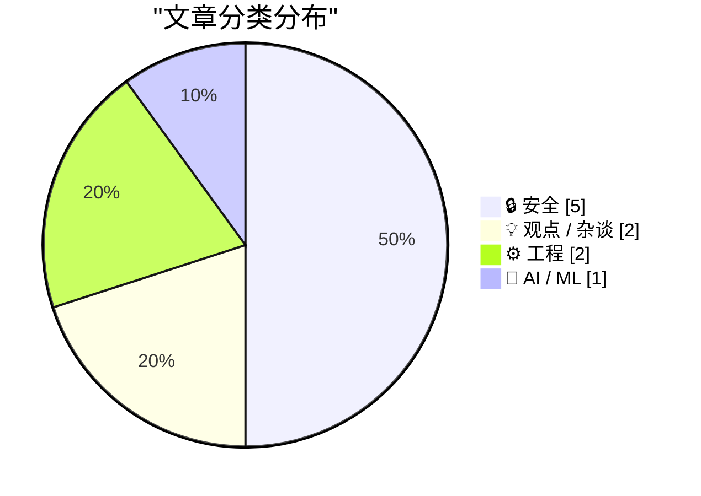
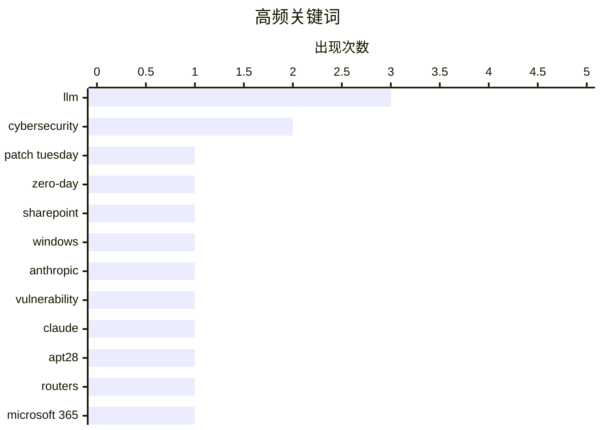

# 📰 AI 博客每日精选 — 2026-04-03

> 来自 Karpathy 推荐的 92 个顶级技术博客，AI 精选 Top 10

## 🏆 今日必读

🥇 **Patch Tuesday, April 2026 Edition**

[Patch Tuesday, April 2026 Edition](https://krebsonsecurity.com/2026/04/patch-tuesday-april-2026-edition/) — krebsonsecurity.com · 2026-04-15 · 🔒 安全

> Microsoft today pushed software updates to fix a staggering 167 security vulnerabilities in its Windows operating systems and related software, including a SharePoint Server zero-day and a publicly di

🏷️ Patch Tuesday, zero-day, SharePoint, Windows

🥈 **Anthropic's Project Glasswing - restricting Claude Mythos to security researchers - sounds necessary to me**

[Anthropic's Project Glasswing - restricting Claude Mythos to security researchers - sounds necessary to me](https://simonwillison.net/2026/Apr/7/project-glasswing/#atom-everything) — simonwillison.net · 2026-04-08 · 🔒 安全

> Simon Willison’s Weblog Subscribe Sponsored by: Teleport &mdash; Connect agents to your infra in seconds with Teleport Beams. Built-in identity. Zero secrets. Get early access Anthropic’s Project Glas

🏷️ Anthropic, cybersecurity, vulnerability, Claude

🥉 **Russia Hacked Routers to Steal Microsoft Office Tokens**

[Russia Hacked Routers to Steal Microsoft Office Tokens](https://krebsonsecurity.com/2026/04/russia-hacked-routers-to-steal-microsoft-office-tokens/) — krebsonsecurity.com · 2026-04-08 · 🔒 安全

> Hackers linked to Russia’s military intelligence units are using known flaws in older Internet routers to mass harvest authentication tokens from Microsoft Office users, security experts warned today.

🏷️ APT28, routers, Microsoft 365, token theft

---

## 📊 数据概览

| 扫描源 | 抓取文章 | 时间范围 | 精选 |
|:---:|:---:|:---:|:---:|
| 89/92 | 2542 篇 → 244 篇 | 24h | **10 篇** |

### 分类分布



### 高频关键词



<details>
<summary>📈 纯文本关键词图（终端友好）</summary>

```
llm           │ ████████████████████ 3
cybersecurity │ █████████████░░░░░░░ 2
patch tuesday │ ███████░░░░░░░░░░░░░ 1
zero-day      │ ███████░░░░░░░░░░░░░ 1
sharepoint    │ ███████░░░░░░░░░░░░░ 1
windows       │ ███████░░░░░░░░░░░░░ 1
anthropic     │ ███████░░░░░░░░░░░░░ 1
vulnerability │ ███████░░░░░░░░░░░░░ 1
claude        │ ███████░░░░░░░░░░░░░ 1
apt28         │ ███████░░░░░░░░░░░░░ 1
```

</details>

### 🏷️ 话题标签

**llm**(3) · **cybersecurity**(2) · **patch tuesday**(1) · zero-day(1) · sharepoint(1) · windows(1) · anthropic(1) · vulnerability(1) · claude(1) · apt28(1) · routers(1) · microsoft 365(1) · token theft(1) · csrf(1) · sec-fetch-site(1) · datasette(1) · web security(1) · bug finding(1) · openbsd(1) · openai(1)

---

## 🔒 安全

### 1. Patch Tuesday, April 2026 Edition

[Patch Tuesday, April 2026 Edition](https://krebsonsecurity.com/2026/04/patch-tuesday-april-2026-edition/) — **krebsonsecurity.com** · 2026-04-15 · ⭐ 27/30

> Microsoft today pushed software updates to fix a staggering 167 security vulnerabilities in its Windows operating systems and related software, including a SharePoint Server zero-day and a publicly di

🏷️ Patch Tuesday, zero-day, SharePoint, Windows

---

### 2. Anthropic's Project Glasswing - restricting Claude Mythos to security researchers - sounds necessary to me

[Anthropic's Project Glasswing - restricting Claude Mythos to security researchers - sounds necessary to me](https://simonwillison.net/2026/Apr/7/project-glasswing/#atom-everything) — **simonwillison.net** · 2026-04-08 · ⭐ 27/30

> Simon Willison’s Weblog Subscribe Sponsored by: Teleport &mdash; Connect agents to your infra in seconds with Teleport Beams. Built-in identity. Zero secrets. Get early access Anthropic’s Project Glas

🏷️ Anthropic, cybersecurity, vulnerability, Claude

---

### 3. Russia Hacked Routers to Steal Microsoft Office Tokens

[Russia Hacked Routers to Steal Microsoft Office Tokens](https://krebsonsecurity.com/2026/04/russia-hacked-routers-to-steal-microsoft-office-tokens/) — **krebsonsecurity.com** · 2026-04-08 · ⭐ 27/30

> Hackers linked to Russia’s military intelligence units are using known flaws in older Internet routers to mass harvest authentication tokens from Microsoft Office users, security experts warned today.

🏷️ APT28, routers, Microsoft 365, token theft

---

### 4. datasette PR #2689: Replace token-based CSRF with Sec-Fetch-Site header protection

[datasette PR #2689: Replace token-based CSRF with Sec-Fetch-Site header protection](https://simonwillison.net/2026/Apr/14/replace-token-based-csrf/#atom-everything) — **simonwillison.net** · 2026-04-15 · ⭐ 25/30

> datasette PR #2689: Replace token-based CSRF with Sec-Fetch-Site header protection . Datasette has long protected against CSRF attacks using CSRF tokens, implemented using my asgi-csrf Python library.

🏷️ CSRF, Sec-Fetch-Site, Datasette, web security

---

### 5. AI cybersecurity is not proof of work

[AI cybersecurity is not proof of work](http://antirez.com/news/163) — **antirez.com** · 2026-04-16 · ⭐ 24/30

> antirez 5 hours ago. 25245 views. The proof of work is the wrong analogy: finding hash collisions, while exponentially harder with N, is guaranteed to find, with enough work, some S so that H(S) satis

🏷️ LLM, cybersecurity, bug finding, OpenBSD

---

## 💡 观点 / 杂谈

### 6. ★ OpenAI Announces $122 Billion Additional ‘Committed Capital’, and Announces Their ‘Superapp’ Plan for the Future

[★ OpenAI Announces $122 Billion Additional ‘Committed Capital’, and Announces Their ‘Superapp’ Plan for the Future](https://daringfireball.net/2026/04/openai_future) — **daringfireball.net** · 2026-04-08 · ⭐ 24/30

> By John Gruber Archive The Talk Show Dithering Projects Contact Colophon Feeds / Social Twitter --> Sponsorship WorkOS FGA : The authorization layer for AI agents OpenAI Announces $122 Billion Additio

🏷️ OpenAI, funding, valuation, superapp

---

### 7. Programming (with AI agents) as theory building

[Programming (with AI agents) as theory building](https://seangoedecke.com/programming-with-ai-agents-as-theory-building/) — **seangoedecke.com** · 2026-04-03 · ⭐ 24/30

> Programming (with AI agents) as theory building Back in 1985, computer scientist Peter Naur wrote “Programming as Theory Building” . According to Naur - and I agree with him - the core output of softw

🏷️ AI agents, LLM, programming, theory

---

## ⚙️ 工程

### 8. An Arm Mainboard for the Framework Laptop

[An Arm Mainboard for the Framework Laptop](https://www.jeffgeerling.com/blog/2026/arm-mainboard-for-framework-laptop/) — **jeffgeerling.com** · 2026-04-15 · ⭐ 23/30

> An Arm Mainboard for the Framework Laptop Apr 15, 2026 Using the repair-friendly Framework 13 laptop chassis, I've tested the low-end x86 option (a Ryzen AI 5 340 Mainboard ), the fastest RISC-V optio

🏷️ ARM, Framework, laptop, power

---

### 9. Amazon to Acquire Globalstar, Announces Agreement With Apple to Continue Service for iPhone and Apple Watch

[Amazon to Acquire Globalstar, Announces Agreement With Apple to Continue Service for iPhone and Apple Watch](https://www.aboutamazon.com/news/company-news/amazon-globalstar-apple) — **daringfireball.net** · 2026-04-15 · ⭐ 26/30

> Globalstar satellites, radio frequency spectrum, and operational expertise will enable Amazon Leo to add Direct-to-Device (D2D) services to future generations of its low Earth orbit satellite network.

🏷️ Amazon, Globalstar, satellite, Direct-to-Device

---

## 🤖 AI / ML

### 10. AI Did It in 12 Minutes. It Took Me 10 Hours to Fix It

[AI Did It in 12 Minutes. It Took Me 10 Hours to Fix It](https://idiallo.com/blog/it-took-me-10-hours-to-fix-ai-code?src=feed) — **idiallo.com** · 2026-04-06 · ⭐ 23/30

> I've been working on personal projects since the 2000s. One thing I've always been adamant about is understanding the code I write. Even when Stack Overflow came along, I was that annoying guy who tol

🏷️ AI coding, code review, LLM, technical debt

---

*生成于 2026-04-03 07:00 | 扫描 89 源 → 获取 2542 篇 → 精选 10 篇*
*基于 [Hacker News Popularity Contest 2025](https://refactoringenglish.com/tools/hn-popularity/) RSS 源列表*
