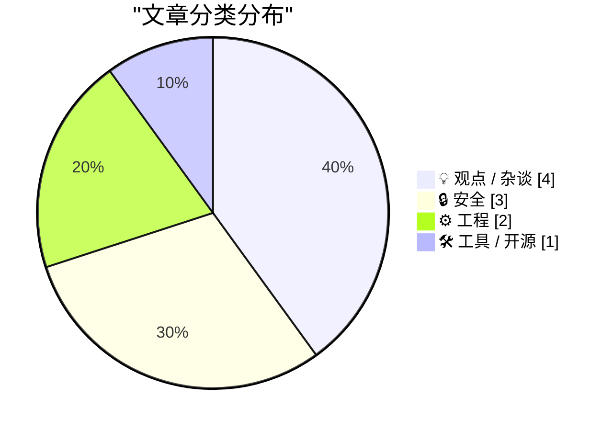
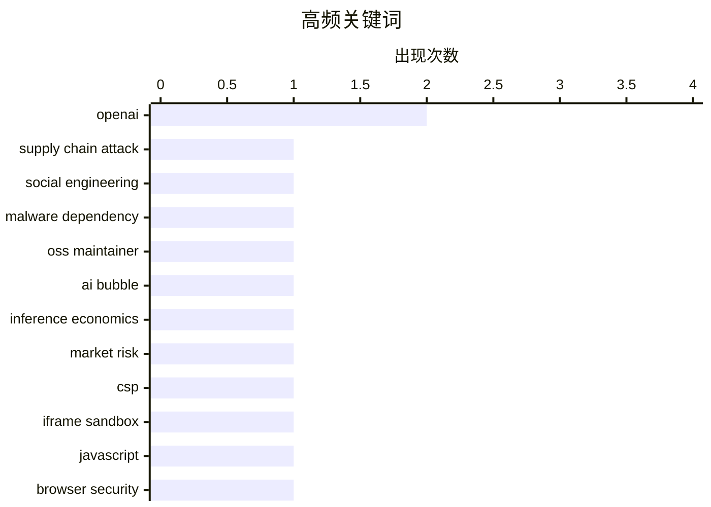

# 📰 AI 博客每日精选 — 2026-04-04

> 来自 Karpathy 推荐的 92 个顶级技术博客，AI 精选 Top 10

## 📝 今日看点

今天的技术话题明显从“系统漏洞”转向“人和叙事漏洞”：供应链攻击开始更多利用高仿真社会工程，传统防护手段（如 zip bomb 反爬）也在对抗升级中快速失效。与此同时，行业对 AI 的情绪正在降温，围绕“AI 是否大到不能倒”“超级智能如何定义”的争论，反映出资本故事与现实价值之间的重新校准。工程实践层面则延续了一个朴素结论：无论是 CSP/iframe 边界、文件复制可观测性，还是 TCP 传输细节，真正可靠的能力来自对底层机制的准确建模，而不是对工具表象的乐观假设。整体来看，技术圈正在从“增长叙事”回摆到“安全韧性与工程基本功”。

---

## 🏆 今日必读

🥇 **Axios 供应链攻击采用了针对个人的定向社会工程**

[The Axios supply chain attack used individually targeted social engineering](https://simonwillison.net/2026/Apr/3/supply-chain-social-engineering/#atom-everything) — simonwillison.net · 9 小时前 · 🔒 安全

> Axios 团队披露的复盘显示，最近一次恶意依赖发布事件的关键入口不是代码漏洞，而是对维护者个人发起的高仿真社会工程。攻击者伪装成公司创始人，克隆公司与人物形象，邀请目标进入品牌和频道设计都很逼真的 Slack 工作区，并进一步安排了 Microsoft Teams 会议。会议过程中以“系统组件过期”为由诱导安装软件，该软件实际上是 RAT（远程访问木马），随后窃取开发者凭据并被用于发布恶意包。文中还强调，这类流程与 Google 已公开记录的一类攻击路径相似，且执行专业、协同度高、迷惑性强。结论是：被广泛使用的开源项目维护者需要主动熟悉并防范这种“定向社工+会议安装诱导”的供应链攻击策略。

💡 **为什么值得读**: 它把一次真实供应链事件拆解为可复用的攻击链条，能直接提升开源维护者对高拟真社工手法的识别与防御意识。

🏷️ supply chain attack, social engineering, malware dependency, OSS maintainer

🥈 **付费版：AI 并非“大到不能倒”**

[Premium: AI Isn't Too Big To Fail](https://www.wheresyoured.at/premium-ai-isnt-too-big-to-fail/) — wheresyoured.at · 1 小时前 · 💡 观点 / 杂谈

> 文章聚焦于反驳“AI 泡沫可被历史类比合理化”以及“AI 大到不能倒”的论调。作者认为，把 OpenAI 类比 Uber、把当前数据中心建设类比 AWS 都缺乏严谨依据，并给出对比数据称 AWS 在约十年内实现盈利，2003 至 2017 年累计成本约 520 亿美元（按通胀调整）。文中进一步指出，当前没有证据证明 AI 在推理环节已具备可持续盈利能力，也缺少清晰的盈利路径说明，市场更多依赖“之后会解决”和“增长很快”的叙事。作者还强调，反方对其 AI 经济性质疑缺乏系统回应，媒体对大科技的批评也常避开融资与基础设施投入等关键脆弱点。结论是，“大到不能倒”被当作口号重复而非被论证，缺乏基于历史数据与经济现实的严密分析会误导公众和投资者。

💡 **为什么值得读**: 值得读在于它直击 AI 投资叙事中最常被默认却最少被量化论证的前提，用经济可行性与历史对比框架逼迫读者重新审视“增长即正当”的逻辑。

🏷️ AI bubble, OpenAI, inference economics, market risk

🥉 **JavaScript 能否逃逸 iframe 内的 CSP Meta 标签？**

[Can JavaScript Escape a CSP Meta Tag Inside an Iframe?](https://simonwillison.net/2026/Apr/3/test-csp-iframe-escape/#atom-everything) — simonwillison.net · 7 小时前 · 🔒 安全

> 焦点是：在 `sandbox="allow-scripts"` 的 iframe 中运行的不受信任 JavaScript，能否绕过或关闭通过 `<meta>` 设置的 CSP。测试结果显示，即使脚本尝试删除、修改该 meta 标签，或替换整个文档，也无法让脚本“逃逸”这层策略。作者在 Chromium 和 Firefox 上做了较全面测试，观察到通过 meta 声明的 CSP 在解析阶段就被应用，并且在 iframe 导航到 `data:` URI 后仍然持续生效。这个结论来自一个实际需求：在不使用独立域名托管文件的前提下，为类似 Claude Artifacts 的沙箱内容施加 CSP。可行做法是在 iframe 内容顶部注入 CSP meta 标签，后续不受信任脚本对其进行操作也不会解除限制。

💡 **为什么值得读**: 它给出了跨主流浏览器验证过的安全结论与可落地做法，直接回答了“无需独立域名时如何在沙箱 iframe 中可靠施加 CSP”这一实践问题。

🏷️ CSP, iframe sandbox, JavaScript, browser security

---

## 📊 数据概览

| 扫描源 | 抓取文章 | 时间范围 | 精选 |
|:---:|:---:|:---:|:---:|
| 87/92 | 2500 篇 → 22 篇 | 24h | **10 篇** |

### 分类分布



### 高频关键词



<details>
<summary>📈 纯文本关键词图（终端友好）</summary>

```
openai              │ ████████████████████ 2
supply chain attack │ ██████████░░░░░░░░░░ 1
social engineering  │ ██████████░░░░░░░░░░ 1
malware dependency  │ ██████████░░░░░░░░░░ 1
oss maintainer      │ ██████████░░░░░░░░░░ 1
ai bubble           │ ██████████░░░░░░░░░░ 1
inference economics │ ██████████░░░░░░░░░░ 1
market risk         │ ██████████░░░░░░░░░░ 1
csp                 │ ██████████░░░░░░░░░░ 1
iframe sandbox      │ ██████████░░░░░░░░░░ 1
```

</details>

### 🏷️ 话题标签

**openai**(2) · **supply chain attack**(1) · **social engineering**(1) · malware dependency(1) · oss maintainer(1) · ai bubble(1) · inference economics(1) · market risk(1) · csp(1) · iframe sandbox(1) · javascript(1) · browser security(1) · ai agents(1) · software engineering(1) · theory building(1) · llm(1) · windows(1) · readdirectorychangesw(1) · filesystem(1) · file monitoring(1)

---

## 💡 观点 / 杂谈

### 1. 付费版：AI 并非“大到不能倒”

[Premium: AI Isn't Too Big To Fail](https://www.wheresyoured.at/premium-ai-isnt-too-big-to-fail/) — **wheresyoured.at** · 1 小时前 · ⭐ 25/30

> 文章聚焦于反驳“AI 泡沫可被历史类比合理化”以及“AI 大到不能倒”的论调。作者认为，把 OpenAI 类比 Uber、把当前数据中心建设类比 AWS 都缺乏严谨依据，并给出对比数据称 AWS 在约十年内实现盈利，2003 至 2017 年累计成本约 520 亿美元（按通胀调整）。文中进一步指出，当前没有证据证明 AI 在推理环节已具备可持续盈利能力，也缺少清晰的盈利路径说明，市场更多依赖“之后会解决”和“增长很快”的叙事。作者还强调，反方对其 AI 经济性质疑缺乏系统回应，媒体对大科技的批评也常避开融资与基础设施投入等关键脆弱点。结论是，“大到不能倒”被当作口号重复而非被论证，缺乏基于历史数据与经济现实的严密分析会误导公众和投资者。

🏷️ AI bubble, OpenAI, inference economics, market risk

---

### 2. （使用 AI 代理）编程即理论建构

[Programming (with AI agents) as theory building](https://seangoedecke.com/programming-with-ai-agents-as-theory-building/) — **seangoedecke.com** · 23 小时前 · ⭐ 24/30

> 文章围绕“软件工程的核心产出是什么”展开，延续了 Peter Naur 在 1985 年提出的“编程即理论建构”观点：真正关键的是工程师脑中的系统理论，而代码只是副产物。文中指出，做代码修改前必须先通过阅读形成心智模型，再在模型上完成变更并落实到代码；而 LLM/AI 代理的确会让开发者在一定程度上减少对细节模型的构建，甚至可能把任务直接交给 GPT 或 Claude。作者认为这种“细节下沉”并不必然是坏事，因为任何心智模型本来就会省略部分实现层细节，历史上“技术栈广度”本就意味着在不同抽象层次间取舍。文章还强调，LLM 辅助编码反而会让人更直接体会到心智模型的重要性。结论是：AI 工具会改变理论建构的颗粒度，但不会消灭它；软件工程仍以人对系统运作的可解释理解为中心。

🏷️ AI agents, software engineering, theory building, LLM

---

### 3. 当今科技界最离谱的两件事

[The two wildest stories today in tech](https://garymarcus.substack.com/p/the-two-wildest-stories-today-in) — **garymarcus.substack.com** · 20 小时前 · ⭐ 20/30

> 文章聚焦同一天出现的两则科技新闻，并将其解读为行业叙事正在发生“改口”和“包装”。其一是微软的 Mustafa Suleyman 被指将“超级智能”的定义从“超过最聪明人类的 AI”下调为“能为数百万企业创造产品价值的模型”，作者认为这会把原本更普通的技术能力也纳入“超级智能”范畴。其二是 OpenAI 在砍掉 Sora、推迟“erotica”后，收购成立仅 18 个月的播客网络 TBPN，交易额 2.5 亿美元；文中还提到 OpenAI 今年每月亏损约 10 亿美元，以及其股票在二级市场受挫的传闻。作者据此判断，这类动作更像是在争夺叙事、转移压力，而非技术突破本身。结论是，在真正 AGI 仍“看不见”的背景下，重新定义概念和公关式叙事可能正成为部分公司可用的主要手段。

🏷️ OpenAI, Microsoft, AGI, industry narrative

---

### 4. “被动收入”陷阱吞噬了一代创业者

[The "Passive Income" trap ate a generation of entrepreneurs](https://www.joanwestenberg.com/the-passive-income-trap-ate-a-generation-of-entrepreneurs/) — **joanwestenberg.com** · 16 小时前 · ⭐ 19/30

> 文章聚焦“被动收入”叙事如何扭曲了一代潜在创业者对商业与工作的理解。作者用“玉石滚轮”代发货案例说明：从 Alibaba 以 1.20 美元进货、在 Shopify 以 29.99 美元售卖、每天投 50 美元 Facebook 广告、物流周期长达 3 到 6 周且几乎不与用户真实沟通，最终 5 个月亏损 800 美元。作者将这种现象概括为“Passive Income Brain”，认为在 2015 到 2022 年间，“被动收入”从理财术语演变成一种近似“救赎”的信念，核心目标变成“收入覆盖月支出就永久离职”。文中还指出，这一循环里真正稳定赚钱的往往是售卖“如何赚被动收入”课程的人，形成自我循环的商业闭环。作者的结论是，这套意识形态把有能力做真实业务的人引向了错误优先级：追逐“无需参与也能赚钱”的结构，而不是先解决真实产品与客户价值问题。

🏷️ entrepreneurship, passive income, dropshipping, business culture

---

## 🔒 安全

### 5. Axios 供应链攻击采用了针对个人的定向社会工程

[The Axios supply chain attack used individually targeted social engineering](https://simonwillison.net/2026/Apr/3/supply-chain-social-engineering/#atom-everything) — **simonwillison.net** · 9 小时前 · ⭐ 26/30

> Axios 团队披露的复盘显示，最近一次恶意依赖发布事件的关键入口不是代码漏洞，而是对维护者个人发起的高仿真社会工程。攻击者伪装成公司创始人，克隆公司与人物形象，邀请目标进入品牌和频道设计都很逼真的 Slack 工作区，并进一步安排了 Microsoft Teams 会议。会议过程中以“系统组件过期”为由诱导安装软件，该软件实际上是 RAT（远程访问木马），随后窃取开发者凭据并被用于发布恶意包。文中还强调，这类流程与 Google 已公开记录的一类攻击路径相似，且执行专业、协同度高、迷惑性强。结论是：被广泛使用的开源项目维护者需要主动熟悉并防范这种“定向社工+会议安装诱导”的供应链攻击策略。

🏷️ supply chain attack, social engineering, malware dependency, OSS maintainer

---

### 6. JavaScript 能否逃逸 iframe 内的 CSP Meta 标签？

[Can JavaScript Escape a CSP Meta Tag Inside an Iframe?](https://simonwillison.net/2026/Apr/3/test-csp-iframe-escape/#atom-everything) — **simonwillison.net** · 7 小时前 · ⭐ 24/30

> 焦点是：在 `sandbox="allow-scripts"` 的 iframe 中运行的不受信任 JavaScript，能否绕过或关闭通过 `<meta>` 设置的 CSP。测试结果显示，即使脚本尝试删除、修改该 meta 标签，或替换整个文档，也无法让脚本“逃逸”这层策略。作者在 Chromium 和 Firefox 上做了较全面测试，观察到通过 meta 声明的 CSP 在解析阶段就被应用，并且在 iframe 导航到 `data:` URI 后仍然持续生效。这个结论来自一个实际需求：在不使用独立域名托管文件的前提下，为类似 Claude Artifacts 的沙箱内容施加 CSP。可行做法是在 iframe 内容顶部注入 CSP meta 标签，后续不受信任脚本对其进行操作也不会解除限制。

🏷️ CSP, iframe sandbox, JavaScript, browser security

---

### 7. 我的 Zip 炸弹策略已不如从前有效

[My Zip bomb strategy is not as effective as it used to be](https://idiallo.com/blog/zip-bombs-are-not-as-effective-as-they-used-to-be?src=feed) — **idiallo.com** · 11 小时前 · ⭐ 22/30

> 作者复盘了自己用 zip bomb 对抗恶意爬虫的防护方案为何在近况下失效。其做法是对黑名单或恶意请求返回带 gzip 头的大体积压缩文件，过去对“低级”机器人有效：命中陷阱后同一 IP 往往会立刻停止请求。如今更复杂的机器人能够识别或绕过 zip bomb，甚至在失败后持续重试，导致服务器反复发送大文件，防御反而变成对自身资源的消耗。文章给出具体运行环境与压力背景：1GB 内存的 DigitalOcean 主机、Apache+PHP 处理、以及每秒高频请求下的大文件传输瓶颈，最终表现为服务无响应、带宽被吃光、垃圾订阅与评论激增。作者的结论是，zip bomb 从来不是万无一失的方法，在当前更智能的机器人环境里单独依赖它已不再可靠，必须调整策略。

🏷️ zip bomb, bot mitigation, server defense, web scraping

---

## ⚙️ 工程

### 8. 如何使用 ReadDirectoryChangesW 来判断是否有人把文件从目录中复制出去？

[How can I use ReadDirectoryChangesW to know when someone is copying a file out of the directory?](https://devblogs.microsoft.com/oldnewthing/20260403-00/?p=112202) — **devblogs.microsoft.com/oldnewthing** · 9 小时前 · ⭐ 23/30

> ReadDirectoryChangesW 无法可靠回答“文件是否被复制”这个语义问题，因为它只监控会反映在目录列表上的文件系统变化。将复制行为与 FILE_NOTIFY_CHANGE_LAST_ACCESS 关联并不成立：该通知可能延迟（例如每小时一次）且会被与复制无关的操作触发，同时某些读取场景还可能因关闭访问时间更新而完全不触发。文件系统层面只能看到读写等基础操作，看不到用户意图，因此“读取完整文件”既可能是编辑前加载，也可能是复制。理论上可在文件关闭后比对读写内容或做哈希匹配，但成本高，而且用户常通过“打开后另存为”完成复制，结果可能功能等价却非字节级一致，导致哈希检测不稳定。结论是若目标是识别或阻止“复制”这类高层行为，需要在更高层实施策略，如给文件加安全标签并依赖数据分类/策略执行体系，而不是依赖 ReadDirectoryChangesW 本身。

🏷️ Windows, ReadDirectoryChangesW, filesystem, file monitoring

---

### 9. 卡在 13 kB

[Loading... [13 kB]](https://maurycyz.com/misc/13kb/) — **maurycyz.com** · 23 小时前 · ⭐ 20/30

> 作者在测试自己的 Gopher 客户端时发现下载会在 13 kB 处短暂停住，因而追溯这一现象背后的 TCP 传输机制。文章先解释了分组网络的基本现实：数据包可能乱序或丢失，因此接收端通过 ACK（确认号）告知期望的下一个序号，发送端据此重传缺失数据，并可在出现重复 ACK 时提前重传。文中用 "Hello, World!" 的拆分示例说明了乱序重组与丢包恢复过程，同时指出严格来说 TCP 按字节编号而非按包编号。接着讨论拥塞风险：网络过载会触发丢包与重传的正反馈，历史上曾造成严重问题。为避免拥塞失控，TCP 通过拥塞窗口限制未确认数据量，并在慢启动阶段从 10 个包起步，随连续 ACK 按轮次快速增大，直到观察到丢包为止。

🏷️ TCP, packet loss, networking, protocols

---

## 🛠 工具 / 开源

### 10. 破折号：重回流行了吗？

[Em Dashes: Back In Style?](https://feed.tedium.co/link/15204/17312777/emdash-cloudflare-wordpress-competitor) — **tedium.co** · 19 小时前 · ⭐ 20/30

> Cloudflare 推出新内容管理工具 EmDash，瞄准的是把老旧、脆弱且不安全的 WordPress 博客迁移到 Astro 的需求。文中认为 WordPress 在技术层面已被很多新方案超越，但大量历史站点仍在运行，且迁移与重构成本高、过程困难。EmDash 的方案结合了 Astro（静态站点生成与 React 式交互能力）和 Cloudflare Workers，同时在公开界面上保持类似 WordPress 的使用体验，被描述为一种“WordPress 的精神继任者”。作者以自己维护大量历史博文（约 16,000 篇）的经验说明现实痛点：继续维护老 WordPress 对多数人并不现实，迁移又常常工作量巨大。整体观点是，如果能把这类老站点转为依赖更少插件的静态化形态，将有助于它们继续留在互联网上。

🏷️ Cloudflare, WordPress, CMS, EmDash

---

*生成于 2026-04-04 07:05 | 扫描 87 源 → 获取 2500 篇 → 精选 10 篇*
*基于 [Hacker News Popularity Contest 2025](https://refactoringenglish.com/tools/hn-popularity/) RSS 源列表*
