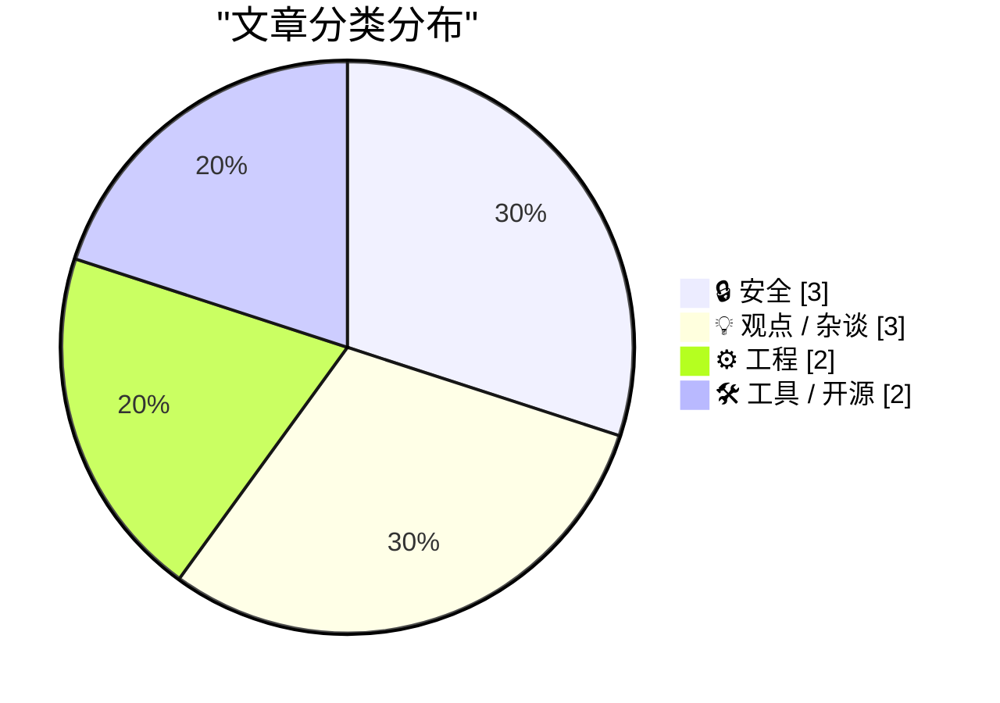
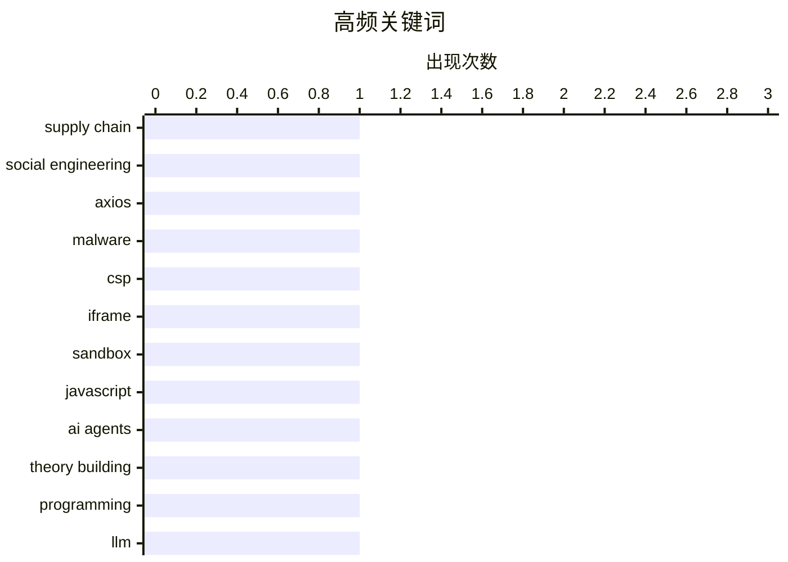

# 📰 AI 博客每日精选 — 2026-04-04

> 来自 Karpathy 推荐的 92 个顶级技术博客，AI 精选 Top 10

## 📝 今日看点

今天技术圈最突出的主线，是“安全威胁从技术漏洞转向人和流程”：从 Axios 供应链事件中的定向社工，到对 iframe CSP 边界与 zip bomb 失效的复盘，都在提醒防线必须覆盖组织协作与攻防策略更新。第二个趋势是工程认知在升级，讨论不再停留于“代码怎么写”，而是转向“工程师与 AI 代理如何共同构建系统理论”，强调心智模型才是长期资产。与此同时，开发者生态呈现明显的“复古与重构并行”——一边是自建拨号 ISP、包管理器彩蛋这类怀旧实践回潮，另一边是 Cloudflare 借 Astro 重做内容基础设施，反映出工具链正朝着更可控、更可迁移演进。整体看，行业正在从“追新功能”转向“重建可信性、可理解性与可持续性”。

---

## 🏆 今日必读

🥇 **Axios 供应链攻击采用了针对个人的社会工程学**

[The Axios supply chain attack used individually targeted social engineering](https://simonwillison.net/2026/Apr/3/supply-chain-social-engineering/#atom-everything) — simonwillison.net · 5 小时前 · 🔒 安全

> Axios 团队复盘了一次供应链攻击：恶意依赖被发布到正式版本，入口是对一名维护者的定向社会工程学。攻击者伪装成公司创始人，克隆公司与人物形象，先把目标拉入品牌化且组织完善的 Slack 工作区，再安排看似正常的 Microsoft Teams 会议。会议中以“系统组件过期”为由诱导安装软件，实际安装的是 RAT（远程访问木马），随后窃取开发者凭证并用于发布恶意包。复盘还指出这一手法与 Google 披露过的相关社工攻击路径相似，且整套流程高度协调、外观专业、极具迷惑性。结论是：开源项目维护者，尤其是被广泛依赖的维护者，需要把这类“会议场景下的软件安装诱导”当作高风险攻击模式来防范。

💡 **为什么值得读**: 它把一次真实供应链事件拆解到具体操作细节，能直接提升维护者对“看起来很正规”的定向社工攻击的识别与防护意识。

🏷️ supply chain, social engineering, Axios, malware

🥈 **JavaScript 能否逃逸 iframe 内的 CSP Meta 标签？**

[Can JavaScript Escape a CSP Meta Tag Inside an Iframe?](https://simonwillison.net/2026/Apr/3/test-csp-iframe-escape/#atom-everything) — simonwillison.net · 2 小时前 · 🔒 安全

> 文章聚焦于在 `sandbox="allow-scripts"` 的 iframe 中，不可信 JavaScript 是否能绕过或关闭通过 `meta` 标签设置的 CSP。测试结果显示，即使脚本尝试删除、修改该 `meta` 标签，或替换整个文档，也无法使这条 CSP 失效。作者在 Chromium 和 Firefox 上进行了广泛验证，并指出这类由 `meta` 定义的 CSP 会在解析阶段生效。即便 iframe 被导航到 `data:` URI，策略仍然持续生效。结论是：在不使用独立域名托管文件的前提下，可通过在 iframe 内容顶部注入 CSP `meta` 标签来约束后续不可信脚本。

💡 **为什么值得读**: 它直接回答了前端沙箱隔离中的一个关键安全问题，并给出跨浏览器验证过、可落地的 CSP 防护做法。

🏷️ CSP, iframe, sandbox, JavaScript

🥉 **将编程（结合 AI 代理）视为理论构建**

[Programming (with AI agents) as theory building](https://seangoedecke.com/programming-with-ai-agents-as-theory-building/) — seangoedecke.com · 19 小时前 · 💡 观点 / 杂谈

> 文章围绕“软件工程的核心产出究竟是代码，还是工程师头脑中的系统理论”展开，并将这一观点延伸到 AI 代理辅助编程场景。作者援引 Peter Naur 的“Programming as Theory Building”，认为代码修改先依赖于建立心智模型，再把模型变化映射到代码实现。文中承认 LLM/AI 代理确实会让开发者构建更少细节的心智模型，甚至可能把部分任务直接外包给模型，这与现有关于 AI 影响学习的早期观察一致。作者同时指出，心智模型本来就不可能涵盖所有层级细节，历史上“技术栈广度”本身就意味着在抽象层面取舍，因此减少部分实现细节并不必然等于失去对系统的理解。结论是：AI 工具会改变理论构建的细粒度，但不会消除理论构建本身；有效的软件工作仍然依赖开发者对系统运行方式的心智把握。

💡 **为什么值得读**: 它把“AI 会不会削弱程序员能力”这类争论落到可操作的“心智模型粒度”问题上，能帮助你更清晰地判断在 AI 编程中哪些理解必须亲自掌握、哪些细节可以有意识地下放给工具。

🏷️ AI agents, theory building, programming, LLM

---

## 📊 数据概览

| 扫描源 | 抓取文章 | 时间范围 | 精选 |
|:---:|:---:|:---:|:---:|
| 88/92 | 2510 篇 → 21 篇 | 24h | **10 篇** |

### 分类分布



### 高频关键词



<details>
<summary>📈 纯文本关键词图（终端友好）</summary>

```
supply chain       │ ████████████████████ 1
social engineering │ ████████████████████ 1
axios              │ ████████████████████ 1
malware            │ ████████████████████ 1
csp                │ ████████████████████ 1
iframe             │ ████████████████████ 1
sandbox            │ ████████████████████ 1
javascript         │ ████████████████████ 1
ai agents          │ ████████████████████ 1
theory building    │ ████████████████████ 1
```

</details>

### 🏷️ 话题标签

**supply chain**(1) · **social engineering**(1) · **axios**(1) · malware(1) · csp(1) · iframe(1) · sandbox(1) · javascript(1) · ai agents(1) · theory building(1) · programming(1) · llm(1) · windows api(1) · readdirectorychangesw(1) · filesystem(1) · file monitoring(1) · zipbomb(1) · bot mitigation(1) · server defense(1) · abuse prevention(1)

---

## 🔒 安全

### 1. Axios 供应链攻击采用了针对个人的社会工程学

[The Axios supply chain attack used individually targeted social engineering](https://simonwillison.net/2026/Apr/3/supply-chain-social-engineering/#atom-everything) — **simonwillison.net** · 5 小时前 · ⭐ 26/30

> Axios 团队复盘了一次供应链攻击：恶意依赖被发布到正式版本，入口是对一名维护者的定向社会工程学。攻击者伪装成公司创始人，克隆公司与人物形象，先把目标拉入品牌化且组织完善的 Slack 工作区，再安排看似正常的 Microsoft Teams 会议。会议中以“系统组件过期”为由诱导安装软件，实际安装的是 RAT（远程访问木马），随后窃取开发者凭证并用于发布恶意包。复盘还指出这一手法与 Google 披露过的相关社工攻击路径相似，且整套流程高度协调、外观专业、极具迷惑性。结论是：开源项目维护者，尤其是被广泛依赖的维护者，需要把这类“会议场景下的软件安装诱导”当作高风险攻击模式来防范。

🏷️ supply chain, social engineering, Axios, malware

---

### 2. JavaScript 能否逃逸 iframe 内的 CSP Meta 标签？

[Can JavaScript Escape a CSP Meta Tag Inside an Iframe?](https://simonwillison.net/2026/Apr/3/test-csp-iframe-escape/#atom-everything) — **simonwillison.net** · 2 小时前 · ⭐ 24/30

> 文章聚焦于在 `sandbox="allow-scripts"` 的 iframe 中，不可信 JavaScript 是否能绕过或关闭通过 `meta` 标签设置的 CSP。测试结果显示，即使脚本尝试删除、修改该 `meta` 标签，或替换整个文档，也无法使这条 CSP 失效。作者在 Chromium 和 Firefox 上进行了广泛验证，并指出这类由 `meta` 定义的 CSP 会在解析阶段生效。即便 iframe 被导航到 `data:` URI，策略仍然持续生效。结论是：在不使用独立域名托管文件的前提下，可通过在 iframe 内容顶部注入 CSP `meta` 标签来约束后续不可信脚本。

🏷️ CSP, iframe, sandbox, JavaScript

---

### 3. Zip 炸弹已不再像过去那样有效

[Zipbombs are not as effective as they used to be](https://idiallo.com/blog/zip-bombs-are-not-as-effective-as-they-used-to-be?src=feed) — **idiallo.com** · 7 小时前 · ⭐ 21/30

> 作者复盘了自己用 zip bomb 反制恶意爬虫的防护策略为何开始失效：过去能让低级爬虫在命中陷阱后立即停止请求，但现在效果明显下降。其方案是对黑名单 IP 或可疑请求返回 gzip 编码的大体积压缩文件（代码中标注为 10G 文件，响应长度示例为 10 MB），早期这在一台基础 DigitalOcean 小服务器上可承受并有效阻断高频抓取。变化在于更“聪明”的机器人会识别或容忍这类响应，失败后持续重试，导致服务器反复发送大文件，防御机制反而放大了带宽与可用性压力。作者描述了连带后果：攻击期间服务不响应、请求丢弃、月度带宽被消耗，以及垃圾邮件订阅和评论激增；日志分析后确认了这一模式并进行了修复。核心结论是，zip bomb 对低级机器人仍可能有用，但面对更复杂的 AI 驱动爬虫时，它可能从防护手段变成自我 DDoS 的诱因。

🏷️ zipbomb, bot mitigation, server defense, abuse prevention

---

## 💡 观点 / 杂谈

### 4. 将编程（结合 AI 代理）视为理论构建

[Programming (with AI agents) as theory building](https://seangoedecke.com/programming-with-ai-agents-as-theory-building/) — **seangoedecke.com** · 19 小时前 · ⭐ 23/30

> 文章围绕“软件工程的核心产出究竟是代码，还是工程师头脑中的系统理论”展开，并将这一观点延伸到 AI 代理辅助编程场景。作者援引 Peter Naur 的“Programming as Theory Building”，认为代码修改先依赖于建立心智模型，再把模型变化映射到代码实现。文中承认 LLM/AI 代理确实会让开发者构建更少细节的心智模型，甚至可能把部分任务直接外包给模型，这与现有关于 AI 影响学习的早期观察一致。作者同时指出，心智模型本来就不可能涵盖所有层级细节，历史上“技术栈广度”本身就意味着在抽象层面取舍，因此减少部分实现细节并不必然等于失去对系统的理解。结论是：AI 工具会改变理论构建的细粒度，但不会消除理论构建本身；有效的软件工作仍然依赖开发者对系统运行方式的心智把握。

🏷️ AI agents, theory building, programming, LLM

---

### 5. 当今科技界最离谱的两则新闻

[The two wildest stories today in tech](https://garymarcus.substack.com/p/the-two-wildest-stories-today-in) — **garymarcus.substack.com** · 16 小时前 · ⭐ 18/30

> 文章聚焦同一天出现的两则科技新闻，质疑行业在 AGI 进展不明时通过“改定义”和“控叙事”来重塑公众认知。文中称微软的 Mustafa Suleyman 将“超级智能”从“比最聪明人类更聪明的 AI”改写为“能够为数百万企业提供产品价值的模型”，并讽刺这种口径会让手机和 Microsoft Word 也显得“超级智能”。另一则是 OpenAI 以 2.5 亿美元收购仅成立 18 个月的播客网络 TBPN；文章同时提到 OpenAI 刚终止 Sora、推迟“erotica”项目，以及其每月约 10 亿美元亏损和二级市场股票受冷落的传闻。作者将这笔收购解读为高成本的叙事管理动作，意在转移外界对经营压力的注意力。最终观点是，在真正 AGI 仍“无迹可寻”的背景下，定义漂移与公关包装正在取代实质性技术突破。

🏷️ OpenAI, Microsoft, superintelligence, AI hype

---

### 6. “被动收入”陷阱吞噬了一代创业者

[The "Passive Income" trap ate a generation of entrepreneurs](https://www.joanwestenberg.com/the-passive-income-trap-ate-a-generation-of-entrepreneurs/) — **joanwestenberg.com** · 12 小时前 · ⭐ 17/30

> 文章批评了 2015 到 2022 年间“被动收入”叙事如何重塑了大量潜在创业者对工作与商业的理解。作者用一个做玉石脸部滚轮代发货的案例说明这种路径：从 Alibaba 以 1.20 美元进货，在 Shopify 以 29.99 美元售卖，依赖“爆款趋势”和 Facebook 广告投放（50 美元/天），却不理解产品、不接触用户，5 个月后仍亏损 800 美元。文中认为，很多人追逐的并非产品价值或客户问题，而是“搭系统就能躺赚”的结构幻觉，把创业简化为无需持续投入的现金机器。作者还指出，真正稳定获利的往往是售卖“如何获得被动收入”课程的人，这让整个生态变成自我循环的营销闭环。

🏷️ passive income, dropshipping, entrepreneurship, creator economy

---

## ⚙️ 工程

### 7. 如何使用 ReadDirectoryChangesW 知道有人正把文件从目录里复制出去？

[How can I use ReadDirectoryChangesW to know when someone is copying a file out of the directory?](https://devblogs.microsoft.com/oldnewthing/20260403-00/?p=112202) — **devblogs.microsoft.com/oldnewthing** · 5 小时前 · ⭐ 22/30

> ReadDirectoryChangesW/FindFirstChangeNotification 的定位是监测会反映在目录列表中的文件系统变更，而不是直接识别“复制文件”这一用户意图。客户看到的 FILE_NOTIFY_CHANGE_LAST_ACCESS 每小时才出现且会误报到非复制操作，原因是最后访问时间更新可能被延迟或被抑制，且很多读操作并不会触发可见的目录项变化。文件系统层只能看到“读/写”等基础操作，无法判断读取整文件究竟是为了编辑、查看还是复制。理论上可在文件关闭后做读写关联或哈希比对来推断复制，但代价高且效果有限；用户常见的“打开后另存为”会产生功能等价但字节不完全一致的文件，导致哈希检测不可靠。要检测或阻止文件“被复制”，应上移到更高层方案，如数据分类与安全标签，并由能理解并执行标签策略的应用协同完成控制。

🏷️ Windows API, ReadDirectoryChangesW, filesystem, file monitoring

---

### 8. 用树莓派搭建你自己的拨号 ISP

[Build your own Dial-up ISP with a Raspberry Pi](https://www.jeffgeerling.com/blog/2026/build-your-own-dial-up-isp-with-a-raspberry-pi/) — **jeffgeerling.com** · 5 小时前 · ⭐ 20/30

> 作者围绕“在本地复刻拨号上网体验”展开实践，目标是让老款 iBook G3 通过 56K 拨号方式接入自建 ISP，并与 802.11b 时代的 Wi‑Fi 场景结合。硬件方案由树莓派（Pi 3/4/5）、Viking DLE-200B 双向电话线模拟器和 StarTech 56K USB 拨号猫组成，通过电话线模拟器把“ISP 端调制解调器”和“客户端电脑”连接起来。文中强调 POTS（传统电话系统）不能直接把两个调制解调器互插，必须借助电话线模拟设备；同时给出将 DLE-200B 的第 3 号拨码开关拨到 UP 以降低音量、改善速率的实操细节。软件侧在树莓派上使用 mgetty 与 PPP：mgetty 负责处理来电并与远端调制解调器协商，连接建立后再交给 PPP。整体结论是，这一组合能在本地重建可用的拨号 ISP 环境，并把 1999 年前后的无线与拨号网络体验真正跑起来。

🏷️ Raspberry Pi, dial-up, Wi-Fi, retro computing

---

## 🛠 工具 / 开源

### 9. 长破折号：重回潮流？

[Em Dashes: Back In Style?](https://feed.tedium.co/link/15204/17312777/emdash-cloudflare-wordpress-competitor) — **tedium.co** · 15 小时前 · ⭐ 20/30

> Cloudflare 推出 EmDash，试图把老旧且不稳定的 WordPress 博客迁移到 Astro，并借此重新争取开发者。方案核心是结合 Astro（兼具静态站点生成与 React 风格交互）和 Cloudflare Workers，同时在对外使用体验上保持类似 WordPress 的形态。作者以自己运营 ShortFormBlog 的经历说明现实痛点：历史站点迁移困难、旧 WordPress 维护成本高，尤其在拥有约 1.6 万篇存档时几乎难以承受。文中强调，尽管技术上行业已在很多方面超越 WordPress，但大量旧站点仍长期存在，导致“难迁移”成为持续问题。相较继续维护老旧动态站点，作者认为更可行的方向是产出静态化结果并尽量减少插件依赖，EmDash 正是在这个背景下出现的路径。

🏷️ Cloudflare, WordPress, CMS, EmDash

---

### 10. 包管理器里的彩蛋

[Package Manager Easter Eggs](https://nesbitt.io/2026/04/03/package-manager-easter-eggs.html) — **nesbitt.io** · 9 小时前 · ⭐ 18/30

> 内容梳理了多个包管理器中长期存在的“彩蛋”传统及其演化。APT 系列里有经典的 `apt-get moo` 和 “Super Cow Powers”，`aptitude moo` 还会随 `-v` 增加给出分阶段回应，并引用《小王子》里的“蛇吞象”意象；openSUSE 的 `zypper moo` 与 Gentoo 的 `emerge --moo` 也延续了类似趣味输出。Arch Linux 的 pacman 可通过 `ILoveCandy` 将安装进度条变成吃豆人动画，Gentoo 也独立出现了同名 `candy` 特性用于替换默认动画。npm 曾提供 `xmas`、`visnup`、`substack`、`ham-it-up` 等彩蛋或致敬功能，但这些在 npm v9 已移除；`npm rum dev` 则是 `run-script` 别名带来的“意外梗”。文中最具争议的是 npm 代码库里曾出现一个未文档化且经混淆的 `birthday` 命令，会执行外部 npm 包代码并返回生日倒计时，这种形态因难与供应链攻击区分而引发社区警惕。

🏷️ package managers, Easter eggs, apt, developer culture

---

*生成于 2026-04-04 03:02 | 扫描 88 源 → 获取 2510 篇 → 精选 10 篇*
*基于 [Hacker News Popularity Contest 2025](https://refactoringenglish.com/tools/hn-popularity/) RSS 源列表*
