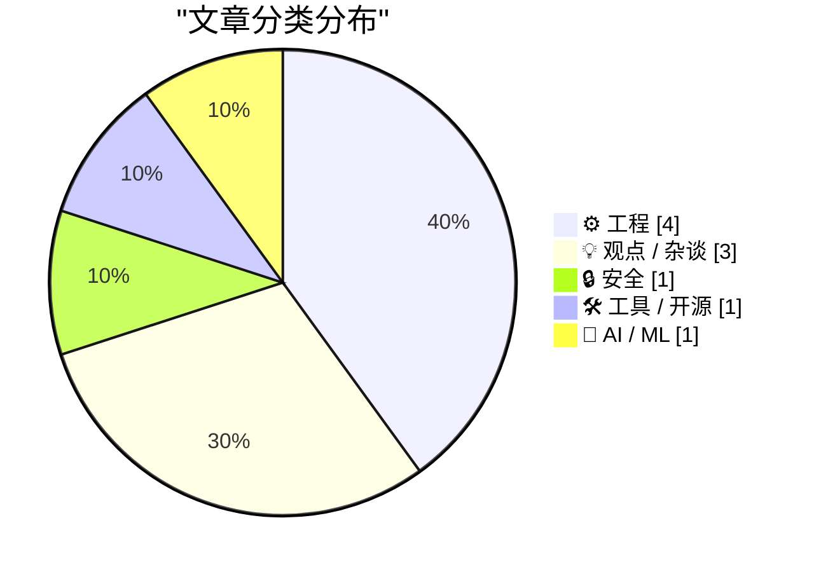
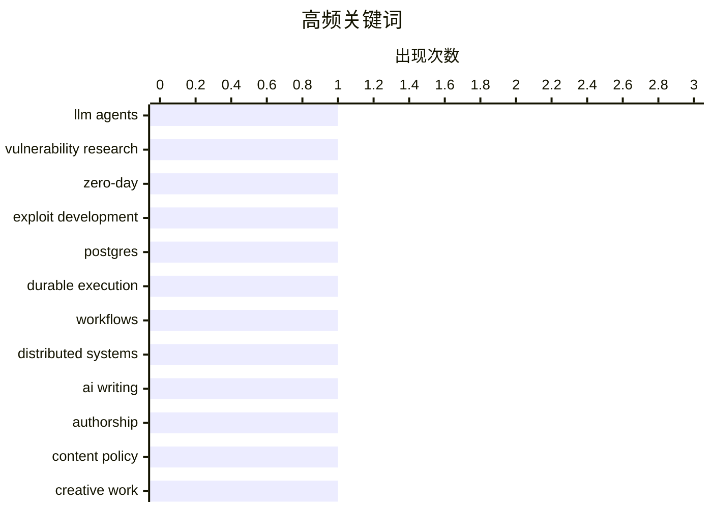

# 📰 AI 博客每日精选 — 2026-04-05

> 来自 Karpathy 推荐的 92 个顶级技术博客，AI 精选 Top 10

## 📝 今日看点

今天技术圈的主线很清晰：AI 正在从“工具辅助”跃迁为“能力重构”，无论是漏洞研究、代码生成还是模型训练实验，都显示出生产力与攻击/防御范式将被快速改写。与此同时，工程实践明显回归“少即是多”——从基于 Postgres 的轻架构落地，到编译优化与统计递推这类基础方法论再受关注，体现出对可维护性与效率的务实追求。另一条并行趋势是技术话语权之争升温：围绕“AI 写作”与“开源”定义的公共争论，以及欧美科技博弈中的政策信号，都在提醒我们，未来竞争不仅在算力和代码，也在规则解释权。

---

## 🏆 今日必读

🥇 **漏洞研究已经“熟透了”**

[Vulnerability Research Is Cooked](https://simonwillison.net/2026/Apr/3/vulnerability-research-is-cooked/#atom-everything) — simonwillison.net · 23 小时前 · 🔒 安全

> 主题聚焦于前沿大模型对漏洞研究与漏洞利用开发的“突然且巨大”的影响。文中引用 Thomas Ptacek 的判断，认为未来几个月内，编码代理会显著改写漏洞利用开发的实践方式和经济结构，而且能力提升更像“阶跃式”而非缓慢演进。其关键机制被归因为三点：模型参数中预置的大规模代码相关知识、对漏洞模式（如 stale pointers、integer mishandling、type confusion、allocator grooming 等）的匹配能力，以及可持续进行成功/失败试验的暴力搜索能力。文章还强调，漏洞发现本质上是“漏洞类别模式匹配 + 可达性与可利用性约束求解”的隐式搜索问题，这与 LLM 代理擅长的问题类型高度一致。结论是，高影响力漏洞研究中相当大的一部分（甚至可能是大多数）将可通过“让代理对源码树执行 find me zero days”这类方式完成。

💡 **为什么值得读**: 它把“AI 会改变安全研究”从泛泛判断落到了具体任务结构与能力匹配上，能帮助安全从业者快速判断技术拐点是否已到来。

🏷️ LLM agents, vulnerability research, zero-day, exploit development

🥈 **生产环境中的 Absurd**

[Absurd In Production](https://lucumr.pocoo.org/2026/4/4/absurd-in-production/) — lucumr.pocoo.org · 23 小时前 · ⚙️ 工程

> 文章聚焦于 Absurd 这个仅基于 Postgres 的持久化执行系统在上线约五个月后的真实生产表现。该系统仍保持“单个 SQL 文件（absurd.sql）+ 轻量 SDK”的架构，核心能力包括任务分步检查点、失败后从最近完成步骤重试、等待外部事件以及长时间挂起，当前 SDK 覆盖 TypeScript、Python 和实验性的 Go。过去几个月的迭代主要围绕生产可靠性增强：包括 claim 处理加固、异常 worker 的 watchdog 终止、死锁预防、租约管理和事件竞争条件等边界问题修复。功能上新增了 beginStep()/completeStep() 以支持可检查步骤状态的条件逻辑与有意失败建模，并补上任务结果获取/等待能力，使父子任务编排更可用；同时完善了 absurdctl CLI，可执行 schema 初始化、迁移、队列管理、任务触发、事件发送与失败重试。整体结论是这套设计在生产中经受住了考验，开发与运维体验良好，且获得了他人的正向反馈。

💡 **为什么值得读**: 如果你在评估“无需额外编排服务、仅靠 Postgres 实现 durable workflow”的可行性，这篇复盘给出了从架构到生产坑位与工具链演进的直接一手经验。

🏷️ Postgres, durable execution, workflows, distributed systems

🥉 **围猎 AI 写作毫无意义**

[The AI writing witchhunt is pointless.](https://www.joanwestenberg.com/the-ai-writing-witchhunt-is-pointless/) — joanwestenberg.com · 11 小时前 · 💡 观点 / 杂谈

> 文章聚焦“AI 写作审判”现象，质疑公众和平台在证据不足时对作者进行集体指控与惩罚的合理性。作者先用大仲马与合作者马凯的历史案例说明：文学创作长期存在协作、代笔与署名不完全对应的现实，作者身份并不总是由单一写作过程决定。随后以 2025 年小说《Shy Girl》争议为例，梳理其从网络质疑扩散到平台下架、发行取消的过程，并指出外界实际上并不掌握可被确认的事实。文章强调当前常用 AI 检测方法与工具并不可靠，连 OpenAI 自家的分类器都曾在 2023 年上线后很快下线，公开原因包括识别准确性不足（仅 26%）。结论是：在检测技术不可信、事实不清的前提下，围绕“是否 AI 写作”的道德围猎会制造伤害，却无法提供公正判断。

💡 **为什么值得读**: 它把“技术检测不可靠”与“网络舆论定罪过快”放在同一框架里，能帮助你更清醒地看待当下关于 AI 写作真伪的争议。

🏷️ AI writing, authorship, content policy, creative work

---

## 📊 数据概览

| 扫描源 | 抓取文章 | 时间范围 | 精选 |
|:---:|:---:|:---:|:---:|
| 89/92 | 2535 篇 → 13 篇 | 24h | **10 篇** |

### 分类分布



### 高频关键词



<details>
<summary>📈 纯文本关键词图（终端友好）</summary>

```
llm agents             │ ████████████████████ 1
vulnerability research │ ████████████████████ 1
zero-day               │ ████████████████████ 1
exploit development    │ ████████████████████ 1
postgres               │ ████████████████████ 1
durable execution      │ ████████████████████ 1
workflows              │ ████████████████████ 1
distributed systems    │ ████████████████████ 1
ai writing             │ ████████████████████ 1
authorship             │ ████████████████████ 1
```

</details>

### 🏷️ 话题标签

**llm agents**(1) · **vulnerability research**(1) · **zero-day**(1) · exploit development(1) · postgres(1) · durable execution(1) · workflows(1) · distributed systems(1) · ai writing(1) · authorship(1) · content policy(1) · creative work(1) · open source(1) · licensing(1) · business model(1) · software governance(1) · self-hosting(1) · decentralized-web(1) · web-console(1) · release-notes(1)

---

## ⚙️ 工程

### 1. 生产环境中的 Absurd

[Absurd In Production](https://lucumr.pocoo.org/2026/4/4/absurd-in-production/) — **lucumr.pocoo.org** · 23 小时前 · ⭐ 24/30

> 文章聚焦于 Absurd 这个仅基于 Postgres 的持久化执行系统在上线约五个月后的真实生产表现。该系统仍保持“单个 SQL 文件（absurd.sql）+ 轻量 SDK”的架构，核心能力包括任务分步检查点、失败后从最近完成步骤重试、等待外部事件以及长时间挂起，当前 SDK 覆盖 TypeScript、Python 和实验性的 Go。过去几个月的迭代主要围绕生产可靠性增强：包括 claim 处理加固、异常 worker 的 watchdog 终止、死锁预防、租约管理和事件竞争条件等边界问题修复。功能上新增了 beginStep()/completeStep() 以支持可检查步骤状态的条件逻辑与有意失败建模，并补上任务结果获取/等待能力，使父子任务编排更可用；同时完善了 absurdctl CLI，可执行 schema 初始化、迁移、队列管理、任务触发、事件发送与失败重试。整体结论是这套设计在生产中经受住了考验，开发与运维体验良好，且获得了他人的正向反馈。

🏷️ Postgres, durable execution, workflows, distributed systems

---

### 2. 值编号

[Value numbering](https://bernsteinbear.com/blog/value-numbering/?utm_source=rss) — **bernsteinbear.com** · 23 小时前 · ⭐ 21/30

> 文章围绕编译器中的 value numbering（值编号）展开，讨论如何在 SSA 形式下识别运行时必然相等的值并复用计算结果。文中先用 SSA 示例说明“文本相似但值不同”的情况（如两次 x+1 在不同状态下分别得到 1 和 2），再引入 SSA 中“真正等价”的指令场景。通过扩展示例（v3 = v0 + 1 与 v1 等价），展示了可将重复计算改写为赋值/标识指令，再配合 copy propagation 清理，最终减少冗余指令。实现层面提到常见做法是对 IR 指令做哈希并在哈希冲突时再做相等性比较，即 hash-consing；同时引用了 Maxine VM 中二元操作的 valueNumber 与 valueEqual 设计思路。核心观点是：SSA 降低了状态干扰，而值编号进一步把“可证明等价”的表达式系统化复用，从而支撑公共子表达式消除。

🏷️ compiler, SSA, value-numbering, optimization

---

### 3. 引用 Kyle Daigle 的话

[Quoting Kyle Daigle](https://simonwillison.net/2026/Apr/4/kyle-daigle/#atom-everything) — **simonwillison.net** · 20 小时前 · ⭐ 19/30

> GitHub 平台活动正在快速上升，核心信号来自提交量与 GitHub Actions 使用时长的同步增长。2025 年 GitHub 总提交量达到 10 亿次，而当前已达到每周 2.75 亿次提交；按线性增长估算，全年可能达到 140 亿次（同时明确提示这种线性外推未必成立）。GitHub Actions 也从 2023 年每周 5 亿分钟，增长到 2025 年每周 10 亿分钟，并在当周达到 21 亿分钟。内容以 GitHub COO Kyle Daigle 的数据引述为主，由 Simon Willison 于 2026 年 4 月 4 日整理发布。整体传达的是：代码协作与自动化流水线负载都在显著放大，平台进入更高强度的增长阶段。

🏷️ GitHub, commits, GitHub Actions, developer activity

---

### 4. 卡尔曼与贝叶斯的平均成绩更新

[Kalman and Bayes average grades](https://www.johndcook.com/blog/2026/04/04/kalman-bayes/) — **johndcook.com** · 8 小时前 · ⭐ 18/30

> 核心问题是如何在已知前 n 次等权成绩平均值 m 的情况下，用最少信息更新加入新成绩后的平均值。文中给出递推公式：新均值 m′ = (nm + x_{n+1})/(n+1)，因此只需保存当前平均值 m 和样本数 n，无需保留全部历史分数。该更新可写成加权平均 m′ = w1 m + w2 x_{n+1}，其中 w1 = n/(n+1)、w2 = 1/(n+1)，说明新均值是旧均值与新观测的折中。进一步写成 m′ = m + (x_{n+1}-m)/(n+1) = m + KΔ，其中 K = 1/(n+1)、Δ = x_{n+1}-m，对应卡尔曼滤波里的增益与创新项。结论是，最简单的平均分递推同时可被理解为贝叶斯后验期望更新和卡尔曼滤波的一步状态修正。

🏷️ Bayesian statistics, Kalman filter, incremental average, estimation

---

## 💡 观点 / 杂谈

### 5. 围猎 AI 写作毫无意义

[The AI writing witchhunt is pointless.](https://www.joanwestenberg.com/the-ai-writing-witchhunt-is-pointless/) — **joanwestenberg.com** · 11 小时前 · ⭐ 22/30

> 文章聚焦“AI 写作审判”现象，质疑公众和平台在证据不足时对作者进行集体指控与惩罚的合理性。作者先用大仲马与合作者马凯的历史案例说明：文学创作长期存在协作、代笔与署名不完全对应的现实，作者身份并不总是由单一写作过程决定。随后以 2025 年小说《Shy Girl》争议为例，梳理其从网络质疑扩散到平台下架、发行取消的过程，并指出外界实际上并不掌握可被确认的事实。文章强调当前常用 AI 检测方法与工具并不可靠，连 OpenAI 自家的分类器都曾在 2023 年上线后很快下线，公开原因包括识别准确性不足（仅 26%）。结论是：在检测技术不可信、事实不清的前提下，围绕“是否 AI 写作”的道德围猎会制造伤害，却无法提供公正判断。

🏷️ AI writing, authorship, content policy, creative work

---

### 6. “开源”到底是什么意思？

[What does Open Source mean?](https://nesbitt.io/2026/04/04/what-does-open-source-mean.html) — **nesbitt.io** · 13 小时前 · ⭐ 22/30

> “开源”相关争论之所以反复陷入鸡同鸭讲，关键不在术语本身，而在于同一个词被赋予了多重定义。文中将“开源”拆分为多种语境：既是 OSI 开源定义下的许可证制度，也是“集市模式”式的公开协作开发方法，这两者可以彼此独立存在。它还被当作商业模式（如 open core、双许可证、托管与咨询，以及通过开源商品化对手优势，文中举了 Android 和 Kubernetes 的例子），并与其他开源目标长期存在张力。与此同时，“开源”也被当作软件供应链与合规对象（SBOM、依赖树、政府资助项目 Alpha-Omega 与 Sovereign Tech Fund）、公共基础设施（Nadia Eghbal 所说的 roads and bridges）、政治主张，以及营销标签。作者的核心观点是：许多“开源已死/已赢/不可持续”的争论其实在讨论不同问题，先对齐“开源”所指的具体含义，讨论才有意义。

🏷️ open source, licensing, business model, software governance

---

### 7. 欧盟准备在科技问题上向特朗普让步

[Pluralistic: EU ready to cave to Trump on tech (04 Apr 2026)](https://pluralistic.net/2026/04/04/digital-subjugation/) — **pluralistic.net** · 15 小时前 · ⭐ 20/30

> 文章聚焦欧盟是否会在美欧科技权力关系中对特朗普政府让步，以及这种选择带来的系统性风险。作者认为，美国长期利用其跨洋光纤枢纽地位和科技平台优势形成对全球的监控与控制能力，文中点名了斯诺登、Mark Klein披露的监听问题，以及美企对隐私规则的违背与平台“劣化”趋势。文中还强调，美国公司可通过 OTA 软件更新远程“锁死”设备，并将这种能力延伸到政经施压场景，甚至设想通过微软、甲骨文等基础服务切断一国政府与企业的邮件、文件、数据库访问。文章进一步指出，这类进攻性能力在特朗普之前已存在，只是过去更多以“可否认”或“例外状态”方式使用。结论是，特朗普构成了迫使欧洲推进技术自主的危机窗口，但欧盟可能正在错失这一机会并承受长期代价。

🏷️ EU tech policy, US-EU relations, platform regulation, privacy

---

## 🔒 安全

### 8. 漏洞研究已经“熟透了”

[Vulnerability Research Is Cooked](https://simonwillison.net/2026/Apr/3/vulnerability-research-is-cooked/#atom-everything) — **simonwillison.net** · 23 小时前 · ⭐ 26/30

> 主题聚焦于前沿大模型对漏洞研究与漏洞利用开发的“突然且巨大”的影响。文中引用 Thomas Ptacek 的判断，认为未来几个月内，编码代理会显著改写漏洞利用开发的实践方式和经济结构，而且能力提升更像“阶跃式”而非缓慢演进。其关键机制被归因为三点：模型参数中预置的大规模代码相关知识、对漏洞模式（如 stale pointers、integer mishandling、type confusion、allocator grooming 等）的匹配能力，以及可持续进行成功/失败试验的暴力搜索能力。文章还强调，漏洞发现本质上是“漏洞类别模式匹配 + 可达性与可利用性约束求解”的隐式搜索问题，这与 LLM 代理擅长的问题类型高度一致。结论是，高影响力漏洞研究中相当大的一部分（甚至可能是大多数）将可通过“让代理对源码树执行 find me zero days”这类方式完成。

🏷️ LLM agents, vulnerability research, zero-day, exploit development

---

## 🛠 工具 / 开源

### 9. Wander 控制台 0.4.0

[Wander Console 0.4.0](https://susam.net/code/news/wander/0.4.0.html) — **susam.net** · 23 小时前 · ⭐ 21/30

> Wander 0.4.0 发布为该项目的第四个版本，定位为小型、去中心化、自托管的网页控制台，用于让访客探索独立站长社区推荐的网站与页面。此次更新加入了忽略列表的通配符模式，在 wander.js 中可用 `*` 匹配 URL 中零个或多个字符，例如可一次性忽略多个子域名，并用于过滤商业站点或失效/不兼容站点以改善浏览体验。新版本默认在加载推荐页面时附加 `via=` 查询参数，参数值可指向发起推荐的控制台 URL，便于被访问站点通过访问日志识别来源；该行为也支持改为简短标识（如 `via=wander-0.4.0`）或完全禁用。文章还说明了控制台推荐选择算法在早期版本中的行为：初次推荐来自当前控制台列表，后续更依赖邻居控制台递归扩散，导致起始控制台除非被回链否则不易再次被选中。整体上，0.4.0 以小幅新增和修复为主，重点提升了过滤能力、来源可观测性与推荐机制的可控性。

🏷️ self-hosting, decentralized-web, web-console, release-notes

---

## 🤖 AI / ML

### 10. 从零编写 LLM，第 32h 部分——干预实验：全量 float32

[Writing an LLM from scratch, part 32h -- Interventions: full fat float32](https://www.gilesthomas.com/2026/04/llm-from-scratch-32h-interventions-full-fat-float32) — **gilesthomas.com** · 23 小时前 · ⭐ 18/30

> 这篇内容聚焦于一个从零训练的 GPT-2 small 基础模型在代码数据上的测试损失优化，讨论“干预实验”中的 float32 精度设置。作者将其定位为当前这一轮干预尝试的最后一项，目标是继续改善模型的 test loss。实验背景是基于 Sebastian Raschka 的《Build a Large Language Model (from Scratch)》实践路线，并延续了此前在本地 RTX 3090 上进行的基础模型训练。文章明确点出本次干预主题为“full fat float32”，强调数值精度选择作为训练配置变量的重要性。核心结论是：这是作者针对测试损失改进路径中的一个收尾性实验节点，围绕 float32 配置验证其对训练结果的影响价值。

🏷️ LLM, from scratch, float32, model training

---

*生成于 2026-04-05 07:03 | 扫描 89 源 → 获取 2535 篇 → 精选 10 篇*
*基于 [Hacker News Popularity Contest 2025](https://refactoringenglish.com/tools/hn-popularity/) RSS 源列表*
