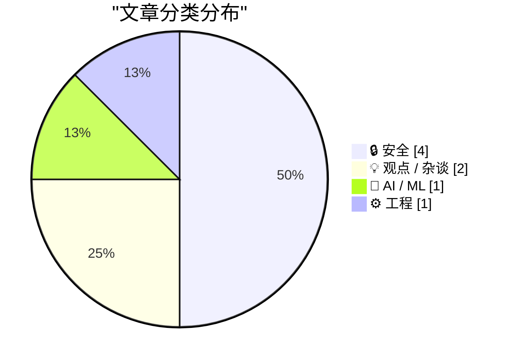
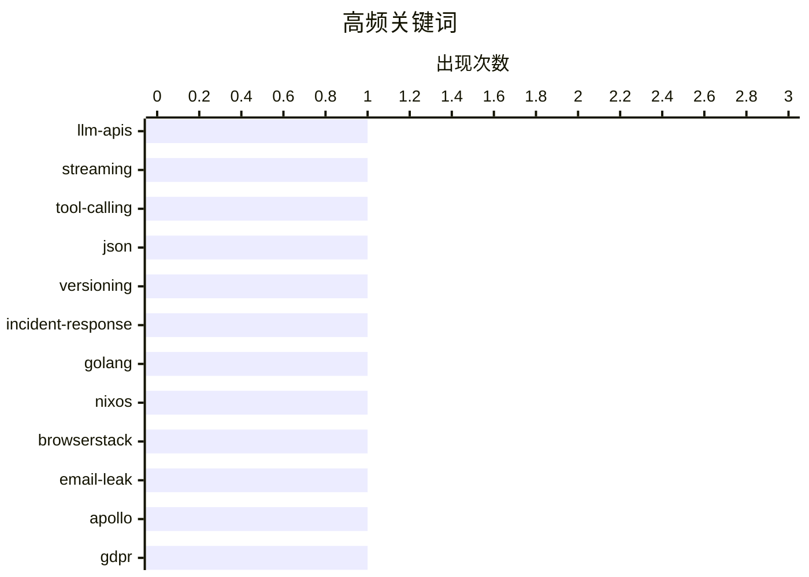

# 📰 AI 博客每日精选 — 2026-04-06

> 来自 Karpathy 推荐的 92 个顶级技术博客，AI 精选 Top 8

## 📝 今日看点

今天的技术焦点正在从“模型能力竞赛”转向“工程与治理落地”：随着各家 LLM API 快速分化，统一抽象层和多厂商工具链正进入新一轮重构期。与此同时，生产事故复盘再次证明，可观测性不只属于监控系统，版本标识与发布可见性已成为基础工程卫生。安全与隐私议题也显著升温，从邮箱泄露追踪、密钥扫描工具到“隐身模式”争议，行业对“默认可信”的质疑在加深。整体来看，技术圈正在把注意力从增长神话和单点创新，转向可验证、可审计、可持续的真实能力建设。

---

## 🏆 今日必读

🥇 **研究 LLM API（2026-04-04）**

[research-llm-apis 2026-04-04](https://simonwillison.net/2026/Apr/5/research-llm-apis/#atom-everything) — simonwillison.net · 22 小时前 · 🤖 AI / ML

> 文章聚焦于不同 LLM 厂商 HTTP API 的差异，以及现有统一抽象层在新能力出现后面临的适配问题。作者正在对自己的 LLM Python 库和 CLI 做一次重大改造，因为其通过插件支持的多厂商模型中，部分厂商新增了如服务端工具执行这类功能，现有抽象层难以覆盖。为设计新的抽象层，作者让 Claude Code 通读 Anthropic、OpenAI、Gemini、Mistral 的 Python 客户端库，并据此生成 curl 命令，直接获取多场景下流式与非流式模式的原始 JSON。相关脚本与抓取结果已整理并发布到一个新的代码仓库中。结论上，这是一项面向“先理解各家原始 API 行为、再重构统一接口”的基础性调研工作。

💡 **为什么值得读**: 值得读在于它给出了多家主流 LLM API 的一手对齐方法（客户端源码对读 + curl 抓原始 JSON），对做多模型接入和抽象层重构的人非常有参考价值。

🏷️ LLM-APIs, streaming, tool-calling, JSON

🥈 **盖章吧！所有程序都必须报告自己的版本**

[Stamp It! All Programs Must Report Their Version](https://michael.stapelberg.ch/posts/2026-04-05-stamp-it-all-programs-must-report-their-version/) — michael.stapelberg.ch · 8 小时前 · ⚙️ 工程

> 一次生产事故响应中，作者虽在一小时内猜中故障根因并提交修复，却因缺乏版本号与发布进度可见性而额外耗费了数小时排查。文章聚焦“构建信息（build info）打标与版本报告”这一工程实践，主张用“Stamp it! Plumb it! Report it!”三步把版本信息写入构建产物、贯通到系统链路并在程序中可查询输出。文中以 i3 窗口管理器的 `--version`/`--moreversion` 作为案例，强调程序自报身份对支持、复现与定位问题的价值。作者还讨论了 Go 默认会写入 VCS 信息，以及在 NixOS/Nix 的 Go 构建场景下如何保留并上报 VCS revision（含现状细节、临时 overlay 方案与更干净的修复方向）。结论是版本信息不应停留在粗粒度版本号，必须把可追溯的构建与提交信息稳定暴露出来，以显著减少事故处理中的延迟与压力。

💡 **为什么值得读**: 它把“版本可观测性”从抽象口号落到可执行的三步法和 Go/Nix 具体场景，能直接改进你在故障排查与跨环境复现时的效率。

🏷️ versioning, incident-response, Golang, NixOS

🥉 **BrowserStack 有人在泄露用户邮箱地址**

[Someone at BrowserStack is Leaking Users' Email Address](https://shkspr.mobi/blog/2026/04/someone-at-browserstack-is-leaking-users-email-address/) — shkspr.mobi · 11 小时前 · 🔒 安全

> 作者用“每个服务一个唯一邮箱地址”的方式追踪隐私泄露，并在注册 BrowserStack Open Source 计划后发现该专用邮箱被第三方联系。联系者称邮箱来自 Apollo.io；Apollo 最初称其通过“专有算法”结合公开信息推导邮箱，随后又明确表示该邮箱来自 BrowserStack（browserstack.com）这个参与其客户贡献网络的客户，并给出采集日期为 2026-02-25。作者据此认为 Apollo 不可能凭规则推导出该唯一地址，信息来源应是 BrowserStack链路中的实际数据共享或外流。文中列出几种可能：BrowserStack 主动出售/提供用户数据、其使用的第三方服务抽取数据、或 BrowserStack 员工/承包商外传数据。尽管作者多次联系 BrowserStack，但未获回复，并将此事归因于个人信息交易常态化及对隐私的不尊重。

💡 **为什么值得读**: 它用可验证的“唯一邮箱”证据链串起 BrowserStack 与 Apollo 的数据流转说法冲突，能帮助读者快速识别 B2B 联系人数据平台背后的隐私风险。

🏷️ BrowserStack, email-leak, Apollo, GDPR

---

## 📊 数据概览

| 扫描源 | 抓取文章 | 时间范围 | 精选 |
|:---:|:---:|:---:|:---:|
| 89/92 | 2535 篇 → 15 篇 | 24h | **8 篇** |

### 分类分布



### 高频关键词



<details>
<summary>📈 纯文本关键词图（终端友好）</summary>

```
llm-apis          │ ████████████████████ 1
streaming         │ ████████████████████ 1
tool-calling      │ ████████████████████ 1
json              │ ████████████████████ 1
versioning        │ ████████████████████ 1
incident-response │ ████████████████████ 1
golang            │ ████████████████████ 1
nixos             │ ████████████████████ 1
browserstack      │ ████████████████████ 1
email-leak        │ ████████████████████ 1
```

</details>

### 🏷️ 话题标签

**llm-apis**(1) · **streaming**(1) · **tool-calling**(1) · json(1) · versioning(1) · incident-response(1) · golang(1) · nixos(1) · browserstack(1) · email-leak(1) · apollo(1) · gdpr(1) · secret-scanning(1) · claude-code(1) · api-keys(1) · cli-tool(1) · ai-startups(1) · medvi(1) · fraud(1) · valuation(1)

---

## 🔒 安全

### 1. BrowserStack 有人在泄露用户邮箱地址

[Someone at BrowserStack is Leaking Users' Email Address](https://shkspr.mobi/blog/2026/04/someone-at-browserstack-is-leaking-users-email-address/) — **shkspr.mobi** · 11 小时前 · ⭐ 23/30

> 作者用“每个服务一个唯一邮箱地址”的方式追踪隐私泄露，并在注册 BrowserStack Open Source 计划后发现该专用邮箱被第三方联系。联系者称邮箱来自 Apollo.io；Apollo 最初称其通过“专有算法”结合公开信息推导邮箱，随后又明确表示该邮箱来自 BrowserStack（browserstack.com）这个参与其客户贡献网络的客户，并给出采集日期为 2026-02-25。作者据此认为 Apollo 不可能凭规则推导出该唯一地址，信息来源应是 BrowserStack链路中的实际数据共享或外流。文中列出几种可能：BrowserStack 主动出售/提供用户数据、其使用的第三方服务抽取数据、或 BrowserStack 员工/承包商外传数据。尽管作者多次联系 BrowserStack，但未获回复，并将此事归因于个人信息交易常态化及对隐私的不尊重。

🏷️ BrowserStack, email-leak, Apollo, GDPR

---

### 2. 发布 scan-for-secrets 0.1：扫描你计划分享文件中的密钥

[scan-for-secrets 0.1](https://simonwillison.net/2026/Apr/5/scan-for-secrets-3/#atom-everything) — **simonwillison.net** · 19 小时前 · ⭐ 23/30

> 这篇发布聚焦于在公开日志或文件前，如何检查是否意外泄露 API key 等敏感信息。作者因经常发布本地 Claude Code 会话转录，担心详细日志中夹带密钥，于是开发了 Python 工具 scan-for-secrets 0.1。该工具可通过 `uvx scan-for-secrets $OPENAI_API_KEY -d logs-to-publish/` 按目录扫描，省略 `-d` 时默认扫描当前目录；不仅匹配明文密钥，也会检测如反斜杠转义、JSON 转义等常见编码形式。工具还支持在 `~/.scan-for-secrets.conf.sh` 中配置固定命令来输出需长期保护的密钥，示例包含 OpenAI、Anthropic、Gemini、Mistral 和 AWS 凭据提取命令。作者表示该工具采用 README-driven development 构建：先写清 README 行为规范，再交给 Claude Code 按 red/green TDD 实现。

🏷️ secret-scanning, Claude-Code, API-keys, CLI-tool

---

### 3. iOS 26 感觉比 iOS 18 更快

[iOS 26 Feels Faster Than iOS 18](https://daringfireball.net/linked/2026/04/03/ios-18-update-for-holdouts) — **daringfireball.net** · 22 小时前 · ⭐ 21/30

> 焦点是苹果是否为未升级到 iOS 26 的用户持续提供 iOS 18 安全更新，以及 iOS 26 与 iOS 18 的实际体验差异。Apple 已向所有仍在 iOS 18 的设备推送 iOS 18.7.7，此前该版本仅面向无法运行 iOS 26 的机型；开启自动更新但未执行大版本升级的用户也可自动收到这次补丁。文中同时指出，这次补丁发布背景是 DarkSword 和 Coruna 等严重安全漏洞事件，反映出“留在上一代 iOS”支持策略并不稳定。作者认为，既然苹果允许用户手动选择不升级大版本，就应像 macOS 那样更明确支持“落后一年的主版本”安全维护。作者在 iPhone 16 Pro 上短期回到 iOS 18.7.7 对比后认为，两代 iOS 在 iPhone 上差异不大，iOS 26 更像视觉层面的微调而非激进重构。

🏷️ iOS, security-updates, Apple, mobile-security

---

### 4. 集体诉讼称 Perplexity 的“隐身模式”是“骗局”

[Class Action Lawsuit Says Perplexity’s ‘Incognito Mode’ Is a ‘Sham’](https://arstechnica.com/tech-policy/2026/04/perplexitys-incognito-mode-is-a-sham-lawsuit-says/) — **daringfireball.net** · 22 小时前 · ⭐ 23/30

> 一项拟议中的集体诉讼指控 Perplexity 在用户不知情、未同意的情况下，将聊天内容通过广告追踪技术共享给 Google 和 Meta，且影响范围包括注册与未注册用户。诉状称通过开发者工具可见：用户的开场提问会被持续共享，点击的后续追问也会被共享；对未订阅用户而言，其初始提示词还会关联到可访问整段对话的 URL。诉讼进一步指出，即使开启“Incognito Mode”，聊天仍会连同邮箱等可识别身份信息（PII）被传给 Google 和 Meta，因此该模式被称为“sham”。原告还称其涉及家庭财务、税务、法律与投资相关对话的完整或部分记录被共享，其他用户也可能在健康医疗等敏感主题上受到类似影响。该案将 Perplexity、Google、Meta 一并列为被告，主张其以商业利益优先于隐私权，并寻求禁令阻止持续的数据共享行为。

🏷️ Perplexity, privacy, PII, class-action

---

## 💡 观点 / 杂谈

### 5. 首家“18亿美元”AI公司的幕后故事

[The back story behind the first “$1.8 Billion” dollar “AI Company”](https://garymarcus.substack.com/p/the-back-story-behind-the-first-18) — **garymarcus.substack.com** · 6 小时前 · ⭐ 21/30

> 舆论把 Medvi 的“1 人、2 个月、2 万美元启动、无风投做到 18 亿美元估值”叙事当作 AI 胜利样板并广泛传播。文章认为这一叙事被严重简化，关键负面信息在主流报道中着墨不足。文中引用信息称 Medvi 上月遭加州反垃圾邮件法相关集体诉讼，指控其联盟营销涉及伪造邮件头、域名欺骗、虚假或误导性主题等做法。作者还援引 YouTube 与 Futurism 的持续调查，以及业内人士对其合规、数据处理和营收真实性的质疑，认为其商业模式可能建立在问题平台之上。结论是，Medvi 不应被当作 AI 创业神话，而更像是“AI 可被滥用”的警示案例。

🏷️ AI-startups, Medvi, fraud, valuation

---

### 6. 没那么深奥

[It's not that deep](https://idiallo.com/blog/its-not-that-deep?src=feed) — **idiallo.com** · 15 小时前 · ⭐ 12/30

> 周日晚独处时，作者会在“去做点新东西”和“安静阅读”之间做选择，并强调后者同样能带来强烈的精神满足。相比创业点子或技术颠覆，他更看重那些能听见作者本人声音的文字：哪怕只是日常片段、小情绪或简短感想，只要有人味就足够动人。文中点名了自己会定期阅读的一些个人博客作者，并明确这种阅读不是为了“跟上潮流”或获取功利回报。作者反对把写作过度职业化、企业化到失去个体表达，认为那会让内容变得空洞。最终落点是：阅读不必宏大，也不必改变人生，能让人片刻放松、会心一笑就已经有价值。

🏷️ writing, authenticity, blogging, creativity

---

## 🤖 AI / ML

### 7. 研究 LLM API（2026-04-04）

[research-llm-apis 2026-04-04](https://simonwillison.net/2026/Apr/5/research-llm-apis/#atom-everything) — **simonwillison.net** · 22 小时前 · ⭐ 24/30

> 文章聚焦于不同 LLM 厂商 HTTP API 的差异，以及现有统一抽象层在新能力出现后面临的适配问题。作者正在对自己的 LLM Python 库和 CLI 做一次重大改造，因为其通过插件支持的多厂商模型中，部分厂商新增了如服务端工具执行这类功能，现有抽象层难以覆盖。为设计新的抽象层，作者让 Claude Code 通读 Anthropic、OpenAI、Gemini、Mistral 的 Python 客户端库，并据此生成 curl 命令，直接获取多场景下流式与非流式模式的原始 JSON。相关脚本与抓取结果已整理并发布到一个新的代码仓库中。结论上，这是一项面向“先理解各家原始 API 行为、再重构统一接口”的基础性调研工作。

🏷️ LLM-APIs, streaming, tool-calling, JSON

---

## ⚙️ 工程

### 8. 盖章吧！所有程序都必须报告自己的版本

[Stamp It! All Programs Must Report Their Version](https://michael.stapelberg.ch/posts/2026-04-05-stamp-it-all-programs-must-report-their-version/) — **michael.stapelberg.ch** · 8 小时前 · ⭐ 23/30

> 一次生产事故响应中，作者虽在一小时内猜中故障根因并提交修复，却因缺乏版本号与发布进度可见性而额外耗费了数小时排查。文章聚焦“构建信息（build info）打标与版本报告”这一工程实践，主张用“Stamp it! Plumb it! Report it!”三步把版本信息写入构建产物、贯通到系统链路并在程序中可查询输出。文中以 i3 窗口管理器的 `--version`/`--moreversion` 作为案例，强调程序自报身份对支持、复现与定位问题的价值。作者还讨论了 Go 默认会写入 VCS 信息，以及在 NixOS/Nix 的 Go 构建场景下如何保留并上报 VCS revision（含现状细节、临时 overlay 方案与更干净的修复方向）。结论是版本信息不应停留在粗粒度版本号，必须把可追溯的构建与提交信息稳定暴露出来，以显著减少事故处理中的延迟与压力。

🏷️ versioning, incident-response, Golang, NixOS

---

*生成于 2026-04-06 07:02 | 扫描 89 源 → 获取 2535 篇 → 精选 8 篇*
*基于 [Hacker News Popularity Contest 2025](https://refactoringenglish.com/tools/hn-popularity/) RSS 源列表*
