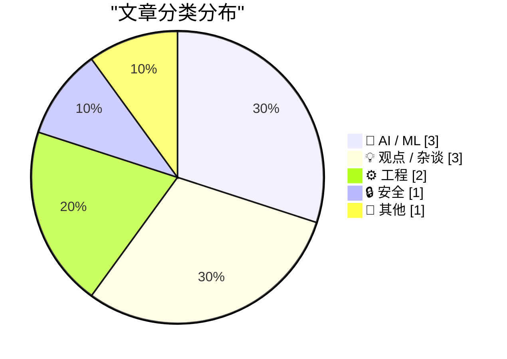
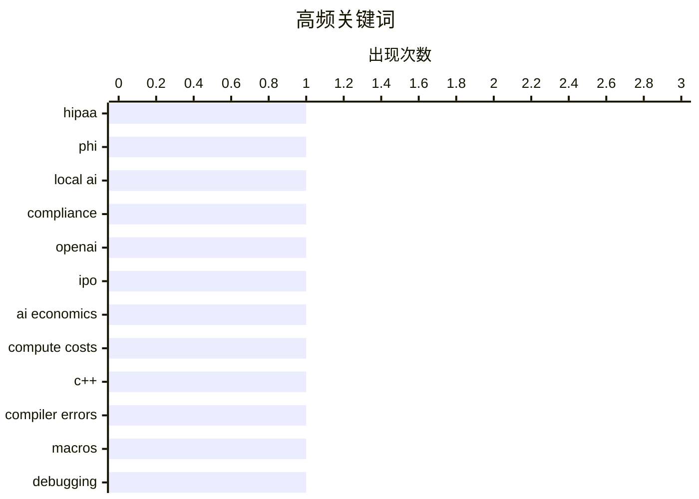

# 📰 AI 博客每日精选 — 2026-04-07

> 来自 Karpathy 推荐的 92 个顶级技术博客，AI 精选 Top 10

## 📝 今日看点

今天技术圈的主线正在从“模型能力”转向“落地约束”：算力短缺、组织成熟度与商业化节奏，正共同决定 AI 公司能走多快、走多远。与此同时，“本地优先”明显升温，从 HIPAA 场景到手机端离线模型，数据主权与合规正在成为新一轮产品竞争力。开发实践上，LLM 虽把原型门槛降到前所未有，但“12 分钟生成、10 小时修复”的现实提醒行业：效率红利必须配套工程治理与目标澄清。更广泛地看，围绕平台治理、领导层可信度与数据监控定价的争议，也在把 AI 竞争从技术战推向制度与伦理战。

---

## 🏆 今日必读

🥇 **符合 HIPAA 的 AI**

[HIPAA compliant AI](https://www.johndcook.com/blog/2026/04/05/hipaa-compliant-ai/) — johndcook.com · 23 小时前 · 🔒 安全

> 在涉及受保护健康信息（PHI）的场景下，本地部署 AI 被认为是实现 HIPAA 合规的最佳路径，因为无需把数据发送到云端模型服务。云端方案通常只是“HIPAA eligible”或“支持 HIPAA 合规”，仍需额外完成 BAA、配置、日志、访问控制和内部流程，而且能力往往受限、成本也更高。文中列举了多个厂商限制：如 OpenAI 仅部分企业/教育客户可签 BAA，若干功能（如 Codex、多步 Agent）不纳入受监管工作区；Google 的 NotebookLM 不在 BAA 覆盖内，Gemini in Chrome 会对 BAA 客户自动屏蔽；GitHub Copilot 不在微软 BAA 下，Azure OpenAI 仅文本端点可覆盖；Anthropic 也仅覆盖特定 HIPAA-ready 服务。与此同时，作者指出到 2026 年初本地运行已具可行性，消费级硬件可运行接近商用编码助手质量的开放权重模型，单张高端 GPU 或高统一内存的新款 Mac 可在可接受 token 速度下运行 70B 参数模型。结论是：尽管云有规模经济，但在 HIPAA 约束下会出现高直接成本与官僚间接成本，本地 AI 反而可能让中小公司更受益。

💡 **为什么值得读**: 它把“HIPAA 合规 AI”从抽象概念落到各大平台的具体可用边界与现实成本上，能直接指导医疗相关团队做部署选型。

🏷️ HIPAA, PHI, local AI, compliance

🥈 **新闻：OpenAI 首席财务官认为公司尚未准备好 IPO，且不确定营收能否支撑承诺**

[News: OpenAI CFO Doesn't Believe Company Ready For IPO, Unsure Revenue Will Support Commitments](https://www.wheresyoured.at/openai-cfo-news/) — wheresyoured.at · 8 小时前 · 🤖 AI / ML

> 围绕 OpenAI 是否应在 2026 年推进上市，CFO Sarah Friar 与 CEO Sam Altman 在时机判断上出现分歧。Friar 对同事表示，公司在流程和组织层面尚未就绪，同时其高额支出承诺存在风险；她也不确定未来是否仍需持续大规模投入 AI 服务器，以及增速放缓的营收能否覆盖这些承诺。报道还称，Friar 自 2025 年 8 月起不再直接向 Altman 汇报，而改为向应用业务负责人 Fidji Simo 汇报，这在大型公司中较为少见。另一项财务信号是 OpenAI 2025 年毛利率低于预期，原因是为应对超预期的聊天机器人与模型需求而临时采购了更昂贵的算力。整体信息指向：OpenAI 在资本市场节奏与成本结构上仍面临不确定性，短期内上市准备并不稳固。

💡 **为什么值得读**: 它把 OpenAI 上市时点、治理结构异常和算力成本压力放在同一条财务逻辑里，能快速帮助你判断这家公司当前的真实经营约束。

🏷️ OpenAI, IPO, AI economics, compute costs

🥉 **学习阅读 C++ 编译器错误：明明看不到 ->，却报了非法使用 ->**

[Learning to read C++ compiler errors: Illegal use of -> when there is no -> in sight](https://devblogs.microsoft.com/oldnewthing/20260406-00/?p=112208) — devblogs.microsoft.com/oldnewthing · 9 小时前 · ⚙️ 工程

> 一次编译报错出现在系统头文件链路中：包含 ole2.h 后，编译器在 oaidl.h 的 IErrorLog::AddError 声明处连续报出 C3927、C3613、C3646、C2275、C2146、C2238 等语法错误，并声称存在被误用的 `->` 与 `Log`。这类“代码里看不到却被报错”的现象，指向预处理宏改写了源码标记。排查思路是先怀疑同名宏污染，再导出预处理结果文件，查看送入编译器前的真实代码是否出现了异常 token（如 `->`）。最终确认工程中确实定义了 `AddError` 宏，关闭该宏后问题消失。结论是：编译器报出的奇怪符号通常并非“凭空出现”，而是宏展开导致的实际输入异常。

💡 **为什么值得读**: 它给出了处理“头文件里离奇语法报错”的高效诊断路径：先看预处理输出、优先排查宏污染，能快速从看似无关的错误中定位根因。

🏷️ C++, compiler errors, macros, debugging

---

## 📊 数据概览

| 扫描源 | 抓取文章 | 时间范围 | 精选 |
|:---:|:---:|:---:|:---:|
| 89/92 | 2536 篇 → 21 篇 | 24h | **10 篇** |

### 分类分布



### 高频关键词



<details>
<summary>📈 纯文本关键词图（终端友好）</summary>

```
hipaa           │ ████████████████████ 1
phi             │ ████████████████████ 1
local ai        │ ████████████████████ 1
compliance      │ ████████████████████ 1
openai          │ ████████████████████ 1
ipo             │ ████████████████████ 1
ai economics    │ ████████████████████ 1
compute costs   │ ████████████████████ 1
c++             │ ████████████████████ 1
compiler errors │ ████████████████████ 1
```

</details>

### 🏷️ 话题标签

**hipaa**(1) · **phi**(1) · **local ai**(1) · compliance(1) · openai(1) · ipo(1) · ai economics(1) · compute costs(1) · c++(1) · compiler errors(1) · macros(1) · debugging(1) · llm(1) · code review(1) · ai-generated code(1) · developer workflow(1) · software dependencies(1) · supply chain(1) · open source(1) · transitive dependencies(1)

---

## 🤖 AI / ML

### 1. 新闻：OpenAI 首席财务官认为公司尚未准备好 IPO，且不确定营收能否支撑承诺

[News: OpenAI CFO Doesn't Believe Company Ready For IPO, Unsure Revenue Will Support Commitments](https://www.wheresyoured.at/openai-cfo-news/) — **wheresyoured.at** · 8 小时前 · ⭐ 24/30

> 围绕 OpenAI 是否应在 2026 年推进上市，CFO Sarah Friar 与 CEO Sam Altman 在时机判断上出现分歧。Friar 对同事表示，公司在流程和组织层面尚未就绪，同时其高额支出承诺存在风险；她也不确定未来是否仍需持续大规模投入 AI 服务器，以及增速放缓的营收能否覆盖这些承诺。报道还称，Friar 自 2025 年 8 月起不再直接向 Altman 汇报，而改为向应用业务负责人 Fidji Simo 汇报，这在大型公司中较为少见。另一项财务信号是 OpenAI 2025 年毛利率低于预期，原因是为应对超预期的聊天机器人与模型需求而临时采购了更昂贵的算力。整体信息指向：OpenAI 在资本市场节奏与成本结构上仍面临不确定性，短期内上市准备并不稳固。

🏷️ OpenAI, IPO, AI economics, compute costs

---

### 2. AI Did It in 12 Minutes. It Took Me 10 Hours to Fix It

[AI Did It in 12 Minutes. It Took Me 10 Hours to Fix It](https://idiallo.com/blog/it-took-me-10-hours-to-fix-ai-code?src=feed) — **idiallo.com** · 10 小时前 · ⭐ 23/30

> I've been working on personal projects since the 2000s. One thing I've always been adamant about is understanding the code I write. Even when Stack Overflow came along, I was that annoying guy who tol

🏷️ LLM, code review, AI-generated code, developer workflow

---

### 3. 算力紧缺接下来会怎样？

[What next for the compute crunch?](https://martinalderson.com/posts/what-next-for-the-compute-crunch/?utm_source=rss&amp;utm_medium=rss&amp;utm_campaign=feed) — **martinalderson.com** · 23 小时前 · ⭐ 22/30

> AI 行业的核心矛盾被指向“需求增长远快于算力供给”，且 OpenAI 与 Anthropic 已公开承认算力紧张。文中用 GitHub COO 提到的“过去 3 个月提交量按年化约 14 倍增长”作为信号，认为编码代理走向主流后，推理算力需求出现了极大跃升，而且这可能仍被低估。作者还提到当某家模型服务因算力问题限流或宕机时，用户会迁移到其他产品，进一步放大全行业的连锁拥堵。文章强调，巨额 GPU 采购承诺（如百亿美元级别）并不等于算力可立即落地，数据中心建设、电力接入、燃气轮机、GPU 制造与组网及相关劳动力都存在瓶颈。尤其 GB200 从风冷转向液冷后，在超大规模数据中心部署面临电力密度、工程复杂度、熟练工人与高端管路部件短缺等问题，导致进度明显滞后，短期内算力紧张难以快速缓解。

🏷️ AI compute, inference demand, GPU shortage, coding agents

---

## 💡 观点 / 杂谈

### 4. 用 LLM 做原型

[Prototyping with LLMs](https://blog.jim-nielsen.com/2026/prototyping-with-llm/) — **blog.jim-nielsen.com** · 4 小时前 · ⭐ 22/30

> 文章围绕“在 LLM 让原型开发变得很容易后，是否应当立刻动手”这一实践问题展开。作者认可原型工作的价值，也指出自己常在与 LLM 进行中途开发时才发现目标不清，结果比开始时更困惑。文中提出一个常被忽略的替代路径：先做 sketching（草图），用更低成本澄清想法，再决定是否进入 LLM 原型阶段。作者的经验是，很多点子在草图阶段就会被否决，而这一步不消耗 token 和算力。最终观点是：在快速原型前先做一点前置思考、并用草图提前看清方向，往往更高效。

🏷️ LLM prototyping, product design, ideation, developer productivity

---

### 5. 萨姆·奥特曼：不受真相约束

[Sam Altman, unconstrained by the truth](https://garymarcus.substack.com/p/sam-altman-unconstrained-by-the-truth) — **garymarcus.substack.com** · 6 小时前 · ⭐ 17/30

> 文章围绕“是否应信任 OpenAI CEO 萨姆·奥特曼”展开，并借《纽约客》Ronan Farrow 与 Andrew Marantz 的最新调查强化了这一质疑。Gary Marcus 表示，他此前在通讯和 2024 年《卫报》文章中已提出类似担忧，而这次报道让相关指控更有分量。文中还提出奥特曼在陷入压力时会通过“炒作”转移叙事，并将 OpenAI 的“Superintelligence”新报告解读为在公司经济模式遭受质疑（含 The Information 报道的 CFO 担忧）背景下的分散注意行为。作者进一步把问题上升到治理层面：当模型可能带来大规模生物武器或网络攻击风险时，是否应由奥特曼单方面决定发布与否。结论是，作者明确反对将这类高风险决策交由奥特曼个人裁量，主张需要外部审查与约束。

🏷️ Sam Altman, OpenAI governance, AI ethics, media criticism

---

### 6. 你的老板想用监控数据来削减你的工资

[Pluralistic: Your boss wants to use surveillance data to cut your wages (06 Apr 2026)](https://pluralistic.net/2026/04/06/empiricism-washing/) — **pluralistic.net** · 13 小时前 · ⭐ 15/30

> 文章聚焦“个性化定价”背后的“监控定价”，并将其扩展到工资领域，指出企业可借助监控数据分别推高消费者支付上限、压低劳动者报酬。文中用对比说明这种机制如何“重估”个人资产与劳动价值：同一商品有人支付 2 美元、有人支付 1 美元，或同一工作有人拿 1 美元、有人拿 2 美元，本质都是对个体价值的差别化定价。作者将其归入“劣化（enshittification）”逻辑，认为它依赖三类条件中的关键两项：市场垄断与监管俘获。文章称，在竞争充分的市场里，劳动者和消费者会流向非监控型替代者；而现实中美国隐私法长期停留在 1988 年框架、欧盟 GDPR 执行又受大型科技公司与监管环境影响而被削弱。作者还指出欧美竞争法名义上禁止这类做法，但长期宽松执法使“不公平和欺骗性”行为得以持续。

🏷️ surveillance pricing, labor rights, privacy, platform economy

---

## ⚙️ 工程

### 7. 学习阅读 C++ 编译器错误：明明看不到 ->，却报了非法使用 ->

[Learning to read C++ compiler errors: Illegal use of -> when there is no -> in sight](https://devblogs.microsoft.com/oldnewthing/20260406-00/?p=112208) — **devblogs.microsoft.com/oldnewthing** · 9 小时前 · ⭐ 23/30

> 一次编译报错出现在系统头文件链路中：包含 ole2.h 后，编译器在 oaidl.h 的 IErrorLog::AddError 声明处连续报出 C3927、C3613、C3646、C2275、C2146、C2238 等语法错误，并声称存在被误用的 `->` 与 `Log`。这类“代码里看不到却被报错”的现象，指向预处理宏改写了源码标记。排查思路是先怀疑同名宏污染，再导出预处理结果文件，查看送入编译器前的真实代码是否出现了异常 token（如 `->`）。最终确认工程中确实定义了 `AddError` 宏，关闭该宏后问题消失。结论是：编译器报出的奇怪符号通常并非“凭空出现”，而是宏展开导致的实际输入异常。

🏷️ C++, compiler errors, macros, debugging

---

### 8. 大教堂与地下墓穴

[The Cathedral and the Catacombs](https://nesbitt.io/2026/04/06/the-cathedral-and-the-catacombs.html) — **nesbitt.io** · 13 小时前 · ⭐ 23/30

> 文章把开源“教堂 vs 集市”的经典隐喻推进到“地下墓穴”层面，焦点从开发流程与治理转向每个项目下方的依赖图结构。作者指出，既有讨论无论是“Winchester Mystery House”、P2P Foundation 对历史教堂的纠偏，还是对开源组织形态的争论，主要都停留在“谁在构建、如何构建”的框架内。真正被忽视的是由传递依赖、共享库和长期无人维护基础设施构成的承重网络；以 JavaScript 为例，一个项目常会引入数百个团队未读过的传递依赖，这使“足够多眼睛就能让 bug 变浅”的前提失效。现有手段如 lockfile、SBOM、依赖扫描和发行版逐包审查只能局部缓解，仍未把依赖图当作一个整体连通系统来审计。核心判断是：软件风险不只在维护者是否过劳，更在于一个无人设计、无人全局审计却承担结构性负载的依赖网络长期被当作“他人问题”。

🏷️ software dependencies, supply chain, open source, transitive dependencies

---

## 🔒 安全

### 9. 符合 HIPAA 的 AI

[HIPAA compliant AI](https://www.johndcook.com/blog/2026/04/05/hipaa-compliant-ai/) — **johndcook.com** · 23 小时前 · ⭐ 25/30

> 在涉及受保护健康信息（PHI）的场景下，本地部署 AI 被认为是实现 HIPAA 合规的最佳路径，因为无需把数据发送到云端模型服务。云端方案通常只是“HIPAA eligible”或“支持 HIPAA 合规”，仍需额外完成 BAA、配置、日志、访问控制和内部流程，而且能力往往受限、成本也更高。文中列举了多个厂商限制：如 OpenAI 仅部分企业/教育客户可签 BAA，若干功能（如 Codex、多步 Agent）不纳入受监管工作区；Google 的 NotebookLM 不在 BAA 覆盖内，Gemini in Chrome 会对 BAA 客户自动屏蔽；GitHub Copilot 不在微软 BAA 下，Azure OpenAI 仅文本端点可覆盖；Anthropic 也仅覆盖特定 HIPAA-ready 服务。与此同时，作者指出到 2026 年初本地运行已具可行性，消费级硬件可运行接近商用编码助手质量的开放权重模型，单张高端 GPU 或高统一内存的新款 Mac 可在可接受 token 速度下运行 70B 参数模型。结论是：尽管云有规模经济，但在 HIPAA 约束下会出现高直接成本与官僚间接成本，本地 AI 反而可能让中小公司更受益。

🏷️ HIPAA, PHI, local AI, compliance

---

## 📝 其他

### 10. Google AI Edge Gallery

[Google AI Edge Gallery](https://simonwillison.net/2026/Apr/6/google-ai-edge-gallery/#atom-everything) — **simonwillison.net** · 17 小时前 · ⭐ 15/30

> Google 推出了官方 iPhone 应用 AI Edge Gallery，可在本地运行 Gemma 4（E2B、E4B）以及部分 Gemma 3 模型。作者实测认为应用整体表现很好，其中 E2B 模型下载体积为 2.54GB，速度快且实用性高。应用支持基于小型 Gemma 4 模型的图像问答和最长 30 秒的音频转写，并提供“skills”演示，通过 8 个 HTML 小组件展示工具调用能力，包括 interactive-map、kitchen-adventure、calculate-hash、text-spinner、mood-tracker、mnemonic-password、query-wikipedia 和 qr-code。作者提到在追加追问时该演示曾导致应用卡死，且应用缺少永久日志，聊天记录是临时性的。作者同时强调，这是他首次看到本地模型厂商发布官方 iPhone 应用来体验其模型。

---

*生成于 2026-04-07 07:03 | 扫描 89 源 → 获取 2536 篇 → 精选 10 篇*
*基于 [Hacker News Popularity Contest 2025](https://refactoringenglish.com/tools/hn-popularity/) RSS 源列表*
