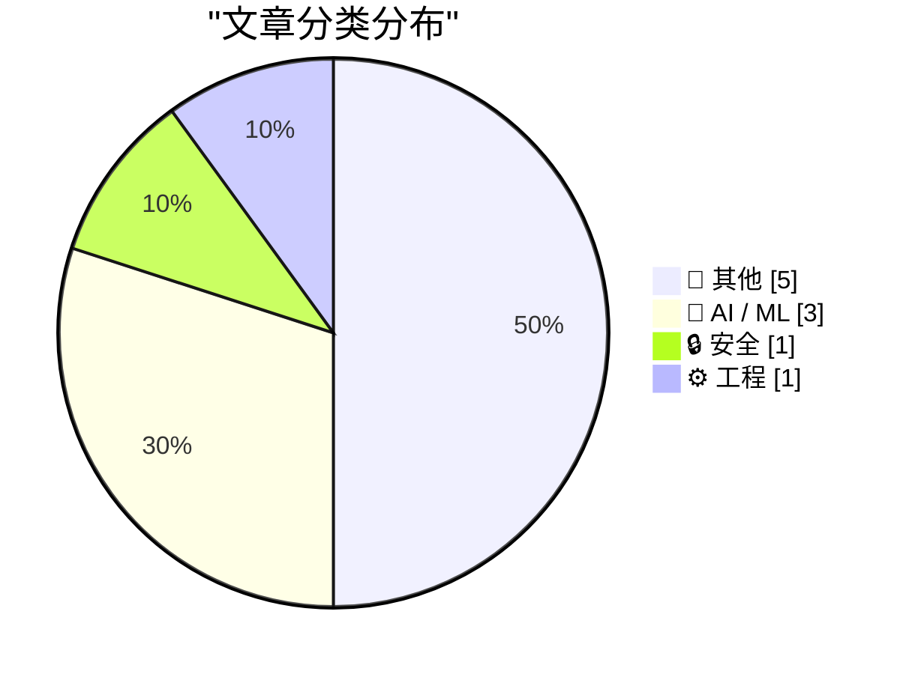
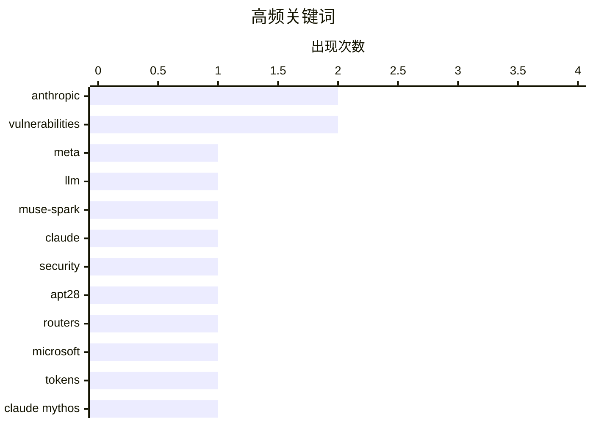

# 📰 AI 博客每日精选 — 2026-04-08

> 来自 Karpathy 推荐的 92 个顶级技术博客，AI 精选 Top 10

## 🏆 今日必读

🥇 **Meta's new model is Muse Spark, and meta.ai chat has some interesting tools**

[Meta's new model is Muse Spark, and meta.ai chat has some interesting tools](https://simonwillison.net/2026/Apr/8/muse-spark/#atom-everything) — simonwillison.net · 2026-04-09 · 🤖 AI / ML

> Simon Willison’s Weblog Subscribe Sponsored by: Teleport &mdash; Connect agents to your infra in seconds with Teleport Beams. Built-in identity. Zero secrets. Get early access Meta’s new model is Muse

🏷️ Meta, LLM, Muse-Spark

🥈 **Anthropic's Project Glasswing - restricting Claude Mythos to security researchers - sounds necessary to me**

[Anthropic's Project Glasswing - restricting Claude Mythos to security researchers - sounds necessary to me](https://simonwillison.net/2026/Apr/7/project-glasswing/#atom-everything) — simonwillison.net · 2 小时前 · 🤖 AI / ML

> Simon Willison’s Weblog Subscribe Sponsored by: Teleport &mdash; Connect agents to your infra in seconds with Teleport Beams. Built-in identity. Zero secrets. Get early access Anthropic’s Project Glas

🏷️ Anthropic, Claude, security, vulnerabilities

🥉 **Russia Hacked Routers to Steal Microsoft Office Tokens**

[Russia Hacked Routers to Steal Microsoft Office Tokens](https://krebsonsecurity.com/2026/04/russia-hacked-routers-to-steal-microsoft-office-tokens/) — krebsonsecurity.com · 5 小时前 · 🔒 安全

> Hackers linked to Russia’s military intelligence units are using known flaws in older Internet routers to mass harvest authentication tokens from Microsoft Office users, security experts warned today.

🏷️ APT28, routers, Microsoft, tokens

---

## 📊 数据概览

| 扫描源 | 抓取文章 | 时间范围 | 精选 |
|:---:|:---:|:---:|:---:|
| 87/92 | 2496 篇 → 89 篇 | 24h | **10 篇** |

### 分类分布



### 高频关键词



<details>
<summary>📈 纯文本关键词图（终端友好）</summary>

```
anthropic       │ ████████████████████ 2
vulnerabilities │ ████████████████████ 2
meta            │ ██████████░░░░░░░░░░ 1
llm             │ ██████████░░░░░░░░░░ 1
muse-spark      │ ██████████░░░░░░░░░░ 1
claude          │ ██████████░░░░░░░░░░ 1
security        │ ██████████░░░░░░░░░░ 1
apt28           │ ██████████░░░░░░░░░░ 1
routers         │ ██████████░░░░░░░░░░ 1
microsoft       │ ██████████░░░░░░░░░░ 1
```

</details>

### 🏷️ 话题标签

**anthropic**(2) · **vulnerabilities**(2) · **meta**(1) · llm(1) · muse-spark(1) · claude(1) · security(1) · apt28(1) · routers(1) · microsoft(1) · tokens(1) · claude mythos(1) · cybersecurity(1) · macos(1) · xnu(1) · kernel(1) · bug(1)

---

## 📝 其他

### 1. Optimism is not a personality flaw

[Optimism is not a personality flaw](https://www.joanwestenberg.com/optimism-is-not-a-personality-flaw/) — **joanwestenberg.com** · 2026-04-12 · ⭐ 15/30

> 2026-04-12 // 7 min read Optimism is not a personality flaw AUTHOR // JA Westenberg ACCESS // true Photo by Cherry Laithang / Unsplash This newsletter is free to read, and it’ll stay that way. But if 

---

### 2. The biggest advance in AI since the LLM

[The biggest advance in AI since the LLM](https://garymarcus.substack.com/p/the-biggest-advance-in-ai-since-the) — **garymarcus.substack.com** · 2026-04-12 · ⭐ 15/30

> The biggest advance in AI since the LLM Why Claude Code changes everything Gary Marcus Apr 11, 2026 299 119 36 Share Even Grok knows that neurosymbolic hybrid power is the future Claude Code , an impr

---

### 3. Pluralistic: Don't Be Evil (11 Apr 2026)

[Pluralistic: Don't Be Evil (11 Apr 2026)](https://pluralistic.net/2026/04/11/obvious-terrible-ideas/) — **pluralistic.net** · 2026-04-11 · ⭐ 15/30

> ->->->->->->->->->->->->->->->->->->->->->->->->->->->->-> Top Sources: None --> Today's links Don't Be Evil : Evil genius is just a lack of shame. Hey look at this : Delights to delectate. Object per

---

### 4. Reading List 04/11/2026

[Reading List 04/11/2026](https://www.construction-physics.com/p/reading-list-04112026) — **construction-physics.com** · 2026-04-11 · ⭐ 15/30

> Reading List 04/11/2026 Is the Strait of Hormuz open yet, building code cost benefit analysis, Intel joining Terafab, sponge cities, and more. Brian Potter Apr 11, 2026 ∙ Paid 99 3 4 Share Antarctic s

---

### 5. Cheapest way to keep a UK mobile number using an eSIM

[Cheapest way to keep a UK mobile number using an eSIM](https://shkspr.mobi/blog/2026/04/cheapest-way-to-keep-a-uk-mobile-number-using-an-esim/) — **shkspr.mobi** · 2026-04-11 · ⭐ 15/30

> Cheapest way to keep a UK mobile number using an eSIM eSIM mobile phone sim · 6 comments · 500 words · Viewed ~648 times I have an old mobile phone number that I'd like to keep. I think it is register

---

## 🤖 AI / ML

### 6. Meta's new model is Muse Spark, and meta.ai chat has some interesting tools

[Meta's new model is Muse Spark, and meta.ai chat has some interesting tools](https://simonwillison.net/2026/Apr/8/muse-spark/#atom-everything) — **simonwillison.net** · 2026-04-09 · ⭐ 27/30

> Simon Willison’s Weblog Subscribe Sponsored by: Teleport &mdash; Connect agents to your infra in seconds with Teleport Beams. Built-in identity. Zero secrets. Get early access Meta’s new model is Muse

🏷️ Meta, LLM, Muse-Spark

---

### 7. Anthropic's Project Glasswing - restricting Claude Mythos to security researchers - sounds necessary to me

[Anthropic's Project Glasswing - restricting Claude Mythos to security researchers - sounds necessary to me](https://simonwillison.net/2026/Apr/7/project-glasswing/#atom-everything) — **simonwillison.net** · 2 小时前 · ⭐ 27/30

> Simon Willison’s Weblog Subscribe Sponsored by: Teleport &mdash; Connect agents to your infra in seconds with Teleport Beams. Built-in identity. Zero secrets. Get early access Anthropic’s Project Glas

🏷️ Anthropic, Claude, security, vulnerabilities

---

### 8. Anthropic’s New Claude Mythos Is So Good at Finding and Exploiting Vulnerabilities That They’re Not Releasing It to the Public

[Anthropic’s New Claude Mythos Is So Good at Finding and Exploiting Vulnerabilities That They’re Not Releasing It to the Public](https://red.anthropic.com/2026/mythos-preview/) — **daringfireball.net** · 2026-04-08 · ⭐ 26/30

> red .anthropic.com Assessing Claude Mythos Preview’s cybersecurity capabilities April 7, 2026 Nicholas Carlini, Newton Cheng, Keane Lucas, Michael Moore, Milad Nasr, Vinay Prabhushankar, Winnie Xiao H

🏷️ Claude Mythos, Anthropic, vulnerabilities, cybersecurity

---

## 🔒 安全

### 9. Russia Hacked Routers to Steal Microsoft Office Tokens

[Russia Hacked Routers to Steal Microsoft Office Tokens](https://krebsonsecurity.com/2026/04/russia-hacked-routers-to-steal-microsoft-office-tokens/) — **krebsonsecurity.com** · 5 小时前 · ⭐ 24/30

> Hackers linked to Russia’s military intelligence units are using known flaws in older Internet routers to mass harvest authentication tokens from Microsoft Office users, security experts warned today.

🏷️ APT28, routers, Microsoft, tokens

---

## ⚙️ 工程

### 10. MacOS Seemingly Crashes After 49 Days of Uptime — a ‘Feature’ Perhaps Exclusive to Tahoe

[MacOS Seemingly Crashes After 49 Days of Uptime — a ‘Feature’ Perhaps Exclusive to Tahoe](https://sixcolors.com/link/2026/04/macs-crash-after-49-days-of-uptime/) — **daringfireball.net** · 2026-04-10 · ⭐ 24/30

> Apple, technology, and other stuff MENU Archive Sign In Membership Topics 26 OS versions Help Me, Glenn! Reviews Apple Report Card E-readers Apple Photos 20 Macs for 2020 Merch About Jason Snell Dan M

🏷️ macOS, XNU, kernel, bug

---

*生成于 2026-04-08 07:00 | 扫描 87 源 → 获取 2496 篇 → 精选 10 篇*
*基于 [Hacker News Popularity Contest 2025](https://refactoringenglish.com/tools/hn-popularity/) RSS 源列表*
