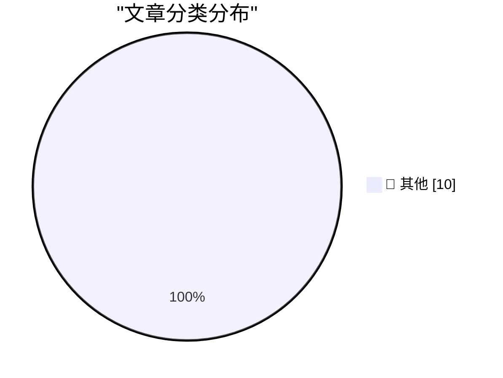

# 📰 AI 博客每日精选 — 2026-04-09

> 来自 Karpathy 推荐的 92 个顶级技术博客，AI 精选 Top 10

## 🏆 今日必读

🥇 **Optimism is not a personality flaw**

[Optimism is not a personality flaw](https://www.joanwestenberg.com/optimism-is-not-a-personality-flaw/) — joanwestenberg.com · 2026-04-12 · 📝 其他

> 2026-04-12 // 7 min read Optimism is not a personality flaw AUTHOR // JA Westenberg ACCESS // true Photo by Cherry Laithang / Unsplash This newsletter is free to read, and it’ll stay that way. But if 

🥈 **SQLite 3.53.0**

[SQLite 3.53.0](https://simonwillison.net/2026/Apr/11/sqlite/#atom-everything) — simonwillison.net · 2026-04-12 · 📝 其他

> SQLite 3.53.0 ( via ) SQLite 3.52.0 was withdrawn so this is a pretty big release with a whole lot of accumulated user-facing and internal improvements. Some that stood out to me: ALTER TABLE can now 

🥉 **SQLite Query Result Formatter Demo**

[SQLite Query Result Formatter Demo](https://simonwillison.net/2026/Apr/11/sqlite-qrf/#atom-everything) — simonwillison.net · 2026-04-12 · 📝 其他

> Simon Willison’s Weblog Subscribe Sponsored by: Teleport &mdash; Connect agents to your infra in seconds with Teleport Beams. Built-in identity. Zero secrets. Get early access 11th April 2026 Tool SQL

---

## 📊 数据概览

| 扫描源 | 抓取文章 | 时间范围 | 精选 |
|:---:|:---:|:---:|:---:|
| 87/92 | 2504 篇 → 66 篇 | 24h | **10 篇** |

### 分类分布

---

## 📝 其他

### 1. Optimism is not a personality flaw

[Optimism is not a personality flaw](https://www.joanwestenberg.com/optimism-is-not-a-personality-flaw/) — **joanwestenberg.com** · 2026-04-12 · ⭐ 15/30

> 2026-04-12 // 7 min read Optimism is not a personality flaw AUTHOR // JA Westenberg ACCESS // true Photo by Cherry Laithang / Unsplash This newsletter is free to read, and it’ll stay that way. But if 

---

### 2. SQLite 3.53.0

[SQLite 3.53.0](https://simonwillison.net/2026/Apr/11/sqlite/#atom-everything) — **simonwillison.net** · 2026-04-12 · ⭐ 15/30

> SQLite 3.53.0 ( via ) SQLite 3.52.0 was withdrawn so this is a pretty big release with a whole lot of accumulated user-facing and internal improvements. Some that stood out to me: ALTER TABLE can now 

---

### 3. SQLite Query Result Formatter Demo

[SQLite Query Result Formatter Demo](https://simonwillison.net/2026/Apr/11/sqlite-qrf/#atom-everything) — **simonwillison.net** · 2026-04-12 · ⭐ 15/30

> Simon Willison’s Weblog Subscribe Sponsored by: Teleport &mdash; Connect agents to your infra in seconds with Teleport Beams. Built-in identity. Zero secrets. Get early access 11th April 2026 Tool SQL

---

### 4. The biggest advance in AI since the LLM

[The biggest advance in AI since the LLM](https://garymarcus.substack.com/p/the-biggest-advance-in-ai-since-the) — **garymarcus.substack.com** · 2026-04-12 · ⭐ 15/30

> The biggest advance in AI since the LLM Why Claude Code changes everything Gary Marcus Apr 11, 2026 307 126 37 Share Even Grok knows that neurosymbolic hybrid power is the future Claude Code , an impr

---

### 5. Pluralistic: Don't Be Evil (11 Apr 2026)

[Pluralistic: Don't Be Evil (11 Apr 2026)](https://pluralistic.net/2026/04/11/obvious-terrible-ideas/) — **pluralistic.net** · 2026-04-11 · ⭐ 15/30

> ->->->->->->->->->->->->->->->->->->->->->->->->->->->->-> Top Sources: None --> Today's links Don't Be Evil : Evil genius is just a lack of shame. Hey look at this : Delights to delectate. Object per

---

### 6. Reading List 04/11/2026

[Reading List 04/11/2026](https://www.construction-physics.com/p/reading-list-04112026) — **construction-physics.com** · 2026-04-11 · ⭐ 15/30

> Reading List 04/11/2026 Is the Strait of Hormuz open yet, building code cost benefit analysis, Intel joining Terafab, sponge cities, and more. Brian Potter Apr 11, 2026 ∙ Paid 99 3 4 Share Antarctic s

---

### 7. Cheapest way to keep a UK mobile number using an eSIM

[Cheapest way to keep a UK mobile number using an eSIM](https://shkspr.mobi/blog/2026/04/cheapest-way-to-keep-a-uk-mobile-number-using-an-esim/) — **shkspr.mobi** · 2026-04-11 · ⭐ 15/30

> Cheapest way to keep a UK mobile number using an eSIM eSIM mobile phone sim · 6 comments · 500 words · Viewed ~824 times I have an old mobile phone number that I'd like to keep. I think it is register

---

### 8. Your friends are hiding their best ideas from you

[Your friends are hiding their best ideas from you](https://idiallo.com/blog/your-friends-are-hiding-their-ideas?src=feed) — **idiallo.com** · 2026-04-11 · ⭐ 15/30

> Back in college, the final project in our JavaScript class was to build a website. We were a group of four, and we built the best website in class. It was for a restaurant called the Coral Reef. We fo

---

### 9. The Center Has a Bias

[The Center Has a Bias](https://lucumr.pocoo.org/2026/4/11/the-center-has-a-bias/) — **lucumr.pocoo.org** · 2026-04-11 · ⭐ 15/30

> Armin Ronacher 's Thoughts and Writings blog archive projects travel talks about The Center Has a Bias written on April 11, 2026 Whenever a new technology shows up, the conversation quickly splits int

---

### 10. IrDA

[IrDA](https://computer.rip/2026-04-11-IrDA.html) — **computer.rip** · 2026-04-11 · ⭐ 15/30

> IrDA 2026-04-11 Light: it's the radiation we can see. The communications potential of light is obvious, and indeed, many of the earliest forms of long-distance communication relied on it: signal fires

---

*生成于 2026-04-09 07:00 | 扫描 87 源 → 获取 2504 篇 → 精选 10 篇*
*基于 [Hacker News Popularity Contest 2025](https://refactoringenglish.com/tools/hn-popularity/) RSS 源列表*
