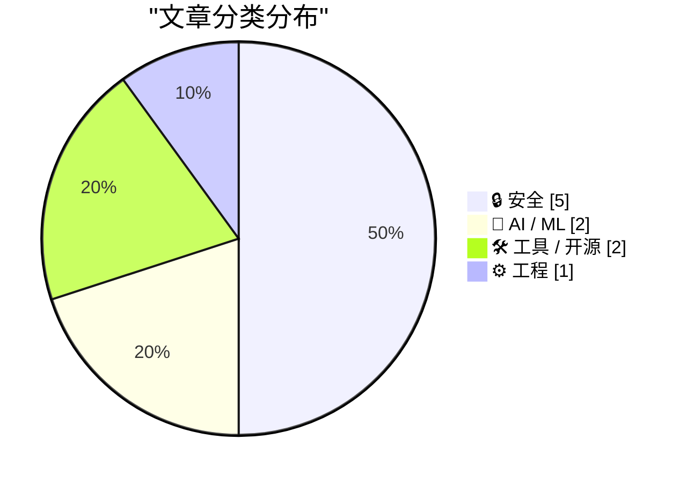
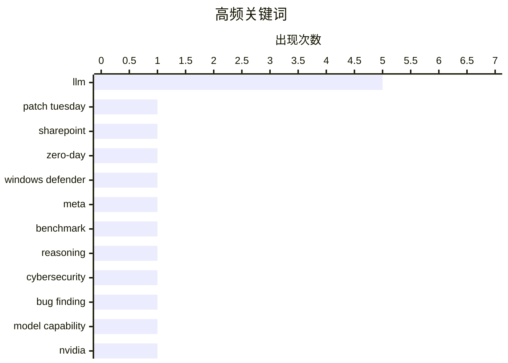

# 📰 AI 博客每日精选 — 2026-04-10

> 来自 Karpathy 推荐的 92 个顶级技术博客，AI 精选 Top 10

## 📝 今日看点

今天技术圈最突出的主线，是 AI 正在同时重塑“能力边界”和“风险边界”：一边是 Meta 新模型、英伟达供应链与算力护城河继续推高大模型竞争，另一边则是 AI 加速漏洞发现、冲击沙箱与软件包安全，令安全压力显著升级。安全议题因此全面升温，从微软单月大规模补丁，到围绕 AI 智能体供应链防御、互联网既有信任模型是否失效的讨论，都指向一个现实：传统安全假设正在被快速改写。与此同时，开发工具链也在悄然进化，WebAssembly 与 npm 生态的新工具获得关注，反映出工程社区在基础设施效率、可用性和替代体验上的持续补课。

---

## 🏆 今日必读

🥇 **补丁星期二：2026 年 4 月版**

[Patch Tuesday, April 2026 Edition](https://krebsonsecurity.com/2026/04/patch-tuesday-april-2026-edition/) — krebsonsecurity.com · 2026-04-15 · 🔒 安全

> 微软在本月补丁日一次性修复了 167 个安全漏洞，重点包括 SharePoint Server 的 0day（CVE-2026-32201）和 Windows Defender 提权漏洞“BlueHammer”（CVE-2026-33825）。其中 CVE-2026-32201 已被在野利用，可在受信任的 SharePoint 环境中伪造内容或界面，被用于钓鱼、数据篡改和社会工程等后续攻击。BlueHammer 的公开利用代码在安装本次补丁后已失效；同时 Adobe Reader 的紧急更新修复了可导致远程代码执行、且据称自 2025 年 11 月起已被利用的 CVE-2026-34621，Chrome 也修复了 2026 年第 4 个 0day。业界观点认为，本次漏洞数量创纪录且包含近 60 个浏览器相关漏洞，漏洞披露量上升与 AI 能力扩展有关，未来可能继续增长。文末还强调浏览器必须定期彻底关闭并重启，更新才会真正生效。

💡 **为什么值得读**: 它把同一周期内微软、Chrome、Adobe 的高风险在野漏洞与修补进展放在一起，能帮助你快速确定当前最该优先打补丁的攻击面。

🏷️ Patch Tuesday, SharePoint, zero-day, Windows Defender

🥈 **Meta 的新模型是 Muse Spark，meta.ai 聊天里还有一些很有意思的工具**

[Meta's new model is Muse Spark, and meta.ai chat has some interesting tools](https://simonwillison.net/2026/Apr/8/muse-spark/#atom-everything) — simonwillison.net · 23 小时前 · 🤖 AI / ML

> Meta 发布了自 Llama 4 以来首个新模型 Muse Spark，目前采用托管形式而非开放权重，API 仅向部分用户提供私有预览，但已可通过 meta.ai 体验。Meta 给出的基准测试显示，它在部分项目上可与 Opus 4.6、Gemini 3.1 Pro 和 GPT 5.4 竞争，但在 Terminal-Bench 2.0 上明显落后；Meta 也承认仍在补齐长程 agent 系统和编程工作流等短板。meta.ai 将该模型提供为 Instant 和 Thinking 两种模式，未来还计划推出提供更长推理时间的 Contemplating 模式，定位接近 Gemini Deep Think 或 GPT-5.4 Pro。作者在聊天界面测试时发现，两种模式都能内联渲染 SVG，其中 Thinking 模式还会输出带有未使用 Playables SDK v1.0.0 JavaScript 库的 HTML 外壳。进一步探查显示，Meta 的聊天系统接入了至少 16 个工具，包括 browser.search、browser.open、browser.find，以及可搜索 Instagram、Threads、Facebook 帖子的 meta_1p.content_search、商品搜索的 meta_1p.meta_catalog_search 和图像生成工具 media.image_gen。

💡 **为什么值得读**: 值得读在于它不仅快速梳理了 Muse Spark 的定位和能力边界，还通过实测挖出了 meta.ai 聊天工具链的具体接口线索。

🏷️ Meta, LLM, benchmark, reasoning

🥉 **AI 网络安全并不是工作量证明**

[AI cybersecurity is not proof of work](http://antirez.com/news/163) — antirez.com · 2026-04-16 · 🔒 安全

> 文章质疑把 AI 做网络安全类比为“工作量证明”的说法，认为“更多 GPU、更多采样”并不等于最终一定能发现漏洞。作者指出，哈希碰撞这类 proof of work 问题会随着投入增加而保证找到满足条件的结果，但漏洞发现不同：LLM 的执行分支最终会被代码状态空间和模型可走的有意义路径所限制。对于同一段代码反复采样到足够大的次数后，瓶颈不再是采样次数 M，而是模型的智能水平 I。OpenBSD 的 SACK 漏洞被用作例子：较弱模型即使生成无限多 token，也无法把起始窗口缺乏校验、整数溢出以及本不应为 NULL 的分支被进入这几个条件正确串联起来。结论是，未来网络安全竞争更像是“更强模型和更快获取这些模型的能力会胜出”，而不是单纯依赖更大的算力堆叠。

💡 **为什么值得读**: 它提供了一个很有辨识度的反驳框架，能帮助读者重新理解“算力扩张是否足以提升 AI 漏洞挖掘能力”这个热门判断。

🏷️ LLM, cybersecurity, bug finding, model capability

---

## 📊 数据概览

| 扫描源 | 抓取文章 | 时间范围 | 精选 |
|:---:|:---:|:---:|:---:|
| 89/92 | 2542 篇 → 152 篇 | 24h | **10 篇** |

### 分类分布



### 高频关键词



<details>
<summary>📈 纯文本关键词图（终端友好）</summary>

```
llm              │ ████████████████████ 5
patch tuesday    │ ████░░░░░░░░░░░░░░░░ 1
sharepoint       │ ████░░░░░░░░░░░░░░░░ 1
zero-day         │ ████░░░░░░░░░░░░░░░░ 1
windows defender │ ████░░░░░░░░░░░░░░░░ 1
meta             │ ████░░░░░░░░░░░░░░░░ 1
benchmark        │ ████░░░░░░░░░░░░░░░░ 1
reasoning        │ ████░░░░░░░░░░░░░░░░ 1
cybersecurity    │ ████░░░░░░░░░░░░░░░░ 1
bug finding      │ ████░░░░░░░░░░░░░░░░ 1
```

</details>

### 🏷️ 话题标签

**llm**(5) · **patch tuesday**(1) · **sharepoint**(1) · zero-day(1) · windows defender(1) · meta(1) · benchmark(1) · reasoning(1) · cybersecurity(1) · bug finding(1) · model capability(1) · nvidia(1) · jensen huang(1) · tpu(1) · ai chips(1) · sandbox(1) · anthropic(1) · exploit generation(1) · software security(1) · vulnerabilities(1)

---

## 🔒 安全

### 1. 补丁星期二：2026 年 4 月版

[Patch Tuesday, April 2026 Edition](https://krebsonsecurity.com/2026/04/patch-tuesday-april-2026-edition/) — **krebsonsecurity.com** · 2026-04-15 · ⭐ 27/30

> 微软在本月补丁日一次性修复了 167 个安全漏洞，重点包括 SharePoint Server 的 0day（CVE-2026-32201）和 Windows Defender 提权漏洞“BlueHammer”（CVE-2026-33825）。其中 CVE-2026-32201 已被在野利用，可在受信任的 SharePoint 环境中伪造内容或界面，被用于钓鱼、数据篡改和社会工程等后续攻击。BlueHammer 的公开利用代码在安装本次补丁后已失效；同时 Adobe Reader 的紧急更新修复了可导致远程代码执行、且据称自 2025 年 11 月起已被利用的 CVE-2026-34621，Chrome 也修复了 2026 年第 4 个 0day。业界观点认为，本次漏洞数量创纪录且包含近 60 个浏览器相关漏洞，漏洞披露量上升与 AI 能力扩展有关，未来可能继续增长。文末还强调浏览器必须定期彻底关闭并重启，更新才会真正生效。

🏷️ Patch Tuesday, SharePoint, zero-day, Windows Defender

---

### 2. AI 网络安全并不是工作量证明

[AI cybersecurity is not proof of work](http://antirez.com/news/163) — **antirez.com** · 2026-04-16 · ⭐ 26/30

> 文章质疑把 AI 做网络安全类比为“工作量证明”的说法，认为“更多 GPU、更多采样”并不等于最终一定能发现漏洞。作者指出，哈希碰撞这类 proof of work 问题会随着投入增加而保证找到满足条件的结果，但漏洞发现不同：LLM 的执行分支最终会被代码状态空间和模型可走的有意义路径所限制。对于同一段代码反复采样到足够大的次数后，瓶颈不再是采样次数 M，而是模型的智能水平 I。OpenBSD 的 SACK 漏洞被用作例子：较弱模型即使生成无限多 token，也无法把起始窗口缺乏校验、整数溢出以及本不应为 NULL 的分支被进入这几个条件正确串联起来。结论是，未来网络安全竞争更像是“更强模型和更快获取这些模型的能力会胜出”，而不是单纯依赖更大的算力堆叠。

🏷️ LLM, cybersecurity, bug finding, model capability

---

### 3. Mythos 是否刚刚打破了维系互联网安全的那笔交易？

[Has Mythos just broken the deal that kept the internet safe?](https://martinalderson.com/posts/has-mythos-just-broken-the-deal-that-kept-the-internet-safe/?utm_source=rss&amp;utm_medium=rss&amp;utm_campaign=feed) — **martinalderson.com** · 2026-04-10 · ⭐ 26/30

> 现代互联网长期依赖“点击链接即可运行代码，但沙箱会阻止恶意行为”这一默认前提，浏览器 JavaScript 沙箱、广告 iframe 和多租户云中的虚拟机沙箱都建立在这种假设之上。文中提到，Anthropic 发布的研究预览版 Mythos 已能以 72.4% 的成功率生成某类沙箱的可用利用代码，而几个月前这一能力还不到 1%，这让沙箱边界是否仍然可靠受到质疑。作者还指出，Mythos 可能是一个非常大的模型，受限于算力与成本，暂时难以大规模部署，泄露价格显示其输出成本为 125 美元/MTok，约为 Opus 的 5 倍。与此同时，更小模型的能力提升速度很快，作者以开源权重模型 Gemma 4 为例，认为前沿大模型具备的这类能力很可能会很快下放到更小、更加容易提供服务的模型上。结论是，沙箱机制正面临风险，而大语言模型正在显著降低发现并利用严重软件漏洞的门槛，带来严肃的网络安全挑战。

🏷️ sandbox, Anthropic, exploit generation, LLM

---

### 4. Y2K 2.0：AI 安全清算时刻

[Y2K 2.0: The AI security reckoning](https://anildash.com/2026/04/10/y2k-2.0-ai-security/) — **anildash.com** · 2026-04-10 · ⭐ 26/30

> 软件安全漏洞在最近几周密集出现，许多原本足以成为“年度最大漏洞”的事件，正在变得近乎日常化。文中将这一变化归因于 LLM 编码能力的快速提升：它们不仅更擅长写代码，也更擅长分析代码中的安全弱点，能够在常用代码中发现漏洞，并几乎不费力地生成利用这些漏洞的工具。新一代模型据称比上一代 AI 工具能发现多出数百倍的漏洞，还能把多个漏洞串联起来，挖出那些在被广泛认为极其安全的平台中潜伏了数十年的问题。随着代码生成成本迅速下降，过去难以规模化实施的攻击被“平民化”，攻击者可以为不同公司或个人定制更精准的钓鱼和社会工程攻击。作者认为局面类似千禧年之交的 Y2K 危机：全球组织都必须同时加速更新系统，但这一次连哪些系统存在隐患、风险何时全面爆发都并不明确。

🏷️ LLM, software security, vulnerabilities, coding agents

---

### 5. 面向 AI 智能体的软件包安全防御

[Package Security Defenses for AI Agents](https://nesbitt.io/2026/04/09/package-security-defenses-for-ai-agents.html) — **nesbitt.io** · 13 小时前 · ⭐ 26/30

> AI 智能体在依赖安装与解析中会遭遇拼写仿冒、注册表投毒、lockfile 篡改、安装时执行代码、凭证窃取以及依赖图级联失效等传统软件包安全问题，而且传播和执行速度比人工审查更快。文章认为不存在单一万能方案，因为 LLM 不能可靠地区分安全与恶意的软件包及元数据，因此需要用多层防御来缩小风险爆炸半径。具体措施包括默认禁用安装脚本，利用 npm 的 --ignore-scripts、pip 的 --only-binary :all:，并提到 Bun 已默认不运行已安装依赖的生命周期脚本；同时为新版本设置 24-72 小时冷却期，让智能体只解析经过初步社区和自动化检验的版本。作者还建议把安装过程放进隔离环境，在下载后切断网络并隔离凭证、SSH 密钥和环境变量，限制智能体只能从允许列表中的 registry 和 scope 拉取依赖，并禁止在未明确要求时重建 lockfile。对于 lockfile 变更，应输出差异供审查，并结合 lockfile-lint 等工具做门禁；在注册表支持的场景下，还应默认要求软件包来源证明，如 npm 的 sigstore 和 PyPI 的 Trusted Publishers。结论是，虽然这些措施会增加流程摩擦，但 AI 智能体比人类更能吸收这类摩擦，多层约束比寄希望于模型自行识别恶意包更现实。

🏷️ AI agents, package security, supply chain, LLM

---

## 🤖 AI / ML

### 6. Meta 的新模型是 Muse Spark，meta.ai 聊天里还有一些很有意思的工具

[Meta's new model is Muse Spark, and meta.ai chat has some interesting tools](https://simonwillison.net/2026/Apr/8/muse-spark/#atom-everything) — **simonwillison.net** · 23 小时前 · ⭐ 27/30

> Meta 发布了自 Llama 4 以来首个新模型 Muse Spark，目前采用托管形式而非开放权重，API 仅向部分用户提供私有预览，但已可通过 meta.ai 体验。Meta 给出的基准测试显示，它在部分项目上可与 Opus 4.6、Gemini 3.1 Pro 和 GPT 5.4 竞争，但在 Terminal-Bench 2.0 上明显落后；Meta 也承认仍在补齐长程 agent 系统和编程工作流等短板。meta.ai 将该模型提供为 Instant 和 Thinking 两种模式，未来还计划推出提供更长推理时间的 Contemplating 模式，定位接近 Gemini Deep Think 或 GPT-5.4 Pro。作者在聊天界面测试时发现，两种模式都能内联渲染 SVG，其中 Thinking 模式还会输出带有未使用 Playables SDK v1.0.0 JavaScript 库的 HTML 外壳。进一步探查显示，Meta 的聊天系统接入了至少 16 个工具，包括 browser.search、browser.open、browser.find，以及可搜索 Instagram、Threads、Facebook 帖子的 meta_1p.content_search、商品搜索的 meta_1p.meta_catalog_search 和图像生成工具 media.image_gen。

🏷️ Meta, LLM, benchmark, reasoning

---

### 7. 黄仁勋：TPU 竞争、为什么我们应该向中国出售芯片，以及英伟达供应链护城河

[Jensen Huang – TPU competition, why we should sell chips to China, & Nvidia’s supply chain moat](https://www.dwarkesh.com/p/jensen-huang) — **dwarkesh.com** · 2026-04-15 · ⭐ 26/30

> 对话围绕英伟达在 AI 计算中的护城河展开，重点包括 TPU 竞争、先进芯片供应链瓶颈、是否应向中国销售 AI 芯片、英伟达为何不直接做 hyperscaler，以及芯片架构选择。内容点出了英伟达所依赖的关键链条：向台积电提供 GDS2 文件，由台积电制造 logic dies 和 switches，再与 SK Hynix、Micron、Samsung 提供的 HBM 封装，并在台湾由 ODM 组装成机架。针对“软件会被 AI 商品化、英伟达是否也会被商品化”的质疑，黄仁勋回应称，真正难以被彻底商品化的是把 electrons 转化为 tokens，并持续提升 token 价值的整个过程。节目时间轴还显示，讨论进一步延伸到 TPU 是否会打破英伟达对 AI 算力的控制、是否应该向中国出售 AI 芯片，以及英伟达为什么不做多种不同芯片架构。整场访谈把竞争、制造、供应链与商业边界放在一起审视，强调先进 AI 芯片并不只是“软件交给别人制造”的简单模式。

🏷️ Nvidia, Jensen Huang, TPU, AI chips

---

## 🛠 工具 / 开源

### 8. watgo：面向 Go 的 WebAssembly 工具包

[watgo - a WebAssembly Toolkit for Go](https://eli.thegreenplace.net/2026/watgo-a-webassembly-toolkit-for-go/) — **eli.thegreenplace.net** · 2026-04-10 · ⭐ 25/30

> watgo 是一个用纯 Go、零依赖实现的 WebAssembly 工具包，定位类似于 C++ 的 wabt 和 Rust 的 wasm-tools，并已宣布正式可用。它同时提供 CLI 和 Go API，支持将 WAT 解析为中间语义表示 wasmir、按官方 WebAssembly 验证语义做校验、编码为 WASM 二进制，以及从 WASM 二进制解码回 wasmir。wasmir 作为核心模块表示，便于用户检查和操作 WebAssembly 模块；文中示例展示了如何在 Go 代码中解析 WAT、遍历函数签名与指令，并统计 i32 参数、local.get 和 i32.add 等信息。WAT 中的一些语法糖会在降到 wasmir 时被规范化，例如折叠指令会转成线性形式、函数名和类型名会解析为数字索引，这与 WASM 的验证、执行语义及二进制表示保持一致。当前 textformat 包负责把 WAT 解析为 AST，但暂时仍为内部实现，作者表示未来如果有需求可能会公开。

🏷️ Go, WebAssembly, WAT, toolkit

---

### 9. 所有人都该从 npmx 借鉴的功能

[Features everyone should steal from npmx](https://nesbitt.io/2026/04/16/features-everyone-should-steal-from-npmx.html) — **nesbitt.io** · 2026-04-16 · ⭐ 24/30

> npmjs.com 在 GitHub 接手 npm 后长期缺乏明显更新，而 Daniel Roe 于 1 月推出的 npmx.dev 作为同一 registry 数据的替代前端，迅速吸引了大量积压需求、贡献者和 issue / pull request。npmx 通过兼容 npmjs.com 的 URL 替换方式降低迁移成本，也在一定程度上推动了 npmjs.com 上线 dark mode，并开始处理一些长期搁置的请求。文章列出了一批适合包注册表网站借鉴的功能，包括显示传递安装体积、公开 preinstall / install / postinstall 脚本及其拉取的 npx 包、以树状方式标注依赖过期和 OSV 漏洞信息、将 semver 范围直接对应到当前解析出的具体版本。还包括基于 e18e module-replacements 数据集给出模块替代建议，展示 ESM、CJS、dual、TypeScript types 和 Node engine range 等兼容性徽章，并提到这套网站是 MIT 许可、提供了可运行的参考实现。结论是，np mx 不只是 npm 的替代网页入口，也已经成为包注册表产品设计中一组可复用、可直接参考的功能样板。

🏷️ npm, package registry, open source, frontend

---

## ⚙️ 工程

### 10. 为 GitHub 糟糕可用性辩护

[In defense of GitHub's poor uptime](https://evanhahn.com/in-defense-of-githubs-poor-uptime/) — **evanhahn.com** · 2026-04-10 · ⭐ 25/30

> 文章围绕 GitHub 近期被批评“可用性很差”展开，指出单一聚合 uptime 数字可能会误导判断。文中提到常见标准是 99.99%（四个 9），约等于每周 1.008 分钟宕机，而第三方统计给出 GitHub 近 90 天总体 uptime 为 89.43%，按该算法意味着每天超过 2.5 小时不可用。作者用多服务示例说明：当多个服务分别宕机且时间不重叠时，总体 uptime 会被显著拉低；若宕机同时发生，数字反而更好看，即使单个服务实际宕机更久。GitHub 状态页包含约 10 个服务，这种按“任一子服务异常即算整体异常”的汇总方式，会对服务隔离做得好的系统形成统计上的“惩罚”。按功能单看时，核心 Git 操作近 90 天为 98.98% uptime（约 22 小时故障），结论是 GitHub 表现仍然不好，但更接近 D 而不是 F。

🏷️ GitHub, uptime, availability, SRE

---

*生成于 2026-04-10 07:00 | 扫描 89 源 → 获取 2542 篇 → 精选 10 篇*
*基于 [Hacker News Popularity Contest 2025](https://refactoringenglish.com/tools/hn-popularity/) RSS 源列表*
