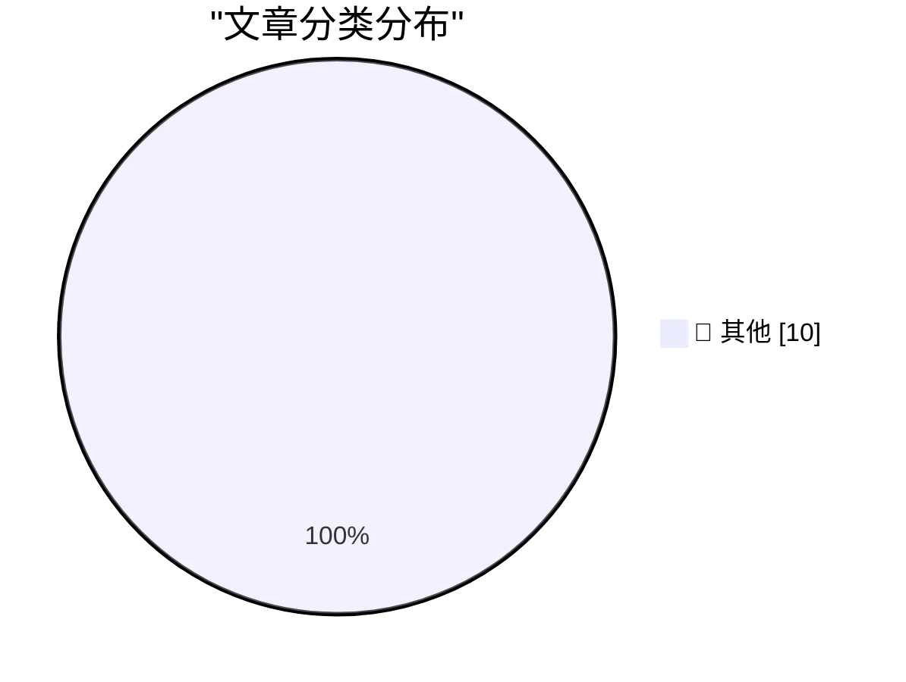

# 📰 AI 博客每日精选 — 2026-04-11

> 来自 Karpathy 推荐的 92 个顶级技术博客，AI 精选 Top 10

## 🏆 今日必读

🥇 **Pluralistic: Don't Be Evil (11 Apr 2026)**

[Pluralistic: Don't Be Evil (11 Apr 2026)](https://pluralistic.net/2026/04/11/obvious-terrible-ideas/) — pluralistic.net · 1 小时前 · 📝 其他

> ->->->->->->->->->->->->->->->->->->->->->->->->->->->->-> Top Sources: None --> Today's links Don't Be Evil : Evil genius is just a lack of shame. Hey look at this : Delights to delectate. Object per

🥈 **Reading List 04/11/2026**

[Reading List 04/11/2026](https://www.construction-physics.com/p/reading-list-04112026) — construction-physics.com · 3 小时前 · 📝 其他

> Reading List 04/11/2026 Is the Strait of Hormuz open yet, building code cost benefit analysis, Intel joining Terafab, sponge cities, and more. Brian Potter Apr 11, 2026 ∙ Paid 79 2 Share Antarctic sno

🥉 **Cheapest way to keep a UK mobile number using an eSIM**

[Cheapest way to keep a UK mobile number using an eSIM](https://shkspr.mobi/blog/2026/04/cheapest-way-to-keep-a-uk-mobile-number-using-an-esim/) — shkspr.mobi · 3 小时前 · 📝 其他

> Cheapest way to keep a UK mobile number using an eSIM eSIM mobile phone sim · 2 comments · 500 words · Viewed ~214 times I have an old mobile phone number that I'd like to keep. I think it is register

---

## 📊 数据概览

| 扫描源 | 抓取文章 | 时间范围 | 精选 |
|:---:|:---:|:---:|:---:|
| 89/92 | 2539 篇 → 10 篇 | 24h | **10 篇** |

### 分类分布

---

## 📝 其他

### 1. Pluralistic: Don't Be Evil (11 Apr 2026)

[Pluralistic: Don't Be Evil (11 Apr 2026)](https://pluralistic.net/2026/04/11/obvious-terrible-ideas/) — **pluralistic.net** · 1 小时前 · ⭐ 15/30

> ->->->->->->->->->->->->->->->->->->->->->->->->->->->->-> Top Sources: None --> Today's links Don't Be Evil : Evil genius is just a lack of shame. Hey look at this : Delights to delectate. Object per

---

### 2. Reading List 04/11/2026

[Reading List 04/11/2026](https://www.construction-physics.com/p/reading-list-04112026) — **construction-physics.com** · 3 小时前 · ⭐ 15/30

> Reading List 04/11/2026 Is the Strait of Hormuz open yet, building code cost benefit analysis, Intel joining Terafab, sponge cities, and more. Brian Potter Apr 11, 2026 ∙ Paid 79 2 Share Antarctic sno

---

### 3. Cheapest way to keep a UK mobile number using an eSIM

[Cheapest way to keep a UK mobile number using an eSIM](https://shkspr.mobi/blog/2026/04/cheapest-way-to-keep-a-uk-mobile-number-using-an-esim/) — **shkspr.mobi** · 3 小时前 · ⭐ 15/30

> Cheapest way to keep a UK mobile number using an eSIM eSIM mobile phone sim · 2 comments · 500 words · Viewed ~214 times I have an old mobile phone number that I'd like to keep. I think it is register

---

### 4. Your friends are hiding their best ideas from you

[Your friends are hiding their best ideas from you](https://idiallo.com/blog/your-friends-are-hiding-their-ideas?src=feed) — **idiallo.com** · 14 小时前 · ⭐ 15/30

> Back in college, the final project in our JavaScript class was to build a website. We were a group of four, and we built the best website in class. It was for a restaurant called the Coral Reef. We fo

---

### 5. ★ Let Us Learn to Show Our Friendship for a Man When He Is Alive and Not After He Is Dead

[★ Let Us Learn to Show Our Friendship for a Man When He Is Alive and Not After He Is Dead](https://daringfireball.net/2026/04/when_he_is_alive_and_not_after_he_is_dead) — **daringfireball.net** · 17 小时前 · ⭐ 15/30

> By John Gruber Archive The Talk Show Dithering Projects Contact Colophon Feeds / Social Twitter --> Sponsorship Zed — A font superfamily with extraordinary number of styles and extraordinary language 

---

### 6. Kākāpō parrots

[Kākāpō parrots](https://simonwillison.net/2026/Apr/10/kakapo/#atom-everything) — **simonwillison.net** · 20 小时前 · ⭐ 15/30

> Simon Willison’s Weblog Subscribe Sponsored by: Teleport &mdash; Connect agents to your infra in seconds with Teleport Beams. Built-in identity. Zero secrets. Get early access 10th April 2026 Lenny po

---

### 7. Premium: The Hater's Guide to OpenAI

[Premium: The Hater's Guide to OpenAI](https://www.wheresyoured.at/hatersguide-openai/) — **wheresyoured.at** · 22 小时前 · ⭐ 15/30

> Premium: The Hater's Guide to OpenAI Edward Zitron Apr 10, 2026 64 min read Table of Contents Soundtrack: The Dillinger Escape Plan — Setting Fire To Sleeping Giants In what The New Yorker’s Andrew Ma

---

### 8. OpenAI is nothing without its people

[OpenAI is nothing without its people](https://geohot.github.io//blog/jekyll/update/2026/04/11/openai-people.html) — **geohot.github.io** · 23 小时前 · ⭐ 15/30

> This is a response to this Sam Altman’s blog post . Sam Altman is not the bad guy. History comes from two places, great men and causes and forces. We have way too little of the former and way too much

---

### 9. ChatGPT voice mode is a weaker model

[ChatGPT voice mode is a weaker model](https://simonwillison.net/2026/Apr/10/voice-mode-is-weaker/#atom-everything) — **simonwillison.net** · 23 小时前 · ⭐ 15/30

> Simon Willison’s Weblog Subscribe Sponsored by: Teleport &mdash; Connect agents to your infra in seconds with Teleport Beams. Built-in identity. Zero secrets. Get early access 10th April 2026 I think 

---

### 10. Ed Bindels’s Apple Museum in Utrecht, Netherlands

[Ed Bindels’s Apple Museum in Utrecht, Netherlands](https://applemuseum.nl/) — **daringfireball.net** · 22 小时前 · ⭐ 15/30

> From pixel to perfection Step into a world where 50 years of Apple comes to life at the Apple Museum. Experience iconic moments and rare pieces in a space built to inspire. Get tickets View Apple's St

---

*生成于 2026-04-11 23:28 | 扫描 89 源 → 获取 2539 篇 → 精选 10 篇*
*基于 [Hacker News Popularity Contest 2025](https://refactoringenglish.com/tools/hn-popularity/) RSS 源列表*
