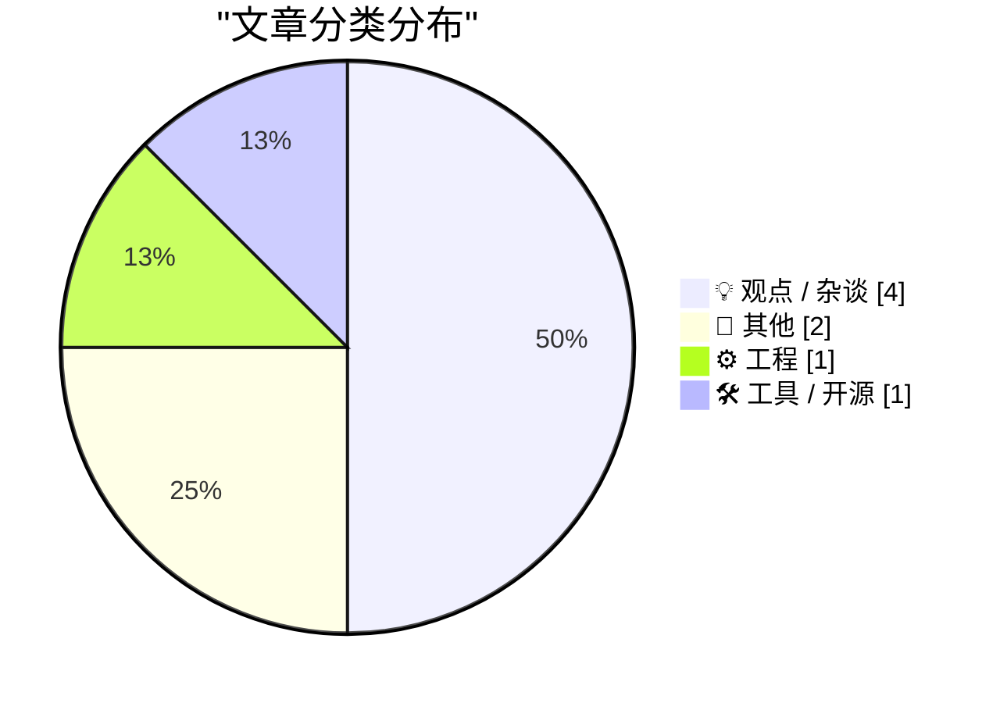
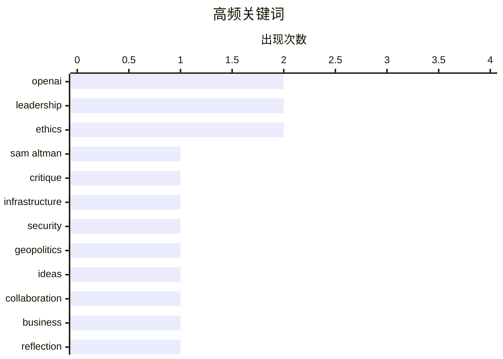

# 📰 AI 博客每日精选 — 2026-04-12

> 来自 Karpathy 推荐的 92 个顶级技术博客，AI 精选 Top 8

## 📝 今日看点

今日技术圈聚焦于AI巨头的信任危机与地缘网络威胁。OpenAI管理层动荡及财务数据争议引发对AI行业透明度的拷问，与此同时关键基础设施正面临地缘黑客组织的针对性攻击。技术从业者同时反思创意实践与知识共享的平衡之道，凸显出创新生态中的隐性竞争态势。

---

## 🏆 今日必读

🥇 **让我们学会在人生前而非死后表达对一个人的友谊**

[★ Let Us Learn to Show Our Friendship for a Man When He Is Alive and Not After He Is Dead](https://daringfireball.net/2026/04/when_he_is_alive_and_not_after_he_is_dead) — daringfireball.net · 18 小时前 · 💡 观点 / 杂谈

> 《纽约客》一篇长达16000字的深度报道聚焦Sam Altman的可信度问题，尤其调查了他在2023年底被OpenAI董事会解雇后又在一周内回归并清洗董事会的事件。多名前同事和董事会成员指控Altman具有‘病态的说谎倾向’和‘不受真相约束’的权力欲，已故程序员Aaron Swartz生前也曾警告友人‘Altman是不可信任的 sociopath’。报道虽未给出明确结论，但强调前沿AI公司的领导者需要具备超乎寻常的诚信度。

💡 **为什么值得读**: 该报道基于长达一年半的调查和多方信源，首次披露Aaron Swartz对Altman的警示性评价，为理解AI领域最具权力人物的真实性格提供了关键视角。

🏷️ Sam Altman, OpenAI, leadership, ethics

🥈 **《OpenAI黑粉指南》**

[Premium: The Hater's Guide to OpenAI](https://www.wheresyoured.at/hatersguide-openai/) — wheresyoured.at · 23 小时前 · 💡 观点 / 杂谈

> 文章揭露了Sam Altman及OpenAI在财务数据和公开声明中长期存在的欺骗模式。Altman曾声称公司年收入“远超130亿美元”，但实际收入可能仅勉强达到100亿美元，因OpenAI采用将最近四周收入乘以13的非常规计算方法，且未扣除需分给微软的20%分成。媒体未能有效监督OpenAI，反而合理化其误导性言论，助长了基于欺骗的商业行为。作者最终结论是Altman本质上不可信任，而OpenAI始终游走在真相边缘。

💡 **为什么值得读**: 该文通过具体财务细节和内部信源，尖锐批判了OpenAI的诚信问题，为关注AI行业伦理和商业真相的读者提供了稀缺的批判性视角。

🏷️ OpenAI, critique, leadership

🥉 **阅读清单 2026年4月11日**

[Reading List 04/11/2026](https://www.construction-physics.com/p/reading-list-04112026) — construction-physics.com · 4 小时前 · ⚙️ 工程

> 本周阅读清单聚焦建筑、基础设施和工业技术领域动态。霍尔木兹海峡虽达成停火协议但实际仍处于关闭状态，伊朗关联黑客组织正针对美国关键基础设施的罗克韦尔自动化PLC设备进行网络攻击。加州大学洛杉矶分校的研究指出建筑规范条款很少进行成本效益分析，例如美国电梯尺寸要求导致纽约基础电梯成本达15.8万美元而非瑞士的3.6万美元。微软考虑在高风险地区设计更具弹性的数据中心以应对安全威胁。

💡 **为什么值得读**: 该清单整合了地缘政治对关键技术设施的影响与建筑行业成本管控的深度分析，为基础设施安全与建筑经济学提供跨界视角。

🏷️ infrastructure, security, geopolitics

---

## 📊 数据概览

| 扫描源 | 抓取文章 | 时间范围 | 精选 |
|:---:|:---:|:---:|:---:|
| 89/92 | 2539 篇 → 8 篇 | 24h | **8 篇** |

### 分类分布



### 高频关键词



<details>
<summary>📈 纯文本关键词图（终端友好）</summary>

```
openai         │ ████████████████████ 2
leadership     │ ████████████████████ 2
ethics         │ ████████████████████ 2
sam altman     │ ██████████░░░░░░░░░░ 1
critique       │ ██████████░░░░░░░░░░ 1
infrastructure │ ██████████░░░░░░░░░░ 1
security       │ ██████████░░░░░░░░░░ 1
geopolitics    │ ██████████░░░░░░░░░░ 1
ideas          │ ██████████░░░░░░░░░░ 1
collaboration  │ ██████████░░░░░░░░░░ 1
```

</details>

### 🏷️ 话题标签

**openai**(2) · **leadership**(2) · **ethics**(2) · sam altman(1) · critique(1) · infrastructure(1) · security(1) · geopolitics(1) · ideas(1) · collaboration(1) · business(1) · reflection(1) · writing(1) · esim(1) · mobile(1) · uk(1) · apple(1) · museum(1) · history(1) · personal(1)

---

## 💡 观点 / 杂谈

### 1. 让我们学会在人生前而非死后表达对一个人的友谊

[★ Let Us Learn to Show Our Friendship for a Man When He Is Alive and Not After He Is Dead](https://daringfireball.net/2026/04/when_he_is_alive_and_not_after_he_is_dead) — **daringfireball.net** · 18 小时前 · ⭐ 28/30

> 《纽约客》一篇长达16000字的深度报道聚焦Sam Altman的可信度问题，尤其调查了他在2023年底被OpenAI董事会解雇后又在一周内回归并清洗董事会的事件。多名前同事和董事会成员指控Altman具有‘病态的说谎倾向’和‘不受真相约束’的权力欲，已故程序员Aaron Swartz生前也曾警告友人‘Altman是不可信任的 sociopath’。报道虽未给出明确结论，但强调前沿AI公司的领导者需要具备超乎寻常的诚信度。

🏷️ Sam Altman, OpenAI, leadership, ethics

---

### 2. 《OpenAI黑粉指南》

[Premium: The Hater's Guide to OpenAI](https://www.wheresyoured.at/hatersguide-openai/) — **wheresyoured.at** · 23 小时前 · ⭐ 27/30

> 文章揭露了Sam Altman及OpenAI在财务数据和公开声明中长期存在的欺骗模式。Altman曾声称公司年收入“远超130亿美元”，但实际收入可能仅勉强达到100亿美元，因OpenAI采用将最近四周收入乘以13的非常规计算方法，且未扣除需分给微软的20%分成。媒体未能有效监督OpenAI，反而合理化其误导性言论，助长了基于欺骗的商业行为。作者最终结论是Altman本质上不可信任，而OpenAI始终游走在真相边缘。

🏷️ OpenAI, critique, leadership

---

### 3. 你的朋友正把最好的想法藏起来不告诉你

[Your friends are hiding their best ideas from you](https://idiallo.com/blog/your-friends-are-hiding-their-ideas?src=feed) — **idiallo.com** · 15 小时前 · ⭐ 21/30

> 技术从业者常被朋友私下分享创业想法以寻求认可，但验证想法本身很少真正推动业务落地。作者早期曾通过Craigslist以100-200美元单价承接网站开发项目，却选择对同学隐瞒这一实践经历。如今AI工具（如ChatGPT）取代了开发者成为想法的即时验证者，能通过提示词快速生成应用demo（如localhost:3000链接或Lovable应用），但多数人仅满足于概念验证而非持续执行。作者以自身在Y Combinator创业学校的经历说明，想法的价值最终取决于执行而非外部认可。

🏷️ ideas, collaboration, business

---

### 4. 多元化：不作恶（2016年4月11日）

[Pluralistic: Don't Be Evil (11 Apr 2026)](https://pluralistic.net/2026/04/11/obvious-terrible-ideas/) — **pluralistic.net** · 2 小时前 · ⭐ 20/30

> 文章回顾了作者在1990年代末共同创立的点对点搜索推荐系统Opencola的失败经历。Opencola结合早期机器学习、Napster式P2P文件共享和网络爬虫技术，允许用户通过本地文件夹共享兴趣内容并连接同好。项目因风险投资人在微软收购时试图剥夺创始人股权而夭折，作者离职加入电子前线基金会（EFF），公司最终被Opentext收购。这一事件揭示了资本贪婪如何扼杀技术创新，并映射出当今科技行业的道德困境。

🏷️ ethics, reflection, writing

---

## 📝 其他

### 5. 荷兰乌得勒支的 Ed Bindels 苹果博物馆

[Ed Bindels’s Apple Museum in Utrecht, Netherlands](https://applemuseum.nl/) — **daringfireball.net** · 23 小时前 · ⭐ 14/30

> 该博物馆展示了苹果公司50年创新历史的实物收藏，涵盖从乔布斯车库起源到iPhone等标志性产品。展品包括Apple I、Apple II、Lisa等早期硬件，呈现了个人计算从像素到完美的演进历程。博物馆按时间和主题分区，通过罕见实物和故事连接苹果历史的关键节点。它体现了苹果将好奇心转化为改变世界产品的核心精神。

🏷️ Apple, museum, history

---

### 6. 鸮鹦鹉

[Kākāpō parrots](https://simonwillison.net/2026/Apr/10/kakapo/#atom-everything) — **simonwillison.net** · 21 小时前 · ⭐ 6/30

> Simon Willison 发布了一段关于鸮鹦鹉的播客片段，该片段摘自长达1小时40分钟的完整录音。内容由Lenny整理并分享，聚焦于这种独特鹦鹉的讨论。播客于2026年4月10日录制并发布。

🏷️ personal, blog, parrots

---

## ⚙️ 工程

### 7. 阅读清单 2026年4月11日

[Reading List 04/11/2026](https://www.construction-physics.com/p/reading-list-04112026) — **construction-physics.com** · 4 小时前 · ⭐ 25/30

> 本周阅读清单聚焦建筑、基础设施和工业技术领域动态。霍尔木兹海峡虽达成停火协议但实际仍处于关闭状态，伊朗关联黑客组织正针对美国关键基础设施的罗克韦尔自动化PLC设备进行网络攻击。加州大学洛杉矶分校的研究指出建筑规范条款很少进行成本效益分析，例如美国电梯尺寸要求导致纽约基础电梯成本达15.8万美元而非瑞士的3.6万美元。微软考虑在高风险地区设计更具弹性的数据中心以应对安全威胁。

🏷️ infrastructure, security, geopolitics

---

## 🛠 工具 / 开源

### 8. 使用 eSIM 保留英国手机号码的最便宜方法

[Cheapest way to keep a UK mobile number using an eSIM](https://shkspr.mobi/blog/2026/04/cheapest-way-to-keep-a-uk-mobile-number-using-an-esim/) — **shkspr.mobi** · 4 小时前 · ⭐ 18/30

> 文章探讨如何以最低成本长期保留英国手机号码用于接收短信验证码等用途。作者比较了 Spusu 等低价月租套餐和 1pmobile 等需要定期充值的预付费方案，最终选择 Lyca Mobile 的 eSIM 方案。通过特殊操作仅支付 10 英镑初始费用即可长期保留号码，且官方政策显示只需每年支付 15 英镑或每 120 天发送一条 23 便士短信即可维持号码有效性。理论上 10 英镑余额可维持号码长达 22 年，是目前性价比最高的 eSIM 保号方案。

🏷️ eSIM, mobile, UK

---

*生成于 2026-04-12 00:12 | 扫描 89 源 → 获取 2539 篇 → 精选 8 篇*
*基于 [Hacker News Popularity Contest 2025](https://refactoringenglish.com/tools/hn-popularity/) RSS 源列表*
