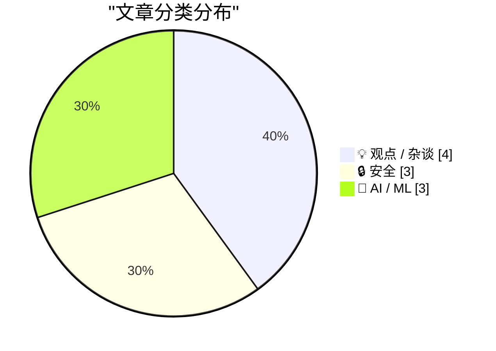
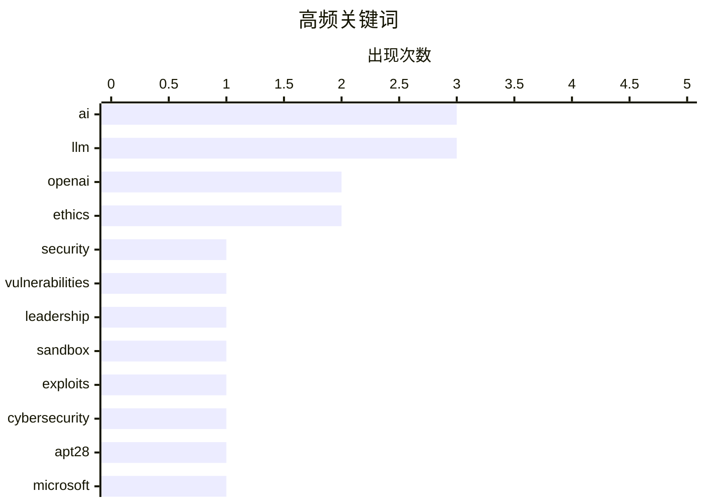

# 📰 AI 博客每日精选 — 2026-04-08

> 来自 Karpathy 推荐的 92 个顶级技术博客，AI 精选 Top 10

## 🏆 今日必读

🥇 **Y2K 2.0: The AI security reckoning**

[Y2K 2.0: The AI security reckoning](https://anildash.com/2026/04/10/y2k-2.0-ai-security/) — anildash.com · 2026-04-10 · 🔒 安全

> Y2K 2.0: The AI security reckoning 10 Apr 2026 2026-04-10 2026-04-10 /images/y2k-crt.jpg tech, ai, security, open-source, software, policy, coding tech ai security open-source software policy coding 2

🏷️ AI, security, vulnerabilities

🥈 **Premium: The Hater's Guide to OpenAI**

[Premium: The Hater's Guide to OpenAI](https://www.wheresyoured.at/hatersguide-openai/) — wheresyoured.at · 2026-04-11 · 💡 观点 / 杂谈

> Premium: The Hater's Guide to OpenAI Edward Zitron Apr 10, 2026 64 min read Table of Contents Soundtrack: The Dillinger Escape Plan — Setting Fire To Sleeping Giants In what The New Yorker’s Andrew Ma

🏷️ OpenAI, leadership, ethics

🥉 **Has Mythos just broken the deal that kept the internet safe?**

[Has Mythos just broken the deal that kept the internet safe?](https://martinalderson.com/posts/has-mythos-just-broken-the-deal-that-kept-the-internet-safe/?utm_source=rss&amp;utm_medium=rss&amp;utm_campaign=feed) — martinalderson.com · 2026-04-10 · 🔒 安全

> For nearly 20 years the deal has been simple: you click a link, arbitrary code runs on your device, and a stack of sandboxes keeps that code from doing anything nasty. Browser sandboxes for untrusted 

🏷️ AI, sandbox, exploits

---

## 📊 数据概览

| 扫描源 | 抓取文章 | 时间范围 | 精选 |
|:---:|:---:|:---:|:---:|
| 87/92 | 2496 篇 → 89 篇 | 24h | **10 篇** |

### 分类分布



### 高频关键词



<details>
<summary>📈 纯文本关键词图（终端友好）</summary>

```
ai              │ ████████████████████ 3
llm             │ ████████████████████ 3
openai          │ █████████████░░░░░░░ 2
ethics          │ █████████████░░░░░░░ 2
security        │ ███████░░░░░░░░░░░░░ 1
vulnerabilities │ ███████░░░░░░░░░░░░░ 1
leadership      │ ███████░░░░░░░░░░░░░ 1
sandbox         │ ███████░░░░░░░░░░░░░ 1
exploits        │ ███████░░░░░░░░░░░░░ 1
cybersecurity   │ ███████░░░░░░░░░░░░░ 1
```

</details>

### 🏷️ 话题标签

**ai**(3) · **llm**(3) · **openai**(2) · ethics(2) · security(1) · vulnerabilities(1) · leadership(1) · sandbox(1) · exploits(1) · cybersecurity(1) · apt28(1) · microsoft(1) · tokens(1) · claude code(1) · neurosymbolic ai(1) · coding agents(1) · technology adoption(1) · sam altman(1) · profile(1) · training(1)

---

## 💡 观点 / 杂谈

### 1. Premium: The Hater's Guide to OpenAI

[Premium: The Hater's Guide to OpenAI](https://www.wheresyoured.at/hatersguide-openai/) — **wheresyoured.at** · 2026-04-11 · ⭐ 27/30

> Premium: The Hater's Guide to OpenAI Edward Zitron Apr 10, 2026 64 min read Table of Contents Soundtrack: The Dillinger Escape Plan — Setting Fire To Sleeping Giants In what The New Yorker’s Andrew Ma

🏷️ OpenAI, leadership, ethics

---

### 2. The Center Has a Bias

[The Center Has a Bias](https://lucumr.pocoo.org/2026/4/11/the-center-has-a-bias/) — **lucumr.pocoo.org** · 2026-04-11 · ⭐ 26/30

> Armin Ronacher 's Thoughts and Writings blog archive projects travel talks about The Center Has a Bias written on April 11, 2026 Whenever a new technology shows up, the conversation quickly splits int

🏷️ AI, coding agents, technology adoption

---

### 3. ★ Let Us Learn to Show Our Friendship for a Man When He Is Alive and Not After He Is Dead

[★ Let Us Learn to Show Our Friendship for a Man When He Is Alive and Not After He Is Dead](https://daringfireball.net/2026/04/when_he_is_alive_and_not_after_he_is_dead) — **daringfireball.net** · 2026-04-11 · ⭐ 26/30

> By John Gruber Archive The Talk Show Dithering Projects Contact Colophon Feeds / Social Twitter --> Sponsorship Zed — A font superfamily with extraordinary number of styles and extraordinary language 

🏷️ Sam Altman, OpenAI, profile, ethics

---

### 4. AI Is Really Weird

[AI Is Really Weird](https://www.wheresyoured.at/ai-is-really-weird/) — **wheresyoured.at** · 2026-04-08 · ⭐ 26/30

> AI Is Really Weird Edward Zitron Apr 8, 2026 42 min read Table of Contents If you like this piece and want to support my independent reporting and analysis, why not subscribe to my premium newsletter?

🏷️ AI bubble, enterprise AI, Microsoft Copilot

---

## 🔒 安全

### 5. Y2K 2.0: The AI security reckoning

[Y2K 2.0: The AI security reckoning](https://anildash.com/2026/04/10/y2k-2.0-ai-security/) — **anildash.com** · 2026-04-10 · ⭐ 28/30

> Y2K 2.0: The AI security reckoning 10 Apr 2026 2026-04-10 2026-04-10 /images/y2k-crt.jpg tech, ai, security, open-source, software, policy, coding tech ai security open-source software policy coding 2

🏷️ AI, security, vulnerabilities

---

### 6. Has Mythos just broken the deal that kept the internet safe?

[Has Mythos just broken the deal that kept the internet safe?](https://martinalderson.com/posts/has-mythos-just-broken-the-deal-that-kept-the-internet-safe/?utm_source=rss&amp;utm_medium=rss&amp;utm_campaign=feed) — **martinalderson.com** · 2026-04-10 · ⭐ 27/30

> For nearly 20 years the deal has been simple: you click a link, arbitrary code runs on your device, and a stack of sandboxes keeps that code from doing anything nasty. Browser sandboxes for untrusted 

🏷️ AI, sandbox, exploits

---

### 7. Russia Hacked Routers to Steal Microsoft Office Tokens

[Russia Hacked Routers to Steal Microsoft Office Tokens](https://krebsonsecurity.com/2026/04/russia-hacked-routers-to-steal-microsoft-office-tokens/) — **krebsonsecurity.com** · 5 小时前 · ⭐ 27/30

> Hackers linked to Russia’s military intelligence units are using known flaws in older Internet routers to mass harvest authentication tokens from Microsoft Office users, security experts warned today.

🏷️ cybersecurity, APT28, Microsoft, tokens

---

## 🤖 AI / ML

### 8. The biggest advance in AI since the LLM

[The biggest advance in AI since the LLM](https://garymarcus.substack.com/p/the-biggest-advance-in-ai-since-the) — **garymarcus.substack.com** · 2026-04-12 · ⭐ 26/30

> The biggest advance in AI since the LLM Why Claude Code changes everything Gary Marcus Apr 11, 2026 299 119 36 Share Even Grok knows that neurosymbolic hybrid power is the future Claude Code , an impr

🏷️ Claude Code, neurosymbolic AI, LLM

---

### 9. Writing an LLM from scratch, part 32j -- Interventions: trying to train a better model in the cloud

[Writing an LLM from scratch, part 32j -- Interventions: trying to train a better model in the cloud](https://www.gilesthomas.com/2026/04/llm-from-scratch-32j-interventions-trying-to-train-a-better-model-in-the-cloud) — **gilesthomas.com** · 2026-04-10 · ⭐ 26/30

> el.dataset.currentDropdown = '') }"> Giles' blog About Contact Archives Categories Blogroll April 2026 (4) March 2026 (3) February 2026 (4) January 2026 (4) December 2025 (1) November 2025 (3) October

🏷️ LLM, training, cloud computing

---

### 10. Writing an LLM from scratch, part 32i -- Interventions: what is in the noise?

[Writing an LLM from scratch, part 32i -- Interventions: what is in the noise?](https://www.gilesthomas.com/2026/04/llm-from-scratch-32i-interventions-what-is-in-the-noise) — **gilesthomas.com** · 2 小时前 · ⭐ 26/30

> el.dataset.currentDropdown = '') }"> Giles' blog About Contact Archives Categories Blogroll April 2026 (4) March 2026 (3) February 2026 (4) January 2026 (4) December 2025 (1) November 2025 (3) October

🏷️ LLM, neural networks, interpretability

---

*生成于 2026-04-08 07:00 | 扫描 87 源 → 获取 2496 篇 → 精选 10 篇*
*基于 [Hacker News Popularity Contest 2025](https://refactoringenglish.com/tools/hn-popularity/) RSS 源列表*
