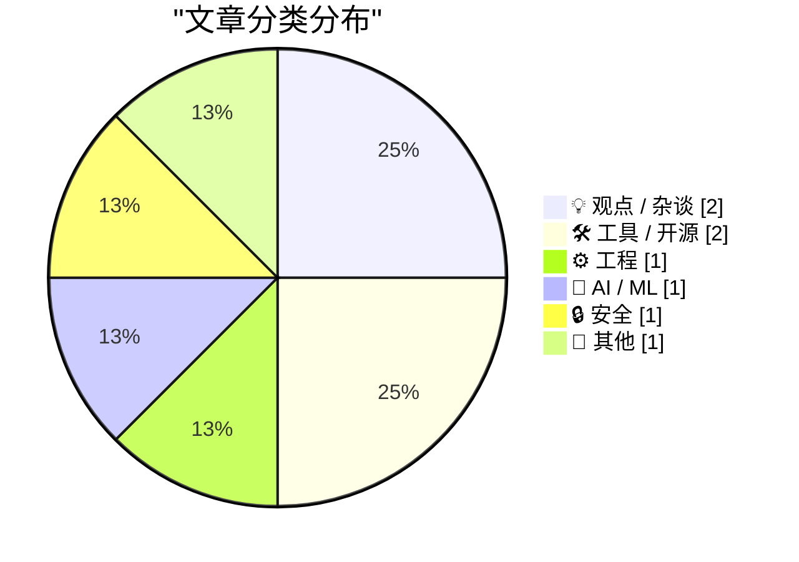
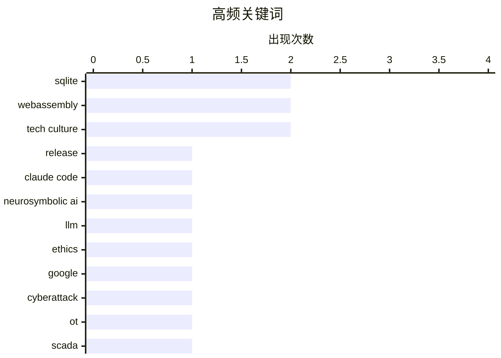

# 📰 AI 博客每日精选 — 2026-04-12

> 来自 Karpathy 推荐的 92 个顶级技术博客，AI 精选 Top 8

## 🏆 今日必读

🥇 **SQLite 3.53.0**

[SQLite 3.53.0](https://simonwillison.net/2026/Apr/11/sqlite/#atom-everything) — simonwillison.net · 7 小时前 · ⚙️ 工程

> SQLite 3.53.0因前序版本3.52.0被撤回，成为包含大量累积改进的重大更新。ALTER TABLE现已支持添加和删除NOT NULL与CHECK约束。新增了json_array_insert()函数及其jsonb等效函数。CLI模式获得显著改进，尤其是基于新库Query Results Formatter的结果格式化功能。作者还使用Claude Code将该格式化库编译为WebAssembly并搭建了在线试用界面。

💡 **为什么值得读**: 快速掌握SQLite重大版本中直接影响开发效率的关键新特性（如约束修改和CLI格式化），并了解LLM辅助将C库编译为WASM的实战案例。

🏷️ SQLite, release, WebAssembly

🥈 **自LLM以来AI领域的最大进步**

[The biggest advance in AI since the LLM](https://garymarcus.substack.com/p/the-biggest-advance-in-ai-since-the) — garymarcus.substack.com · 11 小时前 · 🤖 AI / ML

> Claude Code 是自 LLM 以来 AI 领域最大的进步，其核心在于采用了神经符号AI而非纯深度学习。泄露的源码显示，其核心是一个 3,167 行的 print.ts 内核，由于纯 LLM 过于概率化且不稳定，Anthropic 使用了经典符号 AI 技术来确保模式匹配的准确性。该内核包含 486 个分支点和 12 层嵌套的 IF-THEN 条件判断，运行在确定性符号循环中。AlphaFold、AlphaGeometry 等系统以及 Code Interpreter 同样属于神经符号 AI，Claude Code 的优势正源于这种神经与符号的结合，而非单纯的规模扩展。尽管目前还不完美，但巧妙结合符号 AI 比单纯扩大规模效果更好，AI 创新的范式已经改变，未来还需向知识、推理和世界模型驱动的方向演进。

💡 **为什么值得读**: 揭示了 Claude Code 依靠 3167 行符号逻辑内核取得突破的技术内幕，为理解 AI 从单纯规模扩展向神经符号架构演进的范式转变提供了关键洞察。

🏷️ Claude Code, neurosymbolic AI, LLM

🥉 **不作恶**

[Pluralistic: Don't Be Evil (11 Apr 2026)](https://pluralistic.net/2026/04/11/obvious-terrible-ideas/) — pluralistic.net · 13 小时前 · 💡 观点 / 杂谈

> 作者回顾了20世纪90年代末联合创办的P2P搜索与推荐系统Opencola的兴衰历程。Opencola结合了早期机器学习、Napster式P2P文件共享与网络爬虫技术，用户将喜好内容存入桌面文件夹，系统便从其他用户及开放网络抓取相关内容，并通过点赞/点踩机制持续优化偏好。微软提出收购时，风投试图夺走创始人全部股权，导致作者离职加入EFF，公司最终仅因税收抵免被Opentext收购。尽管资本贪婪摧毁了该极具潜力的项目，但原开发人员近期已在opencola.io重启了该系统。

💡 **为什么值得读**: 提供了早期机器学习与P2P技术结合的真实创业案例，并深刻揭示了资本贪婪如何摧毁技术创新，对理解互联网早期发展及创业陷阱极具参考价值。

🏷️ tech culture, ethics, Google

---

## 📊 数据概览

| 扫描源 | 抓取文章 | 时间范围 | 精选 |
|:---:|:---:|:---:|:---:|
| 88/92 | 2514 篇 → 8 篇 | 24h | **8 篇** |

### 分类分布



### 高频关键词



<details>
<summary>📈 纯文本关键词图（终端友好）</summary>

```
sqlite           │ ████████████████████ 2
webassembly      │ ████████████████████ 2
tech culture     │ ████████████████████ 2
release          │ ██████████░░░░░░░░░░ 1
claude code      │ ██████████░░░░░░░░░░ 1
neurosymbolic ai │ ██████████░░░░░░░░░░ 1
llm              │ ██████████░░░░░░░░░░ 1
ethics           │ ██████████░░░░░░░░░░ 1
google           │ ██████████░░░░░░░░░░ 1
cyberattack      │ ██████████░░░░░░░░░░ 1
```

</details>

### 🏷️ 话题标签

**sqlite**(2) · **webassembly**(2) · **tech culture**(2) · release(1) · claude code(1) · neurosymbolic ai(1) · llm(1) · ethics(1) · google(1) · cyberattack(1) · ot(1) · scada(1) · optimism(1) · pessimism(1) · demo(1) · esim(1) · 2fa(1) · mobile(1) · vintage(1) · collection(1)

---

## 💡 观点 / 杂谈

### 1. 不作恶

[Pluralistic: Don't Be Evil (11 Apr 2026)](https://pluralistic.net/2026/04/11/obvious-terrible-ideas/) — **pluralistic.net** · 13 小时前 · ⭐ 20/30

> 作者回顾了20世纪90年代末联合创办的P2P搜索与推荐系统Opencola的兴衰历程。Opencola结合了早期机器学习、Napster式P2P文件共享与网络爬虫技术，用户将喜好内容存入桌面文件夹，系统便从其他用户及开放网络抓取相关内容，并通过点赞/点踩机制持续优化偏好。微软提出收购时，风投试图夺走创始人全部股权，导致作者离职加入EFF，公司最终仅因税收抵免被Opentext收购。尽管资本贪婪摧毁了该极具潜力的项目，但原开发人员近期已在opencola.io重启了该系统。

🏷️ tech culture, ethics, Google

---

### 2. Optimism is not a personality flaw

[Optimism is not a personality flaw](https://www.joanwestenberg.com/optimism-is-not-a-personality-flaw/) — **joanwestenberg.com** · 2 小时前 · ⭐ 17/30

> 2026-04-12 // 7 min read Optimism is not a personality flaw AUTHOR // JA Westenberg ACCESS // true Photo by Cherry Laithang / Unsplash This newsletter is free to read, and it’ll stay that way. But if 

🏷️ optimism, tech culture, pessimism

---

## 🛠 工具 / 开源

### 3. SQLite Query Result Formatter Demo

[SQLite Query Result Formatter Demo](https://simonwillison.net/2026/Apr/11/sqlite-qrf/#atom-everything) — **simonwillison.net** · 7 小时前 · ⭐ 17/30

> Simon Willison’s Weblog Subscribe Sponsored by: Teleport &mdash; Connect agents to your infra in seconds with Teleport Beams. Built-in identity. Zero secrets. Get early access 11th April 2026 Tool SQL

🏷️ SQLite, WebAssembly, demo

---

### 4. Cheapest way to keep a UK mobile number using an eSIM

[Cheapest way to keep a UK mobile number using an eSIM](https://shkspr.mobi/blog/2026/04/cheapest-way-to-keep-a-uk-mobile-number-using-an-esim/) — **shkspr.mobi** · 15 小时前 · ⭐ 15/30

> Cheapest way to keep a UK mobile number using an eSIM eSIM mobile phone sim · 6 comments · 500 words · Viewed ~648 times I have an old mobile phone number that I'd like to keep. I think it is register

🏷️ eSIM, 2FA, mobile

---

## ⚙️ 工程

### 5. SQLite 3.53.0

[SQLite 3.53.0](https://simonwillison.net/2026/Apr/11/sqlite/#atom-everything) — **simonwillison.net** · 7 小时前 · ⭐ 23/30

> SQLite 3.53.0因前序版本3.52.0被撤回，成为包含大量累积改进的重大更新。ALTER TABLE现已支持添加和删除NOT NULL与CHECK约束。新增了json_array_insert()函数及其jsonb等效函数。CLI模式获得显著改进，尤其是基于新库Query Results Formatter的结果格式化功能。作者还使用Claude Code将该格式化库编译为WebAssembly并搭建了在线试用界面。

🏷️ SQLite, release, WebAssembly

---

## 🤖 AI / ML

### 6. 自LLM以来AI领域的最大进步

[The biggest advance in AI since the LLM](https://garymarcus.substack.com/p/the-biggest-advance-in-ai-since-the) — **garymarcus.substack.com** · 11 小时前 · ⭐ 23/30

> Claude Code 是自 LLM 以来 AI 领域最大的进步，其核心在于采用了神经符号AI而非纯深度学习。泄露的源码显示，其核心是一个 3,167 行的 print.ts 内核，由于纯 LLM 过于概率化且不稳定，Anthropic 使用了经典符号 AI 技术来确保模式匹配的准确性。该内核包含 486 个分支点和 12 层嵌套的 IF-THEN 条件判断，运行在确定性符号循环中。AlphaFold、AlphaGeometry 等系统以及 Code Interpreter 同样属于神经符号 AI，Claude Code 的优势正源于这种神经与符号的结合，而非单纯的规模扩展。尽管目前还不完美，但巧妙结合符号 AI 比单纯扩大规模效果更好，AI 创新的范式已经改变，未来还需向知识、推理和世界模型驱动的方向演进。

🏷️ Claude Code, neurosymbolic AI, LLM

---

## 🔒 安全

### 7. Reading List 04/11/2026

[Reading List 04/11/2026](https://www.construction-physics.com/p/reading-list-04112026) — **construction-physics.com** · 15 小时前 · ⭐ 19/30

> Reading List 04/11/2026 Is the Strait of Hormuz open yet, building code cost benefit analysis, Intel joining Terafab, sponge cities, and more. Brian Potter Apr 11, 2026 ∙ Paid 99 3 4 Share Antarctic s

🏷️ cyberattack, OT, SCADA

---

## 📝 其他

### 8. Pan American Luggage Labels

[Pan American Luggage Labels](https://ellafreire.com/collections/pan-american-luggage-labels) — **daringfireball.net** · 10 小时前 · ⭐ 3/30

> Collection: Pan American Luggage Labels Filter: Availability 0 selected Reset Availability In stock (61) In stock (61 products) Out of stock (0) Out of stock (0 products) In stock (61) In stock (61 pr

🏷️ vintage, collection

---

*生成于 2026-04-12 11:33 | 扫描 88 源 → 获取 2514 篇 → 精选 8 篇*
*基于 [Hacker News Popularity Contest 2025](https://refactoringenglish.com/tools/hn-popularity/) RSS 源列表*
