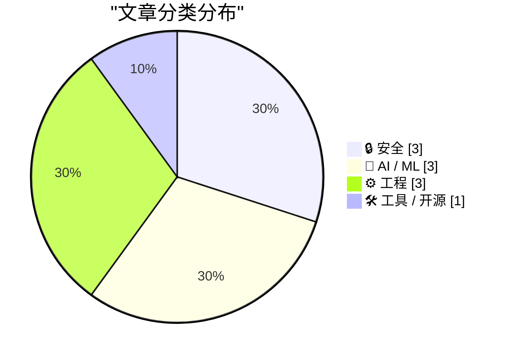
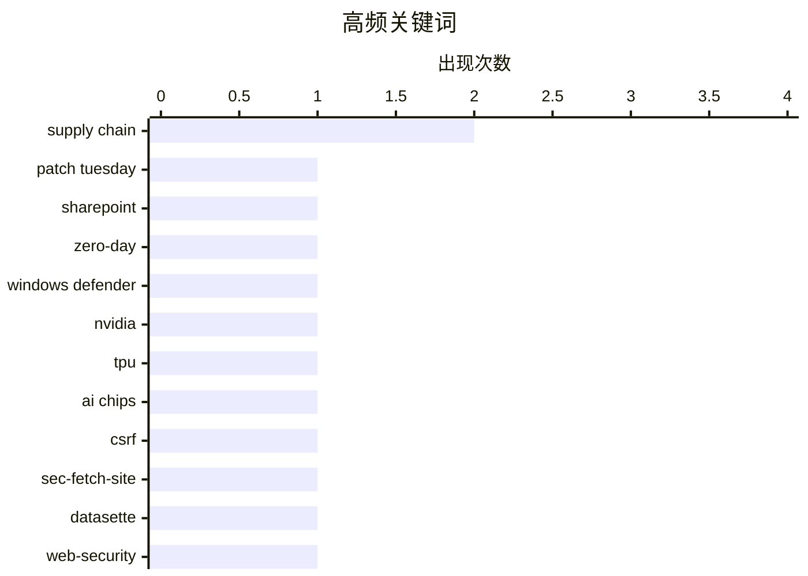

# 📰 AI 博客每日精选 — 2026-04-13

> 来自 Karpathy 推荐的 92 个顶级技术博客，AI 精选 Top 10

## 📝 今日看点

今天技术圈有三个关键词：安全加压、AI 基础设施博弈、工程体系重构。安全面上，一边是微软大规模补洞、零日与权限提升风险持续暴露，另一边开发者也在重新审视更现代的 Web 防护思路，说明“漏洞响应+机制升级”正同步推进。AI 方面，话题已从单纯拼模型转向拼算力、供应链和产品化落地，从英伟达的芯片护城河到 TTS、MoE 可视化工具，都在显示竞争正深入到底层能力与可用性。与此同时，开发工具链和硬件架构也在加速演进：更可复现的包管理、更轻依赖的软件栈，以及 Arm 等多架构模块化设备，正在把“灵活性”变成新一轮工程优化的核心。

---

## 🏆 今日必读

🥇 **补丁星期二：2026 年 4 月版**

[Patch Tuesday, April 2026 Edition](https://krebsonsecurity.com/2026/04/patch-tuesday-april-2026-edition/) — krebsonsecurity.com · 2026-04-15 · 🔒 安全

> 微软在本月补丁日一次性修复了 167 个安全漏洞，重点包括 SharePoint Server 的零日漏洞 CVE-2026-32201 和 Windows Defender 权限提升漏洞“BlueHammer”（CVE-2026-33825）。CVE-2026-32201 已被在野利用，攻击者可在受信任的 SharePoint 环境中伪造内容或界面，从而诱导钓鱼、数据篡改和后续社工攻击；BlueHammer 的公开利用代码在安装补丁后已被确认失效。同期，Google Chrome 修复了 2026 年第 4 个零日漏洞，Adobe Reader 也通过 4 月 11 日紧急更新修补了可导致远程代码执行且自 2025 年 11 月起疑似已被利用的 CVE-2026-34621。Rapid7 指出此次微软补丁总量创下该类别新高，且其中近 60 个与浏览器相关，作者还引用观点认为漏洞披露数量上升可能与 AI 能力扩展有关。文末强调浏览器补丁只有在彻底关闭并重启浏览器后才会生效，用户应养成定期重启浏览器的习惯。

💡 **为什么值得读**: 这篇内容把 2026 年 4 月最关键的在野漏洞、受影响产品和可立即执行的防护动作放在同一视角，能帮助安全团队快速确定补丁优先级。

🏷️ Patch Tuesday, SharePoint, zero-day, Windows Defender

🥈 **黄仁勋：TPU 竞争、为何应向中国出售芯片，以及英伟达的供应链护城河**

[Jensen Huang – TPU competition, why we should sell chips to China, & Nvidia’s supply chain moat](https://www.dwarkesh.com/p/jensen-huang) — dwarkesh.com · 2026-04-15 · 🤖 AI / ML

> 这期长访谈聚焦英伟达在 AI 计算竞争中的护城河：TPU 挑战、先进芯片供应链瓶颈、对华销售、是否下场做超大规模云，以及芯片架构策略。对话明确点出英伟达所依赖的关键链条，包括向台积电提交 GDS2 设计、逻辑芯片与交换芯片制造、与 SK Hynix/Micron/Samsung 的 HBM 配套，以及台湾 ODM 机架组装。围绕“软件会被 AI 商品化，英伟达是否也会被商品化”的质疑，黄仁勋回应称，真正难以被完全商品化的是把“电子转化为 token”并持续提升 token 价值的全过程。节目时间轴覆盖五个核心议题：供应链控制力是否是最大护城河、TPU 能否打破英伟达算力主导、为何不做 hyperscaler、是否应向中国卖 AI 芯片、以及为何不做多套不同芯片架构。整体呈现的主线观点是：英伟达的竞争力不只在单点软件或单颗芯片，而在跨设计、制造、封装与系统落地的整合能力。

💡 **为什么值得读**: 值得读在于它把外界最关心的五个英伟达战略问题放在同一场一手访谈里，能一次性看清“供应链+产品定位+地缘市场”如何共同构成其护城河。

🏷️ NVIDIA, TPU, AI chips, supply chain

🥉 **Datasette PR #2689：用 Sec-Fetch-Site 头保护替换基于令牌的 CSRF 防护**

[datasette PR #2689: Replace token-based CSRF with Sec-Fetch-Site header protection](https://simonwillison.net/2026/Apr/14/replace-token-based-csrf/#atom-everything) — simonwillison.net · 2026-04-15 · 🔒 安全

> Datasette 将 CSRF 防护从长期使用的基于令牌方案，切换为基于 Sec-Fetch-Site 请求头的新中间件。旧方案依赖 asgi-csrf Python 库，实现上需要在模板表单中插入 CSRF 相关代码，并且对希望从浏览器外部调用的 API 还要选择性关闭保护。新方案受 Filippo Valsorda 的研究启发，该思路已在 2025 年 8 月随 Go 1.25 一同落地，Datasette 现在采用了同类改动。此次 PR 删除了模板中所有相关 CSRF 令牌片段，移除了 datasette/hookspecs.py 中的 skip_csrf 插件钩子及其文档和测试，并同步更新了 CSRF 文档和升级指南。作者认为这种做法能替代原有令牌机制，并让 Datasette 的 CSRF 防护实现更简洁。

💡 **为什么值得读**: 值得读，因为它展示了一个真实框架如何借鉴 Go 1.25 的安全机制，简化 CSRF 防护实现并清理相关模板、插件接口和迁移文档。

🏷️ CSRF, Sec-Fetch-Site, Datasette, web-security

---

## 📊 数据概览

| 扫描源 | 抓取文章 | 时间范围 | 精选 |
|:---:|:---:|:---:|:---:|
| 89/92 | 2542 篇 → 99 篇 | 24h | **10 篇** |

### 分类分布



### 高频关键词



<details>
<summary>📈 纯文本关键词图（终端友好）</summary>

```
supply chain     │ ████████████████████ 2
patch tuesday    │ ██████████░░░░░░░░░░ 1
sharepoint       │ ██████████░░░░░░░░░░ 1
zero-day         │ ██████████░░░░░░░░░░ 1
windows defender │ ██████████░░░░░░░░░░ 1
nvidia           │ ██████████░░░░░░░░░░ 1
tpu              │ ██████████░░░░░░░░░░ 1
ai chips         │ ██████████░░░░░░░░░░ 1
csrf             │ ██████████░░░░░░░░░░ 1
sec-fetch-site   │ ██████████░░░░░░░░░░ 1
```

</details>

### 🏷️ 话题标签

**supply chain**(2) · **patch tuesday**(1) · **sharepoint**(1) · zero-day(1) · windows defender(1) · nvidia(1) · tpu(1) · ai chips(1) · csrf(1) · sec-fetch-site(1) · datasette(1) · web-security(1) · llm(1) · cybersecurity(1) · bug finding(1) · openbsd(1) · npm(1) · package registry(1) · open source(1) · developer ux(1)

---

## 🔒 安全

### 1. 补丁星期二：2026 年 4 月版

[Patch Tuesday, April 2026 Edition](https://krebsonsecurity.com/2026/04/patch-tuesday-april-2026-edition/) — **krebsonsecurity.com** · 2026-04-15 · ⭐ 27/30

> 微软在本月补丁日一次性修复了 167 个安全漏洞，重点包括 SharePoint Server 的零日漏洞 CVE-2026-32201 和 Windows Defender 权限提升漏洞“BlueHammer”（CVE-2026-33825）。CVE-2026-32201 已被在野利用，攻击者可在受信任的 SharePoint 环境中伪造内容或界面，从而诱导钓鱼、数据篡改和后续社工攻击；BlueHammer 的公开利用代码在安装补丁后已被确认失效。同期，Google Chrome 修复了 2026 年第 4 个零日漏洞，Adobe Reader 也通过 4 月 11 日紧急更新修补了可导致远程代码执行且自 2025 年 11 月起疑似已被利用的 CVE-2026-34621。Rapid7 指出此次微软补丁总量创下该类别新高，且其中近 60 个与浏览器相关，作者还引用观点认为漏洞披露数量上升可能与 AI 能力扩展有关。文末强调浏览器补丁只有在彻底关闭并重启浏览器后才会生效，用户应养成定期重启浏览器的习惯。

🏷️ Patch Tuesday, SharePoint, zero-day, Windows Defender

---

### 2. Datasette PR #2689：用 Sec-Fetch-Site 头保护替换基于令牌的 CSRF 防护

[datasette PR #2689: Replace token-based CSRF with Sec-Fetch-Site header protection](https://simonwillison.net/2026/Apr/14/replace-token-based-csrf/#atom-everything) — **simonwillison.net** · 2026-04-15 · ⭐ 25/30

> Datasette 将 CSRF 防护从长期使用的基于令牌方案，切换为基于 Sec-Fetch-Site 请求头的新中间件。旧方案依赖 asgi-csrf Python 库，实现上需要在模板表单中插入 CSRF 相关代码，并且对希望从浏览器外部调用的 API 还要选择性关闭保护。新方案受 Filippo Valsorda 的研究启发，该思路已在 2025 年 8 月随 Go 1.25 一同落地，Datasette 现在采用了同类改动。此次 PR 删除了模板中所有相关 CSRF 令牌片段，移除了 datasette/hookspecs.py 中的 skip_csrf 插件钩子及其文档和测试，并同步更新了 CSRF 文档和升级指南。作者认为这种做法能替代原有令牌机制，并让 Datasette 的 CSRF 防护实现更简洁。

🏷️ CSRF, Sec-Fetch-Site, Datasette, web-security

---

### 3. AI 网络安全并不是工作量证明

[AI cybersecurity is not proof of work](http://antirez.com/news/163) — **antirez.com** · 2026-04-16 · ⭐ 24/30

> AI 在网络安全中的作用被拿来类比工作量证明，但这里认为这个类比并不成立。哈希碰撞这类工作量证明问题会随着工作量增加而最终找到满足条件的结果，而代码漏洞发现不同：LLM 的执行虽然会走不同分支，但会逐渐触及代码状态与采样路径的上限，继续增加采样次数并不会无限带来新发现。对同一段代码反复采样时，限制因素最终不再是采样次数 M，而是模型的智能水平 I。OpenBSD 的 SACK bug 被用来说明这一点：较弱模型即使消耗无限多 token，也无法把起始窗口校验缺失、整数溢出以及本不应进入的 NULL 分支串联起来定位漏洞。结论是，未来网络安全竞争更像是“更好的模型和更快获得这些模型的能力获胜”，而不是“更多 GPU 或更多算力自然获胜”。

🏷️ LLM, cybersecurity, bug finding, OpenBSD

---

## 🤖 AI / ML

### 4. 黄仁勋：TPU 竞争、为何应向中国出售芯片，以及英伟达的供应链护城河

[Jensen Huang – TPU competition, why we should sell chips to China, & Nvidia’s supply chain moat](https://www.dwarkesh.com/p/jensen-huang) — **dwarkesh.com** · 2026-04-15 · ⭐ 26/30

> 这期长访谈聚焦英伟达在 AI 计算竞争中的护城河：TPU 挑战、先进芯片供应链瓶颈、对华销售、是否下场做超大规模云，以及芯片架构策略。对话明确点出英伟达所依赖的关键链条，包括向台积电提交 GDS2 设计、逻辑芯片与交换芯片制造、与 SK Hynix/Micron/Samsung 的 HBM 配套，以及台湾 ODM 机架组装。围绕“软件会被 AI 商品化，英伟达是否也会被商品化”的质疑，黄仁勋回应称，真正难以被完全商品化的是把“电子转化为 token”并持续提升 token 价值的全过程。节目时间轴覆盖五个核心议题：供应链控制力是否是最大护城河、TPU 能否打破英伟达算力主导、为何不做 hyperscaler、是否应向中国卖 AI 芯片、以及为何不做多套不同芯片架构。整体呈现的主线观点是：英伟达的竞争力不只在单点软件或单颗芯片，而在跨设计、制造、封装与系统落地的整合能力。

🏷️ NVIDIA, TPU, AI chips, supply chain

---

### 5. Gemini 3.1 Flash TTS

[Gemini 3.1 Flash TTS](https://simonwillison.net/2026/Apr/15/gemini-31-flash-tts/#atom-everything) — **simonwillison.net** · 2026-04-16 · ⭐ 24/30

> Google 发布了 Gemini 3.1 Flash TTS，这是一款可通过提示词控制的文本转语音模型。它通过标准 Gemini API 提供，模型 ID 为 gemini-3.1-flash-tts-preview，但只能输出音频文件。文中最突出的点是其提示方式非常细致，示例提示不仅包含说话风格、语速、动态、口音，还加入了场景设定、导演备注和示例台词。作者用官方示例生成语音后，又把提示中的口音设定从伦敦 Brixton 改成 Newcastle，以及 Exeter, Devon，并展示了对应结果。作者强调的重点是：这个 TTS 模型的可控性很强，而官方 prompting guide 的写法也相当出人意料。

🏷️ Gemini, TTS, audio, prompting

---

### 6. 一个用于可视化 MoE 专家路由的小工具

[A little tool to visualise MoE expert routing](https://martinalderson.com/posts/moe-expert-routing-visualization/?utm_source=rss&amp;utm_medium=rss&amp;utm_campaign=feed) — **martinalderson.com** · 2026-04-13 · ⭐ 24/30

> 文章聚焦于 Mixture of Experts（MoE）模型在生成 token 时，专家路由究竟如何实际发生，以及怎样把这种过程直观展示出来。作者做了一个可视化工具，支持选择不同提示词，动态查看每个 token 在各层触发了哪些专家；上方面板展示生成过程中的路由，下方面板累计生成全过程的热力图。这个工具基于修改后的 llama.cpp 构建，用于输出更多 profiling 数据，并在 Claude Code 的帮助下完成。作者观察到一个意外现象：对于任意一个较短提示词，大约有 25% 的专家完全不会激活，但换一个提示词后，处于休眠状态的又会是另一批专家。文中还提到 Gemma 26BA4 配合“CPU MoE”特性运行效果很好，并认为本地 MoE 推理在 GPU/CPU 间缓存特定专家等方向上还有性能优化空间。

🏷️ Mixture of Experts, LLM inference, llama.cpp, expert routing

---

## ⚙️ 工程

### 7. 星期二测试

[The Tuesday Test](https://nesbitt.io/2026/04/15/the-tuesday-test.html) — **nesbitt.io** · 2026-04-15 · ⭐ 24/30

> 文章聚焦于“声明式包管理器”该如何判断，并提出一个直接的判据：同一个包在周二安装与周三安装，是否可能产生不同结果。判断的关键不在清单文件表面是否像声明式配置，而在安装流程中是否允许执行任意代码、读取未在清单中声明的输入，例如时钟、环境变量、主机名或远程服务器返回的数据。作者进一步收窄问题范围：假设 registry 已冻结、lockfile 已固定、manifest 相同，真正要问的是安装过程是否还能接触这些隐藏输入；一旦可以，manifest 就不是全部事实。以 Homebrew 为例，formula 是带有 install 和 post_install 钩子的 Ruby 类，formula 中看似数据的 url、sha256、version、depends_on 也是在 Ruby 上下文中求值；cask 与 brew bundle 使用的 Brewfile 也同样是可执行 Ruby DSL，因此 Homebrew 从设计上就无法通过“星期二测试”。作者的结论是，知名包管理器里几乎没有多少真正能通过这一测试，而 Homebrew 为快速客户端额外提供 formula.json API，正说明其原生格式并非稳定的声明式包模式。

🏷️ package manager, declarative, reproducibility, supply chain

---

### 8. simdutf 现在可以在不依赖 libc++ 或 libc++abi 的情况下使用

[Simdutf Can Now Be Used Without libc++ or libc++abi](https://mitchellh.com/writing/simdutf-no-libcxx) — **mitchellh.com** · 2026-04-15 · ⭐ 24/30

> simdutf 已支持在不依赖 libc++ 与 libc++abi 的情况下构建和使用，这也是 libghostty-vt 最后一个残留的 libc++ 依赖。Ghostty 更新到这版 simdutf 构建后，已经能把 libc++ 和 libc++abi 从依赖中完全移除，不过相关上游 PR 在写作时尚未合并。去除 libc++ 依赖带来的直接收益包括更好的可移植性，适用于嵌入式、WebAssembly 和 freestanding 环境，同时简化交叉编译、减小二进制体积并让静态链接更简单。文章还区分了 libc++ 与 libc++abi：前者是提供 std::vector、std::string 等的 C++ 标准库，后者承载异常处理、虚函数表、RTTI 以及函数内静态变量线程安全初始化等 ABI 能力。为在保留现代 C++ 写法的同时摆脱标准库依赖，方案是引入 stl_compat.h 统一封装标准库类型；普通模式下它只是别名或直接包含标准类型，NO_LIBCXX 模式下则提供 simdutf 实际用到的最小兼容实现，例如自定义的 std::pair。

🏷️ simdutf, libc++, portability, C++

---

### 9. Framework 笔记本的 Arm 主板

[An Arm Mainboard for the Framework Laptop](https://www.jeffgeerling.com/blog/2026/arm-mainboard-for-framework-laptop/) — **jeffgeerling.com** · 2026-04-15 · ⭐ 23/30

> 文章围绕 Framework 13 可更换主板生态中的唯一 Arm 方案 MetaComputing AI PC Mainboard 展开，测试其在同一机身下与 x86、RISC-V 方案并列使用的实际表现。该主板采用 Cix P1 CP8180，配备 12 核 Arm SoC 和最高 32 GB 板载内存，接口规格基本延续 Framework 主板形态，但为了运行 Windows 11 需要关闭其中 4 个核心；作者确认其具备完整 BIOS 和 UEFI，官方还提供可写入 NVMe 启动、支持完整硬件功能的 Ubuntu 25.04 镜像。功耗方面，它相比作者测试过的其他 Cix P1 设备在待机功耗上有所改善，但距离理想状态仍有差距，与 MacBook Neo 以及 Framework 的低配 AMD 主板相比并不占优。图形与计算测试中，Arm Mali G720 Immortalis iGPU 可运行 Vulkan 和 OpenGL，GravityMark 得分 7,627，接近苹果 A14 的图形水平，也略快于 Intel N150 这类低端核显；Geekbench 与其他 Cix P1 设备大体一致，但在依赖内存的 FP64 HPL 基准中成绩只有 MS-R1 和 Orion O6 的大约一半。结论上，这块 Arm 主板证明了 Framework 13 在 x86、RISC-V、Arm 三种架构间切换的可行性，但 Cix P1 在功耗和部分性能表现上仍存在明显限制。

🏷️ Arm, Framework Laptop, hardware, Windows 11

---

## 🛠 工具 / 开源

### 10. 每个人都该从 npmx 借鉴的功能

[Features everyone should steal from npmx](https://nesbitt.io/2026/04/16/features-everyone-should-steal-from-npmx.html) — **nesbitt.io** · 2026-04-16 · ⭐ 24/30

> npmjs.com 长期停滞、问题追踪器多年需求无人响应的背景下，Daniel Roe 在 1 月推出了基于同一 npm registry 数据的替代前端 npmx.dev，并迅速吸引了上千个 issue 和 pull request、超过一百名贡献者。npmx 通过兼容 npmjs.com URL 替换域名的方式降低迁移成本，也在竞争压力下促使 npmjs.com 上线了暗色模式，并让一些长期搁置的工单重新被处理。文章将 npmx 视为包注册表网站的功能样板，列举了若干值得借鉴的能力：展示包含传递依赖的实际安装体积、公开 preinstall/install/postinstall 脚本及其拉取的 npx 包、以可展开树展示过时与存在漏洞的依赖链，并结合 OSV 标注风险。还包括将 semver 范围直接映射到当前解析出的具体版本、基于 e18e module-replacements 数据集给出原生 API 或更轻替代方案建议，以及展示 ESM/CJS、TypeScript 类型支持和 Node engine 范围等徽标信息。作者的判断是，即使不看 npm 官方网站后续是否持续改进，MIT 许可且附带可运行实现的 npmx 已经为包注册表产品提供了一套可直接参考和复用的设计清单。

🏷️ npm, package registry, open source, developer UX

---

*生成于 2026-04-13 07:00 | 扫描 89 源 → 获取 2542 篇 → 精选 10 篇*
*基于 [Hacker News Popularity Contest 2025](https://refactoringenglish.com/tools/hn-popularity/) RSS 源列表*
