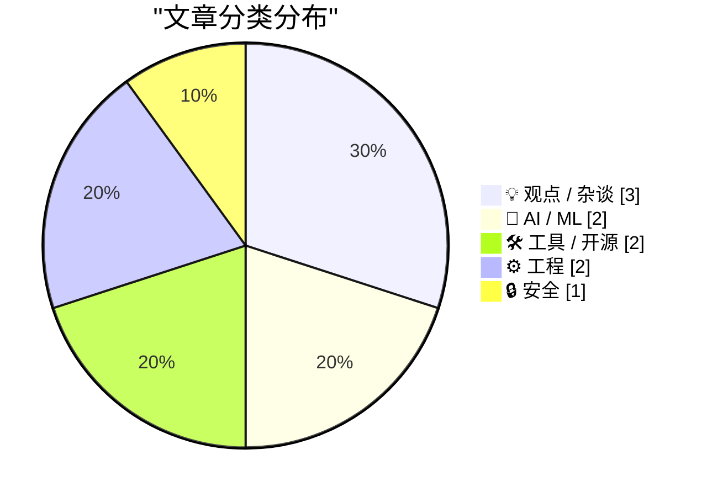
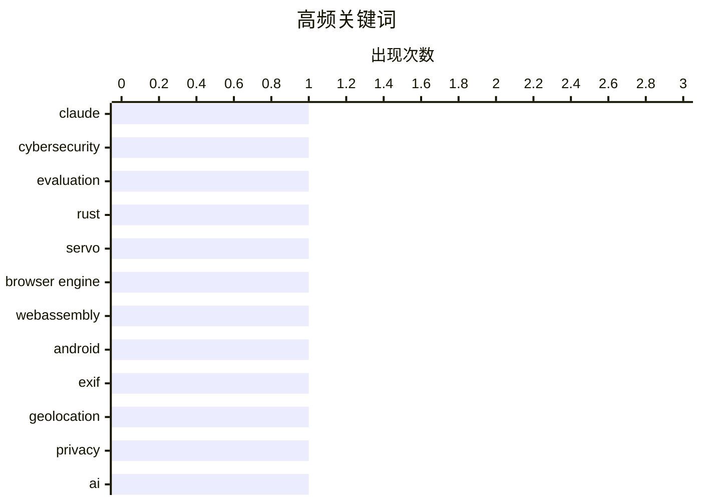

# 📰 AI 博客每日精选 — 2026-04-14

> 来自 Karpathy 推荐的 92 个顶级技术博客，AI 精选 Top 10

## 🏆 今日必读

🥇 **Claude Mythos, evaluated**

[Claude Mythos, evaluated](https://garymarcus.substack.com/p/claude-mythos-evaluated) — garymarcus.substack.com · 4 小时前 · 🤖 AI / ML

> Claude Mythos, evaluated How afraid should we be? Gary Marcus Apr 13, 2026 127 31 12 Share Very interesting evaluation from the UK’s AI Security Institute of the not yet publicly available Claude Myth

🏷️ Claude, cybersecurity, evaluation

🥈 **Exploring the new `servo` crate**

[Exploring the new `servo` crate](https://simonwillison.net/2026/Apr/13/servo-crate-exploration/#atom-everything) — simonwillison.net · 8 小时前 · 🛠 工具 / 开源

> Simon Willison’s Weblog Subscribe Sponsored by: Teleport &mdash; Connect agents to your infra in seconds with Teleport Beams. Built-in identity. Zero secrets. Get early access 13th April 2026 Research

🏷️ Rust, Servo, browser engine, WebAssembly

🥉 **Android now stops you sharing your location in photos**

[Android now stops you sharing your location in photos](https://shkspr.mobi/blog/2026/04/android-now-stops-you-sharing-your-location-in-photos/) — shkspr.mobi · 11 小时前 · 🔒 安全

> Android now stops you sharing your location in photos android geolocation geotagging google OpenBenches · 9 comments · 550 words · Viewed ~13,047 times My wife and I run OpenBenches . It's a niche lit

🏷️ Android, EXIF, geolocation, privacy

---

## 📊 数据概览

| 扫描源 | 抓取文章 | 时间范围 | 精选 |
|:---:|:---:|:---:|:---:|
| 89/92 | 2541 篇 → 21 篇 | 24h | **10 篇** |

### 分类分布



### 高频关键词



<details>
<summary>📈 纯文本关键词图（终端友好）</summary>

```
claude         │ ████████████████████ 1
cybersecurity  │ ████████████████████ 1
evaluation     │ ████████████████████ 1
rust           │ ████████████████████ 1
servo          │ ████████████████████ 1
browser engine │ ████████████████████ 1
webassembly    │ ████████████████████ 1
android        │ ████████████████████ 1
exif           │ ████████████████████ 1
geolocation    │ ████████████████████ 1
```

</details>

### 🏷️ 话题标签

**claude**(1) · **cybersecurity**(1) · **evaluation**(1) · rust(1) · servo(1) · browser engine(1) · webassembly(1) · android(1) · exif(1) · geolocation(1) · privacy(1) · ai(1) · investment(1) · bubble(1) · austerity(1) · moe(1) · llm(1) · visualization(1) · llama.cpp(1) · ai adoption(1)

---

## 💡 观点 / 杂谈

### 1. Pluralistic: Austerity creates fascism (13 Apr 2026)

[Pluralistic: Austerity creates fascism (13 Apr 2026)](https://pluralistic.net/2026/04/12/always-great/) — **pluralistic.net** · 17 小时前 · ⭐ 23/30

> ->->->->->->->->->->->->->->->->->->->->->->->->->->->->-> Top Sources: None --> Today's links Austerity creates fascism : We can't afford to not afford nice things. Hey look at this : Delights to del

🏷️ AI, investment, bubble, austerity

---

### 2. Quoting Steve Yegge

[Quoting Steve Yegge](https://simonwillison.net/2026/Apr/13/steve-yegge/#atom-everything) — **simonwillison.net** · 2 小时前 · ⭐ 22/30

> Simon Willison’s Weblog Subscribe Sponsored by: Teleport &mdash; Connect agents to your infra in seconds with Teleport Beams. Built-in identity. Zero secrets. Get early access 13th April 2026 The TL;D

🏷️ AI adoption, Google, engineering culture

---

### 3. Sometimes powerful people just do dumb shit

[Sometimes powerful people just do dumb shit](https://www.joanwestenberg.com/sometimes-powerful-people-just-do-dumb-shit/) — **joanwestenberg.com** · 17 小时前 · ⭐ 17/30

> 2026-04-13 // 7 min read Sometimes powerful people just do dumb shit AUTHOR // JA Westenberg ACCESS // true This newsletter is free to read, and it’ll stay that way. But if you want more - extra posts

🏷️ leadership, decision-making, history

---

## 🤖 AI / ML

### 4. Claude Mythos, evaluated

[Claude Mythos, evaluated](https://garymarcus.substack.com/p/claude-mythos-evaluated) — **garymarcus.substack.com** · 4 小时前 · ⭐ 26/30

> Claude Mythos, evaluated How afraid should we be? Gary Marcus Apr 13, 2026 127 31 12 Share Very interesting evaluation from the UK’s AI Security Institute of the not yet publicly available Claude Myth

🏷️ Claude, cybersecurity, evaluation

---

### 5. A little tool to visualise MoE expert routing

[A little tool to visualise MoE expert routing](https://martinalderson.com/posts/moe-expert-routing-visualization/?utm_source=rss&amp;utm_medium=rss&amp;utm_campaign=feed) — **martinalderson.com** · 23 小时前 · ⭐ 23/30

> I've been curious for a while about what's actually happening inside Mixture of Experts models when they generate tokens. Nearly every frontier model these days (Qwen 3.5, DeepSeek, Kimi, and almost c

🏷️ MoE, LLM, visualization, llama.cpp

---

## 🛠 工具 / 开源

### 6. Exploring the new `servo` crate

[Exploring the new `servo` crate](https://simonwillison.net/2026/Apr/13/servo-crate-exploration/#atom-everything) — **simonwillison.net** · 8 小时前 · ⭐ 24/30

> Simon Willison’s Weblog Subscribe Sponsored by: Teleport &mdash; Connect agents to your infra in seconds with Teleport Beams. Built-in identity. Zero secrets. Get early access 13th April 2026 Research

🏷️ Rust, Servo, browser engine, WebAssembly

---

### 7. Common Package Specification

[Common Package Specification](https://nesbitt.io/2026/04/13/common-package-specification.html) — **nesbitt.io** · 13 小时前 · ⭐ 22/30

> The Common Package Specification went stable in CMake 4.3 last year and the name caught my attention because it sounds like it might be addressing the cross-ecosystem dependency problem I’ve written a

🏷️ CMake, CPS, package-management

---

## ⚙️ 工程

### 8. Finding a duplicated item in an array of N integers in the range 1 to N − 1

[Finding a duplicated item in an array of N integers in the range 1 to N − 1](https://devblogs.microsoft.com/oldnewthing/20260413-00/?p=112227) — **devblogs.microsoft.com/oldnewthing** · 9 小时前 · ⭐ 19/30

> A colleague told me that there was an O ( N ) algorithm for finding a duplicated item in an array of N integers in the range 1 to N − 1. There must be a duplicate due to the pigeonhole principle. Ther

🏷️ algorithm, array, cycle-detection

---

### 9. Mathematical minimalism

[Mathematical minimalism](https://www.johndcook.com/blog/2026/04/13/the-smallest-math-library/) — **johndcook.com** · 8 小时前 · ⭐ 17/30

> Andrzej Odrzywolek recently posted an article on arXiv showing that you can obtain all the elementary functions from just the function and the constant 1. The following equations, taken from the paper

🏷️ mathematics, elementary-functions

---

## 🔒 安全

### 10. Android now stops you sharing your location in photos

[Android now stops you sharing your location in photos](https://shkspr.mobi/blog/2026/04/android-now-stops-you-sharing-your-location-in-photos/) — **shkspr.mobi** · 11 小时前 · ⭐ 23/30

> Android now stops you sharing your location in photos android geolocation geotagging google OpenBenches · 9 comments · 550 words · Viewed ~13,047 times My wife and I run OpenBenches . It's a niche lit

🏷️ Android, EXIF, geolocation, privacy

---

*生成于 2026-04-14 07:05 | 扫描 89 源 → 获取 2541 篇 → 精选 10 篇*
*基于 [Hacker News Popularity Contest 2025](https://refactoringenglish.com/tools/hn-popularity/) RSS 源列表*
