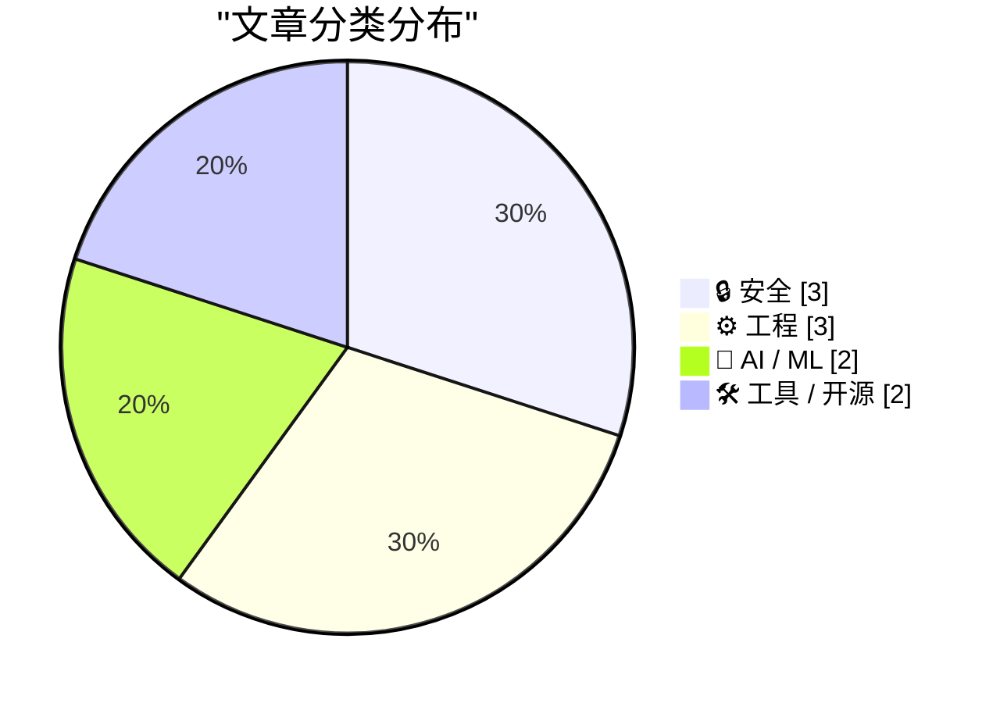
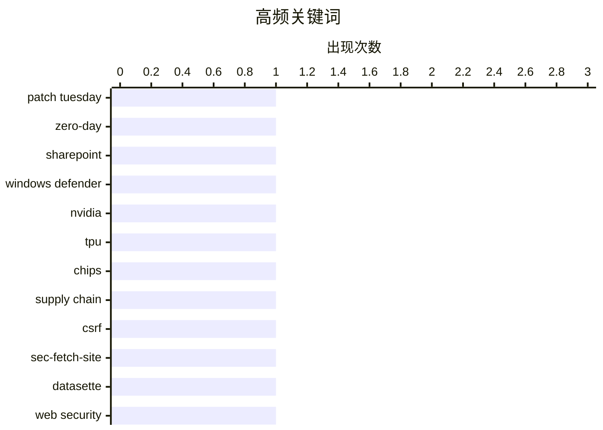

# 📰 AI 博客每日精选 — 2026-04-15

> 来自 Karpathy 推荐的 92 个顶级技术博客，AI 精选 Top 10

## 📝 今日看点

今天技术圈的主线，一边是安全压力持续上升，一边是基础设施与工具链在加速重构：微软单月大规模修补漏洞、CSRF 防护机制更新，说明安全治理正从“补漏洞”走向“换思路”。另一边，AI 竞争已不只是模型之争，而是芯片、供应链、接口能力和产品形态的全面博弈，从英伟达的产业护城河到可提示控制的语音模型，再到 AI 代理直接接管浏览与网络交互，战线正在快速外扩。与此同时，开发者生态也在追求更轻、更快、更可替代，从去除底层依赖到重做包管理前端，再到 Arm 硬件与现有平台的兼容尝试，软件与硬件栈都在朝更开放、更灵活的方向演进。

---

## 🏆 今日必读

🥇 **补丁星期二：2026 年 4 月版**

[Patch Tuesday, April 2026 Edition](https://krebsonsecurity.com/2026/04/patch-tuesday-april-2026-edition/) — krebsonsecurity.com · 1 小时前 · 🔒 安全

> 微软在本月补丁星期二一次性修复了 167 个漏洞，涵盖 Windows 及相关软件，其中包括 SharePoint Server 的零日漏洞 CVE-2026-32201，以及已被公开披露的 Windows Defender 权限提升漏洞“BlueHammer”（CVE-2026-33825）。CVE-2026-32201 已被攻击者利用，可在受信任的 SharePoint 环境中伪造内容或界面，进而诱导钓鱼、未授权数据篡改和社会工程攻击，组织风险因此显著上升。BlueHammer 的公开利用代码在安装本次补丁后已失效；与此同时，微软此次修复总量被称为历史第二高，且包含近 60 个浏览器相关漏洞。除微软外，Chrome 在 2026 年已修复第 4 个零日漏洞；Adobe 也在 4 月 11 日紧急修复了可导致远程代码执行的 CVE-2026-34621，该漏洞迹象显示自 2025 年 11 月起已被在野利用。文中还强调浏览器更新实践：需要彻底关闭并重启浏览器，更新才会真正生效。

💡 **为什么值得读**: 这篇内容把 2026 年 4 月最关键的在野漏洞与补丁优先级一次梳理清楚，能直接指导安全团队和个人用户的紧急更新决策。

🏷️ Patch Tuesday, zero-day, SharePoint, Windows Defender

🥈 **黄仁勋：TPU 竞争、为何应向中国销售芯片，以及英伟达供应链护城河**

[Jensen Huang – TPU competition, why we should sell chips to China, & Nvidia’s supply chain moat](https://www.dwarkesh.com/p/jensen-huang) — dwarkesh.com · 2026-04-15 · 🤖 AI / ML

> 内容围绕英伟达在 AI 计算中的竞争优势，重点追问其供应链掌控、TPU 竞争、中国市场销售、是否转型为 hyperscaler，以及芯片架构策略。访谈提到先进芯片生产链条涉及 TSMC、SK Hynix、Micron、Samsung 和台湾 ODM，问题核心之一是：当软件可能被 AI 商品化时，英伟达这种高度依赖外部制造的模式是否也会被商品化。黄仁勋回应称，真正难以被完全商品化的是把“电子转化为 token”的全过程，以及持续提升 token 价值的能力。节目还按时间轴展开 TPU 是否会打破英伟达对 AI 算力的控制、是否应继续向中国出售 AI 芯片、英伟达为何不直接做 hyperscaler、以及为何不采用多种不同芯片架构等议题。整体观点是，英伟达试图把自身定位为不仅是设计芯片的软件公司，而是掌握从算力生成到系统价值提升这一整条复杂链路的公司。

💡 **为什么值得读**: 值得读，因为它把英伟达最受关注的几个战略问题——供应链护城河、TPU 威胁、中国销售与业务边界——放在同一场长访谈里集中展开。

🏷️ Nvidia, TPU, chips, supply chain

🥉 **Datasette PR #2689：用 Sec-Fetch-Site 头保护替代基于令牌的 CSRF 防护**

[datasette PR #2689: Replace token-based CSRF with Sec-Fetch-Site header protection](https://simonwillison.net/2026/Apr/14/replace-token-based-csrf/#atom-everything) — simonwillison.net · 刚刚 · 🔒 安全

> Datasette 将 CSRF 防护从长期使用的基于令牌方案，切换为基于 Sec-Fetch-Site 请求头的新中间件。旧方案依赖 asgi-csrf Python 库，实现上需要在模板中的表单里分散加入 CSRF 相关代码，还要为需要被浏览器外部调用的 API 选择性关闭保护。新实现受 Filippo Valsorda 于 2025 年 8 月发表的研究启发，并已在同月随 Go 1.25 发布；Datasette 现已落地同类改动。此次 PR 同时移除了模板中不再需要的相关 CSRF 代码、删除了 datasette/hookspecs.py 中的 skip_csrf 插件钩子及其文档和测试，并更新了 CSRF 文档与升级指南。作者认为这种方式能替代旧的 token 机制，并让 Datasette 的 CSRF 处理更简化。

💡 **为什么值得读**: 值得读在于它展示了一个真实框架如何借鉴 Go 1.25 的安全机制演进，具体说明了替换 CSRF 方案后对模板、插件接口和文档的连带影响。

🏷️ CSRF, Sec-Fetch-Site, Datasette, web security

---

## 📊 数据概览

| 扫描源 | 抓取文章 | 时间范围 | 精选 |
|:---:|:---:|:---:|:---:|
| 89/92 | 2542 篇 → 68 篇 | 24h | **10 篇** |

### 分类分布



### 高频关键词



<details>
<summary>📈 纯文本关键词图（终端友好）</summary>

```
patch tuesday    │ ████████████████████ 1
zero-day         │ ████████████████████ 1
sharepoint       │ ████████████████████ 1
windows defender │ ████████████████████ 1
nvidia           │ ████████████████████ 1
tpu              │ ████████████████████ 1
chips            │ ████████████████████ 1
supply chain     │ ████████████████████ 1
csrf             │ ████████████████████ 1
sec-fetch-site   │ ████████████████████ 1
```

</details>

### 🏷️ 话题标签

**patch tuesday**(1) · **zero-day**(1) · **sharepoint**(1) · windows defender(1) · nvidia(1) · tpu(1) · chips(1) · supply chain(1) · csrf(1) · sec-fetch-site(1) · datasette(1) · web security(1) · llm(1) · cybersecurity(1) · bug finding(1) · openbsd(1) · gemini(1) · tts(1) · audio(1) · prompting(1)

---

## 🔒 安全

### 1. 补丁星期二：2026 年 4 月版

[Patch Tuesday, April 2026 Edition](https://krebsonsecurity.com/2026/04/patch-tuesday-april-2026-edition/) — **krebsonsecurity.com** · 1 小时前 · ⭐ 27/30

> 微软在本月补丁星期二一次性修复了 167 个漏洞，涵盖 Windows 及相关软件，其中包括 SharePoint Server 的零日漏洞 CVE-2026-32201，以及已被公开披露的 Windows Defender 权限提升漏洞“BlueHammer”（CVE-2026-33825）。CVE-2026-32201 已被攻击者利用，可在受信任的 SharePoint 环境中伪造内容或界面，进而诱导钓鱼、未授权数据篡改和社会工程攻击，组织风险因此显著上升。BlueHammer 的公开利用代码在安装本次补丁后已失效；与此同时，微软此次修复总量被称为历史第二高，且包含近 60 个浏览器相关漏洞。除微软外，Chrome 在 2026 年已修复第 4 个零日漏洞；Adobe 也在 4 月 11 日紧急修复了可导致远程代码执行的 CVE-2026-34621，该漏洞迹象显示自 2025 年 11 月起已被在野利用。文中还强调浏览器更新实践：需要彻底关闭并重启浏览器，更新才会真正生效。

🏷️ Patch Tuesday, zero-day, SharePoint, Windows Defender

---

### 2. Datasette PR #2689：用 Sec-Fetch-Site 头保护替代基于令牌的 CSRF 防护

[datasette PR #2689: Replace token-based CSRF with Sec-Fetch-Site header protection](https://simonwillison.net/2026/Apr/14/replace-token-based-csrf/#atom-everything) — **simonwillison.net** · 刚刚 · ⭐ 25/30

> Datasette 将 CSRF 防护从长期使用的基于令牌方案，切换为基于 Sec-Fetch-Site 请求头的新中间件。旧方案依赖 asgi-csrf Python 库，实现上需要在模板中的表单里分散加入 CSRF 相关代码，还要为需要被浏览器外部调用的 API 选择性关闭保护。新实现受 Filippo Valsorda 于 2025 年 8 月发表的研究启发，并已在同月随 Go 1.25 发布；Datasette 现已落地同类改动。此次 PR 同时移除了模板中不再需要的相关 CSRF 代码、删除了 datasette/hookspecs.py 中的 skip_csrf 插件钩子及其文档和测试，并更新了 CSRF 文档与升级指南。作者认为这种方式能替代旧的 token 机制，并让 Datasette 的 CSRF 处理更简化。

🏷️ CSRF, Sec-Fetch-Site, Datasette, web security

---

### 3. AI 网络安全并不是工作量证明

[AI cybersecurity is not proof of work](http://antirez.com/news/163) — **antirez.com** · 2026-04-16 · ⭐ 24/30

> 主题围绕 AI 在网络安全中的能力边界，反驳了“像工作量证明一样，堆更多算力就会赢”的类比。文中指出，哈希碰撞这类 proof of work 问题只要投入足够工作量，最终总能找到满足条件的输入；而漏洞发现不同，LLM 的多次执行虽然会走到不同分支，但基于代码状态和模型可探索的有效路径，覆盖范围会逐渐饱和。作者进一步提出，当针对同一段代码进行大量采样时，限制因素最终不再是采样次数 M，而是模型的智能水平 I。以 OpenBSD SACK bug 为例，作者认为较弱模型即使消耗无限 token 也无法真正串联起“起始窗口缺少校验、整数溢出、以及本不该为 NULL 的节点分支仍被进入”这几个条件，从而识别出该漏洞。结论是，未来网络安全竞赛更像是“更好的模型与更快获得这些模型的能力获胜”，而不是“更多 GPU 获胜”。

🏷️ LLM, cybersecurity, bug finding, OpenBSD

---

## ⚙️ 工程

### 4. Simdutf 现在可以在不依赖 libc++ 或 libc++abi 的情况下使用

[Simdutf Can Now Be Used Without libc++ or libc++abi](https://mitchellh.com/writing/simdutf-no-libcxx) — **mitchellh.com** · 2026-04-15 · ⭐ 24/30

> simdutf 新增了一种不依赖 libc++ 和 libc++abi 的构建方式，Ghostty 在更新后已经把这两个依赖从自身依赖链中完全移除。作者认为，去掉 libc++ 依赖能提升库的可移植性，覆盖嵌入式、WebAssembly 和 freestanding 环境，同时简化交叉编译、减小二进制体积，并让静态链接更简单。文中区分了 libc++ 与 libc++abi：前者是提供 std::vector、std::string 等的 C++ 标准库，后者负责异常处理、虚函数表、RTTI 以及函数内静态变量的线程安全初始化等 C++ ABI 能力。为让 simdutf 脱离 libc++ 而又继续使用现代 C++ 特性，方案是在 stl_compat.h 中集中封装标准库类型；普通模式下映射到标准库实现，NO_LIBCXX 模式下则提供只覆盖 simdutf 所需能力的兼容实现，例如自定义的 std::pair。作者同时说明，上游 simdutf 的 PR 在写作时尚未合并，Ghostty 只是已在主分支采用这套 no-libc++ 构建。

🏷️ C++, libc++, simdutf, portability

---

### 5. Framework 笔记本的 Arm 主板

[An Arm Mainboard for the Framework Laptop](https://www.jeffgeerling.com/blog/2026/arm-mainboard-for-framework-laptop/) — **jeffgeerling.com** · 2026-04-15 · ⭐ 23/30

> 文章聚焦于把 MetaComputing AI PC 这块 Arm 主板装入 Framework 13 后的硬件兼容性、功耗与性能表现。该主板基于 Cix P1（CP8180）12 核 SoC，评测样机为 16GB LPDDR5（最高可选 32GB），并保留 Framework 主板常见接口（M.2 NVMe、Wi‑Fi 模块位、四个 USB‑C 等）；作者也指出这颗芯片在 Windows 11 下需要禁用 4 个核心。软件方面，官方提供可完整硬件支持的 Ubuntu 25.04 镜像，设备具备支持 UEFI 的完整 BIOS，Windows for Arm 已能部分安装；在官方 Linux 下可运行 Vulkan 和 OpenGL。实测中，待机功耗相比作者测过的其他 Cix P1 设备有所改善但仍不理想；图形测试 GravityMark 为 7,627，接近 Apple A14 图形并略快于 Intel N150 级别核显。综合基准显示 Geekbench 与其他 Cix P1 机器大体一致，但内存密集型 FP64 HPL 成绩约为 MS-R1 和 Orion O6 的一半，单核仍由 Apple Silicon 领先，而 Cix 依靠 12 核与风扇在持续负载下缩小差距。

🏷️ ARM, Framework Laptop, Cix P1, power-consumption

---

### 6. 站在 Homebrew 的肩膀上

[Standing on the shoulders of Homebrew](https://nesbitt.io/2026/04/14/standing-on-the-shoulders-of-homebrew.html) — **nesbitt.io** · 13 小时前 · ⭐ 23/30

> zerobrew 和 nanobrew 被包装成 Homebrew 的快速替代品，但它们实际都依赖 homebrew-core、Homebrew CI 构建的 bottles，以及由 Homebrew 维护者维护的 cask 定义。两者跳过的正是 Homebrew 中那些更慢但也更复杂的部分，包括通过 Ruby 求值解析依赖、执行会修改文件系统的 post_install 钩子，以及处理无法简化为“下载压缩包并链接到前缀目录”的长尾 formula。nanobrew 明确列出 Ruby post_install hooks、带自定义选项的源码构建、Brewfile 条件块和复杂 Ruby DSL 尚不可用；zerobrew 在源码构建时则回退到“Homebrew 的 Ruby DSL”。性能对比里，zerobrew 报告在热缓存下安装 ffmpeg 提升 4.4 倍，nanobrew 可将同一操作降到 287 毫秒，但冷缓存成绩与 Homebrew 更接近，某些大 bottle 场景甚至更慢，因为大家都在等待同一个 CDN。作者认为，这类工具覆盖了最容易实现的 80% 场景，而它们之所以成立，很大程度上是因为 Homebrew 已通过 formula.json API 解决了无需执行 Ruby 即可获取元数据的问题；像内容寻址存储、APFS clonefile 和并行下载这样的优化，也并非脱离 Homebrew 才能实现。

🏷️ Homebrew, package manager, Rust, Zig

---

## 🤖 AI / ML

### 7. 黄仁勋：TPU 竞争、为何应向中国销售芯片，以及英伟达供应链护城河

[Jensen Huang – TPU competition, why we should sell chips to China, & Nvidia’s supply chain moat](https://www.dwarkesh.com/p/jensen-huang) — **dwarkesh.com** · 2026-04-15 · ⭐ 25/30

> 内容围绕英伟达在 AI 计算中的竞争优势，重点追问其供应链掌控、TPU 竞争、中国市场销售、是否转型为 hyperscaler，以及芯片架构策略。访谈提到先进芯片生产链条涉及 TSMC、SK Hynix、Micron、Samsung 和台湾 ODM，问题核心之一是：当软件可能被 AI 商品化时，英伟达这种高度依赖外部制造的模式是否也会被商品化。黄仁勋回应称，真正难以被完全商品化的是把“电子转化为 token”的全过程，以及持续提升 token 价值的能力。节目还按时间轴展开 TPU 是否会打破英伟达对 AI 算力的控制、是否应继续向中国出售 AI 芯片、英伟达为何不直接做 hyperscaler、以及为何不采用多种不同芯片架构等议题。整体观点是，英伟达试图把自身定位为不仅是设计芯片的软件公司，而是掌握从算力生成到系统价值提升这一整条复杂链路的公司。

🏷️ Nvidia, TPU, chips, supply chain

---

### 8. Gemini 3.1 Flash TTS

[Gemini 3.1 Flash TTS](https://simonwillison.net/2026/Apr/15/gemini-31-flash-tts/#atom-everything) — **simonwillison.net** · 2026-04-16 · ⭐ 24/30

> Google 发布了 Gemini 3.1 Flash TTS，这是一款可通过提示词控制的文本转语音模型。它通过标准 Gemini API 提供，模型 ID 为 gemini-3.1-flash-tts-preview，但只能输出音频文件。文章重点展示了其提示方式：不仅能写台词，还能用包含场景、语气、节奏、口音和导演说明的长提示来塑造声音表现。作者使用官方示例生成了音频，又把角色口音从伦敦 Brixton 改成 Newcastle，并进一步尝试 Exeter, Devon，来观察输出差异。作者对这套提示设计方式感到意外，也顺手让 Gemini 3.1 Pro 用 vibe code 做了一个试用界面。

🏷️ Gemini, TTS, audio, prompting

---

## 🛠 工具 / 开源

### 9. 每个人都该从 npmx 偷来的功能

[Features everyone should steal from npmx](https://nesbitt.io/2026/04/16/features-everyone-should-steal-from-npmx.html) — **nesbitt.io** · 2026-04-16 · ⭐ 23/30

> npmjs.com 在 GitHub 接手 npm 后长期停滞，而 Daniel Roe 于 1 月推出的替代前端 npmx.dev，短时间内就吸引了上千个 issue 和 pull request、超过一百名贡献者，并通过可直接替换 npmjs.com 域名的方式降低了迁移成本。竞争压力已经带来变化：npmjs.com 上线了暗色模式，这个功能曾在追踪器里高票等待多年，同时一些长期搁置的工单也开始被重新处理。文章把 npmx 视为包注册表网站的功能样板，列出多项可借鉴设计，包括传递安装体积、安装脚本披露、过期与漏洞依赖树、语义化版本范围的实际解析结果、模块替代建议，以及 ESM/CJS、TypeScript 类型和 Node 引擎范围等徽标信息。文中还强调，npmx 采用 MIT 许可证并提供可运行的参考实现，而 npm registry 和官网仍是闭源，这使这些功能不只是概念展示而是可直接参考的实现方案。

🏷️ npm, package registry, open source, frontend

---

### 10. zappa：一个由 AI 驱动的 mitmproxy

[zappa: an AI powered mitmproxy](https://geohot.github.io//blog/jekyll/update/2026/04/15/zappa-mitmproxy.html) — **geohot.github.io** · 7 小时前 · ⭐ 23/30

> 核心设想是让 AI 代替人直接与互联网交互，并在用户看到页面前先清理网页中的广告、弹窗、刺眼配色、动态元素和其他干扰内容。作者用 GPT-5.4 编写了一个基于 mitmproxy 的 zappa 代理，通过 Cerebras API 调用 Qwen，对经过代理的 HTML、JavaScript 和 CSS 进行处理后，再把“更好的版本”返回给用户。当前方案需要将 Firefox 配置为 SOCKS5 代理并安装 HTTPS 证书，同时要求记录全部日志；如果 AI 返回错误，就直接把错误返回给用户，而不是回退到未经转换的原始页面。文中展示了关闭 uBlock Origin 后的对比：Chrome 保持默认网页，Firefox 通过代理访问。作者认为更合适的产品形态可能是浏览器扩展，支持可定制提示词、像 uBlock Origin 过滤列表那样共享规则，并进一步走向带工具调用和站点状态的 agentic 方案。

🏷️ mitmproxy, Qwen, browser, ad blocking

---

*生成于 2026-04-15 07:00 | 扫描 89 源 → 获取 2542 篇 → 精选 10 篇*
*基于 [Hacker News Popularity Contest 2025](https://refactoringenglish.com/tools/hn-popularity/) RSS 源列表*
