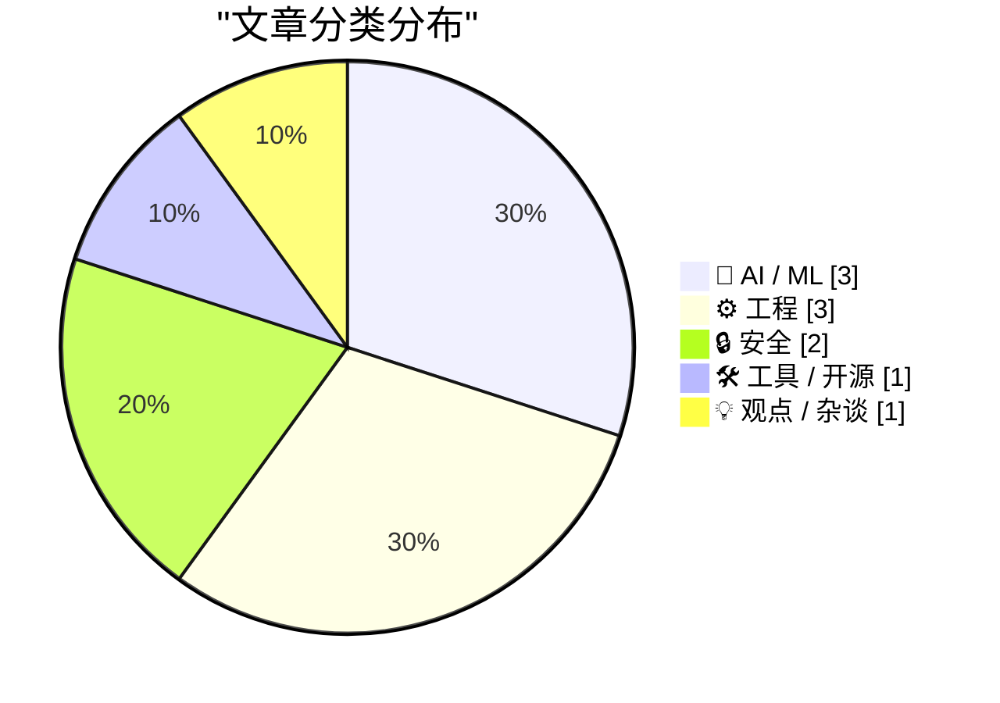
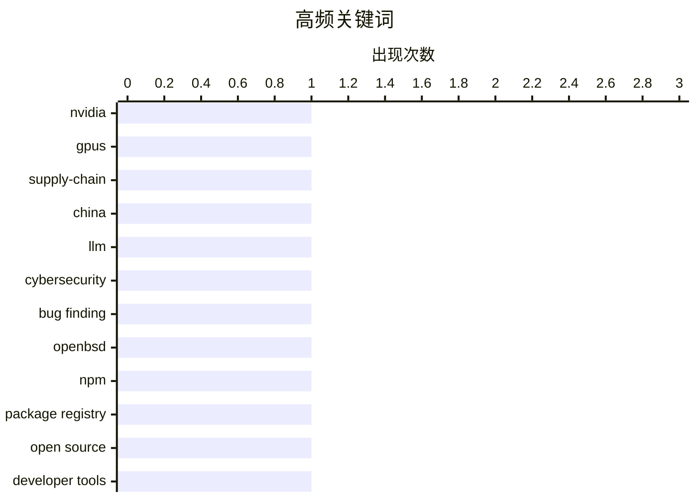

# 📰 AI 博客每日精选 — 2026-04-16

> 来自 Karpathy 推荐的 92 个顶级技术博客，AI 精选 Top 10

## 📝 今日看点

今天技术圈的主线，正在从“模型有多强”转向“谁掌控算力、供应链与分发入口”：从英伟达的芯片护城河，到 Google 推进可控语音生成，AI 竞争正全面深入基础设施层。与此同时，工程实践明显回归“可控性”和“确定性”，无论是摆脱特定运行库依赖、测试声明式包管理，还是重做 npm 体验，开发者都在重新追求更轻、更稳、更可复现的软件底座。安全领域也在给 AI 热潮降温，一边反思用算力神话解释漏洞挖掘的误区，一边用更贴近现代 Web 机制的防护手段替代旧方案，显示出行业正从概念炒作走向务实落地。

---

## 🏆 今日必读

🥇 **黄仁勋：TPU 竞争、为何应向中国出售芯片，以及英伟达的供应链护城河**

[Jensen Huang – TPU competition, why we should sell chips to China, & Nvidia’s supply chain moat](https://www.dwarkesh.com/p/jensen-huang) — dwarkesh.com · 7 小时前 · 🤖 AI / ML

> 对话围绕英伟达在 AI 芯片领域的竞争优势，重点追问 TPU 竞争、先进芯片供应链瓶颈、是否应继续向中国销售 AI 芯片，以及英伟达为何不直接下场做 hyperscaler。访谈明确点出英伟达所依赖的关键链条，包括向 TSMC 交付 GDS2 文件，由 TSMC 制造 logic dies 和 switches，再与 SK Hynix、Micron、Samsung 的 HBM 进行封装，最后由台湾 ODM 组装整机机架。黄仁勋回应“软件会被 AI 商品化、英伟达是否也会被商品化”的质疑时，强调“把电子转化为 token，并持续提升 token 的价值”这件事很难被彻底商品化。节目时间轴还涉及英伟达是否拥有对稀缺供应链的控制力、TPU 能否打破其在 AI 算力上的主导地位，以及英伟达为何不做多种不同芯片架构等问题。整体呈现的判断是，英伟达的优势不只是芯片设计本身，也来自围绕先进制造、封装、内存与整机集成形成的完整体系能力。

💡 **为什么值得读**: 值得读在于它把 AI 芯片竞争从单一产品之争，拉回到 TSMC、HBM、封装和整机组装共同构成的供应链体系层面，能帮助理解英伟达护城河究竟建立在哪里。

🏷️ Nvidia, GPUs, supply-chain, China

🥈 **AI 网络安全并不是工作量证明**

[AI cybersecurity is not proof of work](http://antirez.com/news/163) — antirez.com · 2026-04-16 · 🔒 安全

> 文章质疑把 AI 漏洞挖掘类比为“工作量证明”的说法，认为这种类比并不成立。工作量证明中，随着投入算力增加，找到满足条件的哈希解只是时间问题，因此资源更多的一方最终会占优；但程序漏洞并不是这种可通过无限堆算力稳定逼近的目标。作者认为，LLM 在同一段代码上的探索会逐步耗尽有意义的执行分支，样本次数 M 足够大后，上限不再取决于采样次数，而取决于模型的智能水平 I。以 OpenBSD 的 SACK 漏洞为例，作者指出，较弱模型即使消耗无限多 token，也无法把起始窗口校验缺失、整数溢出和本不应为 NULL 的分支进入这几个条件真正串联起来识别漏洞。结论是，未来网络安全竞争不会是“谁有更多 GPU 谁赢”，而是“谁拥有更强的模型，以及谁能更快使用这些模型”更关键。

💡 **为什么值得读**: 值得读，因为它给出了一个清晰的反驳框架，解释了为什么 AI 安全能力的上限更受模型智能影响，而不是单纯受算力堆叠影响。

🏷️ LLM, cybersecurity, bug finding, OpenBSD

🥉 **每个人都该从 npmx 偷走的功能**

[Features everyone should steal from npmx](https://nesbitt.io/2026/04/16/features-everyone-should-steal-from-npmx.html) — nesbitt.io · 2026-04-16 · 🛠 工具 / 开源

> npmjs.com 在 GitHub 接手 npm 后长期停滞，而 Daniel Roe 于 1 月推出的替代前端 npmx.dev 因可直接替换 npmjs.com 域名访问同一注册表数据，短时间内吸引了大量需求、议题和贡献者，也对官方站点形成了竞争压力。文章把 npmx 视为包注册表网站的功能样板，强调它不仅开源且采用 MIT 许可证，还为每项能力提供了可运行的参考实现。列举的重点功能包括：展示包含传递依赖在内的实际安装体积、公开 preinstall/install/postinstall 脚本及其会拉取的 npx 包、以可展开树形结构标注依赖的过时程度与 OSV 漏洞信息、显示 semver 范围当前解析到的具体版本。文中还提到模块替代建议、ESM/CJS/双格式与 TypeScript 类型和 Node engine 标记，以及跨代码托管平台的仓库统计等信息展示方式，并对比了 bundlephobia、packagephobia、deps.dev、crates.io、PyPI 等现有做法。结论是，无论 npmjs.com 是否持续改进，npmx 已经为构建包注册表网站提供了一套值得直接借鉴的功能清单和实现参考。

💡 **为什么值得读**: 值得读的原因在于，它把包注册表界面中真正影响安全性、选型效率和工具链兼容性的功能点拆解得很具体，适合产品设计者和开发者直接拿来参考。

🏷️ npm, package registry, open source, developer tools

---

## 📊 数据概览

| 扫描源 | 抓取文章 | 时间范围 | 精选 |
|:---:|:---:|:---:|:---:|
| 89/92 | 2542 篇 → 39 篇 | 24h | **10 篇** |

### 分类分布



### 高频关键词



<details>
<summary>📈 纯文本关键词图（终端友好）</summary>

```
nvidia           │ ████████████████████ 1
gpus             │ ████████████████████ 1
supply-chain     │ ████████████████████ 1
china            │ ████████████████████ 1
llm              │ ████████████████████ 1
cybersecurity    │ ████████████████████ 1
bug finding      │ ████████████████████ 1
openbsd          │ ████████████████████ 1
npm              │ ████████████████████ 1
package registry │ ████████████████████ 1
```

</details>

### 🏷️ 话题标签

**nvidia**(1) · **gpus**(1) · **supply-chain**(1) · china(1) · llm(1) · cybersecurity(1) · bug finding(1) · openbsd(1) · npm(1) · package registry(1) · open source(1) · developer tools(1) · gemini(1) · tts(1) · audio(1) · prompting(1) · c++(1) · libc++(1) · simdutf(1) · portability(1)

---

## 🤖 AI / ML

### 1. 黄仁勋：TPU 竞争、为何应向中国出售芯片，以及英伟达的供应链护城河

[Jensen Huang – TPU competition, why we should sell chips to China, & Nvidia’s supply chain moat](https://www.dwarkesh.com/p/jensen-huang) — **dwarkesh.com** · 7 小时前 · ⭐ 26/30

> 对话围绕英伟达在 AI 芯片领域的竞争优势，重点追问 TPU 竞争、先进芯片供应链瓶颈、是否应继续向中国销售 AI 芯片，以及英伟达为何不直接下场做 hyperscaler。访谈明确点出英伟达所依赖的关键链条，包括向 TSMC 交付 GDS2 文件，由 TSMC 制造 logic dies 和 switches，再与 SK Hynix、Micron、Samsung 的 HBM 进行封装，最后由台湾 ODM 组装整机机架。黄仁勋回应“软件会被 AI 商品化、英伟达是否也会被商品化”的质疑时，强调“把电子转化为 token，并持续提升 token 的价值”这件事很难被彻底商品化。节目时间轴还涉及英伟达是否拥有对稀缺供应链的控制力、TPU 能否打破其在 AI 算力上的主导地位，以及英伟达为何不做多种不同芯片架构等问题。整体呈现的判断是，英伟达的优势不只是芯片设计本身，也来自围绕先进制造、封装、内存与整机集成形成的完整体系能力。

🏷️ Nvidia, GPUs, supply-chain, China

---

### 2. Gemini 3.1 Flash TTS

[Gemini 3.1 Flash TTS](https://simonwillison.net/2026/Apr/15/gemini-31-flash-tts/#atom-everything) — **simonwillison.net** · 5 小时前 · ⭐ 24/30

> Google 发布了 Gemini 3.1 Flash TTS，这是一款可通过提示词控制的文本转语音模型。它通过标准 Gemini API 提供，模型 ID 为 gemini-3.1-flash-tts-preview，但只能输出音频文件。文中展示的提示词写法非常细致，不只包含台词，还会描述播音场景、语气、节奏、发声方式和口音等信息。作者用官方示例生成了一段音频后，又把设定改成“来自 Newcastle”以及“需要 Newcastle accent”，还补充测试了 Exeter, Devon 的版本，并放出了试听结果。作者同时提到，试用这个模型的界面是由 Gemini 3.1 Pro 通过 vibe code 生成的。

🏷️ Gemini, TTS, audio, prompting

---

### 3. 我这周学到了什么：预训练并行策略、蒸馏能否被阻止、Mythos 与网络安全均衡、流水线强化学习、为什么预训练运行会失败

[What I learned this week - Pretraining parallelisms, Can distillation be stopped, Mythos and the cybersecurity equilibrium, Pipeline RL, On why pretraining runs fails](https://www.dwarkesh.com/p/what-i-learned-april-15) — **dwarkesh.com** · 8 小时前 · ⭐ 22/30

> 内容围绕作者最近集中学习的几组 AI 与系统话题展开，其中现有摘录主要详细展开了预训练中的并行化问题。预训练 FLOPs 被写为 6ND：前向传播对每个参数每个 token 约为 2 FLOPs，反向传播约是前向的 2 倍，因此合计为 6。单卡无法承载不断增大的模型后，数据并行会先遇到 HBM 容量限制，文中以 B300 的 288GB 为例说明显存不足以容纳更大的权重和激活。随后转向 Fully Sharded Data Parallel，做法是让每个 GPU 只保存每层 1/N 的参数，在处理该层前通过 all-gather 取回完整权重，处理后再丢弃；它被强调为默认首选，因为权重通信可以与计算重叠，而张量并行、专家并行需要共享激活，流水线并行则会出现 bubble。作者的收获重点不在罗列并行策略，而在按“问题—失效—修补—再次失效”的链条去理解这些方案为何存在、何时该选用它们，以及硬件约束如何塑造 AI 训练方式。

🏷️ pretraining, parallelism, distillation, reinforcement-learning

---

## ⚙️ 工程

### 4. Simdutf 现在可以在不依赖 libc++ 或 libc++abi 的情况下使用

[Simdutf Can Now Be Used Without libc++ or libc++abi](https://mitchellh.com/writing/simdutf-no-libcxx) — **mitchellh.com** · 23 小时前 · ⭐ 24/30

> simdutf 新增了一种无需 libc++ 或 libc++abi 的构建方式，并已被 Ghostty 主分支采用，用来移除 libghostty-vt 最后一个剩余的 libc++ 依赖。这样做带来的好处包括更好的可移植性，适用于嵌入式、WebAssembly 和 freestanding 环境，同时简化交叉编译、减小二进制体积并让静态链接更简单。文章区分了 libc++ 与 libc++abi：前者是提供 std::vector、std::string 等能力的 C++ 标准库，后者则承担异常处理、虚函数表、RTTI 和函数内局部 static 变量线程安全初始化等 C++ ABI 机制。为在保持 simdutf 继续使用现代 C++ 特性的同时摆脱 libc++，方案是在 stl_compat.h 中集中封装标准库类型：正常模式下直接映射到标准库类型，NO_LIBCXX 模式下则提供仅覆盖 simdutf 实际需求的兼容实现，例如自定义的 std::pair。作者认为，作为通用低层库，simdutf 不应因为下游环境无法使用 libc++ 而被阻止使用，尽管相关 upstream PR 在写作时尚未合并，但初步反馈是积极的。

🏷️ C++, libc++, simdutf, portability

---

### 5. Framework 笔记本的一块 Arm 主板

[An Arm Mainboard for the Framework Laptop](https://www.jeffgeerling.com/blog/2026/arm-mainboard-for-framework-laptop/) — **jeffgeerling.com** · 8 小时前 · ⭐ 23/30

> Framework 13 可维修笔记本底盘被用于测试多种架构主板后，这次换上了唯一的 Arm 方案 MetaComputing AI PC 主板，核心是 12 核的 Cix P1 SoC，评测样机配备 16GB 焊接 LPDDR5，最高可选 32GB。硬件上它保留了 Framework 主板常见接口，包括 M.2 NVMe、Wi‑Fi 模块位、显示/键盘/音频/电池连接，以及 4 个可用于高速外设、供电和视频输出的 USB‑C；不过 Cix P1 仍有较高待机功耗问题，这块主板只做到了小幅改善，表现距离理想状态仍有差距。软件方面，MetaComputing 提供了带完整硬件支持的 Ubuntu 25.04 官方镜像，主板具备完整 BIOS 和 UEFI 支持；Windows on Arm 已能部分安装，但并非所有发行版都已支持。图形测试中，Arm Mali G720 Immortalis 集显可以运行 Vulkan 和 OpenGL，GravityMark 得分 7,627，接近 Apple A14 的图形水平，且略快于 Intel N150 这类芯片的低端核显。CPU 方面，Geekbench 与其他 Cix P1 设备基本一致，但内存密集型 FP64 HPL 成绩约为 MS-R1 和 Orion O6 的一半；单核性能不及 Apple Silicon，不过 12 核配置和风扇散热让它在持续负载下仍具一定竞争力。

🏷️ Arm, Framework, laptop, power

---

### 6. 星期二测试

[The Tuesday Test](https://nesbitt.io/2026/04/15/the-tuesday-test.html) — **nesbitt.io** · 13 小时前 · ⭐ 23/30

> 文章聚焦于判断包管理器是否真正具备稳定声明式包模式的问题，并提出了一个简单标准：同一个包在周二安装与周三安装，结果是否可能不同。判断的关键不在于清单文件表面是否像配置，而在于安装流程中是否会运行任意代码；一旦代码能读取时钟、环境变量、主机名或访问服务器，安装就依赖于未在清单中声明的隐藏输入。作者特别限定讨论范围为相同 manifest、相同 lockfile、相同 registry 内容的前提下，排除仓库版本变化、下架等数据层面的干扰。以 Homebrew 为例，formula 是带有 install 和 post_install 的 Ruby 类，类体会被客户端执行；看似数据字段的 url、sha256、version、depends_on 也都是 Ruby 上下文中的方法调用，cask 与 Brewfile 也是同类可执行 DSL。结论是，Homebrew 从设计上就无法通过“星期二测试”，这也是为什么必须额外提供 formula.json API，供快速客户端消费不可执行的结构化数据。

🏷️ package-manager, declarative, reproducibility, build-systems

---

## 🔒 安全

### 7. AI 网络安全并不是工作量证明

[AI cybersecurity is not proof of work](http://antirez.com/news/163) — **antirez.com** · 2026-04-16 · ⭐ 24/30

> 文章质疑把 AI 漏洞挖掘类比为“工作量证明”的说法，认为这种类比并不成立。工作量证明中，随着投入算力增加，找到满足条件的哈希解只是时间问题，因此资源更多的一方最终会占优；但程序漏洞并不是这种可通过无限堆算力稳定逼近的目标。作者认为，LLM 在同一段代码上的探索会逐步耗尽有意义的执行分支，样本次数 M 足够大后，上限不再取决于采样次数，而取决于模型的智能水平 I。以 OpenBSD 的 SACK 漏洞为例，作者指出，较弱模型即使消耗无限多 token，也无法把起始窗口校验缺失、整数溢出和本不应为 NULL 的分支进入这几个条件真正串联起来识别漏洞。结论是，未来网络安全竞争不会是“谁有更多 GPU 谁赢”，而是“谁拥有更强的模型，以及谁能更快使用这些模型”更关键。

🏷️ LLM, cybersecurity, bug finding, OpenBSD

---

### 8. Datasette PR #2689：用 Sec-Fetch-Site 标头保护替代基于令牌的 CSRF 防护

[datasette PR #2689: Replace token-based CSRF with Sec-Fetch-Site header protection](https://simonwillison.net/2026/Apr/14/replace-token-based-csrf/#atom-everything) — **simonwillison.net** · 23 小时前 · ⭐ 23/30

> Datasette 将 CSRF 防护机制从基于 CSRF token 的方案切换为基于 Sec-Fetch-Site 请求头的新中间件。旧方案依赖作者的 asgi-csrf Python 库，在模板中插入表单相关代码较为麻烦，还需要为打算从浏览器外部调用的 API 有选择地关闭 CSRF 防护。新实现受到 Filippo Valsorda 在 2025 年 8 月发表的研究以及 Go 1.25 同月落地方案的启发，并已在 Datasette 的 PR #2689 中合并。此次变更移除了模板中原本用于 CSRF 的相关内容，删除了 datasette/hookspecs.py 中的 skip_csrf 插件钩子及其文档和测试，同时更新了 CSRF 文档与升级指南来说明新机制。作者也提到这项 PR 的代码工作很大一部分由 Claude Code 完成，并经过其本人指导以及 GPT-5.4 交叉审阅。

🏷️ CSRF, Datasette, Sec-Fetch-Site, Go

---

## 🛠 工具 / 开源

### 9. 每个人都该从 npmx 偷走的功能

[Features everyone should steal from npmx](https://nesbitt.io/2026/04/16/features-everyone-should-steal-from-npmx.html) — **nesbitt.io** · 2026-04-16 · ⭐ 24/30

> npmjs.com 在 GitHub 接手 npm 后长期停滞，而 Daniel Roe 于 1 月推出的替代前端 npmx.dev 因可直接替换 npmjs.com 域名访问同一注册表数据，短时间内吸引了大量需求、议题和贡献者，也对官方站点形成了竞争压力。文章把 npmx 视为包注册表网站的功能样板，强调它不仅开源且采用 MIT 许可证，还为每项能力提供了可运行的参考实现。列举的重点功能包括：展示包含传递依赖在内的实际安装体积、公开 preinstall/install/postinstall 脚本及其会拉取的 npx 包、以可展开树形结构标注依赖的过时程度与 OSV 漏洞信息、显示 semver 范围当前解析到的具体版本。文中还提到模块替代建议、ESM/CJS/双格式与 TypeScript 类型和 Node engine 标记，以及跨代码托管平台的仓库统计等信息展示方式，并对比了 bundlephobia、packagephobia、deps.dev、crates.io、PyPI 等现有做法。结论是，无论 npmjs.com 是否持续改进，npmx 已经为构建包注册表网站提供了一套值得直接借鉴的功能清单和实现参考。

🏷️ npm, package registry, open source, developer tools

---

## 💡 观点 / 杂谈

### 10. 给 AI 末日论者的帕斯卡赌注

[Pluralistic: A Pascal's Wager for AI Doomers (16 Apr 2026)](https://pluralistic.net/2026/04/16/pascals-wager/) — **pluralistic.net** · 2026-04-16 · ⭐ 21/30

> 作者否认当前 AI 具有智能，也不认为现有这些虽令人印象深刻的统计技术会通向真正智能，因此把“AI 一旦变得有智能我们该怎么办”视为分散注意力，甚至可能是营销话术。真正让作者警惕的，是由大公司控制、强大到足以逃避监管的技术体系，以及这些技术与威权国家结合后带来的操控、监视、压榨劳动者和走向极权的风险。作者提到自己在蒙特利尔 Bronfman Lecture 上与 Astra Taylor、Yoshua Bengio 同台讨论，并介绍了 Bengio 发起的 Lawzero：它希望建立一个把 AI 作为“数字公共产品”来开发的国际联盟，强调开放、可审计、透明和安全。与 Bengio 认为 AI 会迅速增强、若缺少公共导向版本将造成操控、监控和文明级风险不同，作者更担心现实中的企业会借 AI 之名说服老板裁员，用根本做不好工作的 AI 替代员工。结论上，作者认为不必等到 AI 真正具备智能，人们就已经该为企业权力、监管失灵以及 AI 被用于反劳工和监控的现实后果感到警觉。

🏷️ AI, doomerism, policy, corporations

---

*生成于 2026-04-16 07:00 | 扫描 89 源 → 获取 2542 篇 → 精选 10 篇*
*基于 [Hacker News Popularity Contest 2025](https://refactoringenglish.com/tools/hn-popularity/) RSS 源列表*
