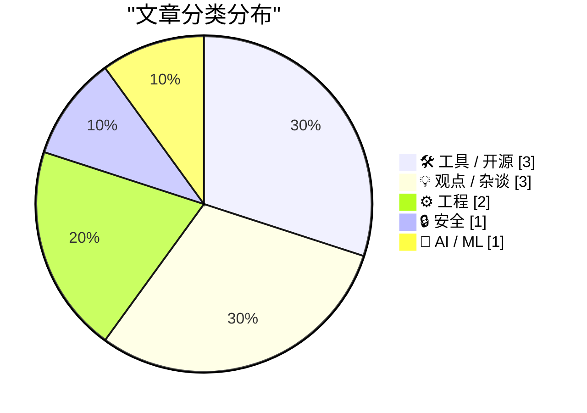
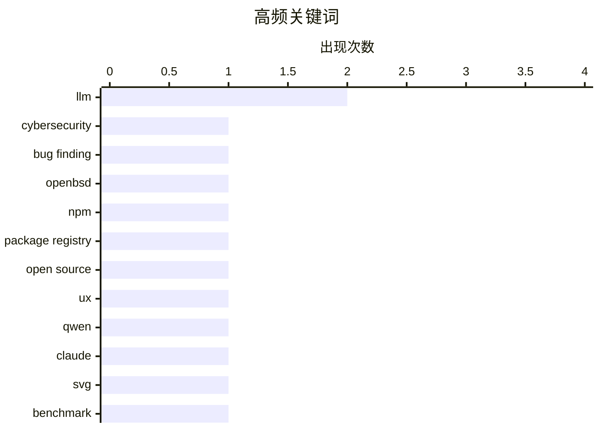

# 📰 AI 博客每日精选 — 2026-04-17

> 来自 Karpathy 推荐的 92 个顶级技术博客，AI 精选 Top 10

## 🏆 今日必读

🥇 **AI 网络安全并不是工作量证明**

[AI cybersecurity is not proof of work](http://antirez.com/news/163) — antirez.com · 12 小时前 · 🔒 安全

> 文章反驳了把 AI 漏洞挖掘能力类比为“工作量证明（Proof of Work）”的观点。作者指出，PoW 的本质是算力越多最终越可能赢，而代码漏洞发现受限于代码状态分支与模型可探索的有效路径，采样次数增加后上限不再是调用次数 M，而是模型智能水平 I。文中以 OpenBSD SACK bug 为例，认为较弱模型即使消耗无限 token 也无法把多个关键条件串联起来推出真实漏洞。作者还强调，弱模型有时会“蒙对”局部问题，但这不等于真正理解并发现该漏洞。结论是未来网络安全竞争更像“模型质量与获取速度之争”，而不是“谁有更多 GPU 谁赢”。

💡 **为什么值得读**: 它把“堆算力能否替代模型能力”这个常见误解讲得很清楚，并用具体漏洞案例说明了为什么高质量模型才是关键。

🏷️ LLM, cybersecurity, bug finding, OpenBSD

🥈 **每个人都该从 npmx 借鉴的功能**

[Features everyone should steal from npmx](https://nesbitt.io/2026/04/16/features-everyone-should-steal-from-npmx.html) — nesbitt.io · 13 小时前 · 🛠 工具 / 开源

> npmjs.com 长期停滞的背景下，npmx.dev 作为同一 npm registry 的替代前端迅速吸引了大量需求与社区贡献，并形成了对官方站点的竞争压力。文章强调 npmx 的可迁移设计（npmjs.com 链接可直接替换域名访问）和开源属性（MIT 许可、可直接参考实现），使其不仅是替代站点，也是包注册表产品设计的“功能样板库”。文中列举了多项可借鉴能力：显示传递依赖后的实际安装体积、公开 preinstall/install/postinstall 脚本及其 npx 调用、以树形方式标注过期与 OSV 漏洞依赖、展示 semver 范围到具体解析版本、提供模块替代建议。还包括与工具链兼容性相关的信息标记，如 ESM/CJS/双格式、TypeScript 类型提供方式和 Node 引擎范围，并提到多生态已有类似先例（如 deps.dev、crates.io 的相关字段）。作者的核心判断是：即便不考虑与 npmjs.com 的竞争结果，npmx 已经沉淀出一组可被其他包注册表直接复用的高价值功能实践。

💡 **为什么值得读**: 它把“包页面该展示什么才真正帮助选型与安全判断”拆成了可落地的具体清单，而且多数都有开源实现可直接参考。

🏷️ npm, package registry, open source, UX

🥉 **我笔记本上的 Qwen3.6-35B-A3B 画出了比 Claude Opus 4.7 更好的鹈鹕**

[Qwen3.6-35B-A3B on my laptop drew me a better pelican than Claude Opus 4.7](https://simonwillison.net/2026/Apr/16/qwen-beats-opus/#atom-everything) — simonwillison.net · 5 小时前 · 🤖 AI / ML

> 作者用“骑自行车的鹈鹕”这个玩笑式 SVG 基准，对比了当天发布的 Alibaba Qwen3.6-35B-A3B 与 Anthropic Claude Opus 4.7。Qwen 的结果来自在 MacBook Pro M5 上通过 LM Studio 运行的 20.9GB 量化模型 Qwen3.6-35B-A3B-UD-Q4_K_S.gguf，作者认为其输出优于 Opus 4.7，指出后者把自行车车架画错了；Opus 在 thinking_level:max 的二次尝试也未明显改善。为排除“针对该题训练”的质疑，作者又使用“生成骑独轮车的火烈鸟 SVG”做备份测试，仍将结果判给 Qwen。作者回顾称，这个基准本意是讽刺模型比较的荒诞，但过去“鹈鹕质量”和模型实用性通常存在相关性，如早期结果很差、后期明显提升。结论是这次相关性似乎被打破：作者不认为 21GB 的 Qwen 量化版整体能力会超过 Anthropic 最新专有模型，但在该 SVG 绘图任务上，笔记本本地运行的 Qwen3.6-35B-A3B 目前表现更好。

💡 **为什么值得读**: 它用可复现的本地部署与对照提示，展示了“小模型量化本地跑”在特定生成任务上击败顶级闭源模型的反直觉案例，能帮助读者校准对基准与模型能力关系的判断。

🏷️ Qwen, Claude, SVG, benchmark

---

## 📊 数据概览

| 扫描源 | 抓取文章 | 时间范围 | 精选 |
|:---:|:---:|:---:|:---:|
| 89/92 | 2542 篇 → 25 篇 | 24h | **10 篇** |

### 分类分布



### 高频关键词



<details>
<summary>📈 纯文本关键词图（终端友好）</summary>

```
llm              │ ████████████████████ 2
cybersecurity    │ ██████████░░░░░░░░░░ 1
bug finding      │ ██████████░░░░░░░░░░ 1
openbsd          │ ██████████░░░░░░░░░░ 1
npm              │ ██████████░░░░░░░░░░ 1
package registry │ ██████████░░░░░░░░░░ 1
open source      │ ██████████░░░░░░░░░░ 1
ux               │ ██████████░░░░░░░░░░ 1
qwen             │ ██████████░░░░░░░░░░ 1
claude           │ ██████████░░░░░░░░░░ 1
```

</details>

### 🏷️ 话题标签

**llm**(2) · **cybersecurity**(1) · **bug finding**(1) · openbsd(1) · npm(1) · package registry(1) · open source(1) · ux(1) · qwen(1) · claude(1) · svg(1) · benchmark(1) · infosec(1) · industry(1) · punditry(1) · datasette(1) · sqlite(1) · csrf(1) · plugin(1) · ai(1)

---

## 🛠 工具 / 开源

### 1. 每个人都该从 npmx 借鉴的功能

[Features everyone should steal from npmx](https://nesbitt.io/2026/04/16/features-everyone-should-steal-from-npmx.html) — **nesbitt.io** · 13 小时前 · ⭐ 24/30

> npmjs.com 长期停滞的背景下，npmx.dev 作为同一 npm registry 的替代前端迅速吸引了大量需求与社区贡献，并形成了对官方站点的竞争压力。文章强调 npmx 的可迁移设计（npmjs.com 链接可直接替换域名访问）和开源属性（MIT 许可、可直接参考实现），使其不仅是替代站点，也是包注册表产品设计的“功能样板库”。文中列举了多项可借鉴能力：显示传递依赖后的实际安装体积、公开 preinstall/install/postinstall 脚本及其 npx 调用、以树形方式标注过期与 OSV 漏洞依赖、展示 semver 范围到具体解析版本、提供模块替代建议。还包括与工具链兼容性相关的信息标记，如 ESM/CJS/双格式、TypeScript 类型提供方式和 Node 引擎范围，并提到多生态已有类似先例（如 deps.dev、crates.io 的相关字段）。作者的核心判断是：即便不考虑与 npmjs.com 的竞争结果，npmx 已经沉淀出一组可被其他包注册表直接复用的高价值功能实践。

🏷️ npm, package registry, open source, UX

---

### 2. Datasette 1.0a27

[datasette 1.0a27](https://simonwillison.net/2026/Apr/15/datasette/#atom-everything) — **simonwillison.net** · 23 小时前 · ⭐ 22/30

> Datasette 1.0a27 这个 alpha 版本聚焦于安全机制与插件协同两项关键改动。版本不再使用 Django 风格的 CSRF 表单令牌，改为采用 Filippo Valsorda 所描述的现代浏览器请求头方案。新增了 RenameTableEvent：当 SQLite 事务中发生表重命名时会触发该事件，便于像 datasette-comments 这类按表名关联附加数据的插件及时处理。其他更新包括 datasette.client 新增 actor= 参数（便于以指定 actor 发起内部请求并支持自动化测试）、Database(is_temp_disk=True) 用于内部数据库以缓解间歇性 database locked 问题、/-/upsert 拒绝主键为 null 的行，以及 /.json 响应加入 "ok": true 并将 call_with_supported_arguments() 明确为受支持公共 API。整体上，这一版在事务事件、内部数据库稳定性和 API 一致性上继续向 1.0 打磨。

🏷️ Datasette, SQLite, CSRF, plugin

---

### 3. WordPress 的 RSS 俱乐部

[RSS Club for WordPress](https://shkspr.mobi/blog/2026/04/rss-club-for-wordpress/) — **shkspr.mobi** · 11 小时前 · ⭐ 17/30

> 文章提出把 RSS/Atom 订阅者当作“隐藏在公开网络中的社交圈”，并通过仅在订阅流中可见的内容来运营这个圈子。核心做法是发布一种只在 RSS/Atom 中出现的博文，让访问网站页面的读者看不到对应 HTML 内容。文中将这种机制命名为“RSS Club”，并明确当前读者因通过订阅流阅读而自动成为成员。内容指向在 WordPress 上复现该方案所需的实现条件，重点是“RSS 可见、站点前台不可见”的发布形态。整体观点是利用 RSS 原生分发能力做受众分层，在不依赖平台算法的情况下建立订阅者专属内容渠道。

🏷️ WordPress, RSS, Atom, publishing

---

## 💡 观点 / 杂谈

### 4. 我为何避免做信息安全评论

[Why I refrain from infosec punditry](https://lcamtuf.substack.com/p/why-i-refrain-from-infosec-punditry) — **lcamtuf.substack.com** · 7 小时前 · ⭐ 22/30

> 作者解释了自己虽然以信息安全见长，却刻意不在 Substack 上做该领域评论的原因。其核心判断是，长期从事 infosec 评论会让人持续忙于追逐热点，却难以产生真正有价值的长期影响。文中指出行业舆论被持续不断的泄露事件、产品宣发和争议牵引，但这些短期戏剧性事件往往与长期趋势关系不大；相较之下，加密货币及其带来的勒索软件产业对企业安全格局的重塑更显著。作者还批评漏洞研究话语常受公关主导：2010 年代有关微软符号执行研究的报道很多，而像 Address Sanitizer 这类帮助消灭数万漏洞的开源能力却缺乏同等关注。最终结论是，信息安全“热评”常变成浅层、快节奏的观点输出，预测对错参半却仍因“够刺激”被奖励，难以形成深度与问责。

🏷️ infosec, LLM, industry, punditry

---

### 5. 给 AI 末日论者的帕斯卡赌注

[Pluralistic: A Pascal's Wager for AI Doomers (16 Apr 2026)](https://pluralistic.net/2026/04/16/pascals-wager/) — **pluralistic.net** · 11 小时前 · ⭐ 21/30

> 作者明确否认当前 AI 具备智能，也不认为现有统计学习技术会自然通向真正智能，并将“未来超级智能风险”视为容易分散注意力的话题。其核心担忧转向现实权力结构：由难以监管的巨型企业控制技术，并与威权国家结合，用技术实施操控、监控和对劳动者的压榨。文中引用与图灵奖得主 Yoshua Bengio 同台讨论的经历，介绍了 Bengio 发起的 LawZero，主张建立“开放、可审计、透明、安全”的国际 AI 公共产品，以应对 AI 能力增强带来的社会风险。作者与 Bengio 在 AI 前景上分歧明显，但承认双方都在担心技术被权力滥用。作者最终强调，真正迫切的风险不是 AI 获得自我意识，而是企业借 AI 叙事推动裁员与替代，以及由平台资本与监管失灵造成的当下伤害。

🏷️ AI, doomerism, regulation, corporations

---

### 6. 我真心讨厌“多数人废话体”

[I truly hate mostpeopleslop](https://www.joanwestenberg.com/i-truly-hate-mostpeopleslop/) — **joanwestenberg.com** · 18 小时前 · ⭐ 18/30

> 文章抨击社交媒体上泛滥的“Most people/Most founders...”句式，把它称为一种以触发继续阅读为目标的表达套路。核心机制是用“你不想当多数人”的身份焦虑制造稀缺感和圈层诱惑，换取点赞、转发等互动，而不是传递真正有信息量的观点。文中把常见变体归纳为几类：用“重构叙事”包装普通观点、把广告伪装成洞察、一边批评套路一边继续套用、以及听起来深刻但内容空泛的“鸡汤警句”。作者承认这种格式“有效、能跑数据”，但认为它把表达降级为可复制的话术模板，导致时间线被同质化内容占据。结论是这类写法的问题不在传播效果，而在它以“例外感”替代了真实思考与清晰表达。

🏷️ social media, copywriting, engagement, LinkedIn

---

## ⚙️ 工程

### 7. 窗口消息 0x0091 是怎么回事？我们收到了参数异常的它

[What’s up with window message 0x0091? We’re getting it with unexpected parameters](https://devblogs.microsoft.com/oldnewthing/20260416-00/?p=112240) — **devblogs.microsoft.com/oldnewthing** · 9 小时前 · ⭐ 20/30

> 问题的根源是应用把 0x0091 当成自定义消息使用，结果在 Windows XP 上收到了“额外”的同号消息，并误以为参数错误。0x0091 属于系统定义范围内的内部消息，不在应用可占用的消息空间里，因此应用不应自行定义或解释它，而应原样交给 DefWindowProc 处理。客户不仅使用了 0x0091，还使用了多个低于 WM_USER 的消息号，这些做法都引发了冲突。可行修正是把私有消息改到应用可用区间，例如用 WM_APP + 偏移量（文中示例为 WM_APP + 1020）。结论是：所谓“参数不对”并非系统发错消息，而是消息号选型越界导致与系统消息冲突。

🏷️ Windows, Win32, message loop, API

---

### 8. SQLAlchemy 2 实战——第 5 章：高级多对多关系

[SQLAlchemy 2 In Practice - Chapter 5 - Advanced Many-To-Many Relationships](https://blog.miguelgrinberg.com/post/sqlalchemy-2-in-practice---chapter-5---advanced-many-to-many-relationships) — **miguelgrinberg.com** · 11 小时前 · ⭐ 20/30

> 这一章聚焦于一种带附加字段的高级多对多关系建模方式，核心场景是为 RetroFun 数据库增加客户与订单子系统。模型中新增了 customers 与 orders 表，并建立 customers（一）到 orders（多）的一对多关系；同时 products 与 orders 之间通过 orders_items 连接表形成多对多关系。与前一章无附加列的连接表不同，orders_items 不仅保存两个外键，还需要记录每个订单行项目的数量和销售单价。由于连接表包含额外数据，SQLAlchemy 不能像纯连接表那样完全自动处理插入与删除，应用层必须在关联实体时显式提供这些附加列的值。文中给出了在 models.py 中扩展 Order 和 Customer 模型的实现起点，为后续完整订单流程铺路。

🏷️ SQLAlchemy, ORM, database, many-to-many

---

## 🔒 安全

### 9. AI 网络安全并不是工作量证明

[AI cybersecurity is not proof of work](http://antirez.com/news/163) — **antirez.com** · 12 小时前 · ⭐ 25/30

> 文章反驳了把 AI 漏洞挖掘能力类比为“工作量证明（Proof of Work）”的观点。作者指出，PoW 的本质是算力越多最终越可能赢，而代码漏洞发现受限于代码状态分支与模型可探索的有效路径，采样次数增加后上限不再是调用次数 M，而是模型智能水平 I。文中以 OpenBSD SACK bug 为例，认为较弱模型即使消耗无限 token 也无法把多个关键条件串联起来推出真实漏洞。作者还强调，弱模型有时会“蒙对”局部问题，但这不等于真正理解并发现该漏洞。结论是未来网络安全竞争更像“模型质量与获取速度之争”，而不是“谁有更多 GPU 谁赢”。

🏷️ LLM, cybersecurity, bug finding, OpenBSD

---

## 🤖 AI / ML

### 10. 我笔记本上的 Qwen3.6-35B-A3B 画出了比 Claude Opus 4.7 更好的鹈鹕

[Qwen3.6-35B-A3B on my laptop drew me a better pelican than Claude Opus 4.7](https://simonwillison.net/2026/Apr/16/qwen-beats-opus/#atom-everything) — **simonwillison.net** · 5 小时前 · ⭐ 22/30

> 作者用“骑自行车的鹈鹕”这个玩笑式 SVG 基准，对比了当天发布的 Alibaba Qwen3.6-35B-A3B 与 Anthropic Claude Opus 4.7。Qwen 的结果来自在 MacBook Pro M5 上通过 LM Studio 运行的 20.9GB 量化模型 Qwen3.6-35B-A3B-UD-Q4_K_S.gguf，作者认为其输出优于 Opus 4.7，指出后者把自行车车架画错了；Opus 在 thinking_level:max 的二次尝试也未明显改善。为排除“针对该题训练”的质疑，作者又使用“生成骑独轮车的火烈鸟 SVG”做备份测试，仍将结果判给 Qwen。作者回顾称，这个基准本意是讽刺模型比较的荒诞，但过去“鹈鹕质量”和模型实用性通常存在相关性，如早期结果很差、后期明显提升。结论是这次相关性似乎被打破：作者不认为 21GB 的 Qwen 量化版整体能力会超过 Anthropic 最新专有模型，但在该 SVG 绘图任务上，笔记本本地运行的 Qwen3.6-35B-A3B 目前表现更好。

🏷️ Qwen, Claude, SVG, benchmark

---

*生成于 2026-04-17 07:05 | 扫描 89 源 → 获取 2542 篇 → 精选 10 篇*
*基于 [Hacker News Popularity Contest 2025](https://refactoringenglish.com/tools/hn-popularity/) RSS 源列表*
