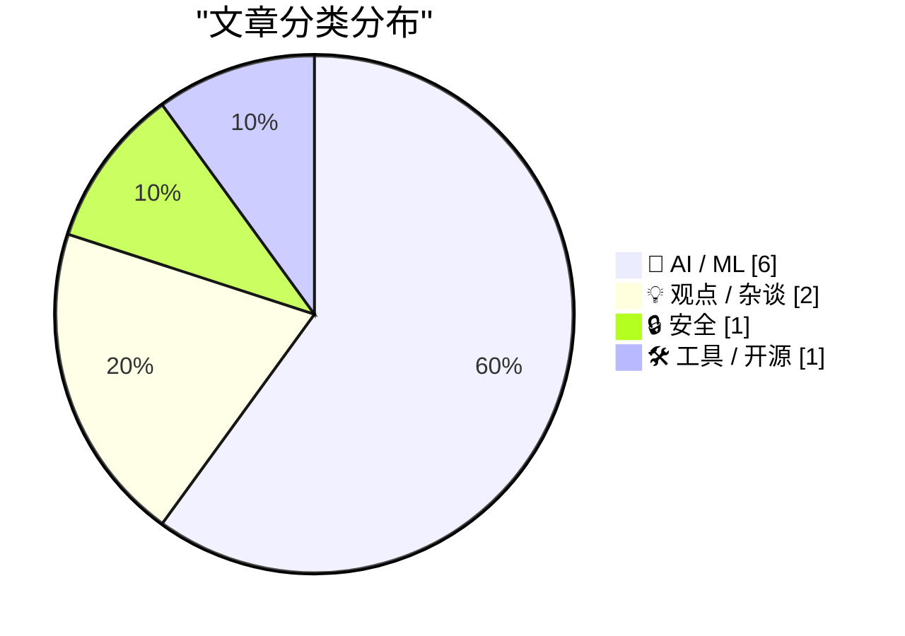
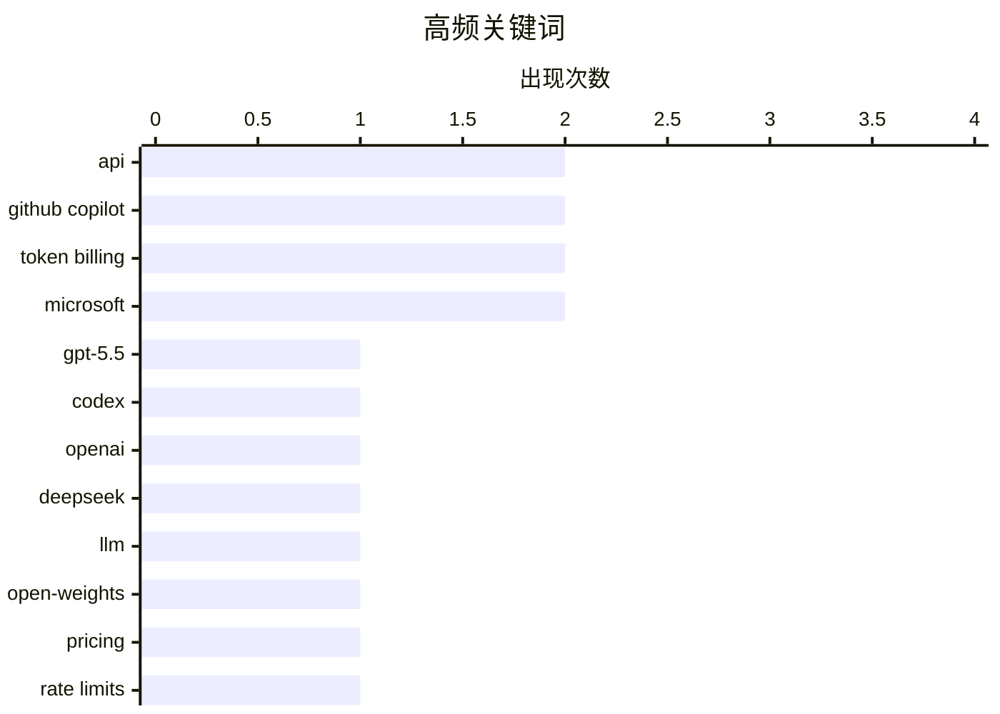

# 📰 AI 博客每日精选 — 2026-04-18

> 来自 Karpathy 推荐的 92 个顶级技术博客，AI 精选 Top 10

## 📝 今日看点

今天技术圈最强烈的信号，是大模型竞争正迅速从“谁更强”转向“谁更便宜、谁更好接入、谁的计费更精细”：GPT-5.5 上线、DeepSeek V4 逼近前沿，同时 GitHub Copilot 被曝将全面走向 token 计费，AI 正加速商品化。与此同时，Agentic AI 开始从对话助手迈向可调用真实 API、可接手代码仓库的执行层，但这也让接口权限、工作流治理和工程边界变得更关键。另一条值得警惕的主线是安全与可靠性焦虑同步升温——从医疗聊天机器人的风险，到真实网络犯罪案件，都在提醒行业：AI 落地越快，信任与风控越不能滞后。

---

## 🏆 今日必读

🥇 **通过半官方 Codex 后门 API 为 GPT-5.5 画鹈鹕**

[A pelican for GPT-5.5 via the semi-official Codex backdoor API](https://simonwillison.net/2026/Apr/23/gpt-5-5/#atom-everything) — simonwillison.net · 2026-04-24 · 🤖 AI / ML

> GPT-5.5 已在 OpenAI Codex 和付费 ChatGPT 订阅中上线，但当天发布缺少正式 API，官方表示会“很快”提供 GPT‑5.5 与 GPT‑5.5 Pro 的 API。作者在做 pelican 基准测试时倾向直接走 API，以避免 ChatGPT 或代理封装中的隐藏系统提示干扰结果。文中梳理了 OpenClaw/Pi 与大模型厂商订阅接口的争议背景：Anthropic 曾阻断类似接入，而 OpenAI 公开表态允许通过 Codex 机制在多种工具中使用 ChatGPT 订阅。基于 openai/codex 仓库的逆向分析，作者做了 llm-openai-via-codex 插件，让 LLM 工具复用已有 Codex 订阅来调用 prompt。实际使用流程包括安装 Codex CLI、登录订阅、安装 llm 与该插件，并可用 openai-codex/gpt-5.5 模型直接发起请求。

💡 **为什么值得读**: 它给出了在 GPT-5.5 正式 API 到来前可落地的替代接入路径，并附带可复现的工具链步骤，实操价值很高。

🏷️ GPT-5.5, Codex, OpenAI, API

🥈 **DeepSeek V4：几乎跻身前沿，价格却只是零头**

[DeepSeek V4 - almost on the frontier, a fraction of the price](https://simonwillison.net/2026/Apr/24/deepseek-v4/#atom-everything) — simonwillison.net · 2026-04-24 · 🤖 AI / ML

> DeepSeek 发布了 V4 系列的两个预览模型 DeepSeek-V4-Pro 和 DeepSeek-V4-Flash，均采用 100 万 token 上下文和 Mixture of Experts 架构，其中 Pro 为 1.6T 总参数、49B 激活参数，Flash 为 284B 总参数、13B 激活参数，并采用 MIT 许可证。作者认为 V4-Pro 可能是目前最大的开源权重模型，规模超过 Kimi K2.6、GLM-5.1，也比 DeepSeek V3.2 大两倍多。价格是这次发布最突出的特点：Flash 的输入/输出价格分别为 0.14 美元和 0.28 美元每百万 token，Pro 为 1.74 美元和 3.48 美元每百万 token，在文中列出的 Gemini、OpenAI 和 Anthropic 对比表中，Flash 是最便宜的小模型，Pro 是最便宜的大型前沿模型。论文给出的解释是，这一代重点优化了效率，尤其是长上下文场景；在 100 万 token 上下文下，V4-Pro 的单 token FLOPs 仅为 V3.2 的 27%，KV cache 仅为 10%，Flash 则分别降到 10% 和 7%。作者还提到，DeepSeek 在论文中的自报基准显示 Pro 与其他前沿模型具备竞争力，而低价与高效率的组合是 V4 最值得关注的地方。

💡 **为什么值得读**: 值得读，因为它把 DeepSeek V4 的模型规模、开源属性、长上下文效率和与主流前沿模型的价格对比放在一起，能快速判断这代模型为什么会引发关注。

🏷️ DeepSeek, LLM, open-weights, pricing

🥉 **独家：微软将把 GitHub Copilot 用户转向基于 Token 的计费，并收紧速率限制**

[Exclusive: Microsoft To Shift GitHub Copilot Users To Token-Based Billing, Tighten Rate Limits](https://www.wheresyoured.at/news-microsoft-to-shift-github-copilot-users-to-token-based-billing-reduce-rate-limits-2/) — wheresyoured.at · 2026-04-21 · 🤖 AI / ML

> 微软计划调整 GitHub Copilot 的商业模式，从按“requests”计量转向按 token 实际消耗计费，同时收紧个人和企业账户的速率限制。泄露文件显示，GitHub Copilot 的周运行成本自年初以来几乎翻倍，促使微软提高这一转型的优先级，并准备暂停学生版和付费个人版的新用户注册。现有个人开发者套餐中，Copilot Pro 每月 10 美元含 300 次请求，Pro+ 每月 39 美元含 1500 次请求；改为 token 计费后，费用将更直接对应提示词与输出消耗的算力成本。文件还显示，最低价订阅将失去部分模型访问权限，文中并提到从 GitHub Copilot Pro 移除 Opus 的方向。作者给出的判断是，微软此举反映出生成式 AI 产品长期补贴算力成本的模式正在收缩，GitHub Copilot 也开始向更直接的使用量计费过渡。

💡 **为什么值得读**: 值得读在于它把 GitHub Copilot 价格体系、模型权限和注册策略可能出现的具体变化放在一起，能帮助开发者提前判断自身成本和可用能力会怎样受影响。

🏷️ GitHub Copilot, token billing, rate limits, Microsoft

---

## 📊 数据概览

| 扫描源 | 抓取文章 | 时间范围 | 精选 |
|:---:|:---:|:---:|:---:|
| 88/92 | 2532 篇 → 133 篇 | 24h | **10 篇** |

### 分类分布



### 高频关键词



<details>
<summary>📈 纯文本关键词图（终端友好）</summary>

```
api            │ ████████████████████ 2
github copilot │ ████████████████████ 2
token billing  │ ████████████████████ 2
microsoft      │ ████████████████████ 2
gpt-5.5        │ ██████████░░░░░░░░░░ 1
codex          │ ██████████░░░░░░░░░░ 1
openai         │ ██████████░░░░░░░░░░ 1
deepseek       │ ██████████░░░░░░░░░░ 1
llm            │ ██████████░░░░░░░░░░ 1
open-weights   │ ██████████░░░░░░░░░░ 1
```

</details>

### 🏷️ 话题标签

**api**(2) · **github copilot**(2) · **token billing**(2) · microsoft(2) · gpt-5.5(1) · codex(1) · openai(1) · deepseek(1) · llm(1) · open-weights(1) · pricing(1) · rate limits(1) · agentic ai(1) · mcp(1) · have i been pwned(1) · software engineering(1) · ai(1) · career(1) · productivity(1) · ai pricing(1)

---

## 🤖 AI / ML

### 1. 通过半官方 Codex 后门 API 为 GPT-5.5 画鹈鹕

[A pelican for GPT-5.5 via the semi-official Codex backdoor API](https://simonwillison.net/2026/Apr/23/gpt-5-5/#atom-everything) — **simonwillison.net** · 2026-04-24 · ⭐ 27/30

> GPT-5.5 已在 OpenAI Codex 和付费 ChatGPT 订阅中上线，但当天发布缺少正式 API，官方表示会“很快”提供 GPT‑5.5 与 GPT‑5.5 Pro 的 API。作者在做 pelican 基准测试时倾向直接走 API，以避免 ChatGPT 或代理封装中的隐藏系统提示干扰结果。文中梳理了 OpenClaw/Pi 与大模型厂商订阅接口的争议背景：Anthropic 曾阻断类似接入，而 OpenAI 公开表态允许通过 Codex 机制在多种工具中使用 ChatGPT 订阅。基于 openai/codex 仓库的逆向分析，作者做了 llm-openai-via-codex 插件，让 LLM 工具复用已有 Codex 订阅来调用 prompt。实际使用流程包括安装 Codex CLI、登录订阅、安装 llm 与该插件，并可用 openai-codex/gpt-5.5 模型直接发起请求。

🏷️ GPT-5.5, Codex, OpenAI, API

---

### 2. DeepSeek V4：几乎跻身前沿，价格却只是零头

[DeepSeek V4 - almost on the frontier, a fraction of the price](https://simonwillison.net/2026/Apr/24/deepseek-v4/#atom-everything) — **simonwillison.net** · 2026-04-24 · ⭐ 26/30

> DeepSeek 发布了 V4 系列的两个预览模型 DeepSeek-V4-Pro 和 DeepSeek-V4-Flash，均采用 100 万 token 上下文和 Mixture of Experts 架构，其中 Pro 为 1.6T 总参数、49B 激活参数，Flash 为 284B 总参数、13B 激活参数，并采用 MIT 许可证。作者认为 V4-Pro 可能是目前最大的开源权重模型，规模超过 Kimi K2.6、GLM-5.1，也比 DeepSeek V3.2 大两倍多。价格是这次发布最突出的特点：Flash 的输入/输出价格分别为 0.14 美元和 0.28 美元每百万 token，Pro 为 1.74 美元和 3.48 美元每百万 token，在文中列出的 Gemini、OpenAI 和 Anthropic 对比表中，Flash 是最便宜的小模型，Pro 是最便宜的大型前沿模型。论文给出的解释是，这一代重点优化了效率，尤其是长上下文场景；在 100 万 token 上下文下，V4-Pro 的单 token FLOPs 仅为 V3.2 的 27%，KV cache 仅为 10%，Flash 则分别降到 10% 和 7%。作者还提到，DeepSeek 在论文中的自报基准显示 Pro 与其他前沿模型具备竞争力，而低价与高效率的组合是 V4 最值得关注的地方。

🏷️ DeepSeek, LLM, open-weights, pricing

---

### 3. 独家：微软将把 GitHub Copilot 用户转向基于 Token 的计费，并收紧速率限制

[Exclusive: Microsoft To Shift GitHub Copilot Users To Token-Based Billing, Tighten Rate Limits](https://www.wheresyoured.at/news-microsoft-to-shift-github-copilot-users-to-token-based-billing-reduce-rate-limits-2/) — **wheresyoured.at** · 2026-04-21 · ⭐ 26/30

> 微软计划调整 GitHub Copilot 的商业模式，从按“requests”计量转向按 token 实际消耗计费，同时收紧个人和企业账户的速率限制。泄露文件显示，GitHub Copilot 的周运行成本自年初以来几乎翻倍，促使微软提高这一转型的优先级，并准备暂停学生版和付费个人版的新用户注册。现有个人开发者套餐中，Copilot Pro 每月 10 美元含 300 次请求，Pro+ 每月 39 美元含 1500 次请求；改为 token 计费后，费用将更直接对应提示词与输出消耗的算力成本。文件还显示，最低价订阅将失去部分模型访问权限，文中并提到从 GitHub Copilot Pro 移除 Opus 的方向。作者给出的判断是，微软此举反映出生成式 AI 产品长期补贴算力成本的模式正在收缩，GitHub Copilot 也开始向更直接的使用量计费过渡。

🏷️ GitHub Copilot, token billing, rate limits, Microsoft

---

### 4. Agentic AI 能用 Have I Been Pwned 的 API 做些什么

[Here's What Agentic AI Can Do With Have I Been Pwned's APIs](https://www.troyhunt.com/heres-what-agentic-ai-can-do-with-have-i-been-pwneds-apis/) — **troyhunt.com** · 23 小时前 · ⭐ 26/30

> 内容聚焦于把 Agentic AI 与 Have I Been Pwned（HIBP）API 结合后，能为用户带来哪些实际可用的能力。文中先介绍了 Model Context Protocol（MCP）：这是 Anthropic 提出的协议，让 Claude、ChatGPT 等 AI 应用连接数据源、工具和工作流，而 HIBP 已提供 MCP 服务器 `https://haveibeenpwned.com/mcp`。作者给出了将 HIBP 以 JSON 配置接入 GitHub Copilot 的示例，并说明这些能力并不局限于 OpenClaw，也适用于其他 AI agent 平台。文章强调的重点是让人类，尤其是非技术用户，借助 agentic AI 去完成过去更依赖开发者的任务；演示中使用 OpenClaw 和 Telegram bot 作为交互入口，同时提到 API 密钥可在 HIBP 控制台轮换。作者的态度是对 AI 炒作保持谨慎，但认为把 HIBP 数据接入 agentic AI 属于少数真正有实际价值的应用方向。

🏷️ agentic AI, MCP, Have I Been Pwned, API

---

### 5. 独家更新：微软将于 6 月把所有 GitHub Copilot 订阅者迁移到基于 Token 的计费

[[Updated] Exclusive: Microsoft Moving All GitHub Copilot Subscribers To Token-Based Billing In June](https://www.wheresyoured.at/exclusive-microsoft-moving-all-github-copilot-subscribers-to-token-based-billing-in-june/) — **wheresyoured.at** · 2026-04-23 · ⭐ 25/30

> 微软计划从 2026 年 6 月起将 GitHub Copilot 转向基于 token 的计费，内部文件显示这一变更将覆盖所有 Copilot 客户，但个人订阅者如何处理仍不明确。现有按“requests”计量的方式将改为按实际 token 成本计费，用户继续支付月费，并按订阅档位获得对应额度的 AI token；企业和商业客户则使用组织级共享的 pooled AI credits。促销期从 2026 年 6 月持续到 8 月，Copilot Business 为每用户每月 19 美元并附带 30 美元共享 AI 积分，Copilot Enterprise 为每用户每月 39 美元并附带 70 美元共享 AI 积分；促销结束后将分别变为 19 美元配 19 美元 token 额度、39 美元配 39 美元 token 额度。文中还给出当前 Copilot Pro 每月 300 次请求、Pro+ 每月 1500 次请求，并以 Claude Opus 4.7 的每百万输入 token 5 美元、每百万输出 token 25 美元说明新计费逻辑。微软已暂停个人和学生账户的新注册，移除了 10 美元档中的 Anthropic Opus 模型，并计划进一步收紧使用限制。

🏷️ GitHub Copilot, token billing, Microsoft, AI pricing

---

### 6. 请不要相信你的聊天机器人能提供医疗建议

[Please don’t trust your chatbot for medical advice](https://garymarcus.substack.com/p/please-dont-trust-your-chatbot-for) — **garymarcus.substack.com** · 2026-04-21 · ⭐ 24/30

> 医疗聊天机器人是否适合直接向公众提供诊断与建议，被多项最新研究同时质疑。BMJ 发表的一项审计研究评估了 Gemini、DeepSeek、Meta AI、ChatGPT 和 Grok 五款热门聊天机器人，在癌症、疫苗和营养等 10 个开放式问题上，近一半回答被认定为高度有问题，而且回答常以自信确定的口吻给出，并伴随幻觉和伪造引用。JAMA Network Open 的另一项研究考察了 21 个前沿模型在 29 个临床推理问题上的表现，结论是当前 LLM 在早期诊断推理上仍有限制，尚不能用于无监督、面向患者的临床决策。Nature Medicine 的随机预注册研究还发现，LLM 帮助公众识别潜在疾病和选择行动方案时，在少于 34.5% 的案例中找出了相关病症，表现不优于对照组；同一研究也显示，这些模型在受过训练的医生手中表现更好。作者据此认为，LLM 在医疗场景中的典型问题——错误、幻觉和过度自信——并未消失，在缺乏公众教育与监督的情况下持续部署，只会放大医疗错误信息风险。

🏷️ medical advice, hallucination, chatbots, AI safety

---

## 💡 观点 / 杂谈

### 7. 软件工程可能不再是一份可以干一辈子的职业

[Software engineering may no longer be a lifetime career](https://seangoedecke.com/software-engineering-may-no-longer-be-a-lifetime-career/) — **seangoedecke.com** · 2026-04-24 · ⭐ 25/30

> 焦点在于：即便使用 AI 可能会减少工程师在实际工作中的学习积累、并让技术能力随时间退化，这也未必构成拒绝使用 AI 的理由。文中认为，过去“做软件工程就能持续学会软件工程”只是一个幸运的历史条件，而不是软件工程不可改变的本质。作者把这种处境类比为建筑工人必须搬重物、木匠必须使用电动工具：哪怕这些做法会带来长期代价，只要短期收益足够、市场竞争存在，从业者仍可能被迫采用。由此，手写代码当然仍然可以做，但如果模型足够好，拒绝使用 AI 的工程师可能会在就业市场上被愿意交换长期能力换取短期收益的人淘汰。结论是，如果软件工程师正进入一种类似职业运动员那样职业寿命受限的新阶段，最糟的不是事实本身，而是否认这种可能性，因此应尽早为此做规划。

🏷️ software engineering, AI, career, productivity

---

### 8. 新的一天到来了

[★ Another Day Has Come](https://daringfireball.net/2026/04/another_day_has_come) — **daringfireball.net** · 2026-04-21 · ⭐ 25/30

> 苹果再次迎来 CEO 向董事长过渡与接班人上任的时刻，但这次与 2011 年史蒂夫·乔布斯因病交棒给蒂姆·库克时的氛围截然不同。库克在过去 15 年里接手一家处于巨大悲痛中的公司，并在 iPhone、Mac、iPad、AirPods 和 Apple Watch 等产品线上把苹果带到业务几乎全面强劲的状态；文中还提到今年的 iPhone 17 系列表现突出，600 美元的 MacBook Neo 因热销甚至传出 A18 Pro 芯片供不应求。作者认为，库克的优势不只是业绩数字，也体现在他对无障碍等价值的重视，而乔布斯当年选择他担任继任者是正确的。与此同时，苹果如今更需要一位以产品和新事物创造为导向的领导者，而约翰·特努斯被作者视为最像这种人选的人。作者整体判断是，库克在巅峰时完成交棒，而他挑选特努斯接班这件事，目前看起来也很像一次正确的选择。

🏷️ Apple, Tim Cook, John Ternus, leadership

---

## 🔒 安全

### 9. “Scattered Spider”成员“Tylerb”认罪

[‘Scattered Spider’ Member ‘Tylerb’ Pleads Guilty](https://krebsonsecurity.com/2026/04/scattered-spider-member-tylerb-pleads-guilty/) — **krebsonsecurity.com** · 2026-04-21 · ⭐ 25/30

> 24 岁英国公民、网络犯罪组织 Scattered Spider 的高级成员 Tyler Robert Buchanan 已对电信欺诈共谋和严重身份盗窃罪认罪。其承认参与了 2022 年夏季大规模基于短信的网络钓鱼攻击，入侵了至少十余家大型科技公司，包括 Twilio、LastPass、DoorDash 和 Mailchimp，并利用泄露数据实施 SIM 交换攻击。美国司法部称，他承认从美国个人受害者手中窃取了至少 800 万美元的虚拟货币；FBI 则通过用于注册钓鱼域名的相同用户名、邮箱，以及与其在英国住址关联的登录 IP，将其与该行动联系起来。Scattered Spider 长期通过冒充员工或承包商、欺骗 IT 帮助台获取访问权限，再以窃取数据进行勒索。Buchanan 此前在 2023 年离开英国，2024 年在西班牙准备飞往意大利时被捕，目前已被引渡至美国候审，可能面临超过 20 年监禁。

🏷️ Scattered Spider, phishing, cybercrime, identity theft

---

## 🛠 工具 / 开源

### 10. brief

[brief](https://nesbitt.io/2026/04/21/brief.html) — **nesbitt.io** · 2026-04-21 · ⭐ 24/30

> 陌生代码仓库的接手者——无论是新贡献者、安全扫描器还是 AI 编码代理——都需要先弄清语言、依赖安装方式、测试命令、提交前要跑的 linter，以及安全审查中的危险函数等基础信息，而反复从零识别这些内容是一种浪费。brief 将这些共性知识整理成一个覆盖 54 个语言生态、516 个工具的知识库，并通过单个 Go 二进制提供查询：在管道中输出 JSON，在终端中输出面向人的摘要。它的核心数据包括工具调用命令、配置文件位置，以及统一机器可读 schema 下的工具分类；可对本地目录、Git URL 或 gem:rails、npm:express 这类注册表坐标进行识别，并按 20 个类别汇报工具链、命令、配置文件以及许可证、SECURITY、CODEOWNERS、FUNDING.yml 等治理与社区文件。工具还支持 brief diff、brief missing、brief threat-model、brief sinks 等用法，分别聚焦变更涉及的工具、缺失的基线类别、由技术栈隐含的 CWE/OWASP 类别，以及检测到工具中的危险函数。作者强调它在全部 516 个定义上的检查耗时低于 250ms，可作为每次会话或流水线步骤的前置动作，并已用于让 Claude 在进入仓库时先完成一次统一、低成本的工具链识别。

🏷️ CLI, developer tooling, AI agents, toolchain

---

*生成于 2026-04-18 07:00 | 扫描 88 源 → 获取 2532 篇 → 精选 10 篇*
*基于 [Hacker News Popularity Contest 2025](https://refactoringenglish.com/tools/hn-popularity/) RSS 源列表*
