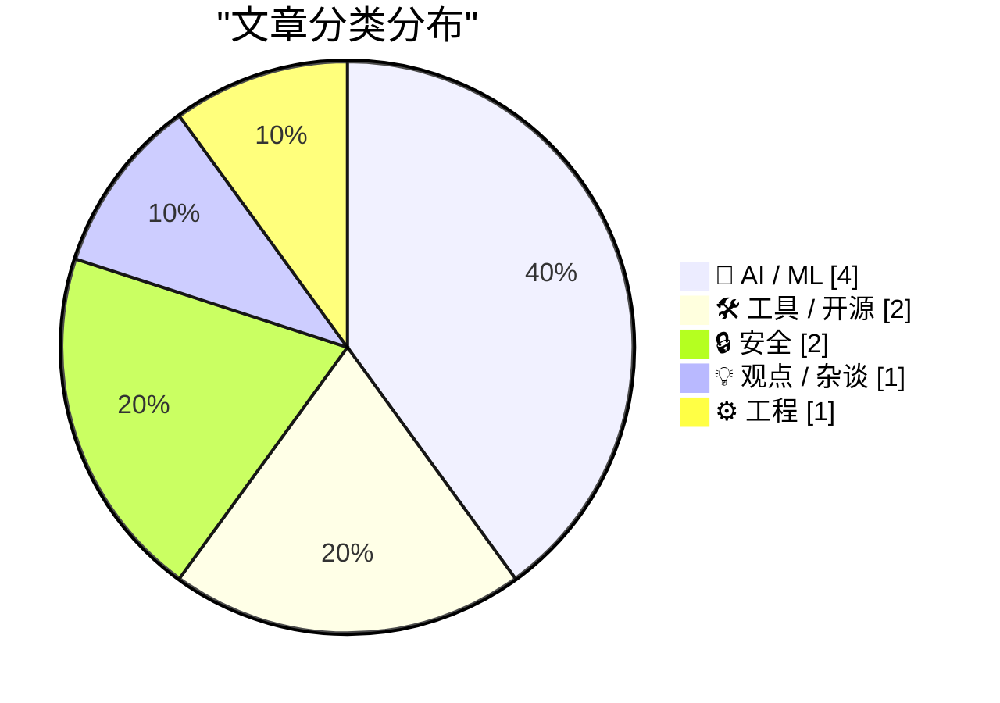
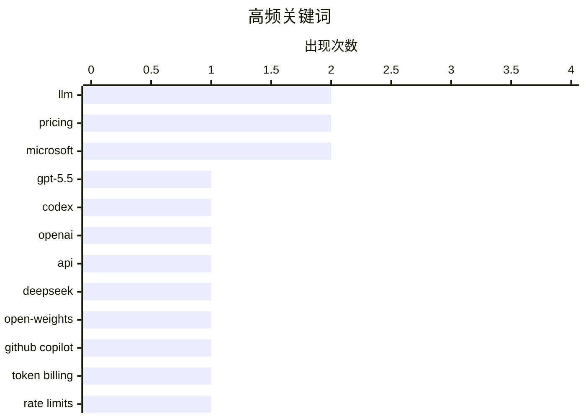

# 📰 AI 博客每日精选 — 2026-04-19

> 来自 Karpathy 推荐的 92 个顶级技术博客，AI 精选 Top 10

## 📝 今日看点

今天技术圈最强烈的信号，是大模型能力继续冲高，但商业化与准入门槛也在同步收紧：从 GPT-5.5 尚未全面开放，到 Copilot 明显转向按 token 精细计费，AI 正从“拼性能”进入“拼成本、拼治理”的新阶段。与此同时，DeepSeek 这类高性价比模型继续压低前沿能力的价格带，预示大模型竞争正快速从单纯追赶性能转向效率和商业模式博弈。另一条清晰主线是安全与控制权焦虑升温——无论是云主权、开源代码被模型“洗白”后的许可风险，还是真实网络犯罪案件，都在提醒行业：AI 和云基础设施越普及，合规、边界与信任就越成为核心战场。

---

## 🏆 今日必读

🥇 **通过半官方 Codex 后门 API 获取 GPT-5.5 的 pelican 基准**

[A pelican for GPT-5.5 via the semi-official Codex backdoor API](https://simonwillison.net/2026/Apr/23/gpt-5-5/#atom-everything) — simonwillison.net · 2026-04-24 · 🤖 AI / ML

> GPT-5.5 已在 OpenAI Codex 和付费版 ChatGPT 推出，但官方 API 仍未开放，OpenAI 表示会在完成大规模安全与防护要求后尽快提供 GPT-5.5 与 GPT-5.5 Pro API。作者强调做 pelican 基准时更偏好 API 路径，以避免 ChatGPT 或其他 agent 外壳里的隐藏系统提示干扰结果。文中梳理了近期争议：OpenClaw 等工具曾利用订阅通道接入模型，Anthropic 曾封禁该方式，而 OpenAI 则公开表示允许通过 Codex 机制在终端、IDE 等场景使用 ChatGPT 订阅能力。基于此，作者让 Claude Code 逆向 openai/codex 的认证令牌存储流程，做出 llm-openai-via-codex 插件，让 LLM 工具可直接调用现有 Codex 订阅来运行提示词，并给出了从安装 Codex CLI、登录、安装插件到调用 openai-codex/gpt-5.5 的命令链路。整体观点是，在官方 API 缺位阶段，Codex 这条“半官方”接入路径已可作为可用替代方案来实际使用 GPT-5.5。

💡 **为什么值得读**: 它把“GPT-5.5 暂无官方 API”这个现实问题落到了可复现的工程解法上，适合想立刻上手模型调用与评测的人。

🏷️ GPT-5.5, Codex, OpenAI, API

🥈 **DeepSeek V4：几乎达到前沿水平，价格却只是其中一小部分**

[DeepSeek V4 - almost on the frontier, a fraction of the price](https://simonwillison.net/2026/Apr/24/deepseek-v4/#atom-everything) — simonwillison.net · 2026-04-24 · 🤖 AI / ML

> DeepSeek 发布了 V4 系列的两个预览模型 DeepSeek-V4-Pro 和 DeepSeek-V4-Flash，均采用 100 万 token 上下文与 Mixture of Experts 架构，并使用 MIT 许可证开放权重。V4-Pro 总参数 1.6T、激活参数 49B，V4-Flash 总参数 284B、激活参数 13B；作者认为 V4-Pro 已成为当前最大的开放权重模型，规模超过 Kimi K2.6、GLM-5.1 和 DeepSeek V3.2。两款模型最突出的特点是价格极低：Flash 输入/输出价格分别为每百万 token 0.14 美元和 0.28 美元，Pro 为 1.74 美元和 3.48 美元，在文中列举的 Gemini、OpenAI 和 Anthropic 对比表里分别是小模型与大型前沿模型中最便宜的。论文给出的解释是这次发布重点优化了效率，尤其针对长上下文；在 100 万 token 场景下，V4-Pro 的单 token FLOPs 仅为 V3.2 的 27%、KV cache 为 10%，V4-Flash 则进一步降至 10% 和 7%。作者认为，DeepSeek V4 在自报基准中已具备与前沿模型竞争的表现，同时以显著更低的成本提供接近前沿的能力，这才是它最值得关注的地方。

💡 **为什么值得读**: 如果你关心开源大模型的能力、规模与推理成本，这篇文章把 DeepSeek V4 在“接近前沿性能但价格显著更低”这一点讲得非常清楚。

🏷️ DeepSeek, open-weights, LLM, pricing

🥉 **独家：微软将把 GitHub Copilot 用户转向基于 Token 的计费，并收紧速率限制**

[Exclusive: Microsoft To Shift GitHub Copilot Users To Token-Based Billing, Tighten Rate Limits](https://www.wheresyoured.at/news-microsoft-to-shift-github-copilot-users-to-token-based-billing-reduce-rate-limits-2/) — wheresyoured.at · 2026-04-21 · 🤖 AI / ML

> 微软计划调整 GitHub Copilot 的商业模式，包括暂停学生版和个人付费版的新用户注册、收紧个人与企业账户的速率限制，并逐步从按 requests 计量转向按 token 实际消耗计费。泄露文件显示，GitHub Copilot 的周运行成本自年初以来几乎翻倍，使 token-based billing 从优先事项变成更紧迫的成本控制手段。现行方案中，Copilot Pro（10 美元/月）每月提供 300 次 requests，Pro+（39 美元/月）提供 1500 次，而新方案将更直接地按提示词和输出消耗的 token 及其对应算力成本收费。文件还提到，最低价订阅将失去部分模型访问权限，其中包括从 GitHub Copilot Pro 中移除 Opus。作者据此认为，AI 产品长期补贴算力成本的阶段正在结束，GitHub Copilot 的变化与行业转向按 token 计费的趋势一致。

💡 **为什么值得读**: 这篇内容值得读，因为它揭示了 GitHub Copilot 计费、模型权限和使用限制可能发生的关键变化，直接关系到开发者未来的成本与可用性。

🏷️ GitHub Copilot, token billing, rate limits, developer tools

---

## 📊 数据概览

| 扫描源 | 抓取文章 | 时间范围 | 精选 |
|:---:|:---:|:---:|:---:|
| 88/92 | 2531 篇 → 120 篇 | 24h | **10 篇** |

### 分类分布



### 高频关键词



<details>
<summary>📈 纯文本关键词图（终端友好）</summary>

```
llm            │ ████████████████████ 2
pricing        │ ████████████████████ 2
microsoft      │ ████████████████████ 2
gpt-5.5        │ ██████████░░░░░░░░░░ 1
codex          │ ██████████░░░░░░░░░░ 1
openai         │ ██████████░░░░░░░░░░ 1
api            │ ██████████░░░░░░░░░░ 1
deepseek       │ ██████████░░░░░░░░░░ 1
open-weights   │ ██████████░░░░░░░░░░ 1
github copilot │ ██████████░░░░░░░░░░ 1
```

</details>

### 🏷️ 话题标签

**llm**(2) · **pricing**(2) · **microsoft**(2) · gpt-5.5(1) · codex(1) · openai(1) · api(1) · deepseek(1) · open-weights(1) · github copilot(1) · token billing(1) · rate limits(1) · developer tools(1) · github-copilot(1) · token-billing(1) · apple(1) · tim cook(1) · john ternus(1) · leadership(1) · open source(1)

---

## 🤖 AI / ML

### 1. 通过半官方 Codex 后门 API 获取 GPT-5.5 的 pelican 基准

[A pelican for GPT-5.5 via the semi-official Codex backdoor API](https://simonwillison.net/2026/Apr/23/gpt-5-5/#atom-everything) — **simonwillison.net** · 2026-04-24 · ⭐ 27/30

> GPT-5.5 已在 OpenAI Codex 和付费版 ChatGPT 推出，但官方 API 仍未开放，OpenAI 表示会在完成大规模安全与防护要求后尽快提供 GPT-5.5 与 GPT-5.5 Pro API。作者强调做 pelican 基准时更偏好 API 路径，以避免 ChatGPT 或其他 agent 外壳里的隐藏系统提示干扰结果。文中梳理了近期争议：OpenClaw 等工具曾利用订阅通道接入模型，Anthropic 曾封禁该方式，而 OpenAI 则公开表示允许通过 Codex 机制在终端、IDE 等场景使用 ChatGPT 订阅能力。基于此，作者让 Claude Code 逆向 openai/codex 的认证令牌存储流程，做出 llm-openai-via-codex 插件，让 LLM 工具可直接调用现有 Codex 订阅来运行提示词，并给出了从安装 Codex CLI、登录、安装插件到调用 openai-codex/gpt-5.5 的命令链路。整体观点是，在官方 API 缺位阶段，Codex 这条“半官方”接入路径已可作为可用替代方案来实际使用 GPT-5.5。

🏷️ GPT-5.5, Codex, OpenAI, API

---

### 2. DeepSeek V4：几乎达到前沿水平，价格却只是其中一小部分

[DeepSeek V4 - almost on the frontier, a fraction of the price](https://simonwillison.net/2026/Apr/24/deepseek-v4/#atom-everything) — **simonwillison.net** · 2026-04-24 · ⭐ 26/30

> DeepSeek 发布了 V4 系列的两个预览模型 DeepSeek-V4-Pro 和 DeepSeek-V4-Flash，均采用 100 万 token 上下文与 Mixture of Experts 架构，并使用 MIT 许可证开放权重。V4-Pro 总参数 1.6T、激活参数 49B，V4-Flash 总参数 284B、激活参数 13B；作者认为 V4-Pro 已成为当前最大的开放权重模型，规模超过 Kimi K2.6、GLM-5.1 和 DeepSeek V3.2。两款模型最突出的特点是价格极低：Flash 输入/输出价格分别为每百万 token 0.14 美元和 0.28 美元，Pro 为 1.74 美元和 3.48 美元，在文中列举的 Gemini、OpenAI 和 Anthropic 对比表里分别是小模型与大型前沿模型中最便宜的。论文给出的解释是这次发布重点优化了效率，尤其针对长上下文；在 100 万 token 场景下，V4-Pro 的单 token FLOPs 仅为 V3.2 的 27%、KV cache 为 10%，V4-Flash 则进一步降至 10% 和 7%。作者认为，DeepSeek V4 在自报基准中已具备与前沿模型竞争的表现，同时以显著更低的成本提供接近前沿的能力，这才是它最值得关注的地方。

🏷️ DeepSeek, open-weights, LLM, pricing

---

### 3. 独家：微软将把 GitHub Copilot 用户转向基于 Token 的计费，并收紧速率限制

[Exclusive: Microsoft To Shift GitHub Copilot Users To Token-Based Billing, Tighten Rate Limits](https://www.wheresyoured.at/news-microsoft-to-shift-github-copilot-users-to-token-based-billing-reduce-rate-limits-2/) — **wheresyoured.at** · 2026-04-21 · ⭐ 26/30

> 微软计划调整 GitHub Copilot 的商业模式，包括暂停学生版和个人付费版的新用户注册、收紧个人与企业账户的速率限制，并逐步从按 requests 计量转向按 token 实际消耗计费。泄露文件显示，GitHub Copilot 的周运行成本自年初以来几乎翻倍，使 token-based billing 从优先事项变成更紧迫的成本控制手段。现行方案中，Copilot Pro（10 美元/月）每月提供 300 次 requests，Pro+（39 美元/月）提供 1500 次，而新方案将更直接地按提示词和输出消耗的 token 及其对应算力成本收费。文件还提到，最低价订阅将失去部分模型访问权限，其中包括从 GitHub Copilot Pro 中移除 Opus。作者据此认为，AI 产品长期补贴算力成本的阶段正在结束，GitHub Copilot 的变化与行业转向按 token 计费的趋势一致。

🏷️ GitHub Copilot, token billing, rate limits, developer tools

---

### 4. 自由软件被自动转成专有软件的另一个问题

[Pluralistic: The (other) problem with automatic conversion of free software to proprietary software (23 Apr 2026)](https://pluralistic.net/2026/04/23/poison-pill/) — **pluralistic.net** · 2026-04-23 · ⭐ 24/30

> Malus.sh 提出一种付费服务：把任意自由/开源代码交给大模型重构，产出一个据称摆脱原项目许可证义务的“洁净室”版本。它借用了 1982 年 IBM 起诉 Columbia Data Products 一案中的“clean room”思路：一方分析原程序并写出功能规格，另一方仅根据规格重新实现，从而把可受版权保护的代码表达与不可受版权保护的功能分离开来。Malus 的做法是串联两个 LLM，第一个模型分析自由软件并生成实现相同功能的规格，第二个模型依据该规格写出新程序。标题与文段同时点出另一层法律问题：公共领域作品不能被再附加任何许可证，因此把自由软件自动转成专有软件并不只是“绕过 copyleft”那么简单。作者借这个真实运营的项目提醒自由软件社区，AI 驱动的“洁净室”重写正在把软件公地面临的风险具体化。

🏷️ open source, licensing, LLM, copyright

---

## 🛠 工具 / 开源

### 5. 独家：微软将于 6 月把所有 GitHub Copilot 订阅迁移到基于 Token 的计费

[[Updated] Exclusive: Microsoft Moving All GitHub Copilot Subscribers To Token-Based Billing In June](https://www.wheresyoured.at/exclusive-microsoft-moving-all-github-copilot-subscribers-to-token-based-billing-in-june/) — **wheresyoured.at** · 2026-04-23 · ⭐ 25/30

> 微软计划从 2026 年 6 月起将 GitHub Copilot 转向基于 token 的计费，内部文件显示这一调整将覆盖所有 Copilot 客户，但个人订阅用户如何处理仍不明确。现有按“requests”计量的方式将改为按实际 token 成本计费，用户继续支付月费，同时按订阅档位获得一定额度的 AI token；组织客户则使用可在整个组织内共享的 pooled AI credits。促销期为 2026 年 6 月至 8 月，Copilot Business 定价为每用户每月 19 美元并附带 30 美元共享 AI credits，Copilot Enterprise 为每用户每月 39 美元并附带 70 美元共享 AI credits；之后对应额度将分别变为 19 美元和 39 美元。文中还给出 token 成本示例：Claude Opus 4.7 的输入价格为每百万 token 5 美元，输出价格为每百万 token 25 美元。微软同时已暂停个人和学生新注册、从 10 美元档移除 Anthropic Opus 模型，并计划进一步收紧使用限制，背景是 AI 计算成本持续上升。

🏷️ GitHub-Copilot, pricing, token-billing, Microsoft

---

### 6. brief

[brief](https://nesbitt.io/2026/04/21/brief.html) — **nesbitt.io** · 2026-04-21 · ⭐ 24/30

> 陌生代码仓库的使用者——无论是新贡献者、安全扫描器还是 AI 编码代理——都要先弄清语言、依赖安装方式、测试命令、提交前的 lint 命令，以及安全审查中哪些函数属于危险点，而反复从零摸索这些答案是一种浪费。brief 把这些信息整理成一个覆盖 54 个语言生态、516 个工具的知识库，并用单个 Go 二进制提供查询：可输出 JSON，也可在终端显示面向人的摘要。它能针对本地目录、Git URL 或 gem:rails、npm:express 这类注册表坐标，按 20 个类别识别工具链，给出对应命令、配置文件位置，以及许可证 SPDX 标识、安全策略、CODEOWNERS、FUNDING.yml 等治理与社区文件。还提供 brief diff、brief missing、brief threat-model、brief sinks 等子命令，用于仅查看改动影响的工具、发现未配置的基础类别、推断栈对应的 CWE/OWASP 类别，以及识别检测到工具中的危险函数。全部 516 条定义的检查耗时低于 250ms；作者在自己的博客仓库上约 220ms 就能识别出 Jekyll、Bundler、Rake、Dependabot 和 GitHub Actions，并把它作为克隆仓库后和每次 Claude 会话开始时的第一步，以减少探索性 grep 和错误猜测带来的 token 消耗。

🏷️ CLI, developer-tools, toolchain, AI-agents

---

## 🔒 安全

### 7. “Scattered Spider”成员“Tylerb”认罪

[‘Scattered Spider’ Member ‘Tylerb’ Pleads Guilty](https://krebsonsecurity.com/2026/04/scattered-spider-member-tylerb-pleads-guilty/) — **krebsonsecurity.com** · 2026-04-21 · ⭐ 24/30

> 24 岁英国公民、网络犯罪组织 Scattered Spider 的高级成员 Tyler Robert Buchanan 已承认犯有电信欺诈共谋和严重身份盗窃罪。其认罪内容显示，他在 2022 年夏季参与发动了数以万计的短信钓鱼攻击，入侵了包括 Twilio、LastPass、DoorDash 和 Mailchimp 在内的多家科技公司，并利用泄露数据实施 SIM 交换攻击，窃取美国受害者至少 800 万美元的虚拟货币。Scattered Spider 以社交工程见长，常冒充员工或承包商欺骗 IT 服务台授予访问权限；Buchanan 的身份则因用于注册多个钓鱼域名的相同用户名、邮箱和英国登录地址而被 FBI 锁定。报道还提到，他于 2023 年离开英国，2024 年在西班牙准备飞往意大利时被捕，美国司法系统正在对其量刑，他可能面临 20 多年监禁。案件把 2022 年的大规模短信钓鱼、后续加密货币盗窃，以及 Scattered Spider 的运作方式串联了起来。

🏷️ Scattered Spider, phishing, identity theft, cybercrime

---

### 8. 大科技云不会因为成堆的文书而更安全

[Big tech clouds worden niet veiliger met stapels papier](https://berthub.eu/articles/posts/big-tech-clouds-niet-veiliger-met-papier/) — **berthub.eu** · 2026-04-20 · ⭐ 24/30

> 把社会、政府和公共事务托付给美国服务器，面临两类问题：服务是否继续可用取决于美国意愿，而美国也可通过至少三种法律工具获取数据和通信，即使微软服务器位于欧洲。文中认为，所谓“特殊”协议、增加公司壳层，或额外叠加加密与密钥管理，都无法改变美国法律的现实，数字自主权也无法向美国购买。作者指出，在美国云与服务的风险已被证明后，真正的出路是改用不同路径的欧洲技术，但这要求恢复真正的本地 IT 能力，而荷兰政府如今更多只剩“big tech 部门”。与其改变现实，组织更常借助 DPIA、DTIA、“Comply or explain”和 risk register 等文件，把风险记录、解释并“接受”，从而为继续上云提供程序上的正当性。结论是，复杂的合规文书和治理话术并不能消除对美国云的结构性依赖与法律风险，只是在替不愿转向的人提供继续前行的理由。

🏷️ cloud sovereignty, data privacy, Microsoft, Europe

---

## 💡 观点 / 杂谈

### 9. 新的一天已经到来

[★ Another Day Has Come](https://daringfireball.net/2026/04/another_day_has_come) — **daringfireball.net** · 2026-04-21 · ⭐ 25/30

> 苹果宣布管理层交接，Tim Cook 由 CEO 转任董事会主席，John Ternus 被提拔为新任 CEO，这次过渡与 2011 年 Steve Jobs 因病离任时的沉重氛围截然不同。文中认为，Cook 接手苹果时公司处于深切悲痛之中，但他在随后 15 年里带领苹果释放了既有产品线的增长潜力；当前苹果业务整体状态强劲，iPhone 17、Mac、iPad、AirPods 和 Apple Watch 都被描述为表现出色。作者指出，Cook 不是产品型领导者，但在 2010 年代苹果更需要的是让 iPhone 和 iPad 等既有产品持续开花结果的管理者。现在苹果更需要一位能够主导新产品创造的“产品型”负责人，而长期在公司内部成长起来的 John Ternus 在作者看来最符合这一角色。作者最终的判断是，Jobs 当年选对了 Cook，而从当下来看，Cook 这次选择 Ternus 也很可能同样正确。

🏷️ Apple, Tim Cook, John Ternus, leadership

---

## ⚙️ 工程

### 10. 256 行以内：测试用例最小化

[256 Lines or Less: Test Case Minimization](https://matklad.github.io/2026/04/20/test-case-minimization.html) — **matklad.github.io** · 2026-04-20 · ⭐ 24/30

> 文章聚焦于用极少代码实现一个简化版属性测试/模糊测试库，并用它来做测试用例最小化。作者先为一个关于共识算法的想法快速写了 PBT 库和测试，并在数小时内发现了思路中的深层算法缺陷以及若干编码层面的简单错误。实现核心是单文件的 FRNG.zig，其中 FRNG 被定义为“有限随机数生成器”，本质上是一个预先生成完随机字节、可能耗尽熵的 PRNG，唯一显式错误条件是 OutOfEntropy。这个设计以 bytes(size) 作为基础接口，直接从预生成熵中切片返回字节序列，再在其上构建 array 等辅助函数，强调用少量 Zig 代码获得高“功率重量比”的测试能力。作者的态度很明确：即使方案非常简单甚至朴素，这种 256 行级别的自制工具依然足以在真实问题上快速暴露严重缺陷，并帮助理解 PBT 库中的本质复杂度与附带复杂度。

🏷️ property-based-testing, fuzzing, test-minimization, Zig

---

*生成于 2026-04-19 07:00 | 扫描 88 源 → 获取 2531 篇 → 精选 10 篇*
*基于 [Hacker News Popularity Contest 2025](https://refactoringenglish.com/tools/hn-popularity/) RSS 源列表*
