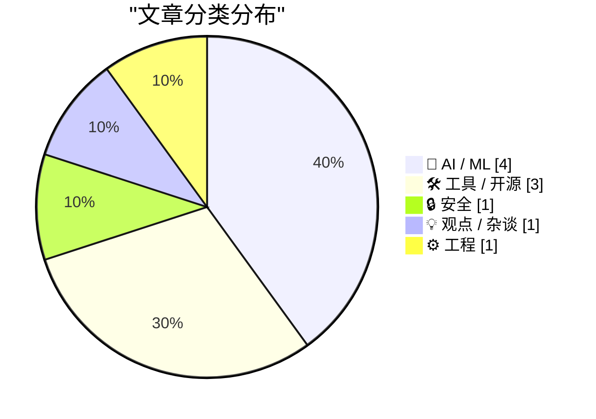
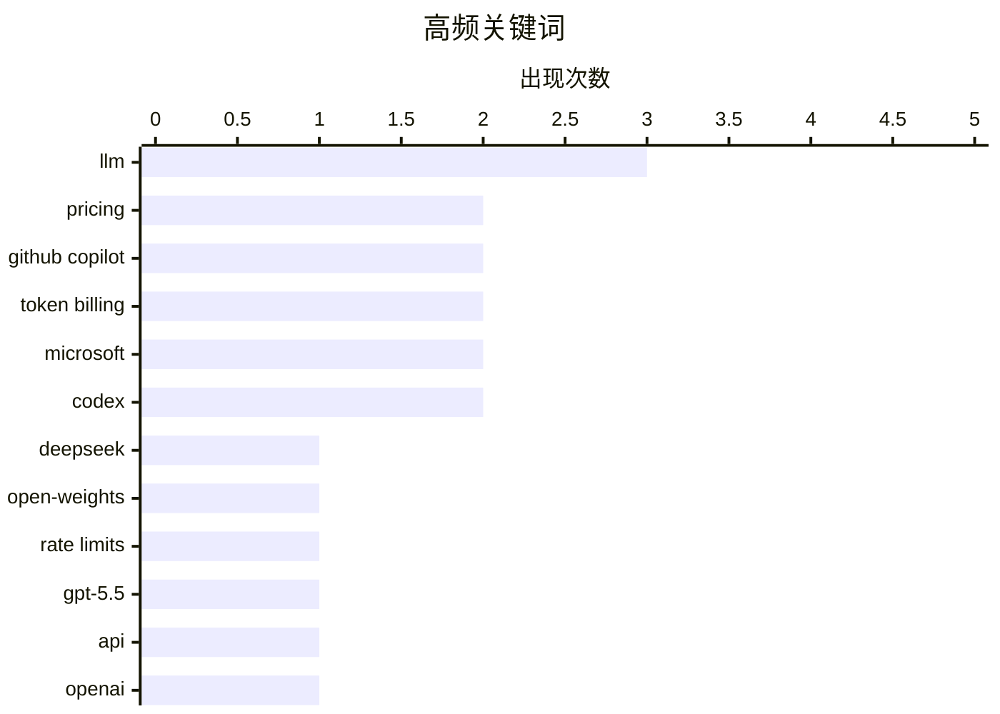

# 📰 AI 博客每日精选 — 2026-04-20

> 来自 Karpathy 推荐的 92 个顶级技术博客，AI 精选 Top 10

## 📝 今日看点

今天技术圈最鲜明的主线，是 AI 能力继续猛进，但商业化与可信度问题也在同步浮出水面：一边是 DeepSeek V4、GPT-5.5 和编程代理把性能、上下文和代码理解推向新台阶，另一边平台开始转向更精细的 token 计费，预示 AI 工具正从“普惠尝鲜”进入“按用量结算”的新阶段。与此同时，AI 正更深地嵌入开发流程，从陌生仓库说明到测试最小化，再到代码代理协作，软件工程正在被重新塑形。值得警惕的是，随着 AI 被带入医疗建议等高风险场景，以及网络犯罪团伙案件持续推进，技术扩张的边界、责任和安全治理也成为今天无法回避的另一条主线。

---

## 🏆 今日必读

🥇 **DeepSeek V4——几乎达到前沿水平，价格却只是零头**

[DeepSeek V4 - almost on the frontier, a fraction of the price](https://simonwillison.net/2026/Apr/24/deepseek-v4/#atom-everything) — simonwillison.net · 2026-04-24 · 🤖 AI / ML

> DeepSeek 发布了 V4 系列的两个预览模型 DeepSeek‑V4‑Pro 与 DeepSeek‑V4‑Flash，核心特点是 100 万 token 上下文、MoE 架构和 MIT 许可证。参数规模上，Pro 为 1.6T 总参数/49B 激活参数，Flash 为 284B/13B，作者认为 Pro 可能已是当前最大的开源权重模型，并给出与 Kimi K2.6、GLM‑5.1、DeepSeek V3.2 的规模对比。文章最突出的结论是价格：Flash 为 $0.14/$0.28（输入/输出，每百万 token），Pro 为 $1.74/$3.48，在文中列举的 Gemini、OpenAI、Anthropic 对照表中分别是小模型和大模型里最低价。DeepSeek 论文给出的解释是长上下文效率显著提升：在 1M token 场景下，Pro 相比 V3.2 仅需 27% 单 token FLOPs 和 10% KV cache，Flash 进一步降到 10% FLOPs 与 7% KV cache。作者还用 OpenRouter 实测了生成“骑自行车的鹈鹕”SVG，认为效果不错，并提到官方基准显示 Pro 具备与前沿模型竞争的表现。

💡 **为什么值得读**: 这篇文章把“模型规模—推理效果—实际价格”放在同一张坐标系里，能快速判断 DeepSeek V4 是否是当前最具性价比的前沿级开源选择。

🏷️ DeepSeek, LLM, open-weights, pricing

🥈 **独家：微软将把 GitHub Copilot 转向基于 Token 的计费，并收紧速率限制**

[Exclusive: Microsoft To Shift GitHub Copilot Users To Token-Based Billing, Tighten Rate Limits](https://www.wheresyoured.at/news-microsoft-to-shift-github-copilot-users-to-token-based-billing-reduce-rate-limits-2/) — wheresyoured.at · 2026-04-21 · 🛠 工具 / 开源

> 泄露的内部文件显示，微软正计划调整 GitHub Copilot 的个人与学生产品策略，包括暂停学生版和付费个人版的新用户注册、收紧个人和企业账户的速率限制，并让低价订阅失去部分模型访问权限。GitHub Copilot 当前按“requests”计量，Pro 每月 10 美元含 300 次请求，Pro+ 每月 39 美元含 1500 次请求；微软计划改为按 token 实际消耗计费，即按提示词和输出消耗的计算成本收费。文件称，自今年 1 月以来，运行 GitHub Copilot 的周成本几乎翻倍，使 token-based billing 从原本的重点事项变得更为紧迫。文中以 Claude Opus 4.7 的定价为例说明 token 成本结构：每百万输入 token 5 美元、每百万输出 token 25 美元。整体信号是，GitHub Copilot 正从补贴式 AI 产品模式转向更直接反映计算消耗的收费方式，这也呼应了 Anthropic 等公司面向企业用户转向基于 token 计费的变化。

💡 **为什么值得读**: 值得读，因为它揭示了 GitHub Copilot 计费逻辑、可用模型和使用限制可能发生的关键变化，直接关系到开发者未来的成本与使用体验。

🏷️ GitHub Copilot, token billing, rate limits, Microsoft

🥉 **通过半官方的 Codex 后门 API 使用 GPT-5.5 跑 pelican 基准**

[A pelican for GPT-5.5 via the semi-official Codex backdoor API](https://simonwillison.net/2026/Apr/23/gpt-5-5/#atom-everything) — simonwillison.net · 2026-04-24 · 🤖 AI / ML

> GPT-5.5 已发布，可在 OpenAI Codex 中使用，并正向付费 ChatGPT 订阅用户推出，但当天尚未提供正式 API。作者认为没有 API 会影响基准测试，因为使用 ChatGPT 或其他代理封装时，隐藏的 system prompt 可能干扰结果，因此更倾向直接走 API。文章梳理了 OpenClaw、Pi 与大模型厂商订阅接口之间的争议，并指出 OpenAI 已明确欢迎第三方通过与开源 Codex CLI 相同的机制接入其订阅。基于此，作者让 Claude Code 逆向 openai/codex 仓库中的认证令牌存储方式，做出了 LLM 插件 llm-openai-via-codex，让用户复用现有 Codex 订阅来调用 openai-codex/gpt-5.5。作者的做法表明，在正式 API 到来前，GPT-5.5 已能通过这一“半官方”通道被接入到命令行工作流和基准测试中。

💡 **为什么值得读**: 值得读在于它不仅说明了 GPT-5.5 尚未开放 API 时的可行替代路径，还给出了围绕 Codex 订阅、CLI 工具和第三方接入机制的具体实践。

🏷️ GPT-5.5, Codex, API, OpenAI

---

## 📊 数据概览

| 扫描源 | 抓取文章 | 时间范围 | 精选 |
|:---:|:---:|:---:|:---:|
| 87/92 | 2494 篇 → 103 篇 | 24h | **10 篇** |

### 分类分布



### 高频关键词



<details>
<summary>📈 纯文本关键词图（终端友好）</summary>

```
llm            │ ████████████████████ 3
pricing        │ █████████████░░░░░░░ 2
github copilot │ █████████████░░░░░░░ 2
token billing  │ █████████████░░░░░░░ 2
microsoft      │ █████████████░░░░░░░ 2
codex          │ █████████████░░░░░░░ 2
deepseek       │ ███████░░░░░░░░░░░░░ 1
open-weights   │ ███████░░░░░░░░░░░░░ 1
rate limits    │ ███████░░░░░░░░░░░░░ 1
gpt-5.5        │ ███████░░░░░░░░░░░░░ 1
```

</details>

### 🏷️ 话题标签

**llm**(3) · **pricing**(2) · **github copilot**(2) · token billing(2) · microsoft(2) · codex(2) · deepseek(1) · open-weights(1) · rate limits(1) · gpt-5.5(1) · api(1) · openai(1) · scattered spider(1) · phishing(1) · identity theft(1) · cybercrime(1) · medical advice(1) · hallucination(1) · misinformation(1) · apple(1)

---

## 🤖 AI / ML

### 1. DeepSeek V4——几乎达到前沿水平，价格却只是零头

[DeepSeek V4 - almost on the frontier, a fraction of the price](https://simonwillison.net/2026/Apr/24/deepseek-v4/#atom-everything) — **simonwillison.net** · 2026-04-24 · ⭐ 26/30

> DeepSeek 发布了 V4 系列的两个预览模型 DeepSeek‑V4‑Pro 与 DeepSeek‑V4‑Flash，核心特点是 100 万 token 上下文、MoE 架构和 MIT 许可证。参数规模上，Pro 为 1.6T 总参数/49B 激活参数，Flash 为 284B/13B，作者认为 Pro 可能已是当前最大的开源权重模型，并给出与 Kimi K2.6、GLM‑5.1、DeepSeek V3.2 的规模对比。文章最突出的结论是价格：Flash 为 $0.14/$0.28（输入/输出，每百万 token），Pro 为 $1.74/$3.48，在文中列举的 Gemini、OpenAI、Anthropic 对照表中分别是小模型和大模型里最低价。DeepSeek 论文给出的解释是长上下文效率显著提升：在 1M token 场景下，Pro 相比 V3.2 仅需 27% 单 token FLOPs 和 10% KV cache，Flash 进一步降到 10% FLOPs 与 7% KV cache。作者还用 OpenRouter 实测了生成“骑自行车的鹈鹕”SVG，认为效果不错，并提到官方基准显示 Pro 具备与前沿模型竞争的表现。

🏷️ DeepSeek, LLM, open-weights, pricing

---

### 2. 通过半官方的 Codex 后门 API 使用 GPT-5.5 跑 pelican 基准

[A pelican for GPT-5.5 via the semi-official Codex backdoor API](https://simonwillison.net/2026/Apr/23/gpt-5-5/#atom-everything) — **simonwillison.net** · 2026-04-24 · ⭐ 25/30

> GPT-5.5 已发布，可在 OpenAI Codex 中使用，并正向付费 ChatGPT 订阅用户推出，但当天尚未提供正式 API。作者认为没有 API 会影响基准测试，因为使用 ChatGPT 或其他代理封装时，隐藏的 system prompt 可能干扰结果，因此更倾向直接走 API。文章梳理了 OpenClaw、Pi 与大模型厂商订阅接口之间的争议，并指出 OpenAI 已明确欢迎第三方通过与开源 Codex CLI 相同的机制接入其订阅。基于此，作者让 Claude Code 逆向 openai/codex 仓库中的认证令牌存储方式，做出了 LLM 插件 llm-openai-via-codex，让用户复用现有 Codex 订阅来调用 openai-codex/gpt-5.5。作者的做法表明，在正式 API 到来前，GPT-5.5 已能通过这一“半官方”通道被接入到命令行工作流和基准测试中。

🏷️ GPT-5.5, Codex, API, OpenAI

---

### 3. 请不要相信你的聊天机器人会提供医疗建议

[Please don’t trust your chatbot for medical advice](https://garymarcus.substack.com/p/please-dont-trust-your-chatbot-for) — **garymarcus.substack.com** · 2026-04-21 · ⭐ 25/30

> 医疗场景中使用聊天机器人给公众提供建议的可靠性受到质疑，且已有相当一部分人开始向这类系统寻求医疗意见。BMJ 发表的一项同行评审研究测试了 Gemini、DeepSeek、Meta AI、ChatGPT 和 Grok 5 个热门聊天机器人，对癌症、疫苗和营养等 10 个问题进行开放式对话后发现，近一半回答存在严重问题，而且回答普遍带有自信确定的语气，并伴随幻觉和伪造引用。JAMA Network Open 的另一项研究评估了 21 个前沿模型在 29 道临床推理题上的表现，结论是这些模型在早期诊断推理上仍然受限，尚不能用于无人监督、面向患者的临床决策。Nature Medicine 的一项随机预注册研究进一步显示，LLM 帮助公众识别潜在疾病并选择行动方案时，在相关疾病识别上的表现低于 34.5%，不优于对照组；同一研究也指出，模型在受过训练的医生手中表现会更好，问题之一在于普通患者不知道如何提出正确问题。结论是，大语言模型在医学上仍延续“经常出错却信心十足”的模式，在缺乏公众教育和监管的情况下，继续部署可能放大医疗错误信息。

🏷️ LLM, medical advice, hallucination, misinformation

---

### 4. AI 奥德赛，第 4 部分：令人惊叹的编程代理

[An AI Odyssey, Part 4: Astounding Coding Agents](https://www.johndcook.com/blog/2026/04/21/an-ai-odyssey-part-4-astounding-coding-agents/) — **johndcook.com** · 2026-04-22 · ⭐ 23/30

> AI 编程代理在去年夏天以及去年 12 月到今年 1 月之间出现了明显跃升，作者的主观感受是模型更聪明了，能覆盖更广泛的任务，并且对代码库和目标有更完整、更深入的理解。按作者的粗略个人估计，这类工具对其编码工作的帮助占比已从去年 8 月的约 20% 提升到现在的约 60%，而且这个比例可能还没达到上限。它们仍然不是万能方案：有时需要人为指引排查方向，可能只盯局部而忽略全局，也会过度针对测试桩优化、生成与现有代码概念不一致的实现，或者产出过多代码并带来技术债风险。作者主要使用 OpenAI Codex 而不是 Claude Code，并强调自己的研究型开发场景要求代码本身作为研究产物、保持人类可读，因此更倾向于与代理持续协作，而不是把它当成“黑箱软件工厂”。虽然有人担心依赖代理会削弱手写代码能力，但作者认为长期形成的能力不易丢失，反而可能从代理产出的代码中学到新的编程习惯，同时也认可代理在重构上的价值，例如曾将一段代码压缩到原来一半以下且行为不变。

🏷️ coding agents, Codex, developer productivity, LLM

---

## 🛠 工具 / 开源

### 5. 独家：微软将把 GitHub Copilot 转向基于 Token 的计费，并收紧速率限制

[Exclusive: Microsoft To Shift GitHub Copilot Users To Token-Based Billing, Tighten Rate Limits](https://www.wheresyoured.at/news-microsoft-to-shift-github-copilot-users-to-token-based-billing-reduce-rate-limits-2/) — **wheresyoured.at** · 2026-04-21 · ⭐ 26/30

> 泄露的内部文件显示，微软正计划调整 GitHub Copilot 的个人与学生产品策略，包括暂停学生版和付费个人版的新用户注册、收紧个人和企业账户的速率限制，并让低价订阅失去部分模型访问权限。GitHub Copilot 当前按“requests”计量，Pro 每月 10 美元含 300 次请求，Pro+ 每月 39 美元含 1500 次请求；微软计划改为按 token 实际消耗计费，即按提示词和输出消耗的计算成本收费。文件称，自今年 1 月以来，运行 GitHub Copilot 的周成本几乎翻倍，使 token-based billing 从原本的重点事项变得更为紧迫。文中以 Claude Opus 4.7 的定价为例说明 token 成本结构：每百万输入 token 5 美元、每百万输出 token 25 美元。整体信号是，GitHub Copilot 正从补贴式 AI 产品模式转向更直接反映计算消耗的收费方式，这也呼应了 Anthropic 等公司面向企业用户转向基于 token 计费的变化。

🏷️ GitHub Copilot, token billing, rate limits, Microsoft

---

### 6. 独家更新：微软将于 6 月把所有 GitHub Copilot 订阅迁移为按 Token 计费

[[Updated] Exclusive: Microsoft Moving All GitHub Copilot Subscribers To Token-Based Billing In June](https://www.wheresyoured.at/exclusive-microsoft-moving-all-github-copilot-subscribers-to-token-based-billing-in-june/) — **wheresyoured.at** · 2026-04-23 · ⭐ 25/30

> 微软计划从 2026 年 6 月起，将 GitHub Copilot 的所有客户迁移到按 token 计费模式，并预计在 4 月 23 日宣布相关调整。当前按“requests”计量的方式将改为按实际 token 成本计费，用户继续支付月订阅费，同时按订阅档位获得一定额度的 AI token；企业和商业客户则采用组织级共享的 pooled AI credits。促销期内（2026 年 6 月至 8 月），Copilot Business 为每用户每月 19 美元并附带 30 美元共享 AI 积分，Copilot Enterprise 为每用户每月 39 美元并附带 70 美元共享 AI 积分；促销期后将分别变为 19 美元对应 19 美元 token、39 美元对应 39 美元 token。报道同时提到，微软此前已暂停个人和学生账户新注册、将 Anthropic 的 Opus 模型从 10 美元档移除，并计划进一步收紧使用限制。个人 Pro 和 Pro+ 订阅者将如何处理仍不明确，且相关额度在正式上线前仍可能调整。

🏷️ GitHub Copilot, token billing, pricing, Microsoft

---

### 7. brief

[brief](https://nesbitt.io/2026/04/21/brief.html) — **nesbitt.io** · 2026-04-21 · ⭐ 24/30

> 陌生代码仓库的使用者——包括新贡献者、安全扫描器和 AI 编码代理——在开始工作前都要重复确认语言、依赖安装方式、测试命令、提交前的 lint 流程以及危险函数等基础信息。brief 把这类信息整理成覆盖 54 个语言生态、516 个工具的知识库，并通过单个 Go CLI 提供查询：可输入本地目录、Git URL 或 gem:rails、npm:express 这类坐标，输出 20 个类别中的工具链、对应命令、配置文件位置，以及许可证 SPDX 标识、安全策略、CODEOWNERS、FUNDING.yml 等治理文件。作者强调，真正稀缺的是这份机器可读的数据集：它统一收录了调用命令、配置文件位置和工具分类，而现有的 CI 模板、devcontainer 生成器和编辑器引导流程都只覆盖其中一部分。工具还提供 brief diff、brief missing、brief threat-model、brief sinks 等子命令，用于聚焦变更涉及的工具、找出缺失的基础类别、推断栈对应的 CWE/OWASP 类别，以及识别检测到工具中的危险函数。全部 516 条定义检查耗时低于 250ms，作者将它作为克隆仓库后的第一步，并接入 Claude 的全局指令，以减少探索性 grep 和错误猜测带来的时间与 token 消耗。

🏷️ CLI, developer tooling, JSON, repository analysis

---

## 🔒 安全

### 8. “Scattered Spider”成员“Tylerb”认罪

[‘Scattered Spider’ Member ‘Tylerb’ Pleads Guilty](https://krebsonsecurity.com/2026/04/scattered-spider-member-tylerb-pleads-guilty/) — **krebsonsecurity.com** · 2026-04-21 · ⭐ 25/30

> 24 岁英国公民、Scattered Spider 高级成员 Tyler Robert Buchanan 已就电信欺诈共谋和严重身份盗窃认罪，承认自己参与了 2022 年夏季的大规模短信钓鱼攻击。该组织通过冒充员工或承包商、欺骗 IT 服务台获取访问权限，入侵了包括 Twilio、LastPass、DoorDash 和 Mailchimp 在内的多家科技公司，并利用泄露数据继续实施 SIM 交换攻击。Buchanan 承认与同伙发起了数万次基于短信的钓鱼活动，并从美国个人受害者手中窃取了至少 800 万美元的虚拟货币；文中还提到这些攻击使加密货币投资者损失了价值数千万美元的资产。FBI 通过用于注册多个钓鱼域名的相同用户名和邮箱、以及 NameCheap 记录到的英国登录地址，将其与 2022 年的攻击活动关联起来，苏格兰警方称该地址在 2022 年期间租给了 Buchanan。Buchanan 于 2024 年 6 月在西班牙准备登机前往意大利时被捕，目前已被美国羁押并等待宣判，可能面临超过 20 年监禁。

🏷️ Scattered Spider, phishing, identity theft, cybercrime

---

## 💡 观点 / 杂谈

### 9. 新的一天已经到来

[★ Another Day Has Come](https://daringfireball.net/2026/04/another_day_has_come) — **daringfireball.net** · 2026-04-21 · ⭐ 25/30

> 苹果宣布新一轮 CEO 交接，这次与 2011 年乔布斯因病卸任、库克接任时的沉重氛围完全不同。文中认为，库克是在苹果业务整体强劲、iPhone 17 产品线表现出色、Mac 更受欢迎、iPad 产品线稳健、AirPods 继续占优、Apple Watch 普及度很高的背景下主动交棒。作者将库克评价为从业绩数字上看堪称“GOAT”，但也强调他并不希望只以财务表现被定义，其对无障碍等价值的重视同样重要。文章进一步指出，库克并非产品型 CEO，而苹果在 2010 年代更需要的是让既有产品成熟扩张的管理者；而当下苹果更需要一位能推动新产品创造的“产品型”领导者。作者因此看好来自公司内部的 John Ternus，认为他符合苹果下一阶段所需要的方向，库克这次的接班选择看起来也很可能是正确的。

🏷️ Apple, Tim Cook, CEO transition, John Ternus

---

## ⚙️ 工程

### 10. 256 行以内：测试用例最小化

[256 Lines or Less: Test Case Minimization](https://matklad.github.io/2026/04/20/test-case-minimization.html) — **matklad.github.io** · 2026-04-20 · ⭐ 24/30

> 文章围绕如何用极少代码实现一个可用的属性测试（PBT）/模糊测试工具，并借此完成测试用例最小化。作者先写了一个仅数百行的 Zig 库，再用它为一个共识算法变体编写测试，结果在发现若干编码层面的简单错误之后，又暴露出一个更深层的算法性缺陷。这个实现的核心抽象是 FRNG（Finite Random Number Generator，有限随机数生成器）：它把预先生成好的随机字节作为唯一熵源，耗尽时返回 OutOfEntropy，并以 bytes 作为基础接口，在其上构建 array 等辅助能力。作者认为，这种设计虽然非常朴素，但以大约 256 行的规模提供了很高的“性能/重量比”，也适合想理解生成式测试本质复杂度、或不想直接引入庞大 PBT 库的人。

🏷️ property-based testing, fuzzing, Zig, test minimization

---

*生成于 2026-04-20 07:00 | 扫描 87 源 → 获取 2494 篇 → 精选 10 篇*
*基于 [Hacker News Popularity Contest 2025](https://refactoringenglish.com/tools/hn-popularity/) RSS 源列表*
