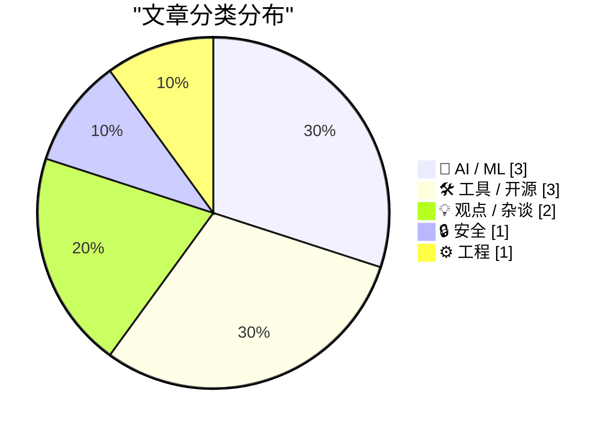
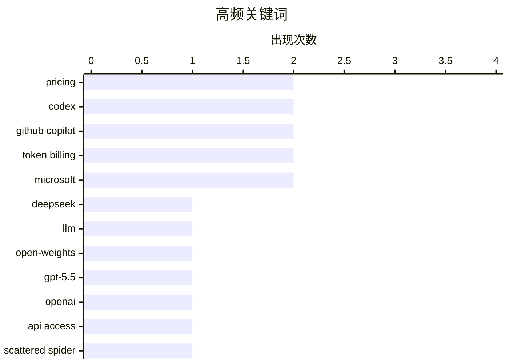

# 📰 AI 博客每日精选 — 2026-04-21

> 来自 Karpathy 推荐的 92 个顶级技术博客，AI 精选 Top 10

## 📝 今日看点

今天技术圈最强信号，是大模型能力继续逼近前沿，同时价格、上下文长度和开放性都在快速下探，AI 基础模型正加速从“稀缺能力”走向“可大规模部署的基础设施”。另一条主线是 AI 编程全面进入深水区：编程智能体在真实开发中的承担比例持续上升，围绕 Copilot 的 token 计费、仓库上下文整理和工程化工具链，也说明 AI 辅助开发正从“尝鲜”转向“精细化运营”。与此同时，行业也在重新审视技术工作的边界与风险，一边是软件工程职业路径被 AI 重塑，另一边是网络犯罪打击与测试、验证等基础工程能力的重要性再次被放大。

---

## 🏆 今日必读

🥇 **DeepSeek V4：接近前沿能力，但价格只需一小部分**

[DeepSeek V4 - almost on the frontier, a fraction of the price](https://simonwillison.net/2026/Apr/24/deepseek-v4/#atom-everything) — simonwillison.net · 2026-04-24 · 🤖 AI / ML

> DeepSeek 发布了 V4 系列首批预览模型 DeepSeek-V4-Pro 和 DeepSeek-V4-Flash，主打 100 万 token 上下文与 MoE 架构，并采用 MIT 许可证开放权重。参数规模上，Pro 为 1.6T 总参数/49B 激活参数，Flash 为 284B 总参数/13B 激活参数；作者认为 Pro 可能成为当前最大开源权重模型，体量超过 Kimi K2.6（1.1T）、GLM-5.1（754B）和 DeepSeek V3.2（685B）。文章给出的价格显示，Flash 为输入 $0.14/百万 tokens、输出 $0.28，Pro 为输入 $1.74、输出 $3.48，并与 Gemini、OpenAI、Anthropic 的多款模型做了并列对比。对比结论是 Flash 在小模型里最便宜，Pro 在大模型/前沿模型里也处于最低价位。论文引述的数据称，在 100 万 token 场景下，V4-Pro 单 token FLOPs 仅为 V3.2 的 27%、KV cache 为 10%；V4-Flash 进一步降到 FLOPs 10%、KV cache 7%，效率提升被用来解释其低定价。

💡 **为什么值得读**: 值得读在于它把“参数规模—长上下文效率—实际 API 价格”三者放在同一视角下量化比较，能快速判断 DeepSeek V4 的性价比是否改变你的模型选型。

🏷️ DeepSeek, LLM, open-weights, pricing

🥈 **通过半官方 Codex 后门 API 使用 GPT-5.5 跑 pelican 基准**

[A pelican for GPT-5.5 via the semi-official Codex backdoor API](https://simonwillison.net/2026/Apr/23/gpt-5-5/#atom-everything) — simonwillison.net · 2026-04-24 · 🤖 AI / ML

> GPT-5.5 已上线 OpenAI Codex，并正向付费 ChatGPT 订阅用户逐步开放，但正式 API 仍未提供。作者认为 GPT-5.5 速度快、效果强，且在运行 pelican 基准时更倾向直接使用 API，以避免 ChatGPT 或其他代理框架中的隐藏系统提示影响结果。文章重点梳理了 OpenClaw、Pi 与大模型厂商订阅接口之间的争议，以及 OpenAI 允许通过 Codex CLI 所使用的机制接入订阅服务这一背景。基于对 openai/codex 仓库的逆向分析，作者借助 Claude Code 制作了 llm-openai-via-codex 插件，可复用现有 Codex 订阅在 LLM 工具中调用 openai-codex/gpt-5.5。作者的实际结论是，在官方 API 尚未开放前，这条 Codex 相关接口提供了一种可用替代方案来测试和使用 GPT-5.5。

💡 **为什么值得读**: 值得读，因为它不仅说明了 GPT-5.5 在官方 API 缺席时如何被实际接入，还给出了利用 Codex 订阅在本地工具链中调用模型的具体路径。

🏷️ GPT-5.5, Codex, OpenAI, API access

🥉 **“Scattered Spider”成员“Tylerb”认罪**

[‘Scattered Spider’ Member ‘Tylerb’ Pleads Guilty](https://krebsonsecurity.com/2026/04/scattered-spider-member-tylerb-pleads-guilty/) — krebsonsecurity.com · 2026-04-21 · 🔒 安全

> 24 岁英国籍嫌疑人 Tyler Robert Buchanan 承认自己是英语网络犯罪团伙 Scattered Spider 的高级成员，并就电信欺诈共谋和加重身份盗窃罪认罪。其供述显示，该团伙在 2022 年夏季发起数以万计的短信钓鱼攻击，入侵了包括 Twilio、LastPass、DoorDash 和 Mailchimp 在内的多家科技公司，再利用泄露数据实施 SIM 交换攻击，从加密货币投资者手中窃取资金。美国司法部称，Buchanan 承认从美国各地个人受害者处至少盗走 800 万美元虚拟货币；FBI 则通过用于注册钓鱼域名的相同用户名、邮箱以及英国登录 IP，将其与 2022 年攻击活动关联起来。报道还补充了其后续行踪：他在 2023 年逃离英国，2024 年 6 月于西班牙准备登机前往意大利时被捕，现已被引渡至美国候审，可能面临超过 20 年监禁。Scattered Spider 的典型手法是通过冒充员工或承包商欺骗 IT 服务台获取访问权限，此案把该团伙的社会工程、短信钓鱼和加密货币盗窃链条串联得更清晰。

💡 **为什么值得读**: 值得读在于它用一名核心成员的认罪细节，把 Scattered Spider 从短信钓鱼到 SIM 交换再到加密货币盗窃的完整作案路径具体化了。

🏷️ Scattered Spider, phishing, social engineering, cybercrime

---

## 📊 数据概览

| 扫描源 | 抓取文章 | 时间范围 | 精选 |
|:---:|:---:|:---:|:---:|
| 88/92 | 2532 篇 → 92 篇 | 24h | **10 篇** |

### 分类分布



### 高频关键词



<details>
<summary>📈 纯文本关键词图（终端友好）</summary>

```
pricing        │ ████████████████████ 2
codex          │ ████████████████████ 2
github copilot │ ████████████████████ 2
token billing  │ ████████████████████ 2
microsoft      │ ████████████████████ 2
deepseek       │ ██████████░░░░░░░░░░ 1
llm            │ ██████████░░░░░░░░░░ 1
open-weights   │ ██████████░░░░░░░░░░ 1
gpt-5.5        │ ██████████░░░░░░░░░░ 1
openai         │ ██████████░░░░░░░░░░ 1
```

</details>

### 🏷️ 话题标签

**pricing**(2) · **codex**(2) · **github copilot**(2) · token billing(2) · microsoft(2) · deepseek(1) · llm(1) · open-weights(1) · gpt-5.5(1) · openai(1) · api access(1) · scattered spider(1) · phishing(1) · social engineering(1) · cybercrime(1) · rate limits(1) · coding agents(1) · developer workflow(1) · technical debt(1) · ai(1)

---

## 🤖 AI / ML

### 1. DeepSeek V4：接近前沿能力，但价格只需一小部分

[DeepSeek V4 - almost on the frontier, a fraction of the price](https://simonwillison.net/2026/Apr/24/deepseek-v4/#atom-everything) — **simonwillison.net** · 2026-04-24 · ⭐ 26/30

> DeepSeek 发布了 V4 系列首批预览模型 DeepSeek-V4-Pro 和 DeepSeek-V4-Flash，主打 100 万 token 上下文与 MoE 架构，并采用 MIT 许可证开放权重。参数规模上，Pro 为 1.6T 总参数/49B 激活参数，Flash 为 284B 总参数/13B 激活参数；作者认为 Pro 可能成为当前最大开源权重模型，体量超过 Kimi K2.6（1.1T）、GLM-5.1（754B）和 DeepSeek V3.2（685B）。文章给出的价格显示，Flash 为输入 $0.14/百万 tokens、输出 $0.28，Pro 为输入 $1.74、输出 $3.48，并与 Gemini、OpenAI、Anthropic 的多款模型做了并列对比。对比结论是 Flash 在小模型里最便宜，Pro 在大模型/前沿模型里也处于最低价位。论文引述的数据称，在 100 万 token 场景下，V4-Pro 单 token FLOPs 仅为 V3.2 的 27%、KV cache 为 10%；V4-Flash 进一步降到 FLOPs 10%、KV cache 7%，效率提升被用来解释其低定价。

🏷️ DeepSeek, LLM, open-weights, pricing

---

### 2. 通过半官方 Codex 后门 API 使用 GPT-5.5 跑 pelican 基准

[A pelican for GPT-5.5 via the semi-official Codex backdoor API](https://simonwillison.net/2026/Apr/23/gpt-5-5/#atom-everything) — **simonwillison.net** · 2026-04-24 · ⭐ 26/30

> GPT-5.5 已上线 OpenAI Codex，并正向付费 ChatGPT 订阅用户逐步开放，但正式 API 仍未提供。作者认为 GPT-5.5 速度快、效果强，且在运行 pelican 基准时更倾向直接使用 API，以避免 ChatGPT 或其他代理框架中的隐藏系统提示影响结果。文章重点梳理了 OpenClaw、Pi 与大模型厂商订阅接口之间的争议，以及 OpenAI 允许通过 Codex CLI 所使用的机制接入订阅服务这一背景。基于对 openai/codex 仓库的逆向分析，作者借助 Claude Code 制作了 llm-openai-via-codex 插件，可复用现有 Codex 订阅在 LLM 工具中调用 openai-codex/gpt-5.5。作者的实际结论是，在官方 API 尚未开放前，这条 Codex 相关接口提供了一种可用替代方案来测试和使用 GPT-5.5。

🏷️ GPT-5.5, Codex, OpenAI, API access

---

### 3. AI 奥德赛，第 4 部分：令人惊叹的编程智能体

[An AI Odyssey, Part 4: Astounding Coding Agents](https://www.johndcook.com/blog/2026/04/21/an-ai-odyssey-part-4-astounding-coding-agents/) — **johndcook.com** · 2026-04-22 · ⭐ 25/30

> 作者记录了 AI 编程智能体在近几个月的显著进步，以及它们在真实研发流程中的适用范围与局限。按其个人粗略估计，这类工具在去年 8 月承担了约 20% 的编码工作，而现在已提升到约 60%；模型在理解代码库全貌、定位隐蔽细节和完成更广泛任务方面都更强。与此同时，它们仍会需要人为指引排查方向，可能只盯局部而忽略整体，还会为迎合测试框架而过度优化，生成与现有代码概念不一致或远超必要规模的代码。作者使用的是 OpenAI Codex 而不是 Claude Code，并强调自己的研究型开发需要与智能体持续协作，因为写代码本身就是探索过程，而且代码库必须保持人类可读。作者的结论是，编程智能体带来了令人震惊的生产力提升，但不是万能药，最有效的使用方式是让人深度参与、持续引导并利用其快速重构能力。

🏷️ coding agents, Codex, developer workflow, technical debt

---

## 🛠 工具 / 开源

### 4. 独家：微软将把 GitHub Copilot 用户转向基于 Token 的计费，并收紧速率限制

[Exclusive: Microsoft To Shift GitHub Copilot Users To Token-Based Billing, Tighten Rate Limits](https://www.wheresyoured.at/news-microsoft-to-shift-github-copilot-users-to-token-based-billing-reduce-rate-limits-2/) — **wheresyoured.at** · 5 小时前 · ⭐ 26/30

> 微软被曝计划调整 GitHub Copilot 的个人与学生订阅策略，把现有按 requests 计量的方式逐步转向按 token 实际消耗计费。泄露文件显示，GitHub Copilot 的周运行成本自年初以来已接近翻倍，这使基于 token 的计费从长期优先事项变成了更紧迫的动作。现行个人套餐中，Pro 每月提供 300 次 requests、Pro+ 提供 1500 次，未来则可能按提示词与输出消耗的 token 数以及对应算力成本收费。与此同时，微软还计划暂停学生和付费个人层级的新注册，收紧个人和企业账户的速率限制，并让最便宜订阅层失去部分模型访问权限；文中还提到 GitHub Copilot Pro 将移除 Opus。作者给出的判断是，微软这一变化说明 AI 产品长期补贴算力成本的做法正在收缩，GitHub Copilot 正在跟随 Anthropic 等公司的方向转向更直接的成本回收模式。

🏷️ GitHub Copilot, token billing, rate limits, Microsoft

---

### 5. 独家：微软将于 6 月把所有 GitHub Copilot 订阅迁移到基于 Token 的计费

[[Updated] Exclusive: Microsoft Moving All GitHub Copilot Subscribers To Token-Based Billing In June](https://www.wheresyoured.at/exclusive-microsoft-moving-all-github-copilot-subscribers-to-token-based-billing-in-june/) — **wheresyoured.at** · 2026-04-23 · ⭐ 25/30

> 微软计划从 2026 年 6 月开始，将 GitHub Copilot 从按“请求次数”使用改为基于 token 成本的计费体系。现行方案中，Pro 每月 10 美元包含 300 次请求，Pro+ 每月 39 美元包含 1500 次请求，而新方案将按模型实际输入和输出 token 成本计费，例如 Claude Opus 4.7 的价格为每百万输入 token 5 美元、每百万输出 token 25 美元。面向企业客户，Copilot Business 在 2026 年 6 至 8 月促销期内为每用户每月 19 美元并附带 30 美元共享 AI 积分，Copilot Enterprise 为每用户每月 39 美元并附带 70 美元共享 AI 积分；促销结束后分别改为 19 美元配 19 美元 token 和 39 美元配 39 美元 token。组织版的 AI 积分将采用 pooled 方式，由整个组织共享使用；个人 Pro 和 Pro+ 订阅者将如何处理仍不明确。文中同时提到，微软已暂停个人和学生账户的新注册、从 10 美元套餐中移除 Anthropic Opus 模型，并计划进一步收紧使用限制，背景是 AI 算力成本持续上升。

🏷️ GitHub Copilot, token billing, Microsoft, pricing

---

### 6. brief

[brief](https://nesbitt.io/2026/04/21/brief.html) — **nesbitt.io** · 2026-04-21 · ⭐ 24/30

> 陌生代码仓库的接手者、扫描器和 AI 编码代理都需要先弄清语言、依赖安装方式、测试命令、提交前要跑的 lint，以及安全审查中的危险函数，而这些信息在同类项目中往往被重复摸索。brief 把这类知识整理为一个覆盖 54 个语言生态、516 个工具的知识库，并提供一个单文件 Go CLI，可对本地目录、Git URL 或 gem:rails、npm:express 这类注册表坐标进行识别。它会按 20 个类别输出工具链信息，包括可执行命令、配置文件位置，以及许可证 SPDX 标识、security policy、CODEOWNERS、FUNDING.yml 等常见治理与社区文件；还支持 brief diff、brief missing、brief threat-model、brief sinks 等子命令。作者强调其机器可读数据集才是独特之处，统一描述了数百个工具的调用命令、配置文件位置和分类体系，而 CI 模板、devcontainer 生成器和编辑器 onboarding 流程都只各自覆盖其中一部分。全部 516 条定义的检查可在 250ms 内完成，作者也将其作为克隆仓库后和 Claude 会话开始时的首个步骤，以减少探索性 grep、错误猜测和额外 token 消耗。

🏷️ CLI, repository analysis, developer tooling, AI agents

---

## 💡 观点 / 杂谈

### 7. 软件工程可能不再是一份可以做一辈子的职业

[Software engineering may no longer be a lifetime career](https://seangoedecke.com/software-engineering-may-no-longer-be-a-lifetime-career/) — **seangoedecke.com** · 2026-04-24 · ⭐ 24/30

> 焦点在于：即使使用 AI 会让软件工程师在完成任务时学得更少、长期技术能力可能退化，这也未必构成反对在工作中使用 AI 的有效理由。作者认为，软件工程之所以长期适合一边工作一边持续成长，只是到 2024 年前的一种幸运状态，而不是这门职业不可改变的本质。文章用从汇编转向 C、以及建筑工人必须搬运重物的类比说明：一项工具或工作方式即便会带来长期代价，只要短期效率收益足够高，职业实践仍可能被迫接受它。作者进一步判断，如果模型足够好，坚持手写代码的人可能会像拒绝使用电动工具的木匠一样失去竞争力，软件工程师也可能为了短期收入交换长期认知能力。结论是，如果这种趋势成立，软件工程可能像职业运动员一样不再适合作为超长期职业，人们应尽早为此做规划。

🏷️ AI, software engineering, career, automation

---

### 8. 新的一天已经到来

[★ Another Day Has Come](https://daringfireball.net/2026/04/another_day_has_come) — **daringfireball.net** · 2026-04-21 · ⭐ 24/30

> 苹果宣布 CEO 交接，Tim Cook 转任董事长，John Ternus 接任 CEO，这次交接与 2011 年 Steve Jobs 因病卸任时的氛围截然不同。文中认为 Cook 是在苹果业务整体强劲时离任：iPhone 17 系列被称为历来最佳之一，MacBook Neo 以 600 美元定价带动需求，甚至传出 A18 Pro 芯片供不应求，iPad、AirPods 和 Apple Watch 也都维持强势表现。作者肯定 Cook 在过去 15 年里承接 Jobs 留下的产品基础，带领苹果和其社区走出当年的悲痛，并把公司的增长潜力兑现出来。与此同时，作者强调 Cook 不是产品型领导者，而苹果在 2010 年代需要的正是让既有产品开花结果的人。作者判断苹果现在更需要一位能够主导新产品创造的“产品型”掌舵者，并认为来自内部、拥有 25 年资历的 John Ternus 看起来正是这样的人选。

🏷️ Apple, Tim Cook, John Ternus, succession

---

## 🔒 安全

### 9. “Scattered Spider”成员“Tylerb”认罪

[‘Scattered Spider’ Member ‘Tylerb’ Pleads Guilty](https://krebsonsecurity.com/2026/04/scattered-spider-member-tylerb-pleads-guilty/) — **krebsonsecurity.com** · 2026-04-21 · ⭐ 26/30

> 24 岁英国籍嫌疑人 Tyler Robert Buchanan 承认自己是英语网络犯罪团伙 Scattered Spider 的高级成员，并就电信欺诈共谋和加重身份盗窃罪认罪。其供述显示，该团伙在 2022 年夏季发起数以万计的短信钓鱼攻击，入侵了包括 Twilio、LastPass、DoorDash 和 Mailchimp 在内的多家科技公司，再利用泄露数据实施 SIM 交换攻击，从加密货币投资者手中窃取资金。美国司法部称，Buchanan 承认从美国各地个人受害者处至少盗走 800 万美元虚拟货币；FBI 则通过用于注册钓鱼域名的相同用户名、邮箱以及英国登录 IP，将其与 2022 年攻击活动关联起来。报道还补充了其后续行踪：他在 2023 年逃离英国，2024 年 6 月于西班牙准备登机前往意大利时被捕，现已被引渡至美国候审，可能面临超过 20 年监禁。Scattered Spider 的典型手法是通过冒充员工或承包商欺骗 IT 服务台获取访问权限，此案把该团伙的社会工程、短信钓鱼和加密货币盗窃链条串联得更清晰。

🏷️ Scattered Spider, phishing, social engineering, cybercrime

---

## ⚙️ 工程

### 10. 256 行以内：测试用例最小化

[256 Lines or Less: Test Case Minimization](https://matklad.github.io/2026/04/20/test-case-minimization.html) — **matklad.github.io** · 23 小时前 · ⭐ 24/30

> 文章围绕如何用极少代码实现一个可用的属性测试与模糊测试工具，并用它来做测试用例最小化。作者先为一个关于共识算法的想法写了这个 PBT 库和对应测试，在几小时内就暴露出自己的算法性缺陷以及若干编码错误，借此说明这类工具的高性价比。实现核心是一个单文件的 Zig 库 FRNG.zig，其中把核心抽象定义为有限随机数生成器 FRNG：随机数预先生成、以字节切片 entropy 保存，并在耗尽时返回 OutOfEntropy。围绕这个抽象，最基础的接口是按需取出固定大小的字节切片 bytes(size)，其余能力作为建立在它之上的辅助函数扩展；作者认为这种做法虽然非常简单，但在仅 256 行的体量下依然具有很高的“功率重量比”。

🏷️ property-based testing, fuzzing, test minimization, Zig

---

*生成于 2026-04-21 07:00 | 扫描 88 源 → 获取 2532 篇 → 精选 10 篇*
*基于 [Hacker News Popularity Contest 2025](https://refactoringenglish.com/tools/hn-popularity/) RSS 源列表*
