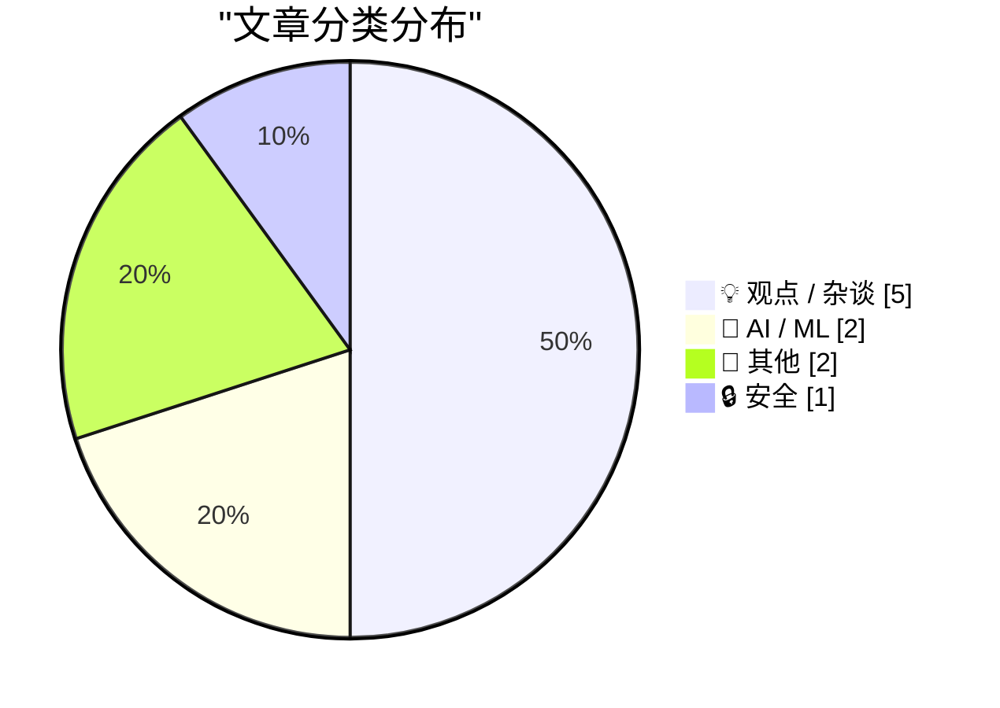
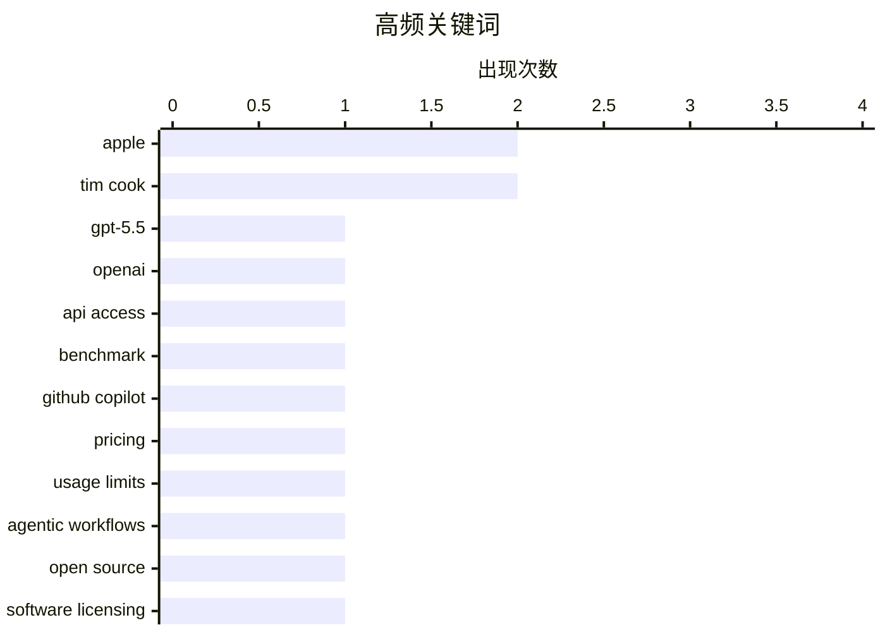

# 📰 AI 博客每日精选 — 2026-04-21

> 来自 Karpathy 推荐的 92 个顶级技术博客，AI 精选 Top 10

## 🏆 今日必读

🥇 **A pelican for GPT-5.5 via the semi-official Codex backdoor API**

[A pelican for GPT-5.5 via the semi-official Codex backdoor API](https://simonwillison.net/2026/Apr/23/gpt-5-5/#atom-everything) — simonwillison.net · 2026-04-24 · 🤖 AI / ML

> Simon Willison’s Weblog Subscribe Sponsored by: Sonar &mdash; Now with SAST + SCA for secure, dependency-aware Agentic Engineering. SonarQube Advanced Security A pelican for GPT-5.5 via the semi-offic

🏷️ GPT-5.5, OpenAI, API access, benchmark

🥈 **Changes to GitHub Copilot Individual plans**

[Changes to GitHub Copilot Individual plans](https://simonwillison.net/2026/Apr/22/changes-to-github-copilot/#atom-everything) — simonwillison.net · 2026-04-22 · 🤖 AI / ML

> Changes to GitHub Copilot Individual plans ( via ) On the same day as Claude Code's temporary will-they-won't-they $100/month kerfuffle (for the moment, they won't ), here's the latest on GitHub Copil

🏷️ GitHub Copilot, pricing, usage limits, agentic workflows

🥉 **Pluralistic: The (other) problem with automatic conversion of free software to proprietary software (23 Apr 2026)**

[Pluralistic: The (other) problem with automatic conversion of free software to proprietary software (23 Apr 2026)](https://pluralistic.net/2026/04/23/poison-pill/) — pluralistic.net · 2026-04-23 · 💡 观点 / 杂谈

> ->->->->->->->->->->->->->->->->->->->->->->->->->->->->-> Top Sources: None --> Today's links The (other) problem with automatic conversion of free software to proprietary software : You can't add AN

🏷️ open source, software licensing, LLM, copyright

---

## 📊 数据概览

| 扫描源 | 抓取文章 | 时间范围 | 精选 |
|:---:|:---:|:---:|:---:|
| 88/92 | 2532 篇 → 85 篇 | 24h | **10 篇** |

### 分类分布



### 高频关键词



<details>
<summary>📈 纯文本关键词图（终端友好）</summary>

```
apple             │ ████████████████████ 2
tim cook          │ ████████████████████ 2
gpt-5.5           │ ██████████░░░░░░░░░░ 1
openai            │ ██████████░░░░░░░░░░ 1
api access        │ ██████████░░░░░░░░░░ 1
benchmark         │ ██████████░░░░░░░░░░ 1
github copilot    │ ██████████░░░░░░░░░░ 1
pricing           │ ██████████░░░░░░░░░░ 1
usage limits      │ ██████████░░░░░░░░░░ 1
agentic workflows │ ██████████░░░░░░░░░░ 1
```

</details>

### 🏷️ 话题标签

**apple**(2) · **tim cook**(2) · **gpt-5.5**(1) · openai(1) · api access(1) · benchmark(1) · github copilot(1) · pricing(1) · usage limits(1) · agentic workflows(1) · open source(1) · software licensing(1) · llm(1) · copyright(1) · scattered spider(1) · phishing(1) · cybercrime(1) · identity theft(1) · gig economy(1) · labor(1)

---

## 💡 观点 / 杂谈

### 1. Pluralistic: The (other) problem with automatic conversion of free software to proprietary software (23 Apr 2026)

[Pluralistic: The (other) problem with automatic conversion of free software to proprietary software (23 Apr 2026)](https://pluralistic.net/2026/04/23/poison-pill/) — **pluralistic.net** · 2026-04-23 · ⭐ 25/30

> ->->->->->->->->->->->->->->->->->->->->->->->->->->->->-> Top Sources: None --> Today's links The (other) problem with automatic conversion of free software to proprietary software : You can't add AN

🏷️ open source, software licensing, LLM, copyright

---

### 2. Pluralistic: It's not a crime if we do it (to nurses) with an app (22 Apr 2026)

[Pluralistic: It's not a crime if we do it (to nurses) with an app (22 Apr 2026)](https://pluralistic.net/2026/04/22/uber-for-nurses/) — **pluralistic.net** · 2026-04-22 · ⭐ 23/30

> ->->->->->->->->->->->->->->->->->->->->->->->->->->->->-> Top Sources: None --> Today's links It's not a crime if we do it (to nurses) with an app : It's not a bald spot, it's a solar panel for a sex

🏷️ gig economy, labor, regulation, apps

---

### 3. ★ Another Day Has Come

[★ Another Day Has Come](https://daringfireball.net/2026/04/another_day_has_come) — **daringfireball.net** · 2026-04-21 · ⭐ 23/30

> By John Gruber Archive The Talk Show Dithering Projects Contact Colophon Feeds / Social Twitter --> Sponsorship Rec League : Share what you’re into and find your people. Another Day Has Come Monday, 2

🏷️ Apple, Tim Cook, John Ternus, succession

---

### 4. Luddites and AI datacenters

[Luddites and AI datacenters](https://seangoedecke.com/luddites-and-ai-datacenters/) — **seangoedecke.com** · 2026-04-22 · ⭐ 21/30

> Luddites and AI datacenters Is it time to start burning down datacenters? Some people think so. An Indianapolis city council member had his house recently shot up for supporting datacenters, and Sam A

🏷️ AI datacenters, Luddites, automation, history

---

### 5. Ben Thompson on Tim Cook’s Legacy

[Ben Thompson on Tim Cook’s Legacy](https://stratechery.com/2026/tim-cooks-impeccable-timing/) — **daringfireball.net** · 2026-04-23 · ⭐ 24/30

> Listen to this post : Log in to listen It’s the nature of business that the eulogy for a chief executive doesn’t happen when they die, but when they retire, or, in the case of Apple CEO Tim Cook, anno

🏷️ Tim Cook, Apple, leadership, business

---

## 🤖 AI / ML

### 6. A pelican for GPT-5.5 via the semi-official Codex backdoor API

[A pelican for GPT-5.5 via the semi-official Codex backdoor API](https://simonwillison.net/2026/Apr/23/gpt-5-5/#atom-everything) — **simonwillison.net** · 2026-04-24 · ⭐ 27/30

> Simon Willison’s Weblog Subscribe Sponsored by: Sonar &mdash; Now with SAST + SCA for secure, dependency-aware Agentic Engineering. SonarQube Advanced Security A pelican for GPT-5.5 via the semi-offic

🏷️ GPT-5.5, OpenAI, API access, benchmark

---

### 7. Changes to GitHub Copilot Individual plans

[Changes to GitHub Copilot Individual plans](https://simonwillison.net/2026/Apr/22/changes-to-github-copilot/#atom-everything) — **simonwillison.net** · 2026-04-22 · ⭐ 26/30

> Changes to GitHub Copilot Individual plans ( via ) On the same day as Claude Code's temporary will-they-won't-they $100/month kerfuffle (for the moment, they won't ), here's the latest on GitHub Copil

🏷️ GitHub Copilot, pricing, usage limits, agentic workflows

---

## 📝 其他

### 8. A Plethora of Tweezers

[A Plethora of Tweezers](https://feed.tedium.co/link/15204/17324561/tweezer-weird-facts-history) — **tedium.co** · 2026-04-24 · ⭐ 15/30

> A Plethora of Tweezers Pondering the way that tweezers isolate things at a small scale, and the fact that you can take an aptitude test to show that you can tweeze with the pros. By Ernie Smith • Apri

---

### 9. Approximation to solve an oblique triangle

[Approximation to solve an oblique triangle](https://www.johndcook.com/blog/2026/04/23/solve-an-oblique-triangle/) — **johndcook.com** · 2026-04-23 · ⭐ 15/30

> The previous post gave a simple and accurate approximation for the smaller angle of a right triangle. Given a right triangle with sides a , b , and c , where a is the shortest side and c is the hypote

---

## 🔒 安全

### 10. ‘Scattered Spider’ Member ‘Tylerb’ Pleads Guilty

[‘Scattered Spider’ Member ‘Tylerb’ Pleads Guilty](https://krebsonsecurity.com/2026/04/scattered-spider-member-tylerb-pleads-guilty/) — **krebsonsecurity.com** · 2026-04-21 · ⭐ 24/30

> A 24-year-old British national and senior member of the cybercrime group “ Scattered Spider ” has pleaded guilty to wire fraud conspiracy and aggravated identity theft. Tyler Robert Buchanan admitted 

🏷️ Scattered Spider, phishing, cybercrime, identity theft

---

*生成于 2026-04-21 07:00 | 扫描 88 源 → 获取 2532 篇 → 精选 10 篇*
*基于 [Hacker News Popularity Contest 2025](https://refactoringenglish.com/tools/hn-popularity/) RSS 源列表*
