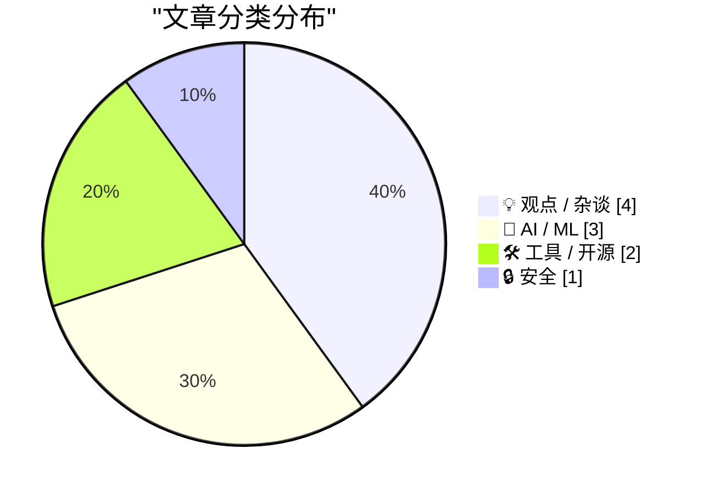
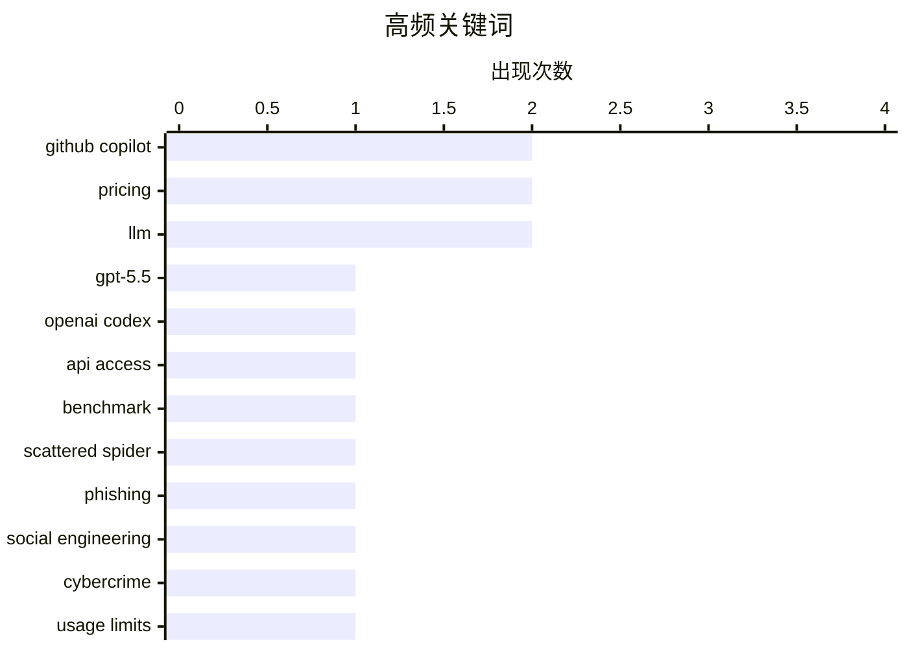

# 📰 AI 博客每日精选 — 2026-04-22

> 来自 Karpathy 推荐的 92 个顶级技术博客，AI 精选 Top 10

## 🏆 今日必读

🥇 **A pelican for GPT-5.5 via the semi-official Codex backdoor API**

[A pelican for GPT-5.5 via the semi-official Codex backdoor API](https://simonwillison.net/2026/Apr/23/gpt-5-5/#atom-everything) — simonwillison.net · 2026-04-24 · 🤖 AI / ML

> Simon Willison’s Weblog Subscribe Sponsored by: Sonar &mdash; Now with SAST + SCA for secure, dependency-aware Agentic Engineering. SonarQube Advanced Security A pelican for GPT-5.5 via the semi-offic

🏷️ GPT-5.5, OpenAI Codex, API access, benchmark

🥈 **‘Scattered Spider’ Member ‘Tylerb’ Pleads Guilty**

[‘Scattered Spider’ Member ‘Tylerb’ Pleads Guilty](https://krebsonsecurity.com/2026/04/scattered-spider-member-tylerb-pleads-guilty/) — krebsonsecurity.com · 8 小时前 · 🔒 安全

> A 24-year-old British national and senior member of the cybercrime group “ Scattered Spider ” has pleaded guilty to wire fraud conspiracy and aggravated identity theft. Tyler Robert Buchanan admitted 

🏷️ Scattered Spider, phishing, social engineering, cybercrime

🥉 **Changes to GitHub Copilot Individual plans**

[Changes to GitHub Copilot Individual plans](https://simonwillison.net/2026/Apr/22/changes-to-github-copilot/#atom-everything) — simonwillison.net · 2026-04-22 · 🤖 AI / ML

> Changes to GitHub Copilot Individual plans ( via ) On the same day as Claude Code's temporary will-they-won't-they $100/month kerfuffle (for the moment, they won't ), here's the latest on GitHub Copil

🏷️ GitHub Copilot, pricing, usage limits, agentic coding

---

## 📊 数据概览

| 扫描源 | 抓取文章 | 时间范围 | 精选 |
|:---:|:---:|:---:|:---:|
| 88/92 | 2532 篇 → 66 篇 | 24h | **10 篇** |

### 分类分布



### 高频关键词



<details>
<summary>📈 纯文本关键词图（终端友好）</summary>

```
github copilot     │ ████████████████████ 2
pricing            │ ████████████████████ 2
llm                │ ████████████████████ 2
gpt-5.5            │ ██████████░░░░░░░░░░ 1
openai codex       │ ██████████░░░░░░░░░░ 1
api access         │ ██████████░░░░░░░░░░ 1
benchmark          │ ██████████░░░░░░░░░░ 1
scattered spider   │ ██████████░░░░░░░░░░ 1
phishing           │ ██████████░░░░░░░░░░ 1
social engineering │ ██████████░░░░░░░░░░ 1
```

</details>

### 🏷️ 话题标签

**github copilot**(2) · **pricing**(2) · **llm**(2) · gpt-5.5(1) · openai codex(1) · api access(1) · benchmark(1) · scattered spider(1) · phishing(1) · social engineering(1) · cybercrime(1) · usage limits(1) · agentic coding(1) · open source(1) · licensing(1) · copyright(1) · token billing(1) · microsoft(1) · ai bubble(1) · anthropic(1)

---

## 💡 观点 / 杂谈

### 1. Pluralistic: The (other) problem with automatic conversion of free software to proprietary software (23 Apr 2026)

[Pluralistic: The (other) problem with automatic conversion of free software to proprietary software (23 Apr 2026)](https://pluralistic.net/2026/04/23/poison-pill/) — **pluralistic.net** · 2026-04-23 · ⭐ 24/30

> ->->->->->->->->->->->->->->->->->->->->->->->->->->->->-> Top Sources: None --> Today's links The (other) problem with automatic conversion of free software to proprietary software : You can't add AN

🏷️ open source, licensing, LLM, copyright

---

### 2. Four Horsemen of the AIpocalypse

[Four Horsemen of the AIpocalypse](https://www.wheresyoured.at/four-horsemen-of-the-aipocalypse/) — **wheresyoured.at** · 6 小时前 · ⭐ 24/30

> Four Horsemen of the AIpocalypse Ed Zitron Apr 21, 2026 22 min read Table of Contents If you liked this piece, please subscribe to my premium newsletter. It’s $70 a year, or $7 a month, and in return 

🏷️ AI bubble, Anthropic, OpenAI, infrastructure

---

### 3. ★ Another Day Has Come

[★ Another Day Has Come](https://daringfireball.net/2026/04/another_day_has_come) — **daringfireball.net** · 19 小时前 · ⭐ 24/30

> By John Gruber Archive The Talk Show Dithering Projects Contact Colophon Feeds / Social Twitter --> Sponsorship Rec League : Share what you’re into and find your people. Another Day Has Come Monday, 2

🏷️ Apple, CEO transition, Tim Cook, leadership

---

### 4. Pluralistic: It's not a crime if we do it (to nurses) with an app (22 Apr 2026)

[Pluralistic: It's not a crime if we do it (to nurses) with an app (22 Apr 2026)](https://pluralistic.net/2026/04/22/uber-for-nurses/) — **pluralistic.net** · 2026-04-22 · ⭐ 23/30

> ->->->->->->->->->->->->->->->->->->->->->->->->->->->->-> Top Sources: None --> Today's links It's not a crime if we do it (to nurses) with an app : It's not a bald spot, it's a solar panel for a sex

🏷️ regulation, labor, healthcare, platforms

---

## 🤖 AI / ML

### 5. A pelican for GPT-5.5 via the semi-official Codex backdoor API

[A pelican for GPT-5.5 via the semi-official Codex backdoor API](https://simonwillison.net/2026/Apr/23/gpt-5-5/#atom-everything) — **simonwillison.net** · 2026-04-24 · ⭐ 27/30

> Simon Willison’s Weblog Subscribe Sponsored by: Sonar &mdash; Now with SAST + SCA for secure, dependency-aware Agentic Engineering. SonarQube Advanced Security A pelican for GPT-5.5 via the semi-offic

🏷️ GPT-5.5, OpenAI Codex, API access, benchmark

---

### 6. Changes to GitHub Copilot Individual plans

[Changes to GitHub Copilot Individual plans](https://simonwillison.net/2026/Apr/22/changes-to-github-copilot/#atom-everything) — **simonwillison.net** · 2026-04-22 · ⭐ 25/30

> Changes to GitHub Copilot Individual plans ( via ) On the same day as Claude Code's temporary will-they-won't-they $100/month kerfuffle (for the moment, they won't ), here's the latest on GitHub Copil

🏷️ GitHub Copilot, pricing, usage limits, agentic coding

---

### 7. Please don’t trust your chatbot for medical advice

[Please don’t trust your chatbot for medical advice](https://garymarcus.substack.com/p/please-dont-trust-your-chatbot-for) — **garymarcus.substack.com** · 10 小时前 · ⭐ 24/30

> Please don’t trust your chatbot for medical advice Four separate studies all point in the same direction Gary Marcus Apr 21, 2026 235 99 36 Share Remember how I used to say that large language models 

🏷️ medical advice, LLM, hallucination, misinformation

---

## 🛠 工具 / 开源

### 8. [Updated] Exclusive: Microsoft Moving All GitHub Copilot Subscribers To Token-Based Billing In June

[[Updated] Exclusive: Microsoft Moving All GitHub Copilot Subscribers To Token-Based Billing In June](https://www.wheresyoured.at/exclusive-microsoft-moving-all-github-copilot-subscribers-to-token-based-billing-in-june/) — **wheresyoured.at** · 2026-04-23 · ⭐ 24/30

> news [Updated] Exclusive: Microsoft Moving All GitHub Copilot Subscribers To Token-Based Billing In June Ed Zitron Apr 22, 2026 2 min read Executive Summary: Internal documents reveal Microsoft’s plan

🏷️ GitHub Copilot, pricing, token billing, Microsoft

---

### 9. brief

[brief](https://nesbitt.io/2026/04/21/brief.html) — **nesbitt.io** · 13 小时前 · ⭐ 24/30

> Anyone landing in an unfamiliar repo, whether that’s a new contributor, a security scanner, or an AI coding agent, has to answer the same handful of questions before doing anything useful: what langua

🏷️ CLI, developer tooling, codebase onboarding, AI agents

---

## 🔒 安全

### 10. ‘Scattered Spider’ Member ‘Tylerb’ Pleads Guilty

[‘Scattered Spider’ Member ‘Tylerb’ Pleads Guilty](https://krebsonsecurity.com/2026/04/scattered-spider-member-tylerb-pleads-guilty/) — **krebsonsecurity.com** · 8 小时前 · ⭐ 26/30

> A 24-year-old British national and senior member of the cybercrime group “ Scattered Spider ” has pleaded guilty to wire fraud conspiracy and aggravated identity theft. Tyler Robert Buchanan admitted 

🏷️ Scattered Spider, phishing, social engineering, cybercrime

---

*生成于 2026-04-22 07:00 | 扫描 88 源 → 获取 2532 篇 → 精选 10 篇*
*基于 [Hacker News Popularity Contest 2025](https://refactoringenglish.com/tools/hn-popularity/) RSS 源列表*
