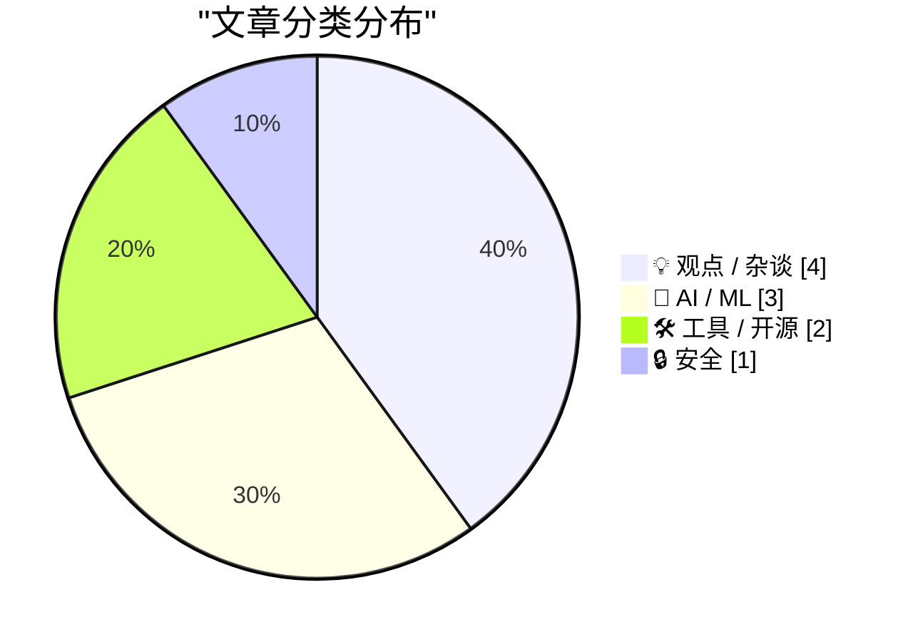
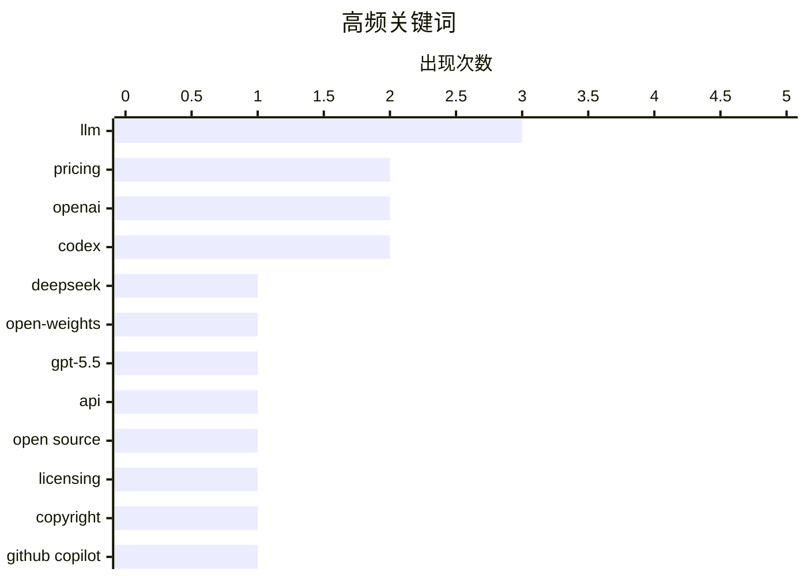

# 📰 AI 博客每日精选 — 2026-04-22

> 来自 Karpathy 推荐的 92 个顶级技术博客，AI 精选 Top 10

## 📝 今日看点

今天技术圈最鲜明的主线，是大模型正从“拼性能”转向“拼成本、上下文和可计费性”：DeepSeek 以低价高能冲击前沿模型，GPT-5.5 则折射出能力领先但接口与开放节奏依旧受控，GitHub Copilot 进一步走向 token 化计费也说明 AI 正加速进入精细化商业运营阶段。与此同时，AI 编程代理继续深入真实研发流程，不只是写代码，而是在理解仓库、执行任务和重塑工程协作方式上快速进化。另一股不可忽视的情绪是反思与警惕同步升温——从开源许可证被“AI 洗白”的争议，到“AI 无护城河”“软件工程未必还是终身职业”的讨论，再到网络犯罪案件，整个行业在狂奔中也开始直面规则、价值和风险的重估。

---

## 🏆 今日必读

🥇 **DeepSeek V4：几乎达到前沿水平，价格却只要一小部分**

[DeepSeek V4 - almost on the frontier, a fraction of the price](https://simonwillison.net/2026/Apr/24/deepseek-v4/#atom-everything) — simonwillison.net · 2026-04-24 · 🤖 AI / ML

> DeepSeek 发布了 V4 系列的两个预览模型 DeepSeek‑V4‑Pro 和 DeepSeek‑V4‑Flash，主打“接近前沿能力但显著更低成本”。两者都支持 100 万 token 上下文并采用 MoE 架构，Pro 为 1.6T 总参数/49B 激活参数，Flash 为 284B/13B，且以 MIT 许可证发布；作者认为 Pro 可能是当前最大开源权重模型。文章给出的价格显示 Flash 为 $0.14/$0.28（输入/输出，按每百万 token），Pro 为 $1.74/$3.48，并在对比表中低于 GPT、Gemini、Claude 的对应档位。DeepSeek 论文称其长上下文效率显著提升：在 1M 上下文下，Pro 相比 V3.2 仅需 27% 单 token FLOPs 和 10% KV cache，Flash 进一步降至 10% FLOPs 和 7% KV cache。作者认为 V4 的真正亮点是“性能接近前沿 + 成本极低”的组合，尤其是 Flash 与 Pro 在各自梯队中的价格优势。

💡 **为什么值得读**: 它把模型规模、上下文能力、许可证与主流厂商价格表放在同一视角比较，能快速判断 DeepSeek V4 是否在性价比上改变了模型选型。

🏷️ DeepSeek, LLM, open-weights, pricing

🥈 **通过半官方 Codex 后门 API 使用 GPT-5.5 跑 pelican 基准**

[A pelican for GPT-5.5 via the semi-official Codex backdoor API](https://simonwillison.net/2026/Apr/23/gpt-5-5/#atom-everything) — simonwillison.net · 2026-04-24 · 🤖 AI / ML

> GPT-5.5 已经发布，可在 OpenAI Codex 和面向付费 ChatGPT 订阅用户的产品中使用，但官方 API 仍未开放。作者为了运行 pelican 基准，倾向直接使用 API，以避免 ChatGPT 或其他 agent harness 的隐藏系统提示影响结果，因此转向了 Codex 相关接口。文中梳理了 OpenClaw、Pi 与大模型厂商订阅接口之间的争议，以及 OpenAI 对通过 Codex 机制接入订阅能力的公开支持，包括 /backend-api/codex/responses 端点、Codex CLI 和 app server 的开放源码，以及相关公开表态。基于此，作者让 Claude Code 逆向 openai/codex 仓库，找出认证令牌存储方式，并实现了 llm-openai-via-codex 插件，使 LLM 工具可以复用现有 Codex 订阅来调用 GPT-5.5。作者认为 GPT-5.5 速度快、效果好、能力强，而在官方 API 上线前，这条 Codex 通路提供了一个可实际使用的替代方案。

💡 **为什么值得读**: 值得读在于它不仅解释了 GPT-5.5 暂未开放 API 时的现实替代路径，还给出了基于 Codex 订阅接入模型的具体工具和操作思路。

🏷️ GPT-5.5, OpenAI, Codex, API

🥉 **自动将自由软件转为专有软件的（另一个）问题**

[Pluralistic: The (other) problem with automatic conversion of free software to proprietary software (23 Apr 2026)](https://pluralistic.net/2026/04/23/poison-pill/) — pluralistic.net · 2026-04-23 · 💡 观点 / 杂谈

> 焦点是一个名为 Malus.sh 的项目：它收费接收任意自由/开源代码，借助大语言模型重构出一份“洁净室”版本，试图摆脱原始软件许可证施加的义务。其法律思路援引了 1982 年 IBM 起诉 Columbia Data Products 的先例：版权保护的是软件代码这种具体表达，而不是功能或思想，因此可通过“看原作写规格、按规格重写实现”的双团队洁净室方式重建相同功能。Malus 将这一模式自动化为两个 LLM 的流水线：第一个模型分析原程序并生成功能规格，第二个模型仅依据规格生成新程序。作者指出，这种做法被包装成一门真实业务，同时又被其联合创建者描述为对自由软件运动发出的风险警报。标题点明的核心判断是：即便试图用这种方式绕开原许可证，把公共领域作品重新加上任何许可证本身也存在问题。

💡 **为什么值得读**: 值得读，因为它把 LLM“重写代码”与洁净室逆向工程、版权边界和自由软件许可风险放到同一框架里，能帮助你快速理解这类 AI 服务最具争议的法律与治理含义。

🏷️ open source, licensing, LLM, copyright

---

## 📊 数据概览

| 扫描源 | 抓取文章 | 时间范围 | 精选 |
|:---:|:---:|:---:|:---:|
| 88/92 | 2532 篇 → 73 篇 | 24h | **10 篇** |

### 分类分布



### 高频关键词



<details>
<summary>📈 纯文本关键词图（终端友好）</summary>

```
llm          │ ████████████████████ 3
pricing      │ █████████████░░░░░░░ 2
openai       │ █████████████░░░░░░░ 2
codex        │ █████████████░░░░░░░ 2
deepseek     │ ███████░░░░░░░░░░░░░ 1
open-weights │ ███████░░░░░░░░░░░░░ 1
gpt-5.5      │ ███████░░░░░░░░░░░░░ 1
api          │ ███████░░░░░░░░░░░░░ 1
open source  │ ███████░░░░░░░░░░░░░ 1
licensing    │ ███████░░░░░░░░░░░░░ 1
```

</details>

### 🏷️ 话题标签

**llm**(3) · **pricing**(2) · **openai**(2) · codex(2) · deepseek(1) · open-weights(1) · gpt-5.5(1) · api(1) · open source(1) · licensing(1) · copyright(1) · github copilot(1) · token billing(1) · microsoft(1) · coding-agents(1) · developer-productivity(1) · ai bubble(1) · anthropic(1) · tech industry(1) · scattered spider(1)

---

## 💡 观点 / 杂谈

### 1. 自动将自由软件转为专有软件的（另一个）问题

[Pluralistic: The (other) problem with automatic conversion of free software to proprietary software (23 Apr 2026)](https://pluralistic.net/2026/04/23/poison-pill/) — **pluralistic.net** · 2026-04-23 · ⭐ 25/30

> 焦点是一个名为 Malus.sh 的项目：它收费接收任意自由/开源代码，借助大语言模型重构出一份“洁净室”版本，试图摆脱原始软件许可证施加的义务。其法律思路援引了 1982 年 IBM 起诉 Columbia Data Products 的先例：版权保护的是软件代码这种具体表达，而不是功能或思想，因此可通过“看原作写规格、按规格重写实现”的双团队洁净室方式重建相同功能。Malus 将这一模式自动化为两个 LLM 的流水线：第一个模型分析原程序并生成功能规格，第二个模型仅依据规格生成新程序。作者指出，这种做法被包装成一门真实业务，同时又被其联合创建者描述为对自由软件运动发出的风险警报。标题点明的核心判断是：即便试图用这种方式绕开原许可证，把公共领域作品重新加上任何许可证本身也存在问题。

🏷️ open source, licensing, LLM, copyright

---

### 2. AI 末日启示录的四骑士

[Four Horsemen of the AIpocalypse](https://www.wheresyoured.at/four-horsemen-of-the-aipocalypse/) — **wheresyoured.at** · 6 小时前 · ⭐ 25/30

> 文章把当前 AI 行业的一系列异常现象视为“AI 泡沫开始松动”的预警信号，首先聚焦 Anthropic 的产能与稳定性问题。作者认为 Anthropic 在容量问题解决前不应继续吸纳新客户，并把后续涨价或服务降级视为 Anthropic 与 OpenAI 资金吃紧的信号。文中给出 Anthropic 过去 90 天的可用性数据：Claude Chatbot 为 98.79%，平台/控制台为 99.14%，API 为 99.09%，Claude Code 为 99.25%，而 Claude for Government 为 99.91%；对比常见的“4 个 9”即 99.99% 可用性标准，这意味着其停机时间明显偏高。作者强调，Anthropic 刚完成 300 亿美元融资，却仍持续出现与容量不足相关的可用性问题，这与外界对其高增长、高评价形象形成强烈反差。

🏷️ AI bubble, Anthropic, OpenAI, tech industry

---

### 3. 软件工程可能不再是一种终身职业

[Software engineering may no longer be a lifetime career](https://seangoedecke.com/software-engineering-may-no-longer-be-a-lifetime-career/) — **seangoedecke.com** · 2026-04-24 · ⭐ 24/30

> 焦点在于：即便使用 AI 会让软件工程师在完成具体任务时学得更少、长期技术能力可能退化，这也未必构成拒绝使用 AI 的充分理由。作者认为，过去“做软件工程就能持续学会软件工程”只是一个幸运的历史条件，而不是这个职业不可改变的本质。文中将这种处境类比为建筑工人搬重物和木工使用电动工具：如果 AI 带来足够大的短期收益，工程师仍可能因为雇佣关系和市场竞争而被迫采用它。进一步的判断是，一旦模型足够好，坚持手写代码的人可能会被愿意用长期认知能力换取短期职业回报的人淘汰。结论是，如果这种趋势成立，软件工程师应当正视“职业寿命可能缩短”的现实，并提前做职业规划。

🏷️ software engineering, AI, career, skill atrophy

---

### 4. AI 没有护城河

[AI has no moat](https://geohot.github.io//blog/jekyll/update/2026/04/22/ai-has-no-moat.html) — **geohot.github.io** · 7 小时前 · ⭐ 24/30

> 文章质疑 AI 相关产品与公司的高估值，认为无论是编码代理软件还是模型本身，都缺乏足够稳固的护城河。作者以 Cursor 传出被 SpaceX 以 600 亿美元收购为例，直言这一估值脱离现实，并表示自己身边的人已经很少使用 Cursor；相较之下，作者认为 opencode 是目前最好的 coding agent，且这类 harness 软件并不难做出类似产品。对于模型层，作者认为闭源模型如 GPT-5.4 和 Opus 4.7 目前最好，但其制造成本至少是 Kimi K2.6 和 GLM 5.1 的 10 倍，而后者并没有差太多，只是落后约 6 个月。文章进一步认为，训练模型虽然比做 agent 软件更难，但已有完整指南，真正的问题在于是否值得为贬值极快的资产持续投入巨额训练成本。作者最终将当下 AI 狂热归因为 FOMO、极短期思维以及对 AGI 奇点的盲信，并断言这种由金钱驱动的泡沫终将自行烧尽。

🏷️ AI moat, coding agents, Cursor, open models

---

## 🤖 AI / ML

### 5. DeepSeek V4：几乎达到前沿水平，价格却只要一小部分

[DeepSeek V4 - almost on the frontier, a fraction of the price](https://simonwillison.net/2026/Apr/24/deepseek-v4/#atom-everything) — **simonwillison.net** · 2026-04-24 · ⭐ 26/30

> DeepSeek 发布了 V4 系列的两个预览模型 DeepSeek‑V4‑Pro 和 DeepSeek‑V4‑Flash，主打“接近前沿能力但显著更低成本”。两者都支持 100 万 token 上下文并采用 MoE 架构，Pro 为 1.6T 总参数/49B 激活参数，Flash 为 284B/13B，且以 MIT 许可证发布；作者认为 Pro 可能是当前最大开源权重模型。文章给出的价格显示 Flash 为 $0.14/$0.28（输入/输出，按每百万 token），Pro 为 $1.74/$3.48，并在对比表中低于 GPT、Gemini、Claude 的对应档位。DeepSeek 论文称其长上下文效率显著提升：在 1M 上下文下，Pro 相比 V3.2 仅需 27% 单 token FLOPs 和 10% KV cache，Flash 进一步降至 10% FLOPs 和 7% KV cache。作者认为 V4 的真正亮点是“性能接近前沿 + 成本极低”的组合，尤其是 Flash 与 Pro 在各自梯队中的价格优势。

🏷️ DeepSeek, LLM, open-weights, pricing

---

### 6. 通过半官方 Codex 后门 API 使用 GPT-5.5 跑 pelican 基准

[A pelican for GPT-5.5 via the semi-official Codex backdoor API](https://simonwillison.net/2026/Apr/23/gpt-5-5/#atom-everything) — **simonwillison.net** · 2026-04-24 · ⭐ 25/30

> GPT-5.5 已经发布，可在 OpenAI Codex 和面向付费 ChatGPT 订阅用户的产品中使用，但官方 API 仍未开放。作者为了运行 pelican 基准，倾向直接使用 API，以避免 ChatGPT 或其他 agent harness 的隐藏系统提示影响结果，因此转向了 Codex 相关接口。文中梳理了 OpenClaw、Pi 与大模型厂商订阅接口之间的争议，以及 OpenAI 对通过 Codex 机制接入订阅能力的公开支持，包括 /backend-api/codex/responses 端点、Codex CLI 和 app server 的开放源码，以及相关公开表态。基于此，作者让 Claude Code 逆向 openai/codex 仓库，找出认证令牌存储方式，并实现了 llm-openai-via-codex 插件，使 LLM 工具可以复用现有 Codex 订阅来调用 GPT-5.5。作者认为 GPT-5.5 速度快、效果好、能力强，而在官方 API 上线前，这条 Codex 通路提供了一个可实际使用的替代方案。

🏷️ GPT-5.5, OpenAI, Codex, API

---

### 7. AI 奥德赛，第 4 部分：令人惊叹的编程代理

[An AI Odyssey, Part 4: Astounding Coding Agents](https://www.johndcook.com/blog/2026/04/21/an-ai-odyssey-part-4-astounding-coding-agents/) — **johndcook.com** · 2 小时前 · ⭐ 25/30

> AI 编程代理在去年夏天以及 12 月到次年 1 月又经历了一轮明显进步，作者关注的是它们在真实研发工作中的能力边界与使用方式。作者主观感受是模型“聪明”了很多，能处理更广泛的任务，对代码库和目标有更完整、更深入的理解，也更能从代码库中找到与任务相关的隐蔽细节；按个人粗略估计，它们对自己编码工作的帮助占比已从去年 8 月的约 20% 提升到现在的约 60%。但这些工具并非万能，仍需要人为指引排查方向，可能只盯局部而忽略整体，还会针对测试过度优化、生成与现有代码概念不一致的实现，或产出远超必要规模的代码。作者主要使用 OpenAI Codex，并强调在研究型项目里代码本身就是研究产物，因此自己会持续与代理深度协作，而不是把它当作“黑箱软件工厂”；同时也指出，代理不仅可能让人少写代码，也可能让人从中学到新的编码习惯，并可在引导下快速重构，例如曾把一段代码压缩到原来一半以下且行为不变。整体判断是，AI 编程代理带来了令人惊讶的生产力提升，但最有效的用法仍是由人保持高层判断、可读性要求和持续参与。

🏷️ coding-agents, Codex, developer-productivity, LLM

---

## 🛠 工具 / 开源

### 8. 独家：微软将在 6 月把所有 GitHub Copilot 订阅迁移到基于 Token 的计费

[[Updated] Exclusive: Microsoft Moving All GitHub Copilot Subscribers To Token-Based Billing In June](https://www.wheresyoured.at/exclusive-microsoft-moving-all-github-copilot-subscribers-to-token-based-billing-in-june/) — **wheresyoured.at** · 2026-04-23 · ⭐ 25/30

> 微软计划从 2026 年 6 月起将 GitHub Copilot 转向基于 token 的计费，内部文件显示这一调整将覆盖所有 Copilot 客户，但个人订阅用户的处理方式仍不明确。现有按“requests”计量的方式将被按实际 token 成本计费取代，用户继续支付月费获取 Copilot 访问资格，并按订阅档位获得一定额度的 AI token；例如 Claude Opus 4.7 的价格为每百万输入 token 5 美元、每百万输出 token 25 美元。企业组织将采用共享额度模式，2026 年 6 月至 8 月的促销期内，Copilot Business 为每用户每月 19 美元并附带 30 美元共享 AI 额度，Copilot Enterprise 为每用户每月 39 美元并附带 70 美元共享 AI 额度。促销期结束后，两档方案将分别变为 19 美元月费对应 19 美元 token 额度，以及 39 美元月费对应 39 美元 token 额度；消息人士称这些数值在正式上线前仍可能调整。与这一转变同步，微软已暂停个人和学生账户新注册、从 10 美元档移除 Anthropic Opus 模型，并计划进一步收紧使用限制，背景是 AI 算力成本持续攀升。

🏷️ GitHub Copilot, pricing, token billing, Microsoft

---

### 9. brief

[brief](https://nesbitt.io/2026/04/21/brief.html) — **nesbitt.io** · 13 小时前 · ⭐ 24/30

> 在陌生代码仓库中，开发者、安全扫描器和 AI 编码代理都需要先弄清语言、依赖安装方式、测试命令、提交前要跑的 linter，以及安全审查中哪些函数属于危险点；反复靠猜测和搜索来重新发现这些信息会造成明显浪费。brief 提供了一个覆盖 54 个语言生态、516 个工具的知识库，并用单个 Go 二进制进行查询：既可输出 JSON，也可在终端输出面向人的摘要，核心数据包括调用命令、配置文件位置，以及统一机器可读 schema 下的工具分类。它可以针对本地目录、Git URL 或 gem:rails、npm:express 这类 registry 坐标，识别 20 个类别中的工具链，并补充常见位置中的治理与社区文件，如带 SPDX 标识的许可证、安全策略、CODEOWNERS 和 FUNDING.yml。命令还支持 brief diff、brief missing、brief threat-model、brief sinks 等视图，分别用于只看变更涉及的工具、发现缺失的基础类别、查看栈隐含的 CWE/OWASP 类别，以及识别检测到工具中的危险函数。全量检查 516 条定义耗时不到 250ms，作者将其作为克隆仓库后的第一步，也接入了 Claude 的全局指令，用一次 brief . 调用替代大量探索式 grep 和错误尝试。

🏷️ CLI, developer tooling, repository analysis, JSON

---

## 🔒 安全

### 10. “Scattered Spider”成员“Tylerb”认罪

[‘Scattered Spider’ Member ‘Tylerb’ Pleads Guilty](https://krebsonsecurity.com/2026/04/scattered-spider-member-tylerb-pleads-guilty/) — **krebsonsecurity.com** · 8 小时前 · ⭐ 25/30

> 24 岁英国公民、网络犯罪团伙 Scattered Spider 的高级成员 Tyler Robert Buchanan 已就电信诈骗共谋和严重身份盗窃认罪。其承认参与了 2022 年夏季的大规模短信钓鱼行动，向大量目标发送数以万计的 SMS 钓鱼信息，并入侵了包括 Twilio、LastPass、DoorDash 和 Mailchimp 在内的多家科技公司。团伙随后利用这些入侵中窃取的数据实施 SIM 置换攻击，拦截短信验证码和密码重置链接，从美国个人加密货币投资者手中盗取资金；美国司法部称 Buchanan 承认窃取了至少 800 万美元虚拟货币。FBI 通过用于注册多个钓鱼域名的相同用户名和邮箱将其与 2022 年攻击关联起来，NameCheap 的登录记录和苏格兰警方掌握的租用地址信息进一步指向 Buchanan。Buchanan 于 2024 年 6 月在西班牙准备登机前往意大利时被捕，目前已被引渡至美国候审，面临超过 20 年监禁的可能。

🏷️ Scattered Spider, phishing, social engineering, cybercrime

---

*生成于 2026-04-22 07:00 | 扫描 88 源 → 获取 2532 篇 → 精选 10 篇*
*基于 [Hacker News Popularity Contest 2025](https://refactoringenglish.com/tools/hn-popularity/) RSS 源列表*
