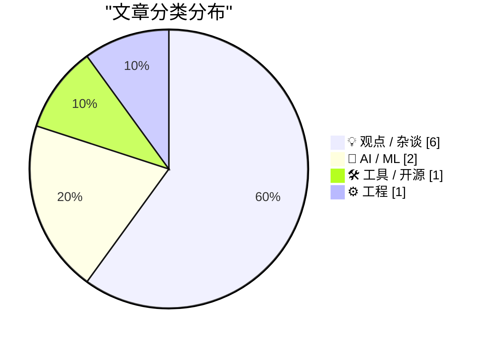
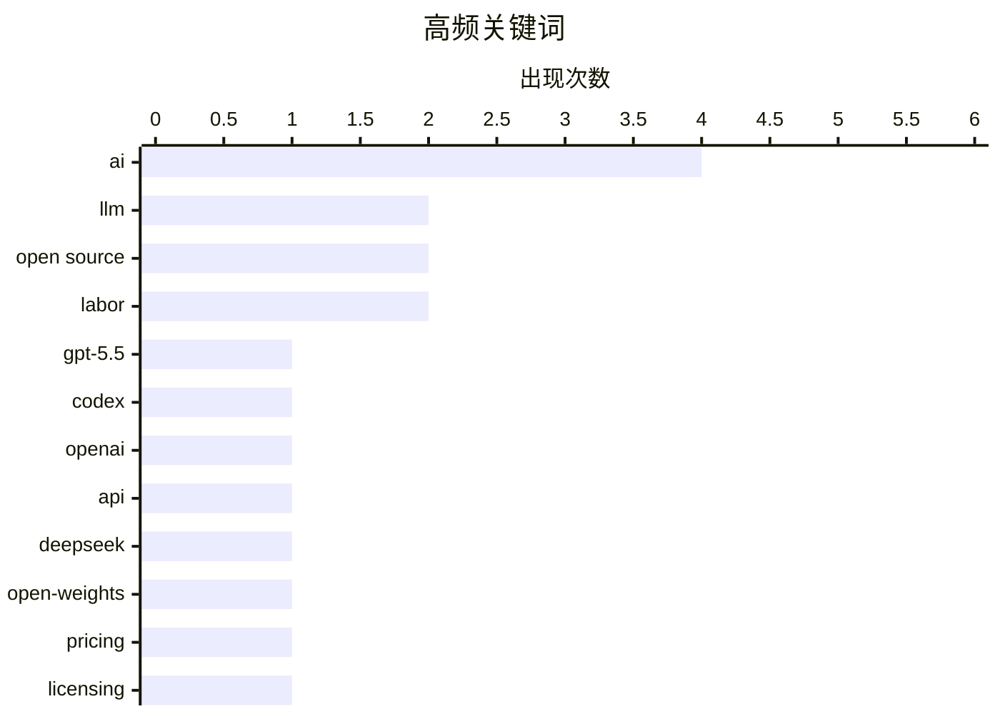

# 📰 AI 博客每日精选 — 2026-04-23

> 来自 Karpathy 推荐的 92 个顶级技术博客，AI 精选 Top 10

## 📝 今日看点

今天的技术圈，主线已经很清晰：大模型竞争正从“谁更强”转向“谁更便宜、上下文更长、落地更快”，GPT-5.5 逐步放量、DeepSeek V4 以低价逼近前沿，说明 AI 能力与成本的军备赛还在加速。与此同时，AI 商业化进入更精细的算账阶段，GitHub Copilot 转向按 token 计费，预示开发工具将全面从“订阅制”走向“用量制”。更值得警惕的是，围绕 AI 的版权、职业替代、监管豁免与社会代价的争论正在升温：技术已不只是产品问题，而是越来越直接地冲击软件工程的工作方式、知识产权边界和社会治理框架。

---

## 🏆 今日必读

🥇 **通过半官方 Codex 后门 API 获取 GPT-5.5 的 pelican 基准**

[A pelican for GPT-5.5 via the semi-official Codex backdoor API](https://simonwillison.net/2026/Apr/23/gpt-5-5/#atom-everything) — simonwillison.net · 2026-04-24 · 🤖 AI / ML

> GPT-5.5 已发布并在 OpenAI Codex 与付费 ChatGPT 订阅中逐步可用，但暂未开放正式 API，OpenAI称会很快提供 GPT‑5.5 与 GPT‑5.5 Pro 的 API。作者强调做 pelican 基准时更偏好直接走 API，以避免 ChatGPT 或代理封装中的隐藏系统提示影响结果。文章梳理了近期 OpenClaw/Pi 与大模型厂商订阅机制的争议，并指出 OpenAI 公开表态支持通过 Codex 相关机制在多种客户端中使用订阅能力。基于对 openai/codex 仓库认证方式的逆向，作者做了 llm-openai-via-codex 插件，让 LLM 工具可复用现有 Codex 订阅直接调用模型，并给出从安装 Codex CLI、登录订阅到执行 openai-codex/gpt-5.5 的命令流程。核心观点是：在官方 API 缺位阶段，Codex 这条“半官方”通道提供了可操作的替代路径，便于更可控地测试 GPT-5.5。

💡 **为什么值得读**: 它把“GPT-5.5 暂无 API 怎么做严谨评测”这个实际问题落到了可复现的工具链和命令步骤上，实用价值很高。

🏷️ GPT-5.5, Codex, OpenAI, API

🥈 **DeepSeek V4：接近前沿水平，但价格只是零头**

[DeepSeek V4 - almost on the frontier, a fraction of the price](https://simonwillison.net/2026/Apr/24/deepseek-v4/#atom-everything) — simonwillison.net · 2026-04-24 · 🤖 AI / ML

> DeepSeek 发布了 V4 系列的两个预览模型 DeepSeek-V4-Pro 和 DeepSeek-V4-Flash，二者都是支持 100 万 token 上下文的 Mixture of Experts 模型，分别为 1.6T 总参数/49B 激活参数和 284B 总参数/13B 激活参数，并采用 MIT 许可证。作者认为 V4-Pro 可能是目前最大的开放权重模型，规模超过 Kimi K2.6、GLM-5.1 和 DeepSeek V3.2；模型文件体积也很大，Pro 为 865GB，Flash 为 160GB。更突出的特点是价格：Flash 的输入/输出价格为每百万 token 0.14 美元和 0.28 美元，Pro 为 1.74 美元和 3.48 美元，在文中列出的 Gemini、OpenAI 和 Anthropic 对比表里，Flash 是最便宜的小模型，Pro 是最便宜的大型前沿模型。DeepSeek 在论文中将低价归因于效率优化，尤其是长上下文场景下的计算与缓存开销下降：在 100 万 token 上下文中，V4-Pro 的单 token FLOPs 和 KV cache 分别降至 V3.2 的 27% 和 10%，V4-Flash 进一步降至 10% 和 7%。作者给出的判断是，V4 在能力上已接近前沿模型，而价格优势使它格外值得关注。

💡 **为什么值得读**: 值得读，因为它把 DeepSeek V4 的模型规模、开放性、长上下文效率和与 Gemini/OpenAI/Anthropic 的价格对比放在一起，能快速判断这代模型为何会引发关注。

🏷️ DeepSeek, LLM, open-weights, pricing

🥉 **自由软件被自动转换为专有软件的另一个问题**

[Pluralistic: The (other) problem with automatic conversion of free software to proprietary software (23 Apr 2026)](https://pluralistic.net/2026/04/23/poison-pill/) — pluralistic.net · 2026-04-23 · 💡 观点 / 杂谈

> Malus.sh 提出一种把自由/开源代码经由大语言模型重构成“洁净室”版本的做法，声称可以摆脱原始软件许可证施加的义务。其法律逻辑依赖 1982 年 IBM 起诉 Columbia Data Products 一案所确立的“洁净室”模式：受版权保护的是代码表达而非功能本身，因此可由一组实体提炼功能规格，再由另一组在不接触原代码的情况下重新实现。Malus 将这一模式自动化为两个 LLM 协作：一个分析自由软件并生成功能规格，另一个依据规格编写实现相同功能的新程序。作者指出，这种做法被包装成对自由软件运动风险的警示，但它同时直指一个更深层的问题：通过自动化“洁净室”重写，公共软件共享机制可能被系统性抽空。文中还强调了一个边界：对公有领域作品并不能再附加任何许可证。

💡 **为什么值得读**: 值得读，因为它把 LLM 重写代码、洁净室逆向工程和自由软件许可边界放到同一问题框架里，能帮助读者快速理解这类“合法抽取开源价值”方案为何具有现实冲击。

🏷️ open source, licensing, LLM, public domain

---

## 📊 数据概览

| 扫描源 | 抓取文章 | 时间范围 | 精选 |
|:---:|:---:|:---:|:---:|
| 88/92 | 2532 篇 → 55 篇 | 24h | **10 篇** |

### 分类分布



### 高频关键词



<details>
<summary>📈 纯文本关键词图（终端友好）</summary>

```
ai           │ ████████████████████ 4
llm          │ ██████████░░░░░░░░░░ 2
open source  │ ██████████░░░░░░░░░░ 2
labor        │ ██████████░░░░░░░░░░ 2
gpt-5.5      │ █████░░░░░░░░░░░░░░░ 1
codex        │ █████░░░░░░░░░░░░░░░ 1
openai       │ █████░░░░░░░░░░░░░░░ 1
api          │ █████░░░░░░░░░░░░░░░ 1
deepseek     │ █████░░░░░░░░░░░░░░░ 1
open-weights │ █████░░░░░░░░░░░░░░░ 1
```

</details>

### 🏷️ 话题标签

**ai**(4) · **llm**(2) · **open source**(2) · labor(2) · gpt-5.5(1) · codex(1) · openai(1) · api(1) · deepseek(1) · open-weights(1) · pricing(1) · licensing(1) · public domain(1) · github copilot(1) · billing(1) · tokens(1) · microsoft(1) · software engineering(1) · career(1) · skills(1)

---

## 💡 观点 / 杂谈

### 1. 自由软件被自动转换为专有软件的另一个问题

[Pluralistic: The (other) problem with automatic conversion of free software to proprietary software (23 Apr 2026)](https://pluralistic.net/2026/04/23/poison-pill/) — **pluralistic.net** · 2026-04-23 · ⭐ 24/30

> Malus.sh 提出一种把自由/开源代码经由大语言模型重构成“洁净室”版本的做法，声称可以摆脱原始软件许可证施加的义务。其法律逻辑依赖 1982 年 IBM 起诉 Columbia Data Products 一案所确立的“洁净室”模式：受版权保护的是代码表达而非功能本身，因此可由一组实体提炼功能规格，再由另一组在不接触原代码的情况下重新实现。Malus 将这一模式自动化为两个 LLM 协作：一个分析自由软件并生成功能规格，另一个依据规格编写实现相同功能的新程序。作者指出，这种做法被包装成对自由软件运动风险的警示，但它同时直指一个更深层的问题：通过自动化“洁净室”重写，公共软件共享机制可能被系统性抽空。文中还强调了一个边界：对公有领域作品并不能再附加任何许可证。

🏷️ open source, licensing, LLM, public domain

---

### 2. 软件工程可能不再是一份可以做一辈子的职业

[Software engineering may no longer be a lifetime career](https://seangoedecke.com/software-engineering-may-no-longer-be-a-lifetime-career/) — **seangoedecke.com** · 2026-04-24 · ⭐ 23/30

> 焦点在于：如果 AI 让软件工程师在长期内学得更少、技能逐渐退化，那么“因此不该使用 AI”是否成立。文中认为，使用 AI 确实可能减少人们对任务本身的学习，但这并不自动推出职场中应拒绝 AI，因为软件工程之所以长期能靠“边做边学”积累能力，本来更像是一种历史上的幸运条件，而非不变规律。作者拿从汇编到 C 的迁移，以及建筑工人必须搬重物、木工必须使用电动工具作比，强调工作要求往往由短期生产力决定，即使这会带来长期代价。若模型足够强，手写代码的人可能会像拒绝用电动工具的木工一样失去竞争力。结论是，即便 AI 真的会削弱长期能力，软件工程师也仍可能被迫采用它，因此更现实的态度是承认这种可能，并为职业寿命变化提前做规划。

🏷️ software engineering, AI, career, skills

---

### 3. 你真的希望美国在 AI 上“获胜”吗？

[Do you really want the US to “win” AI?](https://geohot.github.io//blog/jekyll/update/2026/04/23/us-win-ai.html) — **geohot.github.io** · 7 小时前 · ⭐ 22/30

> 内容围绕“美国赢得 AI”这类叙事提出质疑，关注的不是技术竞赛本身，而是 AI 将把社会带向什么样的制度与生活方式。作者明确反感由工程强人、工业级超级项目和高杠杆推动的社会模型，认为即使自己身处权力席位，也不愿生活在那样的秩序中。文中对 Elon Musk、Sam Altman 和 Anthropic 背后的 EA 群体分别表达了不同批评：认为 Sam 至少重视做出人们喜爱的产品，Elon 并不真正重视开源及其制度建设，而 Anthropic 延续了 2019 年 GPT-2 XL 时期相似的恐惧式宣传做法。作者同时强调，反 AI 立场无法阻止 AI 被建造，关键问题是 AI 是否服务普通人，以及它应当以个人“硬拥有”的方式存在，而不是作为可随时被撤销的 API 权限。

🏷️ AI, US policy, open source, power

---

### 4. 如果我们用一个应用来对护士这么干，那就不算犯罪

[Pluralistic: It's not a crime if we do it (to nurses) with an app (22 Apr 2026)](https://pluralistic.net/2026/04/22/uber-for-nurses/) — **pluralistic.net** · 7 小时前 · ⭐ 22/30

> 文章反驳了“技术创新总是跑在监管前面”的常见说法，认为大多数情况下并不是技术无法监管，而是企业刻意把自己包装成不适用现有规则的例外。文中承认某些技术确实会让既有法律框架出现错位，例如版权法把“制作和处理副本”当作媒体产业链行为的代理指标，但在计算机普及后，普通点击操作也会产生大量副本，使这一框架变得失真。相比之下，作者认为许多所谓“新”行业并没有超出现有法律边界，尤其是 fintech、neobank、加密货币、稳定币和 NFT，完全可以用银行法、高利贷法、证券法和赌博法来约束。文章还援引 Riley Quinn 的说法，把 fintech 概括为“未受监管的银行”，并指出监管之所以缺位，更多是政策制定者接受了站不住脚的借口。作者的核心判断是：技术通常没有快到监管跟不上，真正的问题是既有规则没有被认真执行到科技公司身上。

🏷️ tech policy, labor, platforms, regulation

---

### 5. 替罪羊

[The Scapegoat](https://feed.tedium.co/link/15204/17323348/mcclatchy-journalism-ai-scapegoat) — **tedium.co** · 19 小时前 · ⭐ 22/30

> 麦克拉奇在新闻业引入 AI 的争议，焦点不只是技术本身，而是管理层如何用它重组内容生产流程。公司推动记者使用 Claude 将已发表报道改写、拆分并复用于 SEO、社交媒体和 Google Discover 等分发场景，并把这套工具向员工包装成“加强版 Grammarly”。管理层明确把是否接受这项工具与职业前景挂钩，同时坚持公司有权继续使用记者作品；即使记者能撤回署名，公司也可能由编辑署名后继续改写发布。工会已介入限制署名的使用方式，但并非所有报纸都有工会保护。作者的判断是，真正推动变化的是企业的人类决策者，AI只是被拿来执行这些决策的工具。

🏷️ AI, journalism, media, labor

---

### 6. 卢德派与焚烧 AI 数据中心

[Luddites and burning down AI datacenters](https://seangoedecke.com/luddites-and-ai-datacenters/) — **seangoedecke.com** · 23 小时前 · ⭐ 22/30

> 围绕是否该以破坏数据中心来反对 AI，文章把近期针对支持数据中心者和 Sam Altman 的暴力事件，与 19 世纪英国卢德派运动作了历史对照。历史上的卢德派是 1810 年代去中心化的手工业者群体，他们因自动化使熟练劳动贬值而发动暴力抗议，包括砸毁机器、发出匿名威胁信，并在部分情况下杀害机器所有者。文中指出，这些人并非不熟练工，而是经过七年学徒训练、在家接单生产布料的工匠；随着昂贵机器让儿童、未受训工人和女性也能生产较低质量布料，再叠加英国对法战争时期的经济困境，他们面临严重生计压力甚至饥饿威胁。作者因此追问：真实的卢德派是什么样的人，他们做了什么，以及这段历史能为今天反 AI 阵营鼓吹效仿卢德派、攻击 AI 基础设施提供什么启示。文章的核心切入点，是用更具体的历史事实重新审视“卢德主义”与当下反 AI 暴力之间的关系。

🏷️ Luddism, AI, datacenters, automation

---

## 🤖 AI / ML

### 7. 通过半官方 Codex 后门 API 获取 GPT-5.5 的 pelican 基准

[A pelican for GPT-5.5 via the semi-official Codex backdoor API](https://simonwillison.net/2026/Apr/23/gpt-5-5/#atom-everything) — **simonwillison.net** · 2026-04-24 · ⭐ 27/30

> GPT-5.5 已发布并在 OpenAI Codex 与付费 ChatGPT 订阅中逐步可用，但暂未开放正式 API，OpenAI称会很快提供 GPT‑5.5 与 GPT‑5.5 Pro 的 API。作者强调做 pelican 基准时更偏好直接走 API，以避免 ChatGPT 或代理封装中的隐藏系统提示影响结果。文章梳理了近期 OpenClaw/Pi 与大模型厂商订阅机制的争议，并指出 OpenAI 公开表态支持通过 Codex 相关机制在多种客户端中使用订阅能力。基于对 openai/codex 仓库认证方式的逆向，作者做了 llm-openai-via-codex 插件，让 LLM 工具可复用现有 Codex 订阅直接调用模型，并给出从安装 Codex CLI、登录订阅到执行 openai-codex/gpt-5.5 的命令流程。核心观点是：在官方 API 缺位阶段，Codex 这条“半官方”通道提供了可操作的替代路径，便于更可控地测试 GPT-5.5。

🏷️ GPT-5.5, Codex, OpenAI, API

---

### 8. DeepSeek V4：接近前沿水平，但价格只是零头

[DeepSeek V4 - almost on the frontier, a fraction of the price](https://simonwillison.net/2026/Apr/24/deepseek-v4/#atom-everything) — **simonwillison.net** · 2026-04-24 · ⭐ 26/30

> DeepSeek 发布了 V4 系列的两个预览模型 DeepSeek-V4-Pro 和 DeepSeek-V4-Flash，二者都是支持 100 万 token 上下文的 Mixture of Experts 模型，分别为 1.6T 总参数/49B 激活参数和 284B 总参数/13B 激活参数，并采用 MIT 许可证。作者认为 V4-Pro 可能是目前最大的开放权重模型，规模超过 Kimi K2.6、GLM-5.1 和 DeepSeek V3.2；模型文件体积也很大，Pro 为 865GB，Flash 为 160GB。更突出的特点是价格：Flash 的输入/输出价格为每百万 token 0.14 美元和 0.28 美元，Pro 为 1.74 美元和 3.48 美元，在文中列出的 Gemini、OpenAI 和 Anthropic 对比表里，Flash 是最便宜的小模型，Pro 是最便宜的大型前沿模型。DeepSeek 在论文中将低价归因于效率优化，尤其是长上下文场景下的计算与缓存开销下降：在 100 万 token 上下文中，V4-Pro 的单 token FLOPs 和 KV cache 分别降至 V3.2 的 27% 和 10%，V4-Flash 进一步降至 10% 和 7%。作者给出的判断是，V4 在能力上已接近前沿模型，而价格优势使它格外值得关注。

🏷️ DeepSeek, LLM, open-weights, pricing

---

## 🛠 工具 / 开源

### 9. 【更新】独家：微软将于 6 月把所有 GitHub Copilot 订阅迁移为基于 Token 的计费

[[Updated] Exclusive: Microsoft Moving All GitHub Copilot Subscribers To Token-Based Billing In June](https://www.wheresyoured.at/exclusive-microsoft-moving-all-github-copilot-subscribers-to-token-based-billing-in-june/) — **wheresyoured.at** · 5 小时前 · ⭐ 24/30

> 微软计划从 2026 年 6 月起把 GitHub Copilot 的计费方式从按“请求次数”改为按 token 实际消耗计费，内部文件称这一变化将面向所有 Copilot 客户。6 至 8 月的促销期内，Copilot Business 价格为每用户每月 19 美元并附带 30 美元的共享 AI 额度，Copilot Enterprise 为每用户每月 39 美元并附带 70 美元的共享 AI 额度；促销结束后，这些额度将分别变为 19 美元和 39 美元。现有模式下，Pro 套餐每月有 300 次请求，Pro+ 为 1500 次，不同模型消耗的请求数不同；改为 token 计费后，用户将按输入和输出 token 的真实成本结算，例如 Claude Opus 4.7 的价格为每百万输入 token 5 美元、每百万输出 token 25 美元。组织版将采用 pooled AI credits，即整个组织共享 token 额度；个人订阅者将如何处理，目前仍不明确。相关文件还显示，微软已暂停个人和学生账户的新注册、从 10 美元套餐中移除 Anthropic Opus 模型，并计划进一步收紧使用限制，背景是 AI 算力成本持续攀升。

🏷️ GitHub Copilot, billing, tokens, Microsoft

---

## ⚙️ 工程

### 10. 又一起因卸载程序向 Explorer 注入代码导致的崩溃

[Another crash caused by uninstaller code injection into Explorer](https://devblogs.microsoft.com/oldnewthing/20260423-00/?p=112261) — **devblogs.microsoft.com/oldnewthing** · 2026-04-23 · ⭐ 23/30

> 一次 Explorer 崩溃激增的排查，最终指向卸载程序向 64 位系统中的 32 位 Explorer 注入代码所致。32 位 Explorer 在这种环境下通常不是负责任务栏、桌面或文件管理器窗口的那个实例，而是被其他程序拿去做兼容性相关的“脏活”。出问题的卸载代码在循环执行文件操作失败重试时，把 Windows 函数原本应使用的 __stdcall 误写成了 __cdecl，导致参数被重复从栈中弹出。结果是循环每执行一次都会不断侵蚀自己的栈空间，直到栈指针推进到已注入代码区域，把正在执行的代码覆盖掉，最终因无效指令崩溃。作者借这个案例说明，这类“高级”卸载器的行为和恶意软件已经非常相似，而且还会制造出像是 Windows 自身缺陷的假象。

🏷️ Windows, Explorer, uninstaller, calling-convention

---

*生成于 2026-04-23 07:00 | 扫描 88 源 → 获取 2532 篇 → 精选 10 篇*
*基于 [Hacker News Popularity Contest 2025](https://refactoringenglish.com/tools/hn-popularity/) RSS 源列表*
