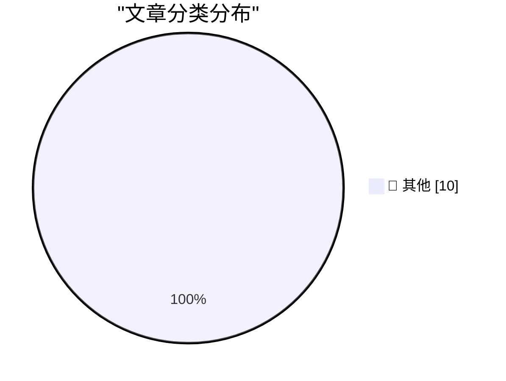

# 📰 AI 博客每日精选 — 2026-04-23

> 来自 Karpathy 推荐的 92 个顶级技术博客，AI 精选 Top 10

## 🏆 今日必读

🥇 **It's a big one**

[It's a big one](https://simonwillison.net/2026/Apr/24/weekly/#atom-everything) — simonwillison.net · 2026-04-24 · 📝 其他

> Simon Willison’s Weblog Subscribe Sponsored by: Sonar &mdash; Now with SAST + SCA for secure, dependency-aware Agentic Engineering. SonarQube Advanced Security 24th April 2026 This week's edition of m

🥈 **A Plethora of Tweezers**

[A Plethora of Tweezers](https://feed.tedium.co/link/15204/17324561/tweezer-weird-facts-history) — tedium.co · 2026-04-24 · 📝 其他

> A Plethora of Tweezers Pondering the way that tweezers isolate things at a small scale, and the fact that you can take an aptitude test to show that you can tweeze with the pros. By Ernie Smith • Apri

🥉 **russellromney/honker**

[russellromney/honker](https://simonwillison.net/2026/Apr/24/honker/#atom-everything) — simonwillison.net · 2026-04-24 · 📝 其他

> russellromney/honker ( via ) "Postgres NOTIFY/LISTEN semantics" for SQLite, implemented as a Rust SQLite extension and various language bindings to help make use of it. The design of this looks very s

---

## 📊 数据概览

| 扫描源 | 抓取文章 | 时间范围 | 精选 |
|:---:|:---:|:---:|:---:|
| 88/92 | 2532 篇 → 48 篇 | 24h | **10 篇** |

### 分类分布

---

## 📝 其他

### 1. It's a big one

[It's a big one](https://simonwillison.net/2026/Apr/24/weekly/#atom-everything) — **simonwillison.net** · 2026-04-24 · ⭐ 15/30

> Simon Willison’s Weblog Subscribe Sponsored by: Sonar &mdash; Now with SAST + SCA for secure, dependency-aware Agentic Engineering. SonarQube Advanced Security 24th April 2026 This week's edition of m

---

### 2. A Plethora of Tweezers

[A Plethora of Tweezers](https://feed.tedium.co/link/15204/17324561/tweezer-weird-facts-history) — **tedium.co** · 2026-04-24 · ⭐ 15/30

> A Plethora of Tweezers Pondering the way that tweezers isolate things at a small scale, and the fact that you can take an aptitude test to show that you can tweeze with the pros. By Ernie Smith • Apri

---

### 3. russellromney/honker

[russellromney/honker](https://simonwillison.net/2026/Apr/24/honker/#atom-everything) — **simonwillison.net** · 2026-04-24 · ⭐ 15/30

> russellromney/honker ( via ) "Postgres NOTIFY/LISTEN semantics" for SQLite, implemented as a Rust SQLite extension and various language bindings to help make use of it. The design of this looks very s

---

### 4. Approximation to solve an oblique triangle

[Approximation to solve an oblique triangle](https://www.johndcook.com/blog/2026/04/23/solve-an-oblique-triangle/) — **johndcook.com** · 2026-04-23 · ⭐ 15/30

> The previous post gave a simple and accurate approximation for the smaller angle of a right triangle. Given a right triangle with sides a , b , and c , where a is the shortest side and c is the hypote

---

### 5. Another crash caused by uninstaller code injection into Explorer

[Another crash caused by uninstaller code injection into Explorer](https://devblogs.microsoft.com/oldnewthing/20260423-00/?p=112261) — **devblogs.microsoft.com/oldnewthing** · 2026-04-23 · ⭐ 15/30

> Some time ago, I noted that any sufficiently advanced uninstaller is indistinguishable from malware .¹ During one of our regular debugging chats, a colleague of mine mentioned that he was looking at a

---

### 6. SQLAlchemy 2 In Practice - Chapter 6: A Page Analytics Solution

[SQLAlchemy 2 In Practice - Chapter 6: A Page Analytics Solution](https://blog.miguelgrinberg.com/post/sqlalchemy-2-in-practice---chapter-6-a-page-analytics-solution) — **miguelgrinberg.com** · 2026-04-23 · ⭐ 15/30

> This is the sixth chapter of my SQLAlchemy 2 in Practice book. If you'd like to support my work, I encourage you to buy this book, either directly from my store or on Amazon . Thank you! The goal of t

---

### 7. Pluralistic: The (other) problem with automatic conversion of free software to proprietary software (23 Apr 2026)

[Pluralistic: The (other) problem with automatic conversion of free software to proprietary software (23 Apr 2026)](https://pluralistic.net/2026/04/23/poison-pill/) — **pluralistic.net** · 2026-04-23 · ⭐ 15/30

> ->->->->->->->->->->->->->->->->->->->->->->->->->->->->-> Top Sources: None --> Today's links The (other) problem with automatic conversion of free software to proprietary software : You can't add AN

---

### 8. Simple approximation for solving a right triangle

[Simple approximation for solving a right triangle](https://www.johndcook.com/blog/2026/04/23/solve-a-right-triangle/) — **johndcook.com** · 2026-04-23 · ⭐ 15/30

> Suppose you have a right triangle with sides a , b , and c , where a is the shortest side and c is the hypotenuse. Then the following approximation from [1] for the angle A opposite side a seems too s

---

### 9. Construction Costs Rarely Fall

[Construction Costs Rarely Fall](https://www.construction-physics.com/p/construction-costs-rarely-fall) — **construction-physics.com** · 2026-04-23 · ⭐ 15/30

> Construction Costs Rarely Fall Brian Potter Apr 23, 2026 113 5 5 Share Not long ago we looked at construction productivity trends for the US and for countries around the world . We found that in the U

---

### 10. Sneaky spam in conversational replies to blog posts

[Sneaky spam in conversational replies to blog posts](https://shkspr.mobi/blog/2026/04/sneaky-spam-in-conversational-replies-to-blog-posts/) — **shkspr.mobi** · 2026-04-23 · ⭐ 15/30

> Sneaky spam in conversational replies to blog posts blog blogging spam WordPress · 8 comments · 350 words · Viewed ~5,709 times I'm grateful that my blog posts attract lots of engaged, funny, and chal

---

*生成于 2026-04-23 07:00 | 扫描 88 源 → 获取 2532 篇 → 精选 10 篇*
*基于 [Hacker News Popularity Contest 2025](https://refactoringenglish.com/tools/hn-popularity/) RSS 源列表*
