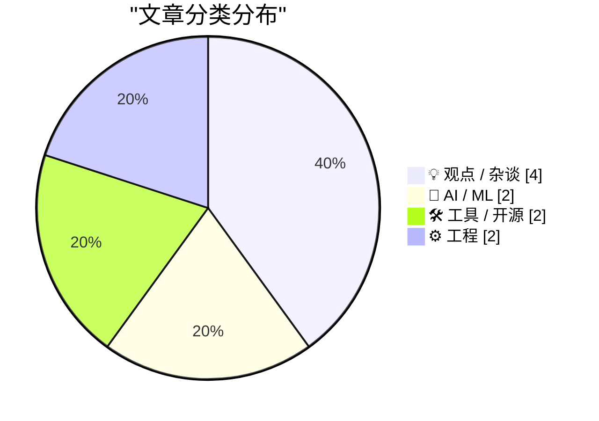
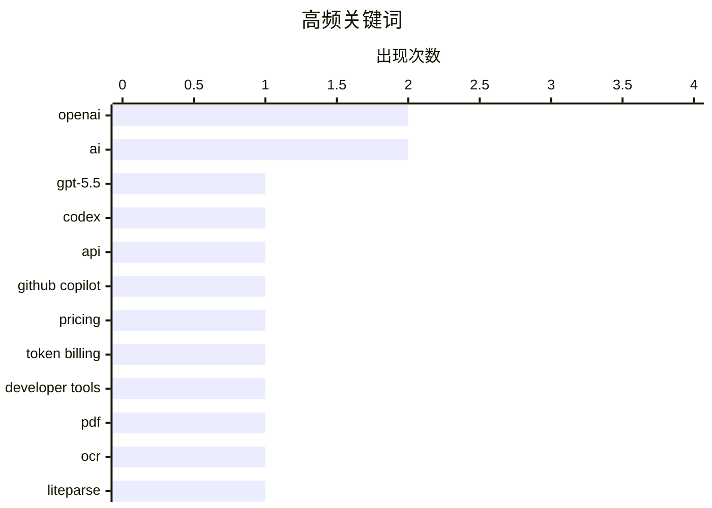

# 📰 AI 博客每日精选 — 2026-04-23

> 来自 Karpathy 推荐的 92 个顶级技术博客，AI 精选 Top 10

## 🏆 今日必读

🥇 **A pelican for GPT-5.5 via the semi-official Codex backdoor API**

[A pelican for GPT-5.5 via the semi-official Codex backdoor API](https://simonwillison.net/2026/Apr/23/gpt-5-5/#atom-everything) — simonwillison.net · 2026-04-24 · 🤖 AI / ML

> Simon Willison’s Weblog Subscribe Sponsored by: Sonar &mdash; Now with SAST + SCA for secure, dependency-aware Agentic Engineering. SonarQube Advanced Security A pelican for GPT-5.5 via the semi-offic

🏷️ GPT-5.5, OpenAI, Codex, API

🥈 **[Updated] Exclusive: Microsoft Moving All GitHub Copilot Subscribers To Token-Based Billing In June**

[[Updated] Exclusive: Microsoft Moving All GitHub Copilot Subscribers To Token-Based Billing In June](https://www.wheresyoured.at/exclusive-microsoft-moving-all-github-copilot-subscribers-to-token-based-billing-in-june/) — wheresyoured.at · 5 小时前 · 🛠 工具 / 开源

> news [Updated] Exclusive: Microsoft Moving All GitHub Copilot Subscribers To Token-Based Billing In June Ed Zitron Apr 22, 2026 2 min read Executive Summary: Internal documents reveal Microsoft’s plan

🏷️ GitHub Copilot, pricing, token billing, developer tools

🥉 **Extract PDF text in your browser with LiteParse for the web**

[Extract PDF text in your browser with LiteParse for the web](https://simonwillison.net/2026/Apr/23/liteparse-for-the-web/#atom-everything) — simonwillison.net · 2026-04-24 · 🛠 工具 / 开源

> Simon Willison’s Weblog Subscribe Sponsored by: Sonar &mdash; Now with SAST + SCA for secure, dependency-aware Agentic Engineering. SonarQube Advanced Security Extract PDF text in your browser with Li

🏷️ PDF, OCR, LiteParse, RAG

---

## 📊 数据概览

| 扫描源 | 抓取文章 | 时间范围 | 精选 |
|:---:|:---:|:---:|:---:|
| 88/92 | 2532 篇 → 48 篇 | 24h | **10 篇** |

### 分类分布



### 高频关键词



<details>
<summary>📈 纯文本关键词图（终端友好）</summary>

```
openai          │ ████████████████████ 2
ai              │ ████████████████████ 2
gpt-5.5         │ ██████████░░░░░░░░░░ 1
codex           │ ██████████░░░░░░░░░░ 1
api             │ ██████████░░░░░░░░░░ 1
github copilot  │ ██████████░░░░░░░░░░ 1
pricing         │ ██████████░░░░░░░░░░ 1
token billing   │ ██████████░░░░░░░░░░ 1
developer tools │ ██████████░░░░░░░░░░ 1
pdf             │ ██████████░░░░░░░░░░ 1
```

</details>

### 🏷️ 话题标签

**openai**(2) · **ai**(2) · **gpt-5.5**(1) · codex(1) · api(1) · github copilot(1) · pricing(1) · token billing(1) · developer tools(1) · pdf(1) · ocr(1) · liteparse(1) · rag(1) · open source(1) · licensing(1) · llm(1) · copyright(1) · windows(1) · explorer(1) · debugging(1)

---

## 💡 观点 / 杂谈

### 1. Pluralistic: The (other) problem with automatic conversion of free software to proprietary software (23 Apr 2026)

[Pluralistic: The (other) problem with automatic conversion of free software to proprietary software (23 Apr 2026)](https://pluralistic.net/2026/04/23/poison-pill/) — **pluralistic.net** · 2026-04-23 · ⭐ 24/30

> ->->->->->->->->->->->->->->->->->->->->->->->->->->->->-> Top Sources: None --> Today's links The (other) problem with automatic conversion of free software to proprietary software : You can't add AN

🏷️ open source, licensing, LLM, copyright

---

### 2. Pluralistic: It's not a crime if we do it (to nurses) with an app (22 Apr 2026)

[Pluralistic: It's not a crime if we do it (to nurses) with an app (22 Apr 2026)](https://pluralistic.net/2026/04/22/uber-for-nurses/) — **pluralistic.net** · 7 小时前 · ⭐ 23/30

> ->->->->->->->->->->->->->->->->->->->->->->->->->->->->-> Top Sources: None --> Today's links It's not a crime if we do it (to nurses) with an app : It's not a bald spot, it's a solar panel for a sex

🏷️ tech policy, labor, platforms, regulation

---

### 3. Do you really want the US to “win” AI?

[Do you really want the US to “win” AI?](https://geohot.github.io//blog/jekyll/update/2026/04/23/us-win-ai.html) — **geohot.github.io** · 7 小时前 · ⭐ 22/30

> By all accounts, I should be a neofeudalist. I should love what’s happening. The AI I dreamed of my whole life is being built, engineer-type strongmen are sort of in charge, and people are saying out 

🏷️ AI, OpenAI, Elon Musk, politics

---

### 4. The Scapegoat

[The Scapegoat](https://feed.tedium.co/link/15204/17323348/mcclatchy-journalism-ai-scapegoat) — **tedium.co** · 19 小时前 · ⭐ 22/30

> The Scapegoat Yes, AI is changing things in the corporate world, but let’s be clear: The humans are driving the actual change. McClatchy proves it. By Ernie Smith • April 21, 2026 https://static.tediu

🏷️ AI, journalism, media, workplace

---

## 🤖 AI / ML

### 5. A pelican for GPT-5.5 via the semi-official Codex backdoor API

[A pelican for GPT-5.5 via the semi-official Codex backdoor API](https://simonwillison.net/2026/Apr/23/gpt-5-5/#atom-everything) — **simonwillison.net** · 2026-04-24 · ⭐ 27/30

> Simon Willison’s Weblog Subscribe Sponsored by: Sonar &mdash; Now with SAST + SCA for secure, dependency-aware Agentic Engineering. SonarQube Advanced Security A pelican for GPT-5.5 via the semi-offic

🏷️ GPT-5.5, OpenAI, Codex, API

---

### 6. ChatGPT's “powerful new image engine”

[ChatGPT's “powerful new image engine”](https://garymarcus.substack.com/p/chatgpts-powerful-new-image-engine) — **garymarcus.substack.com** · 8 小时前 · ⭐ 22/30

> ChatGPT's “powerful new image engine” Regurgitating ≠ understanding Gary Marcus Apr 22, 2026 208 71 19 Share There seems to be some excitement around “ ChatGPT’s powerful new image engine ”, but as ev

🏷️ ChatGPT, image generation, multimodal, reasoning

---

## 🛠 工具 / 开源

### 7. [Updated] Exclusive: Microsoft Moving All GitHub Copilot Subscribers To Token-Based Billing In June

[[Updated] Exclusive: Microsoft Moving All GitHub Copilot Subscribers To Token-Based Billing In June](https://www.wheresyoured.at/exclusive-microsoft-moving-all-github-copilot-subscribers-to-token-based-billing-in-june/) — **wheresyoured.at** · 5 小时前 · ⭐ 25/30

> news [Updated] Exclusive: Microsoft Moving All GitHub Copilot Subscribers To Token-Based Billing In June Ed Zitron Apr 22, 2026 2 min read Executive Summary: Internal documents reveal Microsoft’s plan

🏷️ GitHub Copilot, pricing, token billing, developer tools

---

### 8. Extract PDF text in your browser with LiteParse for the web

[Extract PDF text in your browser with LiteParse for the web](https://simonwillison.net/2026/Apr/23/liteparse-for-the-web/#atom-everything) — **simonwillison.net** · 2026-04-24 · ⭐ 24/30

> Simon Willison’s Weblog Subscribe Sponsored by: Sonar &mdash; Now with SAST + SCA for secure, dependency-aware Agentic Engineering. SonarQube Advanced Security Extract PDF text in your browser with Li

🏷️ PDF, OCR, LiteParse, RAG

---

## ⚙️ 工程

### 9. Another crash caused by uninstaller code injection into Explorer

[Another crash caused by uninstaller code injection into Explorer](https://devblogs.microsoft.com/oldnewthing/20260423-00/?p=112261) — **devblogs.microsoft.com/oldnewthing** · 2026-04-23 · ⭐ 23/30

> Some time ago, I noted that any sufficiently advanced uninstaller is indistinguishable from malware .¹ During one of our regular debugging chats, a colleague of mine mentioned that he was looking at a

🏷️ Windows, Explorer, debugging, calling convention

---

### 10. SQLAlchemy 2 In Practice - Chapter 6: A Page Analytics Solution

[SQLAlchemy 2 In Practice - Chapter 6: A Page Analytics Solution](https://blog.miguelgrinberg.com/post/sqlalchemy-2-in-practice---chapter-6-a-page-analytics-solution) — **miguelgrinberg.com** · 2026-04-23 · ⭐ 22/30

> This is the sixth chapter of my SQLAlchemy 2 in Practice book. If you'd like to support my work, I encourage you to buy this book, either directly from my store or on Amazon . Thank you! The goal of t

🏷️ SQLAlchemy, database, analytics, Python

---

*生成于 2026-04-23 07:00 | 扫描 88 源 → 获取 2532 篇 → 精选 10 篇*
*基于 [Hacker News Popularity Contest 2025](https://refactoringenglish.com/tools/hn-popularity/) RSS 源列表*
