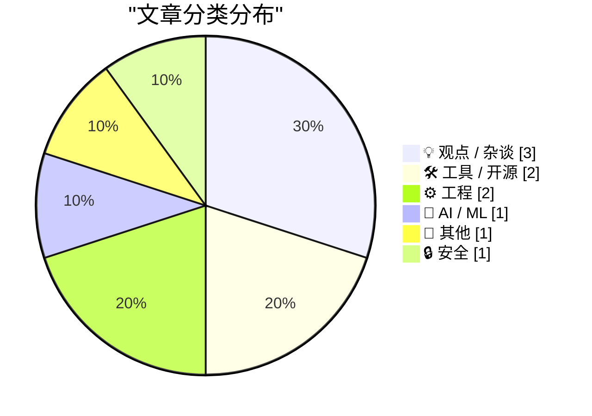
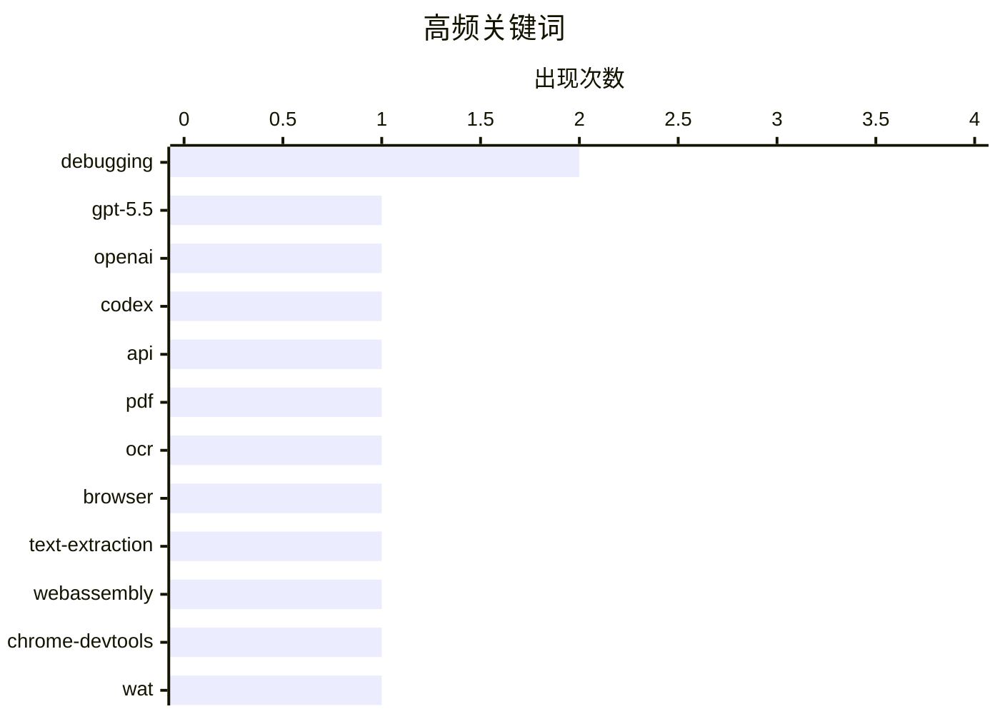

# 📰 AI 博客每日精选 — 2026-04-24

> 来自 Karpathy 推荐的 92 个顶级技术博客，AI 精选 Top 10

## 🏆 今日必读

🥇 **通过半官方 Codex 后门 API 给 GPT-5.5 跑“鹈鹕”基准**

[A pelican for GPT-5.5 via the semi-official Codex backdoor API](https://simonwillison.net/2026/Apr/23/gpt-5-5/#atom-everything) — simonwillison.net · 3 小时前 · 🤖 AI / ML

> GPT-5.5 已发布并在 OpenAI Codex 与付费 ChatGPT 订阅中逐步上线，作者的预览体验是速度快、效果强、按要求完成构建任务。此次发布的明显缺口是官方 API 暂未开放，OpenAI 表示因规模化服务需要额外安全保障，GPT‑5.5 与 GPT‑5.5 Pro 会很快接入 API。文章梳理了近期代理工具与大模型厂商订阅接口的摩擦：OpenClaw 等工具尝试利用订阅通道接入模型，Anthropic 曾封堵，而 OpenAI 对基于 Codex 机制的接入给出更开放信号。作者据此让 Claude Code 逆向 openai/codex 的认证令牌存储方式，做出 LLM 插件 llm-openai-via-codex，用现有 Codex 订阅直接发起提示词调用。文中还给出实际使用路径：安装 Codex CLI、登录并开通 OpenAI 方案，再安装 LLM 与该插件后以 openai-codex 模型名进行调用。

💡 **为什么值得读**: 它把“GPT-5.5 暂无官方 API”这一现实限制，转化为可操作的订阅接入方案，并清楚展示了生态接口博弈与开发者实战路径。

🏷️ GPT-5.5, OpenAI, Codex, API

🥈 **用网页版 LiteParse 在浏览器中提取 PDF 文本**

[Extract PDF text in your browser with LiteParse for the web](https://simonwillison.net/2026/Apr/23/liteparse-for-the-web/#atom-everything) — simonwillison.net · 1 小时前 · 🛠 工具 / 开源

> 重点是把原本作为 Node.js CLI 使用的 LiteParse 改造成完全在浏览器中运行的 PDF 文本提取工具。LiteParse 主要依赖传统 PDF 解析而不是 AI 模型，并在遇到图片型文本时回退到 Tesseract OCR 或其他可插拔 OCR 引擎；它解决的关键难点是“空间文本解析”，通过启发式方法处理多栏等复杂版式，并按合理顺序输出线性文本。原项目建立在 PDF.js 和 Tesseract.js 之上，作者认为它没有浏览器版本并非技术上做不到，而只是此前没人实现。作者还提到 LiteParse 文档中的带边界框可视化引用模式，认为这有助于提升基于 RAG 的 PDF 问答结果可信度。最终作者提供了一个可直接在浏览器中试用的 LiteParse for the web，支持选择是否启用 OCR，并可选显示 PDF 各页图像。

💡 **为什么值得读**: 值得读在于它展示了如何把一个面向代理和命令行的开源 PDF 解析工具迁移到纯浏览器环境，同时点出了空间文本解析和可视化引用这两个非常实用的技术价值。

🏷️ PDF, OCR, browser, text-extraction

🥉 **在 Chrome DevTools 中调试 WASM**

[Debugging WASM in Chrome DevTools](https://eli.thegreenplace.net/2026/debugging-wasm-in-chrome-devtools/) — eli.thegreenplace.net · 20 小时前 · 🛠 工具 / 开源

> 重点是如何用 Chrome DevTools 调试生成出来的 WebAssembly 代码，尤其是定位编译器后端开发中遇到的棘手问题。示例基于 wasm-wat-samples 项目的 gc-print-scheme-pairs，先用 watgo 把 WAT 编译成 WASM，再通过本地 HTTP 服务器加载 browser-loader.html，因为页面不能直接从文件系统打开。Chrome DevTools 的 Sources 面板会在 wasm 项下展示从二进制 WASM 反汇编得到的 WAT 代码，虽然会丢失 folded instructions 这类语法糖，但仍可设置断点、单步执行、查看局部变量和调用栈。对作者最有价值的是异常调试：启用“Pause on exceptions”后，像 ref.cast 这类指令触发的异常会直接停在出错指令上，并在 Scope 面板里显示局部值的实际类型。示例中故意在 $emit_value 开头把 $v 直接强制转换为 (ref $Bool)，调试器随即停在异常位置，并显示 $v 实际是 (ref $Pair)，从而迅速定位问题原因。

💡 **为什么值得读**: 值得读，因为它把 Chrome DevTools 调试 WASM 的实际流程和“异常自动断住并显示运行时类型”这个高价值能力讲得很具体，对排查 ref.cast 一类问题尤其直接有用。

🏷️ WebAssembly, Chrome-DevTools, debugging, WAT

---

## 📊 数据概览

| 扫描源 | 抓取文章 | 时间范围 | 精选 |
|:---:|:---:|:---:|:---:|
| 87/92 | 2522 篇 → 19 篇 | 24h | **10 篇** |

### 分类分布



### 高频关键词



<details>
<summary>📈 纯文本关键词图（终端友好）</summary>

```
debugging       │ ████████████████████ 2
gpt-5.5         │ ██████████░░░░░░░░░░ 1
openai          │ ██████████░░░░░░░░░░ 1
codex           │ ██████████░░░░░░░░░░ 1
api             │ ██████████░░░░░░░░░░ 1
pdf             │ ██████████░░░░░░░░░░ 1
ocr             │ ██████████░░░░░░░░░░ 1
browser         │ ██████████░░░░░░░░░░ 1
text-extraction │ ██████████░░░░░░░░░░ 1
webassembly     │ ██████████░░░░░░░░░░ 1
```

</details>

### 🏷️ 话题标签

**debugging**(2) · **gpt-5.5**(1) · **openai**(1) · codex(1) · api(1) · pdf(1) · ocr(1) · browser(1) · text-extraction(1) · webassembly(1) · chrome-devtools(1) · wat(1) · windows(1) · explorer(1) · calling-convention(1) · open-source(1) · licensing(1) · llm(1) · copyright(1) · sqlalchemy(1)

---

## 💡 观点 / 杂谈

### 1. Pluralistic: The (other) problem with automatic conversion of free software to proprietary software (23 Apr 2026)

[Pluralistic: The (other) problem with automatic conversion of free software to proprietary software (23 Apr 2026)](https://pluralistic.net/2026/04/23/poison-pill/) — **pluralistic.net** · 10 小时前 · ⭐ 23/30

> ->->->->->->->->->->->->->->->->->->->->->->->->->->->->-> Top Sources: None --> Today's links The (other) problem with automatic conversion of free software to proprietary software : You can't add AN

🏷️ open-source, licensing, LLM, copyright

---

### 2. Nilay Patel: ‘Beware Software Brain’

[Nilay Patel: ‘Beware Software Brain’](https://www.theverge.com/podcast/917029/software-brain-ai-backlash-databases-automation) — **daringfireball.net** · 2 小时前 · ⭐ 23/30

> Today on Decoder, I want to lay out an idea that’s been banging around my head for weeks now as we’ve been reporting on AI and having conversations here on this show. I’ve been calling it software bra

🏷️ AI, software-brain, Gen-Z, public-perception

---

### 3. Why prediction markets are a sure sign that our civilisation is in decay

[Why prediction markets are a sure sign that our civilisation is in decay](https://www.joanwestenberg.com/why-prediction-markets-are-a-sure-sign-that-our-civilisation-is-in-decay/) — **joanwestenberg.com** · 19 小时前 · ⭐ 19/30

> 2026-04-23 // 19 min read Why prediction markets are a sure sign that our civilisation is in decay Prediction markets are the clearest single sign our civilisation has entered a late and decadent stag

🏷️ prediction-markets, civilization, governance, incentives

---

## 🛠 工具 / 开源

### 4. 用网页版 LiteParse 在浏览器中提取 PDF 文本

[Extract PDF text in your browser with LiteParse for the web](https://simonwillison.net/2026/Apr/23/liteparse-for-the-web/#atom-everything) — **simonwillison.net** · 1 小时前 · ⭐ 24/30

> 重点是把原本作为 Node.js CLI 使用的 LiteParse 改造成完全在浏览器中运行的 PDF 文本提取工具。LiteParse 主要依赖传统 PDF 解析而不是 AI 模型，并在遇到图片型文本时回退到 Tesseract OCR 或其他可插拔 OCR 引擎；它解决的关键难点是“空间文本解析”，通过启发式方法处理多栏等复杂版式，并按合理顺序输出线性文本。原项目建立在 PDF.js 和 Tesseract.js 之上，作者认为它没有浏览器版本并非技术上做不到，而只是此前没人实现。作者还提到 LiteParse 文档中的带边界框可视化引用模式，认为这有助于提升基于 RAG 的 PDF 问答结果可信度。最终作者提供了一个可直接在浏览器中试用的 LiteParse for the web，支持选择是否启用 OCR，并可选显示 PDF 各页图像。

🏷️ PDF, OCR, browser, text-extraction

---

### 5. 在 Chrome DevTools 中调试 WASM

[Debugging WASM in Chrome DevTools](https://eli.thegreenplace.net/2026/debugging-wasm-in-chrome-devtools/) — **eli.thegreenplace.net** · 20 小时前 · ⭐ 24/30

> 重点是如何用 Chrome DevTools 调试生成出来的 WebAssembly 代码，尤其是定位编译器后端开发中遇到的棘手问题。示例基于 wasm-wat-samples 项目的 gc-print-scheme-pairs，先用 watgo 把 WAT 编译成 WASM，再通过本地 HTTP 服务器加载 browser-loader.html，因为页面不能直接从文件系统打开。Chrome DevTools 的 Sources 面板会在 wasm 项下展示从二进制 WASM 反汇编得到的 WAT 代码，虽然会丢失 folded instructions 这类语法糖，但仍可设置断点、单步执行、查看局部变量和调用栈。对作者最有价值的是异常调试：启用“Pause on exceptions”后，像 ref.cast 这类指令触发的异常会直接停在出错指令上，并在 Scope 面板里显示局部值的实际类型。示例中故意在 $emit_value 开头把 $v 直接强制转换为 (ref $Bool)，调试器随即停在异常位置，并显示 $v 实际是 (ref $Pair)，从而迅速定位问题原因。

🏷️ WebAssembly, Chrome-DevTools, debugging, WAT

---

## ⚙️ 工程

### 6. Another crash caused by uninstaller code injection into Explorer

[Another crash caused by uninstaller code injection into Explorer](https://devblogs.microsoft.com/oldnewthing/20260423-00/?p=112261) — **devblogs.microsoft.com/oldnewthing** · 9 小时前 · ⭐ 23/30

> Some time ago, I noted that any sufficiently advanced uninstaller is indistinguishable from malware .¹ During one of our regular debugging chats, a colleague of mine mentioned that he was looking at a

🏷️ Windows, Explorer, debugging, calling-convention

---

### 7. SQLAlchemy 2 In Practice - Chapter 6: A Page Analytics Solution

[SQLAlchemy 2 In Practice - Chapter 6: A Page Analytics Solution](https://blog.miguelgrinberg.com/post/sqlalchemy-2-in-practice---chapter-6-a-page-analytics-solution) — **miguelgrinberg.com** · 9 小时前 · ⭐ 20/30

> This is the sixth chapter of my SQLAlchemy 2 in Practice book. If you'd like to support my work, I encourage you to buy this book, either directly from my store or on Amazon . Thank you! The goal of t

🏷️ SQLAlchemy, database-design, analytics, Python

---

## 🤖 AI / ML

### 8. 通过半官方 Codex 后门 API 给 GPT-5.5 跑“鹈鹕”基准

[A pelican for GPT-5.5 via the semi-official Codex backdoor API](https://simonwillison.net/2026/Apr/23/gpt-5-5/#atom-everything) — **simonwillison.net** · 3 小时前 · ⭐ 26/30

> GPT-5.5 已发布并在 OpenAI Codex 与付费 ChatGPT 订阅中逐步上线，作者的预览体验是速度快、效果强、按要求完成构建任务。此次发布的明显缺口是官方 API 暂未开放，OpenAI 表示因规模化服务需要额外安全保障，GPT‑5.5 与 GPT‑5.5 Pro 会很快接入 API。文章梳理了近期代理工具与大模型厂商订阅接口的摩擦：OpenClaw 等工具尝试利用订阅通道接入模型，Anthropic 曾封堵，而 OpenAI 对基于 Codex 机制的接入给出更开放信号。作者据此让 Claude Code 逆向 openai/codex 的认证令牌存储方式，做出 LLM 插件 llm-openai-via-codex，用现有 Codex 订阅直接发起提示词调用。文中还给出实际使用路径：安装 Codex CLI、登录并开通 OpenAI 方案，再安装 LLM 与该插件后以 openai-codex 模型名进行调用。

🏷️ GPT-5.5, OpenAI, Codex, API

---

## 📝 其他

### 9. Construction Costs Rarely Fall

[Construction Costs Rarely Fall](https://www.construction-physics.com/p/construction-costs-rarely-fall) — **construction-physics.com** · 11 小时前 · ⭐ 20/30

> Construction Costs Rarely Fall Brian Potter Apr 23, 2026 108 4 4 Share Not long ago we looked at construction productivity trends for the US and for countries around the world . We found that in the U

🏷️ construction, productivity, costs, inflation

---

## 🔒 安全

### 10. Sneaky spam in conversational replies to blog posts

[Sneaky spam in conversational replies to blog posts](https://shkspr.mobi/blog/2026/04/sneaky-spam-in-conversational-replies-to-blog-posts/) — **shkspr.mobi** · 11 小时前 · ⭐ 19/30

> Sneaky spam in conversational replies to blog posts blog blogging spam WordPress · 8 comments · 350 words · Viewed ~5,709 times I'm grateful that my blog posts attract lots of engaged, funny, and chal

🏷️ spam, WordPress, AI-slop, comments

---

*生成于 2026-04-24 07:03 | 扫描 87 源 → 获取 2522 篇 → 精选 10 篇*
*基于 [Hacker News Popularity Contest 2025](https://refactoringenglish.com/tools/hn-popularity/) RSS 源列表*
