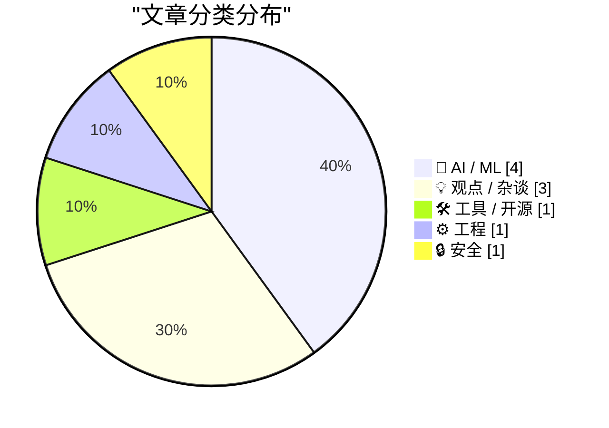
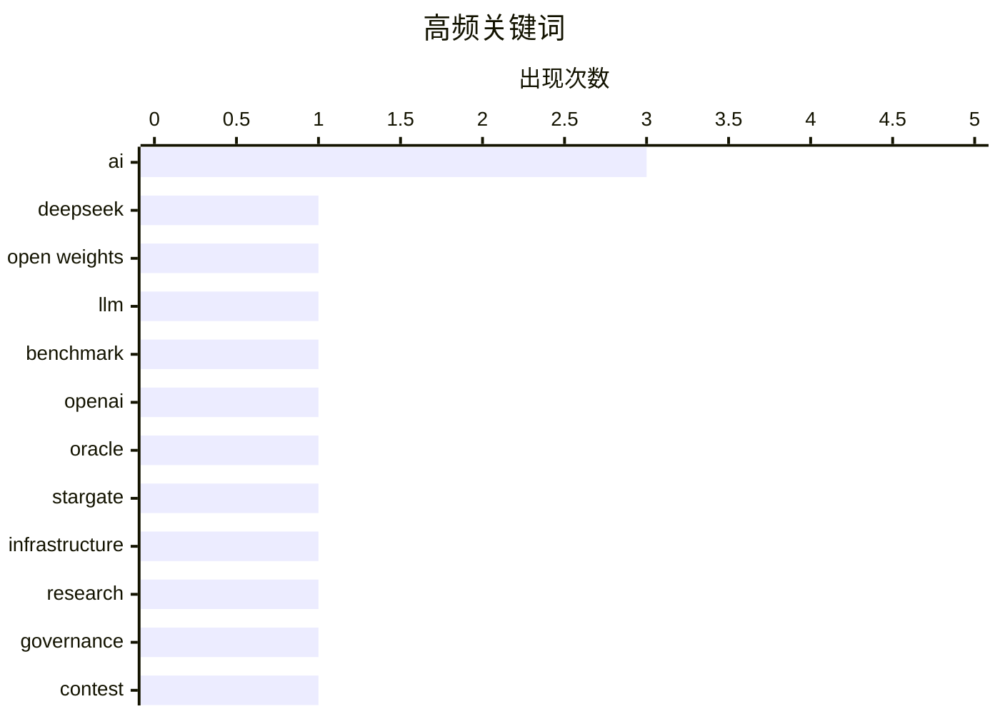

# 📰 AI 博客每日精选 — 2026-04-25

> 来自 Karpathy 推荐的 92 个顶级技术博客，AI 精选 Top 10

## 📝 今日看点

今天的技术圈，主线依然是 AI：一边是 DeepSeek 以更低成本逼近前沿能力，继续把“大模型性价比战”推向白热化；另一边，围绕 OpenAI 基础设施叙事、Claude Code 质量波动等话题，也让行业从“拼参数、拼故事”转向“拼交付、拼可信度”。与此同时，AI 正在倒逼软件工程职业与开源生态重新定义自身——工程师的长期角色、开源是否还能保持开放，正从边缘讨论变成现实问题。除 AI 之外，更小更便宜的 10GbE 硬件与底层工程实践文章也提醒人们：真正推动技术进步的，仍是基础设施与工程细节的持续改良。

---

## 🏆 今日必读

🥇 **DeepSeek V4——接近前沿水平，价格却只要一小部分**

[DeepSeek V4 - almost on the frontier, a fraction of the price](https://simonwillison.net/2026/Apr/24/deepseek-v4/#atom-everything) — simonwillison.net · 17 小时前 · 🤖 AI / ML

> DeepSeek 发布了 V4 系列的两个预览模型 DeepSeek-V4-Pro 和 DeepSeek-V4-Flash，二者都采用 100 万 token 上下文和 Mixture of Experts 架构。Pro 具有 1.6T 总参数、49B 激活参数，Flash 为 284B 总参数、13B 激活参数，并采用 MIT 许可证；作者认为 Pro 已成为当前最大的开放权重模型，规模超过 Kimi K2.6、GLM-5.1，也明显大于 DeepSeek V3.2。文章认为最突出的变化是价格：Flash 输入/输出价格分别为每百万 token 0.14 美元和 0.28 美元，Pro 为 1.74 美元和 3.48 美元，在文中列举的 Gemini、OpenAI、Anthropic 对比中分别是小模型和大型前沿模型里最便宜的。DeepSeek 论文把低价归因于效率优化，尤其是长上下文场景下，1M token 时 Pro 的单 token FLOPs 和 KV cache 大小分别仅为 V3.2 的 27% 和 10%，Flash 则进一步降到 10% 和 7%。作者还通过 OpenRouter 进行了简单体验，并提到论文中的自报基准显示 Pro 已具备与其他前沿模型竞争的能力。

💡 **为什么值得读**: 值得读，因为它把 DeepSeek V4 的模型规模、授权方式、价格和长上下文效率改进放在同一视角下比较，能快速判断这次发布为何在开源大模型市场里格外有分量。

🏷️ DeepSeek, open weights, LLM, benchmark

🥈 **付费：OpenAI 如何杀死 Oracle**

[Premium: How OpenAI Kills Oracle](https://www.wheresyoured.at/how-openai-kills-oracle/) — wheresyoured.at · 6 小时前 · 🤖 AI / ML

> 文章围绕 OpenAI、Oracle 与软银高调宣布的 Stargate AI 基础设施项目展开，质疑这一项目是否真实落地以及各方对外表述的可信度。文中列出当时公布的关键信息，包括计划在美国投资至少 5000 亿美元、迅速部署 1000 亿美元、在得州建设多个单体 50 万平方英尺的数据中心，并声称将创造超过 10 万个就业岗位。作者指出，15 个月后 Stargate LLC 并未成立，软银和 OpenAI 也未向项目投入资本，所谓“正在建设中的数据中心”实际对应的是得州 Abilene 一个自 2024 年中就已开建的 1.2GW 项目，且最初曾预留给马斯克和 xAI。对于 Larry Ellison 所说的 10 栋在建、未来扩至 20 栋，文中称实际仅有 8 栋在建，每栋约容纳 5 万块 GB200 GPU，并采用 NVL72 机架。结论上，作者认为这场发布更像是围绕既有项目进行的营销包装，OpenAI、Oracle 和软银借此向公众塑造了一个并未真正成形的“超级项目”。

💡 **为什么值得读**: 值得读的地方在于，它把一场声势浩大的 AI 基建宣布拆解到公司实体、资金流向和在建项目细节层面，能帮助读者判断大型 AI 叙事背后究竟有多少是真实投入。

🏷️ OpenAI, Oracle, Stargate, infrastructure

🥉 **关于 AI 重大问题的博客征文奖**

[Blog prize for the big questions about AI](https://www.dwarkesh.com/p/blog-prize) — dwarkesh.com · 6 小时前 · 🤖 AI / ML

> Dwarkesh Patel 宣布设立一项总额 2 万美元的博客征文奖，面向围绕 AI 重大问题展开研究与思考的人，征文要求从给定问题中任选其一，在不超过 1000 词内作答，并于 5 月 10 日 11:59 PM PST 前提交。奖金分别为第一名 1 万美元、第二名 6000 美元、第三名 4000 美元，获奖作品将有机会发布在其博客上。文中列出的题目聚焦几个高影响议题：为何 AI 在进入更长时程的 RL 阶段后仍可能继续快速进展；基础模型公司在持续扩张训练开销、蒸馏和开源追赶压力下，究竟如何开始真正盈利；以及如果掌握 OpenAI Foundation 价值约 1800 亿美元的持股，应如何把数千亿美元级别的财富具体转化为“让 AI 发展顺利”的实际影响。作者也直言，这场比赛的一个重要目的，是借此找到能够与自己并肩研究这些问题的研究合作者。

💡 **为什么值得读**: 值得读在于它把 AI 进展、商业化与巨额公益资本配置这三类最难且最现实的问题压缩成了可直接作答的研究题目，也清楚透露了作者筛选研究人才的标准。

🏷️ AI, research, governance, contest

---

## 📊 数据概览

| 扫描源 | 抓取文章 | 时间范围 | 精选 |
|:---:|:---:|:---:|:---:|
| 88/92 | 2532 篇 → 22 篇 | 24h | **10 篇** |

### 分类分布



### 高频关键词



<details>
<summary>📈 纯文本关键词图（终端友好）</summary>

```
ai             │ ████████████████████ 3
deepseek       │ ███████░░░░░░░░░░░░░ 1
open weights   │ ███████░░░░░░░░░░░░░ 1
llm            │ ███████░░░░░░░░░░░░░ 1
benchmark      │ ███████░░░░░░░░░░░░░ 1
openai         │ ███████░░░░░░░░░░░░░ 1
oracle         │ ███████░░░░░░░░░░░░░ 1
stargate       │ ███████░░░░░░░░░░░░░ 1
infrastructure │ ███████░░░░░░░░░░░░░ 1
research       │ ███████░░░░░░░░░░░░░ 1
```

</details>

### 🏷️ 话题标签

**ai**(3) · **deepseek**(1) · **open weights**(1) · llm(1) · benchmark(1) · openai(1) · oracle(1) · stargate(1) · infrastructure(1) · research(1) · governance(1) · contest(1) · claude code(1) · anthropic(1) · postmortem(1) · agentic systems(1) · software engineering(1) · career(1) · productivity(1) · 10gbe(1)

---

## 🤖 AI / ML

### 1. DeepSeek V4——接近前沿水平，价格却只要一小部分

[DeepSeek V4 - almost on the frontier, a fraction of the price](https://simonwillison.net/2026/Apr/24/deepseek-v4/#atom-everything) — **simonwillison.net** · 17 小时前 · ⭐ 27/30

> DeepSeek 发布了 V4 系列的两个预览模型 DeepSeek-V4-Pro 和 DeepSeek-V4-Flash，二者都采用 100 万 token 上下文和 Mixture of Experts 架构。Pro 具有 1.6T 总参数、49B 激活参数，Flash 为 284B 总参数、13B 激活参数，并采用 MIT 许可证；作者认为 Pro 已成为当前最大的开放权重模型，规模超过 Kimi K2.6、GLM-5.1，也明显大于 DeepSeek V3.2。文章认为最突出的变化是价格：Flash 输入/输出价格分别为每百万 token 0.14 美元和 0.28 美元，Pro 为 1.74 美元和 3.48 美元，在文中列举的 Gemini、OpenAI、Anthropic 对比中分别是小模型和大型前沿模型里最便宜的。DeepSeek 论文把低价归因于效率优化，尤其是长上下文场景下，1M token 时 Pro 的单 token FLOPs 和 KV cache 大小分别仅为 V3.2 的 27% 和 10%，Flash 则进一步降到 10% 和 7%。作者还通过 OpenRouter 进行了简单体验，并提到论文中的自报基准显示 Pro 已具备与其他前沿模型竞争的能力。

🏷️ DeepSeek, open weights, LLM, benchmark

---

### 2. 付费：OpenAI 如何杀死 Oracle

[Premium: How OpenAI Kills Oracle](https://www.wheresyoured.at/how-openai-kills-oracle/) — **wheresyoured.at** · 6 小时前 · ⭐ 26/30

> 文章围绕 OpenAI、Oracle 与软银高调宣布的 Stargate AI 基础设施项目展开，质疑这一项目是否真实落地以及各方对外表述的可信度。文中列出当时公布的关键信息，包括计划在美国投资至少 5000 亿美元、迅速部署 1000 亿美元、在得州建设多个单体 50 万平方英尺的数据中心，并声称将创造超过 10 万个就业岗位。作者指出，15 个月后 Stargate LLC 并未成立，软银和 OpenAI 也未向项目投入资本，所谓“正在建设中的数据中心”实际对应的是得州 Abilene 一个自 2024 年中就已开建的 1.2GW 项目，且最初曾预留给马斯克和 xAI。对于 Larry Ellison 所说的 10 栋在建、未来扩至 20 栋，文中称实际仅有 8 栋在建，每栋约容纳 5 万块 GB200 GPU，并采用 NVL72 机架。结论上，作者认为这场发布更像是围绕既有项目进行的营销包装，OpenAI、Oracle 和软银借此向公众塑造了一个并未真正成形的“超级项目”。

🏷️ OpenAI, Oracle, Stargate, infrastructure

---

### 3. 关于 AI 重大问题的博客征文奖

[Blog prize for the big questions about AI](https://www.dwarkesh.com/p/blog-prize) — **dwarkesh.com** · 6 小时前 · ⭐ 23/30

> Dwarkesh Patel 宣布设立一项总额 2 万美元的博客征文奖，面向围绕 AI 重大问题展开研究与思考的人，征文要求从给定问题中任选其一，在不超过 1000 词内作答，并于 5 月 10 日 11:59 PM PST 前提交。奖金分别为第一名 1 万美元、第二名 6000 美元、第三名 4000 美元，获奖作品将有机会发布在其博客上。文中列出的题目聚焦几个高影响议题：为何 AI 在进入更长时程的 RL 阶段后仍可能继续快速进展；基础模型公司在持续扩张训练开销、蒸馏和开源追赶压力下，究竟如何开始真正盈利；以及如果掌握 OpenAI Foundation 价值约 1800 亿美元的持股，应如何把数千亿美元级别的财富具体转化为“让 AI 发展顺利”的实际影响。作者也直言，这场比赛的一个重要目的，是借此找到能够与自己并肩研究这些问题的研究合作者。

🏷️ AI, research, governance, contest

---

### 4. 关于近期 Claude Code 质量报告的更新

[An update on recent Claude Code quality reports](https://simonwillison.net/2026/Apr/24/recent-claude-code-quality-reports/#atom-everything) — **simonwillison.net** · 21 小时前 · ⭐ 23/30

> 过去两个月里，关于 Claude Code 输出质量变差的大量抱怨，后来被证实确实源于真实问题。问题不在模型本身，而是在 Claude Code 的 harness 中存在三个彼此独立的问题，这些复杂但实质性的故障直接影响了用户体验。Anthropic 的事后复盘详细说明了这些问题，其中一个突出案例是：3 月 26 日上线的改动原本只想在会话闲置超过 1 小时后清除较早的 thinking 以降低恢复延迟，但一个 bug 让这一清理在后续每一轮对话都持续发生。结果是 Claude 显得健忘且重复，尤其会影响那些被搁置一小时、一天甚至更久后继续使用的会话。作者认为，构建 agentic systems 的人很值得仔细阅读这次复盘，因为 harness 层面的 bug 本身就极其复杂，更不用说模型还具有非确定性。

🏷️ Claude Code, Anthropic, postmortem, agentic systems

---

## 💡 观点 / 杂谈

### 5. 软件工程可能不再是一份终身职业

[Software engineering may no longer be a lifetime career](https://seangoedecke.com/software-engineering-may-no-longer-be-a-lifetime-career/) — **seangoedecke.com** · 23 小时前 · ⭐ 22/30

> 焦点在于：即使使用 AI 可能让软件工程师在长期内学得更少、技术能力逐渐退化，也不必然构成拒绝使用 AI 的充分理由。文中认为，过去“通过做软件工程来学习软件工程”只是一个有利的历史阶段，而不是这门职业不可改变的本质。作者把这种处境类比为建筑工人搬运重物和木工使用电动工具：某些做法可能带来长期损耗，但只要短期效率收益足够高，从业者仍会因为工作要求和市场竞争而被迫采用。进一步的判断是，如果模型能力足够强，坚持手写代码的人可能会像拒绝使用电动工具的木工一样失去薪资岗位上的竞争力。结论是，软件工程师应正视“职业寿命可能缩短”的风险，并像职业运动员那样尽早为不可持续的阶段之后做准备。

🏷️ AI, software engineering, career, productivity

---

### 6. “平台劣化”的免费、开放视觉标识

[Pluralistic: A free, open visual identity for enshittification (24 Apr 2026)](https://pluralistic.net/2026/04/24/poop-emoji-plus-plus/) — **pluralistic.net** · 10 小时前 · ⭐ 20/30

> 文章围绕如何为“enshittification”这一技术政策批评概念建立更直观、可传播的视觉识别展开。作者回顾自己近 25 年在电子前哨基金会推动公众关注抽象技术议题的工作，认为“enshittification”这个词因其强烈表达和轻微粗俗感，显著提升了相关议题的可见度。除文字表达外，作者近年持续用拼贴创作，把公共领域图片与 Creative Commons 授权素材结合，尝试把抽象技术问题转化为更有吸引力的视觉呈现。2025 年图书《Enshittification》美国版封面采用 Devin Washburn 设计的“愤怒便便”变体图像后，这一形象成为作者反复使用的“平台劣化”视觉速记，并被制作成徽章和贴纸在 33 城巡回活动中免费发放。可见，作者把开放、可复用的视觉符号视为推动公众理解和传播技术批评议题的重要工具。

🏷️ enshittification, platforms, tech policy, branding

---

### 7. “我们这里不招待他们那一类”

[★ ‘We Don’t Serve Their Kind Here’](https://daringfireball.net/2026/04/we_dont_serve_their_kind_here) — **daringfireball.net** · 8 小时前 · ⭐ 12/30

> 文章围绕《星球大战》中莫斯艾斯利酒馆的一幕展开，重新审视“我们这里不招待他们那一类”这句台词所传达的社会含义。作者认为，这段戏不仅通过酒馆里突然出现的大量外星人展示了银河系的多样性，也借酒保对 C-3PO 和 R2-D2 的强烈排斥，暗示了底层群体对机器人的敌意与怨恨。文中强调，酒保的态度并不是执行一条中立规定，而是带有明显厌恶和排斥情绪。作者回忆自己小时候虽然不理解原因，却已经从这场戏中感受到那个世界里机器人所处的不受欢迎地位。结尾点出，这个片段这些年越来越频繁地被作者想起。

🏷️ Star Wars, droids, culture, essay

---

## 🛠 工具 / 开源

### 8. 新的 10 GbE USB 适配器更凉快、更小巧、更便宜

[New 10 GbE USB adapters are cooler, smaller, cheaper](https://www.jeffgeerling.com/blog/2026/new-10-gbe-usb-adapters-cooler-smaller-cheaper/) — **jeffgeerling.com** · 9 小时前 · ⭐ 21/30

> 新一代基于 RTL8159 的 10G USB 3.2 网卡，正在取代过去体积大、价格高、发热重的 10 GbE Thunderbolt 适配器。作者测试了一款售价 80 美元的 WisdPi 10G USB 适配器，认为它对使用 RJ45 而非 SFP+ 的用户很有吸引力，但是否能跑满 10 Gbps 严重依赖主机的 USB 端口规格。实测中，只有配备 USB 3.2 Gen 2x2 20 Gbps 接口的 AMD 台式机能接近满速，其他仅有 USB 3.1 / USB 3.2 Gen 2 级别接口的设备大多只能达到约 6–7 Gbps。兼容性方面，macOS 可即插即用但会把连接速率错误显示为 2500Base-T，Windows 则需要额外安装瑞昱驱动后才能联网。作者的结论是，这类 10G USB 适配器只有在 20 Gbps USB 端口上才能真正发挥价值；如果不需要 10G，2.5G 或 5G 适配器仍然更划算。

🏷️ 10GbE, USB, networking, RTL8159

---

## ⚙️ 工程

### 9. 在 scope_exit RAII 类型中防御异常

[Defending against exceptions in a scope_exit RAII type](https://devblogs.microsoft.com/oldnewthing/20260424-00/?p=112266) — **devblogs.microsoft.com/oldnewthing** · 9 小时前 · ⭐ 20/30

> 文章聚焦于 C++ 中使用 wil::scope_exit 模拟 finally 时，异常可能打断清理逻辑的三个位置。第一个风险点是 lambda 捕获对象初始化期间抛出异常，此时 scope_exit 甚至还未构造，清理动作不会执行；第二个风险点是把 lambda 移动到 cleanup 的过程中抛出异常，朴素实现下异常会直接传播，清理同样不会发生。第三个风险点出现在 scope_exit 析构时，如果清理代码抛异常，由于析构函数默认 noexcept，通常会导致 std::terminate；若显式允许析构抛出异常，则正常离开作用域和异常展开中的后果也不同。WIL 对复制或移动 lambda 时发生异常的情况直接视为未定义行为，而实验阶段的 C++ scope_exit 则选择在捕获构造期间出错时先调用 lambda 再传播异常。作者最后指出，实际中这一问题通常影响不大，因为 lambda 往往使用 [&] 按引用捕获，而这类捕获在构造和复制时通常不会抛异常。

🏷️ C++, RAII, exceptions, scope_exit

---

## 🔒 安全

### 10. Mythos 是否意味着你需要关闭你的开源代码仓库？

[Does Mythos mean you need to shut down your Open Source repositories?](https://shkspr.mobi/blog/2026/04/does-mythos-mean-you-need-to-shut-down-your-open-source-repos/) — **shkspr.mobi** · 11 小时前 · ⭐ 17/30

> 围绕 AI 模型“Claude Mythos Preview”引发的担忧，文章回答了一个直接问题：是否应该为了安全而关闭开源项目，结论是否定的。作者认为，已有的开源代码多年前就已被用于训练、备份或归档，现在再关闭仓库并不能形成有意义的保护。真正更值得担心的风险主要不在自家源码本身，而在供应链中的操作系统、库、硬件，以及钓鱼攻击、糟糕的密码习惯和内部威胁；相比之下，修补现有系统比仓促改为闭源更有效。文章还指出，闭源并不能阻止 AI 或攻击者分析网站和二进制，AI 只是可能加速这一过程，而不是改变“闭源同样脆弱”的长期事实。对于公共资金支持开发的代码，作者坚持其仍有责任公开，并提到英国 AI Safety Institute 对 Claude Mythos Preview 网络能力的评估和 NCSC 的建议都没有主张关闭开源代码。

🏷️ open source, AI, security, supply chain

---

*生成于 2026-04-25 07:03 | 扫描 88 源 → 获取 2532 篇 → 精选 10 篇*
*基于 [Hacker News Popularity Contest 2025](https://refactoringenglish.com/tools/hn-popularity/) RSS 源列表*
