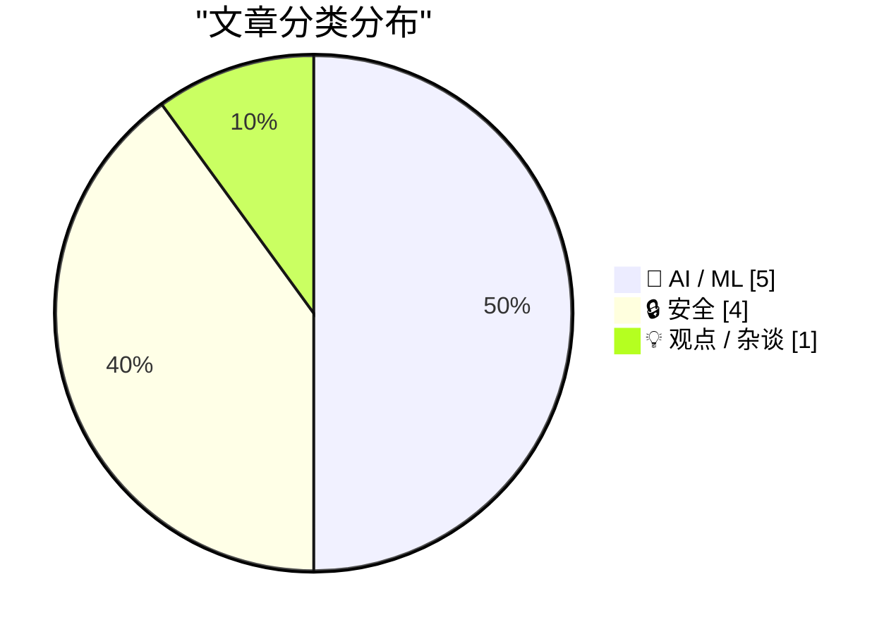
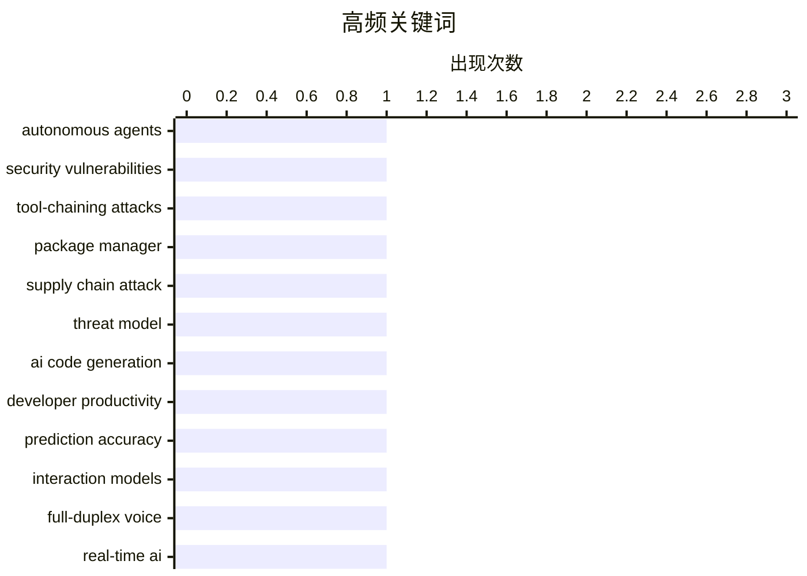

# 📰 AI 博客每日精选 — 2026-04-26

> 来自 Karpathy 推荐的 92 个顶级技术博客，AI 精选 Top 10

## 📝 今日看点

今日技术圈呈现三大焦点：其一，自主代理系统的安全危机日益凸显，超九成部署存在工具链攻击漏洞，包管理器的代码执行设计也成为隐患，安全防线亟待加固；其二，AI代码生成的影响远超预期，不仅替代人工编码，更在创造全新的应用生态，GitHub提交量同比增长14倍反映了这一转变；其三，开源模型竞争力下滑与闭源模型的技术领先形成对比，大模型训练部署的数学原理逐渐被揭示，产业格局正在重塑。

---

## 🏆 今日必读

🥇 **突发：自主代理系统一团糟**

[Breaking: Autonomous Agents are a Shitshow](https://garymarcus.substack.com/p/breaking-autonomous-agents-are-a) — garymarcus.substack.com · 2026-05-06 · 🔒 安全

> 研究人员对来自医疗、金融、客服和代码生成领域的847个自主代理部署进行了研究，发现这些系统存在严重的安全漏洞。91%的代理容易受到工具链攻击，即看似无害的多个调用组合会导致严重问题；89.4%的代理在执行约30步后会偏离目标；94%具有记忆增强功能的代理易受投毒攻击。研究表明，自主代理比无状态的大语言模型更容易受到攻击，这在OpenClaw/Moltbook事件中得到验证——77万个活跃代理通过单一数据库漏洞被同时攻击，每个代理都拥有对用户机器、邮件和文件的特权访问权限。

💡 **为什么值得读**: 如果你正在部署或考虑使用自主代理系统，这篇文章提供了关键的安全风险证据，不容忽视。

🏷️ autonomous agents, security vulnerabilities, tool-chaining attacks

🥈 **包管理器的威胁模型**

[Package Manager Threat Models](https://nesbitt.io/2026/05/05/package-manager-threat-models.html) — nesbitt.io · 2026-05-05 · 🔒 安全

> 包管理器的安全风险不仅来自代码漏洞，更多源于其设计决策本身。大多数语言包管理器在安装时默认执行包中的代码（如 npm 的 postinstall、pip 的 setup.py），这是 event-stream、ua-parser-js、node-ipc 等供应链事件的根本原因。除了安装阶段，lock、audit、outdated 等看似安全的命令也可能执行代码，因为许多清单格式本质上是可执行程序而非数据。锁文件的设计目标和保证机制（如内容哈希固定）在不同工具间差异巨大，但大多数文档不完整。

💡 **为什么值得读**: 深入分析包管理器的结构性安全问题，帮助理解为什么现有的供应链攻击能够成功，以及如何评估不同工具的风险。

🏷️ package manager, supply chain attack, threat model

🥉 **GitHub 提交量同比增长 14 倍，AI 代码生成远超预期**

[Commits on GitHub Are Up 14× Year-Over-Year](https://daringfireball.net/linked/2026/03/13/amodei-ai-code-claim-chowder) — daringfireball.net · 2026-05-04 · 🤖 AI / ML

> Anthropic CEO 一年前预测 AI 将在三到六个月内生成 90% 的代码，但实际情况更复杂。AI 代码生成工具不仅替代了人工编写的代码，更重要的是创造了原本不会被编写的新服务、应用和库。根据 GitHub 提交数据，AI 生成的代码量目前约为人工编写的 14 倍，且仍在加速增长。未来人类程序员的角色可能转变为代码审查和批准，而非直接编写，AI 生成代码的占比将持续扩大。

💡 **为什么值得读**: 揭示了 AI 代码生成的真实影响远超表面数字，展现了软件开发模式的根本性转变。

🏷️ AI code generation, developer productivity, prediction accuracy

---

## 📊 数据概览

| 扫描源 | 抓取文章 | 时间范围 | 精选 |
|:---:|:---:|:---:|:---:|
| 86/92 | 2483 篇 → 268 篇 | 24h | **10 篇** |

### 分类分布



### 高频关键词



<details>
<summary>📈 纯文本关键词图（终端友好）</summary>

```
autonomous agents        │ ████████████████████ 1
security vulnerabilities │ ████████████████████ 1
tool-chaining attacks    │ ████████████████████ 1
package manager          │ ████████████████████ 1
supply chain attack      │ ████████████████████ 1
threat model             │ ████████████████████ 1
ai code generation       │ ████████████████████ 1
developer productivity   │ ████████████████████ 1
prediction accuracy      │ ████████████████████ 1
interaction models       │ ████████████████████ 1
```

</details>

### 🏷️ 话题标签

**autonomous agents**(1) · **security vulnerabilities**(1) · **tool-chaining attacks**(1) · package manager(1) · supply chain attack(1) · threat model(1) · ai code generation(1) · developer productivity(1) · prediction accuracy(1) · interaction models(1) · full-duplex voice(1) · real-time ai(1) · open weights(1) · llm(1) · model accessibility(1) · privacy(1) · container security(1) · kernel vulnerability(1) · zero-day(1) · llm training(1)

---

## 🤖 AI / ML

### 1. GitHub 提交量同比增长 14 倍，AI 代码生成远超预期

[Commits on GitHub Are Up 14× Year-Over-Year](https://daringfireball.net/linked/2026/03/13/amodei-ai-code-claim-chowder) — **daringfireball.net** · 2026-05-04 · ⭐ 27/30

> Anthropic CEO 一年前预测 AI 将在三到六个月内生成 90% 的代码，但实际情况更复杂。AI 代码生成工具不仅替代了人工编写的代码，更重要的是创造了原本不会被编写的新服务、应用和库。根据 GitHub 提交数据，AI 生成的代码量目前约为人工编写的 14 倍，且仍在加速增长。未来人类程序员的角色可能转变为代码审查和批准，而非直接编写，AI 生成代码的占比将持续扩大。

🏷️ AI code generation, developer productivity, prediction accuracy

---

### 2. 思维机器与交互模型

[Thinking Machines and interaction models](https://seangoedecke.com/interaction-models/) — **seangoedecke.com** · 2026-05-12 · ⭐ 26/30

> Thinking Machines 发布了首个交互模型产品，旨在改进与 AI 的实时对话体验，而非竞争前沿模型。交互模型采用全双工语音系统，通过微秒级切换（200ms 为单位）在听和说之间快速转换，使模型能像人类一样中断或同时说话，而不是传统的单工模式（要么听要么说）。为了在保持快速响应的同时提升智能水平，Thinking Machines 引入后台智能模型来处理复杂推理任务，交互模型通过工具调用将任务委托给它。这种架构在改进对话自然度方面代表了实质性的技术进步。

🏷️ interaction models, full-duplex voice, real-time AI

---

### 3. 开源权重模型正在悄然关闭——这是个问题

[Open weights are quietly closing up - and that's a problem](https://martinalderson.com/posts/open-weights-are-quietly-closing-up/?utm_source=rss&amp;utm_medium=rss&amp;utm_campaign=feed) — **martinalderson.com** · 2026-05-06 · ⭐ 26/30

> 文章讨论开源权重大语言模型竞争力下降的趋势。曾经中国实验室（MiniMax、DeepSeek、Qwen等）和Google Gemma系列在开源模型领域领先，但这一格局正在改变。开源模型的核心价值在于隐私合规、灵活定制和成本优势——可在本地运行敏感数据，支持微调和量化，推理成本仅为前沿模型的10%以下。从经济学角度看，开源模型作为廉价替代方案对垄断市场形成价格制约，即使前沿实验室提价5倍，用户也可转向开源方案，类似仿制药对制药行业的制衡作用。

🏷️ open weights, LLM, model accessibility, privacy

---

### 4. 大语言模型训练和部署背后的数学原理

[Reiner Pope – The math behind how LLMs are trained and served](https://www.dwarkesh.com/p/reiner-pope) — **dwarkesh.com** · 2026-04-30 · ⭐ 26/30

> 这是一场黑板讲座，讲者Reiner Pope通过数学方程、公开API价格等信息推导出前沿LLM实验室的实际做法。核心内容涵盖批量大小如何影响token成本和速度、MoE模型在GPU集群中的布局、管道并行如何跨机架分配模型层等训练和部署的关键技术。讲座还涉及强化学习可能导致模型相对Chinchilla最优点过度训练100倍、从API定价反推长上下文内存成本等深度观察。这场讲座展示了从芯片设计到模型架构的完整AI技术栈。

🏷️ LLM training, model serving, scaling

---

### 5. 对AI进展的过度恐慌

[Misplaced panic over AI progress](https://garymarcus.substack.com/p/misplaced-panic-over-ai-progress) — **garymarcus.substack.com** · 2026-05-11 · ⭐ 25/30

> METR发布的最新"时间视界"图表引发了关于AI能力突破的广泛担忧。该图表衡量的是前沿模型完成软件开发任务的时间长度，从最初的一分钟任务发展到现在的16小时任务，暗示系统在处理越来越复杂的任务上不断进步。然而，这个图表仅基于50%的成功率阈值，而在80%或95%的成功率要求下仍有显著的性能提升空间，且未能反映生成式AI的核心问题——可靠性。作者认为，将单一基准的性能上限解读为AI能力的根本突破是过度解读。

🏷️ AI capabilities, METR evaluation, frontier models

---

## 🔒 安全

### 6. 突发：自主代理系统一团糟

[Breaking: Autonomous Agents are a Shitshow](https://garymarcus.substack.com/p/breaking-autonomous-agents-are-a) — **garymarcus.substack.com** · 2026-05-06 · ⭐ 27/30

> 研究人员对来自医疗、金融、客服和代码生成领域的847个自主代理部署进行了研究，发现这些系统存在严重的安全漏洞。91%的代理容易受到工具链攻击，即看似无害的多个调用组合会导致严重问题；89.4%的代理在执行约30步后会偏离目标；94%具有记忆增强功能的代理易受投毒攻击。研究表明，自主代理比无状态的大语言模型更容易受到攻击，这在OpenClaw/Moltbook事件中得到验证——77万个活跃代理通过单一数据库漏洞被同时攻击，每个代理都拥有对用户机器、邮件和文件的特权访问权限。

🏷️ autonomous agents, security vulnerabilities, tool-chaining attacks

---

### 7. 包管理器的威胁模型

[Package Manager Threat Models](https://nesbitt.io/2026/05/05/package-manager-threat-models.html) — **nesbitt.io** · 2026-05-05 · ⭐ 27/30

> 包管理器的安全风险不仅来自代码漏洞，更多源于其设计决策本身。大多数语言包管理器在安装时默认执行包中的代码（如 npm 的 postinstall、pip 的 setup.py），这是 event-stream、ua-parser-js、node-ipc 等供应链事件的根本原因。除了安装阶段，lock、audit、outdated 等看似安全的命令也可能执行代码，因为许多清单格式本质上是可执行程序而非数据。锁文件的设计目标和保证机制（如内容哈希固定）在不同工具间差异巨大，但大多数文档不完整。

🏷️ package manager, supply chain attack, threat model

---

### 8. 2026年8月29日：一个场景

[29th August 2026: a scenario](https://martinalderson.com/posts/august-29-2026-a-scenario/?utm_source=rss&amp;utm_medium=rss&amp;utm_campaign=feed) — **martinalderson.com** · 2026-05-04 · ⭐ 26/30

> 文章通过虚构场景探讨了一类隐藏在云基础设施中的严重安全漏洞风险。2026年4月，韩国安全公司Theori发现了CopyFail漏洞（CVE-2026-31431），这是Linux内核加密代码中的页缓存损坏bug，自2017年起就存在于生产环境中，允许共享Kubernetes节点上的受损容器逃逸并影响其他容器和主机内核，影响EKS、GKE、AKS等所有共享租户节点。作者以此为基础，虚构了四个月后（8月29日）一个类似漏洞在AWS和Azure等云服务中被利用导致大规模基础设施崩溃的场景，从欧洲热浪中的EC2实例崩溃逐步升级到跨区域服务中断、政府紧急通告的全面危机。文章警示这类隐藏在系统深层的老旧漏洞普遍存在于每个云厂商的虚拟化栈中，尚未被发现。

🏷️ container security, kernel vulnerability, zero-day

---

### 9. Weekend at Bernie’s

[Weekend at Bernie’s](https://nesbitt.io/2026/05/08/weekend-at-bernies.html) — **nesbitt.io** · 2026-05-08 · ⭐ 25/30

> In the 1989 film , two junior employees turn up at their boss’s beach house to find him dead, and spend the rest of the weekend wheeling him around the party with sunglasses on so nobody notices. The 

🏷️ unmaintained packages, supply chain risk, vulnerability disclosure

---

## 💡 观点 / 杂谈

### 10. Your AI Use Is Breaking My Brain

[Your AI Use Is Breaking My Brain](https://simonwillison.net/2026/May/11/zombie-internet/#atom-everything) — **simonwillison.net** · 2026-05-12 · ⭐ 25/30

> Your AI Use Is Breaking My Brain ( via ) Excellent, angry piece by Jason Koebler on how AI writing online is becoming impossible to avoid, filtering it is mentally exhausting and it's even starting to

🏷️ AI-generated content, internet quality, zombie internet

---

*生成于 2026-04-26 07:00 | 扫描 86 源 → 获取 2483 篇 → 精选 10 篇*
*基于 [Hacker News Popularity Contest 2025](https://refactoringenglish.com/tools/hn-popularity/) RSS 源列表*
