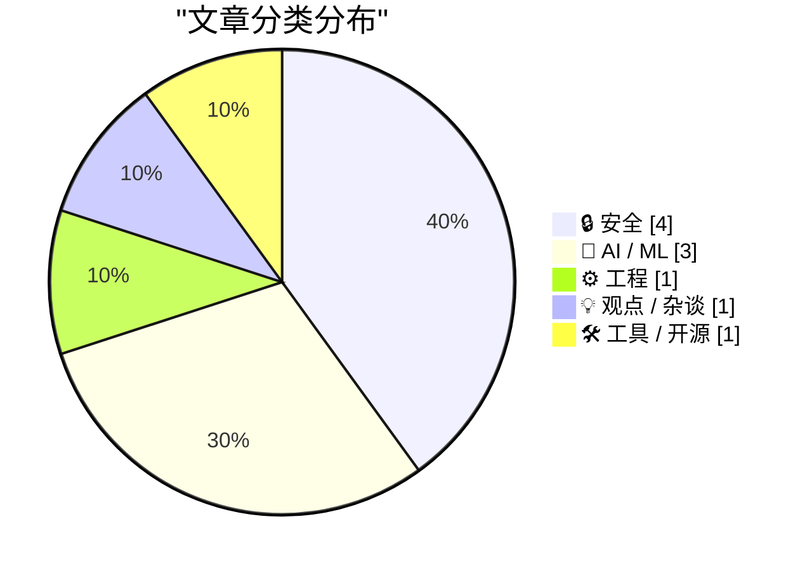
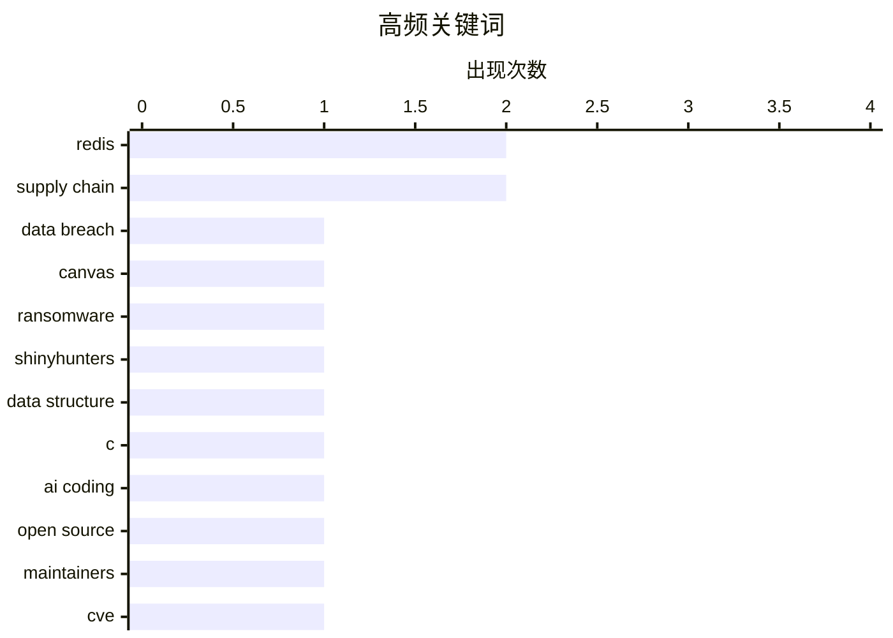

# 📰 AI 博客每日精选 — 2026-04-26

> 来自 Karpathy 推荐的 92 个顶级技术博客，AI 精选 Top 10

## 🏆 今日必读

🥇 **Canvas Breach Disrupts Schools & Colleges Nationwide**

[Canvas Breach Disrupts Schools & Colleges Nationwide](https://krebsonsecurity.com/2026/05/canvas-breach-disrupts-schools-colleges-nationwide/) — krebsonsecurity.com · 2026-05-08 · 🔒 安全

> An ongoing data extortion attack targeting the widely-used education technology platform Canvas disrupted classes and coursework at school districts and universities across the United States today, af

🏷️ data breach, Canvas, ransomware, ShinyHunters

🥈 **Redis array type: short story of a long development**

[Redis array type: short story of a long development](http://antirez.com/news/164) — antirez.com · 2026-05-04 · ⚙️ 工程

> antirez 7 days ago. 135333 views. I started working on the new Array data type for Redis in the first days of January. The PR landed the repository only now, so this code was cooked for four months. I

🏷️ Redis, data structure, C, AI coding

🥉 **Weekend at Bernie’s**

[Weekend at Bernie’s](https://nesbitt.io/2026/05/08/weekend-at-bernies.html) — nesbitt.io · 2026-05-08 · 🔒 安全

> In the 1989 film , two junior employees turn up at their boss’s beach house to find him dead, and spend the rest of the weekend wheeling him around the party with sunglasses on so nobody notices. The 

🏷️ open source, maintainers, CVE, supply chain

---

## 📊 数据概览

| 扫描源 | 抓取文章 | 时间范围 | 精选 |
|:---:|:---:|:---:|:---:|
| 87/92 | 2503 篇 → 268 篇 | 24h | **10 篇** |

### 分类分布



### 高频关键词



<details>
<summary>📈 纯文本关键词图（终端友好）</summary>

```
redis          │ ████████████████████ 2
supply chain   │ ████████████████████ 2
data breach    │ ██████████░░░░░░░░░░ 1
canvas         │ ██████████░░░░░░░░░░ 1
ransomware     │ ██████████░░░░░░░░░░ 1
shinyhunters   │ ██████████░░░░░░░░░░ 1
data structure │ ██████████░░░░░░░░░░ 1
c              │ ██████████░░░░░░░░░░ 1
ai coding      │ ██████████░░░░░░░░░░ 1
open source    │ ██████████░░░░░░░░░░ 1
```

</details>

### 🏷️ 话题标签

**redis**(2) · **supply chain**(2) · **data breach**(1) · canvas(1) · ransomware(1) · shinyhunters(1) · data structure(1) · c(1) · ai coding(1) · open source(1) · maintainers(1) · cve(1) · ai economics(1) · github copilot(1) · pricing(1) · inference cost(1) · voice ai(1) · interaction model(1) · latency(1) · multimodal(1)

---

## 🔒 安全

### 1. Canvas Breach Disrupts Schools & Colleges Nationwide

[Canvas Breach Disrupts Schools & Colleges Nationwide](https://krebsonsecurity.com/2026/05/canvas-breach-disrupts-schools-colleges-nationwide/) — **krebsonsecurity.com** · 2026-05-08 · ⭐ 27/30

> An ongoing data extortion attack targeting the widely-used education technology platform Canvas disrupted classes and coursework at school districts and universities across the United States today, af

🏷️ data breach, Canvas, ransomware, ShinyHunters

---

### 2. Weekend at Bernie’s

[Weekend at Bernie’s](https://nesbitt.io/2026/05/08/weekend-at-bernies.html) — **nesbitt.io** · 2026-05-08 · ⭐ 26/30

> In the 1989 film , two junior employees turn up at their boss’s beach house to find him dead, and spend the rest of the weekend wheeling him around the party with sunglasses on so nobody notices. The 

🏷️ open source, maintainers, CVE, supply chain

---

### 3. Breaking: Autonomous Agents are a Shitshow

[Breaking: Autonomous Agents are a Shitshow](https://garymarcus.substack.com/p/breaking-autonomous-agents-are-a) — **garymarcus.substack.com** · 2026-05-06 · ⭐ 25/30

> Breaking: Autonomous Agents are a Shitshow Brace for chaos Gary Marcus May 05, 2026 282 92 29 Share Remember my essay back in August with Nathan Hamiel LLM + Coding Agents = Security Nightmare? We wer

🏷️ AI agents, security, prompt injection, tool chaining

---

### 4. Package Manager Threat Models

[Package Manager Threat Models](https://nesbitt.io/2026/05/05/package-manager-threat-models.html) — **nesbitt.io** · 2026-05-05 · ⭐ 25/30

> The previous post catalogued the bugs that get filed against package managers: path traversal in the extractor, argument injection in the git driver, XSS in the registry’s README renderer. Things you 

🏷️ package manager, threat model, supply chain, install scripts

---

## 🤖 AI / ML

### 5. AI's Economics Don't Make Sense

[AI's Economics Don't Make Sense](https://www.wheresyoured.at/ais-economics-dont-make-sense/) — **wheresyoured.at** · 2026-04-29 · ⭐ 26/30

> AI's Economics Don't Make Sense Ed Zitron Apr 28, 2026 37 min read Table of Contents If you liked this piece, please subscribe to my premium newsletter. It’s $70 a year, or $7 a month, and in return y

🏷️ AI economics, GitHub Copilot, pricing, inference cost

---

### 6. Thinking Machines and interaction models

[Thinking Machines and interaction models](https://seangoedecke.com/interaction-models/) — **seangoedecke.com** · 2026-05-12 · ⭐ 25/30

> Thinking Machines and interaction models Thinking Machines just released Interaction Models . This is their first real AI model release 1 after a year of work and two billion dollars of capital. What 

🏷️ voice AI, interaction model, latency, multimodal

---

### 7. Pushing Local Models With Focus And Polish

[Pushing Local Models With Focus And Polish](https://lucumr.pocoo.org/2026/5/8/local-models/) — **lucumr.pocoo.org** · 2026-05-08 · ⭐ 25/30

> Armin Ronacher 's Thoughts and Writings blog archive projects travel talks about Pushing Local Models With Focus And Polish written on May 08, 2026 I really, really want local models to work. I want t

🏷️ local-llm, inference, coding-agents, quantization

---

## ⚙️ 工程

### 8. Redis array type: short story of a long development

[Redis array type: short story of a long development](http://antirez.com/news/164) — **antirez.com** · 2026-05-04 · ⭐ 27/30

> antirez 7 days ago. 135333 views. I started working on the new Array data type for Redis in the first days of January. The PR landed the repository only now, so this code was cooked for four months. I

🏷️ Redis, data structure, C, AI coding

---

## 💡 观点 / 杂谈

### 9. Premium: AI's Circular Psychosis

[Premium: AI's Circular Psychosis](https://www.wheresyoured.at/premium-ais-circular-psychosis/) — **wheresyoured.at** · 2026-05-08 · ⭐ 25/30

> Premium: AI's Circular Psychosis Ed Zitron May 8, 2026 33 min read Table of Contents In this week’s free newsletter, I explained how bad the circular AI economy is in the simplest-possible terms : Ant

🏷️ AI economy, Anthropic, cloud, venture capital

---

## 🛠 工具 / 开源

### 10. Redis Array Playground

[Redis Array Playground](https://simonwillison.net/2026/May/4/redis-array/#atom-everything) — **simonwillison.net** · 2026-05-04 · ⭐ 25/30

> Simon Willison’s Weblog Subscribe Sponsored by: WorkOS &mdash; Make your app Enterprise Ready with SSO, SCIM, RBAC, and more. 4th May 2026 Tool Redis Array Playground &mdash; # Redis Array Playground 

🏷️ Redis, WebAssembly, arrays, TRE

---

*生成于 2026-04-26 07:00 | 扫描 87 源 → 获取 2503 篇 → 精选 10 篇*
*基于 [Hacker News Popularity Contest 2025](https://refactoringenglish.com/tools/hn-popularity/) RSS 源列表*
