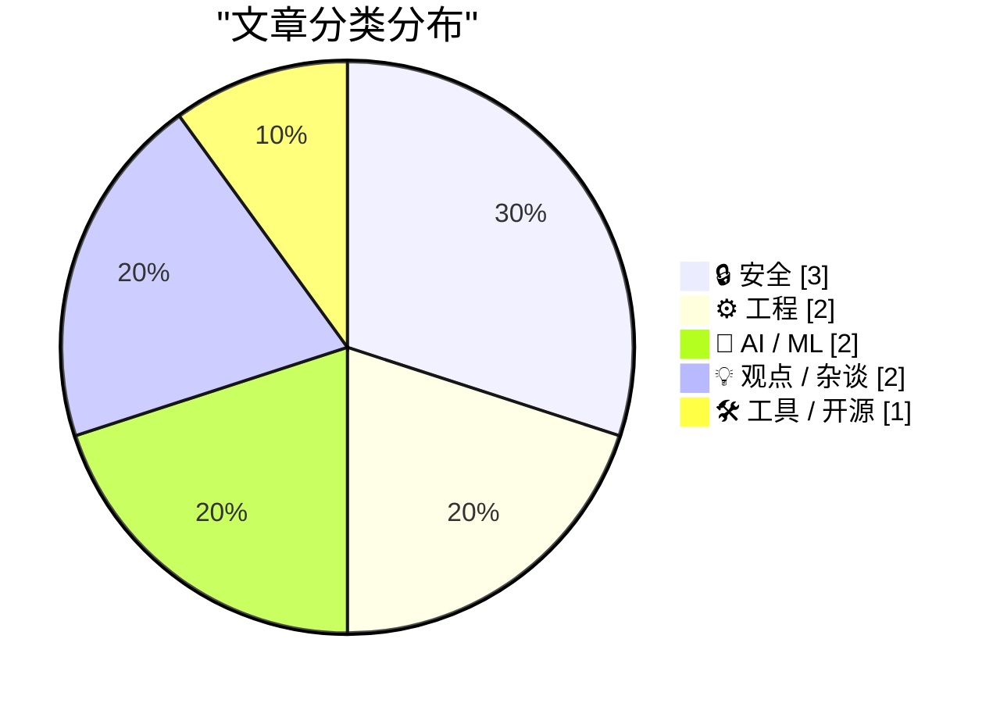
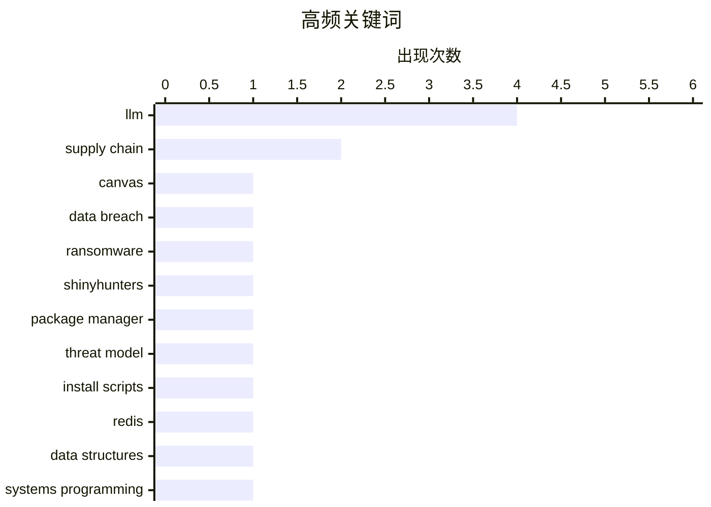

# 📰 AI 博客每日精选 — 2026-04-28

> 来自 Karpathy 推荐的 92 个顶级技术博客，AI 精选 Top 10

## 🏆 今日必读

🥇 **Canvas Breach Disrupts Schools & Colleges Nationwide**

[Canvas Breach Disrupts Schools & Colleges Nationwide](https://krebsonsecurity.com/2026/05/canvas-breach-disrupts-schools-colleges-nationwide/) — krebsonsecurity.com · 2026-05-08 · 🔒 安全

> An ongoing data extortion attack targeting the widely-used education technology platform Canvas disrupted classes and coursework at school districts and universities across the United States today, af

🏷️ Canvas, data breach, ransomware, ShinyHunters

🥈 **Package Manager Threat Models**

[Package Manager Threat Models](https://nesbitt.io/2026/05/05/package-manager-threat-models.html) — nesbitt.io · 2026-05-05 · 🔒 安全

> The previous post catalogued the bugs that get filed against package managers: path traversal in the extractor, argument injection in the git driver, XSS in the registry’s README renderer. Things you 

🏷️ package manager, threat model, supply chain, install scripts

🥉 **Redis array type: short story of a long development**

[Redis array type: short story of a long development](http://antirez.com/news/164) — antirez.com · 2026-05-04 · ⚙️ 工程

> antirez 7 days ago. 135314 views. I started working on the new Array data type for Redis in the first days of January. The PR landed the repository only now, so this code was cooked for four months. I

🏷️ Redis, data structures, systems programming, LLM

---

## 📊 数据概览

| 扫描源 | 抓取文章 | 时间范围 | 精选 |
|:---:|:---:|:---:|:---:|
| 86/92 | 2488 篇 → 247 篇 | 24h | **10 篇** |

### 分类分布



### 高频关键词



<details>
<summary>📈 纯文本关键词图（终端友好）</summary>

```
llm             │ ████████████████████ 4
supply chain    │ ██████████░░░░░░░░░░ 2
canvas          │ █████░░░░░░░░░░░░░░░ 1
data breach     │ █████░░░░░░░░░░░░░░░ 1
ransomware      │ █████░░░░░░░░░░░░░░░ 1
shinyhunters    │ █████░░░░░░░░░░░░░░░ 1
package manager │ █████░░░░░░░░░░░░░░░ 1
threat model    │ █████░░░░░░░░░░░░░░░ 1
install scripts │ █████░░░░░░░░░░░░░░░ 1
redis           │ █████░░░░░░░░░░░░░░░ 1
```

</details>

### 🏷️ 话题标签

**llm**(4) · **supply chain**(2) · **canvas**(1) · data breach(1) · ransomware(1) · shinyhunters(1) · package manager(1) · threat model(1) · install scripts(1) · redis(1) · data structures(1) · systems programming(1) · training(1) · inference(1) · tpu(1) · open source(1) · maintainers(1) · cve(1) · github copilot(1) · usage-based pricing(1)

---

## 🔒 安全

### 1. Canvas Breach Disrupts Schools & Colleges Nationwide

[Canvas Breach Disrupts Schools & Colleges Nationwide](https://krebsonsecurity.com/2026/05/canvas-breach-disrupts-schools-colleges-nationwide/) — **krebsonsecurity.com** · 2026-05-08 · ⭐ 27/30

> An ongoing data extortion attack targeting the widely-used education technology platform Canvas disrupted classes and coursework at school districts and universities across the United States today, af

🏷️ Canvas, data breach, ransomware, ShinyHunters

---

### 2. Package Manager Threat Models

[Package Manager Threat Models](https://nesbitt.io/2026/05/05/package-manager-threat-models.html) — **nesbitt.io** · 2026-05-05 · ⭐ 26/30

> The previous post catalogued the bugs that get filed against package managers: path traversal in the extractor, argument injection in the git driver, XSS in the registry’s README renderer. Things you 

🏷️ package manager, threat model, supply chain, install scripts

---

### 3. Weekend at Bernie’s

[Weekend at Bernie’s](https://nesbitt.io/2026/05/08/weekend-at-bernies.html) — **nesbitt.io** · 2026-05-08 · ⭐ 25/30

> In the 1989 film , two junior employees turn up at their boss’s beach house to find him dead, and spend the rest of the weekend wheeling him around the party with sunglasses on so nobody notices. The 

🏷️ open source, maintainers, CVE, supply chain

---

## ⚙️ 工程

### 4. Redis array type: short story of a long development

[Redis array type: short story of a long development](http://antirez.com/news/164) — **antirez.com** · 2026-05-04 · ⭐ 26/30

> antirez 7 days ago. 135314 views. I started working on the new Array data type for Redis in the first days of January. The PR landed the repository only now, so this code was cooked for four months. I

🏷️ Redis, data structures, systems programming, LLM

---

### 5. Out With the JS, In With the HTML

[Out With the JS, In With the HTML](https://blog.jim-nielsen.com/2026/out-with-js-in-with-html/) — **blog.jim-nielsen.com** · 2026-05-11 · ⭐ 24/30

> Out With the JS, In With the HTML 2026-05-10 #cssViewTransitions I’ve been posting about how you can make lots of HTML pages and leverage navigations over in-page, JS-dependent interactions . Now I’m 

🏷️ HTML, JavaScript, CSS View Transitions, static sites

---

## 🤖 AI / ML

### 6. Reiner Pope – The math behind how LLMs are trained and served

[Reiner Pope – The math behind how LLMs are trained and served](https://www.dwarkesh.com/p/reiner-pope) — **dwarkesh.com** · 2026-04-30 · ⭐ 26/30

> Playback speed × Share post Share post at current time Share from 0:00 0:00 / Transcript 142 5 10 Reiner Pope – The math behind how LLMs are trained and served It's shocking how much you can deduce ab

🏷️ LLM, training, inference, TPU

---

### 7. Thinking Machines and interaction models

[Thinking Machines and interaction models](https://seangoedecke.com/interaction-models/) — **seangoedecke.com** · 2026-05-12 · ⭐ 24/30

> Thinking Machines and interaction models Thinking Machines just released Interaction Models . This is their first real AI model release 1 after a year of work and two billion dollars of capital. What 

🏷️ voice AI, interaction models, latency, real-time

---

## 💡 观点 / 杂谈

### 8. AI's Economics Don't Make Sense

[AI's Economics Don't Make Sense](https://www.wheresyoured.at/ais-economics-dont-make-sense/) — **wheresyoured.at** · 2026-04-29 · ⭐ 25/30

> AI's Economics Don't Make Sense Ed Zitron Apr 28, 2026 37 min read Table of Contents If you liked this piece, please subscribe to my premium newsletter. It’s $70 a year, or $7 a month, and in return y

🏷️ GitHub Copilot, usage-based pricing, AI economics, inference cost

---

### 9. AI makes weak engineers less harmful

[AI makes weak engineers less harmful](https://seangoedecke.com/ai-makes-weak-engineers-less-harmful/) — **seangoedecke.com** · 2026-05-09 · ⭐ 24/30

> AI makes weak engineers less harmful Like other kinds of puzzle-solving, software engineering ability is strongly heavy-tailed. The strongest engineers produce way more useful output than the average,

🏷️ software engineering, LLM, productivity, code review

---

## 🛠 工具 / 开源

### 10. Using LLM in the shebang line of a script

[Using LLM in the shebang line of a script](https://simonwillison.net/2026/May/11/llm-shebang/#atom-everything) — **simonwillison.net** · 2026-05-12 · ⭐ 24/30

> Simon Willison’s Weblog Subscribe Sponsored by: WorkOS &mdash; Make your app Enterprise Ready with SSO, SCIM, RBAC, and more. 11th May 2026 TIL Using LLM in the shebang line of a script &mdash; This c

🏷️ LLM, CLI, shebang, automation

---

*生成于 2026-04-28 07:00 | 扫描 86 源 → 获取 2488 篇 → 精选 10 篇*
*基于 [Hacker News Popularity Contest 2025](https://refactoringenglish.com/tools/hn-popularity/) RSS 源列表*
